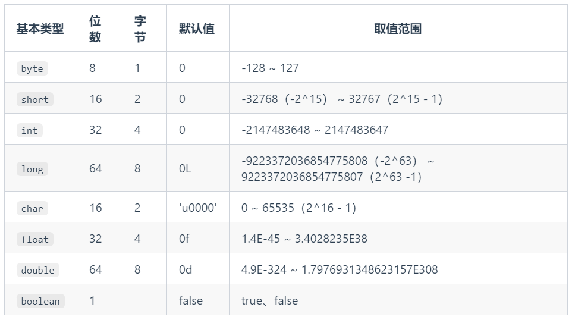
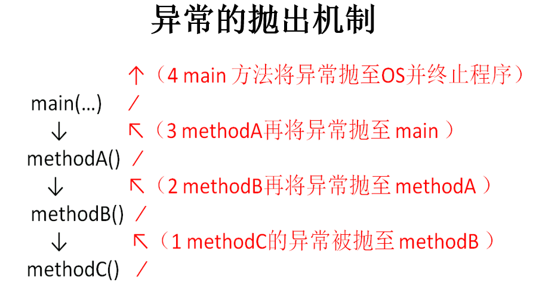

## 数据类型

- **基本数据类型**：`整型`、`浮点型`、`字符型`、`布尔型`。 

- **引用数据类型**：`数组`、 `类`、`接口`、`枚举`、`注解`、`记录`。 




### 自动类型提升

**规则：将取值范围小（或容量小）的类型自动提升为取值范围大（或容量大）的类型 。**

基本数据类型的转换规则如图所示：


（1）当把存储范围小的值（常量值、变量的值、表达式计算的结果值）赋值给了存储范围大的变量时

```java
int i = 'A';// char自动升级为int，其实就是把字符的编码值赋值给i变量了
double d = 10;// int自动升级为double
long num = 1234567; // 右边的整数常量值如果在int范围呢，编译和运行都可以通过，这里涉及到数据类型转换

//byte bigB = 130;// 错误，右边的整数常量值超过byte范围
long bigNum = 12345678912L;// 右边的整数常量值如果超过int范围，必须加L，显式表示long类型。否则编译不通过
```

（2）当存储范围小的数据类型与存储范围大的数据类型变量一起混合运算时，会按照其中最大的类型运算。

```java
int i = 1;
byte b = 1;
double d = 1.0;

double sum = i + b + d;// 混合运算，升级为double
```

（3）当byte,short,char数据类型的变量进行算术运算时，按照int类型处理。

```java
byte b1 = 1;
byte b2 = 2;
byte b3 = b1 + b2;// 编译报错，b1 + b2自动升级为int

char c1 = '0';
char c2 = 'A';
int i = c1 + c2;// 至少需要使用int类型来接收
System.out.println(c1 + c2);// 113 
```

### 强制类型转换

将`3.14` 赋值到`int` 类型变量会发生什么？产生编译失败，肯定无法赋值。

```java
int i = 3.14; // 编译报错
```

想要赋值成功，只有通过`强制类型转换`，将`double` 类型强制转换成`int` 类型才能赋值。

**规则：将取值范围大（或容量大）的类型强制转换成取值范围小（或容量小）的类型。**

> 自动类型提升是Java自动执行的，而强制类型转换是自动类型提升的逆运算，需要我们自己手动执行。

**转换格式：**

```java
数据类型1 变量名 = (数据类型1)被强转数据值;  //()中的数据类型必须<=变量值的数据类型
```

（1）当把存储范围大的值（常量值、变量的值、表达式计算的结果值）强制转换为存储范围小的变量时，可能会`损失精度`或`溢出`。

```java
int i = (int)3.14;//损失精度

double d = 1.2;
int num = (int)d;//损失精度

int i = 200;
byte b = (byte)i;//溢出
```

（2）当某个值想要提升数据类型时，也可以使用强制类型转换。这种情况的强制类型转换是`没有风险`的，通常省略。

```java
int i = 1;
int j = 2;
double bigger = (double)(i/j);
```

（3）声明long类型变量时，可以出现省略后缀的情况。float则不同。

```java
long l1 = 123L;
long l2 = 123;//如何理解呢？ 此时可以看做是int类型的123自动类型提升为long类型

//long l3 = 123123123123; //报错，因为123123123123超出了int的范围。
long l4 = 123123123123L;


//float f1 = 12.3; //报错，因为12.3看做是double，不能自动转换为float类型
float f2 = 12.3F;
float f3 = (float)12.3;
```

### 基本数据类型与String的运算

- String不是基本数据类型，属于引用数据类型
- 使用一对`""`来表示一个字符串，内部可以包含0个、1个或多个字符。
- 声明方式与基本数据类型类似。例如：String str = “你好”;

- 任意八种基本数据类型的数据与String类型只能进行连接“+”运算，且结果一定也是String类型

```java
System.out.println("" + 1 + 2);//12

int num = 10;
boolean b1 = true;
String s1 = "abc";

String s2 = s1 + num + b1;
System.out.println(s2);//abc10true

//String s3 = num + b1 + s1;//编译不通过，因为int类型不能与boolean运算
String s4 = num + (b1 + s1);//编译通过
```

## 运算符

运算符是一种特殊的符号，用以表示数据的运算、赋值和比较等。

运算符的分类：

- 按照`功能`分为：算术运算符、赋值运算符、比较(或关系)运算符、逻辑运算符、位运算符、条件运算符、Lambda运算符

|           分类            |                        运算符                        |
| :-----------------------: | :--------------------------------------------------: |
|     算术运算符（7个）     |                +、-、*、/、%、++、--                 |
|    赋值运算符（12个）     | =、+=、-=、*=、/=、%=、>>=、<<=、>>>=、&=、\|=、^=等 |
| 比较(或关系)运算符（6个） |                 >、>=、<、<=、==、!=                 |
|     逻辑运算符（6个）     |                &、\|、^、!、&&、\|\|                 |
|      位运算符（7个）      |               &、\|、^、~、<<、>>、>>>               |
|     条件运算符（1个）     |               (条件表达式)?结果1:结果2               |
|    Lambda运算符（1个）    |                          ->                          |

* 按照`操作数个数`分为：一元运算符（单目运算符）、二元运算符（双目运算符）、三元运算符 （三目运算符）

|           分类            |                  运算符                  |
| :-----------------------: | :--------------------------------------: |
| 一元运算符（单目运算符）  |    正号（+）、负号（-）、++、--、!、~    |
| 二元运算符（双目运算符）  | 除了一元和三元运算符剩下的都是二元运算符 |
| 三元运算符 （三目运算符） |         (条件表达式)?结果1:结果2         |

### 自加自减运算

- 单独使用

  - 变量在单独运算的时候，变量`前++`和变量`后++`，是没有区别的。
  - 变量`前++`   ：例如 `++a` 。
  - 变量`后++`   ：例如 `a++` 。

- 复合使用

  * 和`其他变量放在一起使用`或者和`输出语句放在一起使用`，`前++`和`后++`就产生了不同。

  - 变量`前++` ：变量先自增1，然后再运算。

  - 变量`后++` ：变量先运算，然后再自增1。

```java
public class ArithmeticTest {
	public static void main(String[] args) {
		// 其他变量放在一起使用
		int x = 3;
		//int y = ++x; // y的值是4，x的值是4，
		int y = x++; // y的值是3，x的值是4
		
		System.out.println(x);
		System.out.println(y);
		System.out.println("==========");
        
		// 和输出语句一起
		int z = 5;
		//System.out.println(++z);// 输出结果是6，z的值也是6
		System.out.println(z++);// 输出结果是5，z的值是6
		System.out.println(z);
        
	} 
}
```

变量和++（或--）谁在前面就先执行谁。

### 赋值运算符

- 当“=”两侧数据类型不一致时，可以使用自动类型转换或使用强制类型转换原则进行处理。

- 支持`连续赋值`，如：a = b = 1；

- 扩展赋值运算符： +=、 -=、*=、 /=、%=

  | 赋值运算符 |                           符号解释                           |
  | :--------: | :----------------------------------------------------------: |
  |    `+=`    | 将符号`左边的值`和`右边的值`进行`相加`操作，最后将结果`赋值给左边的变量` |
  |    `-=`    | 将符号`左边的值`和`右边的值`进行`相减`操作，最后将结果`赋值给左边的变量` |
  |    `*=`    | 将符号`左边的值`和`右边的值`进行`相乘`操作，最后将结果`赋值给左边的变量` |
  |    `/=`    | 将符号`左边的值`和`右边的值`进行`相除`操作，最后将结果`赋值给左边的变量` |
  |    `%=`    | 将符号`左边的值`和`右边的值`进行`取余`操作，最后将结果`赋值给左边的变量` |

```java
public class SetValueTest {
	public static void main(String[] args) {
        //举例说明 += , -=  *=  /=  %= 也是一样的
        short m1 = 10;
        m1 += 5;
        //相当于：
        //m1 = (short)(m1 + 5);
        System.out.println(m1);//15
	}
}
```

+=操作包含了一个强制类型转换，可以保证类型不变。

### 比较(关系)运算符


- 比较运算符的结果都是boolean型，也就是要么是true，要么是false。
- \>   <   >=  <= ：只适用于基本数据类型（除boolean类型之外）
- ==   != ：适用于基本数据类型和引用数据类型

```java
public class CompareTest {
	public static void main(String[] args) {
        // 区分好==和=的区别
        boolean b1 = false;
        if(b1 == true) {
            System.out.println("结果为真");
        } else {
            System.out.println("结果为假"); // 打印这个
        }

        if(b1 = true) {
            System.out.println("结果为真"); // 打印这个
        } else {
            System.out.println("结果为假");
        }

        if(b1 = false) {
            System.out.println("结果为真");
        } else {
            System.out.println("结果为假"); // 打印这个
        }
	}
}
```

== 比较左右两边的值是否相同，= 的作用是赋值，然后的是右边的值。

### 逻辑运算符


- 逻辑运算符，操作的都是boolean类型的变量或常量，而且运算得结果也是boolean类型的值。

- 运算符说明：
  - & 和 &&：表示"且"关系，当符号左右两边布尔值都是true时，结果才能为true。否则，为false。
  - | 和 || ：表示"或"关系，当符号两边布尔值有一边为true时，结果为true。当两边都为false时，结果为false
  - ! ：表示"非"关系，当变量布尔值为true时，结果为false。当变量布尔值为false时，结果为true。
  - ^ ：当符号左右两边布尔值不同时，结果为true。当两边布尔值相同时，结果为false。
    - 理解：异或，相异为真

- 逻辑运算符用于连接布尔型表达式，在Java中不可以写成 3 < x < 6，应该写成x > 3 & x < 6 。


- **区分“&”和“&&”：**

  - 相同点：如果符号左边是true，则二者都执行符号右边的操作

  - 不同点：& （逻辑与）： 如果符号左边是false,则继续执行符号右边的操作

  ​                     && （短路与）：如果符号左边是false,则不再继续执行符号右边的操作

  - &&：短路与，左边为false就不执行右边，有短路的意味，优点是效率更高

  - 建议：开发中，推荐使用 && 

- **区分“|”和“||”：**


  - 相同点：如果符号左边是false，则二者都执行符号右边的操作

  - 不同点：|（逻辑或） ： 如果符号左边是true，则继续执行符号右边的操作

    ​               || （短路或）：如果符号左边是true，则不再继续执行符号右边的操作

  - 建议：开发中，推荐使用 ||

 代码举例：

```java
public class LoginTest {
	public static void main(String[] args) {
		int a = 3;
		int b = 4;
		int c = 5;

        //&和&&的区别
        System.out.println((a > b) & (a++ > c)); 
        System.out.println("a = " + a);
        System.out.println((a > b) && (a++ > c)); 
        System.out.println("a = " + a);
        System.out.println((a == b) && (a++ > c)); 
        System.out.println("a = " + a);
        
        //|和||的区别
        System.out.println((a > b) | (a++ > c)); 
        System.out.println("a = " + a);
        System.out.println((a > b) || (a++ > c)); 
        System.out.println("a = " + a);
        System.out.println((a == b) || (a++ > c)); 
        System.out.println("a = " + a);
        
		// ^ 异或；相同为false，不同为true
		System.out.println((a > b) ^ (a > c));
		System.out.println((a > b) ^ (a < c)); 
		System.out.println((a < b) ^ (a > c)); 
		System.out.println((a < b) ^ (a < c)); 
		System.out.println("===============");
		// ! 非；非false则true，非true则false
		System.out.println(!false);
		System.out.println(!true);
	}
}
```

### 位运算符


位运算符的运算过程都是基于二进制的补码运算。

### 条件运算符

- 条件运算符格式：

```java
(条件表达式)? 表达式1:表达式2
```

- 说明：条件表达式是boolean类型的结果，根据boolean的值选择表达式1或表达式2

  

- 如果运算后的结果赋给新的变量，要求表达式1和表达式2为同种或兼容的类型。

```java
public class ConditionExer1 {
    public static void main(String[] args) {
        //获取两个数的较大值
        int m1 = 10;
        int m2 = 20;

        int max = (m1 > m2)? m1 : m2;
        System.out.println("m1和m2中的较大值为" + max);
    }
}
```

与if-else的转换关系

- 凡是可以使用条件运算符的地方，都可以改写为if-else结构。


- 开发中，如果既可以使用条件运算符，又可以使用if-else，推荐使用条件运算符。因为执行效率稍高。

```java
//if-else实现获取两个数的较大值

int m1 = 10;
int m2 = 20;

int max;//声明变量max，用于记录m1和m2的较大值

if(m1 > m2){
    max = m1;
}else{
    max = m2;
}

System.out.println(max);
```

### 运算符优先级

运算符有不同的优先级，所谓优先级就是在表达式运算中的运算符顺序。

上一行中的运算符总是优先于下一行的。

| 优先级 |    运算符说明    |             Java运算符             |
| ------ | :--------------: | :--------------------------------: |
| 1      |       括号       |          `()`、`[]`、`{}`          |
| 2      |      正负号      |              `+`、`-`              |
| 3      |    单元运算符    |       `++`、`--`、`~`、`！`        |
| 4      | 乘法、除法、求余 |           `*`、`/`、`%`            |
| 5      |    加法、减法    |              `+`、`-`              |
| 6      |    移位运算符    |         `<<`、`>>`、`>>>`          |
| 7      |    关系运算符    | `<`、`<=`、`>=`、`>`、`instanceof` |
| 8      |    等价运算符    |             `==`、`!=`             |
| 9      |      按位与      |                `&`                 |
| 10     |     按位异或     |                `^`                 |
| 11     |      按位或      |                `|`                 |
| 12     |      条件与      |                `&&`                |
| 13     |      条件或      |                `||`                |
| 14     |    三元运算符    |               `? :`                |
| 15     |    赋值运算符    | `=`、`+=`、`-=`、`*=`、`/=`、`%=`  |
| 16     |   位赋值运算符   |  `&=`、`|=`、`<<=`、`>>=`、`>>>=`  |

> 建议：
>
> 1. 不要过多的依赖运算的优先级来控制表达式的执行顺序，这样可读性太差，尽量`使用()来控制`表达式的执行顺序。
> 2. 不要把一个表达式写得过于复杂，如果一个表达式过于复杂，则把它`分成几步`来完成。

## 流程控制语句

- 流程控制语句是用来控制程序中各`语句执行顺序`的语句。
- 程序设计中规定的`三种`流程结构，即：
  - **顺序结构**
    - 程序从上到下逐行地执行，中间没有任何判断和跳转。
  - **分支结构**
    - 根据条件，选择性地执行某段代码。
    - 有`if…else`和`switch-case`两种分支语句。
  - **循环结构**
    - 根据循环条件，重复性的执行某段代码。
    - 有`for`、`while`、`do-while`三种循环语句。
    - JDK5.0 提供了`foreach`循环，遍历集合、数组元素更方便

### 顺序结构

顺序结构就是程序`从上到下逐行`地执行。表达式语句都是顺序执行的。


````java
public class StatementTest{
	public static void main(String[] args){
		int x = 1;
		int y = 2;
		System.out.println("x = " + x);		
        System.out.println("y = " + y);	
    }
}
````

#### if-else条件判断结构

**格式：**

```java
if (条件表达式1) {
  	语句块1;
} else if (条件表达式2) {
  	语句块2;
}
...
}else if (条件表达式n) {
 	语句块n;
} else {
  	语句块n+1;
}
```

条件表达式必须是布尔表达式（关系表达式或逻辑表达式）或 布尔变量。

**执行流程图：**


**案例：**

```
成绩为100分时，奖励一辆跑车；
成绩为(80，99]时，奖励一辆山地自行车；
当成绩为[60,80]时，奖励环球影城一日游；
其它时，胖揍一顿。

默认成绩是在[0,100]范围内.
```

```java
public class Test {
    public static void main(String[] args) {
        int score = 67;
        if (score == 100) {
            System.out.println("奖励跑车");
        } else if (score > 80) {
            System.out.println("奖励自行车");
        } else if (score > 60) {
            System.out.println("一日游");
        } else {
            System.out.println("胖揍一顿");
        }
    }
}
```

####  switch-case选择结构

**格式：**

```java
switch(表达式){
    case 常量值1:
        语句块1;
        //break;
    case 常量值2:
        语句块2;
        //break; 
    // ...
   [default:
        语句块n+1;
        break;
   ]
}
```

**执行流程图：**


**使用注意点：**

- switch(表达式)中表达式的值必须是下述几种类型之一：byte，short，char，int，枚举 (jdk 5.0)，String (jdk 7.0)；
- case子句中的值必须是常量，不能是变量名或不确定的表达式值或范围；
- 同一个switch语句，所有case子句中的常量值互不相同；
- break语句用来在执行完一个case分支后使程序跳出switch语句块；
- 如果执行完case之后，没有遇到break，则会继续执行当前case之后的其它case中的执行语句。--->case穿透
- default子句是可选的。同时，位置也是灵活的。当没有匹配的case时，执行default语句。

**案例：**

```java
public class Test {
    public static void main(String[] args) {
        String season = "summer";
        switch (season) {
            case "spring":
                System.out.println("春意盎然");
                break;
            case "summer":
                System.out.println("夏至未至");
                break;
            case "autumn":
                System.out.println("秋高气爽");
                break;
            case "winner":
                System.out.println("大冬天");
                break;
            default:
                System.out.println("未知季节");
        }
    }
}
```

**利用case穿透：**

在switch语句中，如果case匹配上来，但是后面不写break，就会出现穿透现象，即不会判断下一个case的值，直接执行case的后面的语句，直到遇到break或者整个switch语句结束，执行终止。

**案例：**根据月份获取季节

```java
public class Test {
    public static void main(String[] args) {
        Scanner input = new Scanner(System.in);
        System.out.println("请输入月份：");
        int month = input.nextInt();
        switch (month) {
            case 12:
            case 1:
            case 2:
                System.out.println("冬天");
                break;
            case 3:
            case 4:
            case 5:
                System.out.println("春天");
                break;
            case 6:
            case 7:
            case 8:
                System.out.println("夏天");
                break;
            case 9:
            case 10:
            case 11:
                System.out.println("秋天");
                break;
            default:
                System.out.println("月份有误");
                break;
        }
        input.close();
    }
}
```

#### if-else与switch-case使用场景

关键在于判断的条件：

- 表示范围用 if
- 表示是否等于某个常量值用 switch

如果既可以用 if 也可以哟个 switch，建议用 switch 因为效率稍微较高。

### 循环结构

循环结构就是在满足某些条件的情况下，反复执行一段代码。

####  for循环

**语法格式：**


```java
for (①初始化部分; ②循环条件部分; ④迭代部分)｛
         	③循环体部分;
｝
```

**执行过程：**①-②-③-④-②-③-④-②-③-④-.....-②

**执行流程图：**


**说明：**

- for(;;)中的两个；不能多也不能少
- ①初始化部分可以声明多个变量，但必须是同一个类型，用逗号分隔
- ②循环条件部分为boolean类型表达式，当值为false时，退出循环
- ④可以有多个变量更新，用逗号分隔

**案例：**输出5行hello

```java
public class Test {
    public static void main(String[] args) {
        for (int i = 0; i < 5; i++) {
            System.out.println("hello");
        }
    }
}
```

#### while循环

**语法格式：**

```java
①初始化部分
while(②循环条件部分)｛
    ③循环体部分;
    ④迭代部分;
}
```

**执行过程：**①-②-③-④-②-③-④-②-③-④-...-②

**执行流程图：**


**说明：**

- while(循环条件)中循环条件必须是boolean类型。
- 注意不要忘记声明④迭代部分。否则，循环将不能结束，变成死循环。
- for循环和while循环可以相互转换。二者没有性能上的差别。实际开发中，根据具体结构的情况，选择哪个格式更合适、美观。
- for循环与while循环的区别：初始化条件部分的作用域不同。

**案例：**输出5行hello

```java
public class Test {
    public static void main(String[] args) {
        int i = 1;
        while (i <= 5) {
            System.out.println("hello");
            i++;
        }
    }
}
```

#### do-while循环

**语法格式：**

```java
①初始化部分;
do{
	③循环体部分
	④迭代部分
}while(②循环条件部分); 
```

**执行过程：**①-③-④-②-③-④-②-③-④-...-②

**执行流程图：**


**说明：**

- 结尾while(循环条件)中循环条件必须是boolean类型
- do{}while();最后有一个分号
- do-while结构的循环体语句是至少会执行一次，这是和for和while是不一样的地方
- 循环的三个结构for、while、do-while三者是可以相互转换的。

**案例：**体会至少循环一次

```java
public class Test {
    public static void main(String[] args) {
        int i = 5;
        do {
            System.out.println("hello");
            i--;
        } while (i > 5);
    }
}
```

#### 对比三种循环语句

- **三种循环语句都具有四个要素：**
  - 循环变量的初始化条件
  - 循环条件
  - 循环体语句块
  - 循环变量的修改的迭代表达式

* **从循环次数角度分析**
  * do-while循环至少执行一次循环体语句。
  * for和while循环先判断循环条件语句是否成立，然后决定是否执行循环体。
* **如何选择**
  * 遍历有明显的循环次数（或范围）的需求，选择for循环
  * 遍历没有明显的循环次数（或范围）的需求，选择while循环
  * 如果循环体语句块至少执行一次，可以考虑使用do-while循环
  * 本质上：三种循环之间完全可以互相转换，都能实现循环的功能

- **无限循环**
  - 最简单"无限"循环格式：`while(true)` , `for(;;)` 
  - 开发中，有时并不确定需要循环多少次，需要根据循环体内部某些条件，来控制循环的结束（使用break）。

- 嵌套循环
  - 嵌套循环是指一个循环结构A的循环体是另一个循环结构B
  - 实际开发中，一般见到的嵌套循环是两层，最多不会超过三层，如果超过三层需要重新梳理解决方案，否则可读性很差。

#### break和continue

|          | 适用范围              | 作用                                         |
| -------- | --------------------- | -------------------------------------------- |
| break    | 循环结构、switch-case | 一旦执行，就结束当前循环结构                 |
| continue | 循环结构              | 一旦执行，就结束本轮循环，继续执行下一轮循环 |

```java
public class Test {
    public static void main(String[] args) {
        for (int i = 0; i < 10; i++) {
            if (i % 4 == 0) {
                break;
            }
            System.out.print(i + " ");
        }
    }
}
```

第一轮时直接结束循环，什么都没打印。

```java
public class Test {
    public static void main(String[] args) {
        for (int i = 0; i < 10; i++) {
            if (i % 4 == 0) {
                continue;
            }
            System.out.print(i + " ");
        }
    }
}
```

打印：1 2 3 5 6 7 9 

## 泛型

泛型是一种在编译时期进行类型检查和类型安全的机制，它可以让我们编写更加通用和可复用的代码。

泛型，可以理解为“参数化类型”，把类型当作参数，类型以调用者传入的类型为准。

泛型只在编译阶段有效。

**泛型的作用：**

1.提供类型检查机制，使类型步一致问题，提前到编译期，使得开发者能更早发现问题

2.使用泛型类、泛型接口、泛型方法，可以编写更加通用的代码，例如：ArrayList

### 案例

```java
List arrayList = new ArrayList();
arrayList.add("aaaa");
arrayList.add(100);

for(int i = 0; i< arrayList.size();i++){
    String item = (String)arrayList.get(i);
    Log.d("泛型测试","item = " + item);
}
```

毫无疑问会报错：

```java
java.lang.ClassCastException: java.lang.Integer cannot be cast to java.lang.String
```

ArrayList 可以存放任意类型，例子中添加了一个 String 类型，添加了一个 Integer 类型，再使用时都以 String 的方式使用，因此程序崩溃了。为了解决这种由于类型不一致而产生的问题（在编译阶段就可以解决），泛型应运而生。

将第一行声明初始化 list 的代码更改一下，编译器会在编译阶段就能够帮我们发现类似这样的问题。

```java
List<String> arrayList = new ArrayList<String>();
...
//arrayList.add(100); 在编译阶段，编译器就会报错
```

### 泛型类

泛型类型用于类的定义中，被称为泛型类。通过泛型可以完成对一组类的操作对外开放相同的接口。最典型的就是各种容器类，如：List、Set、Map。

模板：

```java
class 类名称 <泛型标识：可以随便写任意标识号，标识指定的泛型的类型>{
  private 泛型标识 /*（成员变量类型）*/ var; 
  .....

  }
}
```

例子：

```java
//此处T可以随便写为任意标识，常见的如T、E、K、V等形式的参数常用于表示泛型
//在实例化泛型类时，必须指定T的具体类型
public class Generic<T>{ 
    //key这个成员变量的类型为T,T的类型由外部指定  
    private T key;

    public Generic(T key) { //泛型构造方法形参key的类型也为T，T的类型由外部指定
        this.key = key;
    }

    public T getKey(){ //泛型方法getKey的返回值类型为T，T的类型由外部指定
        return key;
    }
}
```

```java
//泛型的类型参数只能是类类型（包括自定义类），不能是简单类型
//传入的实参类型需与泛型的类型参数类型相同，即为Integer.
Generic<Integer> genericInteger = new Generic<Integer>(123456);

//传入的实参类型需与泛型的类型参数类型相同，即为String.
Generic<String> genericString = new Generic<String>("key_vlaue");
```

定义的泛型类，就一定要传入泛型类型实参么？并是一定要传入泛型类型的实参，如果不传入泛型类型实参的话，在泛型类中使用泛型的方法或成员变量定义的类型可以为任何的类型。

```java
Generic generic = new Generic("111111");
Generic generic1 = new Generic(4444);
Generic generic2 = new Generic(55.55);
Generic generic3 = new Generic(false);

System.out.println("泛型测试：key is " + generic.getKey());
System.out.println("泛型测试：key is " + generic1.getKey());
System.out.println("泛型测试：key is " + generic2.getKey());
System.out.println("泛型测试：key is " + generic3.getKey());
```

```
泛型测试: key is 111111
泛型测试: key is 4444
泛型测试: key is 55.55
泛型测试: key is false
```

注意：

- 泛型的类型参数只能是类类型，不能是简单类型。
- 不能对确切的泛型类型使用 instanceof 操作。如下面的操作是非法的，编译时会出错。

```java
　if(ex_num instanceof Generic<Number>){ 
  }
```

### 泛型接口

泛型接口与泛型类的定义及使用基本相同。泛型接口常被用在各种类的生产器中，可以看一个例子：

```java
//定义一个泛型接口
public interface Generator<T> {
    public T next();
}
```

当实现泛型接口时，泛型接口未传入泛型实参，实现类的泛型声明要和泛型接口保持一致：

```java
/**
 * 未传入泛型接口的实参时，实现类的泛型声明要和泛型接口保持一致
 * 即：class FruitGenerator<T> implements Generator<T>{
 * 如果不声明泛型，如：class FruitGenerator implements Generator<T>，编译器会报错："Unknown class"
 */
class FruitGenerator<T> implements Generator<T>{
    @Override
    public T next() {
        return null;
    }
}
```

当实现泛型接口时，泛型接口有传入泛型实参，实现类中，所有使用泛型的地方都要替换成传入的实参类型：

```java
/**
 * 传入泛型实参时：
 * 在实现类实现泛型接口时，如已将泛型类型传入实参类型，则所有使用泛型的地方都要替换成传入的实参类型
 * 即：Generator<T>，public T next();中的的T都要替换成传入的String类型。
 */
public class FruitGenerator implements Generator<String> {

    private String[] fruits = new String[]{"Apple", "Banana", "Pear"};

    @Override
    public String next() {
        Random rand = new Random();
        return fruits[rand.nextInt(3)];
    }
}
```

### 泛型方法

泛型类型用于方法的定义中，被称为泛型方法。泛型方法，是在调用方法的时候指明泛型的具体类型 。

```java
/**
 * 泛型方法的基本介绍
 * @param tClass 传入的泛型实参
 * @return T 返回值为T类型
 * 说明：
 *     1）public 与 返回值中间<T>非常重要，可以理解为声明此方法为泛型方法。
 *     2）只有声明了<T>的方法才是泛型方法，泛型类中的使用了泛型的成员方法并不是泛型方法。
 *     3）<T>表明该方法将使用泛型类型T，此时才可以在方法中使用泛型类型T。
 *     4）与泛型类的定义一样，此处T可以随便写为任意标识，常见的如T、E、K、V等形式的参数常用于表示泛型。
 */
public <T> T genericMethod(Class<T> tClass)throws InstantiationException ,
  IllegalAccessException{
        T instance = tClass.newInstance();
        return instance;
}
```

例子：

```java
public class GenericTest {
    
   //这个类是个泛型类，在上面已经介绍过
   public class Generic<T>{     
        private T key;

        public Generic(T key) {
            this.key = key;
        }

        //虽然在方法中使用了泛型，但是这并不是一个泛型方法。
        //这只是类中一个普通的成员方法，只不过他的返回值是在声明泛型类已经声明过的泛型。
        public T getKey(){
            return key;
        }
    }

    /** 
     * 这才是一个真正的泛型方法。
     * 首先在public与返回值之间的<T>必不可少，这表明这是一个泛型方法，并且声明了一个泛型T
     * 这个T可以出现在这个泛型方法的任意位置
     * 泛型的数量也可以为任意多个 
     *    如：public <T,K> K showKeyName(Generic<T> container){
     *        ...
     *        }
     */
    public <T> T showKeyName(Generic<T> container){
        System.out.println("container key :" + container.getKey());
        T key = container.getKey();
        return key;
    }

    //这也不是一个泛型方法，这就是一个普通的方法，只是使用了Generic<Number>这个泛型类做形参而已。
    public void showKeyValue1(Generic<Number> obj){
        Log.d("泛型测试","key value is " + obj.getKey());
    }
}
```

```java
public class GenericFruit {
    class Fruit{
        @Override
        public String toString() {
            return "fruit";
        }
    }

    class Apple extends Fruit{
        @Override
        public String toString() {
            return "apple";
        }
    }

    class Person{
        @Override
        public String toString() {
            return "Person";
        }
    }

    class GenerateTest<T>{
        public void show_1(T t){
            System.out.println(t.toString());
        }

        // 泛型类的泛型作用域是整个类，泛型方法的泛型作用域是所在的方法，注意泛型的标识不要重复
        // 如果标识符和泛型类的标识T重复，在方法中以方法声明的为准，虽然不会报错，但是不推荐这样做
        public <E> void show_3(E t){
            System.out.println(t.toString());
        }
    }

    public static void main(String[] args) {
        Apple apple = new Apple();
        Person person = new Person();

        GenerateTest<Fruit> generateTest = new GenerateTest<Fruit>();
        //apple是Fruit的子类，所以这里可以
        generateTest.show_1(apple);
        //编译器会报错，因为泛型类型实参指定的是Fruit，而传入的实参类是Person
        //generateTest.show_1(person);

        //使用这两个方法都可以成功
        generateTest.show_2(apple);
        generateTest.show_2(person);

        //使用这两个方法也都可以成功
        generateTest.show_3(apple);
        generateTest.show_3(person);
    }
}
```

泛型方法结合可变参数的例子：

```java
public <T> void printMsg( T... args){
    for(T t : args){
        System.out.println("泛型测试：t is " + t);
    }
}
```

**静态方法与泛型：**

静态方法无法访问类上定义的泛型，所以静态方法要使用泛型的话，必须将静态方法定义成泛型方法 。

```java
public class StaticGenerator<T> {
    ....
    ....
    /**
     * 静态方法不能使用泛型类中已经声明过的泛型
     * 如：public static void show(T t){..},此时编译器会提示错误信息：
          "StaticGenerator cannot be refrenced from static context"
     */
    public static <T> void show(T t){

    }
}
```

### 泛型通配符

`Ingeter`是`Number`的一个子类，那么问题来了，在使用`Generic<Number>`作为形参的方法中，能否使用`Generic<Ingeter>`的实例传入呢？在逻辑上类似于`Generic<Number>`和`Generic<Ingeter>`是否可以看成具有父子关系的泛型类型呢？

为了弄清楚这个问题，使用`Generic<T>`这个泛型类继续看下面的例子：

```java
public void showKeyValue1(Generic<Number> obj){
    System.out.println("泛型测试：key value is " + obj.getKey());
}
```

```java
Generic<Integer> gInteger = new Generic<Integer>(123);
Generic<Number> gNumber = new Generic<Number>(456);

showKeyValue(gNumber);

// showKeyValue这个方法编译器会为我们报错：Generic<java.lang.Integer> 
// cannot be applied to Generic<java.lang.Number>
// showKeyValue(gInteger);
```

通过提示信息我们可以看到`Generic<Integer>`不能被看作为`Generic<Number>`的子类，是不同的类型参数，不能兼容。

回到上面的例子，如何解决上面的问题？总不能为了定义一个新的方法来处理`Generic<Integer>`类型的类，这样会冗余代码，需要一种方式来兼容`Generic<Integer>`和`Generic<Number>`，因此类型通配符应运而生。

可以将上面的方法改一下：

```java
public void showKeyValue1(Generic<?> obj){
   System.out.println("泛型测试：key value is " + obj.getKey());
}
```

类型通配符一般是使用“？”，表示未知类型，表示可以传入任意类型。

**泛型上下边界：**

在使用泛型的时候，我们还可以为传入的泛型类型实参进行上下边界的限制，如：类型实参只准传入某种类型的父类或某种类型的子类。

为泛型添加上边界，即传入的类型必须是指定的类型及其子类：

```java
public void showKeyValue1(Generic<? extends Number> obj){
   System.out.println("泛型测试","key value is " + obj.getKey());
}
```

```java
Generic<String> generic1 = new Generic<String>("11111");
Generic<Integer> generic2 = new Generic<Integer>(2222);
Generic<Float> generic3 = new Generic<Float>(2.4f);
Generic<Double> generic4 = new Generic<Double>(2.56);

//这一行代码编译器会提示错误，因为String类型并不是Number类型的子类
//showKeyValue1(generic1);

showKeyValue1(generic2);
showKeyValue1(generic3);
showKeyValue1(generic4);
```

如果把泛型类的定义也改一下:

```java
public class Generic<T extends Number>{
    private T key;

    public Generic(T key) {
        this.key = key;
    }

    public T getKey(){
        return key;
    }
}
```

```java
//这一行代码也会报错，因为String不是Number的子类
Generic<String> generic1 = new Generic<String>("11111");
```

为泛型添加下边界用 super：

````java
public <T super Integer> void process(List<T> list) {
    // 在这里 T 必须是 Integer 类型或其父类型
}
````

必须在泛型声明时添加上下边界：

```java
//public <T> T showKeyName(Generic<T extends Number> container)，编译器会报错："Unexpected bound"
public <T extends Number> T showKeyName(Generic<T> container){
    System.out.println("container key :" + container.getKey());
    T test = container.getKey();
    return test;
}
```

## 面向对象

面向对象是一种编程思想，面向对象的三大基本特征是封装、继承、多态。

面向对象的编程思想就是把事物看作一个整体，从事物的特征（属性）和行为（方法）两个方面进行描述。

面向对象的过程就是找对象、建立对象、使用对象、维护对象的关系的过程。

### 抽象

所谓的抽象，就是把同一类事物中共有的特征(属性)和行为(功能、方法)进行抽取，归纳，总结。

抽象的过程其实就是面向对象编程的核心思想。

### 封装

在 Java 中，封装是指将数据（属性）和相关方法隐藏在一个类中，对外部提供公共的接口来访问和操作这些数据。

封装的主要目的是隐藏内部实现细节，通过定义访问修饰符（如 private、default（缺省）、protected、public）来控制对数据的访问权限，以保证数据的安全性和一致性。

封装的作用：

- 提高代码的可维护性和可扩展性。
- 隐藏内部细节，保护数据的安全性。
- 提供统一的接口来操作数据，减少错误和提高代码的可读性。
- 可以对数据进行控制和校验，确保数据的有效性。

封装的例子：

1.通过访问限制符修改类中属性的可见性，从而限制对类中属性的访问。

```java
 public class Person {
    private String name;
    private int age;
}
```

这段代码中，将 name 和 age 属性设置为私有的，只能本类才能访问，其他类都访问不了，如此就对信息进行了隐藏。

2.对每个值属性提供对外访问的公共方法，说白了也就是创建一对赋值取值的方法，来提供外部程序对类中的私有属性进行访问。

```java
public class Person {
    private String name;
    private int age;
     
    public void setage(int age){
     this.age = age;
	}
	public int getage(){
     return age;
	}
	public void setname(String name){
     this.name = name;
	}
	public String getname(){
     return name;
	}
}
```

### 继承

在 Java 中，继承是面向对象编程的一个重要概念，它允许一个类（称为子类或派生类）继承另一个类（称为父类或基类）的属性和方法。通过继承，子类可以重用父类的代码，并且可以扩展或修改父类的功能。

Java 中的继承使用关键字 `extends` 来实现，子类通过继承父类来获取其非私有成员（属性和方法），包括公共（public）、受保护（protected）和默认（无修饰符）访问级别的成员。

继承的特点：

- 子类可以继承父类的非私有成员（属性和方法）。
- 子类可以重写（Override）父类的方法，以实现自己的特定行为。
- 子类可以添加新的成员（属性和方法）。
- 子类可以通过 `super` 关键字调用父类的构造方法和方法。
- 子类只能继承一个父类

子类访问父类：

- 子类可以访问父类的公共（public）和受保护（protected）成员。
- 如果父类成员使用默认（无修饰符）访问级别，则子类必须在同一包内才能访问。
- 子类不能直接访问父类的私有（private）成员，但可以通过父类的公共或受保护方法间接访问。

`super` 关键字：

- `super` 关键字用于引用父类的成员，包括属性、方法和构造方法。
- 可以使用 `super()` 调用父类的构造方法。
- 在方法中使用 `super.methodName()` 调用父类的方法。

继承的作用：

1. 代码重用：继承允许子类继承父类的属性和方法，这样可以避免重复编写相同的代码。子类可以直接使用父类已经定义好的功能，从而提高代码的复用性和可维护性。
2. 扩展性：通过继承，我们可以在已有的类基础上创建新的类，将新的功能添加到子类中。子类可以在父类的基础上进行修改和扩展，以满足特定需求，而不需要修改原始的父类代码。这种扩展性使得程序更加灵活和可扩展。
3. 多态性：继承是实现多态性的基础。通过多态性，我们可以使用父类类型的引用来引用子类对象，从而实现对不同子类对象的统一处理。这样可以提高代码的灵活性和可扩展性，并且使得代码更容易理解和维护。
4. 方法重写：子类可以重写（Override）父类的方法，以适应子类自身的特定需求。通过方法重写，子类可以改变继承自父类的方法的行为，实现多态性和个性化的定制。

使用模板：

```java
public class 子类名称 extends 父类名称{
    //... 
}
```

例子：

父类: Employee.java

```java
//定义一个父类:员工
public class Employee {
    public void method(){
        System.out.println("方法已执行!");
    }
}
```

子类 :Assistant.java

```java
//定义一个子类:助教
public class Assistant extends Employee {  //助教类继承了员工类
}
```

继承中成员变量的访问特点：

在父子类的继承关系当中，如果成员变量重名，则创建子类对象时，访问有两种方式：

1.直接通过子类对象访问成员变量：等号左边是谁，就优先用谁，没有则向上找

2.间接通过成员方法访问成员变量：该方法属于谁，就优先用谁，没有则向上找

```java
public class Father {
    int numFather = 20;
    int num = 200;

    public void fatherMethod(){
        System.out.println(num);
    }
}
```

```java
public class Son extends Father {
    int numSon = 30;
    int num = 300;
    public void sonMethod(){
        System.out.println(num);
    }
}
```

```java
/*
      在父子类的继承关系当中,如果成员变量重名,则创建子类对象时,访问有两种方式
      　　1.直接通过子类对象访问成员变量
              等号左边是谁,就优先用谁,没有则向上找
         2.间接通过成员方法访问成员变量
         　　　该方法属于谁,就优先用谁,没有则向上找.
 */
public class Demo2ExtendsField {
    public static void main(String[] args) {
        //创建父类对象
        Father father=new Father();
        System.out.println(father.numFather);    //只能使用父类的东西,没有任何子类内容,20
        System.out.println("==================");
        //创建子类对象
        Son son=new Son();
        System.out.println(son.numSon);    //30
        //等号左边是谁,就优先用谁,没有则向上找
        System.out.println(son.num);      //300
        System.out.println(father.num);      //200
//        System.out.println(son.abc);      //这个abc子类没有,父类也没有,会编译报错

        //这个方法是子类的,优先用子类的,没有再向上找
        son.sonMethod();
        //这个方法是在父类当中定义的
        father.fatherMethod();
    }
}
```

继承后变量重名解决：

1.本类的成员变量： this.成员变量名

2.父类的成员变量：super.成员变量名

```java
public class Father {
    int num = 10;   //父类中成员变量
}
```

```java
public class Son extends Father{
    int num = 20;
    public void method(){
        int num = 30;
        System.out.println(num);        //访问局部变量
        System.out.println(this.num);   //访问本类的成员变量
        System.out.println(super.num);  //访问父类的成员变量
    }
}
```

方法的重写：

在继承关系当中，子类重写在父类中方法的名称一样，参数列表也一样的方法

特点：创建的是子类对象，则优先用子类对象

方法覆盖重写的注意事项：

　　1.必须保证父子类之间方法的名称相同，参数列表也相同。@Override：写在方法前面，用来检测是不是有效的正确覆盖重写，这个注释不写只要满足要求也是正确的，最好写因为可以提醒自己

　　 2.子类方法的返回值必须小于等于父类方法的返回值范围

　　 3.子类方法的权限必须大于等于父类方法的权限修饰符，public > protected > (default) > private 

继承中构造方法的访问特点：

继承关系中，父子类构造方法的访问特点:

1.子类构造方法当中有一个默认隐含的"super()"调用，所以一定是先调用的父类构造，后执行的子类构造，不写会自动添加

2.子类构造可以通过super关键字来调用父类重载构造

3.super的父类构造调用，必须是子类构造方法的第一个语句；不能一个子类构造调用多次super构造

总结: 子类必须调用父类构造方法，不写则自动添加；写了则用写的指定的super调用，super只能有一个，还必须是第一个

```java
public class Father {
    public  Father(){
        System.out.println("父类无参的构造方法");
    }
    public  Father(int num){
        System.out.println("父类有参的构造方法");
    }
}

//Son.java 子类
public class Son extends Father {
    public Son(){
        super(10);
//      super();  错误写法
        System.out.println("子类的构造方法");
//      super();  必须是第一个
    }
}
```

```java
public class Demo1Constructor {
    public static void main(String[] args) {
        Son son=new Son();
    }
}
```

```java
//输出结果
父类有参的构造方法
子类的构造方法
```

子父类的执行顺序：

父类的静态方法、子类的静态方法、父类的代码块、父类的构造方法、子类的代码块、子类的构造方法

重点：

1.先静态

2.先父类，后子类

3.先代码块，后构造方法

### 多态

Java 多态是面向对象编程的一个重要概念，它允许使用父类类型的引用来引用子类对象，从而实现对不同子类对象的统一处理。多态性有助于提高代码的灵活性、可扩展性和可维护性。

多态性的核心思想是，一个对象可以表现出多种形态。具体来说，在Java中实现多态性的方式是通过继承和方法重写。

当一个父类引用指向一个子类对象时，可以根据引用的类型调用相应的方法。这意味着，通过父类的引用，可以调用子类重写的方法，而不需要知道具体的子类类型。

多态的作用：

1. **统一接口：**多态性允许使用父类类型的引用来引用子类对象，从而实现对不同子类对象的统一处理。通过定义统一的接口（父类），可以使得代码更加简洁和可读，同时可以降低代码的耦合度。
2. **代码复用：**通过多态性，可以将公共的代码逻辑封装在父类中，避免在每个子类中重复编写相同的代码。这样可以提高代码的可维护性和可复用性。
3. **可扩展性：**当需要添加新的子类时，不需要修改现有的代码，只需要添加新的子类并保证其符合父类接口即可。这样可以降低代码的修改成本，增加系统的可扩展性。
4. **运行时确定方法调用：**多态性允许在运行时根据对象的实际类型（而不是引用类型）确定调用哪个方法。这样可以实现动态绑定，提高代码的灵活性和可扩展性。
5. **多态参数和返回类型：**通过多态性，可以将子类对象作为参数传递给接受父类类型参数的方法，或者将子类对象作为父类类型返回。这样可以增加代码的灵活性和可复用性。

多态的例子：

````java
public class Animal {
    public String name = "animal";

    public void eat() {
        System.out.println("动物吃东西！");
    }

    public void run() {
        System.out.println("动物在奔跑！");
    }
}

public class Tiger extends Animal {
    public String name = "tiger";

    @Override
    public void eat() {
        System.out.println("虎吃鸡！");
    }
    
    @Override
    public void run() {
		System.out.println("虎奔跑！");
	}
}

public class Snake extends Animal {
    public String name = "snake";
    
    @Override
    public void eat() {
        System.out.println("蛇吃鼠！");
    }

	@Override
    public void run() {
		System.out.println("蛇爬行！");
	}
}
````

 ````java
1.多态成员变量：编译检查的时候检查Animal类中是否有此变量定义
		Animal tiger = new Tiger(); 

		System.out.println("name = " + tiger.name);

	上述打印输出结果为： name = Animal

2.使用多态调用成员方法：编译时检查左边类型，运行时实际调用右边对象

    	Animal snake = new Snake();

    	System.out.println(sanke.eat()); 
    	
 实际类型是Snake, 所以运行时调用的是Snake中重写后的方法。打印输出结果为： 蛇吃鼠！

 ````

**多态的特性：**

成员方法：编译看左边，运行看右边

成员变量：编译运行都看左边

静态方法：编译运行都看左边

子类的同名的类变量、静态方法、静态变量不会覆盖父类，编译和运行时都是以父类（左边）为准；只有成员方法会特别一点，编译时看父类（左边）有没有这个方法，然后运行时调用子类（右边）的方法。

## 异常

在使用计算机语言进行项目开发的过程中，即使程序员把代码写得`尽善尽美`，在系统的运行过程中仍然会遇到一些问题，因为很多问题不是靠代码能够避免的，比如：`客户输入数据的格式问题`，`读取文件是否存在`，`网络是否始终保持通畅`等等。

* **异常** ：指的是程序在执行过程中，出现的非正常情况，如果不处理最终会导致JVM的非正常停止。

> 异常指的并不是语法错误和逻辑错误。语法错了，编译不通过，不会产生字节码文件，根本不能运行。
>
> 代码逻辑错误，只是没有得到想要的结果，例如：求a与b的和，你写成了a-b

Java异常类的层次结构图：


**Throwable**：所有的异常都是从Throwable继承而来的，是所有所有错误与异常的超类。Throwable包含了其线程创建时线程执行堆栈的快照，它提供了 printStackTrace()等接口用于获取堆栈跟踪数据等信息。而Throwable体系下包含有两个子类，Error（错误）和Exception（异常），它们通常用于指示发生了异常情况。

**Error**：Error类及其子类。程序中无法处理的错误，表示运行应用程序中出现了严重的错误。大多数错误与代码编写者执行的操作无关，而是表示代码运行时 JVM出现的问题。

**Exception**：Exception 是另外一个非常重要的异常子类。程序本身可以捕获并且可以处理异常。这类异常一旦出现，我们就要对代码进行更正，修复程序。Exception这种异常又分为两类：运行时异常和编译时异常。 

**运行时异常**：RuntimeException 类及其子类异常，如NullPointerException （空指针异常）、IndexOutOfBoundsException （下目标越界异常）等，表示 JVM在运行期间可能出现的异常。

运行时异常的特点：Java编译器不会检查它，也就是说，当程序中出现这类异常时，也会编译通过。        

**非运行时异常 （编译异常）**：Exception中除 RuntimeException 及其子类之外的异常。

**受检异常**：编译器要求必须处理得异常，Exception中除 RuntimeException 及其子类之外的异常，也就是**非运行时期异常，属于受检异常。**

**非受检异常**：编译器不会进行检查并且不要求必须处理的异常，包括运行时异常（RuntimeException 及其子类）和错误（ Error），RuntimeException 发生的时候，表示程序中出现了编程错误，所以应该找出错误修改程序，而不是去捕获RuntimeException 。

### 异常处理

Java采用的异常处理机制，是`将异常处理的程序代码集中在一起`，与正常的程序代码分开，使得程序简洁、优雅，并易于维护。

**Java异常处理的方式：**

方式一（捕获异常）：try-catch-finally

方式二（声明异常）：throws + 异常类型

### 捕获异常（try-catch-finally）

Java提供了异常处理的**抓抛模型**。

- Java程序的执行过程中如出现异常，会生成一个异常类对象，该异常对象将被提交给Java运行时系统，这个过程称为`抛出(throw)异常`。
- 如果一个方法内抛出异常，该异常对象会被抛给调用者方法中处理。如果异常没有在调用者方法中处理，它继续被抛给这个调用方法的上层方法。这个过程将一直继续下去，直到异常被处理。这一过程称为`捕获(catch)异常`。
- 如果一个异常回到main()方法，并且main()也不处理，则程序运行终止。

#### try-catch-finally基本格式

捕获异常语法如下：

~~~java
try{
	......	//可能产生异常的代码
}
catch( 异常类型1 e ){
	......	//当产生异常类型1型异常时的处置措施
}
catch( 异常类型2 e ){
	...... 	//当产生异常类型2型异常时的处置措施
}  
finally{
	...... //无论是否发生异常，都无条件执行的语句
} 

~~~

**1、整体执行过程：**

当某段代码可能发生异常，不管这个异常是编译时异常（受检异常）还是运行时异常（非受检异常），我们都可以使用try块将它括起来，并在try块下面编写catch分支尝试捕获对应的异常对象。

- 如果在程序运行时，try块中的代码没有发生异常，那么catch所有的分支都不执行。
- 如果在程序运行时，try块中的代码发生了异常，根据异常对象的类型，将从上到下选择第一个匹配的catch分支执行。此时try中发生异常的语句下面的代码将不执行，而整个try...catch之后的代码可以继续运行。
- 如果在程序运行时，try块中的代码发生了异常，但是所有catch分支都无法匹配（捕获）这个异常，那么JVM将会终止当前方法的执行，并把异常对象“抛”给调用者。如果调用者不处理，程序就挂了。


**2、try**

- 捕获异常的第一步是用`try{…}语句块`选定捕获异常的范围，将可能出现异常的业务逻辑代码放在try语句块中。

**3、catch (Exceptiontype e)**

- catch分支，分为两个部分，catch()中编写异常类型和异常参数名，{}中编写如果发生了这个异常，要做什么处理的代码。

- 如果明确知道产生的是何种异常，可以用该异常类作为catch的参数；也可以用其父类作为catch的参数。

  比如：可以用ArithmeticException类作为参数的地方，就可以用RuntimeException类作为参数，或者用所有异常的父类Exception类作为参数。但不能是与ArithmeticException类无关的异常，如NullPointerException（catch中的语句将不会执行）。

- 每个try语句块可以伴随一个或多个catch语句，用于处理可能产生的不同类型的异常对象。

- 如果有多个catch分支，并且多个异常类型有父子类关系，必须保证小的子异常类型在上，大的父异常类型在下。否则，报错。

- catch中常用异常处理的方式

  - `public String getMessage()`：获取异常的描述信息，返回字符串

  - `public void printStackTrace()`：打印异常的跟踪栈信息并输出到控制台。包含了异常的类型、异常的原因、还包括异常出现的位置，在开发和调试阶段，都得使用printStackTrace()。

  

#### 使用举例

举例1：

```java
public class IndexOutExp {
    public static void main(String[] args) {
        String friends[] = { "lisa", "bily", "kessy" };
        try {
            for (int i = 0; i < 5; i++) {
            System.out.println(friends[i]);
            }
        } catch (ArrayIndexOutOfBoundsException e) {
            System.out.println("index err");
        }
        System.out.println("\nthis is the end");
    }
}

```

举例2：

```java
public class DivideZero1 {
    int x;
    public static void main(String[] args) {
        int y;
        DivideZero1 c = new DivideZero1();
        try {
            y = 3 / c.x;
        } catch (ArithmeticException e) {
            System.out.println("divide by zero error!");
        }
        System.out.println("program ends ok!");
    }
}
```

举例3：

```java
@Test
public void test1(){
	try{
		String str1 = "atguigu.com";
		str1 = null;
		System.out.println(str1.charAt(0));
	}catch(NullPointerException e){
		//异常的处理方式1
		System.out.println("不好意思，亲~出现了小问题，正在加紧解决...");	
	}catch(ClassCastException e){
		//异常的处理方式2
		System.out.println("出现了类型转换的异常");
	}catch(RuntimeException e){
		//异常的处理方式3
		System.out.println("出现了运行时异常");
	}
	//此处的代码，在异常被处理了以后，是可以正常执行的
	System.out.println("hello");
}
```

举例4：

```java

```

#### finally使用及举例


- 因为异常会引发程序跳转，从而会导致有些语句执行不到。而程序中有一些特定的代码无论异常是否发生，都`需要执行`。例如，数据库连接、输入流输出流、Socket连接、Lock锁的关闭等，这样的代码通常就会放到finally块中。所以，我们通常将一定要被执行的代码声明在finally中。

  - 唯一的例外，使用 System.exit(0) 来终止当前正在运行的 Java 虚拟机。

- 不论在try代码块中是否发生了异常事件，catch语句是否执行，catch语句是否有异常，catch语句中是否有return，finally块中的语句都会被执行。

- finally语句和catch语句是可选的，但finally不能单独使用。

  ```java
  try{
       
  }finally{
      
  } 
  ```

举例1：确保资源关闭

```java
import java.util.InputMismatchException;
import java.util.Scanner;

public class TestFinally {
    public static void main(String[] args) {
        Scanner input = new Scanner(System.in);
        try {
            System.out.print("请输入第一个整数：");
            int a = input.nextInt();
            System.out.print("请输入第二个整数：");
            int b = input.nextInt();
            int result = a/b;
            System.out.println(a + "/" + b +"=" + result);
        } catch (InputMismatchException e) {
            System.out.println("数字格式不正确，请输入两个整数");
        }catch (ArithmeticException e){
            System.out.println("第二个整数不能为0");
        } finally {
            System.out.println("程序结束，释放资源");
            input.close();
        }
    }
    
    @Test
    public void test1(){
        FileInputStream fis = null;
        try{
            File file = new File("hello1.txt");
            fis = new FileInputStream(file);//FileNotFoundException
            int b = fis.read();//IOException
            while(b != -1){
                System.out.print((char)b);
                b = fis.read();//IOException
            }

        }catch(IOException e){
            e.printStackTrace();
        }finally{
            try {
                if(fis != null)
                    fis.close();//IOException
            } catch (IOException e) {
                e.printStackTrace();
            }	
        }
    }
}
```

举例2：从try回来

```java
public class FinallyTest1 {
    public static void main(String[] args) {
        int result = test("12");
        System.out.println(result);
    }

    public static int test(String str){
        try{
            Integer.parseInt(str);
            return 1;
        }catch(NumberFormatException e){
            return -1;
        }finally{
            System.out.println("test结束");
        }
    }
}
```

举例3：从catch回来

```java
public class FinallyTest2 {
    public static void main(String[] args) {
        int result = test("a");
        System.out.println(result);
    }

    public static int test(String str) {
        try {
            Integer.parseInt(str);
            return 1;
        } catch (NumberFormatException e) {
            return -1;
        } finally {
            System.out.println("test结束");
        }
    }
}
```

举例4：从finally回来

```java
public class FinallyTest3 {
    public static void main(String[] args) {
        int result = test("a");
        System.out.println(result);
    }

    public static int test(String str) {
        try {
            Integer.parseInt(str);
            return 1;
        } catch (NumberFormatException e) {
            return -1;
        } finally {
            System.out.println("test结束");
            return 0;
        }
    }
}
```

笔试题：

```java
public class ExceptionTest {
    public static void main(String[] args) {
        int result = test();
        System.out.println(result); //100
    }

    public static int test(){
        int i = 100;
        try {
            return i;
        } finally {
            i++;
        }
    }
}
```

### 声明抛出异常类型（throws）

- 如果在编写方法体的代码时，某句代码可能发生某个`编译时异常`，不处理编译不通过，但是在当前方法体中可能`不适合处理`或`无法给出合理的处理方式`，则此方法应`显示地`声明抛出异常，表明该方法将不对这些异常进行处理，而由该方法的调用者负责处理。

  

- 具体方式：在方法声明中用`throws语句`可以声明抛出异常的列表，throws后面的异常类型可以是方法中产生的异常类型，也可以是它的父类。

#### throws基本格式

**声明异常格式：**

~~~
修饰符 返回值类型 方法名(参数) throws 异常类名1,异常类名2…{   }	
~~~

在throws后面可以写多个异常类型，用逗号隔开。

举例：

```java
public void readFile(String file)  throws FileNotFoundException,IOException {
	...
	// 读文件的操作可能产生FileNotFoundException或IOException类型的异常
	FileInputStream fis = new FileInputStream(file);
    //...
}

```

#### throws 使用举例

**举例：针对于编译时异常**

```java
package com.atguigu.keyword;

public class TestThrowsCheckedException {
    public static void main(String[] args) {
        System.out.println("上课.....");
        try {
            afterClass();//换到这里处理异常
        } catch (InterruptedException e) {
            e.printStackTrace();
            System.out.println("准备提前上课");
        }
        System.out.println("上课.....");
    }

    public static void afterClass() throws InterruptedException {
        for(int i=10; i>=1; i--){
            Thread.sleep(1000);//本来应该在这里处理异常
            System.out.println("距离上课还有：" + i + "分钟");
        }
    }
}

```

**举例：针对于运行时异常：**

throws后面也可以写运行时异常类型，只是运行时异常类型，写或不写对于编译器和程序执行来说都没有任何区别。如果写了，唯一的区别就是调用者调用该方法后，使用try...catch结构时，IDEA可以获得更多的信息，需要添加哪种catch分支。

~~~java
package com.atguigu.keyword;

import java.util.InputMismatchException;
import java.util.Scanner;

public class TestThrowsRuntimeException {
    public static void main(String[] args) {
        Scanner input = new Scanner(System.in);
        try {
            System.out.print("请输入第一个整数：");
            int a = input.nextInt();
            System.out.print("请输入第二个整数：");
            int b = input.nextInt();
            int result = divide(a,b);
            System.out.println(a + "/" + b +"=" + result);
        } catch (ArithmeticException | InputMismatchException e) {
            e.printStackTrace();
        } finally {
            input.close();
        }
    }

    public static int divide(int a, int b)throws ArithmeticException{
        return a/b;
    }
}

~~~

#### 方法重写中throws的要求

方法重写时，对于方法签名是有严格要求的。复习：

```
（1）方法名必须相同
（2）形参列表必须相同
（3）返回值类型
	- 基本数据类型和void：必须相同
	- 引用数据类型：<=
（4）权限修饰符：>=，而且要求父类被重写方法在子类中是可见的
（5）不能是static，final修饰的方法
```

此外，对于throws异常列表要求：

- 如果父类被重写方法的方法签名后面没有 “throws  编译时异常类型”，那么重写方法时，方法签名后面也不能出现“throws  编译时异常类型”。
- 如果父类被重写方法的方法签名后面有 “`throws  编译时异常类型`”，那么重写方法时，throws的编译时异常类型必须 <= 被重写方法throws的编译时异常类型，或者不throws编译时异常。
- 方法重写，对于“`throws 运行时异常类型`”没有要求。

```java
package com.atguigu.keyword;

import java.io.IOException;

class Father{
    public void method()throws Exception{
        System.out.println("Father.method");
    }
}
class Son extends Father{
    @Override
    public void method() throws IOException,ClassCastException {
        System.out.println("Son.method");
    }
}
```

### 两种异常处理方式的选择

前提：对于异常，使用相应的处理方式。此时的异常，主要指的是编译时异常。

- 如果程序代码中，涉及到资源的调用（流、数据库连接、网络连接等），则必须考虑使用try-catch-finally来处理，保证不出现内存泄漏。
- 如果父类被重写的方法没有throws异常类型，则子类重写的方法中如果出现异常，只能考虑使用try-catch-finally进行处理，不能throws。
- 开发中，方法a中依次调用了方法b,c,d等方法，方法b,c,d之间是递进关系。此时，如果方法b,c,d中有异常，我们通常选择使用throws，而方法a中通常选择使用try-catch-finally。

### 手动抛出异常对象：throw

Java 中异常对象的生成有两种方式：

- 由虚拟机**自动生成**：程序运行过程中，虚拟机检测到程序发生了问题，那么针对当前代码，就会在后台自动创建一个对应异常类的实例对象并抛出。

- 由开发人员**手动创建**：`new 异常类型([实参列表]);`，如果创建好的异常对象不抛出对程序没有任何影响，和创建一个普通对象一样，但是一旦throw抛出，就会对程序运行产生影响了。

#### 使用格式

~~~java
throw new 异常类名(参数);
~~~

throw语句抛出的异常对象，和JVM自动创建和抛出的异常对象一样。

- 如果是编译时异常类型的对象，同样需要使用throws或者try...catch处理，否则编译不通过。

- 如果是运行时异常类型的对象，编译器不提示。

- 可以抛出的异常必须是Throwable或其子类的实例。下面的语句在编译时将会产生语法错误：

  ```java
  throw new String("want to throw");
  ```

#### 使用注意点：

无论是编译时异常类型的对象，还是运行时异常类型的对象，如果没有被try..catch合理的处理，都会导致程序崩溃。

throw语句会导致程序执行流程被改变，throw语句是明确抛出一个异常对象，因此它`下面的代码将不会执行`。

如果当前方法没有try...catch处理这个异常对象，throw语句就会`代替return语句`提前终止当前方法的执行，并返回一个异常对象给调用者。

~~~java
public class TestThrow {
    public static void main(String[] args) {
        try {
            System.out.println(max(4,2,31,1));
        } catch (Exception e) {
            e.printStackTrace();
        }
        try {
            System.out.println(max(4));
        } catch (Exception e) {
            e.printStackTrace();
        }
        try {
            System.out.println(max());
        } catch (Exception e) {
            e.printStackTrace();
        }
    }

    public static int max(int... nums){
        if(nums == null || nums.length==0){
            throw new IllegalArgumentException("没有传入任何整数，无法获取最大值");
        }
        int max = nums[0];
        for (int i = 1; i < nums.length; i++) {
            if(nums[i] > max){
                max = nums[i];
            }
        }
        return max;
    }
}
~~~

### 自定义异常

Java中不同的异常类，分别表示着某一种具体的异常情况。那么在开发中总是有些异常情况是核心类库中没有定义好的，此时我们需要根据自己业务的异常情况来定义异常类。例如年龄负数问题，考试成绩负数问题，某员工已在团队中等。

#### 如何自定义异常类

（1）要继承一个异常类型

​			自定义一个编译时异常类型：自定义类继承`java.lang.Exception`。

​			自定义一个运行时异常类型：自定义类继承`java.lang.RuntimeException`。

（2）建议提供至少两个构造器，一个是无参构造，一个是(String message)构造器。

（3）自定义异常需要提供`serialVersionUID`

#### 注意点

1. 自定义的异常只能通过throw抛出。
2. 自定义异常最重要的是异常类的名字和message属性。当异常出现时，可以根据名字判断异常类型。比如：`TeamException("成员已满，无法添加"); `、 `TeamException("该员工已是某团队成员");`

3. 自定义异常对象只能手动抛出。抛出后由try..catch处理，也可以甩锅throws给调用者处理。

#### 举例

```java
class MyException extends Exception {
    static final long serialVersionUID = 23423423435L;

    public MyException() {}
 
    public MyException(String message) {
        super(message);
    }
}
```

## 数组

数组(Array)，是多个相同类型数据按一定顺序排列的集合，并使用一个名字命名，并通过编号的方式对这些数据进行统一管理。


**数组的特点：**

- 数组本身是`引用数据类型`，而数组中的元素可以是`任何数据类型`，包括基本数据类型和引用数据类型。
- 创建数组对象会在内存中开辟一整块`连续的空间`。占据的空间的大小，取决于数组的长度和数组中元素的类型。
- 数组中的元素在内存中是依次紧密排列的，有序的。
- 数组，一旦初始化完成，其长度就是确定的。数组的`长度一旦确定，就不能修改`。
- 我们可以直接通过下标(或索引)的方式调用指定位置的元素，速度很快。
- 数组名中引用的是这块连续空间的首地址。
- 每个数组都有一个属性length指明它的长度，例如：arr.length 指明数组arr的长度(即元素个数)
- 下标从[0]开始，下标范围是[0, 数组的长度-1]，即[0, 数组名.length-1]

**数组的分类：**

1、按照元素类型分：

- 基本数据类型元素的数组：每个元素位置存储基本数据类型的值
- 引用数据类型元素的数组：每个元素位置存储对象

2、按照维度分：

- 一维数组：存储一组数据
- 二维数组：存储多组数据，相当于二维表，一行代表一组数据

### 数组的初始化

**静态初始化：**

- 在数组变量的初始化时，同时对数组赋值，称为静态初始化。

- 静态初始化，本质是用静态数据（编译时已知）为数组初始化。此时数组的长度由静态数据的个数决定。

- 静态初始化格式：

```java
int[] arr1 = new int[]{1,2,3,4,5};//正确
int[] arr2 = {1,2,3,4,5};//正确

int[] arr3;
arr3 = new int[]{1,2,3,4,5};//正确

int[] arr = new int[5]{1,2,3,4,5};//错误的，后面有{}指定元素列表，就不需要在[]中指定元素个数了。
int[] arr4;
arr4 = {1,2,3,4,5};//错误
```

**动态初始化：**

- 数组变量的初始化时指明数组的长度，并且不对数组赋值，称为动态初始化。
- 动态初始化中，只确定了元素的个数（即数组的长度），而元素值此时只是默认值，还并未真正赋自己期望的值。数据需要后续单独一个一个赋值。

- 动态初始化格式：

```java
int[] arr1 = new int[5];//正确

int[] arr2;
arr2 = new int[5];//正确
```

### 常用操作

访问和修改：

````java
int[] arr = {10, 20, 30, 40, 50};
int element = arr[2]; // 访问数组第三个元素（索引为 2）
arr[3] = 100; // 修改数组中的第四个元素
````

遍历：

````java
int[] arr = {1, 2, 3, 4, 5};
for (int i = 0; i < arr.length; i++) {
    System.out.println(arr[i]);
}

// 使用增强型 for 循环
for (int num : arr) {
    System.out.println(num);
}
````

排序：

````java
int[] arr = {3, 1, 4, 1, 5, 9, 2, 6};
Arrays.sort(arr); // 对数组进行升序排序
````

查找某个元素的索引：

````java
int[] arr = {1, 2, 3, 4, 5};
int index = Arrays.binarySearch(arr, 3); // 在已排序的数组中查找元素 3 的索引
````

拷贝：

````java
int[] source = {1, 2, 3, 4, 5};
int[] target1 = Arrays.copyOf(source, source.length); // 使用 Arrays.copyOf() 进行数组拷贝

int[] target2 = new int[source.length];
System.arraycopy(source, 0, target2, 0, source.length); // 使用 System.arraycopy() 进行数组拷贝
````

数组转字符串：

````java
int[] arr = {1, 2, 3, 4, 5};
String arrString = Arrays.toString(arr); // 将数组转换成字符串
System.out.println(arrString); // 输出数组内容
````

### 练习

```java
// 首位交换数据 1,2,3,4,5
int[] arr = {1, 2, 3, 4, 5};
for (int i = 0, j = arr.length - 1; i < j; i++, j--) {
    int temp = arr[i];
    arr[i] = arr[j];
    arr[j] = temp;
}
System.out.println(Arrays.toString(arr));
```

```java
// 打乱数据 1 - 5
int[] arr = {1, 2, 3, 4, 5};
Random r = new Random();
// 打乱原理：遍历一遍，随机交换元素，循环中用随机数生成下标，然后交换
for (int i = 0; i < arr.length; i++) {
    int temp = arr[i];
    int index = r.nextInt(arr.length);
    arr[i] = arr[index];
    arr[index] = temp;
}
// 打印打乱后的数组
System.out.println(Arrays.toString(arr));
```

```java
// 打印101 - 200 之间的素数
// 已知信息：素数就是质数，只有1和他本身两个因数的数是质数，因数是能整除他本身的数
// 分析：质数是只能被1和他本身整除，2 到 他本身-1 的数都不能整除
for (int i = 101; i <= 200; i++) {
    // 写在循环里面，就不用恢复现场了
    boolean flag = true;
    // 循环内 再循环2到本身-1，判断是否整除，如果都不能整除则就是质数，然后打印
    for (int j = 2; j < i; j++) {
        // 只要有一个数能整除就不是素数，因此结束循环
        if (i % j == 0){
            flag = false;
            break;
        }
    }
    if (flag) {
        System.out.println(i + "是素数");
    }
}
```

## 常用集合

### ArrayList

在 Java 中，ArrayList 是一种动态数组，它提供了比普通数组更多的功能和灵活性。与普通数组不同，ArrayList 的大小是可以动态改变的，可以根据需要动态添加或删除元素。

#### 实现原理

1. 数据存储：ArrayList 内部使用一个 Object 类型的数组来存储元素。数组的长度会根据容量的需要进行动态调整。
2. 随机访问和索引操作：由于 ArrayList 使用数组作为底层实现，可以通过索引快速访问和修改元素。通过索引读取或修改元素的时间复杂度为 O(1)。
3. 初始容量和扩容：当创建一个新的 ArrayList 对象时，会分配一个初始容量的数组，通常为 10。如果元素数量超过了当前容量，ArrayList 会自动进行扩容，通常将容量增加为原来的 1.5 倍。
4. 元素添加和删除：当向 ArrayList 添加元素时，它会将元素放入数组的末尾，并将元素数量加一。如果数组容量不足，会触发扩容操作。当从 ArrayList 删除元素时，它会将后续元素向前移动填补删除的位置，并将元素数量减一。
5. 动态调整数组大小：ArrayList 支持动态调整数组大小，当数组容量不足或删除元素后，它可以自动进行扩容或收缩。扩容时，会创建一个更大的数组，并将原始数组的元素复制到新数组中。收缩时，会创建一个较小的数组，并将元素复制到新数组中。这种动态调整数组大小的机制使得 ArrayList 可以高效地处理变动的元素数量。

#### 常用方法

| 方法                                 | 描述                                                         |
| ------------------------------------ | ------------------------------------------------------------ |
| `boolean add(E element)`             | 将指定的元素添加到列表的末尾。                               |
| `void add(int index, E element)`     | 在指定的索引位置插入指定的元素。                             |
| `boolean remove(Object obj)`         | 从列表中删除指定的元素。                                     |
| `E remove(int index)`                | 删除指定索引位置的元素，并返回被删除的元素。                 |
| `E get(int index)`                   | 返回指定索引位置的元素。                                     |
| `E set(int index, E element)`        | 替换指定索引位置的元素，并返回原来的元素。                   |
| `int size()`                         | 返回列表中的元素个数。                                       |
| `boolean isEmpty()`                  | 如果列表中没有元素，则返回 `true`。                          |
| `void clear()`                       | 从列表中移除所有的元素。                                     |
| `boolean contains(Object obj)`       | 如果列表包含指定的元素，则返回 `true`。                      |
| `int indexOf(Object obj)`            | 返回第一次出现指定元素的索引，如果列表中不包含该元素，则返回 -1。 |
| `int lastIndexOf(Object obj)`        | 返回最后一次出现指定元素的索引，如果列表中不包含该元素，则返回 -1。 |
| `void sort(Comparator<? super E> c)` | 根据指定的比较器对列表进行排序。                             |
| `Object[] toArray()`                 | 返回一个包含列表中所有元素的数组。                           |

#### 使用案例

添加元素：

```java
ArrayList<String> list = new ArrayList<>();
list.add("Apple");
list.add("Banana");
list.add("Orange");
System.out.println(list); // 输出: [Apple, Banana, Orange]
```

获取元素：

```java
String element = list.get(1);
System.out.println(element); // 输出: Banana
```

修改元素：

```java
list.set(0, "Grape");
System.out.println(list); // 输出: [Grape, Banana, Orange]
```

删除元素：

```java
list.remove(2);
System.out.println(list); // 输出: [Grape, Banana]
```

获取列表大小：

```java
int size = list.size();
System.out.println(size); // 输出: 2
```

检查是否为空：

```java
boolean isEmpty = list.isEmpty();
System.out.println(isEmpty); // 输出: false
```

检查是否包含元素：

```java
boolean contains = list.contains("Apple");
System.out.println(contains); // 输出: false
```

清空列表：

```java
list.clear();
System.out.println(list); // 输出: []
```

### HashMap

HashMap 是 Java 中常用的哈希表实现，它提供了一种高效的键值对存储和检索机制。

#### 特性

1. 桶数组 + 链表 + 红黑树：HashMap内部使用一个桶数组来存储键值对，每个桶位置可能存储一个或多个键值对。当多个键的哈希码映射到同一个桶位置时，HashMap会使用链表或红黑树来处理哈希冲突。
   - JDK8及以上：当同一个桶位置的链表长度大于等于8，且数组长度大于等于64，链表将转换为红黑树；当红黑树的节点数小于等于6，红黑树退化为链表。这样可以在保证较高查找效率的同时，减小内存占用。
5. 元素的插入流程：
   1. 首先用key的哈希值经过扰动函数得到新的哈希值，目的是让哈希值分布更均匀一些，减少哈希冲突
   2. 然后使用哈希值计算该键值对在哈希表中的索引(index)，具体的计算方法是：index = hash & (table.length - 1)
   3. 接着，在哈希表的索引位置处判断是否已经存在，如果存在，则判断键的哈希码是否相同，若相同才会用 equals() 方法判断是否为true，若都相同，则说明是相同的键，用新的值将替换旧的值，若有一个不同，则说发生了哈希冲突，使用链地址法解决哈希冲突。
6. 解决哈希冲突（两个不同的键映射到了相同的桶位置）：
   1. 发生了哈希冲突之后，用链地址法解决哈希冲突，即用链表存储冲突的元素。
   2. 如果桶数组上已有链表或红黑树，则进行遍历，若找到了有键相同的键值对，则直接覆盖，若都不相同，则添加到末尾。
   3. 若链表长度大于等于8，且数组长度大于等于64，链表将转换为红黑树；当红黑树的节点数小于等于6，红黑树退化为链表。
7. 元素的检索流程：
   1. 根据待检索元素的键，通过哈希函数计算哈希值。
   2. 使用哈希值定位到对应的桶（数组中的元素）。
   3. 如果桶为空，则表示哈希表中没有与待检索键对应的元素，检索失败。
   4. 如果桶不为空，则需要进一步查找。如果该桶中的元素是链表或红黑树，则会进行遍历，如果找到与待检索键相等的键值对节点，则返回对应的值，检索成功。
   5. 如果没有找到与待检索键相等的键值对节点，则表示哈希表中没有与待检索键对应的元素，检索失败。

#### 常用方法

1. `put(key, value)`：将指定的键值对存储到HashMap中，如果已经存在相同的键，则会替换对应的值。
2. `get(key)`：根据键获取对应的值，如果键不存在则返回null。
3. `remove(key)`：根据键移除对应的键值对。
4. `containsKey(key)`：判断HashMap中是否包含指定的键。
5. `containsValue(value)`：判断HashMap中是否包含指定的值。
6. `size()`：返回HashMap中键值对的数量。
7. `isEmpty()`：判断HashMap是否为空。
8. `clear()`：清空HashMap中的所有键值对。
9. `keySet()`：返回HashMap中所有键构成的Set集合。
10. `values()`：返回HashMap中所有值构成的Collection集合。
11. `entrySet()`：返回HashMap中所有键值对构成的Set集合。

#### 使用案例

创建一个新的`HashMap`对象：

```java
HashMap<String, Integer> map = new HashMap<>();
```

添加键值对到`HashMap`：

```java
map.put("Apple", 10);
map.put("Banana", 5);
map.put("Orange", 8);
```

获取指定键对应的值：

```java
int value = map.get("Apple");
System.out.println("Apple对应的值为: " + value);
```

检查`HashMap`是否包含指定的键或值：

```java
boolean containsKey = map.containsKey("Banana");
boolean containsValue = map.containsValue(8);
System.out.println("HashMap是否包含键Banana: " + containsKey);
System.out.println("HashMap是否包含值8: " + containsValue);
```

修改指定键对应的值：

```java
map.put("Apple", 15); // 修改Apple对应的值为15
System.out.println("修改后的HashMap: " + map);
```

删除指定键值对：

```java
map.remove("Orange"); // 删除键为Orange的键值对
System.out.println("删除后的HashMap: " + map);
```

获取`HashMap`的大小（键值对个数）：

```java
int size = map.size();
System.out.println("HashMap的大小为: " + size);
```

清空`HashMap`中的所有键值对：

```java
map.clear();
System.out.println("清空后的HashMap: " + map);
```

## 实践

- 模拟实现一个简化版的字符串类，包括：
  - **分装字符串：**
    - 确保字符串的底层数据结构不被直接访问，通过公共方法进行访问
  - **字符串拼接：**
    - 实现字符串拼接功能，拼接到当前字符串的末尾
  - **异常处理**
    - 引入异常处理机制，处理可能出现的异常情况，如下标越界等
  - **字符串查询**
    - 设计一个泛型方法 `indexOf` 用于查询字符串中的子串
- 扩展（可选）
  - **字符串反转：**
    - 实现一个 `reverse` 方法，用于反转字符串中的字符顺序
  - **子串提取：**
    - 实现一个 `substring` 方法，用于提取字符串的子串
  - **字符串比较：**
    - 实现一个 `equals` 方法，用于比较两个字符串是否相等

```java
/**
 * @author herry
 */
public final class MyString {
    private final char[] data;

    public MyString(String str) {
        this.data = str.toCharArray();
    }

    /**
     * 获取字符串的长度
     */
    public int length() {
        return data.length;
    }

    /**
     * 根据索引获取字符串中的字符
     */
    public char charAt(int index) {
        if (index < 0 || index >= data.length) {
            throw new IndexOutOfBoundsException("Index out of bounds");
        }
        return data[index];
    }

    /**
     * 字符串拼接，拼接到末尾
     */
    public MyString concat(MyString str) {
        if (str == null) {
            throw new NullPointerException("str is null");
        }
        // 创建一个新数组，然后将原来的数组和新的数组复制进去
        char[] newData = new char[data.length + str.length()];
        System.arraycopy(data, 0, newData, 0, data.length);
        System.arraycopy(str.data, 0, newData, data.length, str.length());
        return new MyString(new String(newData));
    }

    /**
     * 在原来的串中，查询子串第一次出现的位置
     */
    public int indexOf(MyString str) {
        if (str == null) {
            return -1;
        }

        char[] target = str.data;
        int targetLen = target.length;
        int limit = data.length - targetLen;

        // limit 之后的不用遍历了，因为剩余的原数组的长度小于子串，所以不存在子串
        for (int i = 0; i <= limit; i++) {
            // 将原串和子串依次比较
            int j = 0;
            while (j < targetLen && data[i + j] == target[j]) {
                j++;
            }

            // 若 j 等于 targetLen 说明子串在原串中全部匹配到了
            if (j == targetLen) {
                return i;
            }
        }

        return -1;
    }

    /**
     * 字符串反转
     */
    public MyString reverse() {
        // 创建一个新数组，然后从末尾到开头依次复制进去
        char[] newData = new char[data.length];
        for (int i = 0; i < data.length; i++) {
            newData[i] = data[data.length - 1 - i];
        }
        return new MyString(new String(newData));
    }

    /**
     * 子串提取，左闭右开，不包含结束索引的字符
     */
    public MyString substring(int beginIndex, int endIndex) {
        if (beginIndex < 0 || beginIndex > endIndex || endIndex > data.length) {
            throw new IndexOutOfBoundsException("Index out of bounds");
        }
        // 创建一个新数组，然后根据子串的开始和结束索引复制进新数组
        char[] newData = new char[endIndex - beginIndex];
        System.arraycopy(data, beginIndex, newData, 0, endIndex - beginIndex);
        return new MyString(new String(newData));
    }

    /**
     * 字符串比较
     */
    public boolean equals(MyString str) {
        // 先判断是否为null，长度是否相同
        if (str == null || data.length != str.length()) {
            return false;
        }
        // 循环，依次比较字符
        for (int i = 0; i < data.length; i++) {
            if (data[i] != str.charAt(i)) {
                return false;
            }
        }
        return true;
    }

    @Override
    public String toString() {
        return new String(data);
    }

    public static void main(String[] args) {
        MyString myString = new MyString("Hello, World!");
        System.out.println(myString.length());
        System.out.println(myString.charAt(1));
        System.out.println(myString.concat(new MyString("abc")));
        System.out.println(myString.indexOf(new MyString("e")));
        System.out.println(myString.reverse());
        System.out.println(myString.substring(1, 3).toString());
        System.out.println(myString.equals(new MyString("Hello, World!")));
        System.out.println(myString.equals(new MyString("ab")));
    }
}
```

