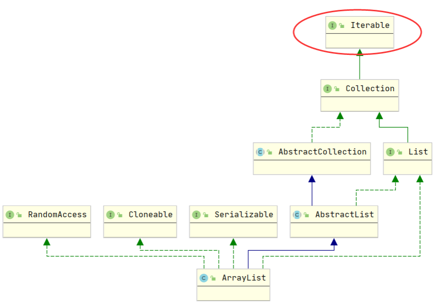
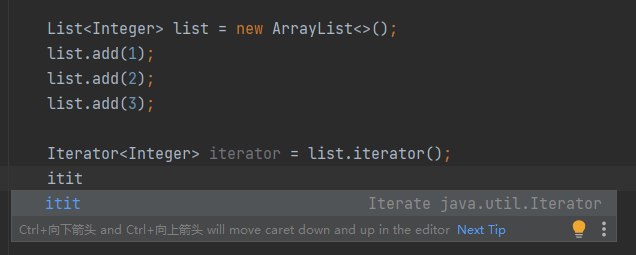
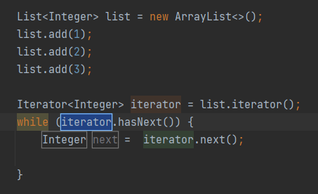
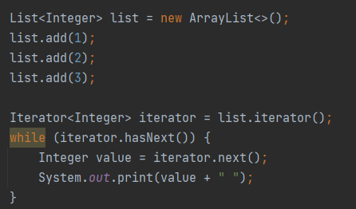
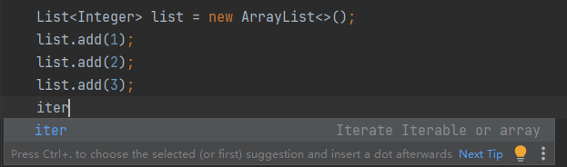
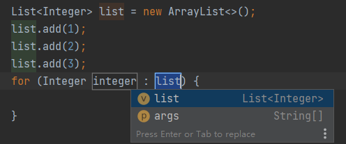
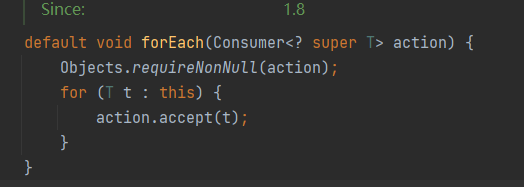

## 常用集合

### ArrayList

在 Java 中，ArrayList 是一种动态数组，它提供了比普通数组更多的功能和灵活性。与普通数组不同，ArrayList 的大小是可以动态改变的，可以根据需要动态添加或删除元素。

#### 实现原理

1. 数据存储：ArrayList 内部使用一个 Object 类型的数组来存储元素。数组的长度会根据容量的需要进行动态调整。
2. 随机访问和索引操作：由于 ArrayList 使用数组作为底层实现，可以通过索引快速访问和修改元素。通过索引读取或修改元素的时间复杂度为 O(1)。
3. 初始容量和扩容：当创建一个新的 ArrayList 对象时，会分配一个初始容量的数组，通常为 10。如果元素数量超过了当前容量，ArrayList 会自动进行扩容，通常将容量增加为原来的 1.5 倍。
4. 元素添加和删除：当向 ArrayList 添加元素时，它会将元素放入数组的末尾，并将元素数量加一。如果数组容量不足，会触发扩容操作。当从 ArrayList 删除元素时，它会将后续元素向前移动填补删除的位置，并将元素数量减一。
5. 动态调整数组大小：ArrayList 支持动态调整数组大小，当数组容量不足或删除元素后，它可以自动进行扩容或收缩。扩容时，会创建一个更大的数组，并将原始数组的元素复制到新数组中。收缩时，会创建一个较小的数组，并将元素复制到新数组中。这种动态调整数组大小的机制使得 ArrayList 可以高效地处理变动的元素数量。

#### 常用方法

| 方法                                 | 描述                                                         |
| ------------------------------------ | ------------------------------------------------------------ |
| `boolean add(E element)`             | 将指定的元素添加到列表的末尾。                               |
| `void add(int index, E element)`     | 在指定的索引位置插入指定的元素。                             |
| `boolean remove(Object obj)`         | 从列表中删除指定的元素。                                     |
| `E remove(int index)`                | 删除指定索引位置的元素，并返回被删除的元素。                 |
| `E get(int index)`                   | 返回指定索引位置的元素。                                     |
| `E set(int index, E element)`        | 替换指定索引位置的元素，并返回原来的元素。                   |
| `int size()`                         | 返回列表中的元素个数。                                       |
| `boolean isEmpty()`                  | 如果列表中没有元素，则返回 `true`。                          |
| `void clear()`                       | 从列表中移除所有的元素。                                     |
| `boolean contains(Object obj)`       | 如果列表包含指定的元素，则返回 `true`。                      |
| `int indexOf(Object obj)`            | 返回第一次出现指定元素的索引，如果列表中不包含该元素，则返回 -1。 |
| `int lastIndexOf(Object obj)`        | 返回最后一次出现指定元素的索引，如果列表中不包含该元素，则返回 -1。 |
| `void sort(Comparator<? super E> c)` | 根据指定的比较器对列表进行排序。                             |
| `Object[] toArray()`                 | 返回一个包含列表中所有元素的数组。                           |

#### 指定位置插入元素

先了解一下 arraycopy 方法，arraycopy 的作用是将一个数组的内容复制到另一个数组（可以是同一个数组）中

```java
public static native void arraycopy(Object src, int srcPos, Object dest, int destPos, int length);
```

- `src`：源数组，即要进行复制的数组。
- `srcPos`：源数组中的起始位置，从该位置开始复制元素，包含该位置
- `dest`：目标数组，即复制后的数组。
- `destPos`：目标数组中的起始位置，从该位置开始粘贴元素。
- `length`：要复制的元素数量。

插入方法的源码：

```java
public void add(int index, E element) {
    // 检查要插入的指定位置是否超出已存储的元素的数量
    rangeCheckForAdd(index);
    
    // 确保内部数组的容量能够存储当前的元素
    ensureCapacityInternal(size + 1);  // Increments modCount!!
    
    // 将指定位置后面的元素（包含指定位置）以数组复制的方式实现往后挪动一位，然后将要插入的元素覆盖指定的位置，从而实现添加
    System.arraycopy(elementData, index, elementData, index + 1, size - index);
    elementData[index] = element;
    size++;
}

// 检查要插入的指定位置是否超出已存储的元素的数量
private void rangeCheckForAdd(int index) {
    if (index > size || index < 0)
        throw new IndexOutOfBoundsException(outOfBoundsMsg(index));
}

// 这个方法的作用是确保 ArrayList 内部数组的容量能够满足当前元素的存储
// 先求得所需得最小容量，然后将求得得最小容量传递给 ensureExplicitCapacity
private void ensureCapacityInternal(int minCapacity) {
    // 判断当前数组是否为空
    if (elementData == DEFAULTCAPACITY_EMPTY_ELEMENTDATA) {
        // 若为空则，则将 minCapacity 设置为 DEFAULT_CAPACITY（默认为10） 和 minCapacity 之中的较大者
         minCapacity = Math.max(DEFAULT_CAPACITY, minCapacity);
     }
     // 将得出的最小容量传给 ensureExplicitCapacity 方法
     ensureExplicitCapacity(minCapacity);
}

// 先自增 modCount，然后调用 grow 方法进行扩容
private void ensureExplicitCapacity(int minCapacity) {
        // modCount 是 ArrayList 用于记录结构修改次数的计数器
        // 它的作用是为了支持在迭代过程中检测并发修改，可以用于快速失败机制，以及对集合一致性的检查。
        modCount++;

     // 最小所需容量大于当前长度就进行扩容
     if (minCapacity - elementData.length > 0)
          grow(minCapacity);
}
// 扩容方法，每次扩容1.5倍
private void grow(int minCapacity) {
     // overflow-conscious code
     int oldCapacity = elementData.length;
     int newCapacity = oldCapacity + (oldCapacity >> 1);
     if (newCapacity - minCapacity < 0)
          newCapacity = minCapacity;
     if (newCapacity - MAX_ARRAY_SIZE > 0)
          newCapacity = hugeCapacity(minCapacity);
      // minCapacity is usually close to size, so this is a win:
      elementData = Arrays.copyOf(elementData, newCapacity);
}
```

总结：

指定位置插入的原理是先将指定位置后面的元素（包含指定位置）以数组复制的方式实现往后挪动一位，然后将要插入的元素覆盖指定的位置，从而实现指定位置的添加。使用的时候要注意传入的指定索引不能大于当前数组的元素的数量，否则会报错。

#### 指定位置删除元素

删除方法源码：

```java
public E remove(int index) {
    // 检查范围
    rangeCheck(index);
	// 修改次数计数器，增加修改次数
    modCount++;
    E oldValue = elementData(index);

    int numMoved = size - index - 1;
    // 将指定位置后面的元素（不包含指定位置）以数组复制的方式实现往前挪动一位，覆盖了指定位置，然后最后一个元素赋值为null，从而实现删除元素
    if (numMoved > 0)
        System.arraycopy(elementData, index+1, elementData, index, numMoved);
    elementData[--size] = null; // clear to let GC do its work

    return oldValue;
}

private void rangeCheck(int index) {
    if (index >= size)
       throw new IndexOutOfBoundsException(outOfBoundsMsg(index));
}
```

总结：

指定位置删除的原理是将指定位置后面的元素（不包含指定位置）以数组复制的方式实现往前挪动一位（覆盖了指定位置），然后最后一个元素赋值为null，从而实现删除元素。

**指定位置添加和删除总结：**

ArrayList 的指定位置的添加和删除，本质上其实是数组的指定位置添加和删除，而数组的指定位置的添加和删除是要移动元素的，添加是往后移，删除是往前移，ArrayList 中对元素移动是通过`arraycopy` 方法在同一个数组上进行复制实现的。

#### 集合的复制

复制分为浅拷贝和深拷贝。

浅拷贝只复制某个对象的引用，而不复制对象本身，新旧对象还是共享同一块内存。深拷贝会创造一个一模一样的对象，新对象和原对象不共享内存，修改新对象不会改变原对象。假设 B 复制了 A，当修改 A 时，看 B 是否会发生变化。如果 B 也跟着变了，说明这是浅拷贝，如果 B 没变，那就是深拷贝。

**浅拷贝：**

1.利用构造器构建新集合（推荐）

```java
People people = new People("tom",18);
List<People> list = new ArrayList<>();
list.add(people);
List<People> newList = new ArrayList<>(list);
System.out.println("原数据：" + list.toString());  // 原数据：[People{name='tom', age=18}]
System.out.println("新数据：" + newList.toString()); // 新数据：[People{name='tom', age=18}]
```

底层原理是调用了 Arrays.copyOf ，而 Arrays.copyOf 调用了 System.arraycopy 来进行复制。

2.利用 addAll 方法进行拷贝

```java
People people = new People("tom",18);
List<People> list = new ArrayList<>();
list.add(people);
List<People> newList = new ArrayList<>();
list1.addAll(list);
System.out.println("原数据：" + list.toString());  // 原数据：[People{name='tom', age=18}]
System.out.println("新数据：" + newList.toString()); // 新数据：[People{name='tom', age=18}]
```

底层原理也是调用 System.arraycopy 。

3.Collections.copy 

```java
People people = new People("tom", 18);
List<People> list = new ArrayList<>();
list.add(people);
List<People> newList = new ArrayList<>(Collections.nCopies(list.size(), null));
Collections.copy(newList, list);
System.out.println("原数据：" + list.toString());  // 原数据：[People{name='tom', age=18}]
System.out.println("新数据：" + newList.toString()); // 新数据：[People{name='tom', age=18}]
```

底层原理是迭代器 + for 循环。

这种方法有的局限性是目标集合的 size 必须大于等于原集合。

**深拷贝：**

1.手动实现：新建一个集合，在循环中新建对象，插入数据，然后把新对象插入集合

2.将集合转 Json，再将 Json 转回集合

转换用的是 Gson

```java
public static <T> ArrayList<T> jsonToArrayList(String json, Class<T> clazz) {
    Type type = new TypeToken<ArrayList<JsonObject>>() {
    }.getType();
    ArrayList<JsonObject> jsonObjects = new Gson().fromJson(json, type);

    ArrayList<T> arrayList = new ArrayList<>();
    for (JsonObject jsonObject : jsonObjects) {
        arrayList.add(new Gson().fromJson(jsonObject, clazz));
    }
    return arrayList;
}
```

```java
People people = new People("tom", 18);
List<People> list = new ArrayList<>();
list.add(people);

Gson gson = new Gson();
String jsonTran = gson.toJson(list);
ArrayList<People> newList= jsonToArrayList(jsonTran, People.class);
people.setName("aa");

System.out.println("原数据：" + list.toString());  // 原数据：[People{name='aa', age=18}]
System.out.println("新数据：" + newList.toString()); // 新数据：[People{name='tom', age=18}]
```

#### 集合的合并

1.使用addAll()方法

```java
List<Integer> list1 = new ArrayList<>(Arrays.asList(1, 2, 3));
List<Integer> list2 = new ArrayList<>(Arrays.asList(4, 5, 6));

list1.addAll(list2); // 将list2中的元素合并到list1中

System.out.println(list1); // 输出 [1, 2, 3, 4, 5, 6]
```

2.使用Stream的concat()方法

```java
List<Integer> list1 = new ArrayList<>(Arrays.asList(1, 2, 3));
List<Integer> list2 = new ArrayList<>(Arrays.asList(4, 5, 6));

List<Integer> mergedList = Stream.concat(list1.stream(), list2.stream())
        .collect(Collectors.toList());

System.out.println(mergedList); // 输出 [1, 2, 3, 4, 5, 6]
```

3.使用Apache Commons Collections库

```java
List<Integer> list1 = new ArrayList<>(Arrays.asList(1, 2, 3));
List<Integer> list2 = new ArrayList<>(Arrays.asList(4, 5, 6));

CollectionUtils.addAll(list1, list2);

System.out.println(list1); // 输出 [1, 2, 3, 4, 5, 6]
```

### HashMap

HashMap 是 Java 中常用的哈希表实现，它提供了一种高效的键值对存储和检索机制。

#### 实现原理

HashMap 是哈希表的实现，因此先了解哈希表的原理：

哈希表（Hash Table）是一种以键值对存储和访问数据的数据结构，它通过将键映射到桶的索引位置来实现快速的查找、插入和删除操作。

1. 桶数组：哈希表内部使用一个数组来存储数据，这个数组被称为桶数组。桶数组的长度通常是固定的，每个桶存储一个或多个键值对。
2. 哈希函数：哈希函数用于将键映射到桶数组的索引位置。哈希函数接收一个键作为输入，并输出一个整数值，该值表示键在桶数组中的索引位置。
3. 处理哈希冲突：不同的键可能会映射到相同的桶索引位置，这就是哈希冲突。哈希表需要解决哈希冲突问题，常见的解决方法有两种：
   - 链地址法：每个桶位置维护一个链表，哈希冲突的键值对通过链表连接在一起，并放置在同一个桶中。
   - 开放地址法：当发生哈希冲突时，通过一定的探测方法（如线性探测、二次探测等）在桶数组中找到下一个可用的空桶，将键值对放入该桶中。

4. 哈希表操作

- 添加元素：根据哈希函数计算键的哈希值，确定键值对应的桶索引位置，将键值对存储在对应的桶中。
- 获取元素：根据键计算哈希值，定位到对应的桶索引位置，查找桶中的键值对并返回值。
- 删除元素：根据键计算哈希值，定位到对应的桶索引位置，删除桶中的键值对。

5. 性能分析：

   哈希表的性能主要受到两个因素影响：

   - 哈希冲突：当发生较多的哈希冲突时，会导致链表变长或探测次数增加，从而降低了查找的效率。适当的哈希函数设计和解决冲突的方法可以减少冲突的发生。

   - 负载因子和扩容：负载因子表示哈希表中已占用桶的比例。当负载因子较高时，会增加哈希冲突的概率，影响性能。哈希表通常会设置一个负载因子阈值，当元素数量达到阈值时，进行扩容操作，重新调整桶数组的长度，以减少哈希冲突。

接下来是 HashMap 的原理：

1. 桶数组 + 链表 + 红黑树：HashMap内部使用一个桶数组来存储键值对，每个桶位置可能存储一个或多个键值对。当多个键的哈希码映射到同一个桶位置时，HashMap会使用链表或红黑树来处理哈希冲突。
   - JDK8及以上：当同一个桶位置的链表长度大于等于8，且数组长度大于等于64，链表将转换为红黑树；当红黑树的节点数小于等于6，红黑树退化为链表。这样可以在保证较高查找效率的同时，减小内存占用。
2. 哈希函数：HashMap使用键的哈希码（通过hashCode()方法获取）和位运算来计算键在桶数组中的索引位置。默认情况下，哈希函数会对哈希码进行一定的变换和位运算，以保证哈希码的高位和低位都能够参与到索引计算中，提高哈希表的均匀性，减少哈希冲突。
3. 唯一性检查：HashMap会根据键的哈希码和equals()方法来判断键值对的唯一性。如果两个键的哈希码相同并且equals()方法返回true，则认为这两个键是相同的，新的键值对将会替换旧的键值对。
4. 初始容量和负载因子：初始容量是指创建 HashMap 时，桶数组的初始大小，默认为16。负载因子是指哈希表的填充因子，它表示哈希表中已经存储的键值对数量与桶数组长度的比值，负载因子的默认值为 0.75，当哈希表中已经存储的键值对数量达到负载因子与当前桶数组长度的乘积时，HashMap 会触发扩容操作。
5. 元素的插入流程：
   1. 首先用key的哈希值经过扰动函数得到新的哈希值，目的是让哈希值分布更均匀一些，减少哈希冲突
   2. 然后使用哈希值计算该键值对在哈希表中的索引(index)，具体的计算方法是：index = hash & (table.length - 1)
   3. 接着，在哈希表的索引位置处判断是否已经存在，如果存在，则判断键的哈希码是否相同，若相同才会用 equals() 方法判断是否为true，若都相同，则说明是相同的键，用新的值将替换旧的值，若有一个不同，则说发生了哈希冲突，使用链地址法解决哈希冲突。
6. 解决哈希冲突（两个不同的键映射到了相同的桶位置）：
   1. 发生了哈希冲突之后，用链地址法解决哈希冲突，即用链表存储冲突的元素。
   2. 如果桶数组上已有链表或红黑树，则进行遍历，若找到了有键相同的键值对，则直接覆盖，若都不相同，则添加到末尾。
   3. 若链表长度大于等于8，且数组长度大于等于64，链表将转换为红黑树；当红黑树的节点数小于等于6，红黑树退化为链表。
7. 元素的检索流程：
   1. 根据待检索元素的键，通过哈希函数计算哈希值。
   2. 使用哈希值定位到对应的桶（数组中的元素）。
   3. 如果桶为空，则表示哈希表中没有与待检索键对应的元素，检索失败。
   4. 如果桶不为空，则需要进一步查找。如果该桶中的元素是链表或红黑树，则会进行遍历，如果找到与待检索键相等的键值对节点，则返回对应的值，检索成功。
   5. 如果没有找到与待检索键相等的键值对节点，则表示哈希表中没有与待检索键对应的元素，检索失败。

8. 扩容机制：当 HashMap 中已经存储的键值对数量达到负载因子与当前桶数组长度的乘积时，就需要进行扩容操作，流程如下：
   1. 创建一个新的桶数组，长度为原来的2倍。
   2. 遍历旧的桶数组，将每个桶上的键值对重新计算哈希值，并根据新的哈希值放入新的桶中。如果在新的桶中已经存在相同的键，则用新的值替换旧的值。
   3. 将新的桶数组替换旧的桶数组。
   4. 释放旧的桶数组，以便GC回收。

#### 自定义对象作为 HashMap 的键的条件

要使用自定义对象作为HashMap的键，需要满足两个条件：

1. 重写 hashCode() 方法：hashCode()方法用于计算对象的哈希码，用于确定对象在HashMap中的存储位置。因此，你需要在自定义对象中重写hashCode()方法，确保相同内容的对象具有相同的哈希码，通常会使用对象中某些属性的哈希码进行计算，以保证相等的对象具有相等的哈希码。
2. 重写equals()方法：equals()方法用于比较两个对象是否相等。在HashMap中，当发生哈希冲突时，会使用equals()方法来比较具有相同哈希码的键对象是否相等。因此，需要重写equals()方法，确保在逻辑上相等的对象返回true。

```java
public class Person {
    private String name;
    private int age;

    // 构造方法、getter和setter等省略
    
    @Override
    public int hashCode() {
        int result = name != null ? name.hashCode() : 0;
        result = 31 * result + age;
        return result;
    }

    @Override
    public boolean equals(Object o) {
        if (this == o) {
            return true;
        }
        if (o == null || getClass() != o.getClass()) {
            return false;
        }
        Person person = (Person) o;
        if (age != person.age) {
            return false;
        }
        return name != null ? name.equals(person.name) : person.name == null;
    }

}
```

```java
HashMap<Person, String> map = new HashMap<>();

Person person1 = new Person("Alice", 25);
Person person2 = new Person("Bob", 30);

map.put(person1, "Value 1");
map.put(person2, "Value 2");

// 使用自定义对象作为键进行检索
Person searchKey = new Person("Alice", 25);
String value = map.get(searchKey);
System.out.println(value);  // 输出 "Value 1"
```

#### 常用方法

1. `put(key, value)`：将指定的键值对存储到HashMap中，如果已经存在相同的键，则会替换对应的值。
2. `get(key)`：根据键获取对应的值，如果键不存在则返回null。
3. `remove(key)`：根据键移除对应的键值对。
4. `containsKey(key)`：判断HashMap中是否包含指定的键。
5. `containsValue(value)`：判断HashMap中是否包含指定的值。
6. `size()`：返回HashMap中键值对的数量。
7. `isEmpty()`：判断HashMap是否为空。
8. `clear()`：清空HashMap中的所有键值对。
9. `keySet()`：返回HashMap中所有键构成的Set集合。
10. `values()`：返回HashMap中所有值构成的Collection集合。
11. `entrySet()`：返回HashMap中所有键值对构成的Set集合。

### 其他集合

#### LinkedList

LinkedList是Java中的双向链表的实现，它实现了List接口，并且可以在列表任意位置进行高效的插入和删除操作。与ArrayList相比，LinkedList在插入和删除元素时具有更好的性能，但在随机访问和遍历时性能较差。

##### 特点

1. 链表结构：LinkedList的底层是由节点（Node）组成的链表结构。每个节点包含一个存储元素的值（element）和两个指针，分别指向前一个节点（previous）和后一个节点（next）。
2. 双向访问：由于每个节点都保存了前一个节点和后一个节点的引用，因此可以通过指针在链表中的任意位置进行双向访问。这使得在LinkedList中插入和删除元素时具有较好的性能，因为只需要修改相邻节点的指针即可。
3. 不连续的存储空间：与ArrayList不同，LinkedList的元素在内存中并不是连续存储的，而是通过节点的指针连接起来的。这意味着在LinkedList中进行随机访问时需要遍历节点，因此性能较差。
4. 支持快速插入和删除：由于LinkedList的节点结构，插入和删除元素的操作非常高效。在链表的任意位置插入或删除一个元素的时间复杂度为O(1)，只需修改相邻节点的指针即可。

##### 用途

1. 需要频繁进行插入和删除操作：由于LinkedList的插入和删除操作具有较好的性能，特别是在链表的任意位置进行插入和删除时。如果需要频繁地对数据集合进行插入和删除操作，而不关心随机访问元素的性能，LinkedList是一个不错的选择。
2. 实现栈和队列：由于LinkedList支持在链表的两端进行添加和删除元素的操作，它可以用来实现栈（先进后出）和队列（先进先出）等数据结构。例如，可以将链表的头部作为栈顶，在头部进行元素的添加和删除操作；或者将链表的尾部作为队列的队尾，在尾部进行元素的添加和删除操作。
3. 链表迭代器的应用：LinkedList提供了用于迭代链表的ListIterator接口，它除了具备Iterator接口的功能外，还能够向前遍历链表。因此，当需要在迭代过程中对链表进行增删操作时，可以使用LinkedList的ListIterator来实现。

##### 常用方法

1. add(element)：在链表末尾添加元素。
2. add(index, element)：在指定位置插入元素。
3. remove(element)：删除链表中指定的元素。
4. remove(index)：删除指定位置的元素。
5. get(index)：获取指定位置的元素。
6. size()：返回链表的长度。
7. isEmpty()：判断链表是否为空。
8. clear()：清空链表中的所有元素。

#### HashSet

HashSet是Java中的一个集合类，它实现了Set接口，并基于哈希表（hash table）来存储元素。

##### 特点

1. 无序性：HashSet中的元素没有固定的顺序，不会按照插入顺序或者其他规则进行排序。
2. 唯一性：HashSet中的元素是唯一的，不允许重复元素。当向HashSet中添加重复元素时，新元素将不会被添加进集合。
3. 允许空值：HashSet允许存储null值，但由于元素的唯一性，只能存储一个null值。
4. 高效性：HashSet的查找、插入和删除操作都具有较高的性能。这是因为HashSet使用哈希表作为内部数据结构，通过哈希值来确定元素在集合中的位置，从而实现快速的查找。
5. 非线程安全：HashSet不是线程安全的，如果多个线程同时操作同一个HashSet，可能导致不确定的结果。如果需要在多线程环境下使用HashSet，可以考虑使用线程安全的替代类，如ConcurrentHashSet或使用同步机制。
6. 迭代顺序不确定：由于HashSet是基于哈希表实现的，迭代HashSet时元素的顺序是不确定的。如果需要有序遍历，可以考虑使用LinkedHashSet，它保持元素的插入顺序。

##### 用途

1. 去重：HashSet中的元素是唯一的，这使得它非常适合用于去重操作。当需要从一组数据中筛选出不重复的元素时，可以使用HashSet来快速实现去重。
2. 查找性能：由于HashSet内部基于哈希表实现，具有很好的查找性能。因此，当需要频繁进行元素的查找操作时，可以选择HashSet来提高查找效率。
3. 存储无序数据：如果对元素的顺序没有特殊要求，可以使用HashSet来存储数据。例如，当需要存储一组元素，并且不关心它们的顺序时，可以选择HashSet。
4. 检查元素是否存在：通过HashSet的`contains`方法可以快速检查某个元素是否存在于集合中，这在一些业务场景下非常有用。
5. 缓存数据：在一些缓存场景中，可以使用HashSet来存储缓存的键或者部分数据，利用其快速的查找性能来加快缓存查询的速度。

##### 常用方法

1. `add(E e)`：向HashSet中添加指定元素e。如果元素已经存在于集合中，则不会被重复添加。返回值为布尔类型，表示是否成功添加元素。
2. `remove(Object o)`：从HashSet中移除指定的元素o。如果元素存在于集合中，则会被移除并返回true；如果元素不存在，则返回false。
3. `contains(Object o)`：判断HashSet中是否包含指定的元素o。如果元素存在于集合中，则返回true；否则返回false。
4. `size()`：返回HashSet中元素的个数。
5. `isEmpty()`：判断HashSet是否为空。如果HashSet中没有元素，则返回true；否则返回false。
6. `clear()`：清空HashSet中的所有元素，使其变为空集合。

#### HashTable

HashTable是Java中的一个古老的集合类，它实现了Map接口，并使用哈希表作为内部数据结构。和HashMap类似，HashTable也是基于键值对存储数据的。

不过，HashTable在一些方面与HashMap有所不同：

1. 线程安全性：HashTable是线程安全的，可以在多线程环境下安全地使用。HashTable的方法都是同步化的（synchronized），保证了多线程环境下的安全性。
2. 性能：HashTable的性能相对于HashMap来说较低，主要是因为它的方法都是同步化的，造成了一定的性能损失。
3. null值：HashTable中不允许键或值为null，任何试图存入null值的操作都会抛出NullPointerException异常。

HashTable的用法和HashMap类似，可以使用put、get等方法添加和获取元素，也可以使用entrySet、keySet等方法获取键值对集合和键集合。需要注意的是，由于HashTable的线程安全性，它在单线程环境下的性能会明显劣于HashMap。

另外，由于Java 8引入了ConcurrentHashMap，并且HashTable已经被标记为“过时的”（deprecated），所以在新的代码中，一般不建议使用HashTable，而是使用ConcurrentHashMap来实现线程安全的Map操作。

## 迭代器

Iterator对象称为迭代器，主要用于遍历Collection集合中的元素。
所有实现了Collection接口的集合类都有一个iterator()方法，用以返回一个实现了Iterator接口的对象，即可以返回一个迭代器。
Iterator仅用于遍历集合，Iterator本身并不存放对象。



Iterable 接口：

```java
public interface Iterable<T> {
    /**
     * Returns an iterator over elements of type {@code T}.
     *
     * @return an Iterator.
     */
    Iterator<T> iterator();
}
```

Iterator 接口：

```java
public interface Iterator<E> {
    boolean hasNext();
    
    E next();
    
    default void remove() {
        throw new UnsupportedOperationException("remove");
    }
}
```

| **返回值类型** | 方法名    | 功能                                                         |
| -------------- | --------- | ------------------------------------------------------------ |
| boolean        | hasNext() | 判断集合是否还有元素，如果返回 true 表示集合还有元素，返回 false 表示集合中没有元素；一般对集合的访问通过 while(hasNext()) 判断是否还需要遍历。 |
| E              | next()    | 获取集合中遍历的当前元素 ；一般先调用 hasNext() 方法判断是否存在元素，再调用 next() 获取元素，需要进行循环交替遍历集合中的元素。 |
| void           | remove    | 删除集合中的元素。                                           |

### 迭代器的使用

获取到迭代器之后可以输入 itit 快捷生成







### 增强for

增强型for循环，是一种语法糖，JDK5引入，可以简化数组和集合的遍历，它的是Iterator迭代器实现的。

```java
List<Integer> list = new ArrayList<>();
list.add(1);
list.add(2);
list.add(3);

System.out.println("增强for循环遍历集合:");
for (Integer i : list) {
    System.out.print(i + " ");
}
System.out.println();

System.out.println("增强for循环遍历数组:");
int[] arr = {1, 2, 3, 4, 5, 6};
for (int i : arr) {
    System.out.print(i + " ");
}
```

生成增强for的快捷键是 iter





### forEach()方法

`forEach()` 方法是 JDK 8 引入，该方法定义在 `java.lang.Iterable` 接口中，该方法用于遍历集合，提供了一种更简洁、易读的方式来处理集合中的每个元素。

源码：



由源码可知forEach方法是利用增强for实现的。

```java
List<String> fruits = new ArrayList<>();
fruits.add("apple");
fruits.add("banana");
fruits.add("orange");

fruits.forEach(fruit -> System.out.println(fruit));
```

## Steam API

Stream API是Java 8中引入的一种处理集合数据的新方式，它可以对集合进行复杂的数据操作和查询，比传统的方式更加简洁、高效。Stream API是一种流式处理方式，可以将一个集合转换成一个流（Stream），然后通过链式调用一系列操作对流中的元素进行操作。Stream API提供了一些常用的中间操作和终止操作，可以实现过滤、转换、排序、分组、聚合等操作。

集合可以直接`.stream()` 获取流

```java
        // 筛选偶数
        List<Integer> numbers = Arrays.asList(1, 2, 3, 4, 5, 6, 7, 8, 9, 10);
        List<Integer> evenNumbers = numbers.stream()
                                           .filter(n -> n % 2 == 0)
                                           .collect(Collectors.toList());
        System.out.println(evenNumbers); // 输出：[2, 4, 6, 8, 10]
```

流的操作分为中间操作和终结操作：

**中间操作：**一个流可以后面跟随零个或多个中间操作，其目的主要是打开流，做出某种程度的数据映射/过滤，然后会返回一个新的流，交给下一个操作使用。这类操作都是**惰性化的（lazy）**，就是说，仅仅调用到这类方法，并没有真正开始流的遍历。

中间操作包括：map (mapToInt, flatMap 等)、 filter、 distinct、 sorted、 peek、 limit、 skip、 parallel、 sequential、 unordered等

**终结操作：**终结操作，一个流只能有一个终结操作，当这个操作执行后，流就被使用“光”了，无法再被操作。所以这必定是流的最后一个操作。终结操作的执行，才会真正开始流的遍历，并且会生成一个结果，或者一个 side effect。

终结操作包括：forEach、 forEachOrdered、 toArray、 reduce、 collect、 min、 max、 count、 anyMatch、 allMatch、 noneMatch、 findFirst、 findAny、 iterator等

**常用操作：**

1.filter()：过滤集合中不符合条件的元素。

```java
List<Integer> list = Arrays.asList(1, 2, 3, 4, 5);
List<Integer> result = list.stream()
                           .filter(n -> n % 2 == 0)
                           .collect(Collectors.toList());
```

2.map()：将集合中的元素映射为另一种类型。

```java
List<String> names = Arrays.asList("apple", "banana", "orange");
List<Integer> result = names.stream()
                         .map(String::length)
                         .collect(Collectors.toList());
```

3.sorted()：对集合中的元素进行排序。

````java
List<Integer> list = Arrays.asList(3, 1, 4, 2, 5);
List<Integer> result = list.stream()
                           .sorted() // 默认升序
                           .collect(Collectors.toList());
````

4.distinct()：去重集合中的元素。

```java
List<Integer> list = Arrays.asList(1, 2, 2, 3, 3, 3);
List<Integer> result = list.stream()
                           .distinct() 
                           .collect(Collectors.toList());
```

5.limit()：限制集合中元素的数量。

```java
// 取前三个
List<Integer> list = Arrays.asList(1, 2, 3, 4, 5);
List<Integer> result = list.stream()
                           .limit(3)
                           .collect(Collectors.toList());
```

## 实践

- 采用**阿里巴巴编程规范与工程结构**模拟HashMap的实现，包括：

  - **put方法实现：**
    - 实现`put`方法，用于往HashMap中添加键值对

    - 考虑哈希冲突的情况，选择合适的解决方法，例如链表法

  - **get方法实现：**
    - 实现`get`方法，用于根据键获取值

    - 考虑哈希冲突的情况，确保能正确获取值

  - **remove方法实现：**
    - 实现`remove`方法，用于根据键删除键值对

    - 考虑哈希冲突的情况，确保能正确删除键值对

  - **resize方法实现：**
    - 实现`resize`方法，用于在HashMap元素数量达到一定阈值时进行扩容

    - 考虑扩容后如何重新分配键值对
- 扩展（可选）：

  - **封装数组和链表**
    - 包含数组和链表的基本结构，确保外部无法直接访问

```java
/**
 * @author herry
 */
public class MyHashMap<K, V> {
    /**
     * 哈希表
     */
    private Entry<K, V>[] table;

    /**
     * 元素个数
     */
    private int size;

    /**
     * 负载因子
     */
    private static final float DEFAULT_LOAD_FACTOR = 0.75f;

    /**
     * 默认容量
     */
    private static final int DEFAULT_CAPACITY = 16;

    /**
     * 键值对，链表节点
     */
    private static class Entry<K, V> {
        private final K key;
        private V value;
        private Entry<K, V> next;

        public Entry(K key, V value) {
            this.key = key;
            this.value = value;
        }

    }

    public MyHashMap() {
        this.table = (Entry<K, V>[]) new Entry[DEFAULT_CAPACITY];
        this.size = 0;
    }

    public MyHashMap(int capacity) {
        this.table = (Entry<K, V>[]) new Entry[capacity];
        this.size = capacity;
    }

    /**
     * 扰动函数，作用是重新计算哈希值，让 key 分布得更均匀一些，目的是为了减少哈希冲突
     */
    private int hash(Object key) {
        int h;
        return (key == null) ? 0 : (h = key.hashCode()) ^ (h >>> 16);
    }

    /**
     * 计算元素存放的位置
     */
    private int getIndex(K key) {
        // 在数组长度是2的幂次方的前提下，用数组长度减一与哈希值进行与运算，等价于求模操作，好处是效率更高
        return (table.length - 1) & hash(key);
    }

    /**
     * 检查两个 key 是否相同
     */
    private boolean checkKeySame(K oldKey, K newKey) {
        // 先判断哈希值是否相同，然后用equals判断 key 是否相同，这样效率更高
        return hash(oldKey) == hash(newKey) && (Objects.equals(newKey, oldKey));
    }

    /**
     * 检查是否元素的数量是否超过负载
     */
    private boolean checkSize() {
        return size * 1.0 / table.length >= DEFAULT_LOAD_FACTOR;
    }

    /**
     * 添加元素
     */
    public V put(K key, V value) {
        int index = getIndex(key);
        Entry<K, V> cur = table[index];
        Entry<K, V> prev = null;

        // 若当前位置没有元素则直接添加
        if (cur == null) {
            table[index] = new Entry<>(key, value);
        } else {
            // 若当前位置有元素，则遍历链表
            while (cur != null) {
                // 存在key相同的元素，更新值
                if (checkKeySame(cur.key, key)) {
                    cur.value = value;
                    return value;
                }
                // 移动到下一个节点
                prev = cur;
                cur = cur.next;
            }
            // 遍历完链表，发现不存在key相同的元素，则在末尾插入元素
            prev.next = new Entry<>(key, value);
        }
        // 添加完元素，元素数量加一
        size++;
        // 判断是否超过阈值，超过了就要扩容
        if (checkSize()) {
            resize();
        }
        return value;
    }

    /**
     * 扩容，扩大为原来的2倍
     */
    private void resize() {
        Entry<K, V>[] oldTable = table;
        table = (Entry<K, V>[]) new Entry[table.length * 2];
        moveData(oldTable);
    }

    /**
     * 将旧哈希表的数据移动到新的哈希表，由于数组的长度改变了，因此元素需要重新计算位置
     */
    private void moveData(Entry<K, V>[] oldTable) {
        // 遍历旧哈希表
        for (Entry<K, V> kvEntry : oldTable) {
            Entry<K, V> node = kvEntry;
            // 遍历链表
            while (node != null) {
                Entry<K, V> insertNode = new Entry<>(node.key, node.value);
                // 重新计算索引位置
                int index = getIndex(node.key);
                Entry<K, V> cur = table[index];
                if (cur == null) {
                    // 若 table 的当前位置没有元素, 则直接插入该节点
                    table[index] = insertNode;
                } else {
                    // 如果 table 的当前位置已经有元素, 则遍历这条链表，将元素添加到末尾
                    Entry<K, V> prev = null;
                    while (cur != null) {
                        prev = cur;
                        cur = cur.next;
                    }
                    prev.next = insertNode;
                }
                // 移动到链表的下一个节点
                node = node.next;
            }
        }
    }

    /**
     * 获取元素
     */
    public V get(K key) {
        int index = getIndex(key);
        Entry<K, V> cur = table[index];
        // 当前元素不为 null，则遍历链表找到 key 相同的元素
        while (cur != null) {
            if (checkKeySame(cur.key, key)) {
                return cur.value;
            }
            cur = cur.next;
        }
        // 不存在这个元素，返回 null
        return null;
    }

    /**
     * 删除元素
     */
    public V remove(K key) {
        int index = getIndex(key);
        Entry<K, V> cur = table[index];
        // 当前位置有元素
        if (cur != null) {
            if (checkKeySame(cur.key, key)) {
                // 当前元素的 key 与要删除的 key 相同
                table[index] = cur.next;
                return cur.value;
            } else {
                // 遍历链表后面的 key 是否有相同的
                Entry<K, V> pre = cur;
                cur = cur.next;
                while (cur != null) {
                    if (cur.key.equals(key)) {
                        // 删除 key 相同的元素
                        pre.next = cur.next;
                        return cur.value;
                    }
                    pre = cur;
                    cur = cur.next;
                }
            }
        }
        // 不存在这个元素，返回 null
        return null;
    }

    /**
     * 打印哈希表
     */
    @Override
    public String toString() {
        for (int i = 0; i < table.length; i++) {
            System.out.print(i + ": ");
            Entry<K, V> cur = table[i];
            if (cur == null) {
                System.out.println("null");
                continue;
            }
            while (cur != null) {
                System.out.print("[key=" + cur.key + ", " + "value=" + cur.value + "]");
                cur = cur.next;
                if (cur == null) {
                    System.out.println();
                } else {
                    System.out.print(" -> ");
                }
            }
        }
        return "";
    }

    public static void main(String[] args) {
        MyHashMap<Integer, Integer> map = new MyHashMap<>();
        map.put(1, 11);
        map.put(2, 22);
        map.put(3, 33);
        map.put(17, 1717);
        map.put(33, 3333);
        map.put(49, 4949);
        map.put(65, 6565);
        System.out.println("扩容前: ");
        System.out.println(map);
        System.out.println(map.get(1));
        System.out.println(map.get(17));
        System.out.println(map.get(3));

        map.remove(33);
        map.remove(65);
        System.out.println("删除后：");
        System.out.println(map);

        map.put(5, 55);
        map.put(6, 55);
        map.put(7, 55);
        map.put(8, 55);
        map.put(9, 55);
        map.put(10, 55);
        System.out.println("扩容后: ");
        System.out.println(map);

    }

}
```

