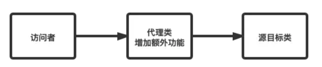

# File 类与 IO 流

## File

File 类和 IO 流，都定义在 java.io 包下。一个 File 对象代表硬盘或网络中可能存在的一个文件或者文件目录（文件夹），与平台无关。

File 能新建、删除、重命名文件和目录，但 File 不能访问文件内容本身，如果需要访问文件内容本身，则需要使用输入/输出流，File 对象可以作为参数传递给流的构造器。

无论该路径下是否存在文件或者目录，都不影响 File 对象的创建。

### 构造方法

| 构造方法                                 | 描述                                                         |
| ---------------------------------------- | ------------------------------------------------------------ |
| public File(String pathname)             | 以 pathname 为路径创建 File 对象，可以是绝对路径或者相对路径。 |
| public File(String parent, String child) | 以 parent 为父路径，child 为子路径创建 File 对象。           |
| public File(File parent, String child)   | 根据一个父 File 对象和子文件路径创建 File 对象。             |

### 绝对路径和相对路径

绝对路径和相对路径是表示文件或目录（文件夹）在系统中位置的两种不同方式。

**绝对路径：**从根目录开始表示路径。windows 从盘符开始，如`C:\Users\Username\Documents\file.txt`，Unix / Linux 从根目录（/）开始，如`/home/username/documents/file.txt`。提供了完整路径的信息，能准确定位到位置。

**相对路径：**相对于当前位置的路径，即从当前位置开始表示路径。其中，使用“."表示当前位置，使用“..”表示上一层目录。相对路径会更加简洁和灵活。

例子：

在工作目录 /home/username/documents/ 下有 a.txt 文件，用这两种方式表示文件的路径

绝对路径：/home/username/documents/a.txt

相对路径：./a.txt

绝对路径和相对路径各有优缺点，使用时要根据具体情况分析，使用合适的路径表示方式。

在 IEDA 中，工作目录是当前项目的根目录，即在写相对路径时，要根据当前项目的根目录表示路径的位置。

### 常用方法

| 方法                             | 描述                                       |
| -------------------------------- | ------------------------------------------ |
| `boolean exists()`               | 判断文件或目录是否存在。                   |
| `boolean isDirectory()`          | 判断当前`File`对象是否表示一个目录。       |
| `boolean isFile()`               | 判断当前`File`对象是否表示一个文件。       |
| `String getName()`               | 返回文件或目录的名称。                     |
| `String getPath()`               | 返回文件或目录的路径。                     |
| `String getAbsolutePath()`       | 返回文件或目录的绝对路径。                 |
| `long length()`                  | 返回文件的长度（字节数）。                 |
| `boolean canRead()`              | 判断文件是否可读。                         |
| `boolean canWrite()`             | 判断文件是否可写。                         |
| `boolean createNewFile()`        | 创建一个新的空文件。                       |
| `boolean delete()`               | 删除文件或目录。                           |
| `boolean mkdir()`                | 创建一个新的目录。                         |
| `boolean mkdirs()`               | 创建一个新的目录，包括任何不存在的父目录。 |
| `String[] list()`                | 返回目录中的文件和目录的名称列表。         |
| `File[] listFiles()`             | 返回目录中的文件和目录的`File`对象数组。   |
| `boolean renameTo(File dest)`    | 将文件或目录重命名为指定的目标文件或目录。 |
| `boolean setReadOnly()`          | 将文件设置为只读。                         |
| `boolean setWritable(boolean)`   | 设置文件的可写属性。                       |
| `boolean setReadable(boolean)`   | 设置文件的可读属性。                       |
| `boolean setExecutable(boolean)` | 设置文件的可执行属性。                     |

## IO流

- Java程序中，对于数据的输入/输出操作以“`流(stream)`” 的方式进行，可以看做是一种数据的流动。

  

- I/O流中的I/O是`Input/Output`的缩写， I/O技术是非常实用的技术，用于处理设备之间的数据传输。如读/写文件，网络通讯等。

  - `输入input`：读取外部数据（磁盘、光盘等存储设备的数据）到程序（内存）中。
  - `输出output`：将程序（内存）数据输出到磁盘、光盘等存储设备中。

### 流的分类

`java.io`包下提供了各种“流”类和接口，用以获取不同种类的数据，并通过`标准的方法`输入或输出数据。

- 按数据的流向不同分为：**输入流**和**输出流**。

  - **输入流** ：把数据从`其他设备`上读取到`内存`中的流。 
    - 以InputStream、Reader结尾
  - **输出流** ：把数据从`内存` 中写出到`其他设备`上的流。
    - 以OutputStream、Writer结尾

- 按操作数据单位的不同分为：**字节流（8bit）**和**字符流（16bit）**。

  - **字节流** ：以字节为单位，读写数据的流。
    - 以InputStream、OutputStream结尾
  - **字符流** ：以字符为单位，读写数据的流。
    - 以Reader、Writer结尾

- 根据IO流的角色不同分为：**节点流**和**处理流**。

  - **节点流**：直接从数据源或目的地读写数据

    

  - **处理流**：不直接连接到数据源或目的地，而是“连接”在已存在的流（节点流或处理流）之上，通过对数据的处理为程序提供更为强大的读写功能。

    

小结：图解


### 流的API

- Java的IO流共涉及40多个类，实际上非常规则，都是从如下4个抽象基类派生的。

| （抽象基类） |   输入流    |    输出流    |
| :----------: | :---------: | :----------: |
|    字节流    | InputStream | OutputStream |
|    字符流    |   Reader    |    Writer    |

- 由这四个类派生出来的子类名称都是以其父类名作为子类名后缀。


**常用的节点流：** 　

* 文件流： FileInputStream、FileOutputStrean、FileReader、FileWriter 
* 字节/字符数组流： ByteArrayInputStream、ByteArrayOutputStream、CharArrayReader、CharArrayWriter 
  * 对数组进行处理的节点流（对应的不再是文件，而是内存中的一个数组）。

**常用处理流：**

* 缓冲流：BufferedInputStream、BufferedOutputStream、BufferedReader、BufferedWriter
  * 作用：增加缓冲功能，避免频繁读写硬盘，进而提升读写效率。
* 转换流：InputStreamReader、OutputStreamReader
  * 作用：实现字节流和字符流之间的转换。
* 对象流：ObjectInputStream、ObjectOutputStream
  * 作用：提供直接读写Java对象功能

## 节点流

### FileReader\FileWriter

#### **Reader与Writer**

Java提供一些字符流类，以字符为单位读写数据，专门用于处理文本文件。不能操作图片，视频等非文本文件。

> 常见的文本文件有如下的格式：.txt、.java、.c、.cpp、.py等
>
> 注意：.doc、.xls、.ppt这些都不是文本文件。

**字符输入流：Reader**

`java.io.Reader`抽象类是表示用于读取字符流的所有类的父类，可以读取字符信息到内存中。它定义了字符输入流的基本共性功能方法。

- `public int read()`： 从输入流读取一个字符。 虽然读取了一个字符，但是会自动提升为int类型。返回该字符的Unicode编码值。如果已经到达流末尾了，则返回-1。
- `public int read(char[] cbuf)`： 从输入流中读取一些字符，并将它们存储到字符数组 cbuf中 。每次最多读取cbuf.length个字符。返回实际读取的字符个数。如果已经到达流末尾，没有数据可读，则返回-1。 
- `public int read(char[] cbuf,int off,int len)`：从输入流中读取一些字符，并将它们存储到字符数组 cbuf中，从cbuf[off]开始的位置存储。每次最多读取len个字符。返回实际读取的字符个数。如果已经到达流末尾，没有数据可读，则返回-1。 
- `public void close()` ：关闭此流并释放与此流相关联的任何系统资源。    

> 注意：当完成流的操作时，必须调用close()方法，释放系统资源，否则会造成内存泄漏。

**字符输出流：Writer**

`java.io.Writer `抽象类是表示用于写出字符流的所有类的超类，将指定的字符信息写出到目的地。它定义了字节输出流的基本共性功能方法。

- `public void write(int c)` ：写出单个字符。
- `public void write(char[] cbuf) `：写出字符数组。 
- `public void write(char[] cbuf, int off, int len) `：写出字符数组的某一部分。off：数组的开始索引；len：写出的字符个数。 
- `public void write(String str) `：写出字符串。 
- `public void write(String str, int off, int len)` ：写出字符串的某一部分。off：字符串的开始索引；len：写出的字符个数。
- `public void flush() `：刷新该流的缓冲。  
- `public void close()` ：关闭此流。

> 注意：当完成流的操作时，必须调用close()方法，释放系统资源，否则会造成内存泄漏。

#### **FileReader与FileWriter**

**FileReader**

`java.io.FileReader `类用于读取字符文件，构造时使用系统默认的字符编码和默认字节缓冲区。

- `FileReader(File file)`： 创建一个新的 FileReader ，给定要读取的File对象。   
- `FileReader(String fileName)`： 创建一个新的 FileReader ，给定要读取的文件的名称。

**举例：**读取hello.txt文件中的字符数据，并显示在控制台上

```java
FileReader fr = null;
try {
    //1. 创建File类的对象，对应着物理磁盘上的某个文件
    File file = new File("hello.txt");
    //2. 创建FileReader流对象，将File类的对象作为参数传递到FileReader的构造器中
    fr = new FileReader(file);
    //3. 通过相关流的方法，读取文件中的数据
    char[] cbuf = new char[5];
    /*
     * read(char[] cbuf) : 每次将文件中的数据读入到cbuf数组中，并返回读入到数组中的
     * 字符的个数。
     * */
    int len; //记录每次读入的字符的个数
    while ((len = fr.read(cbuf)) != -1) {
        String str = new String(cbuf, 0, len);
        System.out.print(str);
    }
} catch (IOException e) {
    e.printStackTrace();
} finally {
    //4. 关闭相关的流资源，避免出现内存泄漏
    try {
        if (fr != null) {
            fr.close();
        }
    } catch (IOException e) {
        e.printStackTrace();
    }
}
```

**FileWriter**

`java.io.FileWriter `类用于写出字符到文件，构造时使用系统默认的字符编码和默认字节缓冲区。

- `FileWriter(File file)`： 创建一个新的 FileWriter，给定要写入的File对象。   
- `FileWriter(String fileName)`： 创建一个新的 FileWriter，给定要写入的文件的名称。  
- `FileWriter(File file,boolean append)`： 创建一个新的 FileWriter，指明是否在现有文件末尾追加内容。

```java
        FileWriter fw = null;
        try {
            //1. 创建File的对象
            File file = new File("personinfo.txt");
            //2. 创建FileWriter的对象，将File对象作为参数传递到FileWriter的构造器中
            //如果输出的文件已存在，则会对现有的文件进行覆盖
            fw = new FileWriter(file);
//            fw = new FileWriter(file,true); // 追加

            //3. 调用相关的方法，实现数据的写出操作
            //write(String str) / write(char[] cbuf)
            fw.write("you");
            fw.write("me".toCharArray());
        } catch (IOException e) {
            e.printStackTrace();
        } finally {
            //4. 关闭资源，避免内存泄漏
            try {
                if (fw != null) {
                    fw.close();
                }
            } catch (IOException e) {
                e.printStackTrace();            
            }
        }
```

**小结**

1. 因为出现流资源的调用，为了避免内存泄漏，需要使用try-catch-finally处理异常

2. 对于输入流来说，File类的对象必须在物理磁盘上存在，否则执行就会报FileNotFoundException。如果传入的是一个目录，则会报IOException异常。

3. 对于输出流来说，File类的对象是可以不存在的。

   > 如果File类的对象不存在，则可以在输出的过程中，自动创建File类的对象
   > 如果File类的对象存在，
   >     > 如果调用FileWriter(File file)或FileWriter(File file,false)，输出时会新建File文件覆盖已有的文件
   >     > 如果调用FileWriter(File file,true)构造器，则在现有的文件末尾追加写出内容。

**关于flush（刷新）**

因为内置缓冲区的原因，如果FileWriter不关闭输出流，无法写出字符到文件中。但是关闭的流对象，是无法继续写出数据的。如果我们既想写出数据，又想继续使用流，就需要`flush()` 方法了。

- `flush()` ：刷新缓冲区，流对象可以继续使用。
- `close() `：先刷新缓冲区，然后通知系统释放资源。流对象不可以再被使用了。

注意：即便是flush()方法写出了数据，操作的最后还是要调用close方法，释放系统资源。

举例：

```java
@Test
public void test() throws IOException {
    // 使用文件名称创建流对象
    FileWriter fw = new FileWriter("fw.txt");
    // 写出数据，通过flush
    fw.write('刷'); // 写出第1个字符
    fw.flush();
    fw.write('新'); // 继续写出第2个字符，写出成功
    fw.flush();

    // 写出数据，通过close
    fw.write('关'); // 写出第1个字符
    fw.close();
    fw.write('闭'); // 继续写出第2个字符,【报错】java.io.IOException: Stream closed
    fw.close();
}
```

### FileInputStream\FileOutputStream

如果我们读取或写出的数据是非文本文件，则Reader、Writer就无能为力了，必须使用字节流。

#### **InputStream与OutputStream**

**字节输入流：InputStream**

`java.io.InputStream `抽象类是表示字节输入流的所有类的超类，可以读取字节信息到内存中。它定义了字节输入流的基本共性功能方法。

- `public int read()`： 从输入流读取一个字节。返回读取的字节值。虽然读取了一个字节，但是会自动提升为int类型。如果已经到达流末尾，没有数据可读，则返回-1。 
- `public int read(byte[] b)`： 从输入流中读取一些字节数，并将它们存储到字节数组 b中 。每次最多读取b.length个字节。返回实际读取的字节个数。如果已经到达流末尾，没有数据可读，则返回-1。 
- `public int read(byte[] b,int off,int len)`：从输入流中读取一些字节数，并将它们存储到字节数组 b中，从b[off]开始存储，每次最多读取len个字节 。返回实际读取的字节个数。如果已经到达流末尾，没有数据可读，则返回-1。 
- `public void close()` ：关闭此输入流并释放与此流相关联的任何系统资源。    

> 说明：close()方法，当完成流的操作时，必须调用此方法，释放系统资源。

**字节输出流：OutputStream**

`java.io.OutputStream `抽象类是表示字节输出流的所有类的超类，将指定的字节信息写出到目的地。它定义了字节输出流的基本共性功能方法。

- `public void write(int b)` ：将指定的字节输出流。虽然参数为int类型四个字节，但是只会保留一个字节的信息写出。
- `public void write(byte[] b)`：将 b.length字节从指定的字节数组写入此输出流。  
- `public void write(byte[] b, int off, int len)` ：从指定的字节数组写入 len字节，从偏移量 off开始输出到此输出流。  
- `public void flush() ` ：刷新此输出流并强制任何缓冲的输出字节被写出。  
- `public void close()` ：关闭此输出流并释放与此流相关联的任何系统资源。  

> 说明：close()方法，当完成流的操作时，必须调用此方法，释放系统资源。

#### **FileInputStream 与 FileOutputStream**

**FileInputStream**

`java.io.FileInputStream `类是文件输入流，从文件中读取字节。

- `FileInputStream(File file)`： 通过打开与实际文件的连接来创建一个 FileInputStream ，该文件由文件系统中的 File对象 file命名。 
- `FileInputStream(String name)`： 通过打开与实际文件的连接来创建一个 FileInputStream ，该文件由文件系统中的路径名 name命名。

举例：

```java
@Test
public void test04()throws IOException{
    // 使用文件名称创建流对象.
    FileInputStream fis = new FileInputStream("read.txt"); // 文件中为abcde
    // 定义变量，作为有效个数
    int len;
    // 定义字节数组，作为装字节数据的容器
    byte[] b = new byte[2];
    // 循环读取
    while (( len= fis.read(b))!=-1) {
        // 每次读取后,把数组的有效字节部分，变成字符串打印
        System.out.println(new String(b,0,len));//  len 每次读取的有效字节个数
    }
    // 关闭资源
    fis.close();
    /*
    输出结果：
    ab
    cd
    e
     */
}
```

**FileOutputStream**

`java.io.FileOutputStream `类是文件输出流，用于将数据写出到文件。

- `public FileOutputStream(File file)`：创建文件输出流，写出由指定的 File对象表示的文件。 
- `public FileOutputStream(String name)`： 创建文件输出流，指定的名称为写出文件。
- `public FileOutputStream(File file, boolean append)`：  创建文件输出流，指明是否在现有文件末尾追加内容。

举例：

```java
@Test
public void test03()throws IOException {
    // 使用文件名称创建流对象
    FileOutputStream fos = new FileOutputStream("fos.txt");
    // 字符串转换为字节数组
    byte[] b = "abcde".getBytes();
    fos.write(b);
    // 关闭资源
    fos.close();
}
```

## 处理流

### 缓冲流

- 为了提高数据读写的速度，Java API提供了带缓冲功能的流类：缓冲流。

- 缓冲流要“套接”在相应的节点流之上，根据数据操作单位可以把缓冲流分为：
  - **字节缓冲流**：`BufferedInputStream`，`BufferedOutputStream` 
  - **字符缓冲流**：`BufferedReader`，`BufferedWriter`

- 缓冲流的基本原理：在创建流对象时，内部会创建一个缓冲区数组（缺省使用`8192个字节(8Kb)`的缓冲区），通过缓冲区读写，减少系统IO次数，从而提高读写的效率。


构造器方法：

* `public BufferedInputStream(InputStream in)` ：创建一个 新的字节型的缓冲输入流。 
* `public BufferedOutputStream(OutputStream out)`： 创建一个新的字节型的缓冲输出流。

代码举例：

```java
// 创建字节缓冲输入流
BufferedInputStream bis = new BufferedInputStream(new FileInputStream("abc.jpg"));
// 创建字节缓冲输出流
BufferedOutputStream bos = new BufferedOutputStream(new FileOutputStream("abc_copy.jpg"));
```

* `public BufferedReader(Reader in)` ：创建一个 新的字符型的缓冲输入流。 
* `public BufferedWriter(Writer out)`： 创建一个新的字符型的缓冲输出流。

代码举例：

```java
// 创建字符缓冲输入流
BufferedReader br = new BufferedReader(new FileReader("br.txt"));
// 创建字符缓冲输出流
BufferedWriter bw = new BufferedWriter(new FileWriter("bw.txt"));效率测试
```

**字符缓冲流特有的方法:**

* BufferedReader：`public String readLine()`: 读一行文字。 
* BufferedWriter：`public void newLine()`: 写一行行分隔符，由系统属性定义符号。 

```java
public class BufferedIOLine {
    @Test
    public void testReadLine()throws IOException {
        // 创建流对象
        BufferedReader br = new BufferedReader(new FileReader("in.txt"));
        // 定义字符串,保存读取的一行文字
        String line;
        // 循环读取,读取到最后返回null
        while ((line = br.readLine())!=null) {
            System.out.println(line);
        }
        // 释放资源
        br.close();
    }

    @Test
    public void testNewLine()throws IOException{
        // 创建流对象
        BufferedWriter bw = new BufferedWriter(new FileWriter("out.txt"));
        // 写出数据
        bw.write("你");
        // 写出换行
        bw.newLine();
        bw.write("好");
        bw.newLine();
        bw.write("呀");
        bw.newLine();
        // 释放资源
        bw.close();
    }
}
```

> 说明：
>
> 1. 涉及到嵌套的多个流时，如果都显式关闭的话，需要先关闭外层的流，再关闭内层的流
>
> 2. 其实在开发中，只需要关闭最外层的流即可，因为在关闭外层流时，内层的流也会被关闭。

### 转换流

**1. 问题引入：**

**情况1：**

使用`FileReader` 读取项目中的文本文件。由于IDEA设置中针对项目设置了UTF-8编码，当读取Windows系统中创建的文本文件时，如果Windows系统默认的是GBK编码，则读入内存中会出现乱码。

```java
public class Problem {
    public static void main(String[] args) throws IOException {
        FileReader fileReader = new FileReader("E:\\File_GBK.txt");
        int data;
        while ((data = fileReader.read()) != -1) {
            System.out.print((char)data);
        }
        fileReader.close();
    }
}

输出结果：
���
```

**情况2：**

针对文本文件，现在使用一个字节流进行数据的读入，希望将数据显示在控制台上。此时针对包含中文的文本数据，可能会出现乱码。

**2. 转换流的理解:**

**作用：转换流是字节与字符间的桥梁**


具体来说：


**3. InputStreamReader** 

- 转换流`java.io.InputStreamReader`，是Reader的子类，是从字节流到字符流的桥梁。它读取字节，并使用指定的字符集将其解码为字符。它的字符集可以由名称指定，也可以接受平台的默认字符集。 

- 构造器

  - `InputStreamReader(InputStream in)`: 创建一个使用默认字符集的字符流。 
  - `InputStreamReader(InputStream in, String charsetName)`: 创建一个指定字符集的字符流。

- 举例

  ```java
  //使用默认字符集
  InputStreamReader isr1 = new InputStreamReader(new FileInputStream("in.txt"));
  //使用指定字符集
  InputStreamReader isr2 = new InputStreamReader(new FileInputStream("in.txt") , "GBK");
  ```

- 示例代码：

````java
public class InputStreamReaderDemo {
    public static void main(String[] args) throws IOException {
        // 定义文件路径,文件为gbk编码
        String fileName = "E:\\file_gbk.txt";
        //方式1：
        // 创建流对象,默认UTF8编码
        InputStreamReader isr1 = new InputStreamReader(new FileInputStream(fileName));
        // 定义变量,保存字符
        int charData;
        // 使用默认编码字符流读取,乱码
        while ((charData = isr1.read()) != -1) {
            System.out.print((char)charData); // ��Һ�
        }
        isr1.close();
		
        //方式2：
        // 创建流对象,指定GBK编码
        InputStreamReader isr2 = new InputStreamReader(new FileInputStream(fileName) , "GBK");
        // 使用指定编码字符流读取,正常解析
        while ((charData = isr2.read()) != -1) {
            System.out.print((char)charData);// 大家好
        }
        isr2.close();
    }
}
````

**4. OutputStreamWriter**

- 转换流`java.io.OutputStreamWriter` ，是Writer的子类，是从字符流到字节流的桥梁。使用指定的字符集将字符编码为字节。它的字符集可以由名称指定，也可以接受平台的默认字符集。 

- 构造器

  - `OutputStreamWriter(OutputStream in)`: 创建一个使用默认字符集的字符流。 
  - `OutputStreamWriter(OutputStream in,String charsetName)`: 创建一个指定字符集的字符流。

- 举例：

  ```java
  //使用默认字符集
  OutputStreamWriter isr = new OutputStreamWriter(new FileOutputStream("out.txt"));
  //使用指定的字符集
  OutputStreamWriter isr2 = new OutputStreamWriter(new FileOutputStream("out.txt") , "GBK");
  ```

- 示例代码：

```java
public class OutputStreamWriterDemo {
    public static void main(String[] args) throws IOException {
        // 定义文件路径
        String FileName = "E:\\out_utf8.txt";
        // 创建流对象,默认UTF8编码
        OutputStreamWriter osw = new OutputStreamWriter(new FileOutputStream(FileName));
        // 写出数据
        osw.write("你好"); // 保存为6个字节
        osw.close();

        // 定义文件路径
        String FileName2 = "E:\\out_gbk.txt";
        // 创建流对象,指定GBK编码
        OutputStreamWriter osw2 = new OutputStreamWriter(new FileOutputStream(FileName2),"GBK");
        // 写出数据
        osw2.write("你好");// 保存为4个字节
        osw2.close();
    }
}
```

### 数据流与对象流

**1.数据流与对象流说明**

如果需要将内存中定义的变量（包括基本数据类型或引用数据类型）保存在文件中，那怎么办呢？

```java
int age = 300;
char gender = '男';
int energy = 5000;
double price = 75.5;
boolean relive = true;

String name = "巫师";
Student stu = new Student("张三",23,89);
```

Java提供了数据流和对象流来处理这些类型的数据：

- **数据流：DataOutputStream、DataInputStream**
  - DataOutputStream：允许应用程序将基本数据类型、String类型的变量写入输出流中

  - DataInputStream：允许应用程序以与机器无关的方式从底层输入流中读取基本数据类型、String类型的变量。
- 对象流DataInputStream中的方法：

```java
  byte readByte()                short readShort()
  int readInt()                  long readLong()
  float readFloat()              double readDouble()
  char readChar()				 boolean readBoolean()					
  String readUTF()               void readFully(byte[] b)
```

- 对象流DataOutputStream中的方法：将上述的方法的read改为相应的write即可。
- 数据流的弊端：只支持Java基本数据类型和字符串的读写，而不支持其它Java对象的类型。而ObjectOutputStream和ObjectInputStream既支持Java基本数据类型的数据读写，又支持Java对象的读写，所以重点介绍对象流ObjectOutputStream和ObjectInputStream。
- **对象流：ObjectOutputStream、ObjectInputStream**

  - ObjectOutputStream：将 Java 基本数据类型和对象写入字节输出流中。通过在流中使用文件可以实现Java各种基本数据类型的数据以及对象的持久存储。
  - ObjectInputStream：ObjectInputStream 对以前使用 ObjectOutputStream 写出的基本数据类型的数据和对象进行读入操作，保存在内存中。

> 说明：对象流的强大之处就是可以把Java中的对象写入到数据源中，也能把对象从数据源中还原回来。

**2.对象流API**

**ObjectOutputStream中的构造器：**

`public ObjectOutputStream(OutputStream out) `： 创建一个指定的ObjectOutputStream。

```java
FileOutputStream fos = new FileOutputStream("game.dat");
ObjectOutputStream oos = new ObjectOutputStream(fos);
```

**ObjectOutputStream中的方法：**

- public void writeBoolean(boolean val)：写出一个 boolean 值。
- public void writeByte(int val)：写出一个8位字节
- public void writeShort(int val)：写出一个16位的 short 值
- public void writeChar(int val)：写出一个16位的 char 值
- public void writeInt(int val)：写出一个32位的 int 值
- public void writeLong(long val)：写出一个64位的 long 值
- public void writeFloat(float val)：写出一个32位的 float 值。
- public void writeDouble(double val)：写出一个64位的 double 值
- public void writeUTF(String str)：将表示长度信息的两个字节写入输出流，后跟字符串 s 中每个字符的 UTF-8 修改版表示形式。根据字符的值，将字符串 s 中每个字符转换成一个字节、两个字节或三个字节的字节组。注意，将 String 作为基本数据写入流中与将它作为 Object 写入流中明显不同。 如果 s 为 null，则抛出 NullPointerException。
- `public void writeObject(Object obj)`：写出一个obj对象
- public void close() ：关闭此输出流并释放与此流相关联的任何系统资源

**ObjectInputStream中的构造器：**

`public ObjectInputStream(InputStream in) `： 创建一个指定的ObjectInputStream。

```java
FileInputStream fis = new FileInputStream("game.dat");
ObjectInputStream ois = new ObjectInputStream(fis);
```

**ObjectInputStream中的方法：**

- public boolean readBoolean()：读取一个 boolean 值
- public byte readByte()：读取一个 8 位的字节
- public short readShort()：读取一个 16 位的 short 值
- public char readChar()：读取一个 16 位的 char 值
- public int readInt()：读取一个 32 位的 int 值
- public long readLong()：读取一个 64 位的 long 值
- public float readFloat()：读取一个 32 位的 float 值
- public double readDouble()：读取一个 64 位的 double 值
- public String readUTF()：读取 UTF-8 修改版格式的 String
- `public void readObject(Object obj)`：读入一个obj对象
- public void close() ：关闭此输入流并释放与此流相关联的任何系统资源

**3. 认识对象序列化机制**

**3.1 何为对象序列化机制？**

`对象序列化机制`允许把内存中的Java对象转换成平台无关的二进制流，从而允许把这种二进制流持久地保存在磁盘上，或通过网络将这种二进制流传输到另一个网络节点。//当其它程序获取了这种二进制流，就可以恢复成原来的Java对象。

- 序列化过程：用一个字节序列可以表示一个对象，该字节序列包含该`对象的类型`和`对象中存储的属性`等信息。字节序列写出到文件之后，相当于文件中`持久保存`了一个对象的信息。 


- 反序列化过程：该字节序列还可以从文件中读取回来，重构对象，对它进行`反序列化`。`对象的数据`、`对象的类型`和`对象中存储的数据`信息，都可以用来在内存中创建对象。


**3.2 序列化机制的重要性**

序列化是 RMI（Remote Method Invoke、远程方法调用）过程的参数和返回值都必须实现的机制，而 RMI 是 JavaEE 的基础。因此序列化机制是 JavaEE 平台的基础。

序列化的好处，在于可将任何实现了Serializable接口的对象转化为**字节数据**，使其在保存和传输时可被还原。

**3.3 实现原理**

- 序列化：用ObjectOutputStream类保存基本类型数据或对象的机制。方法为：
  - `public final void writeObject (Object obj)` : 将指定的对象写出。

- 反序列化：用ObjectInputStream类读取基本类型数据或对象的机制。方法为：
  - `public final Object readObject ()` : 读取一个对象。


**4. 如何实现序列化机制**

如果需要让某个对象支持序列化机制，则必须让对象所属的类及其属性是可序列化的，为了让某个类是可序列化的，该类必须实现`java.io.Serializable ` 接口。`Serializable` 是一个`标记接口`，不实现此接口的类将不会使任何状态序列化或反序列化，会抛出`NotSerializableException` 。

* 如果对象的某个属性也是引用数据类型，那么如果该属性也要序列化的话，也要实现`Serializable` 接口
* 该类的所有属性必须是可序列化的。如果有一个属性不需要可序列化的，则该属性必须注明是瞬态的，使用`transient` 关键字修饰。
* `静态（static）变量`的值不会序列化。因为静态变量的值不属于某个对象。

举例1：

```java
public class ReadWriteDataOfAnyType {
    @Test
    public void save() throws IOException {
        String name = "巫师";
        int age = 300;
        char gender = '男';
        int energy = 5000;
        double price = 75.5;
        boolean relive = true;

        ObjectOutputStream oos = new ObjectOutputStream(new FileOutputStream("game.dat"));
        oos.writeUTF(name);
        oos.writeInt(age);
        oos.writeChar(gender);
        oos.writeInt(energy);
        oos.writeDouble(price);
        oos.writeBoolean(relive);
        oos.close();
    }
    @Test
    public void reload()throws IOException{
        ObjectInputStream ois = new ObjectInputStream(new FileInputStream("game.dat"));
        String name = ois.readUTF();
        int age = ois.readInt();
        char gender = ois.readChar();
        int energy = ois.readInt();
        double price = ois.readDouble();
        boolean relive = ois.readBoolean();

        System.out.println(name+"," + age + "," + gender + "," + energy + "," + price + "," + relive);

        ois.close();
    }
}

```

举例2：

```java
public class Employee implements Serializable {
    //static final long serialVersionUID = 23234234234L;
    public static String company; //static修饰的类变量，不会被序列化
    public String name;
    public String address;
    public transient int age; // transient瞬态修饰成员,不会被序列化

    public Employee(String name, String address, int age) {
        this.name = name;
        this.address = address;
        this.age = age;
    }

    public static String getCompany() {
        return company;
    }

    public static void setCompany(String company) {
        Employee.company = company;
    }

    public String getName() {
        return name;
    }

    public void setName(String name) {
        this.name = name;
    }

    public String getAddress() {
        return address;
    }

    public void setAddress(String address) {
        this.address = address;
    }

    public int getAge() {
        return age;
    }

    public void setAge(int age) {
        this.age = age;
    }

    @Override
    public String toString() {
        return "Employee{" +
                "name='" + name + '\'' +
                ", address='" + address + '\'' +
                ", age=" + age +
                ", company=" + company +
                '}';
    }
}

```

```java
public class ReadWriteObject {
    @Test
    public void save() throws IOException {
        Employee.setCompany("Tencent");
        Employee e = new Employee("腾仔", "宏福苑", 23);
        // 创建序列化流对象
        ObjectOutputStream oos = new ObjectOutputStream(new FileOutputStream("employee.dat"));
        // 写出对象
        oos.writeObject(e);
        // 释放资源
        oos.close();
        System.out.println("Serialized data is saved"); // 姓名，地址被序列化，年龄没有被序列化。
    }

    @Test
    public void reload() throws IOException, ClassNotFoundException {
        // 创建反序列化流
        FileInputStream fis = new FileInputStream("employee.dat");
        ObjectInputStream ois = new ObjectInputStream(fis);
        // 读取一个对象
        Employee e = (Employee) ois.readObject();
        // 释放资源
        ois.close();
        fis.close();

        System.out.println(e);
    }
}
```

举例3：如果有多个对象需要序列化，则可以将对象放到集合中，再序列化集合对象即可。

```java
public class ReadWriteCollection {
    @Test
    public void save() throws IOException {
        ArrayList<Employee> list = new ArrayList<>();
        list.add(new Employee("张三", "宏福苑", 23));
        list.add(new Employee("李四", "白庙", 24));
        list.add(new Employee("王五", "平西府", 25));
        // 创建序列化流对象
        ObjectOutputStream oos = new ObjectOutputStream(new FileOutputStream("employees.dat"));
        // 写出对象
        oos.writeObject(list);
        // 释放资源
        oos.close();
    }

    @Test
    public void reload() throws IOException, ClassNotFoundException {
        // 创建反序列化流
        FileInputStream fis = new FileInputStream("employees.dat");
        ObjectInputStream ois = new ObjectInputStream(fis);
        // 读取一个对象
        ArrayList<Employee> list = (ArrayList<Employee>) ois.readObject();
        // 释放资源
        ois.close();
        fis.close();

        System.out.println(list);
    }
}

```

**5. 反序列化失败问题**

**问题1：**

对于JVM可以反序列化对象，它必须是能够找到class文件的类。如果找不到该类的class文件，则抛出一个 `ClassNotFoundException` 异常。  

**问题2：**

当JVM反序列化对象时，能找到class文件，但是class文件在序列化对象之后发生了修改，那么反序列化操作也会失败，抛出一个`InvalidClassException`异常。发生这个异常的原因如下：

* 该类的序列版本号与从流中读取的类描述符的版本号不匹配 
* 该类包含未知数据类型  

解决办法：

`Serializable` 接口给需要序列化的类，提供了一个序列版本号：`serialVersionUID` 。凡是实现 Serializable接口的类都应该有一个表示序列化版本标识符的静态变量：

```java
static final long serialVersionUID = 234242343243L; //它的值由程序员随意指定即可。
```

- serialVersionUID用来表明类的不同版本间的兼容性。简单来说，Java的序列化机制是通过在运行时判断类的serialVersionUID来验证版本一致性的。在进行反序列化时，JVM会把传来的字节流中的serialVersionUID与本地相应实体类的serialVersionUID进行比较，如果相同就认为是一致的，可以进行反序列化，否则就会出现序列化版本不一致的异常(InvalidCastException)。
- 如果类没有显示定义这个静态常量，它的值是Java运行时环境根据类的内部细节`自动生成`的。若类的实例变量做了修改，serialVersionUID `可能发生变化`。因此，建议显式声明。
- 如果声明了serialVersionUID，即使在序列化完成之后修改了类导致类重新编译，则原来的数据也能正常反序列化，只是新增的字段值是默认值而已。

```java
public class Employee implements Serializable {
    private static final long serialVersionUID = 1324234L; //增加serialVersionUID
    
    //其它结构：略
}
```

## 其他流

### 标准输入、输出流

- System.in和System.out分别代表了系统标准的输入和输出设备
- 默认输入设备是：键盘，输出设备是：显示器
- System.in的类型是InputStream
- System.out的类型是PrintStream，其是OutputStream的子类FilterOutputStream 的子类
- 重定向：通过System类的setIn，setOut方法对默认设备进行改变。
  - public static void setIn(InputStream in)
  - public static void setOut(PrintStream out)

**举例：**

从键盘输入字符串，要求将读取到的整行字符串转成大写输出。然后继续进行输入操作，直至当输入“e”或者“exit”时，退出程序。

```java
System.out.println("请输入信息(退出输入e或exit):");
// 把"标准"输入流(键盘输入)这个字节流包装成字符流,再包装成缓冲流
BufferedReader br = new BufferedReader(new InputStreamReader(System.in));
String s = null;
try {
    while ((s = br.readLine()) != null) { // 读取用户输入的一行数据 --> 阻塞程序
        if ("e".equalsIgnoreCase(s) || "exit".equalsIgnoreCase(s)) {
            System.out.println("安全退出!!");
            break;
        }
        // 将读取到的整行字符串转成大写输出
        System.out.println("-->:" + s.toUpperCase());
        System.out.println("继续输入信息");
    }
} catch (IOException e) {
    e.printStackTrace();
} finally {
    try {
        if (br != null) {
            br.close(); // 关闭过滤流时,会自动关闭它包装的底层节点流
        }
    } catch (IOException e) {
        e.printStackTrace();
    }
}

```

**拓展：**

System类中有三个常量对象：System.out、System.in、System.err

查看System类中这三个常量对象的声明：

```java
public final static InputStream in = null;
public final static PrintStream out = null;
public final static PrintStream err = null;
```

奇怪的是，

- 这三个常量对象有final声明，但是却初始化为null。final声明的常量一旦赋值就不能修改，那么null不会空指针异常吗？
- 这三个常量对象为什么要小写？final声明的常量按照命名规范不是应该大写吗？
- 这三个常量的对象有set方法？final声明的常量不是不能修改值吗？set方法是如何修改它们的值的？

```java
final声明的常量，表示在Java的语法体系中它们的值是不能修改的，而这三个常量对象的值是由C/C++等系统函数进行初始化和修改值的，所以它们故意没有用大写，也有set方法。
```

```java
public static void setOut(PrintStream out) {
    checkIO();
    setOut0(out);
}
public static void setErr(PrintStream err) {
    checkIO();
    setErr0(err);
}
public static void setIn(InputStream in) {
    checkIO();
    setIn0(in);
}
private static void checkIO() {
    SecurityManager sm = getSecurityManager();
    if (sm != null) {
        sm.checkPermission(new RuntimePermission("setIO"));
    }
}
private static native void setIn0(InputStream in);
private static native void setOut0(PrintStream out);
private static native void setErr0(PrintStream err);
```

###  打印流

- 实现将基本数据类型的数据格式转化为字符串输出。


- 打印流：`PrintStream`和`PrintWriter`

  - 提供了一系列重载的print()和println()方法，用于多种数据类型的输出

    

    

  - PrintStream和PrintWriter的输出不会抛出IOException异常

  - PrintStream和PrintWriter有自动flush功能

  - PrintStream 打印的所有字符都使用平台的默认字符编码转换为字节。在需要写入字符而不是写入字节的情况下，应该使用 PrintWriter 类。

  - System.out返回的是PrintStream的实例

- 构造器

  - PrintStream(File file) ：创建具有指定文件且不带自动行刷新的新打印流。 
  - PrintStream(File file, String csn)：创建具有指定文件名称和字符集且不带自动行刷新的新打印流。 
  - PrintStream(OutputStream out) ：创建新的打印流。 
  - PrintStream(OutputStream out, boolean autoFlush)：创建新的打印流。 autoFlush如果为 true，则每当写入 byte 数组、调用其中一个 println 方法或写入换行符或字节 ('\n') 时都会刷新输出缓冲区。
  - PrintStream(OutputStream out, boolean autoFlush, String encoding) ：创建新的打印流。 
  - PrintStream(String fileName)：创建具有指定文件名称且不带自动行刷新的新打印流。 
  - PrintStream(String fileName, String csn) ：创建具有指定文件名称和字符集且不带自动行刷新的新打印流。

- 代码举例1


```java
public class TestPrintStream {
    public static void main(String[] args) throws FileNotFoundException {
        PrintStream ps = new PrintStream("io.txt");
        ps.println("hello");
        ps.println(1);
        ps.println(1.5);
        ps.close();
    }
}

```

- 代码举例2

```java
PrintStream ps = null;
try {
    FileOutputStream fos = new FileOutputStream(new File("D:\\IO\\text.txt"));
    // 创建打印输出流,设置为自动刷新模式(写入换行符或字节 '\n' 时都会刷新输出缓冲区)
    ps = new PrintStream(fos, true);
    if (ps != null) {// 把标准输出流(控制台输出)改成文件
        System.setOut(ps);
    }
    for (int i = 0; i <= 255; i++) { // 输出ASCII字符
        System.out.print((char) i);
        if (i % 50 == 0) { // 每50个数据一行
            System.out.println(); // 换行
        }
    }
} catch (FileNotFoundException e) {
    e.printStackTrace();
} finally {
    if (ps != null) {
        ps.close();
    }
}

```

- 代码举例3：自定义一个日志工具

```java
/**
 * 日志工具
 */
public class Logger {
    /**
     * 记录日志的方法。
     */
    public static void log(String msg) {
        try {
            // 指向一个日志文件
            PrintStream out = new PrintStream(new FileOutputStream("log.txt", true));
            // 改变输出方向
            System.setOut(out);
            // 日期当前时间
            Date nowTime = new Date();
            SimpleDateFormat sdf = new SimpleDateFormat("yyyy-MM-dd HH:mm:ss SSS");
            String strTime = sdf.format(nowTime);

            System.out.println(strTime + ": " + msg);
        } catch (FileNotFoundException e) {
            e.printStackTrace();
        }
    }
}
```

```java
public class LogTest {
    public static void main(String[] args) {
        //测试工具类是否好用
        Logger.log("调用了System类的gc()方法，建议启动垃圾回收");
        Logger.log("调用了TeamView的addMember()方法");
        Logger.log("用户尝试进行登录，验证失败");
    }
}
```

### Scanner类

构造方法

* Scanner(File source) ：构造一个新的 Scanner，它生成的值是从指定文件扫描的。 
* Scanner(File source, String charsetName) ：构造一个新的 Scanner，它生成的值是从指定文件扫描的。 
* Scanner(InputStream source) ：构造一个新的 Scanner，它生成的值是从指定的输入流扫描的。 
* Scanner(InputStream source, String charsetName) ：构造一个新的 Scanner，它生成的值是从指定的输入流扫描的。

常用方法：

* boolean hasNextXxx()： 如果通过使用nextXxx()方法，此扫描器输入信息中的下一个标记可以解释为默认基数中的一个 Xxx 值，则返回 true。
* Xxx nextXxx()： 将输入信息的下一个标记扫描为一个Xxx

```java
public class TestScanner {

    @Test
    public void test01() throws IOException {
        Scanner input = new Scanner(System.in);
        PrintStream ps = new PrintStream("1.txt");
        while(true){
            System.out.print("请输入一个单词：");
            String str = input.nextLine();
            if("stop".equals(str)){
                break;
            }
            ps.println(str);
        }
        input.close();
        ps.close();
    }
    
    @Test
    public void test2() throws IOException {
        Scanner input = new Scanner(new FileInputStream("1.txt"));
        while(input.hasNextLine()){
            String str = input.nextLine();
            System.out.println(str);
        }
        input.close();
    }
}
```

## apache-common包

IO技术开发中，代码量很大，而且代码的重复率较高，为此Apache软件基金会，开发了IO技术的工具类`commonsIO`，大大简化了IO开发。

- IOUtils类的使用

```java
- 静态方法：IOUtils.copy(InputStream in,OutputStream out)传递字节流，实现文件复制。
- 静态方法：IOUtils.closeQuietly(任意流对象)悄悄的释放资源，自动处理close()方法抛出的异常。
```

```java
public class Test01 {
    public static void main(String[] args)throws Exception {
        //- 静态方法：IOUtils.copy(InputStream in,OutputStream out)传递字节流，实现文件复制。
        IOUtils.copy(new FileInputStream("E:\\Idea\\io\\1.jpg"),new FileOutputStream("E:\\Idea\\io\\file\\柳岩.jpg"));
        //- 静态方法：IOUtils.closeQuietly(任意流对象)悄悄的释放资源，自动处理close()方法抛出的异常。
       /* FileWriter fw = null;
        try {
            fw = new FileWriter("day21\\io\\writer.txt");
            fw.write("hahah");
        } catch (IOException e) {
            e.printStackTrace();
        }finally {
           IOUtils.closeQuietly(fw);
        }*/
    }
}
```

- FileUtils类的使用

```java
- 静态方法：void copyDirectoryToDirectory(File src,File dest)：整个目录的复制，自动进行递归遍历
          参数:
          src:要复制的文件夹路径
          dest:要将文件夹粘贴到哪里去
             
- 静态方法：void writeStringToFile(File file,String content)：将内容content写入到file中
- 静态方法：String readFileToString(File file)：读取文件内容，并返回一个String
- 静态方法：void copyFile(File srcFile,File destFile)：文件复制
```

```java
public class Test02 {
    public static void main(String[] args) {
        try {
            //- 静态方法：void copyDirectoryToDirectory(File src,File dest);
            FileUtils.copyDirectoryToDirectory(new File("E:\\Idea\\io\\aa"),new File("E:\\Idea\\io\\file"));


            //- 静态方法：writeStringToFile(File file,String str)
            FileUtils.writeStringToFile(new File("day21\\io\\commons.txt"),"柳岩你好");

            //- 静态方法：String readFileToString(File file)
            String s = FileUtils.readFileToString(new File("day21\\io\\commons.txt"));
            System.out.println(s);
            //- 静态方法：void copyFile(File srcFile,File destFile)
            FileUtils.copyFile(new File("io\\yangm.png"),new File("io\\yangm2.png"));
            System.out.println("复制成功");
        } catch (IOException e) {
            e.printStackTrace();
        }
    }
}
```

# 反射

## 反射的概念

反射（Reflection）是Java语言的一种特性，它允许程序在运行时动态地获取类的信息，操作类或对象的属性、方法和构造函数等。通过反射，可以在编译时无需知道类的具体信息，而是在运行时动态地获取类的信息并进行操作。

在反射中，"动态地"指的是在程序运行时根据需要进行操作。

核心类：

1. `Class`类：`Class`类是Java反射机制的入口点，它提供了获取类的各种信息的方法，如获取类的名称、获取类的修饰符、获取类的字段和方法等。
2. `Field`类：`Field`类用于描述类的属性（字段），它提供了获取和设置字段值的方法，可以通过反射动态地读取和修改类的字段。
3. `Method`类：`Method`类用于描述类的方法，它提供了调用类的方法的方法，可以通过反射动态地调用类的方法。
4. `Constructor`类：`Constructor`类用于描述类的构造函数，它提供了创建类的实例的方法，可以通过反射动态地创建类的对象。

最重要的Class类：


- Class 对象只能由系统建立对象
- 一个加载的类在 JVM 中只会有一个Class实例 
- 一个Class对象对应的是一个加载到JVM中的一个.class文件
- 每个类的实例都会记得自己是由哪个 Class 实例所生成
- 通过Class可以完整地得到一个类中的所有被加载的结构 
- Class类是Reflection的根源，针对任何你想动态加载、运行的类，唯有先获得相应的Class对象

## 反射的作用

- 动态创建对象：通过反射可以在运行时动态地创建类的对象，而不需要在编译时知道类的具体信息。
- 动态调用方法：通过反射可以在运行时动态地调用类的方法，包括公共方法、私有方法和静态方法。
- 动态获取和设置属性：通过反射可以在运行时动态地获取和设置类的属性值，包括公共属性和私有属性。
- 动态获取类的信息：通过反射可以在运行时获取类的各种信息，如类的名称、修饰符、字段和方法等。

## 反射的优缺点

**优点：**

- 提高了Java程序的灵活性和扩展性，`降低了耦合性`，提高`自适应`能力

- 允许程序创建和控制任何类的对象，无需提前`硬编码`目标类

**缺点：**

- 反射的`性能较低`。
  - 反射机制主要应用在对灵活性和扩展性要求很高的系统框架上

- 反射会`模糊`程序内部逻辑，`可读性较差`。

## 反射的应用

### 获取 Class 对象

1. 类名.class：适用于已知类的类型并且在编写代码时就能确定的情况下。这种方式简单直观，代码可读性高。

```java
Class<String> stringClass = String.class;
```

2. `Class.forName()`方法：适用于在运行时需要动态加载类的情况，或者在不确定类名的情况下获取`Class`对象，这里指的不确定类名是指用当类名保存在配置文件中，需要从配置文件中获取类名的情况。

```java
try {
    Class<?> stringClass = Class.forName("java.lang.String");
} catch (ClassNotFoundException e) {
    e.printStackTrace();
}
```

3. 对象的`getClass()`方法：适用于已经有对象实例的情况下，需要获取其对应的`Class`对象。

```java
String str = "Hello";
Class<? extends String> stringClass = str.getClass();
```

### 动态创建对象

这是反射机制应用最多的地方。创建运行时类的对象有两种方式：

**方式1：直接调用Class对象的newInstance()方法**

条件： 1）类必须有一个无参数的构造器。2）类的构造器的访问权限需要足够。

```java
        Class<?> clazz = Class.forName("com.herry.code.demo.week02.week01.People");
        Object obj = clazz.newInstance();
        System.out.println(obj);
```

**方式2：通过获取构造器对象来创建对象**

```java
        Class<?> clazz = Class.forName("com.herry.code.demo.week02.week01.People");
        Constructor<?> constructor = clazz.getDeclaredConstructor();
        Object obj = constructor.newInstance();
        System.out.println(obj);
```

### 动态调用方法

```java
    // 1、获取Student的Class对象
    Class<?> clazz = Class.forName("com.herry.code.Student");

    // 2、获取方法对象
    /*
     * 在一个类中，唯一定位到一个方法，需要：（1）方法名（2）形参列表，因为方法可能重载
     *
     * 例如：void setName(String name)
     */
    Method setNameMethod = clazz.getDeclaredMethod("setName", String.class);

    // 3、创建实例对象
    Object stu = clazz.newInstance();

    // 4、调用方法
    /*
     * 方法对象.invoke(学生对象，值)
     */
    Object setNameMethodReturnValue = setNameMethod.invoke(stu, "张三");

    System.out.println("stu = " + stu);
    //setName方法返回值类型void，没有返回值，所以setNameMethodReturnValue为null
    System.out.println("setNameMethodReturnValue = " + setNameMethodReturnValue);

    Method getNameMethod = clazz.getDeclaredMethod("getName");
    Object getNameMethodReturnValue = getNameMethod.invoke(stu);
    //getName方法返回值类型String，有返回值，getNameMethod.invoke的返回值就是getName方法的返回值
    System.out.println("getNameMethodReturnValue = " + getNameMethodReturnValue);//张三
```

### 动态获取和设置属性

```java
    //1、获取Student的Class对象
    Class clazz = Class.forName("com.atguigu.reflect.Student");

    //2、获取属性对象，例如：id属性
    Field idField = clazz.getDeclaredField("id");

    //3、如果id是私有的等在当前类中不可访问access的，我们需要做如下操作
    idField.setAccessible(true);

    //4、创建实例对象，即，创建Student对象
    Object stu = clazz.newInstance();

    //5、获取属性值
    /*
     * Object id属性对象.get(学生对象)
     */
    Object value = idField.get(stu);
    System.out.println("id = "+ value);

    //6、设置属性值
    /*
     * 现在：id属性对象.set(学生对象,值)
     */
    idField.set(stu, 2);

    value = idField.get(stu);
    System.out.println("id = "+ value);
```

### 动态获取类的信息

可以获取：包、修饰符、类型名、父类（包括泛型父类）、父接口（包括泛型父接口）、成员（属性、构造器、方法）、注解（类上的、方法上的、属性上的）。

Class 类：

| 方法                                                         | 描述                                                   |
| ------------------------------------------------------------ | ------------------------------------------------------ |
| `static Class<?> forName(String className)`                  | 返回指定名称的类的`Class`对象。                        |
| `String getName()`                                           | 返回类的全限定名称。                                   |
| `int getModifiers()`                                         | 返回类的修饰符。                                       |
| `Class<? super T> getSuperclass()`                           | 返回类的父类的`Class`对象。                            |
| `Class<?>[] getInterfaces()`                                 | 返回类实现的接口的`Class`对象数组。                    |
| `T newInstance()`                                            | 使用默认构造函数创建类的实例。                         |
| `Constructor<?>[] getConstructors()`                         | 返回类的公共构造函数数组。                             |
| `Constructor<T> getConstructor(Class<?>... parameterTypes)`  | 返回指定参数类型的公共构造函数。                       |
| `Constructor<?>[] getDeclaredConstructors()`                 | 返回类声明的所有构造函数数组。                         |
| `Constructor<T> getDeclaredConstructor(Class<?>... parameterTypes)` | 返回指定参数类型的构造函数，可以是私有的或受保护的。   |
| `Method[] getMethods()`                                      | 返回类的公共方法数组，包括从父类继承的方法。           |
| `Method getMethod(String name, Class<?>... parameterTypes)`  | 返回指定名称和参数类型的公共方法。                     |
| `Method[] getDeclaredMethods()`                              | 返回类声明的所有方法数组。                             |
| `Method getDeclaredMethod(String name, Class<?>... parameterTypes)` | 返回指定名称和参数类型的方法，可以是私有的或受保护的。 |
| `Field[] getFields()`                                        | 返回类的公共字段数组，包括从父类继承的字段。           |
| `Field getField(String name)`                                | 返回指定名称的公共字段。                               |
| `Field[] getDeclaredFields()`                                | 返回类声明的所有字段数组。                             |
| `Field getDeclaredField(String name)`                        | 返回指定名称的字段，可以是私有的或受保护的。           |

# 动态代理

## 概述

代理模式是一种设计模式，通过代理对象控制对实际对象的访问。代理模式在访问对象时引入了一个代理对象，**该代理对象可以在不改变原始对象的情况下，提供额外的功能或控制访问。**




在Java中，代理分为静态代理和**动态代理**，其中动态代理根据不同实现又区分**基于接口**的动态代理和**基于类**的动态代理。

## 静态代理

所谓静态代理，就是通过声明一个明确的代理类来访问源对象。


以 Student 为例，其他的类大致相同

````java
public class Student implements Person{

    private String name;

    public Student() {
    }

    public Student(String name) {
        this.name = name;
    }

    @Override
    public void wakeup() {
        System.out.println(StrUtil.format("学生[{}]早晨醒来啦",name));
    }

    @Override
    public void sleep() {
        System.out.println(StrUtil.format("学生[{}]晚上睡觉啦",name));
    }
}
````

假设现在要做一件事，就是在所有的实现类调用`wakeup()`前增加一行输出`早安~`，调用`sleep()`前增加一行输出`晚安~`。那我们只需要编写两个代理类`PersonProxy`和`AnimalProxy`：

**PersonProxy:**

```java
public class PersonProxy implements Person {

    private Person person;

    public PersonProxy(Person person) {
        this.person = person;
    }

    @Override
    public void wakeup() {
        System.out.println("早安~");
        person.wakeup();
    }

    @Override
    public void sleep() {
        System.out.println("晚安~");
        person.sleep();
    }
}
```

**AnimalProxy:**

```java
public class AnimalProxy implements Animal {

    private Animal animal;

    public AnimalProxy(Animal animal) {
        this.animal = animal;
    }

    @Override
    public void wakeup() {
        System.out.println("早安~");
        animal.wakeup();
    }

    @Override
    public void sleep() {
        System.out.println("晚安~");
        animal.sleep();
    }
}
```

**最终执行代码为：**

```java
public static void main(String[] args) {
    Person student = new Student("张三");
    PersonProxy studentProxy = new PersonProxy(student);
    studentProxy.wakeup();
    studentProxy.sleep();

    Person doctor = new Doctor("王教授");
    PersonProxy doctorProxy = new PersonProxy(doctor);
    doctorProxy.wakeup();
    doctorProxy.sleep();

    Animal dog = new Dog("旺旺");
    AnimalProxy dogProxy = new AnimalProxy(dog);
    dogProxy.wakeup();
    dogProxy.sleep();

    Animal cat = new Cat("咪咪");
    AnimalProxy catProxy = new AnimalProxy(cat);
    catProxy.wakeup();
    catProxy.sleep();
}
```

输出：

```css
早安~
学生[张三]早晨醒来啦
晚安~
学生[张三]晚上睡觉啦
早安~
医生[王教授]早晨醒来啦
晚安~
医生[王教授]晚上睡觉啦
早安~~
小狗[旺旺]早晨醒来啦
晚安~~
小狗[旺旺]晚上睡觉啦
早安~~
小猫[咪咪]早晨醒来啦
晚安~~
小猫[咪咪]晚上睡觉啦
```

**结论：**

代码非常简单易懂，使用了两个代理类，分别代理了`Person`和`Animal`接口。

这种模式虽然好理解，但是缺点也很明显：

- 会存在大量的冗余的代理类，这里演示了两个接口，如果有10个接口，就必须定义10个代理类。
- 不易维护，一旦接口更改，代理类和目标类都需要更改。

## 动态代理

- 动态代理是一种在运行时生成代理对象的机制。它允许我们在程序运行时动态地创建代理对象，以控制对原始对象的访问和操作。
- 在Java中，动态代理通过使用反射机制实现。Java提供了两种方式来实现动态代理：**基于接口**的动态代理和**基于类**的动态代理。
  - 基于接口的动态代理是通过`java.lang.reflect.Proxy`类和`java.lang.reflect.InvocationHandler`接口实现的。我们需要提供一个接口，并实现`InvocationHandler`接口的`invoke()`方法，该方法在代理对象上调用方法时被触发。通过调用`Proxy`类的`newProxyInstance()`方法，我们可以在运行时动态地生成一个实现了指定接口的代理对象。
  - 基于类的动态代理是通过字节码生成库（如CGLIB）实现的。它允许我们在运行时生成一个继承自原始类的子类，并重写其中的方法来实现代理逻辑。这种方式不需要原始类实现接口，因此可以代理具体的类。
- 动态代理的主要优点是它可以在运行时动态地创建代理对象，而无需事先编写代理类。这使得它更加灵活和通用，适用于各种场景，例如AOP编程、远程调用、事务管理等。通过动态代理，我们可以在不修改原始类的情况下，对其进行增强或扩展。
- 需要注意的是，动态代理只能代理公共方法，对于私有方法、静态方法和final方法无法进行代理。此外，动态代理的性能通常比直接调用原始对象的方法略低，因为涉及到反射操作。
- 动态代理的应用场景：

1. 日志记录：通过动态代理，可以在方法调用前后插入日志记录的逻辑，用于跟踪和监控系统的运行情况，帮助排查问题和分析性能瓶颈。
2. 性能监控：动态代理可以用于在方法调用前后进行性能监控，例如记录方法的执行时间、调用次数等指标，以便优化和改进系统的性能。
3. 事务管理：通过动态代理，可以在方法调用前后进行事务管理的逻辑，例如开启事务、提交事务或回滚事务，以确保数据的一致性和完整性。
4. 缓存：动态代理可以用于在方法调用前后进行缓存操作，例如在方法调用前检查缓存中是否存在结果，在方法调用后将结果存入缓存，以提高系统的响应速度和性能。
5. 安全性检查：通过动态代理，可以在方法调用前进行安全性检查，例如验证用户的身份、权限检查等，以确保系统的安全性和数据的保密性。
6. 远程调用：动态代理可以用于实现远程调用的功能，例如通过网络将方法调用请求发送到远程服务器，并获取返回结果，用于构建分布式系统或实现RPC（远程过程调用）。
7. AOP（面向切面编程）：动态代理是实现AOP的一种常见方式。通过动态代理，可以在不修改原始类的情况下，将横切关注点（如日志、事务、安全性等）从业务逻辑中抽离出来，提高代码的可维护性和可重用性。

动态代理，通俗点说就是：无需声明式的创建Java代理类，而是在运行过程中生成"虚拟"的代理类，被ClassLoader加载。从而避免了静态代理那样需要声明大量的代理类。

## JDK动态代理

JDK从1.3版本就开始支持动态代理类的创建，是基于接口的动态代理。主要核心类只有2个：`java.lang.reflect.Proxy`和`java.lang.reflect.InvocationHandler`。

还是前面那个例子，用JDK动态代理类去实现的代码如下：

**创建一个JdkProxy类，用于统一代理：**

```java
public class JdkProxy implements InvocationHandler {

    private Object bean;

    public JdkProxy(Object bean) {
        this.bean = bean;
    }

    @Override
    public Object invoke(Object proxy, Method method, Object[] args) throws Throwable {
        String methodName = method.getName();
        if (methodName.equals("wakeup")){
            System.out.println("早安~~~");
        }else if(methodName.equals("sleep")){
            System.out.println("晚安~~~");
        }

        return method.invoke(bean, args);
    }
}
```

**执行代码：**

```java
public static void main(String[] args) {
    JdkProxy proxy = new JdkProxy(new Student("张三"));
    Person student = (Person) Proxy.newProxyInstance(proxy.getClass().getClassLoader(), new Class[]{Person.class}, proxy);
    student.wakeup();
    student.sleep();

    proxy = new JdkProxy(new Doctor("王教授"));
    Person doctor = (Person) Proxy.newProxyInstance(proxy.getClass().getClassLoader(), new Class[]{Person.class}, proxy);
    doctor.wakeup();
    doctor.sleep();

    proxy = new JdkProxy(new Dog("旺旺"));
    Animal dog = (Animal) Proxy.newProxyInstance(proxy.getClass().getClassLoader(), new Class[]{Animal.class}, proxy);
    dog.wakeup();
    dog.sleep();

    proxy = new JdkProxy(new Cat("咪咪"));
    Animal cat = (Animal) Proxy.newProxyInstance(proxy.getClass().getClassLoader(), new Class[]{Animal.class}, proxy);
    cat.wakeup();
    cat.sleep();
}
```

**例子讲解：**

可以看到，相对于静态代理类来说，无论有多少接口，这里只需要一个代理类。核心代码也很简单。唯一需要注意的点有以下两点：

- JDK动态代理是需要声明接口的，创建一个动态代理类必须得给这个”虚拟“的类一个接口。

- 为什么这里`JdkProxy`还需要构造传入原有的bean呢？因为处理完附加的功能外，需要执行原有bean的方法，以完成`代理`的职责。

  这里`JdkProxy`最核心的方法就是

  ```java
  public Object invoke(Object proxy, Method method, Object[] args) throws Throwable
  ```

  其中proxy为代理过之后的对象(并不是原对象)，method为被代理的方法，args为方法的参数。

  如果你不传原有的bean，直接用`method.invoke(proxy, args)`的话，那么就会陷入一个死循环。

## Cglib动态代理

Spring在5.X之前默认的动态代理实现一直是jdk动态代理。但是从5.X开始，spring就开始默认使用Cglib（net.sf.cglib）来作为动态代理实现。并且springboot从2.X开始也转向了Cglib动态代理实现。

是什么导致了spring体系整体转投Cglib呢，jdk动态代理又有什么缺点呢？

那么接下来说下Cglib的动态代理。

Cglib是一个开源项目，它的底层是字节码处理框架ASM，Cglib提供了比jdk更为强大的动态代理。主要相比jdk动态代理的优势有：

- jdk动态代理只能基于接口，代理生成的对象只能赋值给接口变量，而Cglib就不存在这个问题，Cglib是**通过生成子类来实现**的，代理对象既可以赋值给实现类，又可以赋值给接口。
- Cglib速度比jdk动态代理更快，性能更好。

那何谓通过子类来实现呢？

还是前面那个例子，我们要实现相同的效果。代码如下

**创建CglibProxy类，用于统一代理：**

```java
public class CglibProxy implements MethodInterceptor {

    private Enhancer enhancer = new Enhancer();

    private Object bean;

    public CglibProxy(Object bean) {
        this.bean = bean;
    }

    public Object getProxy(){
        //设置需要创建子类的类
        enhancer.setSuperclass(bean.getClass());
        enhancer.setCallback(this);
        //通过字节码技术动态创建子类实例
        return enhancer.create();
    }
    //实现MethodInterceptor接口方法
    public Object intercept(Object obj, Method method, Object[] args, MethodProxy proxy) throws Throwable {
        String methodName = method.getName();
        if (methodName.equals("wakeup")){
            System.out.println("早安~~~");
        }else if(methodName.equals("sleep")){
            System.out.println("晚安~~~");
        }

        //调用原bean的方法
        return method.invoke(bean,args);
    }
}
```

**执行代码：**

```java
public static void main(String[] args) {
    CglibProxy proxy = new CglibProxy(new Student("张三"));
    Student student = (Student) proxy.getProxy();
    student.wakeup();
    student.sleep();

    proxy = new CglibProxy(new Doctor("王教授"));
    Doctor doctor = (Doctor) proxy.getProxy();
    doctor.wakeup();
    doctor.sleep();

    proxy = new CglibProxy(new Dog("旺旺"));
    Dog dog = (Dog) proxy.getProxy();
    dog.wakeup();
    dog.sleep();

    proxy = new CglibProxy(new Cat("咪咪"));
    Cat cat = (Cat) proxy.getProxy();
    cat.wakeup();
    cat.sleep();
}
```

**例子讲解：**

在这里用Cglib作为代理，其思路和jdk动态代理差不多。也需要把原始bean构造传入。

关键的代码在这里

```java
//设置需要创建子类的类
enhancer.setSuperclass(bean.getClass());
enhancer.setCallback(this);
//通过字节码技术动态创建子类实例
return enhancer.create();
```

可以看到，Cglib"凭空"的创造了一个原bean的子类，并把Callback指向了this，也就是当前对象，也就是这个proxy对象。从而会调用`intercept`方法。而在`intercept`方法里，进行了附加功能的执行，最后还是调用了原始bean的相应方法。

## 总结

有的时候我们并不想让对方直接访问目标对象，因此我们可以让对方访问代理，让代理再访问目的对象，从而实现访问控制，并且还可以让代理额外做一些其他事情，从而**额外实现一些功能**。

最开始我们只能静态代理，编写代理类，实现同样的接口，调用目标对象的方法，在方法开始前或结束后额外做一些操作，但是假如有100个接口就要定义100个代理类，这样会导致出现大量代理类，代码冗余，并且接口修改了，代理类也要改，不便于维护。

动态代理就可以解决静态代理的缺点，可以在运行时生成“虚拟的”代理类，从而避免编写冗余的代理类。

JDK自带的动态代理是基于接口的动态代理，缺点是目标类必须实现接口，而CGLIB实现的动态代理不要求目标类一定要实现接口，并且性能更好，原理是继承目标类，重写目标类的方法，因此目标类不能被final修饰。

利用动态代理可以实现日志监控，权限校验，AOP，事务管理等。

# 实践

- 基于POI对Excel文件的读取，包括：
  - **写入数据：**
    - 实现将文本数据写入到Excel文件中
    - 使用字符流完成写入操作
  - **读取数据：**
    - 解析Excel文件的内容，考虑将每行数据封装成一个对象
    - 对每个单元格的数据进行处理，确保能正确读取不同类型的数据，如字符串、数字、日期等
- 扩展（可选）：
  - **日志记录：**
    - 利用动态代理在读取每行数据前后记录日志
  - **异常处理：**
    - 引入异常处理机制，处理可能出现的异常情况，例如文件不存在、格式错误等

```java
/**
 * 操作表格
 * @author herry
 */
public class ExcelManager {

    private static final Logger logger = LoggerFactory.getLogger(ExcelManager.class);

    private static final String XLSX_EXTENSION = "xlsx";

    /**
     * 将文本数据写入表格
     */
    public boolean writeExcel(String filePath, String data) {
        // 参数校验
        if (StringUtils.isBlank(filePath)) {
            throw new BusinessException("表格路径名为空");
        }
        if (StringUtils.isBlank(data)) {
            throw new BusinessException("数据为空");
        }
        if (!FilenameUtils.isExtension(filePath, XLSX_EXTENSION)) {
            throw new BusinessException("不是表格，文件格式有误");
        }

        try (Workbook workbook = new XSSFWorkbook();
             FileOutputStream fos = new FileOutputStream(filePath)) {
            // 创建工作表对象
            Sheet sheet = workbook.createSheet("Sheet1");

            // 写入数据到单元格
            Row row = sheet.createRow(0);
            Cell cell = row.createCell(0);
            cell.setCellValue(data);

            // 保存工作簿到文件
            workbook.write(fos);
            System.out.println("Excel文件写入成功！");
        } catch (IOException e) {
            logger.error("Excel文件写入失败", e);
            return false;
        }
        return true;
    }


    /**
     * 从表格读取数据
     */
    public List<RowData> readExcel(String filePath) {
        List<RowData> rows = new ArrayList<>();
        try (FileInputStream fis = new FileInputStream(filePath);
             Workbook workbook = new XSSFWorkbook(fis)) {
            Sheet sheet = workbook.getSheetAt(0);

            for (Row row : sheet) {
                RowData rowData = new RowData();

                for (Cell cell : row) {
                    switch (cell.getCellType()) {
                        case STRING:
                            String stringValue = cell.getStringCellValue();
                            // 处理字符串类型的数据
                            rowData.setString(stringValue);
                            break;
                        case NUMERIC:
                            if (DateUtil.isCellDateFormatted(cell)) {
                                Date dateValue = cell.getDateCellValue();
                                // 处理日期类型的数据
                                rowData.setDate(dateValue);
                            } else {
                                Double numericValue = cell.getNumericCellValue();
                                // 处理数字类型的数据
                                rowData.setNumber(numericValue);
                            }
                            break;
                        default:
                            break;
                    }
                }
                rows.add(rowData);
            }
        } catch (IOException e) {
            logger.error("读取数据出错", e);
        }
        return rows;
    }

    /**
     * 数据行
     */
    public static class RowData {
        private String string;
        private Double number;
        private Date date;

        public String getString() {
            return string;
        }

        public void setString(String string) {
            this.string = string;
        }

        public Double getNumber() {
            return number;
        }

        public void setNumber(Double number) {
            this.number = number;
        }

        public Date getDate() {
            return date;
        }

        public void setDate(Date date) {
            this.date = date;
        }

        @Override
        public String toString() {
            return "RowData{" +
                    "string='" + string + '\'' +
                    ", number=" + number +
                    ", date=" + date +
                    '}';
        }
    }
}
```

```java
/**
 * CGLIB 实现动态代理
 * @author herry
 */
public class MyMethodInterceptor implements MethodInterceptor {

    private static final Logger logger = LoggerFactory.getLogger(MyMethodInterceptor.class);

    private final Enhancer enhancer = new Enhancer();

    private final Object bean;

    public MyMethodInterceptor(Object bean) {
        this.bean = bean;
    }

    public Object getProxy(){
        //设置需要创建子类的类
        enhancer.setSuperclass(bean.getClass());
        enhancer.setCallback(this);
        //通过字节码技术动态创建子类实例
        return enhancer.create();
    }

    /**
     * 在读取数据前后打印日志
     */
    @Override
    public Object intercept(Object obj, Method method, Object[] args, MethodProxy proxy) throws Throwable {
        String methodName = method.getName();
        if ("readExcel".equals(methodName)){
            logger.info("开始读取数据");
        }
        Object result = method.invoke(bean, args);
        logger.info("数据读取结束");

        return result;
    }
}
```

```java
/**
 * 测试表格操作
 * @author herry
 */
public class ExcelManagerTest {

    public static void main(String[] args) {
        ExcelManager excelManager = new ExcelManager();
        excelManager.writeExcel("table01.xlsx","dddd");

        // 直接读取表格数据
//        List<TableManager.RowData> rowData = tableManager.readExcel("table01.xlsx");

        // 用动态代理读取表格数据
        MyMethodInterceptor myMethodInterceptor = new MyMethodInterceptor(excelManager);
        ExcelManager proxyExcelManager = (ExcelManager)myMethodInterceptor.getProxy();
        List<ExcelManager.RowData> rowData = proxyExcelManager.readExcel("table01.xlsx");

        rowData.forEach(System.out::println);

    }
}
```

