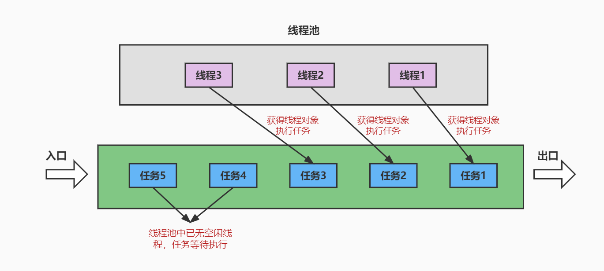
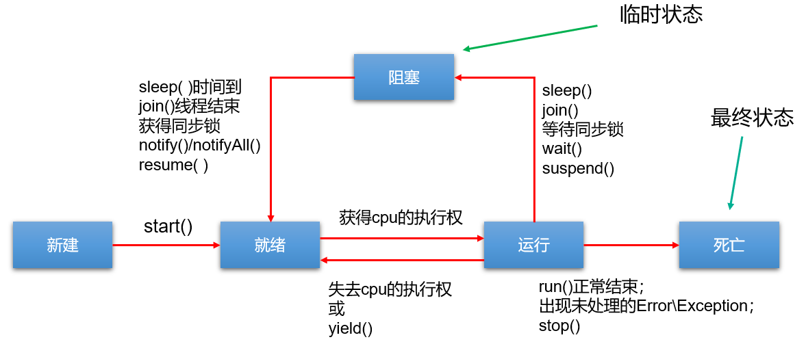

# 多线程

## 基本概念

- **程序（program）**：为完成特定任务，用某种语言编写的`一组指令的集合`。即指`一段静态的代码`，静态对象。

- **进程（process）**：程序的一次执行过程，或是正在内存中运行的应用程序。如：运行中的QQ，运行中的网易音乐播放器。

  * 每个进程都有一个独立的内存空间，系统运行一个程序即是一个进程从创建、运行到消亡的过程。（生命周期）
  * 程序是静态的，进程是动态的
  * 进程作为`操作系统调度和分配资源的最小单位`（亦是系统运行程序的基本单位），系统在运行时会为每个进程分配不同的内存区域。
  * 现代的操作系统，大都是支持多进程的，支持同时运行多个程序。比如：现在我们上课一边使用编辑器，一边使用录屏软件，同时还开着画图板，dos窗口等软件。

- **线程（thread）**：进程可进一步细化为线程，是程序内部的`一条执行路径`。一个进程中至少有一个线程。

  - 一个进程同一时间若`并行`执行多个线程，就是支持多线程的。

  

  - 线程作为`CPU调度和执行的最小单位`。

  - 一个进程中的多个线程共享相同的内存单元，它们从同一个堆中分配对象，可以访问相同的变量和对象。这就使得线程间通信更简便、高效。但多个线程操作共享的系统资源可能就会带来`安全的隐患`。
  - 下图中，红框的蓝色区域为线程独享，黄色区域为线程共享。

  

  > 注意：
  >
  > 不同的进程之间是不共享内存的。
  >
  > 进程之间的数据交换和通信的成本很高。

- **线程的调度**

  - **分时调度**

    所有线程`轮流使用` CPU 的使用权，并且平均分配每个线程占用 CPU 的时间。


  - **抢占式调度**

    让`优先级高`的线程以`较大的概率`优先使用 CPU。如果线程的优先级相同，那么会随机选择一个(线程随机性)，Java使用的为抢占式调度。

- **单核CPU和多核CPU**

  单核CPU，在一个时间单元内，只能执行一个线程的任务。例如，可以把CPU看成是医院的医生诊室，在一定时间内只能给一个病人诊断治疗。所以单核CPU就是，代码经过前面一系列的前导操作（类似于医院挂号，比如有10个窗口挂号），然后到cpu处执行时发现，就只有一个CPU（对应一个医生），大家排队执行。

  这时候想要提升系统性能，只有两个办法，要么提升CPU性能（让医生看病快点），要么多加几个CPU（多整几个医生），即为多核的CPU。

  `问题：多核的效率是单核的倍数吗？`譬如4核A53的cpu，性能是单核A53的4倍吗？理论上是，但是实际不可能，至少有两方面的损耗。

  - `一个是多个核心的其他共用资源限制`。譬如，4核CPU对应的内存、cache、寄存器并没有同步扩充4倍。这就好像医院一样，1个医生换4个医生，但是做B超检查的还是一台机器，性能瓶颈就从医生转到B超检查了。
  - `另一个是多核CPU之间的协调管理损耗`。譬如多个核心同时运行两个相关的任务，需要考虑任务同步，这也需要消耗额外性能。好比公司工作，一个人的时候至少不用开会浪费时间，自己跟自己商量就行了。两个人就要开会同步工作，协调分配，所以工作效率绝对不可能达到2倍。

- **并行与并发**

  * **并行（parallel）**：指两个或多个事件在`同一时刻`发生（同时发生）。指在同一时刻，有`多条指令`在`多个CPU`上`同时`执行。比如：多个人同时做不同的事。

    

    

  * **并发（concurrency）**：指两个或多个事件在`同一个时间段内`发生。即在一段时间内，有`多条指令`在`单个CPU`上`快速轮换、交替`执行，使得在宏观上具有多个进程同时执行的效果。

    

    


  在操作系统中，启动了多个程序，`并发`指的是在一段时间内宏观上有多个程序同时运行，这在单核 CPU 系统中，每一时刻只能有一个程序执行，即微观上这些程序是分时的交替运行，只不过是给人的感觉是同时运行，那是因为分时交替运行的时间是非常短的。

  而在多核 CPU 系统中，则这些可以`并发`执行的程序便可以分配到多个CPU上，实现多任务并行执行，即利用每个处理器来处理一个可以并发执行的程序，这样多个程序便可以同时执行。目前电脑市场上说的多核 CPU，便是多核处理器，核越多，`并行`处理的程序越多，能大大的提高电脑运行的效率。

- **Java线程的分类**：用户线程 和 守护线程
  - 用户线程：用户线程是指在程序运行过程中创建的线程，默认情况下是用户线程。当所有的用户线程都执行完毕后，JVM会自动退出。如果用户线程中仍然有活动线程，JVM不会退出。
  - 守护线程：是用来服务用户线程的，当所有的用户线程结束时就会退出，JVM的垃圾回收线程就是典型的守护线程，调用setDaemon(true)方法可将指定线程设置为守护线程，必须在线程启动之前设置，否则会报IllegalThreadStateException异常。
- **多线程的优点**
  1. 提高应用程序的响应。对图形化界面更有意义，可增强用户体验。
  2. 提高计算机系统CPU的利用率

  3. 改善程序结构。将既长又复杂的进程分为多个线程，独立运行，利于理解和修改
- **何时需要多线程**
  - 程序需要同时执行两个或多个任务。
  - 程序需要实现一些需要等待的任务时，如用户输入、文件读写操作、网络操作、搜索等。
  - 需要一些后台运行的程序时。

## 线程的创建

### 概述

- Java语言的JVM允许程序运行多个线程，使用`java.lang.Thread`类代表**线程**，所有的线程对象都必须是Thread类或其子类的实例。

- Thread类的特性
  - 每个线程都是通过某个特定Thread对象的run()方法来完成操作的，因此把run()方法体称为`线程执行体`。
  - 通过该Thread对象的start()方法来启动这个线程，而非直接调用run()
  - 要想实现多线程，必须在主线程中创建新的线程对象。

### 继承Thread类

1. 创建一个继承于Thread类的子类。
2. 重写Thread类的run()方法。
3. 创建Thread类的子类的对象。
4. 通过此对象调用start()来启动一个线程。

代码如下：

```java
//自定义线程类
public class MyThread extends Thread {
    //定义指定线程名称的构造方法
    public MyThread(String name) {
        //调用父类的String参数的构造方法，指定线程的名称
        super(name);
    }
    /**
     * 重写run方法，完成该线程执行的逻辑
     */
    @Override
    public void run() {
        for (int i = 0; i < 10; i++) {
            System.out.println(getName()+"：正在执行！"+i);
        }
    }
}
```

测试类：

```java
public class TestMyThread {
    public static void main(String[] args) {
        //创建自定义线程对象1
        MyThread mt1 = new MyThread("子线程1");
        //开启子线程1
        mt1.start();
        
        //创建自定义线程对象2
        MyThread mt2 = new MyThread("子线程2");
        //开启子线程2
        mt2.start();
        
        //在主方法中执行for循环
        for (int i = 0; i < 10; i++) {
            System.out.println("main线程！"+i);
        }
    }
}
```


> 注意：
>
> 1. 如果自己手动调用run()方法，那么就只是普通方法，没有启动多线程模式。
>
> 2. run()方法由JVM调用，什么时候调用，执行的过程控制都有操作系统的CPU调度决定。
>
> 3. 想要启动多线程，必须调用start方法。
>
> 4. 一个线程对象只能调用一次start()方法启动，如果重复调用了，则将抛出以上的异常“`IllegalThreadStateException`”。

### 实现Runnable接口

Java有单继承的限制，当我们无法继承Thread类时，那么该如何做呢？在核心类库中提供了Runnable接口，我们可以实现Runnable接口，重写run()方法，然后再通过Thread类的对象代理启动和执行我们的线程体run()方法

步骤如下：

1. 定义Runnable接口的实现类，并重写该接口的run()方法，该run()方法的方法体同样是该线程的线程执行体。
2. 创建Runnable实现类的实例，并以此实例作为Thread的target参数来创建Thread对象，该Thread对象才是真正
   的线程对象。

3. 调用线程对象的start()方法，启动线程。调用Runnable接口实现类的run方法。

代码如下：

```java
public class MyRunnable implements Runnable {
    @Override
    public void run() {
        for (int i = 0; i < 20; i++) {
            System.out.println(Thread.currentThread().getName() + " " + i);
        }
    }
}
```

测试类：

```java
public class TestMyRunnable {
    public static void main(String[] args) {
        //创建自定义类对象  线程任务对象
        MyRunnable mr = new MyRunnable();
        //创建线程对象
        Thread t = new Thread(mr, "长江");
        t.start();
        for (int i = 0; i < 20; i++) {
            System.out.println("黄河 " + i);
        }
    }
}
```

通过实现Runnable接口，使得该类有了多线程类的特征。所有的分线程要执行的代码都在run方法里面。

在启动的多线程的时候，需要先通过Thread类的构造方法Thread(Runnable target) 构造出对象，然后调用Thread对象的start()方法来运行多线程代码。

实际上，所有的多线程代码都是通过运行Thread的start()方法来运行的。因此，不管是继承Thread类还是实现
Runnable接口来实现多线程，最终还是通过Thread的对象的API来控制线程的，熟悉Thread类的API是进行多线程编程的基础。

说明：Runnable对象仅仅作为Thread对象的target，Runnable实现类里包含的run()方法仅作为线程执行体。
而实际的线程对象依然是Thread实例，只是该Thread线程负责执行其target的run()方法。


- **变形写法**

使用匿名内部类对象来实现线程的创建和启动

```java
new Thread("新的线程！"){
	@Override
	public void run() {
		for (int i = 0; i < 10; i++) {
			System.out.println(getName()+"：正在执行！"+i);
		}
	}
}.start();
```

```java
new Thread(new Runnable(){
	@Override
	public void run() {
		for (int i = 0; i < 10; i++) {
			System.out.println(Thread.currentThread().getName()+"：" + i);
		}
	}
}).start();
```

- **对比继承Thread类和实现Runnable接口两种方式**

  **联系**

  Thread类实际上也是实现了Runnable接口的类。即：

  ```java
  public class Thread extends Object implements Runnable
  ```

  **区别**

  - 继承Thread：线程代码存放Thread子类run方法中。

  - 实现Runnable：线程代码存在接口的子类的run方法。

  **实现Runnable接口比继承Thread类所具有的优势**

  - 避免了单继承的局限性
  - 多个线程可以共享同一个接口实现类的对象，非常适合多个相同线程来处理同一份资源。
  - 增加程序的健壮性，实现解耦操作，代码可以被多个线程共享，代码和线程独立。

### 实现Callable接口（JDK5.0新增）

- 与使用Runnable相比， Callable功能更强大些
  - 相比run()方法，可以有返回值
  - 方法可以抛出异常
  - 支持泛型的返回值（需要借助FutureTask类，获取返回结果）
- Future接口
  - 可以对具体Runnable、Callable任务的执行结果进行取消、查询是否完成、获取结果等。
  - FutureTask是Futrue接口的唯一的实现类
  - FutureTask 同时实现了Runnable, Future接口。它既可以作为Runnable被线程执行，又可以作为Future得到Callable的返回值
- 缺点：在获取分线程执行结果的时候，当前线程（或是主线程）受阻塞，效率较低。
- 代码举例

```java
//1.创建一个实现Callable的实现类
class NumThread implements Callable {
    //2.实现call方法，将此线程需要执行的操作声明在call()中
    @Override
    public Object call() throws Exception {
        int sum = 0;
        for (int i = 1; i <= 100; i++) {
            if (i % 2 == 0) {
                System.out.println(i);
                sum += i;
            }
        }
        return sum;
    }
}


public class CallableTest {
    public static void main(String[] args) {
        //3.创建Callable接口实现类的对象
        NumThread numThread = new NumThread();

        //4.将此Callable接口实现类的对象作为传递到FutureTask构造器中，创建FutureTask的对象
        FutureTask futureTask = new FutureTask(numThread);
        //5.将FutureTask的对象作为参数传递到Thread类的构造器中，创建Thread对象，并调用start()
        new Thread(futureTask).start();

        // 接收返回值
        try {
            //6.获取Callable中call方法的返回值
            //get()返回值即为Callable实现类重写的call()的返回值。
            Object sum = futureTask.get();
            System.out.println("总和为：" + sum);
        } catch (InterruptedException | ExecutionException e) {
            e.printStackTrace();
        }
    }

}
```

### 使用线程池（JDK5.0新增）

**现有问题：**

如果并发的线程数量很多，并且每个线程都是执行一个时间很短的任务就结束了，这样频繁创建线程就会大大降低系统的效率，因为频繁创建线程和销毁线程需要时间。

那么有没有一种办法使得线程可以复用，即执行完一个任务，并不被销毁，而是可以继续执行其他的任务？

**思路：**提前创建好多个线程，放入线程池中，使用时直接获取，使用完放回池中。可以避免频繁创建销毁、实现重复利用。类似生活中的公共交通工具。



**好处：**

- 提高响应速度（减少了创建新线程的时间）

- 降低资源消耗（重复利用线程池中线程，不需要每次都创建）

- 便于线程管理
  - corePoolSize：核心池的大小
  - maximumPoolSize：最大线程数
  - keepAliveTime：线程没有任务时最多保持多长时间后会终止
  - …

**线程池相关API**

- JDK5.0之前，我们必须手动自定义线程池。从JDK5.0开始，Java内置线程池相关的API。在java.util.concurrent包下提供了线程池相关API：`ExecutorService` 和 `Executors`。
- `ExecutorService`：真正的线程池接口。常见子类ThreadPoolExecutor
  - `void execute(Runnable command)` ：执行任务/命令，没有返回值，一般用来执行Runnable
  - `<T> Future<T> submit(Callable<T> task)`：执行任务，有返回值，一般用来执行Callable
  - `void shutdown()` ：关闭连接池
- `Executors`：一个线程池的工厂类，通过此类的静态工厂方法可以创建多种类型的线程池对象。
  - `Executors.newCachedThreadPool()`：创建一个可**根据需要创建新线程**的线程池
  - `Executors.newFixedThreadPool(int nThreads)`：创建一个**可重用固定线程数量**的线程池
  - `Executors.newSingleThreadExecutor()` ：创建一个**只有一个线程**的线程池
  - `Executors.newScheduledThreadPool(int corePoolSize)`：创建一个线程池，它可安排在给定**延迟**后运行命令或者**定期**地执行。

**代码举例：**

```java
class NumberThread implements Runnable{

    @Override
    public void run() {
        for(int i = 0;i <= 100;i++){
            if(i % 2 == 0){
                System.out.println(Thread.currentThread().getName() + ": " + i);
            }
        }
    }
}

class NumberThread1 implements Runnable{

    @Override
    public void run() {
        for(int i = 0;i <= 100;i++){
            if(i % 2 != 0){
                System.out.println(Thread.currentThread().getName() + ": " + i);
            }
        }
    }
}

class NumberThread2 implements Callable {
    @Override
    public Object call() throws Exception {
        int evenSum = 0;//记录偶数的和
        for(int i = 0;i <= 100;i++){
            if(i % 2 == 0){
                evenSum += i;
            }
        }
        return evenSum;
    }

}

public class ThreadPoolTest {

    public static void main(String[] args) {
        //1. 提供指定线程数量的线程池
        ExecutorService service = Executors.newFixedThreadPool(10);
        ThreadPoolExecutor service1 = (ThreadPoolExecutor) service;
//        //设置线程池的属性
//        System.out.println(service.getClass());//ThreadPoolExecutor
        service1.setMaximumPoolSize(50); //设置线程池中线程数的上限

        //2.执行指定的线程的操作
        service.execute(new NumberThread());//适合适用于Runnable
        service.execute(new NumberThread1());//适合适用于Runnable

        try {
            Future future = service.submit(new NumberThread2());//适合使用于Callable
            System.out.println("总和为：" + future.get());
        } catch (Exception e) {
            e.printStackTrace();
        }
        //3.关闭连接池
        service.shutdown();
    }

}
```

**ThreadPoolExecutor**

刚才我们是通过Executors中的静态方法去创建线程池的，通过查看源代码我们发现，其底层都是通过ThreadPoolExecutor构建的。比如：newFixedThreadPool方法的源码：

````java
public static ExecutorService newFixedThreadPool(int nThreads) {
    
    // 创建了ThreadPoolExecutor对象，然后直接返回
	return new ThreadPoolExecutor(nThreads, nThreads,0L, TimeUnit.MILLISECONDS, new LinkedBlockingQueue<Runnable>());
}
````

那么也可以使用ThreadPoolExecutor去创建线程池。

ThreadPoolExecutor最完整的构造方法：

```java
public ThreadPoolExecutor(int corePoolSize,
                              int maximumPoolSize,
                              long keepAliveTime,
                              TimeUnit unit,
                              BlockingQueue<Runnable> workQueue,
                              ThreadFactory threadFactory,
                              RejectedExecutionHandler handler)
```

参数说明

```java
corePoolSize：   核心线程的最大值，不能小于0
maximumPoolSize：最大线程数，不能小于等于0，maximumPoolSize >= corePoolSize
keepAliveTime：  空闲线程最大存活时间,不能小于0
unit：           时间单位
workQueue：      任务队列，不能为null
threadFactory：  创建线程工厂,不能为null      
handler：        任务的拒绝策略,不能为null    
```

例子：

```java
public class ThreadPoolExecutorDemo01 {

    // 演示基本使用
    public static void main(String[] args) {

        // 通过ThreadPoolExecutor创建一个线程池对象
        ThreadPoolExecutor threadPoolExecutor = new ThreadPoolExecutor(1 , 3 , 60 , TimeUnit.SECONDS ,
                new ArrayBlockingQueue<Runnable>(3) , Executors.defaultThreadFactory() , new ThreadPoolExecutor.AbortPolicy()) ;

        /**
         * 以上代码表示的意思是：核心线程池中的线程数量最大为1,整个线程池中最多存在3个线程,空闲线程最大的存活时间为60,时间单位为秒,阻塞队列使用的是有界阻塞队列
         * 容量为3,使用默认的线程工厂;以及默认的任务处理策略
         */

        // 提交任务
        threadPoolExecutor.submit( () -> {
            System.out.println(Thread.currentThread().getName() + "------>>>执行了任务");
        });

        // 关闭线程池
        threadPoolExecutor.shutdown();

    }
}
```

## Thread类

### 构造器

- public Thread() :分配一个新的线程对象。
- public Thread(String name) :分配一个指定名字的新的线程对象。
- public Thread(Runnable target) :指定创建线程的目标对象，它实现了Runnable接口中的run方法
- public Thread(Runnable target,String name) :分配一个带有指定目标新的线程对象并指定名字。

### 常用方法系列1

* public void run()：此线程要执行的任务在此处定义代码。
* public void start()：导致此线程开始执行; Java虚拟机调用此线程的run方法。
* public String getName()：获取当前线程名称。
* public void setName(String name)：设置该线程名称。
* public static Thread currentThread()：返回对当前正在执行的线程对象的引用。在Thread子类中就是this，通常用于主线程和Runnable实现类
* public static void sleep(long millis)：使当前正在执行的线程以指定的毫秒数暂停（暂时停止执行）。
* public static void yield()：yield只是让当前线程暂停一下，让系统的线程调度器重新调度一次，希望优先级与当前线程相同或更高的其他线程能够获得执行机会，但是这个不能保证，完全有可能的情况是，当某个线程调用了yield方法暂停之后，线程调度器又将其调度出来重新执行。

### 常用方法系列2

* public final boolean isAlive()：测试线程是否处于活动状态。如果线程已经启动且尚未终止，则为活动状态。 

* void join()：等待该线程终止。 

  void join(long millis)：等待该线程终止的时间最长为 millis 毫秒。如果millis时间到，将不再等待。 

  void join(long millis, int nanos)：等待该线程终止的时间最长为 millis 毫秒 + nanos 纳秒。 

* public final void stop()：`已过时`，不建议使用。强行结束一个线程的执行，直接进入死亡状态。run()即刻停止，可能会导致一些清理性的工作得不到完成，如文件，数据库等的关闭。同时，会立即释放该线程所持有的所有的锁，导致数据得不到同步的处理，出现数据不一致的问题。

* void suspend() / void resume(): 这两个操作就好比播放器的暂停和恢复。二者必须成对出现，否则非常容易发生死锁。suspend()调用会导致线程暂停，但不会释放任何锁资源，导致其它线程都无法访问被它占用的锁，直到调用resume()。`已过时`，不建议使用。

### 常用方法系列3

每个线程都有一定的优先级，同优先级线程组成先进先出队列（先到先服务），使用分时调度策略。优先级高的线程采用抢占式策略，获得较多的执行机会。每个线程默认的优先级都与创建它的父线程具有相同的优先级。

- Thread类的三个优先级常量：
  - MAX_PRIORITY（10）：最高优先级 
  - MIN _PRIORITY （1）：最低优先级
  - NORM_PRIORITY （5）：普通优先级，默认情况下main线程具有普通优先级。

* public final int getPriority() ：返回线程优先级 
* public final void setPriority(int newPriority) ：改变线程的优先级，范围在[1,10]之间。

案例：

- 声明一个匿名内部类继承Thread类，重写run方法，实现打印[1,100]之间的偶数，要求每隔1秒打印1个偶数。

- 声明一个匿名内部类继承Thread类，重写run方法，实现打印[1,100]之间的奇数，
  - 当打印到5时，让奇数线程暂停一下，再继续。
  - 当打印到5时，让奇数线程停下来，让偶数线程执行完再打印。

```java
public class TestThreadStateChange {
    public static void main(String[] args) {
        Thread te = new Thread() {
            @Override
            public void run() {
                for (int i = 2; i <= 100; i += 2) {
                    System.out.println("偶数线程：" + i);
                    try {
                        Thread.sleep(1000);
                    } catch (InterruptedException e) {
                        e.printStackTrace();
                    }
                }
            }
        };
        te.start();

        Thread to = new Thread() {
            @Override
            public void run() {
                for (int i = 1; i <= 100; i += 2) {
                    System.out.println("奇数线程：" + i);
                    if (i == 5) {
//                        Thread.yield();
                        try {
                            te.join();
                        } catch (InterruptedException e) {
                            e.printStackTrace();
                        }
                    }

                }
            }
        };
        to.start();
    }
}
```

## 多线程的生命周期

Java语言使用Thread类及其子类的对象来表示线程，在它的一个完整的生命周期中通常要经历如下一些状态：

###  JDK1.5之前：5种状态

线程的生命周期有五种状态：新建（New）、就绪（Runnable）、运行（Running）、阻塞（Blocked）、死亡（Dead）。CPU需要在多条线程之间切换，于是线程状态会多次在运行、阻塞、就绪之间切换。




**1.新建**

当一个Thread类或其子类的对象被声明并创建时，新生的线程对象处于新建状态。此时它和其他Java对象一样，仅仅由JVM为其分配了内存，并初始化了实例变量的值。此时的线程对象并没有任何线程的动态特征，程序也不会执行它的线程体run()。

**2.就绪**

但是当线程对象调用了start()方法之后，就不一样了，线程就从新建状态转为就绪状态。JVM会为其创建方法调用栈和程序计数器，当然，处于这个状态中的线程并没有开始运行，只是表示已具备了运行的条件，随时可以被调度。至于什么时候被调度，取决于JVM里线程调度器的调度。

> 注意：
>
> 程序只能对新建状态的线程调用start()，并且只能调用一次，如果对非新建状态的线程，如已启动的线程或已死亡的线程调用start()都会报错IllegalThreadStateException异常。

**3.运行**

如果处于就绪状态的线程获得了CPU资源时，开始执行run()方法的线程体代码，则该线程处于运行状态。如果计算机只有一个CPU核心，在任何时刻只有一个线程处于运行状态，如果计算机有多个核心，将会有多个线程并行(Parallel)执行。

当然，美好的时光总是短暂的，而且CPU讲究雨露均沾。对于抢占式策略的系统而言，系统会给每个可执行的线程一个小时间段来处理任务，当该时间用完，系统会剥夺该线程所占用的资源，让其回到就绪状态等待下一次被调度。此时其他线程将获得执行机会，而在选择下一个线程时，系统会适当考虑线程的优先级。

**4.阻塞**

当在运行过程中的线程遇到如下情况时，会让出 CPU 并临时中止自己的执行，进入阻塞状态：

* 线程调用了sleep()方法，主动放弃所占用的CPU资源；
* 线程试图获取一个同步监视器，但该同步监视器正被其他线程持有；
* 线程执行过程中，同步监视器调用了wait()，让它等待某个通知（notify）；
* 线程执行过程中，同步监视器调用了wait(time)
* 线程执行过程中，遇到了其他线程对象的加塞（join）；
* 线程被调用suspend方法被挂起（已过时，因为容易发生死锁）；

当前正在执行的线程被阻塞后，其他线程就有机会执行了。针对如上情况，当发生如下情况时会解除阻塞，让该线程重新进入就绪状态，等待线程调度器再次调度它：

* 线程的sleep()时间到；
* 线程成功获得了同步监视器；
* 线程等到了通知(notify)；
* 线程wait的时间到了
* 加塞的线程结束了；
* 被挂起的线程又被调用了resume恢复方法（已过时，因为容易发生死锁）；

**5.死亡**

线程会以以下三种方式之一结束，结束后的线程就处于死亡状态：

* run()方法执行完成，线程正常结束
* 线程执行过程中抛出了一个未捕获的异常（Exception）或错误（Error）
* 直接调用该线程的stop()来结束该线程（已过时）

### JDK1.5及之后：6种状态

在java.lang.Thread.State的枚举类中这样定义：

```java
public enum State {
	NEW,
	RUNNABLE,
	BLOCKED,
	WAITING,
	TIMED_WAITING,
	TERMINATED;
}
```

- `NEW（新建）`：线程刚被创建，但是并未启动。还没调用start方法。
- `RUNNABLE（可运行）`：这里没有区分就绪和运行状态。因为对于Java对象来说，只能标记为可运行，至于什么时候运行，不是JVM来控制的了，是OS来进行调度的，而且时间非常短暂，因此对于Java对象的状态来说，无法区分。

- `Teminated（被终止）`：表明此线程已经结束生命周期，终止运行。

- 重点说明，根据Thread.State的定义，**阻塞状态分为三种**：`BLOCKED`、`WAITING`、`TIMED_WAITING`。
  - `BLOCKED（锁阻塞）`：在API中的介绍为：一个正在阻塞、等待一个监视器锁（锁对象）的线程处于这一状态。只有获得锁对象的线程才能有执行机会。
    - 比如，线程A与线程B代码中使用同一锁，如果线程A获取到锁，线程A进入到Runnable状态，那么线程B就进入到Blocked锁阻塞状态。
  - `TIMED_WAITING（计时等待）`：在API中的介绍为：一个正在限时等待另一个线程执行一个（唤醒）动作的线程处于这一状态。
    - 当前线程执行过程中遇到Thread类的`sleep`或`join`，Object类的`wait`，LockSupport类的`park`方法，并且在调用这些方法时，`设置了时间`，那么当前线程会进入TIMED_WAITING，直到时间到，或被中断。
  - `WAITING（无限等待）`：在API中介绍为：一个正在无限期等待另一个线程执行一个特别的（唤醒）动作的线程处于这一状态。
    - 当前线程执行过程中遇到遇到Object类的`wait`，Thread类的`join`，LockSupport类的`park`方法，并且在调用这些方法时，`没有指定时间`，那么当前线程会进入WAITING状态，直到被唤醒。
      - 通过Object类的wait进入WAITING状态的要有Object的notify/notifyAll唤醒；
      - 通过Condition的await进入WAITING状态的要有Condition的signal方法唤醒；
      - 通过LockSupport类的park方法进入WAITING状态的要有LockSupport类的unpark方法唤醒
      - 通过Thread类的join进入WAITING状态，只有调用join方法的线程对象结束才能让当前线程恢复；

说明：当从WAITING或TIMED_WAITING恢复到Runnable状态时，如果发现当前线程没有得到监视器锁，那么会立刻转入BLOCKED状态。


## 线程安全问题及解决

当我们使用多个线程访问**同一资源**（可以是同一个变量、同一个文件、同一条记录等）的时候，若多个线程`只有读操作`，那么不会发生线程安全问题。但是如果多个线程中对资源有`读和写`的操作，就容易出现线程安全问题。

线程安全：在多线程同时访问一个资源时，线程间依照某种方式访问资源时，访问的结果总是能获取到正确的结果。

会出现线程安全问题的意思是线程可能会不安全，也就是多个线程访问同一资源时，可能会获取到错误的结果，比如重复处理、读取过期数据、数据被覆盖等。

也就是多个线程要对同一资源进行处理，但是多个线程之间访问资源的时机是随机的，可能是在一个线程之前访问，可能同时访问，也可能在一个线程执行过程中的时候进行访问，可能在一个线程执行之后访问，对于不同的时机，会导致不同的问题，比如重复处理、读取过期数据、数据覆盖等。

举一个例子：卖票

```java
class TicketSaleThread extends Thread {
    private static final Logger logger = LoggerFactory.getLogger(TicketSaleThread.class);
    private static int ticket = 100;

    @Override
    public void run() {
        while (ticket > 0) {
            try {
                // 等待一会，可以使得问题暴露的更明显
                Thread.sleep(10);
            } catch (InterruptedException e) {
                logger.error("卖票失败");
            }
            System.out.println(getName() + "卖出一张票，票号:" + ticket);
            ticket--;
        }
    }
}

public class SaleTicketDemo3 {
    public static void main(String[] args) {
        TicketSaleThread t1 = new TicketSaleThread();
        TicketSaleThread t2 = new TicketSaleThread();
        TicketSaleThread t3 = new TicketSaleThread();

        t1.setName("窗口1");
        t2.setName("窗口2");
        t3.setName("窗口3");

        t1.start();
        t2.start();
        t3.start();
    }
}
```

运行结果：


出现了两个1号票和一个-1号票，也就是出现了重卖和超卖。

重卖和超卖是错误的结果，因此上面这个例子出现了线程安全问题，线程不安全。

### 同步机制解决线程安全问题

要解决上述多线程并发访问一个资源的安全性问题:也就是解决重复票与不存在票问题，Java中提供了同步机制(synchronized)来解决。

同步机制引入案例：

窗口1线程进入操作的时候，窗口2和窗口3线程只能在外等着，窗口1操作结束，窗口1和窗口2和窗口3才有机会进入代码去执行。也就是说在某个线程修改共享资源的时候，其他线程不能修改该资源，等待修改完毕同步之后，才能去抢夺CPU资源，完成对应的操作，保证了数据的同步性，解决了线程不安全的现象。

为了保证每个线程都能正常执行原子操作，Java引入了线程同步机制。注意：在任何时候，最多允许一个线程拥有同步锁，谁拿到锁就进入代码块，其他的线程只能在外等着(BLOCKED)。

**同步机制解决线程安全问题的原理**：

同步机制的原理，其实就相当于给某段代码加“锁”，任何线程想要执行这段代码，都要先获得“锁”，我们称它为同步锁。因为Java对象在堆中的数据分为分为对象头、实例变量、空白的填充。而对象头中包含：

- Mark Word：记录了和当前对象有关的GC、锁标记等信息。
- 指向类的指针：每一个对象需要记录它是由哪个类创建出来的。
- 数组长度（只有数组对象才有）

哪个线程获得了“同步锁”对象之后，”同步锁“对象就会记录这个线程的ID，这样其他线程就只能等待了，除非这个线程”释放“了锁对象，其他线程才能重新获得/占用”同步锁“对象。

### 同步代码块和同步方法

- **同步代码块**：synchronized 关键字可以用于某个区块前面，表示只对这个区块的资源实行互斥访问。

格式:

```java
synchronized(同步锁){
     需要同步操作的代码
}
```

例子：卖票

```java
public class SaleTicketDemo5 {
    public static void main(String[] args) {
        // 创建资源对象
        Ticket ticket = new Ticket();

        // 启动多个线程操作资源类的对象
        Thread t1 = new Thread("窗口一") {
            @Override
            public void run() {
                while (true) {
                    synchronized (ticket) {
                        ticket.sale();
                    }
                }
            }
        };
        Thread t2 = new Thread("窗口二") {
            @Override
            public void run() {
                while (true) {
                    synchronized (ticket) {
                        ticket.sale();
                    }
                }
            }
        };
        Thread t3 = new Thread(new Runnable() {
            @Override
            public void run() {
                while (true) {
                    synchronized (ticket) {
                        ticket.sale();
                    }
                }
            }
        }, "窗口三");


        t1.start();
        t2.start();
        t3.start();
    }
}

class Ticket {
    private int ticket = 1000;

    public void sale() {
        if (ticket > 0) {
            System.out.println(Thread.currentThread().getName() + "卖出一张票，票号:" + ticket);
            ticket--;
        } else {
            System.out.println("票卖完了");
        }
    }
}
```

synchronized的同步锁对象可以是任意类型，可以用this、Class对象等，但是必须保证竞争“同一个共享资源”的多个线程必须**使用同一个**“同步锁对象”。

- **同步方法**：synchronized 关键字直接修饰方法，表示同一时刻只有一个线程能进入这个方法，其他线程在外面等着。

例子：卖票

**静态方法：**

```java
class TicketSaleThread extends Thread{
    private static int ticket = 100;
    @Override
    public void run(){
        while (ticket > 0) {
            saleOneTicket();
        }
    }

    public synchronized static void saleOneTicket(){
        if(ticket > 0) {
            System.out.println(Thread.currentThread().getName() + "卖出一张票，票号:" + ticket);
            ticket--;
        }
    }
}
public class SaleTicketDemo3 {
    public static void main(String[] args) {
        TicketSaleThread t1 = new TicketSaleThread();
        TicketSaleThread t2 = new TicketSaleThread();
        TicketSaleThread t3 = new TicketSaleThread();

        t1.setName("窗口1");
        t2.setName("窗口2");
        t3.setName("窗口3");

        t1.start();
        t2.start();
        t3.start();
    }
}
```

**非静态方法：**

```java
class TicketSaleRunnable implements Runnable {
    private int ticket = 100;

    @Override
    public void run() {
        while (ticket > 0) {
            saleOneTicket();
        }
    }

    public synchronized void saleOneTicket() {
        if (ticket > 0) {
            System.out.println(Thread.currentThread().getName() + "卖出一张票，票号:" + ticket);
            ticket--;
        }
    }
}

public class SaleTicketDemo4 {
    public static void main(String[] args) {
        TicketSaleRunnable tr = new TicketSaleRunnable();
        Thread t1 = new Thread(tr, "窗口一");
        Thread t2 = new Thread(tr, "窗口二");
        Thread t3 = new Thread(tr, "窗口三");

        t1.start();
        t2.start();
        t3.start();
    }
}
```

### synchronized的同步锁对象是什么

同步锁对象可以是任意类型，但是必须保证竞争“同一个共享资源”的多个线程必须使用同一个“同步锁对象”。

对于同步代码块来说，同步锁对象是由程序员手动指定的（很多时候也是指定为this或类名.class），但是对于同步方法来说，同步锁对象只能是默认的：

- 静态方法：当前类的Class对象（类名.class）

- 非静态方法：this

###  同步操作的思考

1、如何找问题，即代码是否存在线程安全？
（1）明确哪些代码是多线程运行的代码
（2）明确多个线程是否有共享数据
（3）明确多线程运行代码中是否有多条语句操作共享数据

2、如何解决呢？
对多条操作共享数据的语句，只能让一个线程都执行完，在执行过程中，其他线程不可以参与执行。
即所有操作共享数据的这些语句都要放在同步范围中

3、切记：

范围太小：不能解决安全问题

范围太大：因为一旦某个线程抢到锁，其他线程就只能等待，所以范围太大，效率会降低，不能合理利用CPU资源。

### Lock(锁) - JDK5.0新特性

- JDK5.0的新增功能，保证线程的安全。与采用synchronized相比，Lock可提供多种锁方案，更灵活、更强大。Lock通过显式定义同步锁对象来实现同步。同步锁使用Lock对象充当。
- java.util.concurrent.locks.Lock接口是控制多个线程对共享资源进行访问的工具。锁提供了对共享资源的独占访问，每次只能有一个线程对Lock对象加锁，线程开始访问共享资源之前应先获得Lock对象。
- 在实现线程安全的控制中，比较常用的是`ReentrantLock`，可以显式加锁、释放锁。
  - ReentrantLock类实现了 Lock 接口，它拥有与 synchronized 相同的并发性和内存语义，但是添加了类似锁投票、定时锁等候和可中断锁等候的一些特性。此外，它还提供了在激烈争用情况下更佳的性能。
- Lock锁也称同步锁，加锁与释放锁方法，如下：

  * public void lock(): 加同步锁。
  * public void unlock(): 释放同步锁。

- 代码结构

```java
class A{
    // 1.创建Lock的实例，必须确保多个线程共享同一个Lock实例
	private final ReentrantLock lock = new ReenTrantLock();
	public void method(){
        // 2.调用lock()，实现需共享的代码的锁定
		lock.lock();
		try{
			// 保证线程安全的代码;
		}
		finally{
            // 3.调用unlock()，释放共享代码的锁定
			lock.unlock();  
		}
	}
}
```

`lock()` 一定要写在try的外面，在`try-finally`外加锁，如果因为异常导致加锁失败，`try-finally`块中的代码不会执行。相反，如果在`try{}`代码块中加锁失败，`finally`中的代码无论如何都会执行，但是由于当前线程加锁失败并没有持有`lock`对象锁 ，所以程序会抛出异常。

例子：卖票

```java
class Window implements Runnable{
   int ticket = 100;
    // 1.创建Lock的实例，必须确保多个线程共享同一个Lock实例
   private final ReentrantLock lock = new ReentrantLock();

   @Override
   public void run(){
      while(true){
         // 2.调动lock()，实现需共享的代码的锁定
         lock.lock();
         try{
            if(ticket > 0){
               try {
                  Thread.sleep(10);
               } catch (InterruptedException e) {
                  e.printStackTrace();
               }
               System.out.println(ticket--);
            }else{
               break;
            }
         }finally{
            // 3.调用unlock()，释放共享代码的锁定
            lock.unlock();
         }
      }
   }
}

public class ThreadLock {
   public static void main(String[] args) {
      Window t = new Window();
      Thread t1 = new Thread(t);
      Thread t2 = new Thread(t);
      
      t1.start();
      t2.start();
   }
}
```

**synchronized与Lock的对比**

1. Lock是显式锁（手动开启和关闭锁，别忘记关闭锁），synchronized是隐式锁，出了作用域、遇到异常等自动解锁
2. Lock只有代码块锁，synchronized有代码块锁和方法锁
3. 使用Lock锁，JVM将花费较少的时间来调度线程，性能更好。并且具有更好的扩展性（提供更多的子类），更体现面向对象。
4. Lock锁可以对读不加锁，对写加锁，synchronized不可以
5. Lock锁可以有多种获取锁的方式，可以从sleep的线程中抢到锁，synchronized不可以

> 说明：开发建议中处理线程安全问题优先使用顺序为：
>
> •    Lock ----> 同步代码块 ----> 同步方法


### 死锁

不同的线程分别占用对方需要的同步资源不放弃，都在等待对方放弃自己需要的同步资源，就形成了线程的死锁。


一旦出现死锁，整个程序既不会发生异常，也不会给出任何提示，只是所有线程处于阻塞状态，无法继续。

例子：商家：先付钱再发货，顾客：先发货再付钱

```java
public class TestDeadLock {
	public static void main(String[] args) {
		Object g = new Object();
		Object m = new Object();
		Owner s = new Owner(g,m);
		Customer c = new Customer(g,m);
		new Thread(s).start();
		new Thread(c).start();
	}
}
class Owner implements Runnable{
	private Object goods;
	private Object money;

	public Owner(Object goods, Object money) {
		super();
		this.goods = goods;
		this.money = money;
	}

	@Override
	public void run() {
		synchronized (goods) {
			System.out.println("先给钱");
			synchronized (money) {
				System.out.println("发货");
			}
		}
	}
}
class Customer implements Runnable{
	private Object goods;
	private Object money;

	public Customer(Object goods, Object money) {
		super();
		this.goods = goods;
		this.money = money;
	}

	@Override
	public void run() {
		synchronized (money) {
			System.out.println("先发货");
			synchronized (goods) {
				System.out.println("再给钱");
			}
		}
	}
}
```

**诱发死锁的原因：**

- 互斥条件：至少有一个资源必须处于非共享模式，即一次只能被一个线程使用。
- 阻塞时占用：一个线程因请求资源而阻塞时，对已获得的资源保持不放。
- 不可剥夺：线程已获得的资源在未使用完之前，不可被其他线程强行剥夺。
- 循环等待：多个线程形成一种循环等待资源的关系。

以上4个条件，同时出现就会触发死锁。

**解决死锁：**

死锁一旦出现，基本很难人为干预，只能尽量规避。可以考虑打破上面的诱发条件。

针对条件1：互斥条件基本上无法被破坏。因为线程需要通过互斥解决安全问题。

针对条件2：可以考虑一次性申请所有所需的资源，这样就不存在等待的问题。

针对条件3：占用部分资源的线程在进一步申请其他资源时，如果申请不到，就主动释放掉已经占用的资源。

针对条件4：可以将资源改为线性顺序。申请资源时，先申请序号较小的，这样避免循环等待问题。

### **对象锁和类锁**

1. 对象锁（也称为实例锁）：
   - 锁的范围：对象锁是针对对象实例的，每个对象实例都有一个关联的锁。当线程获取到对象的锁时，它可以独占该对象的所有同步代码块或同步方法。
   - 作用范围：对象锁的作用范围是在同一对象实例内部，不同对象实例之间的锁是互不影响的。
2. 类锁（也称为静态锁）：
   - 锁的范围：类锁是针对类的，每个类只有一个关联的锁。当线程获取到类的锁时，它可以独占该类的所有静态同步代码块或静态同步方法。
   - 作用范围：类锁的作用范围是在整个类的范围内，即使存在多个对象实例，它们共享同一个类锁。

其他区别包括：

- 对象锁和类锁的竞争范围不同。对象锁只影响同一个对象实例的线程竞争，而类锁会影响整个类的静态成员和方法的线程竞争。
- 对象锁和类锁的获取方式不同。对象锁通常使用synchronized关键字来实现，需要通过对象实例来获取锁；类锁可以使用synchronized关键字加在静态方法上或者通过Class对象来获取锁。
- 对象锁和类锁的释放方式不同。对象锁会在同步代码块或同步方法执行完毕后自动释放；类锁会在静态同步代码块或静态同步方法执行完毕后自动释放。

## volatile

### 并发编程的三个概念

#### 原子性

原子性：即一个操作或者多个操作 **要么全部执行**并且执行的过程不会被任何因素打断，**要么都不执行**。

一个很经典的例子就是银行账户转账问题：

　　比如从账户A向账户B转1000元，那么必然包括2个操作：从账户A减去1000元，往账户B加上1000元。如果这两个操作不具备原子性，假如在A中减去1000元后，在B加上1000元时出现异常，系统没有给B加上1000元，A就白白少了1000元。所以这两个操作要具备原子性才不会出现意外，当其中一个操作执行失败时，由于原子性，另一个操作也会失败。

同样地反映到并发编程中会出现什么结果呢？

　　举个最简单的例子，假如为一个32位的变量赋值过程不具备原子性的话，会发生什么后果？

```
i = 12;
```

 假若一个线程执行到这个语句时，我暂且假设为一个32位的变量赋值包括两个过程：为低16位赋值，为高16位赋值。

那么就可能发生一种情况：当将低16位数值写入之后，突然被中断，而此时又有一个线程去读取i的值，那么读取到的就是错误的数据。

在Java中，对基本数据类型的变量的读取和赋值操作是原子性操作，即这些操作是不可被中断的，要么执行，要么不执行。

#### 可见性

可见性：是指当多个线程访问同一个变量时，一个线程修改了这个变量的值，其他线程能够**立即看得到**修改的值。

举个简单的例子：

```java
//线程1执行的代码
int i = 0;
i = 10;
 
//线程2执行的代码
j = i;
```

假若执行线程1的是CPU1，执行线程2的是CPU2。由上面的分析可知，当线程1执行 i =10这句时，会先把i的初始值加载到CPU1的高速缓存中，然后赋值为10，那么在CPU1的高速缓存当中i的值变为10了，却没有立即写入到主存当中。

此时线程2执行 j = i，它会先去主存读取i的值并加载到CPU2的缓存当中，注意此时内存当中i的值还是0，那么就会使得j的值为0，而不是10。

这就是可见性问题，线程1对变量i修改了之后，线程2没有立即看到线程1修改的值。

对于可见性，Java提供了volatile关键字来保证可见性。

当一个共享变量被volatile修饰时，它会保证修改的值会立即被更新到主存，当有其他线程需要读取时，它会去内存中读取新值。

另外，通过synchronized和Lock也能够保证可见性，synchronized和Lock能保证同一时刻只有一个线程获取锁然后执行同步代码，并且在释放锁之前会将对变量的修改刷新到主存当中。因此可以保证可见性。

#### 有序性

有序性：即程序执行的顺序按照代码的先后**顺序**执行。

举个简单的例子：

```java
int i = 0;       
boolean flag = false;
i = 1;        //语句1 
flag = true;  //语句2
```

上面代码定义了一个int型变量，定义了一个boolean类型变量，然后分别对两个变量进行赋值操作。从代码顺序上看，语句1是在语句2前面的，但是JVM在真正执行这段代码的时候语句1**不一定**会在语句2前面执行，因为这里可能会发生**指令重排**。

指令重排：处理器为了提高程序运行效率，可能会对输入代码进行优化，它不保证程序中各个语句的执行先后顺序同代码中的顺序一致，但是它会保证程序最终执行结果和代码顺序执行的结果是一致的。

举个简单的例子：

```java
//线程1:
context = loadContext();   //语句1
inited = true;             //语句2
 
//线程2:
while(!inited ){
  sleep()
}
doSomethingwithconfig(context);
```

上面代码中，由于语句1和语句2没有数据方面的依赖，因此可能会被重排序。假如发生了重排序，在线程1执行过程中先执行语句2，而此是线程2会以为初始化工作已经完成，那么就会跳出while循环，去执行doSomethingwithconfig(context)方法，而此时context并没有被初始化，就会导致程序出错。

从上面可以看出，指令重排序不会影响单个线程的执行，但是在多线程环境下会影响结果的正确性。

也就是说，要想在多线程环境下，让程序正确地执行，必须要保证原子性、可见性以及有序性。只要有一个没有被保证，就有可能会导致程序运行不正确。

### volatile的作用和使用场景

- 可以保证**可见性**，即一个线程修改了某个变量的值，这新值对其他线程来说是立即可见的。
- 禁止进行指令重排序，提供一定的**有序性**。

volatile关键字的主要使用场景是在多线程环境下确保可见性和有序性：

1. 状态标志：当一个变量被多个线程共享，并且用于控制程序的状态转换时，可以将该变量声明为volatile。这样，当一个线程修改了该变量的值，其他线程可以立即看到最新的值，从而实现了状态的同步。
2. 双重检查：在单例模式等需要延迟初始化的场景中，使用volatile修饰的变量可以确保多个线程安全地获取实例。在双重检查锁定中，volatile变量可以防止指令重排序，保证实例的初始化操作按照正确的顺序进行。

例子1：状态标记量

```java
public class StateExample {
    private volatile boolean isRunning = true;
    
    public void stop() {
        isRunning = false;
    }
    
    public void run() {
        while (isRunning) {
            // 执行任务
        }
    }
}
```

例子2：双重检查

```java
public class Singleton {
    private static volatile Singleton instance;

    // 私有构造函数
    private Singleton() {}

    public static Singleton getInstance() {
        if (instance == null) {  // 第一次检查
            synchronized (Singleton.class) {
                if (instance == null) {  // 第二次检查
                    instance = new Singleton();
                }
            }
        }
        return instance;
    }
}
```

### volatile与synchronized的区别

1. volatile只能修饰实例变量和类变量，而synchronized可以修饰方法，以及代码块。

2. volatile保证数据的可见性，但是不保证原子性(多线程进行写操作，不保证线程安全)；而synchronized是一种排他（互斥）的机制(因此有时我们也将synchronized这种锁称之为排他（互斥）锁)，synchronized修饰的代码块，被修饰的代码块称之为同步代码块，无法被中断可以保证原子性，也可以间接的保证可见性。


## 线程的通信

当我们`需要多个线程`来共同完成一件任务，并且我们希望他们`有规律的执行`，那么多线程之间需要一些通信机制，可以协调它们的工作，以此实现多线程共同操作一份数据。

比如：线程A用来生产包子的，线程B用来吃包子的，包子可以理解为同一资源，线程A与线程B处理的动作，一个是生产，一个是消费，此时B线程必须等到A线程完成后才能执行，那么线程A与线程B之间就需要线程通信，即—— **等待唤醒机制。**

### 等待唤醒机制

这是多个线程间的一种`协作机制`。谈到线程我们经常想到的是线程间的`竞争（race）`，比如去争夺锁，但这并不是故事的全部，线程间也会有协作机制。

在一个线程满足某个条件时，就进入等待状态（`wait() / wait(time)`）， 等待其他线程执行完他们的指定代码过后再将其唤醒（`notify()`）;或可以指定wait的时间，等时间到了自动唤醒；在有多个线程进行等待时，如果需要，可以使用 `notifyAll()`来唤醒所有的等待线程。wait/notify 就是线程间的一种协作机制。

1. wait：线程不再活动，不再参与调度，进入 `wait set` 中，因此不会浪费 CPU 资源，也不会去竞争锁了，这时的线程状态是 WAITING 或 TIMED_WAITING。它还要等着别的线程执行一个`特别的动作`，也即“`通知（notify）`”或者等待时间到，在这个对象上等待的线程从wait set 中释放出来，重新进入到调度队列（`ready queue`）中
2. notify：则选取所通知对象的 wait set 中的一个线程释放；
3. notifyAll：则释放所通知对象的 wait set 上的全部线程。

> 注意：
>
> 被通知的线程被唤醒后也不一定能立即恢复执行，因为它当初中断的地方是在同步块内，而此刻它已经不持有锁，所以它需要再次尝试去获取锁（很可能面临其它线程的竞争），成功后才能在当初调用 wait 方法之后的地方恢复执行。
>
> 总结如下：
>
> - 如果能获取锁，线程就从 WAITING 状态变成 RUNNABLE（可运行） 状态；
> - 否则，线程就从 WAITING 状态又变成 BLOCKED（等待锁） 状态

### 举例

例题：使用两个线程打印 1-100。线程1, 线程2 交替打印

```java
class Communication implements Runnable {
    int i = 1;
    public void run() {
        while (true) {
            synchronized (this) {
                notify();
                if (i <= 100) {
                    System.out.println(Thread.currentThread().getName() + ":" + i++);
                } else
                    break;
                try {
                    wait();
                } catch (InterruptedException e) {
                    e.printStackTrace();
                }
            }
        }
    }
}
```

### 调用wait和notify需注意的细节

1. wait方法：指在一个已经进入了同步锁的线程内，让自己暂时让出同步锁，以便其他正在等待此锁的线程可以得到同步锁并运行，只有其他线程调用了notify方法，调用wait方法的一个或多个线程就会解除wait状态，重新参与竞争对象锁，程序如果可以再次得到锁，就可以继续向下运行。
2. notify方法：notify并不释放锁，只是告诉调用过wait方法的线程可以去参与获得锁的竞争了，但不是马上得到锁，因为锁还在别人手里，别人还没释放。
3. wait方法与notify方法必须要由`同一个锁对象调用`。因为：对应的锁对象可以通过notify唤醒使用同一个锁对象调用的wait方法后的线程。
4. wait方法与notify方法是属于Object类的方法的。因为：锁对象可以是任意对象，而任意对象的所属类都是继承了Object类的。
5. wait方法与notify方法必须要在`同步代码块`或者是`同步函数`中使用。因为：必须要`通过锁对象`调用这2个方法。否则会报java.lang.IllegalMonitorStateException异常。

### 生产者与消费者问题

等待唤醒机制可以解决经典的“生产者与消费者”的问题。生产者与消费者问题（英语：Producer-consumer problem），也称有限缓冲问题（英语：Bounded-buffer problem），是一个多线程同步问题的经典案例。该问题描述了两个（多个）`共享固定大小缓冲区的线程`——即所谓的“生产者”和“消费者”——在实际运行时会发生的问题。

生产者的主要作用是生成一定量的数据放到缓冲区中，然后重复此过程。与此同时，消费者也在缓冲区消耗这些数据。**该问题的关键就是要保证生产者不会在缓冲区满时加入数据，消费者也不会在缓冲区中空时消耗数据。**

**举例：**

生产者(Productor)将产品交给店员(Clerk)，而消费者(Customer)从店员处取走产品，店员一次只能持有固定数量的产品(比如:20），如果生产者试图生产更多的产品，店员会叫生产者停一下，如果店中有空位放产品了再通知生产者继续生产；如果店中没有产品了，店员会告诉消费者等一下，如果店中有产品了再通知消费者来取走产品。

类似的场景，比如厨师和服务员等。

**生产者与消费者问题中其实隐含了两个问题：**

* 线程安全问题：因为生产者与消费者共享数据缓冲区，产生安全问题。不过这个问题可以使用同步解决。
* 线程的协调工作问题：
  * 要解决该问题，就必须让生产者线程在缓冲区满时等待(wait)，暂停进入阻塞状态，等到下次消费者消耗了缓冲区中的数据的时候，通知(notify)正在等待的线程恢复到就绪状态，重新开始往缓冲区添加数据。同样，也可以让消费者线程在缓冲区空时进入等待(wait)，暂停进入阻塞状态，等到生产者往缓冲区添加数据之后，再通知(notify)正在等待的线程恢复到就绪状态。通过这样的通信机制来解决此类问题。

**代码实现：**

```java
public class ConsumerProducerTest {
	public static void main(String[] args) {
		Clerk clerk = new Clerk();
		Producer p1 = new Producer(clerk);
		
		Consumer c1 = new Consumer(clerk);
		Consumer c2 = new Consumer(clerk);
		
		p1.setName("生产者1");
		c1.setName("消费者1");
		c2.setName("消费者2");
		
		p1.start();
		c1.start();
		c2.start();
	}
}

//生产者
class Producer extends Thread{
	private Clerk clerk;
	
	public Producer(Clerk clerk){
		this.clerk = clerk;
	}
	
	@Override
	public void run() {
		
		System.out.println("=========生产者开始生产产品========");
		while(true){
			
			try {
				Thread.sleep(40);
			} catch (InterruptedException e) {
				e.printStackTrace();
			}
			
			//要求clerk去增加产品
			clerk.addProduct();
		}
	}
}

//消费者
class Consumer extends Thread{
	private Clerk clerk;
	
	public Consumer(Clerk clerk){
		this.clerk = clerk;
	}
	@Override
	public void run() {
		System.out.println("=========消费者开始消费产品========");
		while(true){
			
			try {
				Thread.sleep(90);
			} catch (InterruptedException e) {
				e.printStackTrace();
			}
			
			//要求clerk去减少产品
			clerk.minusProduct();
		}
	}
}

//资源类
class Clerk {
	private int productNum = 0;//产品数量
	private static final int MAX_PRODUCT = 20;
	private static final int MIN_PRODUCT = 1;
	
	//增加产品
	public synchronized void addProduct() {
		if(productNum < MAX_PRODUCT){
			productNum++;
			System.out.println(Thread.currentThread().getName() + 
					"生产了第" + productNum + "个产品");
			//唤醒消费者
			this.notifyAll();
		}else{
			
			try {
				this.wait();
			} catch (InterruptedException e) {
				e.printStackTrace();
			}
		}
	}

	//减少产品
	public synchronized void minusProduct() {
		if(productNum >= MIN_PRODUCT){
			System.out.println(Thread.currentThread().getName() + 
					"消费了第" + productNum + "个产品");
			productNum--;
			
			//唤醒生产者
			this.notifyAll();
		}else{
			
			try {
				this.wait();
			} catch (InterruptedException e) {
				e.printStackTrace();
			}
		}
	}
	
}
```

### sleep()和wait()的区别

相同点：一旦执行，都会使得当前线程结束执行状态，进入阻塞状态。

不同点：

① 定义方法所属的类：sleep():Thread中定义。  wait():Object中定义

② 使用范围的不同：sleep()可以在任何需要使用的位置被调用； wait():必须使用在同步代码块或同步方法中

③ 都在同步结构中使用的时候，是否释放同步监视器的操作不同：sleep():不会释放同步监视器 ;wait():会释放同步监视器

④ 结束等待的方式不同：sleep()：指定时间一到就结束阻塞。 wait():可以指定时间也可以无限等待直到notify或notifyAll。

### 是否释放锁的操作

任何线程进入同步代码块、同步方法之前，必须先获得对同步监视器的锁定，那么何时会释放对同步监视器的锁定呢？

#### 释放锁的操作

当前线程的同步方法、同步代码块执行结束。

当前线程在同步代码块、同步方法中遇到break、return终止了该代码块、该方法的继续执行。

当前线程在同步代码块、同步方法中出现了未处理的Error或Exception，导致当前线程异常结束。

当前线程在同步代码块、同步方法中执行了锁对象的wait()方法，当前线程被挂起，并释放锁。

#### 不会释放锁的操作

线程执行同步代码块或同步方法时，程序调用Thread.sleep()、Thread.yield()方法暂停当前线程的执行。

线程执行同步代码块时，其他线程调用了该线程的suspend()方法将该该线程挂起，该线程不会释放锁（同步监视器）。

- 应尽量避免使用suspend()和resume()这样的过时来控制线程。

## 并发集合

### ConcurrentHashMap

ConcurrentHashMap是Java中的一个线程安全的哈希表实现，它是在Java集合框架中的HashMap的并发版本。ConcurrentHashMap允许多个线程同时访问它，而不需要显式地进行同步操作。

JDK1.8的ConcurrentHashMap利用 `Node + CAS + synchronized` 来保证并发安全。

```java
public class ConcurrentHashMapExample {
    public static void main(String[] args) {
        // 创建ConcurrentHashMap实例
        ConcurrentHashMap<String, Integer> map = new ConcurrentHashMap<>();

        // 添加元素
        map.put("apple", 1);
        map.put("banana", 2);
        map.put("orange", 3);

        // 获取元素
        int value = map.get("banana");
        System.out.println("Value of 'banana': " + value);

        // 替换元素
        map.replace("orange", 4);

        // 删除元素
        map.remove("apple");

        // 遍历元素
        for (String key : map.keySet()) {
            System.out.println("Key: " + key + ", Value: " + map.get(key));
        }
    }
}
```

### CopyOnWriteArrayList

CopyOnWriteArrayList是Java中提供的一种线程安全的List实现类。它内部使用了一种称为"写时复制"（Copy-On-Write）的机制来实现线程安全性。

在CopyOnWriteArrayList中，当需要修改列表时（如添加、删除、更新元素），并不直接在原始数据上进行操作，而是先创建一个新的数据副本，然后在副本上进行修改操作。这样，原始数据保持不变，而修改操作只会影响到新的副本。

由于CopyOnWriteArrayList的写操作涉及到数据复制，因此它的写操作相对较慢。但是，读操作并不需要加锁，因为读取操作总是在原始数据上进行，不会受到其他线程的修改干扰，因此读操作具有较高的并发性能。

CopyOnWriteArrayList适用于以下场景：

1. 当需要频繁遍历列表，而对列表的修改操作相对较少时。
2. 当多个线程同时读取列表数据，但修改操作很少发生时。

```java
public class CopyOnWriteArrayListExample {
    public static void main(String[] args) {
        // 创建CopyOnWriteArrayList实例
        CopyOnWriteArrayList<String> list = new CopyOnWriteArrayList<>();

        // 添加元素
        list.add("apple");
        list.add("banana");
        list.add("orange");

        // 遍历元素
        for (String item : list) {
            System.out.println("Item: " + item);
        }

        // 修改元素
        list.set(1, "grape");

        // 删除元素
        list.remove("apple");

        // 遍历元素
        for (String item : list) {
            System.out.println("Item: " + item);
        }
    }
}
```

### ConcurrentLinkedQueue

ConcurrentLinkedQueue是Java中提供的一种基于链表实现的线程安全队列（Thread-Safe Queue）。它可以实现高并发读写操作，同时保证元素的顺序。

特点：

1. 内部采用链表作为数据存储结构，因此对于插入和删除操作，性能较高。
2. 支持高并发读写操作，且读写操作之间不会互相阻塞。
3. 不支持阻塞读取和阻塞写入操作，当队列为空时，获取元素会返回null。

由于ConcurrentLinkedQueue是一个无界队列，因此它的容量大小可以非常大，但也可能会占用较多的内存空间。

```java
public class ConcurrentLinkedQueueExample {
    public static void main(String[] args) {
        // 创建ConcurrentLinkedQueue实例
        ConcurrentLinkedQueue<Integer> queue = new ConcurrentLinkedQueue<>();

        // 向队列中添加元素
        queue.add(1);
        queue.offer(2);
        queue.add(3);

        // 从队列中获取元素
        int element1 = queue.poll();
        System.out.println("Element1: " + element1);

        int element2 = queue.peek();
        System.out.println("Element2: " + element2);

        int element3 = queue.poll();
        System.out.println("Element3: " + element3);

        // 获取队列大小
        int size = queue.size();
        System.out.println("Size: " + size);
    }
}
```

### BlockingQueue

- **ArrayBlockingQueue**

ArrayBlockingQueue是Java中提供的一种基于数组实现的阻塞队列（BlockingQueue）实现类。它可以在队列已满时，自动阻塞等待队列空闲，或在队列为空时，自动阻塞等待队列中有可用元素。

特点：

1. 内部采用数组作为数据存储结构，因此读写性能较高。
2. 支持阻塞读取和阻塞写入操作，当队列已满或队列为空时，线程会自动阻塞等待。
3. 支持设置容量大小，一旦设置无法更改。

由于ArrayBlockingQueue是一个有界队列，因此当队列已满时，所有尝试插入元素的线程都会被阻塞。同样地，当队列为空时，所有尝试读取元素的线程都会被阻塞。因此，在使用ArrayBlockingQueue时，需要格外注意队列的容量设置以及对队列空间的合理利用，以避免由于阻塞造成的死锁等问题。

```java
public class ArrayBlockingQueueExample {
    public static void main(String[] args) throws InterruptedException {
        // 创建ArrayBlockingQueue实例
        BlockingQueue<Integer> queue = new ArrayBlockingQueue<>(3);

        // 向队列中添加元素
        queue.put(1);
        queue.put(2);
        queue.put(3);

        // 尝试向已满的队列中添加元素，线程会自动阻塞等待
        queue.put(4);

        // 从队列中获取元素
        int element1 = queue.take();
        System.out.println("Element1: " + element1);

        int element2 = queue.take();
        System.out.println("Element2: " + element2);

        // 尝试从空队列中获取元素，线程会自动阻塞等待
        int element3 = queue.take();
        System.out.println("Element3: " + element3);

        // 获取队列大小
        int size = queue.size();
        System.out.println("Size: " + size);
    }
}
```

- **LinkedBlockingQueue**

LinkedBlockingQueue是Java中提供的一种基于链表实现的阻塞队列（BlockingQueue）实现类。它可以在队列已满时，自动阻塞等待队列空闲，或在队列为空时，自动阻塞等待队列中有可用元素。

特点：

1. 内部采用链表作为数据存储结构，因此对于插入和删除操作，性能较高。
2. 支持阻塞读取和阻塞写入操作，当队列已满或队列为空时，线程会自动阻塞等待。
3. 默认容量大小为Integer.MAX_VALUE，但也可以通过构造函数设置不同的容量限制。

```java
public class LinkedBlockingQueueExample {
    public static void main(String[] args) throws InterruptedException {
        // 创建LinkedBlockingQueue实例
        BlockingQueue<Integer> queue = new LinkedBlockingQueue<>();

        // 向队列中添加元素
        queue.put(1);
        queue.put(2);
        queue.put(3);

        // 尝试向已满的队列中添加元素，线程会自动阻塞等待
        queue.put(4);

        // 从队列中获取元素
        int element1 = queue.take();
        System.out.println("Element1: " + element1);

        int element2 = queue.take();
        System.out.println("Element2: " + element2);

        // 尝试从空队列中获取元素，线程会自动阻塞等待
        int element3 = queue.take();
        System.out.println("Element3: " + element3);

        // 获取队列大小
        int size = queue.size();
        System.out.println("Size: " + size);
    }
}
```

# 实践

- 模拟线程池的实现，包括：
  - **线程池创建：**
    - 设计一个`ThreadPool`类，用于模拟线程池的基本功能
    - 实现线程池的创建和初始化
  - **任务提交：**
    - 提供一个`submit`方法，接收`Runnable`任务，并将任务提交到线程池
  - **线程池参数配置：**
    - 允许设置线程池的参数，如核心线程数、最大线程数、线程空闲时间等。
  - **任务执行：**
    - 实现任务的执行逻辑，包括新任务的创建和线程的启动。
  - **线程池状态监控：**
    - 提供方法获取线程池的当前状态，如运行中、关闭中、已关闭等
  - **异常处理：**
    - 处理任务执行过程中可能出现的异常，保证线程池的稳定运行。
  - **任务队列：**
    - 使用队列存储提交的任务，实现任务的按序执行
- 扩展（可选）：
  - **线程工厂：**
    - 提供自定义线程工厂的功能，允许用户自定义线程的创建过程。
  - **任务拒绝策略：**
    - 允许用户配置线程池的任务拒绝策略，处理任务队列已满的情况

```java
/**
 * 模拟线程池
 * @author herry
 */
public class ThreadPool {
    /**
     * 核心线程数
     */
    private final int corePoolSize;

    /**
     * 最大线程数
     */
    private final int maximumPoolSize;

    /**
     * 线程空闲时间
     */
    private final long keepAliveTime;

    /**
     * 时间单位
     */
    private final TimeUnit unit;

    /**
     * 工作队列
     */
    private final BlockingQueue<Runnable> workQueue;

    /**
     * 线程工厂
     */
    private final ThreadFactory threadFactory;

    /**
     * 任务拒绝策略
     */
    private final RejectedExecutionHandler handler;

    /**
     * 当前活跃的线程数量
     */
    private final AtomicInteger activeCount = new AtomicInteger(0);

    /**
     * 状态：0：运行中，1：关闭中，2：已关闭
     */
    private volatile int status = 0;

    /**
     * 锁对象
     */
    private final Object lock = new Object();

    public ThreadPool(int corePoolSize, int maximumPoolSize, long keepAliveTime, TimeUnit unit,
                      BlockingQueue<Runnable> workQueue, ThreadFactory threadFactory, RejectedExecutionHandler handler) {
        this.corePoolSize = corePoolSize;
        this.maximumPoolSize = maximumPoolSize;
        this.keepAliveTime = keepAliveTime;
        this.unit = unit;
        this.workQueue = workQueue;
        this.threadFactory = threadFactory;
        this.handler = handler;
    }

    /**
     * 提交任务
     */
    public void submit(Runnable task) {
        synchronized (lock) {
            // 如果线程池已经关闭，则抛出异常
            if (status >= 2) {
                throw new IllegalStateException("线程池已关闭");
            }
            // 如果当前活跃的线程数量小于核心线程数，则直接执行任务
            if (activeCount.get() < corePoolSize) {
                executeTask(task);
            } else {
                // 否则，将任务加入工作队列
                boolean offerSuccess = workQueue.offer(task);
                if (!offerSuccess) {
                    // 如果工作队列已满，且当前活跃的线程数量小于最大线程数，则创建新线程执行任务
                    if (activeCount.get() < maximumPoolSize) {
                        executeTask(task);
                    }
                }
            }
        }
    }

    /**
     * 执行任务
     */
    private void executeTask(Runnable task) {
        // 活跃线程数加1
        activeCount.incrementAndGet();
        // 创建新线程并启动
        threadFactory.newThread(new Worker(task)).start();
    }

    /**
     * 关闭线程池
     */
    public void shutdown() {
        synchronized (lock) {
            if (status == 1) {
                // 已经在关闭过程中了，直接返回
                return;
            }
            // 线程池状态置为“关闭中”
            status = 1;
            // 如果工作队列为空，直接关闭
            if (workQueue.isEmpty()) {
                // 线程池状态置为“已关闭”
                status = 2;
                // 唤醒所有等待的线程
                lock.notifyAll();
            }
        }
    }

    /**
     * 获取线程池当前状态
     */
    public String getStatus() {
        switch (status) {
            case 0:
                return "运行中";
            case 1:
                return "关闭中";
            case 2:
                return "已关闭";
            default:
                return "未知";
        }
    }

    /**
     * 工作线程
     */
    private class Worker implements Runnable {
        private final Runnable task;

        public Worker(Runnable task) {
            this.task = task;
        }

        @Override
        public void run() {
            try {
                // 执行任务
                task.run();
            } finally {
                // 活跃线程数减1
                activeCount.decrementAndGet();
                // 调度下一个任务
                scheduleNextTask();
            }
        }
    }

    /**
     * 调度下一个任务
     */
    private void scheduleNextTask() {
        synchronized (lock) {
            if (!workQueue.isEmpty() && activeCount.get() < maximumPoolSize) {
                // 如果工作队列不为空，且当前活跃的线程数量小于最大线程数，则取出队首任务执行
                Runnable nextTask = workQueue.poll();
                executeTask(nextTask);
            } else if (status == 1 && workQueue.isEmpty()) {
                // 如果线程池正在关闭，并且工作队列已经为空，说明所有任务都已经完成，将线程池状态置为“已关闭”
                status = 2;
                // 唤醒所有等待的线程
                lock.notifyAll();
            }
        }
    }
}
```

