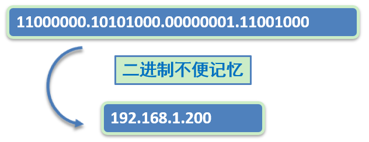
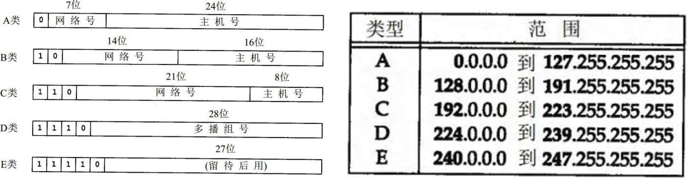
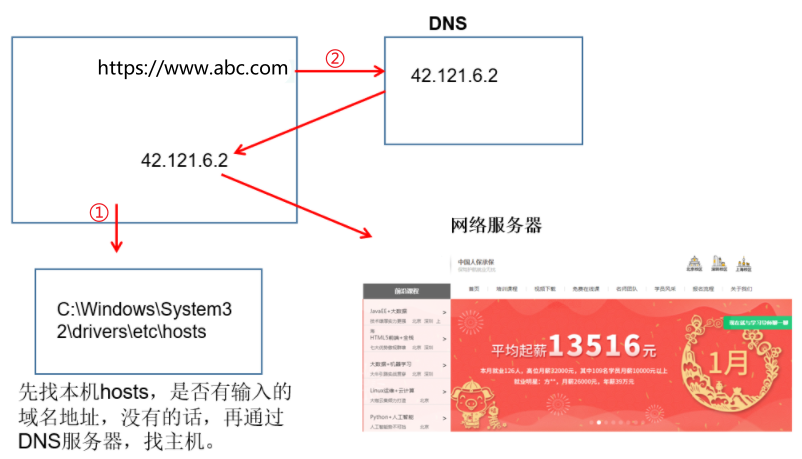
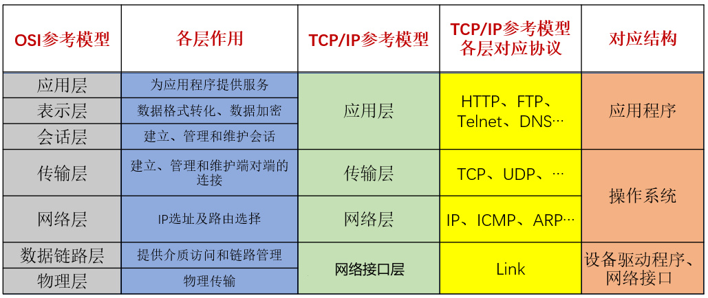
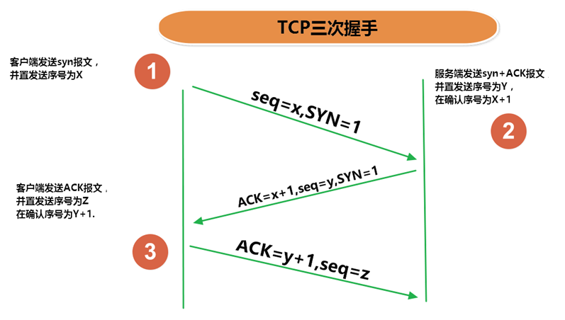
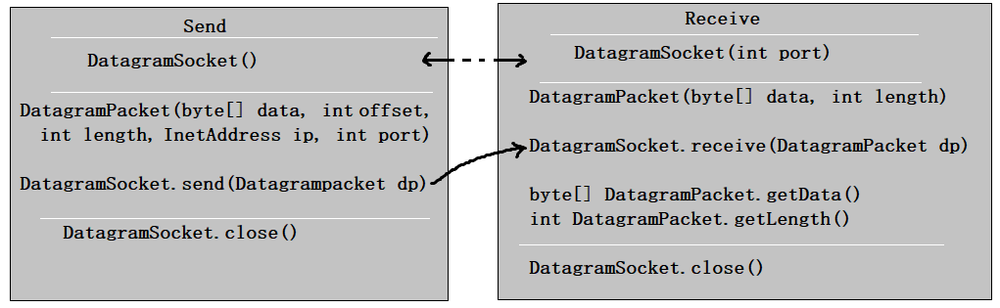
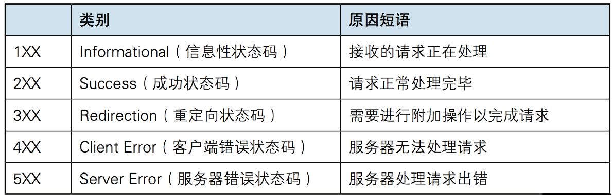
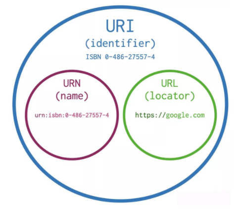

# 网络编程

随着互联网的发展，在计算机网络中，计算机之间需要进行数据传输、远程登陆和资源共享等功能，为了实现这些功能，开发者需要使用特定的编程语言和网络协议来实现数据的发送和接收，常见的网络编程语言包括**Java**、Python、C++等，常见的网络协议有HTTP、FTP、TCP/IP等。

## 概念

网络编程是指利用计算机网络进行数据交互和通信的编程技术。网络编程可以用于各种应用领域，例如网页浏览器、即时通讯软件、邮件客户端、文件传输等。通过网络编程，人们可以通过互联网连接到远程计算机或服务器，实现数据的传输和交互，扩大了计算机系统的功能和使用范围。

## 网络基础

- **计算机网络：**

  计算机网络是指将多台计算机通过通信设备和通信线路连接在一起，以实现数据和信息的交换和共享的系统。它是由若干计算机及其相关设备组成的互联网络，在这个网络中，计算机可以相互通信、传输数据和共享资源。

  计算机网络的核心目标是实现计算机之间的数据传输和通信，使得用户能够在不同计算机之间共享信息和资源。通过计算机网络，人们可以进行电子邮件、网上聊天、在线购物、远程办公等各种网络应用。

- **网络编程的目的：**直接或间接地通过网络协议与其它计算机实现数据交换，进行通讯。

- **网络编程中有三个主要的问题：**

  - 问题1：如何准确地定位网络上一台或多台主机？答：IP地址
  - 问题2：如何定位主机上的特定的应用？答：端口号
  - 问题3：找到主机后，如何可靠、高效地进行数据传输？答：通信协议

### IP地址和域名

**IP地址：指互联网协议地址（Internet Protocol Address）**，俗称IP。IP地址用来给网络中的一台计算机设备做唯一的编号。

**IP地址分类方式一：**

- `IPv4`：是一个32位的二进制数，通常被分为4个字节，表示成`a.b.c.d` 的形式，以点分`十进制`表示，例如`192.168.65.100` 。其中a、b、c、d都是0~255之间的十进制整数。

  - 

  

  - 这种方式最多可以表示42亿个。其中，30亿都在北美，亚洲4亿，中国2.9亿。2011年初已经用尽。

  - IP地址 = 网络地址 +主机地址

    - 网络地址：标识计算机或网络设备所在的网段
    - 主机地址：标识特定主机或网络设备

    

    其中，E类用于科研。

- `IPv6`：由于互联网的蓬勃发展，IP地址的需求量愈来愈大，但是网络地址资源有限，使得IP的分配越发紧张。

  为了扩大地址空间，拟通过IPv6重新定义地址空间，采用128位地址长度，共16个字节，写成8个无符号整数，每个整数用四个十六进制位表示，数之间用冒号（：）分开。比如：`ABCD:EF01:2345:6789:ABCD:EF01:2345:6789`，按保守方法估算IPv6实际可分配的地址，整个地球的每平方米面积上仍可分配1000多个地址，这样就解决了网络地址资源数量不够的问题。2012年6月6日，国际互联网协会举行了世界IPv6启动纪念日，这一天，全球IPv6网络正式启动。多家知名网站，如Google、Facebook和Yahoo等，于当天全球标准时间0点（北京时间8点整）开始永久性支持IPv6访问。2018年6月，三大运营商联合阿里云宣布，将全面对外提供IPv6服务，并计划在2025年前助推中国互联网真正实现“IPv6 Only”。

  在IPv6的设计过程中除了一劳永逸地解决了地址短缺问题以外，还考虑了在IPv4中解决不好的其它问题，主要有端到端IP连接、服务质量（QoS）、安全性、多播、移动性、即插即用等。

**IP地址分类方式二：**

公网地址( 万维网使用）和 私有地址( 局域网使用）。192.168.开头的就是私有地址，范围即为192.168.0.0--192.168.255.255，专门为组织机构内部使用。

**常用命令：**

- 查看本机IP地址，在控制台输入：

```java
ipconfig
```

**特殊的IP地址：**

- 本地回环地址(hostAddress)：`127.0.0.1`  
- 主机名(hostName)：`localhost`

**域名：**因为IP地址数字不便于记忆，因此出现了域名。域名容易记忆，当在连接网络时输入一个主机的域名后，域名服务器(DNS，Domain Name System，域名系统)负责将域名转化成IP地址，这样才能和主机建立连接。 

域名解析过程：



### 端口号

网络的通信，本质上是两个进程（应用程序）的通信。每台计算机都有很多的进程，那么在网络通信时，如何区分这些进程呢？

如果说**IP地址**可以唯一标识网络中的设备，那么**端口号**就可以唯一标识设备中的进程（应用程序）。

不同的进程，设置不同的端口号。

- **端口号：用两个字节表示的整数，它的取值范围是0~65535**。
  - 公认端口：0~1023。被预先定义的服务通信占用，如：HTTP（80），FTP（21），Telnet（23）
  - 注册端口：1024~49151。分配给用户进程或应用程序。如：Tomcat（8080），MySQL（3306），Oracle（1521）。
  - 动态/ 私有端口：49152~65535。

如果端口号被另外一个服务或应用所占用，会导致当前程序启动失败。


### 网络通信协议

在计算机网络中，这些连接和通信的规则被称为网络通信协议，它对数据的传输格式、传输速率、传输步骤、出错控制等做了统一规定，通信双方必须同时遵守才能完成数据交换。

**新的问题：网络协议涉及内容太多、太复杂。如何解决？**

计算机网络通信涉及内容很多，比如指定源地址和目标地址，加密解密，压缩解压缩，差错控制，流量控制，路由控制，如何实现如此复杂的网络协议呢？`通信协议分层思想`。

在制定协议时，把复杂成份分解成一些简单的成份，再将它们复合起来。最常用的复合方式是层次方式，即`同层间可以通信、上一层可以调用下一层，而与再下一层不发生关系`。各层互不影响，利于系统的开发和扩展。

这里有两套参考模型

- OSI参考模型：法律上的国际标准，但是模型过于理想化，未能在因特网上进行广泛推广。
- TCP/IP参考模型(或TCP/IP协议)：事实上的国际标准。
- 原理参考模型：适用于学习原理，是五层模型，从上至下分别是应用层、传输层、网络层、数据链路层、物理层。



上图中，OSI参考模型：模型`过于理想化`，未能在因特网上进行广泛推广。 TCP/IP参考模型(或TCP/IP协议)：事实上的`国际标准`。

- **TCP/IP协议：** 传输控制协议/因特网互联协议( Transmission Control Protocol/Internet Protocol)，TCP/IP 以其两个主要协议：传输控制协议(TCP)和网络互联协议(IP)而得名，实际上是一组协议，包括多个具有不同功能且互为关联的协议。是Internet最基本、最广泛的协议。

  

**TCP/IP协议中的四层介绍：**

- `应用层`：应用层决定了向用户提供应用服务时通信的活动。主要协议有：HTTP协议、FTP协议、SNMP（简单网络管理协议）、SMTP（简单邮件传输协议）和POP3（Post Office Protocol 3的简称,即邮局协议的第3个版）等。
- `传输层`：主要使网络程序进行通信，在进行网络通信时，可以采用TCP协议，也可以采用UDP协议。TCP（Transmission Control Protocol）协议，即传输控制协议，是一种面向连接的、可靠的、基于字节流的传输层通信协议。UDP(User Datagram Protocol，用户数据报协议)：是一个无连接的传输层协议、提供面向事务的简单不可靠的信息传送服务。
- `网络层`：网络层是整个TCP/IP协议的核心，支持网间互连的数据通信。它主要用于将传输的数据进行分组，将分组数据发送到目标计算机或者网络。而IP协议是一种非常重要的协议。IP（internet protocal）又称为互联网协议。IP的责任就是把数据从源传送到目的地。它在源地址和目的地址之间传送一种称之为数据包的东西，它还提供对数据大小的重新组装功能，以适应不同网络对包大小的要求。

* `网络接口层`：链路层是用于定义物理传输通道，通常是对某些网络连接设备的驱动协议，例如针对光纤、网线提供的驱动。


## 传输层协议

`java.net` 包中提供了两种常见的网络协议的支持：

- **UDP**：用户数据报协议(User Datagram Protocol)。
- **TCP**：传输控制协议 (Transmission Control Protocol)。

### TCP协议与UDP协议

**TCP协议：**

- TCP协议进行通信的两个应用进程：客户端、服务端
- 使用TCP协议前，须先`建立TCP连接`，形成基于字节流的传输数据通道
- 传输前，采用“三次握手”方式，点对点通信，是`可靠的`
  - TCP协议使用`重发机制`，当一个通信实体发送一个消息给另一个通信实体后，需要收到另一个通信实体确认信息，如果没有收到另一个通信实体确认信息，则会再次重复刚才发送的消息。
- 在连接中可进行`大数据量的传输`
- 传输完毕，需`释放已建立的连接，效率低`

**UDP协议：**

- UDP协议进行通信的两个应用进程：发送端、接收端
- 将数据、源、目的封装成数据包（传输的基本单位），`不需要建立连接`
- 发送不管对方是否准备好，接收方收到也不确认，不能保证数据的完整性，故是`不可靠的`
- 每个数据报的大小限制在`64K`内
- 发送数据结束时`无需释放资源，开销小，通信效率高`
- 适用场景：音频、视频和普通数据的传输。例如视频会议

> TCP生活案例：下载文件
>
> UDP生活案例：发送短信、发电报

### 三次握手

TCP协议中，在发送数据的准备阶段，客户端与服务器之间的三次交互，以保证连接的可靠。

- 第一次握手，客户端向服务器端发起TCP连接的请求
- 第二次握手，服务器端发送针对客户端TCP连接请求的确认
- 第三次握手，客户端发送确认的确认



完成三次握手，连接建立后，客户端和服务器就可以开始进行数据传输了。由于这种面向连接的特性，TCP协议可以保证传输数据的安全，所以应用十分广泛，例如下载文件、浏览网页等。

### 四次挥手

TCP协议中，在发送数据结束后，释放连接时需要经过四次挥手。

* 第一次挥手：客户端向服务器端提出结束连接，`让服务器做最后的准备工作`。此时，客户端处于半关闭状态，即表示不再向服务器发送数据了，但是还可以接受数据。
* 第二次挥手：服务器接收到客户端释放连接的请求后，`会将最后的数据发给客户端`。并告知上层的应用进程不再接收数据。
* 第三次挥手：服务器发送完数据后，会给客户端`发送一个释放连接的报文`。那么客户端接收后就知道可以正式释放连接了。
* 第四次挥手：客户端接收到服务器最后的释放连接报文后，要`回复一个彻底断开的报文`。这样服务器收到后才会彻底释放连接。这里客户端，发送完最后的报文后，会等待2MSL，因为有可能服务器没有收到最后的报文，那么服务器迟迟没收到，就会再次给客户端发送释放连接的报文，此时客户端在等待时间范围内接收到，会重新发送最后的报文，并重新计时。如果等待2MSL后，没有收到，那么彻底断开。


## 网络编程API

### InetAddress类

InetAddress类主要表示IP地址，两个子类：Inet4Address、Inet6Address。

InetAddress 类没有提供公共的构造器，而是提供 了 如下几个 静态方法来获取InetAddress 实例

* public static InetAddress getLocalHost()
* public static InetAddress getByName(String host)
* public static InetAddress getByAddress(byte[] addr)

InetAddress 提供了如下几个常用的方法

* public String getHostAddress() ：返回 IP 地址字符串（以文本表现形式）
* public String getHostName() ：获取此 IP 地址的主机名
* public boolean isReachable(int timeout)：测试是否可以达到该地址

```java
public class TestInetAddress {
    @Test
    public void test01() throws UnknownHostException{
        InetAddress localHost = InetAddress.getLocalHost();
        System.out.println(localHost);
    }

    @Test
    public void test02()throws UnknownHostException{
        InetAddress baidu = InetAddress.getByName("www.baidu.com");
        System.out.println(baidu);
    }

    @Test
    public void test03()throws UnknownHostException{
//		byte[] addr = {112,54,108,98};
        byte[] addr = {(byte)192,(byte)168,24,56};
        InetAddress baidu = InetAddress.getByAddress(addr);
        System.out.println(baidu);
    }
}
```

### Socket类

-  套接字（Socket）是计算机网络编程中用于实现网络通信的一种机制。它提供了一种标准的接口，使得应用程序能够通过网络发送和接收数据。
-  套接字在不同的网络协议中有不同的实现方式，如TCP套接字和UDP套接字。TCP套接字提供可靠的、面向连接的通信，而UDP套接字则提供不可靠的、无连接的通信。
-  利用套接字(Socket)开发网络应用程序早已被广泛的采用，以至于成为事实上的标准。网络通信其实就是Socket间的通信。


- 通信的两端都要有Socket，是两台机器间通信的端点。

- Socket允许程序把网络连接当成一个流，数据在两个Socket间通过IO传输。

- 一般主动发起通信的应用程序属客户端，等待通信请求的为服务端。

- Socket分类：
  - 流套接字（stream socket）：使用TCP提供可依赖的字节流服务
    - ServerSocket：此类实现TCP服务器套接字。服务器套接字等待请求通过网络传入。
    - Socket：此类实现客户端套接字（也可以就叫“套接字”）。套接字是两台机器间通信的端点。
  - 数据报套接字（datagram socket）：使用UDP提供“尽力而为”的数据报服务
    - DatagramSocket：此类表示用来发送和接收UDP数据报包的套接字。 

### Socket相关类API

#### ServerSocket类

**ServerSocket类的构造方法：**

* ServerSocket(int port) ：创建绑定到特定端口的服务器套接字。

**ServerSocket类的常用方法：**

* Socket accept()：侦听并接受到此套接字的连接。 

#### Socket类

**Socket类的常用构造方法**：

| 构造函数                                     | 描述                                                   |
| -------------------------------------------- | ------------------------------------------------------ |
| public Socket(InetAddress address, int port) | 创建一个流套接字并将其连接到指定 IP 地址的指定端口号。 |
| public Socket(String host, int port)         | 创建一个流套接字并将其连接到指定主机上的指定端口号。   |

**Socket类的常用方法**：

| 方法                                  | 描述                                                         |
| ------------------------------------- | ------------------------------------------------------------ |
| public InputStream getInputStream()   | 返回此套接字的输入流，用于接收消息。                         |
| public OutputStream getOutputStream() | 返回此套接字的输出流，用于发送消息。                         |
| public InetAddress getInetAddress()   | 返回此套接字连接到的远程 IP 地址；如果套接字未连接，则返回 null。 |
| public InetAddress getLocalAddress()  | 获取套接字绑定的本地地址。                                   |
| public int getPort()                  | 返回此套接字连接到的远程端口号；如果尚未连接套接字，则返回 0。 |
| public int getLocalPort()             | 返回此套接字绑定到的本地端口；如果尚未绑定套接字，则返回 -1。 |
| public void close()                   | 关闭此套接字及其相关的输入流和输出流。                       |
| public void shutdownInput()           | 禁用此套接字的输入流，导致从套接字输入流读取内容时返回EOF。  |
| public void shutdownOutput()          | 禁用此套接字的输出流，导致无法通过套接字的输出流发送数据。   |

**注意：**先后调用Socket的shutdownInput()和shutdownOutput()方法，仅仅关闭了输入流和输出流，并不等于调用Socket的close()方法。在通信结束后，仍然要调用Scoket的close()方法，因为只有该方法才会释放Socket占用的资源，比如占用的本地端口号等。

#### DatagramSocket类

**DatagramSocket 类的常用方法：**

| 方法                                              | 描述                                                         |
| ------------------------------------------------- | ------------------------------------------------------------ |
| public DatagramSocket(int port)                   | 创建数据报套接字并将其绑定到本地主机上的指定端口。套接字将被绑定到通配符地址，IP 地址由内核来选择。 |
| public DatagramSocket(int port,InetAddress laddr) | 创建数据报套接字，将其绑定到指定的本地地址。如果 IP 地址为 0.0.0.0，套接字将被绑定到通配符地址，IP 地址由内核选择。 |
| public void close()                               | 关闭此数据报套接字。                                         |
| public void send(DatagramPacket p)                | 从此套接字发送数据报包。DatagramPacket 包含将要发送的数据、其长度、远程主机的 IP 地址和远程主机的端口号。 |
| public void receive(DatagramPacket p)             | 从此套接字接收数据报包。当此方法返回时，DatagramPacket 的缓冲区填充了接收的数据。数据报包也包含发送方的 IP 地址和发送方机器上的端口号。 此方法在接收到数据报前一直阻塞。数据报包对象的 length 字段包含所接收信息的长度。如果信息比包的长度长，该信息将被截短。 |
| public InetAddress getLocalAddress()              | 获取套接字绑定的本地地址。                                   |
| public int getLocalPort()                         | 返回此套接字绑定的本地主机上的端口号。                       |
| public InetAddress getInetAddress()               | 返回此套接字连接的地址。如果套接字未连接，则返回 null。      |
| public int getPort()                              | 返回此套接字的端口。如果套接字未连接，则返回 -1。            |

#### DatagramPacket类

**DatagramPacket类的常用方法：**

| 方法                                                         | 描述                                                         |
| ------------------------------------------------------------ | ------------------------------------------------------------ |
| DatagramPacket(byte[] buf, int length)                       | 构造 DatagramPacket，用于接收长度为 length 的数据包。length 参数必须小于等于 buf.length。 |
| DatagramPacket(byte[] buf, int length, InetAddress address, int port) | 构造数据报包，用来将长度为 length 的包发送到指定主机上的指定端口号。length 参数必须小于等于 buf.length。 |
| getAddress()                                                 | 返回某台机器的 IP 地址，此数据报将要发往该机器或者是从该机器接收到的。 |
| getPort()                                                    | 返回某台远程主机的端口号，此数据报将要发往该主机或者是从该主机接收到的。 |
| getData()                                                    | 返回数据缓冲区。接收到的或将要发送的数据从缓冲区中的偏移量 offset 处开始，持续 length 长度。 |
| getLength()                                                  | 返回将要发送或接收到的数据的长度。                           |

## TCP网络编程

### 通信模型

Java语言的基于套接字TCP编程分为服务端编程和客户端编程，其通信模型如图所示：


### 开发步骤

**客户端程序包含以下四个基本的步骤 ：**

* 创建 Socket ：根据指定服务端的 IP 地址或端口号构造 Socket 类对象。若服务器端响应，则建立客户端到服务器的通信线路。若连接失败，会出现异常。
* 打开连接到 Socket  的输入/ 出流： 使用 getInputStream()方法获得输入流，使用getOutputStream()方法获得输出流，进行数据传输
* 按照一定的协议对 Socket 进行读/ 写操作：通过输入流读取服务器放入线路的信息（但不能读取自己放入线路的信息），通过输出流将信息写入线路。
* 关闭 Socket ：断开客户端到服务器的连接，释放线路

**服务器端程序包含以下四个基本的 步骤：**

* 调用 ServerSocket(int port)  ：创建一个服务器端套接字，并绑定到指定端口上。用于监听客户端的请求。
* 调用 accept() ：监听连接请求，如果客户端请求连接，则接受连接，返回通信套接字对象。
* 调用  该Socket 类对象的 getOutputStream()  和 getInputStream () ：获取输出流和输入流，开始网络数据的发送和接收。
* 关闭Socket 对象：客户端访问结束，关闭通信套接字。

### 案例

需求：客户端连接服务器，连接成功后给服务发送“lalala”，服务器收到消息后，给客户端返回“欢迎登录”，客户端接收消息后，断开连接

**服务器端示例代码**

```java
public class Server {

    public static void main(String[] args)throws Exception {
        //1、准备一个ServerSocket对象，并绑定8888端口
        ServerSocket server =  new ServerSocket(8888);
        System.out.println("等待连接....");

        //2、在8888端口监听客户端的连接，该方法是个阻塞的方法，如果没有客户端连接，将一直等待
        Socket socket = server.accept();
        InetAddress inetAddress = socket.getInetAddress();
        System.out.println(inetAddress.getHostAddress() + "客户端连接成功！！");

        //3、获取输入流，用来接收该客户端发送给服务器的数据
        InputStream input = socket.getInputStream();
        //接收数据
        byte[] data = new byte[1024];
        StringBuilder s = new StringBuilder();
        int len;
        while ((len = input.read(data)) != -1) {
            s.append(new String(data, 0, len));
        }
        System.out.println(inetAddress.getHostAddress() + "客户端发送的消息是：" + s);

        //4、获取输出流，用来发送数据给该客户端
        OutputStream out = socket.getOutputStream();
        //发送数据
        out.write("欢迎登录".getBytes());
        out.flush();

        //5、关闭socket，不再与该客户端通信
        //socket关闭，意味着InputStream和OutputStream也关闭了
        socket.close();

        //6、如果不再接收任何客户端通信，可以关闭ServerSocket
        server.close();
    }
}
```

**客户端示例代码**

```java
package com.atguigu.tcp.one;

import java.io.InputStream;
import java.io.OutputStream;
import java.net.Socket;

public class Client {

    public static void main(String[] args) throws Exception {
        // 1、准备Socket，连接服务器，需要指定服务器的IP地址和端口号
        Socket socket = new Socket("127.0.0.1", 8888);

        // 2、获取输出流，用来发送数据给服务器
        OutputStream out = socket.getOutputStream();
        // 发送数据
        out.write("lalala".getBytes());
        //会在流末尾写入一个“流的末尾”标记，对方才能读到-1，否则对方的读取方法会一致阻塞
        socket.shutdownOutput();

        //3、获取输入流，用来接收服务器发送给该客户端的数据
        InputStream input = socket.getInputStream();
        // 接收数据
        byte[] data = new byte[1024];
        StringBuilder s = new StringBuilder();
        int len;
        while ((len = input.read(data)) != -1) {
            s.append(new String(data, 0, len));
        }
        System.out.println("服务器返回的消息是：" + s);

        //4、关闭socket，不再与服务器通信，即断开与服务器的连接
        //socket关闭，意味着InputStream和OutputStream也关闭了
        socket.close();
    }
}
```

### 理解客户端、服务端

- 客户端：
  - 浏览器(browser --- server)
  - 自定义
- 服务端：
  - Tomcat服务器
  - 自定义

## UDP网络编程

UDP(User Datagram Protocol，用户数据报协议)：是一个无连接的传输层协议、提供面向事务的简单不可靠的信息传送服务，类似于短信。

### 通信模型

UDP协议是一种**面向非连接**的协议，面向非连接指的是在正式通信前不必与对方先建立连接，不管对方状态就直接发送，至于对方是否可以接收到这些数据内容，UDP协议无法控制，因此说，UDP协议是一种**不可靠的**协议。无连接的好处就是快，省内存空间和流量，因为维护连接需要创建大量的数据结构。UDP会尽最大努力交付数据，但不保证可靠交付，没有TCP的确认机制、重传机制，如果因为网络原因没有传送到对端，UDP也不会给应用层返回错误信息。

UDP协议是面向数据报文的信息传送服务。UDP在发送端没有缓冲区，对于应用层交付下来的报文在添加了首部之后就直接交付于ip层，不会进行合并，也不会进行拆分，而是一次交付一个完整的报文。比如我们要发送100个字节的报文，我们调用一次send()方法就会发送100字节，接收方也需要用receive()方法一次性接收100字节，不能使用循环每次获取10个字节，获取十次这样的做法。

UDP协议没有拥塞控制，所以当网络出现的拥塞不会导致主机发送数据的速率降低。虽然UDP的接收端有缓冲区，但是这个缓冲区只负责接收，并不会保证UDP报文的到达顺序是否和发送的顺序一致。因为网络传输的时候，由于网络拥塞的存在是很大的可能导致先发的报文比后发的报文晚到达。如果此时缓冲区满了，后面到达的报文将直接被丢弃。这个对实时应用来说很重要，比如：视频通话、直播等应用。

因此UDP适用于一次只传送少量数据、对可靠性要求不高的应用环境，数据报大小限制在64K以下。



类 DatagramSocket 和 DatagramPacket 实现了基于 UDP 协议网络程序。

 UDP数据报通过数据报套接字 DatagramSocket 发送和接收，系统不保证  UDP数据报一定能够安全送到目的地，也不能确定什么时候可以抵达。

 DatagramPacket 对象封装了UDP数据报，在数据报中包含了发送端的IP地址和端口号以及接收端的IP地址和端口号。

 UDP协议中每个数据报都给出了完整的地址信息，因此无须建立发送方和接收方的连接。如同发快递包裹一样。

### 开发步骤

**发送端程序包含以下四个基本的步骤：**

* 创建DatagramSocket ：默认使用系统随机分配端口号。
* 创建DatagramPacket：将要发送的数据用字节数组表示，并指定要发送的数据长度，接收方的IP地址和端口号。
* 调用  该DatagramSocket 类对象的 send方法 ：发送数据报DatagramPacket对象。
* 关闭DatagramSocket 对象：发送端程序结束，关闭通信套接字。

**接收端程序包含以下四个基本的步骤 ：**

* 创建DatagramSocket ：指定监听的端口号。
* 创建DatagramPacket：指定接收数据用的字节数组，起到临时数据缓冲区的效果，并指定最大可以接收的数据长度。
* 调用  该DatagramSocket 类对象的receive方法 ：接收数据报DatagramPacket对象。。
* 关闭DatagramSocket ：接收端程序结束，关闭通信套接字。

### 演示发送和接收消息

基于UDP协议的网络编程仍然需要在通信实例的两端各建立一个Socket，但这两个Socket之间并没有虚拟链路，这两个Socket只是发送、接收数据报的对象，Java提供了DatagramSocket对象作为基于UDP协议的Socket，使用DatagramPacket代表DatagramSocket发送、接收的数据报。

发送端：

```java
try (DatagramSocket ds = new DatagramSocket()) {
    byte[] by = "hello".getBytes();
    DatagramPacket dp = new DatagramPacket(by, 0, by.length, InetAddress.getByName("127.0.0.1"), 10000);
    ds.send(dp);
} catch (Exception e) {
    e.printStackTrace();
}
```

接收端：

```java
try (DatagramSocket ds = new DatagramSocket(10000)) {
    byte[] by = new byte[1024 * 64];
    DatagramPacket dp = new DatagramPacket(by, by.length);
    ds.receive(dp);
    String str = new String(dp.getData(), 0, dp.getLength());
    System.out.println(str + "--" + dp.getAddress());
} catch (Exception e) {
    e.printStackTrace();
}
```

## HTTP协议

### 概念

HTTP 全称 “ 超文本传输协议 ”，是一种基于传输层 TCP 协议实现的应用非常广泛的 应用层协议。

我们平时打开一个网站，就是通过 HTTP 协议来传输数据的。

当我们在浏览器中访问一个 “ 网址 ”（URL），浏览器就会给这个 URL 的服务器发送一个 HTTP 请求，服务器返回一个 HTTP 响应，这个响应被浏览器解析之后，就展现出我们看到的网页内容。

所谓 “ 超文本 ”，就是传输的内容不仅仅是文本，还可以是一些图片、视频、音频等二进制的数据。

HTTP协议具有以下特点：

- 简单：HTTP协议的语法相对简单，易于实现和理解。
- 无状态：每个HTTP请求都是独立的，服务器不会保留客户端的状态信息，从而简化了服务器的设计和维护。
- 可扩展：HTTP协议支持通过添加自定义的请求方法、请求头和响应头来扩展功能。
- 平台无关性：由于HTTP使用通用的文本格式进行通信，因此可以在不同的操作系统和平台上进行交互。

HTTP协议在Web应用中被广泛使用，它是实现网页浏览、数据传输和API调用等功能的基础。同时，HTTP也是RESTful API等现代Web服务的基础通信协议之一。

### 工作原理

以下是 HTTP 请求/响应的步骤：

1. 客户端连接到Web服务器
   一个HTTP客户端，通常是浏览器，与Web服务器的HTTP端口（默认为80）建立一个TCP套接字连接。例如，http://www.baidu.com。
2. 发送HTTP请求
   通过TCP套接字，客户端向Web服务器发送一个文本的请求报文，一个请求报文由请求行、请求头、请求体组成。
3. 服务器接受请求并返回HTTP响应
   Web服务器解析请求，定位请求资源。服务器将资源复本写到TCP套接字，由客户端读取。一个响应由响应行、响应头、响应体组成。
4. 释放连接TCP连接
   若connection 模式为close，则服务器主动关闭TCP连接，客户端被动关闭连接，释放TCP连接；若connection 模式为keepalive，则该连接会保持一段时间，在该时间内可以继续接收请求。
5. 客户端浏览器解析HTML内容
   客户端浏览器首先解析状态行，查看表明请求是否成功的状态代码。然后解析每一个响应头，响应头告知以下为若干字节的HTML文档和文档的字符集。客户端浏览器读取响应数据HTML，根据HTML的语法对其进行格式化，并在浏览器窗口中显示。

例如：在浏览器地址栏键入URL，按下回车之后会经历以下流程：

1. 浏览器向 DNS 服务器请求解析该 URL 中的域名所对应的 IP 地址。
2. 解析出 IP 地址后，根据该 IP 地址和默认端口 80，和服务器建立TCP连接。
3. 浏览器发出读取文件(URL 中域名后面部分对应的文件)的HTTP 请求，该请求报文作为 TCP 三次握手的第三个报文的数据发送给服务器。
4. 服务器对浏览器请求作出响应，并把对应的 html 文本发送给浏览器。
5. 释放 TCP连接。
6. 浏览器将该 html 文本并显示内容。

**基于 请求-响应 的模式**

HTTP协议规定，请求从客户端发出，最后服务器端响应该请求并返回。换句话说，肯定是先从客户端开始建立通信的，服务器端在没有接收到请求之前不会发送响应。

**无状态保存**

HTTP是一种不保存状态，即无状态(stateless)协议。HTTP协议自身不对请求和响应之间的通信状态进行保存。也就是说在HTTP协议对于发送过的请求或响应都**不保存**（不持久化）。

使用HTTP协议，每当有新的请求发送时，就会有对应的新响应产 生。协议本身并不保留之前一切的请求或响应报文的信息。这是为了更快地处理大量事务，确保协议的可伸缩性，而特意把HTTP协议设计成 如此简单的。可是，随着Web的不断发展,因无状态而导致业务处理变得棘手 的情况增多了。比如，用户登录到一家购物网站，即使他跳转到该站的其他页面后，也需要能继续保持登录状态，网站为了能 够掌握是谁送出的请求，需要保存用户的状态，HTTP/1.1虽然是无状态协议，但为了实现期望的保持状态功能,，于是引入了Cookie技术，了Cookie再用HTTP协议通信,就可以管理状态了。

**无连接**

无连接的含义是限制**每次连接只处理一个请求**。服务器处理完客户的请求，并收到客户的应答后，即断开连接。采用这种方式可以节省传输时间，并且可以提高并发性能，不能和每个用户建立长久的连接，请求一次相应一次，服务端和客户端就中断了。但是无连接有两种方式，早期的http协议是一个请求一个响应之后，直接就断开了，**但是现在的http协议1.1版本不是直接就断开了，而是等几秒钟**，这几秒钟是等什么呢，等着用户有后续的操作，如果用户在这几秒钟之内有新的请求，那么还是通过之前的连接通道来收发消息，如果过了这几秒钟用户没有发送新的请求，那么就会断开连接，这样可以提高效率，减少短时间内建立连接的次数，因为建立连接也是耗时的。

### 请求方法

| 请求方法 | 描述                                                         |
| -------- | ------------------------------------------------------------ |
| GET      | 用于从服务器**读取资源**。GET 请求不应该具有副作用，即不会修改服务器上的资源。 |
| POST     | 用于向服务器提交数据，通常用于**创建新资源**。POST 请求可能会对服务器上的资源进行修改。 |
| PUT      | 用于向服务器**上传新的内容**，取代指定URI标识的资源。如果资源不存在，则创建一个新的资源；如果存在，则进行更新。 |
| DELETE   | 用于从服务器**删除**指定的资源。                             |
| PATCH    | 用于对资源进行局部修改。                                     |
| HEAD     | 类似于GET方法，但服务器不返回实际内容，只返回响应头信息。    |
| OPTIONS  | 用于获取目标资源支持的通信选项。                             |
| TRACE    | 用于追踪请求在到达服务器时的变化。                           |
| CONNECT  | 用于将连接改为管道方式的代理服务器，使用SSL/TLS加密传输协议。 |

> 请求方式: GET与POST请求

- GET提交的数据会放在URL之后，也就是请求行里面，以?分割URL和传输数据，参数之间以&相连，如EditBook?name=test1&id=123456.（请求头里面那个content-type做的这种参数形式），POST方法是把提交的数据放在HTTP包的请求体中。
- GET提交的数据大小有限制（因为浏览器对URL的长度有限制），而POST方法提交的数据没有限制。

### 状态码

所有HTTP响应的第一行都是状态行，依次是当前HTTP版本号，3位数字组成的状态代码，以及描述状态的短语，彼此由空格分隔。

状态代码的第一个数字代表当前响应的类型：



虽然 RFC 2616 中已经推荐了描述状态的短语，例如"200 OK"，“404 Not Found”，但是WEB开发者仍然能够自行决定采用何种短语，用以显示本地化的状态描述或者自定义信息。

常见的状态码有：

- 200 OK：请求成功。
- 400 Bad Request：请求错误，服务器无法理解。
- 401 Unauthorized：未经授权，需要进行身份验证。
- 403 Forbidden：服务器拒绝请求。
- 404 Not Found：请求的资源不存在。
- 500 Internal Server Error：服务器内部错误。

### 请求格式

HTTP协议的请求格式包括请求行、请求头和请求体三个部分，具体如下：

1. 请求行：包含三个字段，用空格分隔。分别为请求方法、URL路径和HTTP版本号。

```http
GET /example/path HTTP/1.1
```

2. 请求头：包含多个键值对，每个键值对用冒号分隔。其中，Host字段是必需的，其他字段根据需要添加。

```http
Host: www.example.com
Accept-Language: zh-CN,zh;q=0.9,en-US;q=0.8,en;q=0.7
User-Agent: Mozilla/5.0 (Windows NT 10.0; Win64; x64) AppleWebKit/537.36 (KHTML, like Gecko) Chrome/96.0.4664.45 Safari/537.36
```

3. 请求体：可选的，通常用于POST请求等需要发送数据的情况。请求体内容的格式和编码方式由Content-Type字段指定。请求头和请求体之间会空一行，用于区分请求头和请求体。

```http
POST /example/path HTTP/1.1
Host: www.example.com
Content-Type: application/json

{
    "name": "Tom",
    "age": 18
}
```

### 响应格式

HTTP协议的响应格式包括响应行、响应头和响应体三个部分，具体如下：

1. 响应行：包含三个字段，用空格分隔。分别为HTTP版本号、状态码和状态消息。

   ```http
   HTTP/1.1 200 OK
   ```

2. 响应头：包含多个键值对，每个键值对用冒号分隔。其中，Content-Type字段是常见的响应头字段，指示响应体的内容类型。

   ```http
   Content-Type: application/json
   ```

3. 响应体：实际的响应内容，通常包含服务器返回的数据。响应头和响应体之间会空一行，用于区分响应头和响应体。

   ```http
   {
       "name": "Alice",
       "age": 25,
       "email": "alice@example.com"
   }
   ```

例子：

```http
HTTP/1.1 200 OK
Content-Type: application/json

{
    "id": 123,
    "name": "Alice",
    "age": 25,
    "email": "alice@example.com"
}
```

## URL编程

### URI、URL、URN

- URI = Uniform Resource Identifier 统一资源**标识符**
- URL = Uniform Resource Locator 统一资源**定位符**
- URN = Uniform Resource Name 统一资源**名称**

URI（统一资源标识符）是一个用于标识某一互联网资源名称的字符串。URI由包括确定语法和相关协议的方案所定义。

统一资源定位符（Uniform Resource Locator，URL），统一资源名称（Uniform Resource Name，URN）是URI的子集。
Web上地址的基本形式是URI，它有两种形式：
一种是URL，这是目前URI的最普遍形式。
另一种就是URN，这是URL的一种更新形式，URN不依赖于位置，并且有可能减少失效连接的个数。但是其流行还需假以时日，因为它需要更精密软件的支持。

URL的格式由下列三部分组成：第一部分是协议（或称为服务方式）；第二部分是存有该资源的主机IP地址（有时也包括端口号）；第三部分是主机资源的具体地址。
具体URI的格式如下：

[协议名]://用户名:密码@服务器地址:服务器端口号/路径?查询字符串#片段ID


举个例子：去村子找个具体的人(URI)，如果用地址：某村多少号房子第几间房的主人 就是URL， 如果用身份证号+名字 去找就是URN了。

原来URI包括URL和URN，后来URN没流行起来，导致几乎目前所有的URI都是URL。

三者之间几何关系如下：



### URL类

- URL(Uniform Resource Locator)：统一资源定位符，它表示 Internet 上某一资源的地址。

- 通过 URL 我们可以访问 Internet 上的各种网络资源，比如最常见的 www，ftp 站点。浏览器通过解析给定的 URL 可以在网络上查找相应的文件或其他资源。 

- URL的基本结构由5部分组成：

```http
<传输协议>://<主机名>:<端口号>/<文件名>#片段名?参数列表
```

- 例如: http://192.168.1.100:8080/helloworld/index.jsp#a?username=shkstart&password=123

  - 片段名：即锚点，例如看小说，直接定位到章节
  - 参数列表格式：参数名=参数值&参数名=参数值....

- 为了表示URL，java.net 中实现了类 URL。我们可以通过下面的构造器来初始化一个 URL 对象：

  - public URL (String spec)：通过一个表示URL地址的字符串可以构造一个URL对象。例如：

    ```http
    URL url = new URL("http://www.baidu.com/"); 
    ```

  - public URL(URL context, String spec)：通过基 URL 和相对 URL 构造一个 URL 对象。例如：

    ```http
    URL downloadUrl = new URL(url, “download.html")
    ```

    public URL(String protocol, String host, String file); 例如：

    ```http
    URL url = new URL("http", "www.baidu.com", “download. html");
    ```

  - public URL(String protocol, String host, int port, String file); 例如: 

    ```http
    URL gamelan = new URL("http", "www.baidu.com", 80, “download.html");
    ```

- URL类的构造器都声明抛出非运行时异常，必须要对这一异常进行处理，通常是用 try-catch 语句进行捕获。

### URL类常用方法

一个URL对象生成后，其属性是不能被改变的，但可以通过它给定的方法来获取这些属性：

- public String getProtocol( )   获取该URL的协议名

- public String getHost( )      获取该URL的主机名

- public String getPort( )      获取该URL的端口号

- public String getPath( )      获取该URL的文件路径

- public String getFile( )       获取该URL的文件名

- public String getQuery(  )    获取该URL的查询名

```java
URL url = new URL("http://localhost:8080/examples/myTest.txt");
System.out.println("getProtocol() :"+url.getProtocol());
System.out.println("getHost() :"+url.getHost());
System.out.println("getPort() :"+url.getPort());
System.out.println("getPath() :"+url.getPath());
System.out.println("getFile() :"+url.getFile());
System.out.println("getQuery() :"+url.getQuery());
```

# 实践

- 模拟实现一个简单HTTP服务器，包括：
  - **创建ServerSocket：**
    - 使用Java的`ServerSocket`类创建服务器端Socket，指定端口号
  - **监听客户端连接：**
    - 通过`ServerSocket`监听客户端的连接请求
  - **接收HTTP请求：**
    - 通过`Socket`的输入流读取客户端发送的HTTP请求信息
  - **解析HTTP请求：**
    - 解析HTTP请求中的方法、路径、协议版本等信息
  - **处理HTTP请求：**
    - 根据解析得到的请求信息，处理相应的业务逻辑，如读取文件、返回特定信息等
  - **构造HTTP响应：**
    - 根据处理结果，构造HTTP响应报文，包括状态行、头部信息、实体内容等
  - **发送HTTP响应：**
    - 通过`Socket`的输出流将构造的HTTP响应发送给客户端
- 扩展（可选）：
  - **异常处理**：
    - 处理可能出现的异常，如IO异常、HTTP解析异常等，保证服务器的稳定运行
  - **支持静态文件服务：**
    - 实现服务器对静态文件（如HTML、CSS、图片等）的服务
  - **多线程支持：**
    - 使用多线程处理多个客户端的请求，提高服务器并发性能
  - **支持简单动态内容生成：**
    - 在HTTP响应中包含一些动态生成的内容，如当前时间、访问计数等
  - **日志记录：**
    - 记录服务器的访问日志，包括客户端IP、请求路径、响应状态等信息

```java
/**
 * 模拟HTTP服务器
 * @author herry
 */
@Slf4j
public class BasicHttpServer {
    /**
     * 用于启动 HTTP 服务器的线程池
     */
    private static ExecutorService bootstrapExecutor = Executors.newSingleThreadExecutor();

    /**
     * 用于处理来自客户端的 HTTP 请求的线程池
     */
    private static ExecutorService taskExecutor;

    /**
     * 服务器监听端口号
     */
    private static final int PORT = 9000;

    /**
     * 启动 HTTP 服务器
     */
    static void startHttpServer() {
        // 获取处理器可用核心数，用于设置线程池大小
        int nThreads = Runtime.getRuntime().availableProcessors();
        // 初始化线程池，设置线程池大小，队列大小和丢弃策略
        taskExecutor = new ThreadPoolExecutor(nThreads, nThreads, 0L, TimeUnit.MILLISECONDS,
            new LinkedBlockingQueue<>(100), new ThreadPoolExecutor.DiscardPolicy());

        // 循环尝试启动服务器，如果启动失败，则等待10秒后重试
        while (true) {
            try {
                ServerSocket serverSocket = new ServerSocket(PORT);
                bootstrapExecutor.submit(new ServerThread(serverSocket));
                break;
            } catch (Exception e) {
                try {
                    // 重试，等待 10 秒
                    TimeUnit.SECONDS.sleep(10);
                } catch (InterruptedException ie) {
                    Thread.currentThread().interrupt();
                }
            }
        }

        // 关闭启动执行器
        bootstrapExecutor.shutdown();
    }

    /**
     * HTTP 服务器主要任务类
     */
    private static class ServerThread implements Runnable {
        /**
         * 保存传递给构造函数的 ServerSocket 实例
         */
        private ServerSocket serverSocket;

        /**
         * 构造函数
         * @param s ServerSocket 实例
         */
        public ServerThread(ServerSocket s) {
            this.serverSocket = s;
        }

        /**
         * 任务主体方法
         */
        @Override
        public void run() {
            while (true) {
                try {
                    // 等待客户端连接
                    System.out.println("等待客户端连接。。。");
                    Socket socket = this.serverSocket.accept();
                    System.out.println("收到一个客户端请求，ip:" + socket.getInetAddress());
                    // 创建一个 HttpTask 实例，将 Socket 实例作为参数传递
                    HttpTask eventTask = new HttpTask(socket);
                    // 将 HttpTask 提交给 taskExecutor 执行
                    taskExecutor.submit(eventTask);
                } catch (Exception e) {
                    log.error("服务端出现异常");
                    try {
                        // 如果发生异常，等待 1 秒后继续尝试
                        TimeUnit.SECONDS.sleep(1);
                    } catch (InterruptedException ie) {
                        Thread.currentThread().interrupt();
                    }
                }
            }
        }
    }
}
```

```java
/**
 * 处理 HTTP 请求
 *
 * @author herry
 */
@Slf4j
public class HttpTask implements Runnable {
    /**
     * 用于处理 HTTP 请求的 Socket
     */
    private Socket socket;

    /**
     * 记录访问次数
     */
    private static AtomicInteger counter = new AtomicInteger();


    /**
     * 构造一个新的 HttpTask，用于处理指定的 Socket 连接
     *
     * @param socket 用于处理 HTTP 请求的 Socket
     */
    public HttpTask(Socket socket) {
        this.socket = socket;
    }

    /**
     * 实现 Runnable 接口的 run 方法，用于处理 HTTP 请求并发送响应消息
     */
    @Override
    public void run() {
        // 检查 socket 是否为 null，如果为 null 则抛出异常
        if (socket == null) {
            throw new IllegalArgumentException("socket 不能为 null");
        }

        try {
            // 获取 Socket 的输出流，并创建一个 PrintWriter 对象
            OutputStream outputStream = socket.getOutputStream();
            PrintWriter out = new PrintWriter(outputStream);

            // 获取IP
            InetAddress inetAddress = socket.getInetAddress();

            // 从 Socket 的输入流中解析 HTTP 请求
            HttpMessageParser.Request httpRequest = HttpMessageParser.parse2request(socket.getInputStream());

            try {
                // 响应正文
                // 获取当前日期
                LocalDateTime currentDateTime = LocalDateTime.now();
                DateTimeFormatter formatter = DateTimeFormatter.ofPattern("yyyy-MM-dd HH:mm:ss");
                String formattedDateTime = currentDateTime.format(formatter);
                // 访问次数加一
                int count = counter.incrementAndGet();
                String message = formattedDateTime + " [HTTP] " + "[第" + count + "次访问] 服务端已收到请求";

                // 根据请求和结果构建 HTTP 响应
                String httpRes = HttpMessageParser.buildResponse(httpRequest, message, inetAddress);

                // 将 HTTP 响应发送到客户端
                out.print(httpRes);
            } catch (Exception e) {
                // 如果发生异常，构建一个包含异常信息的 HTTP 响应
                String httpRes = HttpMessageParser.buildResponse(httpRequest, e.toString(),inetAddress);
                out.print(httpRes);
            }

            // 刷新输出流，确保响应消息被发送
            out.flush();
        } catch (IOException e) {
            log.error("处理HTTP请求出现异常");
        } finally {
            // 关闭 Socket 连接
            try {
                socket.close();
            } catch (IOException e) {
                log.error("关闭 Socket 连接失败");
            }
        }
    }
}
```

```java
/**
 * HTTP协议解析器
 * @author herry
 */
@Slf4j
public class HttpMessageParser {
    @Data
    public static class Request {
        /**
         * 请求方法 GET/POST/PUT/DELETE/OPTION...
         */
        private String method;
        /**
         * 请求的uri
         */
        private String uri;
        /**
         * HTTP版本
         */
        private String version;

        /**
         * 请求头
         */
        private Map<String, String> headers;

        /**
         * 请求体
         */
        private String message;
    }

    /**
     * Response 类表示一个 HTTP 响应，包括版本、状态码、状态信息、响应头和响应体。
     */
    @Data
    public static class Response {
        /**
         * HTTP版本
         */
        private String version;
        /**
         * 响应状态码
         */
        private int code;
        /**
         * 响应状态
         */
        private String status;
        /**
         * 响应头
         */
        private Map<String, String> headers;
        /**
         * 响应体
         */
        private String message;
    }

    /**
     * 根据标准的HTTP协议，解析请求行
     *
     * @param reader 读取请求头的 BufferedReader 对象
     * @param request 存储请求信息的 Request 对象
     */
    private static void decodeRequestLine(BufferedReader reader, Request request) throws IOException {
        String[] strs = StringUtils.split(reader.readLine(), " ");
        assert strs.length == 3;
        request.setMethod(strs[0]);
        request.setUri(strs[1]);
        request.setVersion(strs[2]);
    }

    /**
     * 根据标准 HTTP 协议，解析请求头
     *
     * @param reader  读取请求头的 BufferedReader 对象
     * @param request 存储请求信息的 Request 对象
     * @throws IOException 当读取请求头信息时发生 I/O 异常时，将抛出该异常
     */
    private static void decodeRequestHeader(BufferedReader reader, Request request) throws IOException {
        // 创建一个 Map 对象，用于存储请求头信息
        Map<String, String> headers = new HashMap<>(16);
        // 读取请求头信息，每行都是一个键值对，以空行结束
        String line = reader.readLine();
        String[] kv;
        while (!"".equals(line)) {
            // 将每行请求头信息按冒号分隔，分别作为键和值存入 Map 中
            kv = StringUtils.split(line, ":");
            assert kv.length == 2;
            headers.put(kv[0].trim(), kv[1].trim());
            line = reader.readLine();
        }
        // 将解析出来的请求头信息存入 Request 对象中
        request.setHeaders(headers);
    }

    /**
     * 根据标注HTTP协议，解析正文
     *
     * @param reader    输入流读取器，用于读取请求中的数据
     * @param request   Request 对象，表示 HTTP 请求
     * @throws IOException 当发生 I/O 错误时抛出
     */
    private static void decodeRequestMessage(BufferedReader reader, Request request) throws IOException {
        // 从请求头中获取 Content-Length，如果没有，则默认为 0
        int contentLen = Integer.parseInt(request.getHeaders().getOrDefault("Content-Length", "0"));

        // 如果 Content-Length 为 0，表示没有请求正文，直接返回
        if (contentLen == 0) {
            return;
        }

        // 根据 Content-Length 创建一个字符数组来存储请求正文
        char[] message = new char[contentLen];

        // 使用 BufferedReader 读取请求正文
        reader.read(message);

        // 将字符数组转换为字符串，并将其设置为 Request 对象的 message
        request.setMessage(new String(message));
    }

    /**
     * 将 InputStream 中的 HTTP 请求数据解析为一个 Request 对象
     *
     * @param reqStream  包含 HTTP 请求数据的输入流
     * @return           一个表示 HTTP 请求的 Request 对象
     * @throws IOException 当发生 I/O 错误时抛出
     */
    public static Request parse2request(InputStream reqStream) throws IOException {
        // 使用 BufferedReader 和 InputStreamReader 读取输入流中的数据
        BufferedReader httpReader = new BufferedReader(new InputStreamReader(reqStream, StandardCharsets.UTF_8));

        // 创建一个新的 Request 对象
        Request httpRequest = new Request();

        // 解析请求行并设置到 Request 对象中
        decodeRequestLine(httpReader, httpRequest);

        // 解析请求头并设置到 Request 对象中
        decodeRequestHeader(httpReader, httpRequest);

        // 解析消息正文并设置到 Request 对象中
        decodeRequestMessage(httpReader, httpRequest);

        // 返回解析后的 Request 对象
        return httpRequest;
    }

    /**
     * 根据给定的 Request 对象和响应字符串构建一个 HTTP 响应
     *
     * @param request   用于构建响应的 Request 对象
     * @param message  响应字符串
     * @return          一个表示 HTTP 响应的字符串
     */
    public static String buildResponse(Request request, String message, InetAddress inetAddress) {
        // 创建一个新的 Response 对象，并设置版本、状态码和状态信息
        Response httpResponse = new Response();
        httpResponse.setCode(200);
        httpResponse.setStatus("ok");
        httpResponse.setVersion(request.getVersion());

        // 设置响应头
        Map<String, String> headers = new HashMap<>();
        headers.put("Content-Type", "application/json");
        headers.put("Content-Length", String.valueOf(message.getBytes().length));
        httpResponse.setHeaders(headers);

        // 设置响应正文
        httpResponse.setMessage(message);

        // 构建响应字符串
        StringBuilder builder = new StringBuilder();
        buildResponseLine(httpResponse, builder);
        buildResponseHeaders(httpResponse, builder);
        buildResponseMessage(httpResponse, builder);

        // 记录访问日志
        log.info(inetAddress + request.uri + " 状态：" + httpResponse.getStatus());
        return builder.toString();
    }

    /**
     * 构建响应行，包括版本、状态码和状态信息。
     *
     * @param response      用于构建响应行的 Response 对象
     * @param stringBuilder 用于拼接响应字符串的 StringBuilder 对象
     */
    private static void buildResponseLine(Response response, StringBuilder stringBuilder) {
        stringBuilder.append(response.getVersion()).append(" ").append(response.getCode()).append(" ")
                .append(response.getStatus()).append("\n");
    }

    /**
     * 构建响应头
     *
     * @param response      用于构建响应头的 Response 对象
     * @param stringBuilder 用于拼接响应字符串的 StringBuilder 对象
     */
    private static void buildResponseHeaders(Response response, StringBuilder stringBuilder) {
        for (Map.Entry<String, String> entry : response.getHeaders().entrySet()) {
            stringBuilder.append(entry.getKey()).append(":").append(entry.getValue()).append("\n");
        }
        stringBuilder.append("\n");
    }

    /**
     * 构建响应正文
     *
     * @param response      用于构建响应正文的 Response 对象
     * @param stringBuilder 用于拼接响应字符串的 StringBuilder 对象
     */
    private static void buildResponseMessage(Response response, StringBuilder stringBuilder) {
        stringBuilder.append(response.getMessage());
    }
}
```

```java
/**
 * 测试模拟的HTTP服务器，启动服务端
 * @author herry
 */
public class HTTPServerStarter {
    public static void main(String[] args) {
        BasicHttpServer.startHttpServer();
    }
}
```

```java
/**
 * 测试模拟的 HTTP 服务器，客户端
 * @author herry
 */
public class HTTPClient {
    public static void main(String[] args) throws IOException {
        // 创建客服端，连接服务端
        Socket socket = new Socket("127.0.0.1", 9000);

        // 用输出流给服务端发请求
        OutputStream outputStream = socket.getOutputStream();
        String message = "POST /login HTTP/1.1\n" +
                "Host: Host: www.baidu.com\n" +
                "User-Agent: Mozilla/5.0\n" +
                "Content-Type: application/x-www-form-urlencoded\n" +
                "Content-Length: 29\n" +
                "Accept: text/html,application/xhtml+xml,application/xml;q=0.9,*/*;q=0.8\n" +
                "\n" +
                "username=欧阳天一&password=123456\n";
        outputStream.write(message.getBytes());
        // 关闭输出流
        socket.shutdownOutput();

        // 用输入流接收服务端的响应
        InputStream inputStream = socket.getInputStream();
        byte[] data = new byte[1024];
        StringBuilder s = new StringBuilder();
        int len;
        while ((len = inputStream.read(data)) != -1) {
            s.append(new String(data, 0, len));
        }
        System.out.println("接收到了服务端的响应:\n" + s);

        // 关闭socket，输入输出流也会关
        socket.close();

    }
}
```