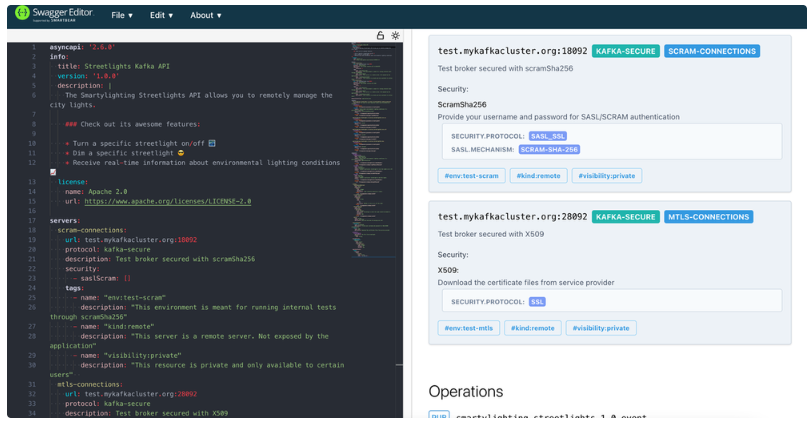
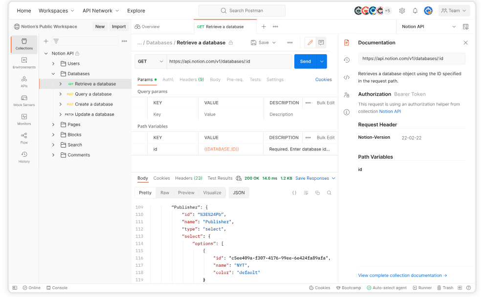

# RESTful API

## 基本概念

### REST

REST，是Representational State Transfer的缩写，直接翻译的意思是"表现层状态转化"。 

REST 是一种软件架构风格，应用于网络应用的设计和开发，可以降低开发的复杂性，提高系统的可伸缩性。

### RESTful 

遵从REST风格的规范被称为 RESTful规范。

restful规范提供了一组设计原则和约束条件，它主要用于客户端和服务器交互类的软件，基于这个风格设计的软件可以更简洁，更有层次，更易于实现缓存等机制。

### 产生的背景

在前后端分离的项目中，后端需要给前端提供API，因此需要一套规范来设计API，要做到**结构清晰、符合标准、易于理解、扩展方便**，而 RESTful API 刚好符合上述特点。

## REST设计架构

### 资源与URI

REST全称是表现层状态转化，但是指的是什么的表现层的状态转化呢？其实指的是资源的表现层的状态转化。

任何事物，只要有被引用到的必要，它就是一个资源。资源可以是实体(如手机号码、用户信息等)，也可以只是一个抽象概念(例如价值) 。

为了让一个资源可以被识别，需要有个唯一标识，在Web中这个唯一标识就是URI。

### 统一资源接口

RESTful架构要遵循统一接口原则，不论什么样的资源，都是通过使用相同的接口进行资源的访问。

接口应该使用标准的HTTP方法，如GET，PUT和POST，并遵循这些方法的语义。

按照HTTP方法的语义来暴露资源，接口将会拥有安全性和幂等性的特性，例如GET和HEAD请求都是安全的， 无论请求多少次，都不会改变服务器状态。而GET、HEAD、PUT和DELETE请求都是幂等的，无论对资源操作多少次， 结果总是一样的，后面的请求并不会产生比第一次更多的影响。

### 资源的表述

客户端通过HTTP方法可以获取资源，应该说只是资源的表述(或成为表现、表示)而已。资源在外界的具体呈现，可以有多种表述形式，在客户端和服务端之间传送的也是资源的表述，而不是资源本身， 例如文本资源可以采用html、xml、json等格式，图片可以使用PNG或JPG展现出来。

客户端可以通过Accept头决定服务端的响应格式（资源的表示），服务端则通过Content-Type告诉客户端资源的表述形式。

### 状态的转移

访问一个网站，就代表了客户端和服务器的一个互动过程。在这个过程中，势必涉及到数据和状态的变化。

互联网通信协议HTTP协议，是一个无状态协议。这意味着，所有的资源状态都保存在服务器端。因此，**如果客户端想要操作服务器，必须通过某种手段，让服务器端发生"状态转化"（State Transfer）。而这种转化是建立在表现层之上的，所以就是"表现层状态转化"。**

**HATEOAS**

HATEOAS是**Hypermedia as the Engine of Application State**的缩写。

翻译过来就是**超媒体作为应用状态引擎**。

**产生的问题：**

对接的过程一般都是后端的同学给出一个文档，告诉我们有哪些API，可以获得什么样子的参数。

试想一下，如果有一天后端同学新增加了API，但是没有给这个API文档，那你该怎么办？

所以说API文档，成为了前后端对接的耦合因素。

**HATEOAS怎么解决问题？**

HATEOAS通过超媒体来提供客户端与服务器之间的交互。

在API所返回的资源中会包含相关资源的链接，客户端只需要了解最少的API URL信息就能导航整个API。

即客户端可以通过一个简单的初始URI，并从返回值获取可以操作的其他信息。

这样一来，我们对接后端时，就几乎不需要额外的信息。

可以进一步实现前后端的解耦。

比如，当用户向api.example.com的根目录发出请求，会得到这样一个文档。

```java
{
    "link":{
        "rel":"collectionhttps://www.example.com/zoos",

	    "href":"https://api.example.com/zoos",

        "title":"List of zoos",

        "type":"application/vnd.yourformat+json"

  		}
}
```

上面代码表示，文档中有一个link属性，用户读取这个属性就知道下一步该调用什么API了。rel表示这个API与当前网址的关系（collection关系，并给出该collection的网址），href表示API的路径，title表示API的标题，type表示返回类型。

### RESTful API安全性

**API身份验证**

在RESTful API设计中我们可以用多种方式来验证，确保授权用户使用API）。最常用的身份验证协议是HTTP基本身份验证和OAuth。

**HTTP基本身份验证：**

API验证一般来说会使用基于Token的认证，第一次认证通过后，就会获取到一个Token字串，以后请求中带上此Token就可以。此Token凭据仅使用Base64编码，没有加密，没有散列。每个请求都在头部中包含此Token字串。因此，如果Web传输时候用的是没有加密的HTTP，而不是HTTPS的话，基本上没有任何安全可言，在网络传输过程中会被别人抓包，很容易窃取到。所以，HTTP基本身份验证非常危险。

但是一般来说我们如果是限制在内网、局域网内部使用的话，基本上还是可靠的。

原则一，不对对外开放不安全的API访问权限、

原则二，使用HTTPS加密传输。

**Oauth认证**

Oauth（Open Authorization）协议为资源访问提供一条简易，开放和安全的通道。

在Oauth认证情况下，服务提供商、资源所有者提供商可靠地访问token，通访问Token获取特定范围的资源URL的许可。Oauth认证时时最主要的安全问题是访问Token泄漏可能很危险，拥有Token的就可以获得操作的权限。

关于Oauth安全原则：

Redirect_uri全路径验证，避免URL跳转出现问题；

状态参数State要随时销毁；

获取访问Token时候，要验证App 密串；

对回调URL进行跳转校验等。

**用户输入安全：**

应用程序维护中有一条规则安全性军规："绝不信任任何用户的输入"。这也适用于API的安全。现在，大多数情况下，Web应用程序都对输入进行过滤，但是往往会忽略对来自API的数据进行过滤。

安全原则：用户输入严格过滤。

**RESTful API进行拒绝式攻击（DDOS,CC）**

还有一种常见的攻击是对API做ddos攻击。ddos攻击很容易，只需对API接口进行循环调用即可。由于获取数据很慢，耗时，如果服务端对访问数量和频率没有控制的话，很容易就会造成cc攻击。很容易一条脚本、无需肉鸡，无需带宽就能让你的服务在短时间内爆掉。

大多数REST API服务供应者，都会每个用户/Token数做限制。速率限制还可以防止暴力破解攻击。

安全原则：限制请求并发数，限制用户访问请求的频率。

## REST设计原则

 标准的REST约束应满足以下6个原则：

- **客户端-服务端（Client-Server）**: 客户端和服务端的分离，服务端独立可更好服务于前端、安卓、IOS等客户端设备。
- **无状态（Stateless）**：服务端不保存客户端状态，客户端保存状态信息每次请求携带状态信息。
- **可缓存性（Cacheability）** ：服务端需回复是否可以缓存以让客户端甄别是否缓存提高效率。
- **统一接口（Uniform Interface）**：通过一定原则设计接口降低耦合，简化系统架构。
- **分层系统（Layered System）**：客户端无法直接知道连接的到终端还是中间设备，分层允许你灵活的部署服务端项目。
- **按需代码（Code-On-Demand，可选）**：按需代码允许我们灵活的发送一些看似特殊的代码给客户端例如JavaScript代码。

## RESTful API设计规范

设计一个RESTful API，涉及到了URL路径、HTTP请求动词、状态码和返回结果等方面。

### 协议

API与用户的通信协议，总是使用HTTPs协议。

### 域名

应该尽量将API部署在专用域名之下。

```js
https://api.example.com
```

如果确定API很简单，不会有进一步扩展，可以考虑放在主域名下。

```js
https://example.org/api/
```

### 版本

应该将API的版本号放入URL。

```js
https://api.example.com/v1/
```

另一种做法是，将版本号放在HTTP头信息中，但不如放入URL方便和直观。

### 路径

路径表示API的具体网址。

在RESTful架构中，每个网址代表一种资源，所以网址中不能有动词，只能有名词，而且所用的名词往往与数据库的表格名对应。一般来说，数据库中的表都是同种记录的"集合"，所以API中的名词也应该使用复数。

举例来说，有一个API提供动物园（zoo）的信息，还包括各种动物和雇员的信息，则它的路径应该设计成下面这样。

> https://api.example.com/v1/zoos
>
> https://api.example.com/v1/animals
>
> https://api.example.com/v1/employees

### HTTP动词

- GET (SELECT): 查询，从服务器取出资源。
-  POST(CREATE): 新增，在服务器上新建一个资源。
-  PUT(UPDATE): 更新，在服务器上更新资源（客户端提供改变后的**完整资源**）。
-  PATCH(UPDATE): 更新，在服务器上更新部分资源（客户端提供**改变的属性**）。
-  DELETE(DELETE): 删除，从服务器上删除资源。

还有两个不常用的HTTP动词：

> HEAD：获取资源的元数据。
>
> OPTIONS：获取信息，关于资源的哪些属性是客户端可以改变的。

下面是一些例子。

> GET /zoos：列出所有动物园
>
> POST /zoos：新建一个动物园
>
> GET /zoos/ID：获取某个指定动物园的信息
>
> PUT /zoos/ID：更新某个指定动物园的信息（提供该动物园的全部信息）
>
> PATCH /zoos/ID：更新某个指定动物园的信息（提供该动物园的部分信息）
>
> DELETE /zoos/ID：删除某个动物园
>
> GET /zoos/ID/animals：列出某个指定动物园的所有动物
>
> DELETE /zoos/ID/animals/ID：删除某个指定动物园的指定动物

**安全性**：**不会修改资源状态**就是安全的，即读的为安全的，写的操作为非安全的。

**幂等性**：用户对同一操作的一次或多次请求的结果是一样的，**不会因为多次点击而产生副作用**。

上述四个HTTP请求方法的安全性和幂等性如下：

| HTTP Method | 安全性 | 幂等性 | 解释                                 |
| ----------- | ------ | ------ | ------------------------------------ |
| GET         | 安全   | 幂等   | 读，不修改资源，重复的操作结果相同   |
| POST        | 非安全 | 非幂等 | 写，添加资源，重复添加，会出现新数据 |
| PUT         | 非安全 | 幂等   | 写，修改资源，重复修改结果相同       |
| DELETE      | 非安全 | 幂等   | 写，删除资源，重复删除结果相同       |

### 过滤信息

如果记录数量很多，服务器不可能都将它们返回给用户。API应该提供参数，过滤返回结果。

下面是一些常见的参数。

> ?limit=10：指定返回记录的数量
>
> ?offset=10：指定返回记录的开始位置。
>
> ?page=2&per_page=100：指定第几页，以及每页的记录数。
>
> ?sortby=name&order=asc：指定返回结果按照哪个属性排序，以及排序顺序。
>
> ?animal_type_id=1：指定筛选条件

参数的设计允许存在冗余，即允许API路径和URL参数偶尔有重复。比如，GET /zoo/ID/animals 与 GET /animals?zoo_id=ID 的含义是相同的。

### URI设计规范

1. URI末尾不需要出现斜杠/
2. 在URI中不允许出现下划线字符_
3. 在URI中不允许出现文件扩展名，比如接口为 /xxx/api, 不要写成 /xxx/api.php 这样的是不合法的。
4. 在URI中可以使用连接符-, 来提升可读性，比如 `xxx.com/xx-yy` 比` xxx.com/xx_yy` 可读性更好。
5. 在URI中使用斜杠/是表达层级关系的。
6. 在URI中尽量使用小写字符。
7. 在URI中使用复数形式。

没有规范：

```
http://xxx.com/api/getallUsers   // GET请求方式，获取所有的用户信息
http://xxx.com/api/getuser/1     // GET请求方式，获取标识为1的用户信息
http://xxx.com/api/user/delete/1 // GET、POST 删除标识为1的用户信息
http://xxx.com/api/updateUser/1  // POST请求方式 更新标识为1的用户信息
http://xxx.com/api/User/add      // POST请求方式，添加新的用户
```

使用 RESTful API 规范后：

```
http://xxx.com/api/users      // GET请求方式 获取所有用户信息
http://xxx.com/api/users/1    // GET请求方式 获取标识为1的用户信息
http://xxx.com/api/users/1    // DELETE请求方式 删除标识为1的用户信息
http://xxx.com/api/users/1    // PATCH请求方式，更新标识为1的用户部分信息
http://xxx.com/api/users      // POST请求方式 添加新的用户
```

接口统一，只需通过请求方法区分不同的请求。

### HTTP状态码

**状态码范围**

客户端的每一次请求, 服务器端必须给出回应，回应一般包括HTTP状态码和数据两部分。

1xx: 信息，请求收到了，**继续**处理。
2xx: 代表**成功**，行为被成功地接收、理解及采纳。
3xx: **重定向**。
4xx: **客户端错误**，请求包含语法错误或请求无法实现。
5xx: **服务器端错误**.

**2xx 状态码**

200 OK [GET]: 服务器端**成功**返回用户请求的数据。
201 CREATED [POST/PUT/PATCH]: 用户**新建或修改**数据成功。
202 Accepted 表示一个请求已经进入后台**排队**(一般是异步任务)。
204 NO CONTENT -[DELETE]: 用户**删除**数据成功。

**4xx状态码**

400：Bad Request - [POST/PUT/PATCH]: 用户发出的请求有错误，服务器不理解客户端的请求，未做任何处理。
401: Unauthorized; 表示用户没有权限(令牌、用户名、密码错误)。
403：Forbidden: 表示用户得到授权了，但是访问被禁止了, 也可以理解为不具有访问资源的权限。
404：Not Found: 所请求的资源不存在，或不可用。
405：Method Not Allowed: 用户已经通过了身份验证, 但是所用的HTTP方法不在它的权限之内。
406：Not Acceptable: 用户的请求的格式不可得(比如用户请求的是JSON格式，但是只有XML格式)。
410：Gone - [GET]: 用户请求的资源被转移或被删除。且不会再得到的。
415: Unsupported Media Type: 客户端要求的返回格式不支持，比如，API只能返回JSON格式，但是客户端要求返回XML格式。
422：Unprocessable Entity: 客户端上传的附件无法处理，导致请求失败。
429：Too Many Requests: 客户端的请求次数超过限额。

**5xx 状态码**

500：INTERNAL SERVER ERROR; 服务器发生错误。
502：网关错误。
503: Service Unavailable 服务器端当前无法处理请求。
504：网关超时。

### 返回结果

针对不同操作，服务器向用户返回的结果应该符合以下规范。

> GET /collection：返回资源对象的列表（数组）
>
> GET /collection/resource：返回单个资源对象
>
> POST /collection：返回新生成的资源对象
>
> PUT /collection/resource：返回完整的资源对象
>
> PATCH /collection/resource：返回完整的资源对象
>
> DELETE /collection/resource：返回一个空文档

### 统一的返回数据格式

RESTful规范中的请求应该返回统一的数据格式。对于返回的数据，一般会包含如下字段:

1. code: http响应的状态码。
2. status: 状态信息，比如：success(成功), fail(失败), error(异常) HTTP状态响应码在500-599之间为 'fail'; 在400-499之间为 'error', 其他一般都为 'success'。 对于响应状态码为 1xx, 2xx, 3xx 这样的可以根据实际情况可要可不要。

当status的值为 'fail' 或 'error'时，需要添加 message 字段，用于显示错误信息。

3. data: 当请求成功的时候, 返回的数据信息。 但是当状态值为 'fail' 或 'error' 时，data仅仅包含错误原因或异常信息等。服务器返回的数据格式，应该尽量使用JSON，避免使用XML。

返回成功的响应JSON格式一般为如下:

```css
{
    "code": 200,
    "status": "success",
    "data": [{
        "userName": "zhanghua",
        "age": 31
    }]
}
```

返回失败的响应json格式为如下:

```csharp
{
    "code": 401,
    "status": "error",
    "message": '用户没有权限',
    "data": null
}
```

## 常用工具或框架

使用一些工具可以自动生成API文档，从而省去了人工编写文档的麻烦。

### Swagger

Swagger 是一个非常流行的开源 API 管理工具，它可以帮助你设计、构建、文档化和测试 **RESTful API**。Swagger UI 提供了一个交互式的界面，可以帮助开发人员更加高效地设计、测试和文档化 API 接口。它不仅支持多种语言和框架，还提供了丰富的插件和扩展，可以帮助开发人员更好地管理和监控 API 接口的性能和使用情况。




###  Postman

**Postman** 提供了一个直观、易于使用的界面，可以帮助开发人员更加高效地测试和调试 API 接口。它支持多种 HTTP 请求方法、参数类型和数据格式，还提供了丰富的测试和调试功能，例如断言、测试集合、环境变量等。


