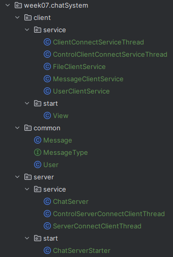

## 第7-8周学习计划：

#### 项目选题

1. 选择一个兴趣或擅长的领域，比如一个简单的文件管理系统。
2. 需求分析定义项目的基本功能和特性，明确需求。

#### 系统设计

1. 划分模块和组件。
2. 开发及实现

## 聊天应用

### 需求分析

用Java模拟实现一个聊天应用，涉及的技术包括网络编程、IO流、多线程等。

功能如下：

- 用户登录        

- 用户在线列表
- 私聊群聊（实现单发和群发消息）
- 传送文件
- 退出系统（退出客户端、服务器端）

### 项目结构

- service：业务功能逻辑。
- start
  - View：启动客户端，展示菜单界面
  - ChatServerStarter：启动服务端。
- common：公共的内容，包括用户信息、发送的消息、消息的类型。

### 菜单界面

### 功能实现

#### 用户登录

1. 客户端用对象输出流向服务端发送用户信息
2. 服务端用对象输入流获取到客户端发的用户信息
3. 服务端校验账号和密码是否正确
4. 若失败则回复登录失败消息，成功则回复登录成功消息，并展示二级菜单

#### 获取在线列表

1. 客户端向服务端发送获取在线用户列表的消息
2. 服务端根据消息的类型得知要获取在线用户列表
3. 服务端封装好在线用户列表，并回复给客户端
4. 客户端收到回复，得到在线用户列表，并且打印

#### 群发消息

1. 客户端向服务端发送群发消息的类型的消息
2. 服务端根据消息类型得知要群发消息
3. 服务端遍历客户端线程（排除自己）获得各线程的Socket将客户端发的消息转发给其他客户端
4. 其他客户端收到服务端发的消息，将消息打印

#### 私发消息

1. 客户端向服务端发送私发消息的类型的消息
2. 服务端根据消息类型得知要私发消息
3. 服务端根据消息中的接受者，将消息发送给特定的客户端
4. 接收者客户端收到服务端发的消息，将消息打印

#### 发送文件

1. 客户端将要发送的文件封装好，并向服务端发送要发送文件的类型的消息
2. 服务端根据消息类型得知要发送文件
3. 服务端根据消息中的接受者，将消息发送给特定的客户端
4. 接收者客户端收到服务端发的消息，将文件保存

#### 退出系统

1. 客户端向服务端发送退出系统的类型的消息，并将线程中的循环终止，然后退出当前线程
2. 服务端根据消息类型得知要退出系统
3. 服务端删除登记的线程，关闭Socket，然后退出循环，结束当前线程

### 测试

#### **登录**

#### 在线用户列表

#### 群发消息

#### 私发消息

#### 发送文件

#### 退出系统

