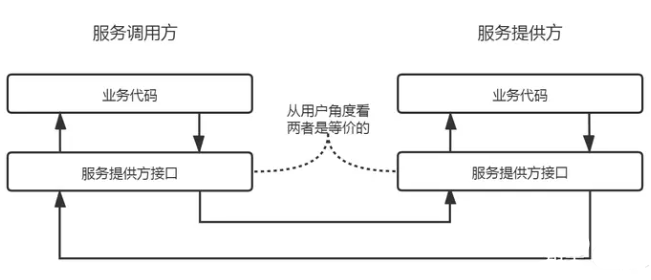

## 第7-8周学习计划：

#### 项目选题

1. 选择一个兴趣或擅长的领域，比如一个简单的文件管理系统。
2. 需求分析定义项目的基本功能和特性，明确需求。

#### 系统设计

1. 划分模块和组件。
2. 开发及实现。

# 实现简易RPC框架

## 概述

**远程过程调用**（Remote Procedure Call，简称RPC），是一种协议。

- **远程**：是指不是应用内部、机器内部进行的，而是外部的，需要通过网络进行通信。
- **过程**：指的是方法。

那“远程过程调用”，就是：**通过网络与其他服务端进行通信，调用其他服务端的方法**。

随着分布式系统的普及，远程过程调用使用得越来越广泛，可以让远程方法像本地方法一样调用，对于用户能无感知地使用。

执行流程：

**调用方**：使用动态代理生成代理对象，在代理的方法中向服务提供方发送调用方法的请求，收到服务提供方的回复后将结果返回。

**通信**：用TCP或UDP。

**服务提供方**：服务提供方在接受到调用请求后，调用具体方法，并且执行结果返回给调用方。

RPC涉及到了动态代理、序列化、通信、反序列化。

## 主流RPC框架

- gRPC

gRPC是Google开源的高性能RPC框架，基于Protocol Buffers进行序列化，支持多种编程语言。

gRPC基于HTTP/2协议，具有高效的双向流、多路复用和头部压缩等特性。

提供了多种调用方式，包括简单RPC、服务器流式RPC、客户端流式RPC和双向流式RPC。

- Apache Thrift

Thriftt是一个RPC框架(RPC是远程过程调用)，与Dubbo类似，最初由Facebook开发，后面进入Apache开源项目。

Thrift使用自定义的IDL（接口定义语言）来定义服务和数据类型，支持多种数据传输格式，如二进制、JSON和压缩格式。

提供了多种传输协议，包括TCP、HTTP和Zlib压缩协议等，可根据需求进行选择。

- Apache Dubbo

阿里巴巴开源的高性能RPC框架，支持服务治理和多种协议，适用于Java生态系统。

Dubbo支持多种协议，包括dubbo、REST、HTTP和WebService等，可根据需求进行选择。

提供了丰富的服务治理功能，如负载均衡、集群容错、动态路由和服务降级等。

- Spring Cloud Netflix

基于Netflix OSS开发的Spring Cloud组件，包括Ribbon、Feign和Hystrix等，提供了基于HTTP的RPC风格的服务调用和负载均衡等功能。

## 实现

**首先**，调用方调用的是接口，必须得为接口构造一个假的实现。显然，要使用动态代理。这样，调用方的调用就被动态代理接收到了。

**第二**，动态代理接收到调用后，应该想办法调用远程的实际实现。这包括下面几步：

- 获得调用的远程方法的IP、端口
- 将调用方法的入参进行序列化
- 通过通信将请求发送到远程的方法中

**第三**，远程的服务接收到了调用方的请求后，它应该：

- 反序列化各个调用参数
- 定位到实际要调用的方法，然后输入参数，执行方法
- 按照调用的路径返回调用的结果

