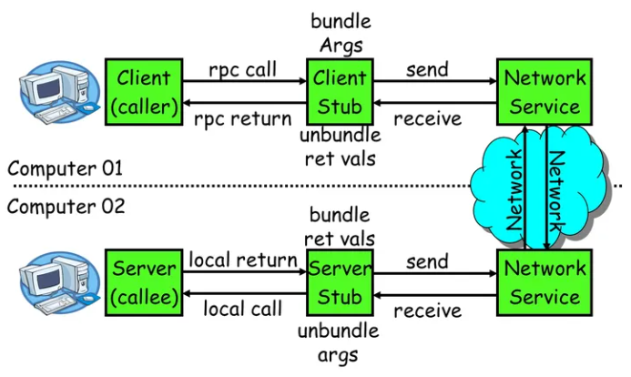

## 第7-8周学习计划：

#### 项目选题

1. 选择一个兴趣或擅长的领域，比如一个简单的文件管理系统。
2. 需求分析定义项目的基本功能和特性，明确需求。

#### 系统设计

1. 划分模块和组件。
2. 开发及实现。

# 简易RPC框架

RPC就是远程过程调用，作用是将远程方法像本地方法一样调用。

执行流程：

通过网络传输发送方法请求，接收方法结果。

服务A：发送请求，接收结果

服务B：接收请求，调用方法，发送结果