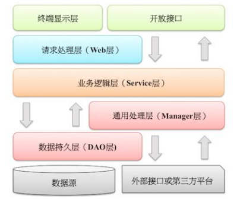

# Java基础知识

## 数据类型

- 8种基本数据类型：

整数型：byte（1字节）、short（2字节）、int（4字节）、long（8字节）

浮点型：float（4字节）、double（8字节）

字符型：char（2字节）

布尔型：boolean（字节数不一定）


- 3种引用数据类型：

类、接口、数组；除了八大基本数据类型之外的类型都是引用数据类型。

## 类型转换

在 Java 中，类型转换规则包括自动类型转换（隐式类型转换）和强制类型转换（显式类型转换）两种方式。

自动类型转换：范围小的转换为范围大的

强制类型转换：范围大的转换为范围小的，可能会导致精度丢失，谨慎使用

规则：

1. 八种基本数据类型中，除了boolean类型不能转换，剩下七种类型之间都可以进行转换
2. 如果整数型字面量没有超过byte、short、char的取值范围，可以直接将其赋值给byte、short、char类型的变量
3. 范围从小到大排序为：byte < short(char) < int < long < float < double，其中short和char都占用两个字节，但是char可以表示更大的正整数。
4. byte、short、char 类型混合运算时，先各自转换成 int 类型再做运算。
5. 多种数据类型混合运算时，各自先转换成容量最大的那一种再做运算。

## 泛型

泛型是一种在编译时期进行类型检查和类型安全的机制，它可以让我们编写更加通用和可复用的代码。

泛型，可以理解为“参数化类型”，把类型当作参数，类型以调用者传入的类型为准。

泛型只在编译阶段有效。

泛型的作用：

1.提供类型检查机制，使类型步一致问题，提前到编译期，使得开发者能更早发现问题

2.使用泛型类、泛型接口、泛型方法，可以编写更加通用的代码，例如：ArrayList

### 举例子

```java
List arrayList = new ArrayList();
arrayList.add("aaaa");
arrayList.add(100);

for(int i = 0; i< arrayList.size();i++){
    String item = (String)arrayList.get(i);
    Log.d("泛型测试","item = " + item);
}
```

毫无疑问会报错：

```java
java.lang.ClassCastException: java.lang.Integer cannot be cast to java.lang.String
```

ArrayList 可以存放任意类型，例子中添加了一个String类型，添加了一个Integer类型，再使用时都以String的方式使用，因此程序崩溃了。为了解决这种由于类型不一致而产生的问题（在编译阶段就可以解决），泛型应运而生。

将第一行声明初始化 list 的代码更改一下，编译器会在编译阶段就能够帮我们发现类似这样的问题。

```java
List<String> arrayList = new ArrayList<String>();
...
//arrayList.add(100); 在编译阶段，编译器就会报错
```

### 泛型类

泛型类型用于类的定义中，被称为泛型类。通过泛型可以完成对一组类的操作对外开放相同的接口。最典型的就是各种容器类，如：List、Set、Map。

模板：

```java
class 类名称 <泛型标识：可以随便写任意标识号，标识指定的泛型的类型>{
  private 泛型标识 /*（成员变量类型）*/ var; 
  .....

  }
}
```

例子：

```java
//此处T可以随便写为任意标识，常见的如T、E、K、V等形式的参数常用于表示泛型
//在实例化泛型类时，必须指定T的具体类型
public class Generic<T>{ 
    //key这个成员变量的类型为T,T的类型由外部指定  
    private T key;

    public Generic(T key) { //泛型构造方法形参key的类型也为T，T的类型由外部指定
        this.key = key;
    }

    public T getKey(){ //泛型方法getKey的返回值类型为T，T的类型由外部指定
        return key;
    }
}
```

```java
//泛型的类型参数只能是类类型（包括自定义类），不能是简单类型
//传入的实参类型需与泛型的类型参数类型相同，即为Integer.
Generic<Integer> genericInteger = new Generic<Integer>(123456);

//传入的实参类型需与泛型的类型参数类型相同，即为String.
Generic<String> genericString = new Generic<String>("key_vlaue");
```

定义的泛型类，就一定要传入泛型类型实参么？并是一定要传入泛型类型的实参，如果不传入泛型类型实参的话，在泛型类中使用泛型的方法或成员变量定义的类型可以为任何的类型。

```java
Generic generic = new Generic("111111");
Generic generic1 = new Generic(4444);
Generic generic2 = new Generic(55.55);
Generic generic3 = new Generic(false);

System.out.println("泛型测试：key is " + generic.getKey());
System.out.println("泛型测试：key is " + generic1.getKey());
System.out.println("泛型测试：key is " + generic2.getKey());
System.out.println("泛型测试：key is " + generic3.getKey());
```

```
泛型测试: key is 111111
泛型测试: key is 4444
泛型测试: key is 55.55
泛型测试: key is false
```

注意：

- 泛型的类型参数只能是类类型，不能是简单类型。
- 不能对确切的泛型类型使用 instanceof 操作。如下面的操作是非法的，编译时会出错。

```java
　if(ex_num instanceof Generic<Number>){ 
  }
```

### 泛型接口

泛型接口与泛型类的定义及使用基本相同。泛型接口常被用在各种类的生产器中，可以看一个例子：

```java
//定义一个泛型接口
public interface Generator<T> {
    public T next();
}
```

当实现泛型接口时，泛型接口未传入泛型实参，实现类的泛型声明要和泛型接口保持一致：

```java
/**
 * 未传入泛型接口的实参时，实现类的泛型声明要和泛型接口保持一致
 * 即：class FruitGenerator<T> implements Generator<T>{
 * 如果不声明泛型，如：class FruitGenerator implements Generator<T>，编译器会报错："Unknown class"
 */
class FruitGenerator<T> implements Generator<T>{
    @Override
    public T next() {
        return null;
    }
}
```

当实现泛型接口时，泛型接口有传入泛型实参，实现类中，所有使用泛型的地方都要替换成传入的实参类型：

```java
/**
 * 传入泛型实参时：
 * 在实现类实现泛型接口时，如已将泛型类型传入实参类型，则所有使用泛型的地方都要替换成传入的实参类型
 * 即：Generator<T>，public T next();中的的T都要替换成传入的String类型。
 */
public class FruitGenerator implements Generator<String> {

    private String[] fruits = new String[]{"Apple", "Banana", "Pear"};

    @Override
    public String next() {
        Random rand = new Random();
        return fruits[rand.nextInt(3)];
    }
}
```

### 泛型方法

泛型类型用于方法的定义中，被称为泛型方法。泛型方法，是在调用方法的时候指明泛型的具体类型 。

```java
/**
 * 泛型方法的基本介绍
 * @param tClass 传入的泛型实参
 * @return T 返回值为T类型
 * 说明：
 *     1）public 与 返回值中间<T>非常重要，可以理解为声明此方法为泛型方法。
 *     2）只有声明了<T>的方法才是泛型方法，泛型类中的使用了泛型的成员方法并不是泛型方法。
 *     3）<T>表明该方法将使用泛型类型T，此时才可以在方法中使用泛型类型T。
 *     4）与泛型类的定义一样，此处T可以随便写为任意标识，常见的如T、E、K、V等形式的参数常用于表示泛型。
 */
public <T> T genericMethod(Class<T> tClass)throws InstantiationException ,
  IllegalAccessException{
        T instance = tClass.newInstance();
        return instance;
}
```

例子：

```java
public class GenericTest {
    
   //这个类是个泛型类，在上面已经介绍过
   public class Generic<T>{     
        private T key;

        public Generic(T key) {
            this.key = key;
        }

        //虽然在方法中使用了泛型，但是这并不是一个泛型方法。
        //这只是类中一个普通的成员方法，只不过他的返回值是在声明泛型类已经声明过的泛型。
        public T getKey(){
            return key;
        }
    }

    /** 
     * 这才是一个真正的泛型方法。
     * 首先在public与返回值之间的<T>必不可少，这表明这是一个泛型方法，并且声明了一个泛型T
     * 这个T可以出现在这个泛型方法的任意位置
     * 泛型的数量也可以为任意多个 
     *    如：public <T,K> K showKeyName(Generic<T> container){
     *        ...
     *        }
     */
    public <T> T showKeyName(Generic<T> container){
        System.out.println("container key :" + container.getKey());
        T key = container.getKey();
        return key;
    }

    //这也不是一个泛型方法，这就是一个普通的方法，只是使用了Generic<Number>这个泛型类做形参而已。
    public void showKeyValue1(Generic<Number> obj){
        Log.d("泛型测试","key value is " + obj.getKey());
    }
}
```

```java
public class GenericFruit {
    class Fruit{
        @Override
        public String toString() {
            return "fruit";
        }
    }

    class Apple extends Fruit{
        @Override
        public String toString() {
            return "apple";
        }
    }

    class Person{
        @Override
        public String toString() {
            return "Person";
        }
    }

    class GenerateTest<T>{
        public void show_1(T t){
            System.out.println(t.toString());
        }

        // 泛型类的泛型作用域是整个类，泛型方法的泛型作用域是所在的方法，注意泛型的标识不要重复
        // 如果标识符和泛型类的标识T重复，在方法中以方法声明的为准，虽然不会报错，但是不推荐重复
        public <E> void show_3(E t){
            System.out.println(t.toString());
        }
    }

    public static void main(String[] args) {
        Apple apple = new Apple();
        Person person = new Person();

        GenerateTest<Fruit> generateTest = new GenerateTest<Fruit>();
        //apple是Fruit的子类，所以这里可以
        generateTest.show_1(apple);
        //编译器会报错，因为泛型类型实参指定的是Fruit，而传入的实参类是Person
        //generateTest.show_1(person);

        //使用这两个方法都可以成功
        generateTest.show_2(apple);
        generateTest.show_2(person);

        //使用这两个方法也都可以成功
        generateTest.show_3(apple);
        generateTest.show_3(person);
    }
}
```

泛型方法结合可变参数的例子：

```java
public <T> void printMsg( T... args){
    for(T t : args){
        System.out.println("泛型测试：t is " + t);
    }
}
```

#### 静态方法与泛型

静态方法无法访问类上定义的泛型，所以静态方法要使用泛型的话，必须将静态方法定义成泛型方法 。

```java
public class StaticGenerator<T> {
    ....
    ....
    /**
     * 静态方法不能使用泛型类中已经声明过的泛型
     * 如：public static void show(T t){..},此时编译器会提示错误信息：
          "StaticGenerator cannot be refrenced from static context"
     */
    public static <T> void show(T t){

    }
}
```

### 泛型通配符

`Ingeter`是`Number`的一个子类，那么问题来了，在使用`Generic<Number>`作为形参的方法中，能否使用`Generic<Ingeter>`的实例传入呢？在逻辑上类似于`Generic<Number>`和`Generic<Ingeter>`是否可以看成具有父子关系的泛型类型呢？

为了弄清楚这个问题，使用`Generic<T>`这个泛型类继续看下面的例子：

```java
public void showKeyValue1(Generic<Number> obj){
    System.out.println("泛型测试：key value is " + obj.getKey());
}
```

```java
Generic<Integer> gInteger = new Generic<Integer>(123);
Generic<Number> gNumber = new Generic<Number>(456);

showKeyValue(gNumber);

// showKeyValue这个方法编译器会为我们报错：Generic<java.lang.Integer> 
// cannot be applied to Generic<java.lang.Number>
// showKeyValue(gInteger);
```

通过提示信息我们可以看到`Generic<Integer>`不能被看作为`Generic<Number>`的子类，是不同的类型参数，不能兼容。

回到上面的例子，如何解决上面的问题？总不能为了定义一个新的方法来处理`Generic<Integer>`类型的类，这样会冗余代码，需要一种方式来兼容`Generic<Integer>`和`Generic<Number>`，因此类型通配符应运而生。

可以将上面的方法改一下：

```java
public void showKeyValue1(Generic<?> obj){
   System.out.println("泛型测试：key value is " + obj.getKey());
}
```

类型通配符一般是使用“？”，表示未知类型，表示可以传入任意类型。

####  泛型上下边界

在使用泛型的时候，我们还可以为传入的泛型类型实参进行上下边界的限制，如：类型实参只准传入某种类型的父类或某种类型的子类。

为泛型添加上边界，即传入的类型必须是指定的类型及其子类：

```java
public void showKeyValue1(Generic<? extends Number> obj){
   System.out.println("泛型测试","key value is " + obj.getKey());
}
```

```java
Generic<String> generic1 = new Generic<String>("11111");
Generic<Integer> generic2 = new Generic<Integer>(2222);
Generic<Float> generic3 = new Generic<Float>(2.4f);
Generic<Double> generic4 = new Generic<Double>(2.56);

//这一行代码编译器会提示错误，因为String类型并不是Number类型的子类
//showKeyValue1(generic1);

showKeyValue1(generic2);
showKeyValue1(generic3);
showKeyValue1(generic4);
```

如果把泛型类的定义也改一下:

```java
public class Generic<T extends Number>{
    private T key;

    public Generic(T key) {
        this.key = key;
    }

    public T getKey(){
        return key;
    }
}
```

```java
//这一行代码也会报错，因为String不是Number的子类
Generic<String> generic1 = new Generic<String>("11111");
```

为泛型添加下边界用 super：

````java
public <T super Integer> void process(List<T> list) {
    // 在这里 T 必须是 Integer 类型或其父类型
}
````

必须在泛型声明时添加上下边界：

```java
//public <T> T showKeyName(Generic<T extends Number> container)，编译器会报错："Unexpected bound"
public <T extends Number> T showKeyName(Generic<T> container){
    System.out.println("container key :" + container.getKey());
    T test = container.getKey();
    return test;
}
```

## 面向对象

面向对象是一种编程思想，面向对象的三大基本特征是封装、继承、多态。

面向对象的编程思想就是把事物看作一个整体，从事物的特征（属性）和行为（方法）两个方面进行描述。

面向对象的过程就是找对象、建立对象、使用对象、维护对象的关系的过程。

### 抽象

所谓的抽象，就是把同一类事物中共有的特征(属性)和行为(功能、方法)进行抽取，归纳，总结。

抽象的过程其实就是面向对象编程的核心思想

### 封装

在 Java 中，封装是指将数据（属性）和相关方法隐藏在一个类中，对外部提供公共的接口来访问和操作这些数据。

封装的主要目的是隐藏内部实现细节，通过定义访问修饰符（如 private、public、protected）来控制对数据的访问权限，以保证数据的安全性和一致性。

封装的作用：

- 提高代码的可维护性和可扩展性。
- 隐藏内部细节，保护数据的安全性。
- 提供统一的接口来操作数据，减少错误和提高代码的可读性。
- 可以对数据进行控制和校验，确保数据的有效性。

封装的例子：

1.通过访问限制符修改类中属性的可见性，从而限制对类中属性的访问。

```java
 public class Person {
    private String name;
    private int age;
}
```

这段代码中，将 name 和 age 属性设置为私有的，只能本类才能访问，其他类都访问不了，如此就对信息进行了隐藏。

2.对每个值属性提供对外访问的公共方法，说白了也就是创建一对赋值取值的方法，来提供外部程序对类中的私有属性进行访问。

```java
public class Person {
    private String name;
    private int age;
     
    public void setage(int age){
     this.age = age;
	}
	public int getage(){
     return age;
	}
	public void setname(String name){
     this.name = name;
	}
	public String getname(){
     return name;
	}
}
```

### 继承

在 Java 中，继承（Inheritance）是面向对象编程的一个重要概念，它允许一个类（称为子类或派生类）继承另一个类（称为父类或基类）的属性和方法。通过继承，子类可以重用父类的代码，并且可以扩展或修改父类的功能。

Java 中的继承使用关键字 `extends` 来实现，子类通过继承父类来获取其非私有成员（属性和方法），包括公共（public）、受保护（protected）和默认（无修饰符）访问级别的成员。

继承的特点：

- 子类可以继承父类的非私有成员（属性和方法）。
- 子类可以重写（Override）父类的方法，以实现自己的特定行为。
- 子类可以添加新的成员（属性和方法）。
- 子类可以通过 `super` 关键字调用父类的构造方法和方法。
- 子类只能继承一个父类

子类访问父类：

- 子类可以访问父类的公共（public）和受保护（protected）成员。
- 如果父类成员使用默认（无修饰符）访问级别，则子类必须在同一包内才能访问。
- 子类不能直接访问父类的私有（private）成员，但可以通过父类的公共或受保护方法间接访问。

`super` 关键字：

- `super` 关键字用于引用父类的成员，包括属性、方法和构造方法。
- 可以使用 `super()` 调用父类的构造方法。
- 在方法中使用 `super.methodName()` 调用父类的方法。

继承的作用：

1. 代码重用：继承允许子类继承父类的属性和方法，这样可以避免重复编写相同的代码。子类可以直接使用父类已经定义好的功能，从而提高代码的复用性和可维护性。
2. 扩展性：通过继承，我们可以在已有的类基础上创建新的类，将新的功能添加到子类中。子类可以在父类的基础上进行修改和扩展，以满足特定需求，而不需要修改原始的父类代码。这种扩展性使得程序更加灵活和可扩展。
3. 多态性：继承是实现多态性的基础。通过多态性，我们可以使用父类类型的引用来引用子类对象，从而实现对不同子类对象的统一处理。这样可以提高代码的灵活性和可扩展性，并且使得代码更容易理解和维护。
4. 方法重写：子类可以重写（Override）父类的方法，以适应子类自身的特定需求。通过方法重写，子类可以改变继承自父类的方法的行为，实现多态性和个性化的定制。

使用模板：

```java
public class 子类名称 extends 父类名称{
    //... 
}
```

例子：

父类: Employee.java

```java
//定义一个父类:员工
public class Employee {
    public void method(){
        System.out.println("方法已执行!");
    }
}
```

子类 :Assistant.java

```java
//定义一个子类:助教
public class Assistant extends Employee {  //助教类继承了员工类
}
```

继承中成员变量的访问特点：

在父子类的继承关系当中，如果成员变量重名，则创建子类对象时，访问有两种方式：

1.直接通过子类对象访问成员变量：等号左边是谁，就优先用谁，没有则向上找

2.间接通过成员方法访问成员变量：该方法属于谁，就优先用谁，没有则向上找

```java
public class Fu {
    int numFu = 20;
    int num = 200;

    public void fuMethod(){
        System.out.println(num);
    }
}
```

```java
public class Zi extends Fu {
    int numZi = 30;
    int num = 300;
    public void ziMethod(){
        System.out.println(num);
    }
}
```

```java
/*
      在父子类的继承关系当中,如果成员变量重名,则创建子类对象时,访问有两种方式
      　　1.直接通过子类对象访问成员变量
              等号左边是谁,就优先用谁,没有则向上找
         2.间接通过成员方法访问成员变量
         　　　该方法属于谁,就优先用谁,没有则向上找.
 */
public class Demo2ExtendsField {
    public static void main(String[] args) {
        //创建父类对象
        Fu fu=new Fu();
        System.out.println(fu.numFu);    //只能使用父类的东西,没有任何子类内容,20
        System.out.println("==================");
        //创建子类对象
        Zi zi=new Zi();
        System.out.println(zi.numZi);    //30
        //等号左边是谁,就优先用谁,没有则向上找
        System.out.println(zi.num);      //300
        System.out.println(fu.num);      //200
//        System.out.println(zi.abc);      //这个abc子类没有,父类也没有,会编译报错

        //这个方法是子类的,优先用子类的,没有再向上找
        zi.ziMethod();
        //这个方法是在父类当中定义的
        fu.fuMethod();
    }
}
```

继承后变量重名解决：

1.本类的成员变量： this.成员变量名

2.父类的成员变量：super.成员变量名

```java
public class Fu {
    int num = 10;   //父类中成员变量
}
```

```java
public class Zi extends Fu{
    int num = 20;
    public void method(){
        int num = 30;
        System.out.println(num);        //访问局部变量
        System.out.println(this.num);   //访问本类的成员变量
        System.out.println(super.num);  //访问父类的成员变量
    }
}
```

方法的重写：

在继承关系当中，子类重写在父类中方法的名称一样，参数列表也一样的方法

特点：创建的是子类对象，则优先用子类对象

方法覆盖重写的注意事项：

　　1.必须保证父子类之间方法的名称相同，参数列表也相同。@Override：写在方法前面，用来检测是不是有效的正确覆盖重写，这个注释不写只要满足要求也是正确的，最好写因为可以提醒自己

　　 2.子类方法的返回值必须小于等于父类方法的返回值范围

　　 3.子类方法的权限必须大于等于父类方法的权限修饰符，public > protected > (default) > private 

继承中构造方法的访问特点：

继承关系中，父子类构造方法的访问特点:

1.子类构造方法当中有一个默认隐含的"super()"调用，所以一定是先调用的父类构造，后执行的子类构造，不写会自动添加

2.子类构造可以通过super关键字来调用父类重载构造

3.super的父类构造调用，必须是子类构造方法的第一个语句；不能一个子类构造调用多次super构造

总结: 子类必须调用父类构造方法，不写则自动添加；写了则用写的指定的super调用，super只能有一个，还必须是第一个

```java
public class Fu {
    public  Fu(){
        System.out.println("父类无参的构造方法");
    }
    public  Fu(int num){
        System.out.println("父类有参的构造方法");
    }
}

//Zi.java 子类
package Basis.Demo7Extends.Demo5;
public class Zi extends Fu {
    public  Zi(){
        super(10);
//      super();  错误写法
        System.out.println("子类的构造方法");
//      super();  必须是第一个
    }
}
```

```java
public class Demo1Constructor {
    public static void main(String[] args) {
        Zi zi=new Zi();
    }
}
```

```java
//输出结果
父类有参的构造方法
子类的构造方法
```

子父类的执行顺序：

父类的静态方法、子类的静态方法、父类的代码块、父类的构造方法、子类的代码块、子类的构造方法

重点：

1.先静态

2.先父类：代码块、构造方法

3.先代码块，然后是构造方法

### 多态

Java 多态是面向对象编程的一个重要概念，它允许使用父类类型的引用来引用子类对象，从而实现对不同子类对象的统一处理。多态性有助于提高代码的灵活性、可扩展性和可维护性。

多态性的核心思想是，一个对象可以表现出多种形态。具体来说，在Java中实现多态性的方式是通过继承和方法重写。

当一个父类引用指向一个子类对象时，可以根据引用的类型调用相应的方法。这意味着，通过父类的引用，可以调用子类重写的方法，而不需要知道具体的子类类型。

多态的作用：

1. 统一接口：多态性允许使用父类类型的引用来引用子类对象，从而实现对不同子类对象的统一处理。通过定义统一的接口（父类），可以使得代码更加简洁和可读，同时可以降低代码的耦合度。
2. 代码复用：通过多态性，可以将公共的代码逻辑封装在父类中，避免在每个子类中重复编写相同的代码。这样可以提高代码的可维护性和可复用性。
3. 可扩展性：当需要添加新的子类时，不需要修改现有的代码，只需要添加新的子类并保证其符合父类接口即可。这样可以降低代码的修改成本，增加系统的可扩展性。
4. 运行时确定方法调用：多态性允许在运行时根据对象的实际类型（而不是引用类型）确定调用哪个方法。这样可以实现动态绑定，提高代码的灵活性和可扩展性。
5. 多态参数和返回类型：通过多态性，可以将子类对象作为参数传递给接受父类类型参数的方法，或者将子类对象作为父类类型返回。这样可以增加代码的灵活性和可复用性。

多态的例子：

````java
public class Animal {
    public String name = "animal";

    public void eat() {
        System.out.println("动物吃东西！");
    }

    public void run() {
        System.out.println("动物在奔跑！");
    }
}

public class Tiger extends Animal {
    public String name = "tiger";

    @Override
    public void eat() {
        System.out.println("虎吃鸡！");
    }
    
    @Override
    public void run() {
		System.out.println("虎奔跑！");
	}
}

public class Snake extends Animal {
    public String name = "snake";
    
    @Override
    public void eat() {
        System.out.println("蛇吃鼠！");
    }

	@Override
    public void run() {
		System.out.println("蛇爬行！");
	}
}
````

 ````java
 1.多态成员变量：编译检查的时候检查Animal类中是否有此变量定义
 		Animal tiger = new Tiger(); 
 
 		System.out.println("name = " + tiger.name);
 
 	上述打印输出结果为： name = Animal
 
 2.使用多态调用成员方法：编译时检查左边类型，运行时实际调用右边对象
 
     	Animal snake = new Snake();
 
     	System.out.println(sanke.eat()); 
     	
  实际类型是Snake, 所以运行时调用的是Snake中重写后的方法。打印输出结果为： 蛇吃鼠！
 
 ````

**多态的特性：**

成员方法：编译看左边，运行看右边

成员变量：编译运行都看左边

静态方法：编译运行都看左边

子类的同名的类变量、静态方法、静态变量不会覆盖父类，编译和运行时都是以父类（左边）为准；只有成员方法会特别一点，编译时看父类（左边）有没有这个方法，然后运行时调用子类（右边）的方法。

## 控制结构

控制结构分为顺序结构、选择结构、循环结构

### 顺序结构

顺序结构是最简单最基础得结构，按照代码出现的先后顺序执行就是顺序结构


### 选择结构

#### if语句

```java
// 考试奖励：键盘录入一个整数，表示小明的考试名次，如果名次为1，小红可以当小明的女友了。
Scanner sc = new Scanner(System.in);
System.out.println("输入小明的名次");
int rank = sc.nextInt();
if (rank == 1){
    System.out.println("小红可以当女朋友");
}
```

```java
// 影院选座：某影院售卖了100张票，票的序号为1~100，奇数坐左边，偶数坐右边
Scanner sc = new Scanner(System.in);
System.out.println("请输入票号：");
int ticker = sc.nextInt();
if (ticker > 100 || ticker < 1) {
    System.out.println("票不合法");
} else {
    if (ticker % 2 != 0){
        System.out.println("坐左边");
    }else {
        System.out.println("坐右边");
    }
}
```

```java
// 考试奖励：
// 95~100 自行车一辆
// 90~94   游乐场玩一天
// 80 ~ 89 变形金刚一个
// 80 以下  胖揍一顿
Scanner sc = new Scanner(System.in);
System.out.println("请输入分数：");
int score = sc.nextInt();
if (score < 0 || score > 100){
    System.out.println("分数不合法");
}else {
    if (score >= 95){
        System.out.println("奖励自行车");
    }else if (score >= 90){
        System.out.println("游乐场玩一天");
    }else if (score >= 80){
        System.out.println("变形金刚一个");
    }else {
        System.out.println("揍一顿");
    }
}
```

#### switch语句

```java
switch (表达式) {
	case 1:
		语句体1;
		break;
	case 2:
		语句体2;
		break;
	...
	default:
		语句体n+1;
		break;
}
```

- 首先计算出表达式的值 
- 其次，和 case 依次比较，一旦有对应的值，就会执行相应的语句，在执行的过程中，遇到 break 才会结束，不然会一直执行下去。 
- 最后，如果所有的 case 都和表达式的值不匹配，就会执行 default 语句体部分，然后程序结束掉。
- 当其他的 case 都匹配不上时才会执行 default，default 可以放在任意位置（即使是放在第一位也是其他没匹配上才匹配这个），也可以省略，可以把default 理解成一个特殊的 case，因为没有跟 break 也会发生 case 穿透

练习：

```java
// 运动计划：键盘录入星期数，显示今天的减肥活动。
// 周一：跑步
// 周二：游泳
// 周三：慢走
// 周四：动感单车
// 周五：拳击
// 周六：爬山
// 周日：好好吃一顿
Scanner sc = new Scanner(System.in);
System.out.println("请输入星期数：");
int week = sc.nextInt();
switch (week) {
    case 1:
        System.out.println("跑步");
        break;
    case 2:
        System.out.println("游泳");
        break;
    case 3:
        System.out.println("慢走");
        break;
    case 4:
        System.out.println("动感单车");
        break;
    case 5:
        System.out.println("拳击");
        break;
    case 6:
        System.out.println("爬山");
        break;
    case 7:
        System.out.println("好好吃一顿");
        break;
    default:
        System.out.println("日期不合法，没有这个日期");
        break;
}
```

写switch语句技巧：先写第一个case，然后复制多个case，然后再写第一个case的内容，然后复制给多个 case

利用 case 穿透：

休息日和工作日：(1-5) 工作日，(6-7) 休息日

```java
        Scanner sc = new Scanner(System.in);
        System.out.println("请输入日期：");
        int day = sc.nextInt();
        switch (day){
            case 1:
            case 2:
            case 3:
            case 4:
            case 5:
                System.out.println("工作日");
                break;
            case 6:
            case 7:
                System.out.println("休息日");
                break;
            default:
                System.out.println("日期不合法");
                break;
        }
```

#### 使用场景

表示范围用 if

数据的个数有限可以列举，则用 switch

### 循环结构

#### for语句

```java
for (初始化语句;条件判断语句;条件控制语句) {
	循环体语句;
}
```

- 初始语句：初始状态
- 条件判断语句：每次循环前要判断的条件，符合条件才循环，不符合直接结束
- 条件控制语句：每次循环后要执行的语句
- 循环体语句：每次循环中要执行的代码

求偶数和：求1-100之间的偶数和，并把求和结果在控制台输出

```java
int sum = 0;
for (int i = 1; i <= 100; i++) {
    if (i % 2 == 0) {
        sum = sum + i;
    }
}
System.out.println("100以内偶数和：" + sum);
```

#### while语句

```java
初始化语句;
while(条件判断语句){
	循环体;
	条件控制语句;
}
```

和for的不同是初始语句在外面，条件控制语句写在花括号里

```java
		// 珠穆朗玛峰：纸需要折叠几次才到达山的高度
		int height = 888444555;
        int count = 0;
        double paper = 0.1;
        while (paper <= height) {
            paper = paper * 2;
            count++;
        }
        System.out.println("需要折叠的次数为：" + count);
```

#### do...while语句

```java
初始化语句;
do{
    循环体;
    条件控制语句;
}while(条件判断语句);
```

和while循环的区别是，do...while先执行一次循环在判断是否符合条件

```java
        // 1-100 求和
        int sum = 0;
        int num = 1;
        do {
            sum = sum + num;
            num++;
        } while (num <= 100);
        System.out.println("1-100的和为：" + sum);
```

#### 使用场景

当知道**循环次数**或**循环范围**的时候用 for

当知道不知道循环次数或范围，只知道**结束条件**的时候用 while

#### 条件控制语句

break：不能单独存在，可以用在switch或循环中，作用是结束循环，或结束switch

continue：不能单独存在，只能用在循环中，作用是跳过本次循环，开启下一次循环

```java
// 吃包子：1-5个包子，吃到第三个包子时停止
for (int i = 1; i <= 5; i++) {
    System.out.println("正在吃第" + i + "个包子");
    if (i == 3) {
        System.out.println("不吃了");
        break;
    }
}
```

```java
// 吃包子：1-5个包子，第三个包子有虫不吃第三个
for (int i = 1; i <= 5; i++) {
    if (i == 3) {
        System.out.println("第三个包子有虫不吃");
        continue;
    }
    System.out.println("正在吃第" + i + "个包子");
}
```

#### 练习题

逢7过:
游戏规则：从任意一个数字开始报数，当你要报的数字是包含7或者是7的倍数时都要说过：过
需求：使用程序在控制台打印出1-100之间的满足逢七必过规则的数据

分析：包含7：个位是7，10位是7; %10获得个位，/10去掉个位
			7的倍数：模以7等于0

```java
for (int i = 1; i <= 100; i++) {
    if (i % 10 == 7 || i / 10 % 10 == 7 || i % 7 == 0) {
        System.out.print("过 ");
        continue;
    }
    System.out.print(i + " ");
}

```

求平方根：键盘录入一个大于等于2的整数 x ，计算并返回 x 的 平方根 。结果只保留整数部分 ，小数部分将被舍去

```java
Scanner sc = new Scanner(System.in);
System.out.println("请输入数字");
int x = sc.nextInt();
if (x < 2) {
    System.out.println("数字不合法");
}
for (int i = 1; i <= x; i++) {
    if (i * i == x) {
        System.out.println("平方根是" + i);
        break;
    } else if (i * i > x) {
        System.out.println("平方根是" + (i - 1));
        break;
    }
}
```

判断是否为质数：键盘录入一个正整数 x ，判断该整数是否为一个质数。
分析：如果在2 到 x - 1之间有数可以整除x，则x就是质数

```java
Scanner sc = new Scanner(System.in);
System.out.println("请输入整数：");
int x = sc.nextInt();
// 默认为true，表示是质数
boolean flag = true; 
for (int i = 2; i < x - 1; i++) {
    // 能被其中一个数整除则不是质数
    if (x % i == 0){
        flag = false;
        break;
    }
}
if (flag){
    System.out.println("是质数");
}else {
    System.out.println("不是质数");
}
```

## 异常

### 概述

Java异常是指在程序运行时可能出现的一些错误，如：文件找不到、网络连接失败、非法参数等。异常是一个事件，它发生在程序运行期间，中断了正在执行的程序的正常指令流。Java通过API中Throwable类的众多子类描述各种不同的异常。因而，Java异常都是对象，是Throwable子类的实例，描述了出现在一段编码中的错误条件。当条件生成时，错误将引发异常。
Java异常类的层次结构图：


**Throwable**：所有的异常都是从Throwable继承而来的，是所有所有错误与异常的超类。Throwable包含了其线程创建时线程执行堆栈的快照，它提供了 printStackTrace()等接口用于获取堆栈跟踪数据等信息。而Throwable体系下包含有两个子类，Error（错误）和Exception（异常），它们通常用于指示发生了异常情况。

**Error**：Error类及其子类。程序中无法处理的错误，表示运行应用程序中出现了严重的错误。大多数错误与代码编写者执行的操作无关，而是表示代码运行时 JVM出现的问题。

**Exception**：Exception 是另外一个非常重要的异常子类。程序本身可以捕获并且可以处理异常。这类异常一旦出现，我们就要对代码进行更正，修复程序。Exception这种异常又分为两类：运行时异常和编译时异常。 

**运行时异常**：RuntimeException 类及其子类异常，如NullPointerException （空指针异常）、IndexOutOfBoundsException （下目标越界异常）等，表示 JVM在运行期间可能出现的异常。

运行时异常的特点：Java编译器不会检查它，也就是说，当程序中出现这类异常时，也会编译通过。        

**非运行时异常 （编译异常）**：Exception中除 RuntimeException 及其子类之外的异常。

**受检异常**：编译器要求必须处理得异常，Exception中除 RuntimeException 及其子类之外的异常，也就是**非运行时期异常，属于受检异常。**

**非受检异常**：编译器不会进行检查并且不要求必须处理的异常，包括运行时异常（RuntimeException 及其子类）和错误（ Error），RuntimeException 发生的时候，表示程序中出现了编程错误，所以应该找出错误修改程序，而不是去捕获RuntimeException 。

### 异常处理机制

#### 抛出异常 throw

什么时候使用呢？

1. 比如，在定义方法时，方法需要接受参数。那么，当调用方法使用接受到的参数时，首先需要先对参数数据进行合法的判断，数据若不合法，就应该告诉调用者，传递合法的数据进来。这时需要使用抛出异常的方式来告诉调用者。
2. 或者当你觉得解决不了某些异常问题，且不需要调用者处理，那么你也可以抛出异常。

如何抛出一个异常呢？

​	用 throw 抛出一个异常对象。

**定义格式：**

```java
throw new 异常类名(参数);
```

```java
public class ThrowDemo {
    public static void main(String[] args) {
        //创建一个数组
        int[] arr = {2,4,52,2};
        //根据索引找对应的元素
        int index = 4;
        int element = getElement(arr, index);
        System.out.println(element);
        System.out.println("over");
    }
    /*
     * 根据 索引找到数组中对应的元素
     */
    public static int getElement(int[] arr,int index){
        //判断索引是否越界
        if(index<0 || index>arr.length-1){
             /*
                判断条件如果满足，当执行完throw抛出异常对象后，方法已经无法继续运算。
                这时就会结束当前方法的执行，并将异常告知给调用者。这时就需要通过异常来解决。
              */
            throw new ArrayIndexOutOfBoundsException("你的索引越界了");
        }
        int element = arr[index];
        return element;
    }
}
```

```text
Exception in thread "main" java.lang.ArrayIndexOutOfBoundsException: 你的索引越界了
	at com.it.test2.ThrowDemo.getElement(ThrowDemo.java:25)
	at com.it.test2.ThrowDemo.main(ThrowDemo.java:10)
```

所以如果产生了问题，我们就会throw将问题描述类即异常进行抛出，也就是将问题返回给该方法的调用者。结果是ArrayIndexOutOfBoundsException 的数组索引越界的问题。

那么对于调用者来说，该怎么处理呢？一种是进行捕获处理，另一种是声明异常，使用throws声明处理。

#### 声明异常 throws

如果一个方法可能会出现异常，但没有能力处理这种异常，可以在方法声明处用throws子句来声明抛出异常。例如汽车在运行时它可能会出现故障，汽车本身没办法处理这个故障，那就让开车的人来处理。

**声明异常**：将问题标识出来，报告给调用者。如果方法内通过throw抛出了编译时异常，而没有捕获处理，那么必须通过throws进行声明，让调用者去处理。

**定义格式**： throws语句用在方法定义时声明该方法要抛出的异常类型，如果抛出的是Exception异常类型，则该方法被声明为抛出所有的异常。多个异常可使用逗号分割。

```text
修饰符 返回值类型 方法名(参数) throws 异常类名1,异常类名2…{   }
```

**注意**：当方法抛出异常列表的异常时，方法将不对这些类型及其子类类型的异常作处理，而抛向调用该方法的方法，由他去处理。使用throws关键字将异常抛给调用者后，如果调用者不想处理该异常，可以继续向上抛出，但最终要有能够处理该异常的调用者。比如汽车坏了，开车的人也不会修理，只能叫修车公司来修理了

```java
public class ThrowsDemo {
    public static void main(String[] args) throws FileNotFoundException {
        readFile("a.txt");
    }
    // 如果定义功能时有问题发生需要报告给调用者。可以通过在方法上使用throws关键字进行声明
    public static void readFile(String path) throws FileNotFoundException {
        if(!path.equals("a.txt")) {//如果不是 a.txt这个文件
            // 我假设  如果不是 a.txt 认为 该文件不存在 是一个错误 也就是异常  throw
            throw new FileNotFoundException("文件不存在");
        }
    }
}
```

而throws用于进行异常类的声明，若该方法可能有多种异常情况产生，那么在throws后面可以写多个异常类，用逗号隔开。

```java
public class ThrowsDemo2 {
    public static void main(String[] args) throws IOException {
        readFile("a.txt");
    }
    //若该方法可能有多种异常情况产生，那么在throws后面可以写多个异常类，用逗号隔开
    //若有异常a是异常b的子类，也可以直接省略，写b异常
    private static void readFile(String path) throws FileNotFoundException, IOException {
        if (!path.equals("a.txt")) {//如果不是 a.txt这个文件
            // 我假设  如果不是 a.txt 认为 该文件不存在 是一个错误 也就是异常  throw
            throw new FileNotFoundException("文件不存在");
        }
        if (!path.equals("b.txt")) {
            throw new IOException();
        }
    }
}
```

throws 抛出异常的规则：

1. 如果是非受检异常（unchecked exception），即Error、RuntimeException或它们的子类，那么可以不使用throws关键字来声明要抛出的异常，编译仍能顺利通过，但在运行时会被系统抛出。
2. 如果一个方法可能出现受检异常（checked exception），要么用try-catch语句捕获，要么用throws子句声明将它抛出，否则会导致编译错误。
3. 只有当抛出了异常时，该方法的调用者才必须处理或者重新抛出该异常。若当方法的调用者无力处理该异常的时候，应该继续抛出。

#### 捕获异常try 、finally 、catch

这三个关键字主要有下面几种组合方式try-catch 、try-finally、try-catch-finally。

**注意**：catch语句可以有一个或者多个或者没有，finally至多有一个，try必要有。

try，catch，finally不能单独使用出现。

try-catch-finally 形式：

```java
try {  
	// 可能会发生异常的程序代码，若发生了异常，则try中剩余的代码不会执行，跳转到catch  
} catch (异常类型A  e){  
	// 捕获并处置try抛出的异常类型A，若有finally则接下来执行finally中的代码，若无就执行下面的代码
} finally {  
	// 无论是否发生异常，都将执行的语句块  
}
```

不管执行情况如何，都会走 finally 中的代码，一般会在finally中释放资源。

注意：try-catch-finally中，如果catch中 return了，finally还会执行吗？

```java
public class TryCatchFinallyDemo2 {
    public static void main(String[] args) {
        test();
    }
    public static void test() {
        int a = 10;
        try{
            System.out.println(a / 0);
        }catch(ArithmeticException e) {
            e.printStackTrace();
            return ;
        }finally {
            System.out.println("finally");
        }
    }
}
```

运行结果：

```text
java.lang.ArithmeticException: / by zero
	at com.it.test3.TryCatchFinallyDemo2.test(TryCatchFinallyDemo2.java:11)
	at com.it.test3.TryCatchFinallyDemo2.main(TryCatchFinallyDemo2.java:5)
finally
```

可以看到，就算catch中 return了，finally也会执行。

那 finally 是在 return 前呢，还是 return 后呢？

```java
public class TryCatchFinallyDemo2 {
    public static void main(String[] args) {
//        dome();
        System.out.println(test2()); // 我有执行到吗 try
        System.out.println(test3()); // 我有执行到吗 catch
    }

    public static String test2() {
        String str = "";
        try {
            str = "try";
            return str;
        }catch(Exception e) {
            str = "catch";
            return str;
        }finally {
            str = "finally";
            System.out.println("我有执行到吗");
        }
    }
    public static String test3() {
        String str = "";
        try {
            str = "try";
            System.out.println(10 / 0);
            return str;
        }catch(Exception e) {
            str = "catch";
            return str;
        }finally {
            str = "finally";
            System.out.println("我有执行到吗");
        }
    }
}
```

运行结果：

```text
我有执行到吗
try
我有执行到吗
catch
```

finally 是在 return 之前执行，但是在 return 返回的是 try 或 catch 的变量，不会 return 在 finally 中改变的数值。

## 数组

在 Java 中，数组是一种用于存储同一类型数据的数据结构。数组提供了一种便捷的方式来存储和访问多个相同类型的元素。

初始化：

数组的静态初始化：int[] arr = new int[]{1,2,3};   简化写法：int[] arr = {1,2,3}；

数组的动态初始化：int[] arr = new int[3];

动态初始化会有默认值：

​	整数类型：0

​	小数类型：0.0

​	布尔类型：false

​	字符类型：'\u0000'

​	引用类型：null

使用场景：

只知道元素的个数，不知道具体的数值，使用动态初始化

知道具体的数值，使用静态初始化

地址值：

```java
int[] arr = new int[10];
System.out.println(arr);//[D@568db2f2
```

arr 保存的是数组的地址，访问元素要结合下标


数组常见操作：

访问和修改：

````java
int[] arr = {10, 20, 30, 40, 50};
int element = arr[2]; // 访问数组第三个元素（索引为 2）
arr[3] = 100; // 修改数组中的第四个元素
````

遍历：

````java
int[] arr = {1, 2, 3, 4, 5};
for (int i = 0; i < arr.length; i++) {
    System.out.println(arr[i]);
}

// 使用增强型 for 循环
for (int num : arr) {
    System.out.println(num);
}
````

排序：

````java
int[] arr = {3, 1, 4, 1, 5, 9, 2, 6};
Arrays.sort(arr); // 对数组进行升序排序
````

查找某个元素的索引：

````java
int[] arr = {1, 2, 3, 4, 5};
int index = Arrays.binarySearch(arr, 3); // 在已排序的数组中查找元素 3 的索引
````

拷贝：

````java
int[] source = {1, 2, 3, 4, 5};
int[] target1 = Arrays.copyOf(source, source.length); // 使用 Arrays.copyOf() 进行数组拷贝

int[] target2 = new int[source.length];
System.arraycopy(source, 0, target2, 0, source.length); // 使用 System.arraycopy() 进行数组拷贝
````

数组转字符串：

````java
int[] arr = {1, 2, 3, 4, 5};
String arrString = Arrays.toString(arr); // 将数组转换成字符串
System.out.println(arrString); // 输出数组内容
````

### 练习

```java
// 数组求和
int[] arr = {1, 2, 3, 4, 5};
int sum = 0;
for (int j : arr) {
    sum = sum + j;
}
System.out.println("数组求和的值是：" + sum);
```

```java
// 数组存储1,2,3,4,5,6,7,8,9,10，遍历数组得到每一个元素，统计数组里面一共有多少个能被3整除的数字
int[] arr = {1, 2, 3, 4, 5, 6, 7, 8, 9, 10};
for (int i : arr) {
    if (i % 3 == 0) {
        System.out.println(i + "能被3整除");
    }
}
```

```java
// 存储1,2,3,4,5,6,7,8,9,10
// 如果是奇数，则将当前数字扩大两倍
// 如果是偶数，则将当前数字变成二分之一
int[] arr = {1, 2, 3, 4, 5, 6, 7, 8, 9, 10};
for (int i = 0; i < arr.length; i++) {
    if (arr[i] % 2 == 0){
        arr[i] = arr[i] / 2;
    }else {
        arr[i] = arr[i] * 2;
    }
}
for (int i : arr) {
    System.out.print(i + " ");
}
```

```java
// 求最值 33,5,22,44,55
int[] arr = {33, 5, 44, 55};
int max = arr[0];
for (int i = 1; i < arr.length; i++) {
    if (max < arr[i]){
        max = arr[i];
    }
}
System.out.println("最大值为：" + max);
```

```java
//        生成10个1~100之间的随机数存入数组
//        1）求出所有数据的和
//        2）求所有数据的平均数
//        3）统计有多少个数据比平均值小
        Random r = new Random();
        int[] arr = new int[10];
        for (int i = 0; i < 10; i++) {
            arr[i] = r.nextInt(100) + 1;
        }
        int sum = arr[0];
        for (int i = 1; i < arr.length; i++) {
            sum = sum + arr[i];
        }
        int avg = sum / arr.length;
        int count = 0;
        for (int i : arr) {
            if (i < avg) {
                count++;
            }
        }
        System.out.println("数据和：" + sum);
        System.out.println("平均值：" + avg);
        System.out.println("比平均值小的个数：" + count);
```

```java
//        首位交换数据 1,2,3,4,5
        int[] arr = {1, 2, 3, 4, 5};
        for (int i = 0, j = arr.length - 1; i < j; i++, j--) {
            int temp = arr[i];
            arr[i] = arr[j];
            arr[j] = temp;
        }
        System.out.println(Arrays.toString(arr));
```

```java
// 打乱数据 1 - 5
// 数组初始化，定义随机类
int[] arr = {1, 2, 3, 4, 5};
Random r = new Random();
// 打乱原理：遍历一遍，随机交换元素，循环中用随机数生成下标，然后交换
for (int i = 0; i < arr.length; i++) {
    int temp = arr[i];
    int index = r.nextInt(arr.length);
    arr[i] = arr[index];
    arr[index] = temp;
}
// 打印打乱后的数组
System.out.println(Arrays.toString(arr));
```

```java
		// 打印101 - 200 之间的素数
		// 已知信息：素数就是质数，只有1和他本身两个因数的数是质数，因数是能整除他本身的数
		// 分析：质数是只能被1和他本身整除，2 到 他本身-1 的数都不能整除
        for (int i = 101; i <= 200; i++) {
            // 写在循环里面，就不用恢复现场了
            boolean flag = true;
            // 循环内 再循环2到本身-1，判断是否整除，如果都不能整除则就是质数，然后打印
            for (int j = 2; j < i; j++) {
                // 只要有一个数能整除就不是素数，因此结束循环
                if (i % j == 0){
                    flag = false;
                    break;
                }
            }
            if (flag) {
                System.out.println(i + "是素数");
            }
        }
```

## 常用集合

### ArrayList

在 Java 中，ArrayList 是一种动态数组，它提供了比普通数组更多的功能和灵活性。与普通数组不同，ArrayList 的大小是可以动态改变的，可以根据需要动态添加或删除元素。

#### 实现原理

1. 数据存储：ArrayList 内部使用一个 Object 类型的数组来存储元素。数组的长度会根据容量的需要进行动态调整。
2. 随机访问和索引操作：由于 ArrayList 使用数组作为底层实现，可以通过索引快速访问和修改元素。通过索引读取或修改元素的时间复杂度为 O(1)。
3. 初始容量和扩容：当创建一个新的 ArrayList 对象时，会分配一个初始容量的数组，通常为 10。如果元素数量超过了当前容量，ArrayList 会自动进行扩容，通常将容量增加为原来的 1.5 倍。
4. 元素添加和删除：当向 ArrayList 添加元素时，它会将元素放入数组的末尾，并将元素数量加一。如果数组容量不足，会触发扩容操作。当从 ArrayList 删除元素时，它会将后续元素向前移动填补删除的位置，并将元素数量减一。
5. 动态调整数组大小：ArrayList 支持动态调整数组大小，当数组容量不足或删除元素后，它可以自动进行扩容或收缩。扩容时，会创建一个更大的数组，并将原始数组的元素复制到新数组中。收缩时，会创建一个较小的数组，并将元素复制到新数组中。这种动态调整数组大小的机制使得 ArrayList 可以高效地处理变动的元素数量。

#### 常用方法

1. add(E element)：向ArrayList的末尾添加一个元素。

2. add(int index, E element)：在指定索引位置添加一个元素。

3. remove(int index)：移除指定索引位置的元素。

4. remove(Object obj)：移除第一个匹配给定对象的元素。

5. get(int index)：获取指定索引位置的元素。

6. set(int index, E element)：将指定索引位置的元素替换为新的元素。

7. size()：返回ArrayList中元素的数量。

8. isEmpty()：检查ArrayList是否为空。

9. contains(Object obj)：检查ArrayList是否包含指定的元素。

10. indexOf(Object obj)：返回第一个匹配给定元素的索引。

11. lastIndexOf(Object obj)：返回最后一个匹配给定元素的索引。

12. clear()：清空ArrayList中的所有元素。

13. toArray()：将ArrayList转换为数组。

14. subList(int fromIndex, int toIndex)：返回一个包含指定范围内元素的子列表。

#### 指定位置插入元素

先了解一下 arraycopy 方法，arraycopy 的作用是将一个数组的内容复制到另一个数组（可以是同一个数组）中

```java
public static native void arraycopy(Object src, int srcPos, Object dest, int destPos, int length);
```

- `src`：源数组，即要进行复制的数组。
- `srcPos`：源数组中的起始位置，从该位置开始复制元素，包含该位置
- `dest`：目标数组，即复制后的数组。
- `destPos`：目标数组中的起始位置，从该位置开始粘贴元素。
- `length`：要复制的元素数量。

源码：

```java
public void add(int index, E element) {
    // 检查要插入的指定位置是否超出已存储的元素的数量
    rangeCheckForAdd(index);
    
    // 确保内部数组的容量能够存储当前的元素
    ensureCapacityInternal(size + 1);  // Increments modCount!!
    
    // 将指定位置后面的元素（包含指定位置）以数组复制的方式实现往后挪动一位，然后将要插入的元素覆盖指定的位置，从而实现添加
    System.arraycopy(elementData, index, elementData, index + 1, size - index);
    elementData[index] = element;
    size++;
}

// 检查要插入的指定位置是否超出已存储的元素的数量
private void rangeCheckForAdd(int index) {
    if (index > size || index < 0)
        throw new IndexOutOfBoundsException(outOfBoundsMsg(index));
}

// 这个方法的作用是确保 ArrayList 内部数组的容量能够满足当前元素的存储
// 先求得所需得最小容量，然后将求得得最小容量传递给 ensureExplicitCapacity
private void ensureCapacityInternal(int minCapacity) {
    // 判断当前数组是否为空
    if (elementData == DEFAULTCAPACITY_EMPTY_ELEMENTDATA) {
        // 若为空则，则将 minCapacity 设置为 DEFAULT_CAPACITY（默认为10） 和 minCapacity 之中的较大者
         minCapacity = Math.max(DEFAULT_CAPACITY, minCapacity);
     }
     // 将得出的最小容量传给 ensureExplicitCapacity 方法
     ensureExplicitCapacity(minCapacity);
}

// 先自增modCount，然后调用 grow 方法进行扩容
private void ensureExplicitCapacity(int minCapacity) {
        // modCount 是 ArrayList 用于记录结构修改次数的计数器
        // 它的作用是为了支持在迭代过程中检测并发修改，可以用于快速失败机制，以及对集合一致性的检查。
        modCount++;

     // 最小所需容量大于当前长度就进行扩容
     if (minCapacity - elementData.length > 0)
          grow(minCapacity);
}
// 扩容方法，每次扩容1.5倍
private void grow(int minCapacity) {
     // overflow-conscious code
     int oldCapacity = elementData.length;
     int newCapacity = oldCapacity + (oldCapacity >> 1);
     if (newCapacity - minCapacity < 0)
          newCapacity = minCapacity;
     if (newCapacity - MAX_ARRAY_SIZE > 0)
          newCapacity = hugeCapacity(minCapacity);
      // minCapacity is usually close to size, so this is a win:
      elementData = Arrays.copyOf(elementData, newCapacity);
}
```

总结：

指定位置插入的原理是先将指定位置后面的元素（包含指定位置）以数组复制的方式实现往后挪动一位，然后将要插入的元素覆盖指定的位置，从而实现指定位置的添加。使用的时候要注意传入的指定索引不能大于当前数组的元素的数量，否则会报错。

#### 指定位置删除元素

```java
public E remove(int index) {
    // 检查范围
    rangeCheck(index);
	// 修改次数计数器，增加修改次数
    modCount++;
    E oldValue = elementData(index);

    int numMoved = size - index - 1;
    // 将指定位置后面的元素（不包含指定位置）以数组复制的方式实现往前挪动一位，覆盖了指定位置，然后最后一个元素赋值为null，从而实现删除元素
    if (numMoved > 0)
        System.arraycopy(elementData, index+1, elementData, index, numMoved);
    elementData[--size] = null; // clear to let GC do its work

    return oldValue;
}

private void rangeCheck(int index) {
    if (index >= size)
       throw new IndexOutOfBoundsException(outOfBoundsMsg(index));
}
```

总结：

指定位置删除的原理是将指定位置后面的元素（不包含指定位置）以数组复制的方式实现往前挪动一位，覆盖了指定位置，然后最后一个元素赋值为null，从而实现删除元素。

**指定位置添加和删除总结：**

ArrayList 的指定位置的添加和删除，本质上其实是数组的指定位置添加和删除，而数组的指定位置的添加和删除是要移动元素的，添加往后移，删除往前移，ArrayList 中对元素移动是通过`arraycopy` 方法在同一个数组上进行复制实现的。

#### 集合的复制

复制分为浅拷贝和深拷贝。

浅拷贝只复制某个对象的引用，而不复制对象本身，新旧对象还是共享同一块内存。深拷贝会创造一个一模一样的对象，新对象和原对象不共享内存，修改新对象不会改变原对象。假设 B 复制了 A，当修改 A 时，看 B 是否会发生变化。如果 B 也跟着变了，说明这是浅拷贝，如果 B 没变，那就是深拷贝。

**浅拷贝：**

1.利用构造器构建新集合（推荐）

```java
People people = new People("tom",18);
List<People> list = new ArrayList<>();
list.add(people);
List<People> newList = new ArrayList<>(list);
System.out.println("原数据：" + list.toString());  // 原数据：[People{name='tom', age=18}]
System.out.println("新数据：" + newList.toString()); // 新数据：[People{name='tom', age=18}]
```

底层原理是调用了 Arrays.copyOf ，而 Arrays.copyOf 调用了 System.arraycopy 来进行复制。

2.利用 addAll 方法进行拷贝

```java
People people = new People("tom",18);
List<People> list = new ArrayList<>();
list.add(people);
List<People> newList = new ArrayList<>();
list1.addAll(list);
System.out.println("原数据：" + list.toString());  // 原数据：[People{name='tom', age=18}]
System.out.println("新数据：" + newList.toString()); // 新数据：[People{name='tom', age=18}]
```

底层原理也是调用 System.arraycopy 。

3.Collections.copy 

```java
People people = new People("tom", 18);
List<People> list = new ArrayList<>();
list.add(people);
List<People> newList = new ArrayList<>(Collections.nCopies(list.size(), null));
Collections.copy(newList, list);
System.out.println("原数据：" + list.toString());  // 原数据：[People{name='tom', age=18}]
System.out.println("新数据：" + newList.toString()); // 新数据：[People{name='tom', age=18}]
```

底层原理是迭代器 + 循环。

这种方法有的局限性是目标集合的 size 必须大于等于原集合。

**深拷贝：**

1.手动实现：新建一个集合，循环，在循环中新建对象，插入数据，然后把新对象插入集合；也可以重写clone方法，把造数据的逻辑写进去。缺点是如果字段比较多，代码会比较冗长。

2.先序列化，再反序列化

```java
public static <T> List<T> deepCopy(List<T> src) throws IOException, ClassNotFoundException {
    ByteArrayOutputStream byteOut = new ByteArrayOutputStream();
    ObjectOutputStream out = new ObjectOutputStream(byteOut);
    out.writeObject(src);

    ByteArrayInputStream byteIn = new ByteArrayInputStream(byteOut.toByteArray());
    ObjectInputStream in = new ObjectInputStream(byteIn);
    @SuppressWarnings("unchecked")
    List<T> dest = (List<T>) in.readObject();
    return dest;
}
```

```java
People people = new People("tom",18);
List<People> list = new ArrayList<>();
sourceList.add(people1);
List<People> newList = deepCopy(list);
people.setName("aa");
System.out.println("原数据：" + list.toString());  // 原数据：[People{name='aa', age=18}]
System.out.println("新数据：" + newList.toString()); // 新数据：[People{name='tom', age=18}]
```

实体类要实现 Serializable 接口，但是如果是实现了Android中的Parcelable接口，这种方法就不行了

3.将集合转 Json，再将 Json 转回集合

转换用的是 Gson

```java
public static <T> ArrayList<T> jsonToArrayList(String json, Class<T> clazz) {
    Type type = new TypeToken<ArrayList<JsonObject>>() {
    }.getType();
    ArrayList<JsonObject> jsonObjects = new Gson().fromJson(json, type);

    ArrayList<T> arrayList = new ArrayList<>();
    for (JsonObject jsonObject : jsonObjects) {
        arrayList.add(new Gson().fromJson(jsonObject, clazz));
    }
    return arrayList;
}
```

```java
People people = new People("tom", 18);
List<People> list = new ArrayList<>();
list.add(people);

Gson gson = new Gson();
String jsonTran = gson.toJson(list);
ArrayList<People> newList= jsonToArrayList(jsonTran, People.class);
people.setName("aa");

System.out.println("原数据：" + list.toString());  // 原数据：[People{name='aa', age=18}]
System.out.println("新数据：" + newList.toString()); // 新数据：[People{name='tom', age=18}]
```

#### 集合的合并

1.使用addAll()方法

```java
List<Integer> list1 = new ArrayList<>(Arrays.asList(1, 2, 3));
List<Integer> list2 = new ArrayList<>(Arrays.asList(4, 5, 6));

list1.addAll(list2); // 将list2中的元素合并到list1中

System.out.println(list1); // 输出 [1, 2, 3, 4, 5, 6]
```

2.使用Stream的concat()方法

```java
List<Integer> list1 = new ArrayList<>(Arrays.asList(1, 2, 3));
List<Integer> list2 = new ArrayList<>(Arrays.asList(4, 5, 6));

List<Integer> mergedList = Stream.concat(list1.stream(), list2.stream())
        .collect(Collectors.toList());

System.out.println(mergedList); // 输出 [1, 2, 3, 4, 5, 6]
```

3.使用Apache Commons Collections库

```java
List<Integer> list1 = new ArrayList<>(Arrays.asList(1, 2, 3));
List<Integer> list2 = new ArrayList<>(Arrays.asList(4, 5, 6));

CollectionUtils.addAll(list1, list2);

System.out.println(list1); // 输出 [1, 2, 3, 4, 5, 6]
```

1. 

### HashMap

HashMap 是 Java 中常用的哈希表（Hash Table）实现，它提供了一种高效的键值对存储和检索机制。

#### 实现原理

HashMap 是哈希表的实现，因此先了解哈希表的原理：

哈希表（Hash Table）是一种以键值对存储和访问数据的数据结构，它通过将键映射到桶的索引位置来实现快速的查找、插入和删除操作。

1. 桶数组：哈希表内部使用一个数组来存储数据，这个数组被称为桶数组。桶数组的长度通常是固定的，每个桶存储一个或多个键值对。
2. 哈希函数：哈希函数用于将键映射到桶数组的索引位置。哈希函数接收一个键作为输入，并输出一个整数值，该值表示键在桶数组中的索引位置。
3. 处理哈希冲突：不同的键可能会映射到相同的桶索引位置，这就是哈希冲突。哈希表需要解决哈希冲突问题，常见的解决方法有两种：
   - 链地址法：每个桶位置维护一个链表，哈希冲突的键值对通过链表连接在一起，并放置在同一个桶中。
   - 开放地址法：当发生哈希冲突时，通过一定的探测方法（如线性探测、二次探测等）在桶数组中找到下一个可用的空桶，将键值对放入该桶中。

4. 哈希表操作

- 添加元素：根据哈希函数计算键的哈希值，确定键值对应的桶索引位置，将键值对存储在对应的桶中。
- 获取元素：根据键计算哈希值，定位到对应的桶索引位置，查找桶中的键值对并返回值。
- 删除元素：根据键计算哈希值，定位到对应的桶索引位置，删除桶中的键值对。

5. 性能分析：

   哈希表的性能主要受到两个因素影响：

- 哈希冲突：当发生较多的哈希冲突时，会导致链表变长或探测次数增加，从而降低了查找的效率。适当的哈希函数设计和解决冲突的方法可以减少冲突的发生。
- 负载因子和扩容：负载因子表示哈希表中已占用桶的比例。当负载因子较高时，会增加哈希冲突的概率，影响性能。哈希表通常会设置一个负载因子阈值，当元素数量达到阈值时，进行扩容操作，重新调整桶数组的长度，以减少哈希冲突。

接下来是 HashMap 的原理：

1. 桶数组 + 链表 + 红黑树：HashMap内部使用一个桶数组来存储键值对，每个桶位置可能存储一个或多个键值对。当多个键的哈希码映射到同一个桶位置时，HashMap会使用链表或红黑树来处理哈希冲突。
   - JDK8及以上：当同一个桶位置的链表长度大于等于8，且数组长度大于等于64，链表将转换为红黑树；当红黑树的节点数小于等于6，红黑树退化为链表。这样可以在保证较高查找效率的同时，减小内存占用。
2. 哈希函数：HashMap使用键的哈希码（通过hashCode()方法获取）和位运算来计算键在桶数组中的索引位置。默认情况下，哈希函数会对哈希码进行一定的变换和位运算，以保证哈希码的高位和低位都能够参与到索引计算中，提高哈希表的均匀性，减少哈希冲突。
3. 唯一性检查：HashMap会根据键的哈希码和equals()方法来判断键值对的唯一性。如果两个键的哈希码相同并且equals()方法返回true，则认为这两个键是相同的，新的键值对将会替换旧的键值对。
4. 初始容量和负载因子：初始容量是指创建 HashMap 时，桶数组的初始大小，默认为16。负载因子是指哈希表的填充因子，它表示哈希表中已经存储的键值对数量与桶数组长度的比值，负载因子的默认值为 0.75，当哈希表中已经存储的键值对数量达到负载因子与当前桶数组长度的乘积时，HashMap 会触发扩容操作。
5. 元素的插入流程：
   1. 首先用key的哈希值经过扰动函数得到新的哈希值，目的是让哈希值分布更均匀一些，减少哈希冲突
   2. 然后使用哈希值计算该键值对在哈希表中的索引(index)，具体的计算方法是：index = hash & (table.length - 1)
   3. 接着，在哈希表的索引位置处判断是否已经存在，如果存在，则判断键的哈希码是否相同，若相同才会用 equals() 方法判断是否为true，若都相同，则说明是相同的键，用新的值将替换旧的值，若有一个不同，则说发生了哈希冲突，使用链地址法解决哈希冲突。
6. 解决哈希冲突（两个不同的键映射到了相同的桶位置）：
   1. 发生了哈希冲突之后，用链地址法解决哈希冲突，即用链表存储冲突的元素。
   2. 如果桶数组上已有链表或红黑树，则进行遍历，若找到了有键相同的键值对，则直接覆盖，若都不相同，则添加到末尾。
   3. 若链表长度大于等于8，且数组长度大于等于64，链表将转换为红黑树；当红黑树的节点数小于等于6，红黑树退化为链表。
7. 元素的检索流程：
   1. 根据待检索元素的键，通过哈希函数计算哈希值。
   2. 使用哈希值定位到对应的桶（数组中的元素）。
   3. 如果桶为空，则表示哈希表中没有与待检索键对应的元素，检索失败。
   4. 如果桶不为空，则需要进一步查找。如果该桶中的元素是链表或红黑树，则会进行遍历，如果找到与待检索键相等的键值对节点，则返回对应的值，检索成功。
   5. 如果没有找到与待检索键相等的键值对节点，则表示哈希表中没有与待检索键对应的元素，检索失败。

8. 扩容机制：当 HashMap 中已经存储的键值对数量达到负载因子与当前桶数组长度的乘积时，就需要进行扩容操作，流程如下：
   1. 创建一个新的桶数组，长度为原来的2倍。
   2. 遍历旧的桶数组，将每个桶上的键值对重新计算哈希值，并根据新的哈希值放入新的桶中。如果在新的桶中已经存在相同的键，则用新的值替换旧的值。
   3. 将新的桶数组替换旧的桶数组。
   4. 释放旧的桶数组，以便GC回收。

#### 自定义对象作为 HashMap 的键的条件

要使用自定义对象作为HashMap的键，需要满足两个条件：

1. 重写 hashCode() 方法：hashCode()方法用于计算对象的哈希码，用于确定对象在HashMap中的存储位置。因此，你需要在自定义对象中重写hashCode()方法，确保相同内容的对象具有相同的哈希码，通常会使用对象中某些属性的哈希码进行计算，以保证相等的对象具有相等的哈希码。
2. 重写equals()方法：equals()方法用于比较两个对象是否相等。在HashMap中，当发生哈希冲突时，会使用equals()方法来比较具有相同哈希码的键对象是否相等。因此，需要重写equals()方法，确保在逻辑上相等的对象返回true。

```java
public class Person {
    private String name;
    private int age;

    // 构造方法、getter和setter等省略
    
    @Override
    public int hashCode() {
        int result = name != null ? name.hashCode() : 0;
        result = 31 * result + age;
        return result;
    }

    @Override
    public boolean equals(Object o) {
        if (this == o) {
            return true;
        }
        if (o == null || getClass() != o.getClass()) {
            return false;
        }
        Person person = (Person) o;
        if (age != person.age) {
            return false;
        }
        return name != null ? name.equals(person.name) : person.name == null;
    }

}
```

```java
HashMap<Person, String> map = new HashMap<>();

Person person1 = new Person("Alice", 25);
Person person2 = new Person("Bob", 30);

map.put(person1, "Value 1");
map.put(person2, "Value 2");

// 使用自定义对象作为键进行检索
Person searchKey = new Person("Alice", 25);
String value = map.get(searchKey);
System.out.println(value);  // 输出 "Value 1"
```

#### 常用方法

1. `put(key, value)`：将指定的键值对存储到HashMap中，如果已经存在相同的键，则会替换对应的值。
2. `get(key)`：根据键获取对应的值，如果键不存在则返回null。
3. `remove(key)`：根据键移除对应的键值对。
4. `containsKey(key)`：判断HashMap中是否包含指定的键。
5. `containsValue(value)`：判断HashMap中是否包含指定的值。
6. `size()`：返回HashMap中键值对的数量。
7. `isEmpty()`：判断HashMap是否为空。
8. `clear()`：清空HashMap中的所有键值对。
9. `keySet()`：返回HashMap中所有键构成的Set集合。
10. `values()`：返回HashMap中所有值构成的Collection集合。
11. `entrySet()`：返回HashMap中所有键值对构成的Set集合。

### 其他常用集合

#### LinkedList

LinkedList是Java中的双向链表的实现，它实现了List接口，并且可以在列表任意位置进行高效的插入和删除操作。与ArrayList相比，LinkedList在插入和删除元素时具有更好的性能，但在随机访问和遍历时性能较差。

##### 特点

1. 链表结构：LinkedList的底层是由节点（Node）组成的链表结构。每个节点包含一个存储元素的值（element）和两个指针，分别指向前一个节点（previous）和后一个节点（next）。
2. 双向访问：由于每个节点都保存了前一个节点和后一个节点的引用，因此可以通过指针在链表中的任意位置进行双向访问。这使得在LinkedList中插入和删除元素时具有较好的性能，因为只需要修改相邻节点的指针即可。
3. 不连续的存储空间：与ArrayList不同，LinkedList的元素在内存中并不是连续存储的，而是通过节点的指针连接起来的。这意味着在LinkedList中进行随机访问时需要遍历节点，因此性能较差。
4. 支持快速插入和删除：由于LinkedList的节点结构，插入和删除元素的操作非常高效。在链表的任意位置插入或删除一个元素的时间复杂度为O(1)，只需修改相邻节点的指针即可。

##### 用途

1. 需要频繁进行插入和删除操作：由于LinkedList的插入和删除操作具有较好的性能，特别是在链表的任意位置进行插入和删除时。如果需要频繁地对数据集合进行插入和删除操作，而不关心随机访问元素的性能，LinkedList是一个不错的选择。
2. 实现栈和队列：由于LinkedList支持在链表的两端进行添加和删除元素的操作，它可以用来实现栈（先进后出）和队列（先进先出）等数据结构。例如，可以将链表的头部作为栈顶，在头部进行元素的添加和删除操作；或者将链表的尾部作为队列的队尾，在尾部进行元素的添加和删除操作。
3. 链表迭代器的应用：LinkedList提供了用于迭代链表的ListIterator接口，它除了具备Iterator接口的功能外，还能够向前遍历链表。因此，当需要在迭代过程中对链表进行增删操作时，可以使用LinkedList的ListIterator来实现。

##### 常用方法

1. add(element)：在链表末尾添加元素。
2. add(index, element)：在指定位置插入元素。
3. remove(element)：删除链表中指定的元素。
4. remove(index)：删除指定位置的元素。
5. get(index)：获取指定位置的元素。
6. size()：返回链表的长度。
7. isEmpty()：判断链表是否为空。
8. clear()：清空链表中的所有元素。

#### HashSet

HashSet是Java中的一个集合类，它实现了Set接口，并基于哈希表（hash table）来存储元素。

##### 特点

1. 无序性：HashSet中的元素没有固定的顺序，不会按照插入顺序或者其他规则进行排序。
2. 唯一性：HashSet中的元素是唯一的，不允许重复元素。当向HashSet中添加重复元素时，新元素将不会被添加进集合。
3. 允许空值：HashSet允许存储null值，但由于元素的唯一性，只能存储一个null值。
4. 高效性：HashSet的查找、插入和删除操作都具有较高的性能。这是因为HashSet使用哈希表作为内部数据结构，通过哈希值来确定元素在集合中的位置，从而实现快速的查找。
5. 非线程安全：HashSet不是线程安全的，如果多个线程同时操作同一个HashSet，可能导致不确定的结果。如果需要在多线程环境下使用HashSet，可以考虑使用线程安全的替代类，如ConcurrentHashSet或使用同步机制。
6. 迭代顺序不确定：由于HashSet是基于哈希表实现的，迭代HashSet时元素的顺序是不确定的。如果需要有序遍历，可以考虑使用LinkedHashSet，它保持元素的插入顺序。

##### 用途

1. 去重：HashSet中的元素是唯一的，这使得它非常适合用于去重操作。当需要从一组数据中筛选出不重复的元素时，可以使用HashSet来快速实现去重。
2. 查找性能：由于HashSet内部基于哈希表实现，具有很好的查找性能。因此，当需要频繁进行元素的查找操作时，可以选择HashSet来提高查找效率。
3. 存储无序数据：如果对元素的顺序没有特殊要求，可以使用HashSet来存储数据。例如，当需要存储一组元素，并且不关心它们的顺序时，可以选择HashSet。
4. 检查元素是否存在：通过HashSet的`contains`方法可以快速检查某个元素是否存在于集合中，这在一些业务场景下非常有用。
5. 缓存数据：在一些缓存场景中，可以使用HashSet来存储缓存的键或者部分数据，利用其快速的查找性能来加快缓存查询的速度。

##### 常用方法

1. `add(E e)`：向HashSet中添加指定元素e。如果元素已经存在于集合中，则不会被重复添加。返回值为布尔类型，表示是否成功添加元素。
2. `remove(Object o)`：从HashSet中移除指定的元素o。如果元素存在于集合中，则会被移除并返回true；如果元素不存在，则返回false。
3. `contains(Object o)`：判断HashSet中是否包含指定的元素o。如果元素存在于集合中，则返回true；否则返回false。
4. `size()`：返回HashSet中元素的个数。
5. `isEmpty()`：判断HashSet是否为空。如果HashSet中没有元素，则返回true；否则返回false。
6. `clear()`：清空HashSet中的所有元素，使其变为空集合。

#### HashTable

HashTable是Java中的一个古老的集合类，它实现了Map接口，并使用哈希表作为内部数据结构。和HashMap类似，HashTable也是基于键值对存储数据的。

不过，HashTable在一些方面与HashMap有所不同：

1. 线程安全性：HashTable是线程安全的，可以在多线程环境下安全地使用。HashTable的方法都是同步化的（synchronized），保证了多线程环境下的安全性。
2. 性能：HashTable的性能相对于HashMap来说较低，主要是因为它的方法都是同步化的，造成了一定的性能损失。
3. null值：HashTable中不允许键或值为null，任何试图存入null值的操作都会抛出NullPointerException异常。

HashTable的用法和HashMap类似，可以使用put、get等方法添加和获取元素，也可以使用entrySet、keySet等方法获取键值对集合和键集合。需要注意的是，由于HashTable的线程安全性，它在单线程环境下的性能会明显劣于HashMap。

另外，由于Java 8引入了ConcurrentHashMap，并且HashTable已经被标记为“过时的”（deprecated），所以在新的代码中，一般不建议使用HashTable，而是使用ConcurrentHashMap来实现线程安全的Map操作。

## 迭代器

Iterator对象称为迭代器，主要用于遍历Collection集合中的元素。
所有实现了Collection接口的集合类都有一个iterator()方法，用以返回一个实现了Iterator接口的对象，即可以返回一个迭代器。
Iterator仅用于遍历集合，Iterator本身并不存放对象。


Iterable 接口：

```java
public interface Iterable<T> {
    /**
     * Returns an iterator over elements of type {@code T}.
     *
     * @return an Iterator.
     */
    Iterator<T> iterator();
}
```

Iterator 接口：

```java
public interface Iterator<E> {
    boolean hasNext();
    
    E next();
    
    default void remove() {
        throw new UnsupportedOperationException("remove");
    }
}
```

| **返回值类型** | 方法名    | 功能                                                         |
| -------------- | --------- | ------------------------------------------------------------ |
| boolean        | hasNext() | 判断集合是否还有元素，如果返回 true 表示集合还有元素，返回 false 表示集合中没有元素；一般对集合的访问通过 while(hasNext()) 判断是否还需要遍历。 |
| E              | next()    | 获取集合中遍历的当前元素 ；一般先调用 hasNext() 方法判断是否存在元素，再调用 next() 获取元素，需要进行循环交替遍历集合中的元素。 |
| void           | remove    | 删除集合中的元素。                                           |

### 迭代器的使用

获取到迭代器之后可以输入 itit 快捷生成


### 增强for

增强型for循环，是一种语法糖，JDK5引入，可以简化数组和集合的遍历，它的是Iterator迭代器实现的。

```java
List<Integer> list = new ArrayList<>();
list.add(1);
list.add(2);
list.add(3);

System.out.println("增强for循环遍历集合:");
for (Integer i : list) {
    System.out.print(i + " ");
}
System.out.println();

System.out.println("增强for循环遍历数组:");
int[] arr = {1, 2, 3, 4, 5, 6};
for (int i : arr) {
    System.out.print(i + " ");
}
```

生成增强for的快捷键是 iter


### forEach()方法

`forEach()` 方法是 JDK 8 引入，该方法定义在 `java.lang.Iterable` 接口中，该方法用于遍历集合，提供了一种更简洁、易读的方式来处理集合中的每个元素。

源码：


由源码可知forEach方法是利用增强for实现的。

```java
List<String> fruits = new ArrayList<>();
fruits.add("apple");
fruits.add("banana");
fruits.add("orange");

fruits.forEach(fruit -> System.out.println(fruit));
```

## Steam API

Stream API是Java 8中引入的一种处理集合数据的新方式，它可以对集合进行复杂的数据操作和查询，比传统的方式更加简洁、高效。Stream API是一种流式处理方式，可以将一个集合转换成一个流（Stream），然后通过链式调用一系列操作对流中的元素进行操作。Stream API提供了一些常用的中间操作和终止操作，可以实现过滤、转换、排序、分组、聚合等操作。

集合可以直接`.stream()` 获取流

```java
        // 筛选偶数
        List<Integer> numbers = Arrays.asList(1, 2, 3, 4, 5, 6, 7, 8, 9, 10);
        List<Integer> evenNumbers = numbers.stream()
                                           .filter(n -> n % 2 == 0)
                                           .collect(Collectors.toList());
        System.out.println(evenNumbers); // 输出：[2, 4, 6, 8, 10]
```

流的操作分为中间操作和终结操作：

**中间操作：**一个流可以后面跟随零个或多个中间操作，其目的主要是打开流，做出某种程度的数据映射/过滤，然后会返回一个新的流，交给下一个操作使用。这类操作都是**惰性化的（lazy）**，就是说，仅仅调用到这类方法，并没有真正开始流的遍历。

中间操作包括：map (mapToInt, flatMap 等)、 filter、 distinct、 sorted、 peek、 limit、 skip、 parallel、 sequential、 unordered等

**终结操作：**终结操作，一个流只能有一个终结操作，当这个操作执行后，流就被使用“光”了，无法再被操作。所以这必定是流的最后一个操作。终结操作的执行，才会真正开始流的遍历，并且会生成一个结果，或者一个 side effect。

终结操作包括：forEach、 forEachOrdered、 toArray、 reduce、 collect、 min、 max、 count、 anyMatch、 allMatch、 noneMatch、 findFirst、 findAny、 iterator等

### 常用操作

1.filter()：过滤集合中不符合条件的元素。

```java
List<Integer> list = Arrays.asList(1, 2, 3, 4, 5);
List<Integer> result = list.stream()
                           .filter(n -> n % 2 == 0)
                           .collect(Collectors.toList());
```

2.map()：将集合中的元素映射为另一种类型。

```java
List<String> names = Arrays.asList("apple", "banana", "orange");
List<Integer> result = names.stream()
                         .map(String::length)
                         .collect(Collectors.toList());
```

3.sorted()：对集合中的元素进行排序。

````java
List<Integer> list = Arrays.asList(3, 1, 4, 2, 5);
List<Integer> result = list.stream()
                           .sorted() // 默认升序
                           .collect(Collectors.toList());
````

4.distinct()：去重集合中的元素。

```java
List<Integer> list = Arrays.asList(1, 2, 2, 3, 3, 3);
List<Integer> result = list.stream()
                           .distinct() 
                           .collect(Collectors.toList());
```

5.limit()：限制集合中元素的数量。

```java
// 取前三个
List<Integer> list = Arrays.asList(1, 2, 3, 4, 5);
List<Integer> result = list.stream()
                           .limit(3)
                           .collect(Collectors.toList());
```

# 阿里巴巴编程规范与工程结构

## 编码规范

1.代码中的命名均不能以下划线或美元符号开始，也不能以下划线或美元符号结束。

2.代码中的命名严禁使用拼音与英文混合的方式，更不允许直接使用中文的方式。

3.类名使用 UpperCamelCase 风格，但以下情形例外：DO / BO / DTO / VO / AO / PO / UID 等。

4.方法名示例： getHttpMessage()

5.常量命名全部大写，单词间用下划线隔开，力求语义表达完整清楚。

6.抽象类命名使用 Abstract 或 Base 开头；异常类命名使用 Exception 结尾；测试类命名以它要测试的类的名称开始，以 Test 结尾。

7.类型与中括号紧挨相连来表示数组。

8.POJO 类中布尔类型的变量，都不要加 is 前缀，否则部分框架解析会引起序列化错误

9.包名统一使用小写，点分隔符之间有且仅有一个自然语义的英语单词。包名统一使用
 单数形式。（这里的单数在手册中也用蓝色字体表示了，在考试中选项是复数）。

10.杜绝完全不规范的缩写。

11.接口类中的方法和属性不要加任何修饰符号（public 也不要加），保持代码的简洁性，并加上有效的 Javadoc 注释。尽量不要在接口里定义变量，如果一定要定义变量，肯定是与接口方法相关，并且是整个应用的基础常量。（选项中出现的是接口类中的方法要使用public修饰。并且可以不用javadoc注释）。

12.对于 Service 和 DAO 类，基于 SOA 的理念，暴露出来的服务一定是接口，内部的实现类用 Impl 的后缀与接口区别。

13.枚举类名建议带上 Enum 后缀，枚举成员名称需要全大写，单词间用下划线隔开。

14.领域模型命名规约
 1） 数据对象：xxxDO，xxx 即为数据表名。
 2） 数据传输对象：xxxDTO，xxx 为业务领域相关的名称。
 3） 展示对象：xxxVO，xxx 一般为网页名称。
 4） POJO 是 DO/DTO/BO/VO 的统称，禁止命名成 xxxPOJO。（选项中是统一命名成POJO）

15.不允许任何魔法值（即未经预先定义的常量）直接出现在代码中。

16.在 long 或者 Long 赋值时，数值后使用大写的 L，不能是小写的 l。

17.不要使用一个常量类维护所有常量，要按常量功能进行归类，分开维护。

18.常量的复用层次有五层：跨应用共享常量、应用内共享常量、子工程内共享常量、包
 内共享常量、类内共享常量。
1） 跨应用共享常量：放置在二方库中，通常是 client.jar 中的 constant 目录下。
2） 应用内共享常量：放置在一方库中，通常是子模块中的 constant 目录下。

3）子工程内部共享常量：即在当前子工程的 constant 目录下。
4） 包内共享常量：即在当前包下单独的 constant 目录下。
5） 类内共享常量：直接在类内部 private static final 定义。

手册里提到的例子有助于理解，考试的时候想不起来知识点能想起来例子也是有帮助的。

19.如果变量值仅在一个固定范围内变化用 enum 类型来定义。（选项中是一年四季在一定范围内变化，就不要使用枚举了）

20.左小括号和字符之间不出现空格；同样，右小括号和字符之间也不出现空格；而左大括号前需要空格。

21.if/for/while/switch/do 等保留字与括号之间都必须加空格。（选项中出现while是特殊的，不需要加空格）

22.任何二目、三目运算符的左右两边都需要加一个空格。（选项中是任何运算符）

23.如果使用 tab 缩进，必须设置 1 个 tab 为 4 个空格。

24.换行

1）方法调用的点符号与下文一起换行。
2） 方法调用中的多个参数需要换行时，在逗号后进行。
3） 在括号前不要换行。

25.IDE 的 text file encoding 设置为 UTF-8; IDE 中文件的换行符使用 Unix 格式，不要使用 Windows 格式。

26.没有必要增加若干空格来使某一行的字符与上一行对应位置的字符对齐。（选项中是为了代码美观，需要对齐）

27.所有的覆写方法，必须加@Override 注解。

28.相同参数类型，相同业务含义，才可以使用 Java 的可变参数，避免使用 Object。

29.不能使用过时的类或方法。

30.Object 的 equals 方法容易抛空指针异常，应使用常量或确定有值的对象来调用equals。

31.所有的相同类型的包装类对象之间值的比较，全部使用 equals 方法比较。（Integer a = 33,Integer b = 33,Integer c = 278,Integer d = 278,选择a==b和c==d是true还是false）

32.关于基本数据类型与包装数据类型的使用标准如下：
 1） 【强制】所有的 POJO 类属性必须使用包装数据类型。
 2） 【强制】RPC 方法的返回值和参数必须使用包装数据类型。
 3） 【推荐】所有的局部变量使用基本数据类型。

（选项中有一个是基本数据类型与其包装类是分场景使用的）

33.定义 DO/DTO/VO 等 POJO 类时，不要设定任何属性默认值。

34.serialVersionUID 不一致会抛出序列化运行时异常。（单选）

35.构造方法里面禁止加入任何业务逻辑，如果有初始化逻辑，请放在 init 方法中。

36.当一个类有多个构造方法，或者多个同名方法，这些方法应该按顺序放置在一起，便于阅读。

37.setter 方法中，参数名称与类成员变量名称一致，this.成员名 = 参数名。在getter/setter 方法中，不要增加业务逻辑，增加排查问题的难度。

38.慎用 Object 的 clone 方法来拷贝对象。

39.subList 返回的是 ArrayList 的内部类 SubList，并不是 ArrayList 而是 ArrayList的一个视图，对于 SubList 子列表的所有操作最终会反映到原列表上。
 40.在 subList 场景中，高度注意对原集合元素的增加或删除，均会导致子列表的遍历、增加、删除产ConcurrentModificationException 异常。（选项中是对原集合的操作不会对字列表产生影响）
 41.使用集合转数组的方法，必须使用集合的 toArray(T[] array)，传入的是类型完全一样的数组，大小就是 list.size()。

42.使用工具类 Arrays.asList()把数组转换成集合时，不能使用其修改集合相关的方法。asList 的返回对象是一个 Arrays 内部类，并没有实现集合的修改方法。Arrays.asList体现的是适配器模式，只是转换接口，后台的数据仍是数组。

43.remove 元素请使用 Iterator方式，如果并发操作，需要对 Iterator 对象加锁。

44.使用 entrySet 遍历 Map 类集合 KV。

45.Map 类集合 K/V 能不能存储 null 值的情况，那个表格也是重点。

46.TreeSet 是order/sort。

47.创建线程或线程池时请指定有意义的线程名称，方便出错时回溯。

48.线程资源必须通过线程池提供，不允许在应用中自行显式创建线程。

49.线程池不允许使用 Executors 去创建，而是通过 ThreadPoolExecutor 的方式。FixedThreadPool 和 SingleThreadPool: 允许的请求队列长度为 Integer.MAX_VALUE，可能会堆积大量的请求，从而导致 OOM。

50.SimpleDateFormat 是线程不安全的类。注意线程安全，使用 DateUtils。如果是 JDK8 的应用，可以使用 Instant 代替 Date，LocalDateTime 代替 Calendar，DateTimeFormatter 代替 SimpleDateFormat。

51.高并发时，同步调用应该去考量锁的性能损耗。能用无锁数据结构，就不要用锁；能锁区块，就不要锁整个方法体；能用对象锁，就不要用类锁。

52.对多个资源、数据库表、对象同时加锁时，需要保持一致的加锁顺序，否则可能会造成死锁。

53.多线程并行处理定时任务时，Timer 运行多个 TimeTask 时，只要其中之一没有捕获抛出的异常，其它任务便会自动终止运。行，使用 ScheduledExecutorService 则没有这个问题。（选项中是推荐使用TimeTask）

54.使用 CountDownLatch 进行异步转同步操作，每个线程退出前必须调用 countDown方法，线程执行代码注意 catch 异常，确保 countDown 方法被执行到，避免主线程无法执行至 await 方法，直到超时才返回结果。

55.在一个 switch 块内，都必须包含一个 default 语句并且放在最后。在 if/else/for/while/do 语句中必须使用大括号。即使只有一行代码，避免采用单行的编码方式：if (condition) statements; （选项中是可以使用单行编码）

56.下列情形，需要进行参数校验：
 1） 调用频次低的方法。
 2） 执行时间开销很大的方法。此情形中，参数校验时间几乎可以忽略不计，但如果因为参数错误导致中间执行回退，或者错误，那得不偿失。
 3） 需要极高稳定性和可用性的方法。
 4） 对外提供的开放接口，不管是 RPC/API/HTTP 接口。
 5） 敏感权限入口。

下列情形，不需要进行参数校验：
 1） 极有可能被循环调用的方法。但在方法说明里必须注明外部参数检查要求。
 2） 底层调用频度比较高的方法。毕竟是像纯净水过滤的最后一道，参数错误不太可能到底层才会暴露问题。一般 DAO 层与 Service 层都在同一个应用中，部署在同一台服务器中，所以 DAO 的参数校验，可以省略。
 3） 被声明成 private 只会被自己代码所调用的方法，如果能够确定调用方法的代码传入参数已经做过检查或者肯定不会有问题，此时可以不校验参数。

57.类、类属性、类方法的注释必须使用 Javadoc 规范，使用/**内容*/格式，不得使用// xxx 方式。

58.所有的类都必须添加创建者和创建日期。（选项中是必须添加创建者信息）

59.方法内部单行注释，在被注释语句上方另起一行，使用//注释。方法内部多行注释使用/* */注释，注意与代码对齐。

60.所有的枚举类型字段必须要有注释，说明每个数据项的用途。
61.与其“半吊子”英文来注释，不如用中文注释把问题说清楚。

62.特殊注释标记，请注明标记人与标记时间。待办事宜（TODO）:（ 标记人，标记时间，[预计处理时间]）。错误，不能工作（FIXME）:（标记人，标记时间，[预计处理时间]）在注释中用 FIXME 标记某代码是错误的，而且不能工作，需要及时纠正的情况。

63.在使用正则表达式时，利用好其预编译功能，可以有效加快正则匹配速度。

64.不要在视图模板中加入任何复杂的逻辑。

## 工程结构

### 应用分层



- 默认上层依赖下层,箭头关系表示直接依赖(比如开放接口可以依赖于Web层,也可以直接依赖于Service层)

  - 开放接口层: 可以直接封装Service方法暴露成RPC接口; 通过Web封装成接口; 进行网关安全控制,流量控制等
  - 终端显示层: 各个端的模板渲染并执行显示的层. 当前主要是velocity渲染,JS渲染,JSP渲染,移动端展示等
  - Web层: 主要对访问控制进行转发,各类基本参数校验,或者不复用业务的简单处理等
  - Service层: 相对具体的业务逻辑服务层
  - Manager层: 通用业务处理层,具有以下特征:
    - 对第三方平台封装的层,预处理返回结果及转化异常信息
    - 对Service层通用能力下沉,比如缓存方案,中间件通用处理
    - 与DAO层交互,对多个DAO的组合复用

  - DAO层: 数据访问层,与底层MySQL,Oracle,HBase等进行数据交互
  - 外部接口或第三方平台: 包括其它部门的RPC开放接口,基础平台,其它企业的HTTP接口

- 分层异常处理规约:

  - DAO层:
    - 产生的异常类型有很多,无法用细粒度的异常进行catch
    - 使用catch(Exception e) 方式,并throw new DAOException(e)
    - 不需要打印日志,因为日志在Manager或者Service层一定需要捕获并打印到日志文件中去,如果同台服务器再打印日志,会浪费性能和存储
  - Service层:
    - 出现异常时,必须记录出错日志到磁盘,尽可能带上参数信息,相当于保护案发现场
  - Manager层:
    - 如果Manager层与Service同机部署,日志方式与DAO层处理一致
    - 如果是单独部署,采用与Service一致的处理方式
  - Web层:
    - Web层绝对不允许继续往上抛异常,因为已经处于顶层
    - 如果意识到这个异常将导致页面无法正常渲染,应该直接跳转到友好错误页面,加上用户容易理解的错误提示信息

  - 开放接口层:
    - 要将异常处理成错误码和错误信息方式返回

- 分层领域模型规约:

  - DO: Data Object, 此对象与数据库表结构一一对应,通过DAO层向上传输数据源对象
  - DTO: Data Transfer Object, 数据传输对象 ,Service或者Manager向外传输的对象
  - BO: Business, 业务对象,由Service层输出的封装业务逻辑对象
  - AO: Application Object, 应用对象,在Web层与Service层之间抽象的复用对象模型,极为贴近展示层,复用度不高
  - VO: View Object, 显示层对象,通常是Web向模板渲染引擎层传输的对象
  - Query: 数据查询对象,各层接收上层的查询请求. 注意超过2个参数的查询封装,禁止使用Map类来传输

# 实践

## 第一周

- 模拟实现一个简化版的字符串类，包括：
  - **分装字符串：**
    - 确保字符串的底层数据结构不被直接访问，通过公共方法进行访问
  - **字符串拼接：**
    - 实现字符串拼接功能，拼接到当前字符串的末尾
  - **异常处理**
    - 引入异常处理机制，处理可能出现的异常情况，如下标越界等
  - **字符串查询**
    - 设计一个泛型方法 `indexOf` 用于查询字符串中的子串
- 扩展（可选）
  - **字符串反转：**
    - 实现一个 `reverse` 方法，用于反转字符串中的字符顺序
  - **子串提取：**
    - 实现一个 `substring` 方法，用于提取字符串的子串
  - **字符串比较：**
    - 实现一个 `equals` 方法，用于比较两个字符串是否相等

```java
/**
 * @author herry
 */
public class MyString {
    private final char[] data;

    public MyString(String str) {
        this.data = str.toCharArray();
    }

    /**
     * 获取字符串的长度
     */
    public int length() {
        return data.length;
    }

    /**
     * 根据索引获取字符串中的字符
     */
    public char charAt(int index) {
        if (index < 0 || index >= data.length) {
            throw new IndexOutOfBoundsException("Index out of bounds");
        }
        return data[index];
    }

    /**
     * 字符串拼接，拼接到末尾
     */
    public MyString concat(MyString str) {
        // 创建一个新数组，然后将原来的数组和新的数组复制进去
        char[] newData = new char[data.length + str.length()];
        System.arraycopy(data, 0, newData, 0, data.length);
        System.arraycopy(str.data, 0, newData, data.length, str.length());
        return new MyString(new String(newData));
    }

    /**
     * 在原来的串中，查询子串第一次出现的位置
     */
    public int indexOf(MyString str) {
        if (str == null) {
            return -1;
        }

        char[] target = str.data;
        int targetLen = target.length;
        int limit = data.length - targetLen;

        // limit 之后的不用遍历了，因为剩余的原数组的长度小于子串，所以不存在子串
        for (int i = 0; i <= limit; i++) {
            // 将原串和子串依次比较
            int j = 0;
            while (j < targetLen && data[i + j] == target[j]) {
                j++;
            }

            // 若 j 等于 targetLen 说明子串在原串中全部匹配到了
            if (j == targetLen) {
                return i;
            }
        }

        return -1;
    }

    /**
     * 字符串反转
     */
    public MyString reverse() {
        // 创建一个新数组，然后从末尾到开头依次复制进去
        char[] newData = new char[data.length];
        for (int i = 0; i < data.length; i++) {
            newData[i] = data[data.length - 1 - i];
        }
        return new MyString(new String(newData));
    }

    /**
     * 子串提取，左闭右开，不包含结束索引的字符
     */
    public MyString substring(int beginIndex, int endIndex) {
        if (beginIndex < 0 || beginIndex > endIndex || endIndex > data.length) {
            throw new IndexOutOfBoundsException("Index out of bounds");
        }
        // 创建一个新数组，然后根据子串的开始和结束索引复制进新数组
        char[] newData = new char[endIndex - beginIndex];
        System.arraycopy(data, beginIndex, newData, 0, endIndex - beginIndex);
        return new MyString(new String(newData));
    }

    /**
     * 字符串比较
     */
    public boolean equals(MyString str) {
        // 先判断是否为null，长度是否相同
        if (str == null || data.length != str.length()) {
            return false;
        }
        // 循环，依次比较字符
        for (int i = 0; i < data.length; i++) {
            if (data[i] != str.charAt(i)) {
                return false;
            }
        }
        return true;
    }

    @Override
    public String toString() {
        return new String(data);
    }

    public static void main(String[] args) {
        MyString myString = new MyString("Hello, World!");
        System.out.println(myString.length());
        System.out.println(myString.charAt(1));
        System.out.println(myString.concat(new MyString("abc")));
        System.out.println(myString.indexOf(new MyString("e")));
        System.out.println(myString.reverse());
        System.out.println(myString.substring(1, 3).toString());
        System.out.println(myString.equals(new MyString("Hello, World!")));
        System.out.println(myString.equals(new MyString("ab")));
    }
}
```

## 第二周

- 采用**阿里巴巴编程规范与工程结构**模拟HashMap的实现，包括：

  - **put方法实现：**
    - 实现`put`方法，用于往HashMap中添加键值对

    - 考虑哈希冲突的情况，选择合适的解决方法，例如链表法

  - **get方法实现：**
    - 实现`get`方法，用于根据键获取值

    - 考虑哈希冲突的情况，确保能正确获取值

  - **remove方法实现：**
    - 实现`remove`方法，用于根据键删除键值对

    - 考虑哈希冲突的情况，确保能正确删除键值对

  - **resize方法实现：**
    - 实现`resize`方法，用于在HashMap元素数量达到一定阈值时进行扩容

    - 考虑扩容后如何重新分配键值对
- 扩展（可选）：

  - **封装数组和链表**
    - 包含数组和链表的基本结构，确保外部无法直接访问

```java
/**
 * @author herry
 */
public class MyHashMap<K, V> {
    private Entry<K, V>[] table; //哈希表
    private int size; // 有效数据个数
    private static final float DEFAULT_LOAD_FACTOR = 0.75f; //负载因子设定
    private static final int DEFAULT_CAPACITY = 6; //默认容量
    
    // 节点
    public static class Entry<K, V> {
        private K key;
        private V value;
        private Entry<K, V> next;
 
        public Entry(K key, V value) {
            this.key = key;
            this.value = value;
        }

        @Override
        public String toString() {
            return "Entry{" +
                    "key=" + key +
                    ", value=" + value +
                    ", next=" + next +
                    '}';
        }
    }

    public MyHashMap() {
        this.table = (Entry<K, V>[])new Entry[DEFAULT_CAPACITY];
        this.size = 0;
    }

    public MyHashMap(int capacity) {
        this.table = (Entry<K, V>[])new Entry[capacity];
        this.size = capacity;
    }

    private int hash(K key) {
        return (key == null) ? 0 : key.hashCode() % table.length;
    }

    private boolean loadFactor() {
        return size * 1.0 / table.length >= DEFAULT_LOAD_FACTOR;
    }

    public V put(K key, V value) {
        return putVal(hash(key), key, value);
    }

    private V putVal(int hash, K key, V value) {
        // 通过 hash 值, 找到对应位置
        Entry<K, V> cur = table[hash];
        Entry<K, V> prev = null;
        if (cur == null) {
            table[hash] = new Entry<>(key, value);
        }  else {
            while (cur != null) {
                // 碰到相同值的情况
                if (cur.key.equals(key)) {
                    cur.value = value; //更新下value值
                    return value;
                }
                prev = cur;
                cur = cur.next;
            }
            // prev 后面插入节点
            prev.next = new Entry<>(key, value);
        }
        size++;
        // 判断是否超过了阈值考虑扩容问题。
        if (loadFactor()) {
            resize();
        }
        return value;
    }

    private void resize() {
        // 重新扩容势必会考虑到一个问题, 重新 hash 的问题
        // 即现在表中的元素, 要通过新的 hash 值, 放入扩容后新的位置上
        // 二倍式扩容
        Entry<K, V>[] oldTable = table;
        table = (Entry<K, V>[])new Entry[table.length * 2];
        // 将 oldTable 的数据通过新的 hash, 拷贝进 table 中
        copyData(oldTable);
    }

    private void copyData(Entry<K, V>[] oldTable) {
        // 遍历这个 oldTable 将数据拷贝进他 table 中
        for (int i = 0; i < oldTable.length; i++) {
            Entry<K, V> node = oldTable[i];
            while (node != null) {
                // 不能直接将 node 插入进去, 因为 node.next 后面可能还有其他元素
                // 所以我们要拷贝一份新的 node 进行插入
                Entry<K, V> insertNode = new Entry<>(node.key, node.value);

                int index = hash(node.key); // node要被hash到的新位置
                Entry<K, V> cur = table[index];
                // table当前位置没有元素, 直接插入该节点作为链表的头节点
                if (cur == null) {
                    table[index] = insertNode;
                } else {
                    Entry<K, V> prev = null;
                    // 如果当前数组下标已经有元素了, 就遍历数组中链表往后找
                    while (cur != null) {
                        prev = cur;
                        cur = cur.next;
                    }
                    prev.next = insertNode;
                }
                // 插入 oldTable[i] 当前链表中节点后, node 往后走, 判断还有没有节点需要重新 hash 插入
                node = node.next;
            }
        }
    }

    public V get(K key) {
        // 通过 hash 获取当前 key 所在的位置
        int index = hash(key);
        // 通过 index 位置找到 key 对应的 value
        Entry<K, V> cur = table[index];
        while (cur != null) {
            if (cur.key.equals(key)) {
                return cur.value;
            }
            cur = cur.next;
        }
        return null;
    }

    @Override
    public String toString() {
        return "MyHashMap{" +
                "table=" + Arrays.toString(table) +
                ", size=" + size +
                '}';
    }

    public static void main(String[] args) {
        MyHashMap<Integer, Integer> map = new MyHashMap<>();
        map.put(1, 11);
        map.put(2, 22);
        map.put(3, 33);
        map.put(4, 44);
        System.out.println("扩容前: ");
        System.out.println(map);
        map.put(5, 55);
        System.out.println("扩容后: ");
        System.out.println(map);
    }

}
```

