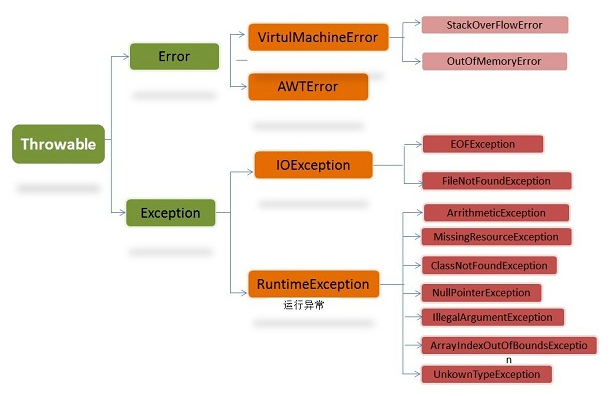

# Java基础知识

## 数据类型

- 8种基本数据类型：

整数型：byte（1字节）、short（2字节）、int（4字节）、long（8字节）

浮点型：float（4字节）、double（8字节）

字符型：char（2字节）

布尔型：boolean（字节数不一定）


- 3种引用数据类型：

类、接口、数组；除了八大基本数据类型之外的类型都是引用数据类型。

## 类型转换

在 Java 中，类型转换规则包括自动类型转换（隐式类型转换）和强制类型转换（显式类型转换）两种方式。

自动类型转换：范围小的转换为范围大的

强制类型转换：范围大的转换为范围小的，可能会导致精度丢失，谨慎使用

规则：

1. 八种基本数据类型中，除了boolean类型不能转换，剩下七种类型之间都可以进行转换
2. 如果整数型字面量没有超过byte、short、char的取值范围，可以直接将其赋值给byte、short、char类型的变量
3. 范围从小到大排序为：byte < short(char) < int < long < float < double，其中short和char都占用两个字节，但是char可以表示更大的正整数。
4. byte、short、char 类型混合运算时，先各自转换成 int 类型再做运算。
5. 多种数据类型混合运算时，各自先转换成容量最大的那一种再做运算。

## 泛型

泛型是一种在编译时期进行类型检查和类型安全的机制，它可以让我们编写更加通用和可复用的代码。

泛型，可以理解为“参数化类型”，把类型当作参数，类型以调用者传入的类型为准。

泛型只在编译阶段有效。

泛型的作用：

1.提供类型检查机制，使类型步一致问题，提前到编译期，使得开发者能更早发现问题

2.使用泛型类、泛型接口、泛型方法，可以编写更加通用的代码，例如：ArrayList

### 举例子

```java
List arrayList = new ArrayList();
arrayList.add("aaaa");
arrayList.add(100);

for(int i = 0; i< arrayList.size();i++){
    String item = (String)arrayList.get(i);
    Log.d("泛型测试","item = " + item);
}
```

毫无疑问会报错：

```java
java.lang.ClassCastException: java.lang.Integer cannot be cast to java.lang.String
```

ArrayList 可以存放任意类型，例子中添加了一个String类型，添加了一个Integer类型，再使用时都以String的方式使用，因此程序崩溃了。为了解决这种由于类型不一致而产生的问题（在编译阶段就可以解决），泛型应运而生。

将第一行声明初始化 list 的代码更改一下，编译器会在编译阶段就能够帮我们发现类似这样的问题。

```java
List<String> arrayList = new ArrayList<String>();
...
//arrayList.add(100); 在编译阶段，编译器就会报错
```

### 泛型类

泛型类型用于类的定义中，被称为泛型类。通过泛型可以完成对一组类的操作对外开放相同的接口。最典型的就是各种容器类，如：List、Set、Map。

模板：

```java
class 类名称 <泛型标识：可以随便写任意标识号，标识指定的泛型的类型>{
  private 泛型标识 /*（成员变量类型）*/ var; 
  .....

  }
}
```

例子：

```java
//此处T可以随便写为任意标识，常见的如T、E、K、V等形式的参数常用于表示泛型
//在实例化泛型类时，必须指定T的具体类型
public class Generic<T>{ 
    //key这个成员变量的类型为T,T的类型由外部指定  
    private T key;

    public Generic(T key) { //泛型构造方法形参key的类型也为T，T的类型由外部指定
        this.key = key;
    }

    public T getKey(){ //泛型方法getKey的返回值类型为T，T的类型由外部指定
        return key;
    }
}
```

```java
//泛型的类型参数只能是类类型（包括自定义类），不能是简单类型
//传入的实参类型需与泛型的类型参数类型相同，即为Integer.
Generic<Integer> genericInteger = new Generic<Integer>(123456);

//传入的实参类型需与泛型的类型参数类型相同，即为String.
Generic<String> genericString = new Generic<String>("key_vlaue");
```

定义的泛型类，就一定要传入泛型类型实参么？并是一定要传入泛型类型的实参，如果不传入泛型类型实参的话，在泛型类中使用泛型的方法或成员变量定义的类型可以为任何的类型。

```java
Generic generic = new Generic("111111");
Generic generic1 = new Generic(4444);
Generic generic2 = new Generic(55.55);
Generic generic3 = new Generic(false);

System.out.println("泛型测试：key is " + generic.getKey());
System.out.println("泛型测试：key is " + generic1.getKey());
System.out.println("泛型测试：key is " + generic2.getKey());
System.out.println("泛型测试：key is " + generic3.getKey());
```

```
泛型测试: key is 111111
泛型测试: key is 4444
泛型测试: key is 55.55
泛型测试: key is false
```

注意：

- 泛型的类型参数只能是类类型，不能是简单类型。
- 不能对确切的泛型类型使用 instanceof 操作。如下面的操作是非法的，编译时会出错。

```java
　if(ex_num instanceof Generic<Number>){ 
  }
```

### 泛型接口

泛型接口与泛型类的定义及使用基本相同。泛型接口常被用在各种类的生产器中，可以看一个例子：

```java
//定义一个泛型接口
public interface Generator<T> {
    public T next();
}
```

当实现泛型接口时，泛型接口未传入泛型实参，实现类的泛型声明要和泛型接口保持一致：

```java
/**
 * 未传入泛型接口的实参时，实现类的泛型声明要和泛型接口保持一致
 * 即：class FruitGenerator<T> implements Generator<T>{
 * 如果不声明泛型，如：class FruitGenerator implements Generator<T>，编译器会报错："Unknown class"
 */
class FruitGenerator<T> implements Generator<T>{
    @Override
    public T next() {
        return null;
    }
}
```

当实现泛型接口时，泛型接口有传入泛型实参，实现类中，所有使用泛型的地方都要替换成传入的实参类型：

```java
/**
 * 传入泛型实参时：
 * 在实现类实现泛型接口时，如已将泛型类型传入实参类型，则所有使用泛型的地方都要替换成传入的实参类型
 * 即：Generator<T>，public T next();中的的T都要替换成传入的String类型。
 */
public class FruitGenerator implements Generator<String> {

    private String[] fruits = new String[]{"Apple", "Banana", "Pear"};

    @Override
    public String next() {
        Random rand = new Random();
        return fruits[rand.nextInt(3)];
    }
}
```

### 泛型方法

泛型类型用于方法的定义中，被称为泛型方法。泛型方法，是在调用方法的时候指明泛型的具体类型 。

```java
/**
 * 泛型方法的基本介绍
 * @param tClass 传入的泛型实参
 * @return T 返回值为T类型
 * 说明：
 *     1）public 与 返回值中间<T>非常重要，可以理解为声明此方法为泛型方法。
 *     2）只有声明了<T>的方法才是泛型方法，泛型类中的使用了泛型的成员方法并不是泛型方法。
 *     3）<T>表明该方法将使用泛型类型T，此时才可以在方法中使用泛型类型T。
 *     4）与泛型类的定义一样，此处T可以随便写为任意标识，常见的如T、E、K、V等形式的参数常用于表示泛型。
 */
public <T> T genericMethod(Class<T> tClass)throws InstantiationException ,
  IllegalAccessException{
        T instance = tClass.newInstance();
        return instance;
}
```

例子：

```java
public class GenericTest {
    
   //这个类是个泛型类，在上面已经介绍过
   public class Generic<T>{     
        private T key;

        public Generic(T key) {
            this.key = key;
        }

        //虽然在方法中使用了泛型，但是这并不是一个泛型方法。
        //这只是类中一个普通的成员方法，只不过他的返回值是在声明泛型类已经声明过的泛型。
        public T getKey(){
            return key;
        }
    }

    /** 
     * 这才是一个真正的泛型方法。
     * 首先在public与返回值之间的<T>必不可少，这表明这是一个泛型方法，并且声明了一个泛型T
     * 这个T可以出现在这个泛型方法的任意位置
     * 泛型的数量也可以为任意多个 
     *    如：public <T,K> K showKeyName(Generic<T> container){
     *        ...
     *        }
     */
    public <T> T showKeyName(Generic<T> container){
        System.out.println("container key :" + container.getKey());
        T key = container.getKey();
        return key;
    }

    //这也不是一个泛型方法，这就是一个普通的方法，只是使用了Generic<Number>这个泛型类做形参而已。
    public void showKeyValue1(Generic<Number> obj){
        Log.d("泛型测试","key value is " + obj.getKey());
    }
}
```

```java
public class GenericFruit {
    class Fruit{
        @Override
        public String toString() {
            return "fruit";
        }
    }

    class Apple extends Fruit{
        @Override
        public String toString() {
            return "apple";
        }
    }

    class Person{
        @Override
        public String toString() {
            return "Person";
        }
    }

    class GenerateTest<T>{
        public void show_1(T t){
            System.out.println(t.toString());
        }

        // 泛型类的泛型作用域是整个类，泛型方法的泛型作用域是所在的方法，注意泛型的标识不要重复
        // 如果标识符和泛型类的标识T重复，在方法中以方法声明的为准，虽然不会报错，但是不推荐重复
        public <E> void show_3(E t){
            System.out.println(t.toString());
        }
    }

    public static void main(String[] args) {
        Apple apple = new Apple();
        Person person = new Person();

        GenerateTest<Fruit> generateTest = new GenerateTest<Fruit>();
        //apple是Fruit的子类，所以这里可以
        generateTest.show_1(apple);
        //编译器会报错，因为泛型类型实参指定的是Fruit，而传入的实参类是Person
        //generateTest.show_1(person);

        //使用这两个方法都可以成功
        generateTest.show_2(apple);
        generateTest.show_2(person);

        //使用这两个方法也都可以成功
        generateTest.show_3(apple);
        generateTest.show_3(person);
    }
}
```

泛型方法结合可变参数的例子：

```java
public <T> void printMsg( T... args){
    for(T t : args){
        System.out.println("泛型测试：t is " + t);
    }
}
```

#### 静态方法与泛型

静态方法无法访问类上定义的泛型，所以静态方法要使用泛型的话，必须将静态方法定义成泛型方法 。

```java
public class StaticGenerator<T> {
    ....
    ....
    /**
     * 静态方法不能使用泛型类中已经声明过的泛型
     * 如：public static void show(T t){..},此时编译器会提示错误信息：
          "StaticGenerator cannot be refrenced from static context"
     */
    public static <T> void show(T t){

    }
}
```

### 泛型通配符

`Ingeter`是`Number`的一个子类，那么问题来了，在使用`Generic<Number>`作为形参的方法中，能否使用`Generic<Ingeter>`的实例传入呢？在逻辑上类似于`Generic<Number>`和`Generic<Ingeter>`是否可以看成具有父子关系的泛型类型呢？

为了弄清楚这个问题，使用`Generic<T>`这个泛型类继续看下面的例子：

```java
public void showKeyValue1(Generic<Number> obj){
    System.out.println("泛型测试：key value is " + obj.getKey());
}
```

```java
Generic<Integer> gInteger = new Generic<Integer>(123);
Generic<Number> gNumber = new Generic<Number>(456);

showKeyValue(gNumber);

// showKeyValue这个方法编译器会为我们报错：Generic<java.lang.Integer> 
// cannot be applied to Generic<java.lang.Number>
// showKeyValue(gInteger);
```

通过提示信息我们可以看到`Generic<Integer>`不能被看作为`Generic<Number>`的子类，是不同的类型参数，不能兼容。

回到上面的例子，如何解决上面的问题？总不能为了定义一个新的方法来处理`Generic<Integer>`类型的类，这样会冗余代码，需要一种方式来兼容`Generic<Integer>`和`Generic<Number>`，因此类型通配符应运而生。

可以将上面的方法改一下：

```java
public void showKeyValue1(Generic<?> obj){
   System.out.println("泛型测试：key value is " + obj.getKey());
}
```

类型通配符一般是使用“？”，表示未知类型，表示可以传入任意类型。

####  泛型上下边界

在使用泛型的时候，我们还可以为传入的泛型类型实参进行上下边界的限制，如：类型实参只准传入某种类型的父类或某种类型的子类。

为泛型添加上边界，即传入的类型必须是指定的类型及其子类：

```java
public void showKeyValue1(Generic<? extends Number> obj){
   System.out.println("泛型测试","key value is " + obj.getKey());
}
```

```java
Generic<String> generic1 = new Generic<String>("11111");
Generic<Integer> generic2 = new Generic<Integer>(2222);
Generic<Float> generic3 = new Generic<Float>(2.4f);
Generic<Double> generic4 = new Generic<Double>(2.56);

//这一行代码编译器会提示错误，因为String类型并不是Number类型的子类
//showKeyValue1(generic1);

showKeyValue1(generic2);
showKeyValue1(generic3);
showKeyValue1(generic4);
```

如果把泛型类的定义也改一下:

```java
public class Generic<T extends Number>{
    private T key;

    public Generic(T key) {
        this.key = key;
    }

    public T getKey(){
        return key;
    }
}
```

```java
//这一行代码也会报错，因为String不是Number的子类
Generic<String> generic1 = new Generic<String>("11111");
```

为泛型添加下边界用 super：

````java
public <T super Integer> void process(List<T> list) {
    // 在这里 T 必须是 Integer 类型或其父类型
}
````

必须在泛型声明时添加上下边界：

```java
//public <T> T showKeyName(Generic<T extends Number> container)，编译器会报错："Unexpected bound"
public <T extends Number> T showKeyName(Generic<T> container){
    System.out.println("container key :" + container.getKey());
    T test = container.getKey();
    return test;
}
```

## 面向对象

面向对象是一种编程思想，面向对象的三大基本特征是封装、继承、多态。

面向对象的编程思想就是把事物看作一个整体，从事物的特征（属性）和行为（方法）两个方面进行描述。

面向对象的过程就是找对象、建立对象、使用对象、维护对象的关系的过程。

### 抽象

所谓的抽象，就是把同一类事物中共有的特征(属性)和行为(功能、方法)进行抽取，归纳，总结。

抽象的过程其实就是面向对象编程的核心思想

### 封装

在 Java 中，封装是指将数据（属性）和相关方法隐藏在一个类中，对外部提供公共的接口来访问和操作这些数据。

封装的主要目的是隐藏内部实现细节，通过定义访问修饰符（如 private、public、protected）来控制对数据的访问权限，以保证数据的安全性和一致性。

封装的作用：

- 提高代码的可维护性和可扩展性。
- 隐藏内部细节，保护数据的安全性。
- 提供统一的接口来操作数据，减少错误和提高代码的可读性。
- 可以对数据进行控制和校验，确保数据的有效性。

封装的例子：

1.通过访问限制符修改类中属性的可见性，从而限制对类中属性的访问。

```java
 public class Person {
    private String name;
    private int age;
}
```

这段代码中，将 name 和 age 属性设置为私有的，只能本类才能访问，其他类都访问不了，如此就对信息进行了隐藏。

2.对每个值属性提供对外访问的公共方法，说白了也就是创建一对赋值取值的方法，来提供外部程序对类中的私有属性进行访问。

```java
public class Person {
    private String name;
    private int age;
     
    public void setage(int age){
     this.age = age;
	}
	public int getage(){
     return age;
	}
	public void setname(String name){
     this.name = name;
	}
	public String getname(){
     return name;
	}
}
```

### 继承

在 Java 中，继承（Inheritance）是面向对象编程的一个重要概念，它允许一个类（称为子类或派生类）继承另一个类（称为父类或基类）的属性和方法。通过继承，子类可以重用父类的代码，并且可以扩展或修改父类的功能。

Java 中的继承使用关键字 `extends` 来实现，子类通过继承父类来获取其非私有成员（属性和方法），包括公共（public）、受保护（protected）和默认（无修饰符）访问级别的成员。

继承的特点：

- 子类可以继承父类的非私有成员（属性和方法）。
- 子类可以重写（Override）父类的方法，以实现自己的特定行为。
- 子类可以添加新的成员（属性和方法）。
- 子类可以通过 `super` 关键字调用父类的构造方法和方法。
- 子类只能继承一个父类

子类访问父类：

- 子类可以访问父类的公共（public）和受保护（protected）成员。
- 如果父类成员使用默认（无修饰符）访问级别，则子类必须在同一包内才能访问。
- 子类不能直接访问父类的私有（private）成员，但可以通过父类的公共或受保护方法间接访问。

`super` 关键字：

- `super` 关键字用于引用父类的成员，包括属性、方法和构造方法。
- 可以使用 `super()` 调用父类的构造方法。
- 在方法中使用 `super.methodName()` 调用父类的方法。

继承的作用：

1. 代码重用：继承允许子类继承父类的属性和方法，这样可以避免重复编写相同的代码。子类可以直接使用父类已经定义好的功能，从而提高代码的复用性和可维护性。
2. 扩展性：通过继承，我们可以在已有的类基础上创建新的类，将新的功能添加到子类中。子类可以在父类的基础上进行修改和扩展，以满足特定需求，而不需要修改原始的父类代码。这种扩展性使得程序更加灵活和可扩展。
3. 多态性：继承是实现多态性的基础。通过多态性，我们可以使用父类类型的引用来引用子类对象，从而实现对不同子类对象的统一处理。这样可以提高代码的灵活性和可扩展性，并且使得代码更容易理解和维护。
4. 方法重写：子类可以重写（Override）父类的方法，以适应子类自身的特定需求。通过方法重写，子类可以改变继承自父类的方法的行为，实现多态性和个性化的定制。

使用模板：

```java
public class 子类名称 extends 父类名称{
    //... 
}
```

例子：

父类: Employee.java

```java
//定义一个父类:员工
public class Employee {
    public void method(){
        System.out.println("方法已执行!");
    }
}
```

子类 :Assistant.java

```java
//定义一个子类:助教
public class Assistant extends Employee {  //助教类继承了员工类
}
```

继承中成员变量的访问特点：

在父子类的继承关系当中，如果成员变量重名，则创建子类对象时，访问有两种方式：

1.直接通过子类对象访问成员变量：等号左边是谁，就优先用谁，没有则向上找

2.间接通过成员方法访问成员变量：该方法属于谁，就优先用谁，没有则向上找

```java
public class Fu {
    int numFu = 20;
    int num = 200;

    public void fuMethod(){
        System.out.println(num);
    }
}
```

```java
public class Zi extends Fu {
    int numZi = 30;
    int num = 300;
    public void ziMethod(){
        System.out.println(num);
    }
}
```

```java
/*
      在父子类的继承关系当中,如果成员变量重名,则创建子类对象时,访问有两种方式
      　　1.直接通过子类对象访问成员变量
              等号左边是谁,就优先用谁,没有则向上找
         2.间接通过成员方法访问成员变量
         　　　该方法属于谁,就优先用谁,没有则向上找.
 */
public class Demo2ExtendsField {
    public static void main(String[] args) {
        //创建父类对象
        Fu fu=new Fu();
        System.out.println(fu.numFu);    //只能使用父类的东西,没有任何子类内容,20
        System.out.println("==================");
        //创建子类对象
        Zi zi=new Zi();
        System.out.println(zi.numZi);    //30
        //等号左边是谁,就优先用谁,没有则向上找
        System.out.println(zi.num);      //300
        System.out.println(fu.num);      //200
//        System.out.println(zi.abc);      //这个abc子类没有,父类也没有,会编译报错

        //这个方法是子类的,优先用子类的,没有再向上找
        zi.ziMethod();
        //这个方法是在父类当中定义的
        fu.fuMethod();
    }
}
```

继承后变量重名解决：

1.本类的成员变量： this.成员变量名

2.父类的成员变量：super.成员变量名

```java
public class Fu {
    int num = 10;   //父类中成员变量
}
```

```java
public class Zi extends Fu{
    int num = 20;
    public void method(){
        int num = 30;
        System.out.println(num);        //访问局部变量
        System.out.println(this.num);   //访问本类的成员变量
        System.out.println(super.num);  //访问父类的成员变量
    }
}
```

方法的重写：

在继承关系当中，子类重写在父类中方法的名称一样，参数列表也一样的方法

特点：创建的是子类对象，则优先用子类对象

方法覆盖重写的注意事项：

　　1.必须保证父子类之间方法的名称相同，参数列表也相同。@Override：写在方法前面，用来检测是不是有效的正确覆盖重写，这个注释不写只要满足要求也是正确的，最好写因为可以提醒自己

　　 2.子类方法的返回值必须小于等于父类方法的返回值范围

　　 3.子类方法的权限必须大于等于父类方法的权限修饰符，public > protected > (default) > private 

继承中构造方法的访问特点：

继承关系中，父子类构造方法的访问特点:

1.子类构造方法当中有一个默认隐含的"super()"调用，所以一定是先调用的父类构造，后执行的子类构造，不写会自动添加

2.子类构造可以通过super关键字来调用父类重载构造

3.super的父类构造调用，必须是子类构造方法的第一个语句；不能一个子类构造调用多次super构造

总结: 子类必须调用父类构造方法，不写则自动添加；写了则用写的指定的super调用，super只能有一个，还必须是第一个

```java
public class Fu {
    public  Fu(){
        System.out.println("父类无参的构造方法");
    }
    public  Fu(int num){
        System.out.println("父类有参的构造方法");
    }
}

//Zi.java 子类
package Basis.Demo7Extends.Demo5;
public class Zi extends Fu {
    public  Zi(){
        super(10);
//      super();  错误写法
        System.out.println("子类的构造方法");
//      super();  必须是第一个
    }
}
```

```java
public class Demo1Constructor {
    public static void main(String[] args) {
        Zi zi=new Zi();
    }
}
```

```java
//输出结果
父类有参的构造方法
子类的构造方法
```

子父类的执行顺序：

父类的静态方法、子类的静态方法、父类的代码块、父类的构造方法、子类的代码块、子类的构造方法

重点：

1.先静态

2.先父类：代码块、构造方法

3.先代码块，然后是构造方法

### 多态

Java 多态是面向对象编程的一个重要概念，它允许使用父类类型的引用来引用子类对象，从而实现对不同子类对象的统一处理。多态性有助于提高代码的灵活性、可扩展性和可维护性。

多态性的核心思想是，一个对象可以表现出多种形态。具体来说，在Java中实现多态性的方式是通过继承和方法重写。

当一个父类引用指向一个子类对象时，可以根据引用的类型调用相应的方法。这意味着，通过父类的引用，可以调用子类重写的方法，而不需要知道具体的子类类型。

多态的作用：

1. 统一接口：多态性允许使用父类类型的引用来引用子类对象，从而实现对不同子类对象的统一处理。通过定义统一的接口（父类），可以使得代码更加简洁和可读，同时可以降低代码的耦合度。
2. 代码复用：通过多态性，可以将公共的代码逻辑封装在父类中，避免在每个子类中重复编写相同的代码。这样可以提高代码的可维护性和可复用性。
3. 可扩展性：当需要添加新的子类时，不需要修改现有的代码，只需要添加新的子类并保证其符合父类接口即可。这样可以降低代码的修改成本，增加系统的可扩展性。
4. 运行时确定方法调用：多态性允许在运行时根据对象的实际类型（而不是引用类型）确定调用哪个方法。这样可以实现动态绑定，提高代码的灵活性和可扩展性。
5. 多态参数和返回类型：通过多态性，可以将子类对象作为参数传递给接受父类类型参数的方法，或者将子类对象作为父类类型返回。这样可以增加代码的灵活性和可复用性。

多态的例子：

````java
public class Animal {
    public String name = "animal";

    public void eat() {
        System.out.println("动物吃东西！");
    }

    public void run() {
        System.out.println("动物在奔跑！");
    }
}

public class Tiger extends Animal {
    public String name = "tiger";

    @Override
    public void eat() {
        System.out.println("虎吃鸡！");
    }
    
    @Override
    public void run() {
		System.out.println("虎奔跑！");
	}
}

public class Snake extends Animal {
    public String name = "snake";
    
    @Override
    public void eat() {
        System.out.println("蛇吃鼠！");
    }

	@Override
    public void run() {
		System.out.println("蛇爬行！");
	}
}
````

 ````java
 1.多态成员变量：编译检查的时候检查Animal类中是否有此变量定义
 		Animal tiger = new Tiger(); 
 
 		System.out.println("name = " + tiger.name);
 
 	上述打印输出结果为： name = Animal
 
 2.使用多态调用成员方法：编译时检查左边类型，运行时实际调用右边对象
 
     	Animal snake = new Snake();
 
     	System.out.println(sanke.eat()); 
     	
  实际类型是Snake, 所以运行时调用的是Snake中重写后的方法。打印输出结果为： 蛇吃鼠！
 
 ````

**多态的特性：**

成员方法：编译看左边，运行看右边

成员变量：编译运行都看左边

静态方法：编译运行都看左边

子类的同名的类变量、静态方法、静态变量不会覆盖父类，编译和运行时都是以父类（左边）为准；只有成员方法会特别一点，编译时看父类（左边）有没有这个方法，然后运行时调用子类（右边）的方法。

## 控制结构

控制结构分为顺序结构、选择结构、循环结构

### 顺序结构

顺序结构是最简单最基础得结构，按照代码出现的先后顺序执行就是顺序结构


### 选择结构

#### if语句

```java
// 考试奖励：键盘录入一个整数，表示小明的考试名次，如果名次为1，小红可以当小明的女友了。
Scanner sc = new Scanner(System.in);
System.out.println("输入小明的名次");
int rank = sc.nextInt();
if (rank == 1){
    System.out.println("小红可以当女朋友");
}
```

```java
// 影院选座：某影院售卖了100张票，票的序号为1~100，奇数坐左边，偶数坐右边
Scanner sc = new Scanner(System.in);
System.out.println("请输入票号：");
int ticker = sc.nextInt();
if (ticker > 100 || ticker < 1) {
    System.out.println("票不合法");
} else {
    if (ticker % 2 != 0){
        System.out.println("坐左边");
    }else {
        System.out.println("坐右边");
    }
}
```

```java
// 考试奖励：
// 95~100 自行车一辆
// 90~94   游乐场玩一天
// 80 ~ 89 变形金刚一个
// 80 以下  胖揍一顿
Scanner sc = new Scanner(System.in);
System.out.println("请输入分数：");
int score = sc.nextInt();
if (score < 0 || score > 100){
    System.out.println("分数不合法");
}else {
    if (score >= 95){
        System.out.println("奖励自行车");
    }else if (score >= 90){
        System.out.println("游乐场玩一天");
    }else if (score >= 80){
        System.out.println("变形金刚一个");
    }else {
        System.out.println("揍一顿");
    }
}
```

#### switch语句

```java
switch (表达式) {
	case 1:
		语句体1;
		break;
	case 2:
		语句体2;
		break;
	...
	default:
		语句体n+1;
		break;
}
```

- 首先计算出表达式的值 
- 其次，和 case 依次比较，一旦有对应的值，就会执行相应的语句，在执行的过程中，遇到 break 才会结束，不然会一直执行下去。 
- 最后，如果所有的 case 都和表达式的值不匹配，就会执行 default 语句体部分，然后程序结束掉。
- 当其他的 case 都匹配不上时才会执行 default，default 可以放在任意位置（即使是放在第一位也是其他没匹配上才匹配这个），也可以省略，可以把default 理解成一个特殊的 case，因为没有跟 break 也会发生 case 穿透

练习：

```java
// 运动计划：键盘录入星期数，显示今天的减肥活动。
// 周一：跑步
// 周二：游泳
// 周三：慢走
// 周四：动感单车
// 周五：拳击
// 周六：爬山
// 周日：好好吃一顿
Scanner sc = new Scanner(System.in);
System.out.println("请输入星期数：");
int week = sc.nextInt();
switch (week) {
    case 1:
        System.out.println("跑步");
        break;
    case 2:
        System.out.println("游泳");
        break;
    case 3:
        System.out.println("慢走");
        break;
    case 4:
        System.out.println("动感单车");
        break;
    case 5:
        System.out.println("拳击");
        break;
    case 6:
        System.out.println("爬山");
        break;
    case 7:
        System.out.println("好好吃一顿");
        break;
    default:
        System.out.println("日期不合法，没有这个日期");
        break;
}
```

写switch语句技巧：先写第一个case，然后复制多个case，然后再写第一个case的内容，然后复制给多个 case

利用 case 穿透：

休息日和工作日：(1-5) 工作日，(6-7) 休息日

```java
        Scanner sc = new Scanner(System.in);
        System.out.println("请输入日期：");
        int day = sc.nextInt();
        switch (day){
            case 1:
            case 2:
            case 3:
            case 4:
            case 5:
                System.out.println("工作日");
                break;
            case 6:
            case 7:
                System.out.println("休息日");
                break;
            default:
                System.out.println("日期不合法");
                break;
        }
```

#### 使用场景

表示范围用 if

数据的个数有限可以列举，则用 switch

### 循环结构

#### for语句

```java
for (初始化语句;条件判断语句;条件控制语句) {
	循环体语句;
}
```

- 初始语句：初始状态
- 条件判断语句：每次循环前要判断的条件，符合条件才循环，不符合直接结束
- 条件控制语句：每次循环后要执行的语句
- 循环体语句：每次循环中要执行的代码

求偶数和：求1-100之间的偶数和，并把求和结果在控制台输出

```java
int sum = 0;
for (int i = 1; i <= 100; i++) {
    if (i % 2 == 0) {
        sum = sum + i;
    }
}
System.out.println("100以内偶数和：" + sum);
```

#### while语句

```java
初始化语句;
while(条件判断语句){
	循环体;
	条件控制语句;
}
```

和for的不同是初始语句在外面，条件控制语句写在花括号里

```java
		// 珠穆朗玛峰：纸需要折叠几次才到达山的高度
		int height = 888444555;
        int count = 0;
        double paper = 0.1;
        while (paper <= height) {
            paper = paper * 2;
            count++;
        }
        System.out.println("需要折叠的次数为：" + count);
```

#### do...while语句

```java
初始化语句;
do{
    循环体;
    条件控制语句;
}while(条件判断语句);
```

和while循环的区别是，do...while先执行一次循环在判断是否符合条件

```java
        // 1-100 求和
        int sum = 0;
        int num = 1;
        do {
            sum = sum + num;
            num++;
        } while (num <= 100);
        System.out.println("1-100的和为：" + sum);
```

#### 使用场景

当知道**循环次数**或**循环范围**的时候用 for

当知道不知道循环次数或范围，只知道**结束条件**的时候用 while

#### 条件控制语句

break：不能单独存在，可以用在switch或循环中，作用是结束循环，或结束switch

continue：不能单独存在，只能用在循环中，作用是跳过本次循环，开启下一次循环

```java
// 吃包子：1-5个包子，吃到第三个包子时停止
for (int i = 1; i <= 5; i++) {
    System.out.println("正在吃第" + i + "个包子");
    if (i == 3) {
        System.out.println("不吃了");
        break;
    }
}
```

```java
// 吃包子：1-5个包子，第三个包子有虫不吃第三个
for (int i = 1; i <= 5; i++) {
    if (i == 3) {
        System.out.println("第三个包子有虫不吃");
        continue;
    }
    System.out.println("正在吃第" + i + "个包子");
}
```

#### 练习题

逢7过:
游戏规则：从任意一个数字开始报数，当你要报的数字是包含7或者是7的倍数时都要说过：过
需求：使用程序在控制台打印出1-100之间的满足逢七必过规则的数据

分析：包含7：个位是7，10位是7; %10获得个位，/10去掉个位
			7的倍数：模以7等于0

```java
for (int i = 1; i <= 100; i++) {
    if (i % 10 == 7 || i / 10 % 10 == 7 || i % 7 == 0) {
        System.out.print("过 ");
        continue;
    }
    System.out.print(i + " ");
}

```

求平方根：键盘录入一个大于等于2的整数 x ，计算并返回 x 的 平方根 。结果只保留整数部分 ，小数部分将被舍去

```java
Scanner sc = new Scanner(System.in);
System.out.println("请输入数字");
int x = sc.nextInt();
if (x < 2) {
    System.out.println("数字不合法");
}
for (int i = 1; i <= x; i++) {
    if (i * i == x) {
        System.out.println("平方根是" + i);
        break;
    } else if (i * i > x) {
        System.out.println("平方根是" + (i - 1));
        break;
    }
}
```

判断是否为质数：键盘录入一个正整数 x ，判断该整数是否为一个质数。
分析：如果在2 到 x - 1之间有数可以整除x，则x就是质数

```java
Scanner sc = new Scanner(System.in);
System.out.println("请输入整数：");
int x = sc.nextInt();
// 默认为true，表示是质数
boolean flag = true; 
for (int i = 2; i < x - 1; i++) {
    // 能被其中一个数整除则不是质数
    if (x % i == 0){
        flag = false;
        break;
    }
}
if (flag){
    System.out.println("是质数");
}else {
    System.out.println("不是质数");
}
```

## 异常

### 概述

Java异常是指在程序运行时可能出现的一些错误，如：文件找不到、网络连接失败、非法参数等。异常是一个事件，它发生在程序运行期间，中断了正在执行的程序的正常指令流。Java通过API中Throwable类的众多子类描述各种不同的异常。因而，Java异常都是对象，是Throwable子类的实例，描述了出现在一段编码中的错误条件。当条件生成时，错误将引发异常。
Java异常类的层次结构图：



**Throwable**：所有的异常都是从Throwable继承而来的，是所有所有错误与异常的超类。Throwable包含了其线程创建时线程执行堆栈的快照，它提供了 printStackTrace()等接口用于获取堆栈跟踪数据等信息。而Throwable体系下包含有两个子类，Error（错误）和Exception（异常），它们通常用于指示发生了异常情况。

**Error**：Error类及其子类。程序中无法处理的错误，表示运行应用程序中出现了严重的错误。大多数错误与代码编写者执行的操作无关，而是表示代码运行时 JVM出现的问题。

**Exception**：Exception 是另外一个非常重要的异常子类。程序本身可以捕获并且可以处理异常。这类异常一旦出现，我们就要对代码进行更正，修复程序。Exception这种异常又分为两类：运行时异常和编译时异常。 

**运行时异常**：RuntimeException 类及其子类异常，如NullPointerException （空指针异常）、IndexOutOfBoundsException （下目标越界异常）等，表示 JVM在运行期间可能出现的异常。

运行时异常的特点：Java编译器不会检查它，也就是说，当程序中出现这类异常时，也会编译通过。        

**非运行时异常 （编译异常）**：Exception中除 RuntimeException 及其子类之外的异常。

**受检异常**：编译器要求必须处理得异常，Exception中除 RuntimeException 及其子类之外的异常，也就是**非运行时期异常，属于受检异常。**

**非受检异常**：编译器不会进行检查并且不要求必须处理的异常，包括运行时异常（RuntimeException 及其子类）和错误（ Error），RuntimeException 发生的时候，表示程序中出现了编程错误，所以应该找出错误修改程序，而不是去捕获RuntimeException 。

### 异常处理机制

#### 抛出异常 throw

什么时候使用呢？

1. 比如，在定义方法时，方法需要接受参数。那么，当调用方法使用接受到的参数时，首先需要先对参数数据进行合法的判断，数据若不合法，就应该告诉调用者，传递合法的数据进来。这时需要使用抛出异常的方式来告诉调用者。
2. 或者当你觉得解决不了某些异常问题，且不需要调用者处理，那么你也可以抛出异常。

如何抛出一个异常呢？

​	用 throw 抛出一个异常对象。

**定义格式：**

```java
throw new 异常类名(参数);
```

```java
public class ThrowDemo {
    public static void main(String[] args) {
        //创建一个数组
        int[] arr = {2,4,52,2};
        //根据索引找对应的元素
        int index = 4;
        int element = getElement(arr, index);
        System.out.println(element);
        System.out.println("over");
    }
    /*
     * 根据 索引找到数组中对应的元素
     */
    public static int getElement(int[] arr,int index){
        //判断索引是否越界
        if(index<0 || index>arr.length-1){
             /*
                判断条件如果满足，当执行完throw抛出异常对象后，方法已经无法继续运算。
                这时就会结束当前方法的执行，并将异常告知给调用者。这时就需要通过异常来解决。
              */
            throw new ArrayIndexOutOfBoundsException("你的索引越界了");
        }
        int element = arr[index];
        return element;
    }
}
```

```text
Exception in thread "main" java.lang.ArrayIndexOutOfBoundsException: 你的索引越界了
	at com.it.test2.ThrowDemo.getElement(ThrowDemo.java:25)
	at com.it.test2.ThrowDemo.main(ThrowDemo.java:10)
```

所以如果产生了问题，我们就会throw将问题描述类即异常进行抛出，也就是将问题返回给该方法的调用者。结果是ArrayIndexOutOfBoundsException 的数组索引越界的问题。

那么对于调用者来说，该怎么处理呢？一种是进行捕获处理，另一种是声明异常，使用throws声明处理。

#### 声明异常 throws

如果一个方法可能会出现异常，但没有能力处理这种异常，可以在方法声明处用throws子句来声明抛出异常。例如汽车在运行时它可能会出现故障，汽车本身没办法处理这个故障，那就让开车的人来处理。

**声明异常**：将问题标识出来，报告给调用者。如果方法内通过throw抛出了编译时异常，而没有捕获处理，那么必须通过throws进行声明，让调用者去处理。

**定义格式**： throws语句用在方法定义时声明该方法要抛出的异常类型，如果抛出的是Exception异常类型，则该方法被声明为抛出所有的异常。多个异常可使用逗号分割。

```text
修饰符 返回值类型 方法名(参数) throws 异常类名1,异常类名2…{   }
```

**注意**：当方法抛出异常列表的异常时，方法将不对这些类型及其子类类型的异常作处理，而抛向调用该方法的方法，由他去处理。使用throws关键字将异常抛给调用者后，如果调用者不想处理该异常，可以继续向上抛出，但最终要有能够处理该异常的调用者。比如汽车坏了，开车的人也不会修理，只能叫修车公司来修理了

```java
public class ThrowsDemo {
    public static void main(String[] args) throws FileNotFoundException {
        readFile("a.txt");
    }
    // 如果定义功能时有问题发生需要报告给调用者。可以通过在方法上使用throws关键字进行声明
    public static void readFile(String path) throws FileNotFoundException {
        if(!path.equals("a.txt")) {//如果不是 a.txt这个文件
            // 我假设  如果不是 a.txt 认为 该文件不存在 是一个错误 也就是异常  throw
            throw new FileNotFoundException("文件不存在");
        }
    }
}
```

而throws用于进行异常类的声明，若该方法可能有多种异常情况产生，那么在throws后面可以写多个异常类，用逗号隔开。

```java
public class ThrowsDemo2 {
    public static void main(String[] args) throws IOException {
        readFile("a.txt");
    }
    //若该方法可能有多种异常情况产生，那么在throws后面可以写多个异常类，用逗号隔开
    //若有异常a是异常b的子类，也可以直接省略，写b异常
    private static void readFile(String path) throws FileNotFoundException, IOException {
        if (!path.equals("a.txt")) {//如果不是 a.txt这个文件
            // 我假设  如果不是 a.txt 认为 该文件不存在 是一个错误 也就是异常  throw
            throw new FileNotFoundException("文件不存在");
        }
        if (!path.equals("b.txt")) {
            throw new IOException();
        }
    }
}
```

throws 抛出异常的规则：

1. 如果是非受检异常（unchecked exception），即Error、RuntimeException或它们的子类，那么可以不使用throws关键字来声明要抛出的异常，编译仍能顺利通过，但在运行时会被系统抛出。
2. 如果一个方法可能出现受检异常（checked exception），要么用try-catch语句捕获，要么用throws子句声明将它抛出，否则会导致编译错误。
3. 只有当抛出了异常时，该方法的调用者才必须处理或者重新抛出该异常。若当方法的调用者无力处理该异常的时候，应该继续抛出。

#### 捕获异常try 、finally 、catch

这三个关键字主要有下面几种组合方式try-catch 、try-finally、try-catch-finally。

**注意**：catch语句可以有一个或者多个或者没有，finally至多有一个，try必要有。

try，catch，finally不能单独使用出现。

try-catch-finally 形式：

```java
try {  
	// 可能会发生异常的程序代码，若发生了异常，则try中剩余的代码不会执行，跳转到catch  
} catch (异常类型A  e){  
	// 捕获并处置try抛出的异常类型A，若有finally则接下来执行finally中的代码，若无就执行下面的代码
} finally {  
	// 无论是否发生异常，都将执行的语句块  
}
```

不管执行情况如何，都会走 finally 中的代码，一般会在finally中释放资源。

注意：try-catch-finally中，如果catch中 return了，finally还会执行吗？

```java
public class TryCatchFinallyDemo2 {
    public static void main(String[] args) {
        test();
    }
    public static void test() {
        int a = 10;
        try{
            System.out.println(a / 0);
        }catch(ArithmeticException e) {
            e.printStackTrace();
            return ;
        }finally {
            System.out.println("finally");
        }
    }
}
```

运行结果：

```text
java.lang.ArithmeticException: / by zero
	at com.it.test3.TryCatchFinallyDemo2.test(TryCatchFinallyDemo2.java:11)
	at com.it.test3.TryCatchFinallyDemo2.main(TryCatchFinallyDemo2.java:5)
finally
```

可以看到，就算catch中 return了，finally也会执行。

那 finally 是在 return 前呢，还是 return 后呢？

```java
public class TryCatchFinallyDemo2 {
    public static void main(String[] args) {
//        dome();
        System.out.println(test2()); // 我有执行到吗 try
        System.out.println(test3()); // 我有执行到吗 catch
    }

    public static String test2() {
        String str = "";
        try {
            str = "try";
            return str;
        }catch(Exception e) {
            str = "catch";
            return str;
        }finally {
            str = "finally";
            System.out.println("我有执行到吗");
        }
    }
    public static String test3() {
        String str = "";
        try {
            str = "try";
            System.out.println(10 / 0);
            return str;
        }catch(Exception e) {
            str = "catch";
            return str;
        }finally {
            str = "finally";
            System.out.println("我有执行到吗");
        }
    }
}
```

运行结果：

```text
我有执行到吗
try
我有执行到吗
catch
```

finally 是在 return 之前执行，但是在 return 返回的是 try 或 catch 的变量，不会 return 在 finally 中改变的数值。

## 数组

在 Java 中，数组是一种用于存储同一类型数据的数据结构。数组提供了一种便捷的方式来存储和访问多个相同类型的元素。

初始化：

数组的静态初始化：int[] arr = new int[]{1,2,3};   简化写法：int[] arr = {1,2,3}；

数组的动态初始化：int[] arr = new int[3];

动态初始化会有默认值：

​	整数类型：0

​	小数类型：0.0

​	布尔类型：false

​	字符类型：'\u0000'

​	引用类型：null

使用场景：

只知道元素的个数，不知道具体的数值，使用动态初始化

知道具体的数值，使用静态初始化

地址值：

```java
int[] arr = new int[10];
System.out.println(arr);//[D@568db2f2
```

arr 保存的是数组的地址，访问元素要结合下标


数组常见操作：

访问和修改：

````java
int[] arr = {10, 20, 30, 40, 50};
int element = arr[2]; // 访问数组第三个元素（索引为 2）
arr[3] = 100; // 修改数组中的第四个元素
````

遍历：

````java
int[] arr = {1, 2, 3, 4, 5};
for (int i = 0; i < arr.length; i++) {
    System.out.println(arr[i]);
}

// 使用增强型 for 循环
for (int num : arr) {
    System.out.println(num);
}
````

排序：

````java
int[] arr = {3, 1, 4, 1, 5, 9, 2, 6};
Arrays.sort(arr); // 对数组进行升序排序
````

查找某个元素的索引：

````java
int[] arr = {1, 2, 3, 4, 5};
int index = Arrays.binarySearch(arr, 3); // 在已排序的数组中查找元素 3 的索引
````

拷贝：

````java
int[] source = {1, 2, 3, 4, 5};
int[] target1 = Arrays.copyOf(source, source.length); // 使用 Arrays.copyOf() 进行数组拷贝

int[] target2 = new int[source.length];
System.arraycopy(source, 0, target2, 0, source.length); // 使用 System.arraycopy() 进行数组拷贝
````

数组转字符串：

````java
int[] arr = {1, 2, 3, 4, 5};
String arrString = Arrays.toString(arr); // 将数组转换成字符串
System.out.println(arrString); // 输出数组内容
````

### 练习

```java
// 数组求和
int[] arr = {1, 2, 3, 4, 5};
int sum = 0;
for (int j : arr) {
    sum = sum + j;
}
System.out.println("数组求和的值是：" + sum);
```

```java
// 数组存储1,2,3,4,5,6,7,8,9,10，遍历数组得到每一个元素，统计数组里面一共有多少个能被3整除的数字
int[] arr = {1, 2, 3, 4, 5, 6, 7, 8, 9, 10};
for (int i : arr) {
    if (i % 3 == 0) {
        System.out.println(i + "能被3整除");
    }
}
```

```java
// 存储1,2,3,4,5,6,7,8,9,10
// 如果是奇数，则将当前数字扩大两倍
// 如果是偶数，则将当前数字变成二分之一
int[] arr = {1, 2, 3, 4, 5, 6, 7, 8, 9, 10};
for (int i = 0; i < arr.length; i++) {
    if (arr[i] % 2 == 0){
        arr[i] = arr[i] / 2;
    }else {
        arr[i] = arr[i] * 2;
    }
}
for (int i : arr) {
    System.out.print(i + " ");
}
```

```java
// 求最值 33,5,22,44,55
int[] arr = {33, 5, 44, 55};
int max = arr[0];
for (int i = 1; i < arr.length; i++) {
    if (max < arr[i]){
        max = arr[i];
    }
}
System.out.println("最大值为：" + max);
```

```java
//        生成10个1~100之间的随机数存入数组
//        1）求出所有数据的和
//        2）求所有数据的平均数
//        3）统计有多少个数据比平均值小
        Random r = new Random();
        int[] arr = new int[10];
        for (int i = 0; i < 10; i++) {
            arr[i] = r.nextInt(100) + 1;
        }
        int sum = arr[0];
        for (int i = 1; i < arr.length; i++) {
            sum = sum + arr[i];
        }
        int avg = sum / arr.length;
        int count = 0;
        for (int i : arr) {
            if (i < avg) {
                count++;
            }
        }
        System.out.println("数据和：" + sum);
        System.out.println("平均值：" + avg);
        System.out.println("比平均值小的个数：" + count);
```

```java
//        首位交换数据 1,2,3,4,5
        int[] arr = {1, 2, 3, 4, 5};
        for (int i = 0, j = arr.length - 1; i < j; i++, j--) {
            int temp = arr[i];
            arr[i] = arr[j];
            arr[j] = temp;
        }
        System.out.println(Arrays.toString(arr));
```

```java
// 打乱数据 1 - 5
// 数组初始化，定义随机类
int[] arr = {1, 2, 3, 4, 5};
Random r = new Random();
// 打乱原理：遍历一遍，随机交换元素，循环中用随机数生成下标，然后交换
for (int i = 0; i < arr.length; i++) {
    int temp = arr[i];
    int index = r.nextInt(arr.length);
    arr[i] = arr[index];
    arr[index] = temp;
}
// 打印打乱后的数组
System.out.println(Arrays.toString(arr));
```

```java
		// 打印101 - 200 之间的素数
		// 已知信息：素数就是质数，只有1和他本身两个因数的数是质数，因数是能整除他本身的数
		// 分析：质数是只能被1和他本身整除，2 到 他本身-1 的数都不能整除
        for (int i = 101; i <= 200; i++) {
            // 写在循环里面，就不用恢复现场了
            boolean flag = true;
            // 循环内 再循环2到本身-1，判断是否整除，如果都不能整除则就是质数，然后打印
            for (int j = 2; j < i; j++) {
                // 只要有一个数能整除就不是素数，因此结束循环
                if (i % j == 0){
                    flag = false;
                    break;
                }
            }
            if (flag) {
                System.out.println(i + "是素数");
            }
        }
```

## 常用集合

### ArrrayList

在 Java 中，ArrayList 是一种动态数组，它提供了比普通数组更多的功能和灵活性。与普通数组不同，ArrayList 的大小是可以动态改变的，可以根据需要动态添加或删除元素。

实现原理：

ArrayList的底层数据结构是数组，定义了一个Object类型的数组，当第一次添加元素是才会创建一个容量为 10 的数组，如果10 装不下就会创建一个刚刚好能装下的数组，当数组装满时会扩容，扩容后的容量是原来的 1.5 倍，扩容的方式是将原数组拷贝到新数组。

- 插入元素：

  - 如果插入元素的位置在列表末尾或接近末尾，即索引大于等于当前数组中元素个数，可以直接将元素添加到数组的最后，并更新 ArrayList 的大小。

  - 如果插入元素的位置在列表中间或开头，需要将插入位置后的元素向后移动一个位置，为新元素腾出空间。这可能会引起后续元素的位置发生变化，需要进行相应的元素移动操作。


- 删除元素：

  - 如果删除的是列表末尾的元素，可以直接将其从数组中移除，并更新 ArrayList 的大小。

  - 如果删除的是列表中间或开头的元素，需要将删除位置后的元素向前移动一个位置，以填补被删除元素的空缺。这同样可能引起后续元素的位置发生变化，需要进行相应的元素移动操作。


- 数组容量调整：

在进行插入和删除操作时，如果发现当前数组的容量不足以容纳所有元素，ArrayList 会按照一定的策略（通常是原容量的 1.5 倍）创建一个更大的新数组，并将元素从旧数组复制到新数组中。这样可以保证 ArrayList 具有动态增长的能力，能够灵活地存储任意数量的元素。


ArrayList常见操作：


### HashMap

HashMap是Java中常用的键值对存储结构，它实现了Map接口并继承了AbstractMap类。

HashMap基于哈希表（数组 + 链表 + 红黑树）实现。

HashMap的特点包括：

1. 键值对存储：HashMap以键值对(Key-Value)的形式存储数据。每个键(key)都唯一，而对应的值(value)可以重复。
2. 基于哈希表：HashMap使用哈希表来存储键值对，通过将键的哈希值映射到数组的索引位置来实现快速的查找和插入操作。
3. 高效性能：HashMap提供了常数时间复杂度的插入、删除和获取操作，具有很高的性能。当哈希函数良好且散列冲突较少时，HashMap的性能更佳。
4. 无序性：HashMap不保证元素的顺序，遍历结果可能与插入顺序不一致。如果需要有序性，可以使用LinkedHashMap。
5. 允许null键和null值：HashMap可以存储null键和null值，但只能存一个null的键

常用的HashMap操作方法包括：

- `put(K key, V value)`: 将指定的键值对存储到HashMap中。
- `get(Object key)`: 根据键获取对应的值。
- `remove(Object key)`: 根据键移除对应的键值对。
- `containsKey(Object key)`: 判断HashMap中是否包含指定的键。
- `containsValue(Object value)`: 判断HashMap中是否包含指定的值。
- `size()`: 返回HashMap中键值对的数量。
- `isEmpty()`: 判断HashMap是否为空。
- `clear()`: 清空HashMap中的所有键值对。
- `keySet()`: 返回HashMap中所有键组成的Set集合。
- `values()`: 返回HashMap中所有值组成的Collection集合。
- `entrySet()`: 返回HashMap中所有键值对组成的Set集合。


初始容量和扩容机制：初始容量是16，当元素的数量达到容量的0.75时，会将容量扩大到原来的两倍。

键值对存储流程：

首先用key的哈希值经过扰动函数得到新的哈希值，目的是让哈希值分布更均匀一些，减少哈希冲突，然后用 数组长度减一与哈希值进行与运算（`(n - 1) & hash`） ，得到元素要插入的位置，如果当前位置没有元素则直接插入，如果有元素，就先判断哈希值是否相同，然后用 equals 方法判断对象的内容是否相同，如果都相同，则直接覆盖，如果不相同则用拉链法解决哈希冲突。

键值对的检索流程：

1. 首先，通过 `get(Object key)` 方法传入要检索的键，然后根据该键计算哈希值。
2. 根据哈希值找到对应的索引位置，HashMap使用哈希值和数组长度取模运算（`(n - 1) & hash`）得到索引值，确定键值对在数组中的位置。
3. 在该索引位置上，如果存在一个或多个键值对，HashMap会遍历链表或红黑树（如果存在），比较键的值是否相等。
4. 如果找到了相等的键，返回对应的值。如果没有找到相等的键或者当前索引位置没有键值对，返回null。

# 实践

- 模拟实现一个简化版的字符串类，包括：
  - **分装字符串：**
    - 确保字符串的底层数据结构不被直接访问，通过公共方法进行访问
  - **字符串拼接：**
    - 实现字符串拼接功能，拼接到当前字符串的末尾
  - **异常处理**
    - 引入异常处理机制，处理可能出现的异常情况，如下标越界等
  - **字符串查询**
    - 设计一个泛型方法 `indexOf` 用于查询字符串中的子串
- 扩展（可选）
  - **字符串反转：**
    - 实现一个 `reverse` 方法，用于反转字符串中的字符顺序
  - **子串提取：**
    - 实现一个 `substring` 方法，用于提取字符串的子串
  - **字符串比较：**
    - 实现一个 `equals` 方法，用于比较两个字符串是否相等

```java
/**
 * @author herry
 */
public class MyString {
    private final char[] data;

    public MyString(String str) {
        this.data = str.toCharArray();
    }

    /**
     * 获取字符串的长度
     */
    public int length() {
        return data.length;
    }

    /**
     * 根据索引获取字符串中的字符
     */
    public char charAt(int index) {
        if (index < 0 || index >= data.length) {
            throw new IndexOutOfBoundsException("Index out of bounds");
        }
        return data[index];
    }

    /**
     * 字符串拼接，拼接到末尾
     */
    public MyString concat(MyString str) {
        // 创建一个新数组，然后将原来的数组和新的数组复制进去
        char[] newData = new char[data.length + str.length()];
        System.arraycopy(data, 0, newData, 0, data.length);
        System.arraycopy(str.data, 0, newData, data.length, str.length());
        return new MyString(new String(newData));
    }

    /**
     * 在原来的串中，查询子串第一次出现的位置
     */
    public int indexOf(MyString str) {
        if (str == null) {
            return -1;
        }

        char[] target = str.data;
        int targetLen = target.length;
        int limit = data.length - targetLen;

        // limit 之后的不用遍历了，因为剩余的原数组的长度小于子串，所以不存在子串
        for (int i = 0; i <= limit; i++) {
            // 将原串和子串依次比较
            int j = 0;
            while (j < targetLen && data[i + j] == target[j]) {
                j++;
            }

            // 若 j 等于 targetLen 说明子串在原串中全部匹配到了
            if (j == targetLen) {
                return i;
            }
        }

        return -1;
    }

    /**
     * 字符串反转
     */
    public MyString reverse() {
        // 创建一个新数组，然后从末尾到开头依次复制进去
        char[] newData = new char[data.length];
        for (int i = 0; i < data.length; i++) {
            newData[i] = data[data.length - 1 - i];
        }
        return new MyString(new String(newData));
    }

    /**
     * 子串提取，左闭右开，不包含结束索引的字符
     */
    public MyString substring(int beginIndex, int endIndex) {
        if (beginIndex < 0 || beginIndex > endIndex || endIndex > data.length) {
            throw new IndexOutOfBoundsException("Index out of bounds");
        }
        // 创建一个新数组，然后根据子串的开始和结束索引复制进新数组
        char[] newData = new char[endIndex - beginIndex];
        System.arraycopy(data, beginIndex, newData, 0, endIndex - beginIndex);
        return new MyString(new String(newData));
    }

    /**
     * 字符串比较
     */
    public boolean equals(MyString str) {
        // 先判断是否为null，长度是否相同
        if (str == null || data.length != str.length()) {
            return false;
        }
        // 循环，依次比较字符
        for (int i = 0; i < data.length; i++) {
            if (data[i] != str.charAt(i)) {
                return false;
            }
        }
        return true;
    }

    @Override
    public String toString() {
        return new String(data);
    }

    public static void main(String[] args) {
        MyString myString = new MyString("Hello, World!");
        System.out.println(myString.length());
        System.out.println(myString.charAt(1));
        System.out.println(myString.concat(new MyString("abc")));
        System.out.println(myString.indexOf(new MyString("e")));
        System.out.println(myString.reverse());
        System.out.println(myString.substring(1, 3).toString());
        System.out.println(myString.equals(new MyString("Hello, World!")));
        System.out.println(myString.equals(new MyString("ab")));
    }
}
```


