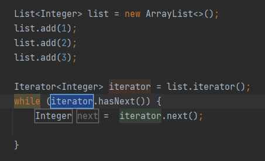
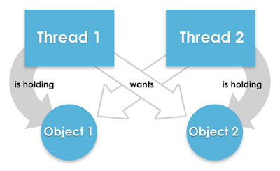

# Java 基础

## 数据类型

- 8种基本数据类型：

整数型：byte（1字节）、short（2字节）、int（4字节）、long（8字节）

浮点型：float（4字节）、double（8字节）

字符型：char（2字节）

布尔型：boolean（字节数不一定）


- 3种引用数据类型：

类、接口、数组；除了八大基本数据类型之外的类型都是引用数据类型。

## 类型转换

在 Java 中，类型转换规则包括自动类型转换（隐式类型转换）和强制类型转换（显式类型转换）两种方式。

**自动类型转换：**范围小的转换为范围大的

**强制类型转换：**范围大的转换为范围小的，可能会导致精度丢失，谨慎使用

规则：

1. 八种基本数据类型中，除了boolean类型不能转换，剩下七种类型之间都可以进行转换
2. 如果整数型字面量没有超过byte、short、char的取值范围，可以直接将其赋值给byte、short、char类型的变量
3. 范围从小到大排序为：byte < short(char) < int < long < float < double，其中short和char都占用两个字节，但是char可以表示更大的正整数。
4. byte、short、char 类型混合运算时，先各自转换成 int 类型再做运算。
5. 多种数据类型混合运算时，各自先转换成容量最大的那一种再做运算。

## 泛型

泛型是一种在编译时期进行类型检查和类型安全的机制，它可以让我们编写更加通用和可复用的代码。

泛型，可以理解为“参数化类型”，把类型当作参数，类型以调用者传入的类型为准。

泛型只在编译阶段有效。

**泛型的作用：**

1.提供类型检查机制，使类型步一致问题，提前到编译期，使得开发者能更早发现问题

2.使用泛型类、泛型接口、泛型方法，可以编写更加通用的代码，例如：ArrayList

### 举例子

```java
List arrayList = new ArrayList();
arrayList.add("aaaa");
arrayList.add(100);

for(int i = 0; i< arrayList.size();i++){
    String item = (String)arrayList.get(i);
    Log.d("泛型测试","item = " + item);
}
```

毫无疑问会报错：

```java
java.lang.ClassCastException: java.lang.Integer cannot be cast to java.lang.String
```

ArrayList 可以存放任意类型，例子中添加了一个 String 类型，添加了一个 Integer 类型，再使用时都以 String 的方式使用，因此程序崩溃了。为了解决这种由于类型不一致而产生的问题（在编译阶段就可以解决），泛型应运而生。

将第一行声明初始化 list 的代码更改一下，编译器会在编译阶段就能够帮我们发现类似这样的问题。

```java
List<String> arrayList = new ArrayList<String>();
...
//arrayList.add(100); 在编译阶段，编译器就会报错
```

### 泛型类

泛型类型用于类的定义中，被称为泛型类。通过泛型可以完成对一组类的操作对外开放相同的接口。最典型的就是各种容器类，如：List、Set、Map。

模板：

```java
class 类名称 <泛型标识：可以随便写任意标识号，标识指定的泛型的类型>{
  private 泛型标识 /*（成员变量类型）*/ var; 
  .....

  }
}
```

例子：

```java
//此处T可以随便写为任意标识，常见的如T、E、K、V等形式的参数常用于表示泛型
//在实例化泛型类时，必须指定T的具体类型
public class Generic<T>{ 
    //key这个成员变量的类型为T,T的类型由外部指定  
    private T key;

    public Generic(T key) { //泛型构造方法形参key的类型也为T，T的类型由外部指定
        this.key = key;
    }

    public T getKey(){ //泛型方法getKey的返回值类型为T，T的类型由外部指定
        return key;
    }
}
```

```java
//泛型的类型参数只能是类类型（包括自定义类），不能是简单类型
//传入的实参类型需与泛型的类型参数类型相同，即为Integer.
Generic<Integer> genericInteger = new Generic<Integer>(123456);

//传入的实参类型需与泛型的类型参数类型相同，即为String.
Generic<String> genericString = new Generic<String>("key_vlaue");
```

定义的泛型类，就一定要传入泛型类型实参么？并是一定要传入泛型类型的实参，如果不传入泛型类型实参的话，在泛型类中使用泛型的方法或成员变量定义的类型可以为任何的类型。

```java
Generic generic = new Generic("111111");
Generic generic1 = new Generic(4444);
Generic generic2 = new Generic(55.55);
Generic generic3 = new Generic(false);

System.out.println("泛型测试：key is " + generic.getKey());
System.out.println("泛型测试：key is " + generic1.getKey());
System.out.println("泛型测试：key is " + generic2.getKey());
System.out.println("泛型测试：key is " + generic3.getKey());
```

```
泛型测试: key is 111111
泛型测试: key is 4444
泛型测试: key is 55.55
泛型测试: key is false
```

注意：

- 泛型的类型参数只能是类类型，不能是简单类型。
- 不能对确切的泛型类型使用 instanceof 操作。如下面的操作是非法的，编译时会出错。

```java
　if(ex_num instanceof Generic<Number>){ 
  }
```

### 泛型接口

泛型接口与泛型类的定义及使用基本相同。泛型接口常被用在各种类的生产器中，可以看一个例子：

```java
//定义一个泛型接口
public interface Generator<T> {
    public T next();
}
```

当实现泛型接口时，泛型接口未传入泛型实参，实现类的泛型声明要和泛型接口保持一致：

```java
/**
 * 未传入泛型接口的实参时，实现类的泛型声明要和泛型接口保持一致
 * 即：class FruitGenerator<T> implements Generator<T>{
 * 如果不声明泛型，如：class FruitGenerator implements Generator<T>，编译器会报错："Unknown class"
 */
class FruitGenerator<T> implements Generator<T>{
    @Override
    public T next() {
        return null;
    }
}
```

当实现泛型接口时，泛型接口有传入泛型实参，实现类中，所有使用泛型的地方都要替换成传入的实参类型：

```java
/**
 * 传入泛型实参时：
 * 在实现类实现泛型接口时，如已将泛型类型传入实参类型，则所有使用泛型的地方都要替换成传入的实参类型
 * 即：Generator<T>，public T next();中的的T都要替换成传入的String类型。
 */
public class FruitGenerator implements Generator<String> {

    private String[] fruits = new String[]{"Apple", "Banana", "Pear"};

    @Override
    public String next() {
        Random rand = new Random();
        return fruits[rand.nextInt(3)];
    }
}
```

### 泛型方法

泛型类型用于方法的定义中，被称为泛型方法。泛型方法，是在调用方法的时候指明泛型的具体类型 。

```java
/**
 * 泛型方法的基本介绍
 * @param tClass 传入的泛型实参
 * @return T 返回值为T类型
 * 说明：
 *     1）public 与 返回值中间<T>非常重要，可以理解为声明此方法为泛型方法。
 *     2）只有声明了<T>的方法才是泛型方法，泛型类中的使用了泛型的成员方法并不是泛型方法。
 *     3）<T>表明该方法将使用泛型类型T，此时才可以在方法中使用泛型类型T。
 *     4）与泛型类的定义一样，此处T可以随便写为任意标识，常见的如T、E、K、V等形式的参数常用于表示泛型。
 */
public <T> T genericMethod(Class<T> tClass)throws InstantiationException ,
  IllegalAccessException{
        T instance = tClass.newInstance();
        return instance;
}
```

例子：

```java
public class GenericTest {
    
   //这个类是个泛型类，在上面已经介绍过
   public class Generic<T>{     
        private T key;

        public Generic(T key) {
            this.key = key;
        }

        //虽然在方法中使用了泛型，但是这并不是一个泛型方法。
        //这只是类中一个普通的成员方法，只不过他的返回值是在声明泛型类已经声明过的泛型。
        public T getKey(){
            return key;
        }
    }

    /** 
     * 这才是一个真正的泛型方法。
     * 首先在public与返回值之间的<T>必不可少，这表明这是一个泛型方法，并且声明了一个泛型T
     * 这个T可以出现在这个泛型方法的任意位置
     * 泛型的数量也可以为任意多个 
     *    如：public <T,K> K showKeyName(Generic<T> container){
     *        ...
     *        }
     */
    public <T> T showKeyName(Generic<T> container){
        System.out.println("container key :" + container.getKey());
        T key = container.getKey();
        return key;
    }

    //这也不是一个泛型方法，这就是一个普通的方法，只是使用了Generic<Number>这个泛型类做形参而已。
    public void showKeyValue1(Generic<Number> obj){
        Log.d("泛型测试","key value is " + obj.getKey());
    }
}
```

```java
public class GenericFruit {
    class Fruit{
        @Override
        public String toString() {
            return "fruit";
        }
    }

    class Apple extends Fruit{
        @Override
        public String toString() {
            return "apple";
        }
    }

    class Person{
        @Override
        public String toString() {
            return "Person";
        }
    }

    class GenerateTest<T>{
        public void show_1(T t){
            System.out.println(t.toString());
        }

        // 泛型类的泛型作用域是整个类，泛型方法的泛型作用域是所在的方法，注意泛型的标识不要重复
        // 如果标识符和泛型类的标识T重复，在方法中以方法声明的为准，虽然不会报错，但是不推荐重复
        public <E> void show_3(E t){
            System.out.println(t.toString());
        }
    }

    public static void main(String[] args) {
        Apple apple = new Apple();
        Person person = new Person();

        GenerateTest<Fruit> generateTest = new GenerateTest<Fruit>();
        //apple是Fruit的子类，所以这里可以
        generateTest.show_1(apple);
        //编译器会报错，因为泛型类型实参指定的是Fruit，而传入的实参类是Person
        //generateTest.show_1(person);

        //使用这两个方法都可以成功
        generateTest.show_2(apple);
        generateTest.show_2(person);

        //使用这两个方法也都可以成功
        generateTest.show_3(apple);
        generateTest.show_3(person);
    }
}
```

泛型方法结合可变参数的例子：

```java
public <T> void printMsg( T... args){
    for(T t : args){
        System.out.println("泛型测试：t is " + t);
    }
}
```

**静态方法与泛型：**

静态方法无法访问类上定义的泛型，所以静态方法要使用泛型的话，必须将静态方法定义成泛型方法 。

```java
public class StaticGenerator<T> {
    ....
    ....
    /**
     * 静态方法不能使用泛型类中已经声明过的泛型
     * 如：public static void show(T t){..},此时编译器会提示错误信息：
          "StaticGenerator cannot be refrenced from static context"
     */
    public static <T> void show(T t){

    }
}
```

### 泛型通配符

`Ingeter`是`Number`的一个子类，那么问题来了，在使用`Generic<Number>`作为形参的方法中，能否使用`Generic<Ingeter>`的实例传入呢？在逻辑上类似于`Generic<Number>`和`Generic<Ingeter>`是否可以看成具有父子关系的泛型类型呢？

为了弄清楚这个问题，使用`Generic<T>`这个泛型类继续看下面的例子：

```java
public void showKeyValue1(Generic<Number> obj){
    System.out.println("泛型测试：key value is " + obj.getKey());
}
```

```java
Generic<Integer> gInteger = new Generic<Integer>(123);
Generic<Number> gNumber = new Generic<Number>(456);

showKeyValue(gNumber);

// showKeyValue这个方法编译器会为我们报错：Generic<java.lang.Integer> 
// cannot be applied to Generic<java.lang.Number>
// showKeyValue(gInteger);
```

通过提示信息我们可以看到`Generic<Integer>`不能被看作为`Generic<Number>`的子类，是不同的类型参数，不能兼容。

回到上面的例子，如何解决上面的问题？总不能为了定义一个新的方法来处理`Generic<Integer>`类型的类，这样会冗余代码，需要一种方式来兼容`Generic<Integer>`和`Generic<Number>`，因此类型通配符应运而生。

可以将上面的方法改一下：

```java
public void showKeyValue1(Generic<?> obj){
   System.out.println("泛型测试：key value is " + obj.getKey());
}
```

类型通配符一般是使用“？”，表示未知类型，表示可以传入任意类型。

**泛型上下边界：**

在使用泛型的时候，我们还可以为传入的泛型类型实参进行上下边界的限制，如：类型实参只准传入某种类型的父类或某种类型的子类。

为泛型添加上边界，即传入的类型必须是指定的类型及其子类：

```java
public void showKeyValue1(Generic<? extends Number> obj){
   System.out.println("泛型测试","key value is " + obj.getKey());
}
```

```java
Generic<String> generic1 = new Generic<String>("11111");
Generic<Integer> generic2 = new Generic<Integer>(2222);
Generic<Float> generic3 = new Generic<Float>(2.4f);
Generic<Double> generic4 = new Generic<Double>(2.56);

//这一行代码编译器会提示错误，因为String类型并不是Number类型的子类
//showKeyValue1(generic1);

showKeyValue1(generic2);
showKeyValue1(generic3);
showKeyValue1(generic4);
```

如果把泛型类的定义也改一下:

```java
public class Generic<T extends Number>{
    private T key;

    public Generic(T key) {
        this.key = key;
    }

    public T getKey(){
        return key;
    }
}
```

```java
//这一行代码也会报错，因为String不是Number的子类
Generic<String> generic1 = new Generic<String>("11111");
```

为泛型添加下边界用 super：

````java
public <T super Integer> void process(List<T> list) {
    // 在这里 T 必须是 Integer 类型或其父类型
}
````

必须在泛型声明时添加上下边界：

```java
//public <T> T showKeyName(Generic<T extends Number> container)，编译器会报错："Unexpected bound"
public <T extends Number> T showKeyName(Generic<T> container){
    System.out.println("container key :" + container.getKey());
    T test = container.getKey();
    return test;
}
```

## 面向对象

面向对象是一种编程思想，面向对象的三大基本特征是封装、继承、多态。

面向对象的编程思想就是把事物看作一个整体，从事物的特征（属性）和行为（方法）两个方面进行描述。

面向对象的过程就是找对象、建立对象、使用对象、维护对象的关系的过程。

### 抽象

所谓的抽象，就是把同一类事物中共有的特征(属性)和行为(功能、方法)进行抽取，归纳，总结。

抽象的过程其实就是面向对象编程的核心思想

### 封装

在 Java 中，封装是指将数据（属性）和相关方法隐藏在一个类中，对外部提供公共的接口来访问和操作这些数据。

封装的主要目的是隐藏内部实现细节，通过定义访问修饰符（如 private、default（缺省）、protected、public）来控制对数据的访问权限，以保证数据的安全性和一致性。

封装的作用：

- 提高代码的可维护性和可扩展性。
- 隐藏内部细节，保护数据的安全性。
- 提供统一的接口来操作数据，减少错误和提高代码的可读性。
- 可以对数据进行控制和校验，确保数据的有效性。

封装的例子：

1.通过访问限制符修改类中属性的可见性，从而限制对类中属性的访问。

```java
 public class Person {
    private String name;
    private int age;
}
```

这段代码中，将 name 和 age 属性设置为私有的，只能本类才能访问，其他类都访问不了，如此就对信息进行了隐藏。

2.对每个值属性提供对外访问的公共方法，说白了也就是创建一对赋值取值的方法，来提供外部程序对类中的私有属性进行访问。

```java
public class Person {
    private String name;
    private int age;
     
    public void setage(int age){
     this.age = age;
	}
	public int getage(){
     return age;
	}
	public void setname(String name){
     this.name = name;
	}
	public String getname(){
     return name;
	}
}
```

### 继承

在 Java 中，继承是面向对象编程的一个重要概念，它允许一个类（称为子类或派生类）继承另一个类（称为父类或基类）的属性和方法。通过继承，子类可以重用父类的代码，并且可以扩展或修改父类的功能。

Java 中的继承使用关键字 `extends` 来实现，子类通过继承父类来获取其非私有成员（属性和方法），包括公共（public）、受保护（protected）和默认（无修饰符）访问级别的成员。

继承的特点：

- 子类可以继承父类的非私有成员（属性和方法）。
- 子类可以重写（Override）父类的方法，以实现自己的特定行为。
- 子类可以添加新的成员（属性和方法）。
- 子类可以通过 `super` 关键字调用父类的构造方法和方法。
- 子类只能继承一个父类

子类访问父类：

- 子类可以访问父类的公共（public）和受保护（protected）成员。
- 如果父类成员使用默认（无修饰符）访问级别，则子类必须在同一包内才能访问。
- 子类不能直接访问父类的私有（private）成员，但可以通过父类的公共或受保护方法间接访问。

`super` 关键字：

- `super` 关键字用于引用父类的成员，包括属性、方法和构造方法。
- 可以使用 `super()` 调用父类的构造方法。
- 在方法中使用 `super.methodName()` 调用父类的方法。

继承的作用：

1. 代码重用：继承允许子类继承父类的属性和方法，这样可以避免重复编写相同的代码。子类可以直接使用父类已经定义好的功能，从而提高代码的复用性和可维护性。
2. 扩展性：通过继承，我们可以在已有的类基础上创建新的类，将新的功能添加到子类中。子类可以在父类的基础上进行修改和扩展，以满足特定需求，而不需要修改原始的父类代码。这种扩展性使得程序更加灵活和可扩展。
3. 多态性：继承是实现多态性的基础。通过多态性，我们可以使用父类类型的引用来引用子类对象，从而实现对不同子类对象的统一处理。这样可以提高代码的灵活性和可扩展性，并且使得代码更容易理解和维护。
4. 方法重写：子类可以重写（Override）父类的方法，以适应子类自身的特定需求。通过方法重写，子类可以改变继承自父类的方法的行为，实现多态性和个性化的定制。

使用模板：

```java
public class 子类名称 extends 父类名称{
    //... 
}
```

例子：

父类: Employee.java

```java
//定义一个父类:员工
public class Employee {
    public void method(){
        System.out.println("方法已执行!");
    }
}
```

子类 :Assistant.java

```java
//定义一个子类:助教
public class Assistant extends Employee {  //助教类继承了员工类
}
```

继承中成员变量的访问特点：

在父子类的继承关系当中，如果成员变量重名，则创建子类对象时，访问有两种方式：

1.直接通过子类对象访问成员变量：等号左边是谁，就优先用谁，没有则向上找

2.间接通过成员方法访问成员变量：该方法属于谁，就优先用谁，没有则向上找

```java
public class Father {
    int numFather = 20;
    int num = 200;

    public void fatherMethod(){
        System.out.println(num);
    }
}
```

```java
public class Son extends Father {
    int numSon = 30;
    int num = 300;
    public void sonMethod(){
        System.out.println(num);
    }
}
```

```java
/*
      在父子类的继承关系当中,如果成员变量重名,则创建子类对象时,访问有两种方式
      　　1.直接通过子类对象访问成员变量
              等号左边是谁,就优先用谁,没有则向上找
         2.间接通过成员方法访问成员变量
         　　　该方法属于谁,就优先用谁,没有则向上找.
 */
public class Demo2ExtendsField {
    public static void main(String[] args) {
        //创建父类对象
        Father father=new Father();
        System.out.println(father.numFather);    //只能使用父类的东西,没有任何子类内容,20
        System.out.println("==================");
        //创建子类对象
        Son son=new Son();
        System.out.println(son.numSon);    //30
        //等号左边是谁,就优先用谁,没有则向上找
        System.out.println(son.num);      //300
        System.out.println(father.num);      //200
//        System.out.println(son.abc);      //这个abc子类没有,父类也没有,会编译报错

        //这个方法是子类的,优先用子类的,没有再向上找
        son.sonMethod();
        //这个方法是在父类当中定义的
        father.fatherMethod();
    }
}
```

继承后变量重名解决：

1.本类的成员变量： this.成员变量名

2.父类的成员变量：super.成员变量名

```java
public class Father {
    int num = 10;   //父类中成员变量
}
```

```java
public class Son extends Father{
    int num = 20;
    public void method(){
        int num = 30;
        System.out.println(num);        //访问局部变量
        System.out.println(this.num);   //访问本类的成员变量
        System.out.println(super.num);  //访问父类的成员变量
    }
}
```

方法的重写：

在继承关系当中，子类重写在父类中方法的名称一样，参数列表也一样的方法

特点：创建的是子类对象，则优先用子类对象

方法覆盖重写的注意事项：

　　1.必须保证父子类之间方法的名称相同，参数列表也相同。@Override：写在方法前面，用来检测是不是有效的正确覆盖重写，这个注释不写只要满足要求也是正确的，最好写因为可以提醒自己

　　 2.子类方法的返回值必须小于等于父类方法的返回值范围

　　 3.子类方法的权限必须大于等于父类方法的权限修饰符，public > protected > (default) > private 

继承中构造方法的访问特点：

继承关系中，父子类构造方法的访问特点:

1.子类构造方法当中有一个默认隐含的"super()"调用，所以一定是先调用的父类构造，后执行的子类构造，不写会自动添加

2.子类构造可以通过super关键字来调用父类重载构造

3.super的父类构造调用，必须是子类构造方法的第一个语句；不能一个子类构造调用多次super构造

总结: 子类必须调用父类构造方法，不写则自动添加；写了则用写的指定的super调用，super只能有一个，还必须是第一个

```java
public class Father {
    public  Father(){
        System.out.println("父类无参的构造方法");
    }
    public  Father(int num){
        System.out.println("父类有参的构造方法");
    }
}

//Son.java 子类
public class Son extends Father {
    public Son(){
        super(10);
//      super();  错误写法
        System.out.println("子类的构造方法");
//      super();  必须是第一个
    }
}
```

```java
public class Demo1Constructor {
    public static void main(String[] args) {
        Son son=new Son();
    }
}
```

```java
//输出结果
父类有参的构造方法
子类的构造方法
```

子父类的执行顺序：

父类的静态方法、子类的静态方法、父类的代码块、父类的构造方法、子类的代码块、子类的构造方法

重点：

1.先静态

2.先父类，后子类

3.先代码块，后构造方法

### 多态

Java 多态是面向对象编程的一个重要概念，它允许使用父类类型的引用来引用子类对象，从而实现对不同子类对象的统一处理。多态性有助于提高代码的灵活性、可扩展性和可维护性。

多态性的核心思想是，一个对象可以表现出多种形态。具体来说，在Java中实现多态性的方式是通过继承和方法重写。

当一个父类引用指向一个子类对象时，可以根据引用的类型调用相应的方法。这意味着，通过父类的引用，可以调用子类重写的方法，而不需要知道具体的子类类型。

多态的作用：

1. **统一接口：**多态性允许使用父类类型的引用来引用子类对象，从而实现对不同子类对象的统一处理。通过定义统一的接口（父类），可以使得代码更加简洁和可读，同时可以降低代码的耦合度。
2. **代码复用：**通过多态性，可以将公共的代码逻辑封装在父类中，避免在每个子类中重复编写相同的代码。这样可以提高代码的可维护性和可复用性。
3. **可扩展性：**当需要添加新的子类时，不需要修改现有的代码，只需要添加新的子类并保证其符合父类接口即可。这样可以降低代码的修改成本，增加系统的可扩展性。
4. **运行时确定方法调用：**多态性允许在运行时根据对象的实际类型（而不是引用类型）确定调用哪个方法。这样可以实现动态绑定，提高代码的灵活性和可扩展性。
5. **多态参数和返回类型：**通过多态性，可以将子类对象作为参数传递给接受父类类型参数的方法，或者将子类对象作为父类类型返回。这样可以增加代码的灵活性和可复用性。

多态的例子：

````java
public class Animal {
    public String name = "animal";

    public void eat() {
        System.out.println("动物吃东西！");
    }

    public void run() {
        System.out.println("动物在奔跑！");
    }
}

public class Tiger extends Animal {
    public String name = "tiger";

    @Override
    public void eat() {
        System.out.println("虎吃鸡！");
    }
    
    @Override
    public void run() {
		System.out.println("虎奔跑！");
	}
}

public class Snake extends Animal {
    public String name = "snake";
    
    @Override
    public void eat() {
        System.out.println("蛇吃鼠！");
    }

	@Override
    public void run() {
		System.out.println("蛇爬行！");
	}
}
````

 ````java
 1.多态成员变量：编译检查的时候检查Animal类中是否有此变量定义
 		Animal tiger = new Tiger(); 
 
 		System.out.println("name = " + tiger.name);
 
 	上述打印输出结果为： name = Animal
 
 2.使用多态调用成员方法：编译时检查左边类型，运行时实际调用右边对象
 
     	Animal snake = new Snake();
 
     	System.out.println(sanke.eat()); 
     	
  实际类型是Snake, 所以运行时调用的是Snake中重写后的方法。打印输出结果为： 蛇吃鼠！
 
 ````

**多态的特性：**

成员方法：编译看左边，运行看右边

成员变量：编译运行都看左边

静态方法：编译运行都看左边

子类的同名的类变量、静态方法、静态变量不会覆盖父类，编译和运行时都是以父类（左边）为准；只有成员方法会特别一点，编译时看父类（左边）有没有这个方法，然后运行时调用子类（右边）的方法。

## 控制结构

控制结构分为顺序结构、选择结构、循环结构

### 顺序结构

顺序结构是最简单最基础得结构，按照代码出现的先后顺序执行就是顺序结构


### 选择结构

#### if语句

```java
// 考试奖励：键盘录入一个整数，表示小明的考试名次，如果名次为1，小红可以当小明的女友了。
Scanner sc = new Scanner(System.in);
System.out.println("输入小明的名次");
int rank = sc.nextInt();
if (rank == 1){
    System.out.println("小红可以当女朋友");
}
```

```java
// 影院选座：某影院售卖了100张票，票的序号为1~100，奇数坐左边，偶数坐右边
Scanner sc = new Scanner(System.in);
System.out.println("请输入票号：");
int ticker = sc.nextInt();
if (ticker > 100 || ticker < 1) {
    System.out.println("票不合法");
} else {
    if (ticker % 2 != 0){
        System.out.println("坐左边");
    }else {
        System.out.println("坐右边");
    }
}
```

```java
// 考试奖励：
// 95~100 自行车一辆
// 90~94   游乐场玩一天
// 80 ~ 89 变形金刚一个
// 80 以下  胖揍一顿
Scanner sc = new Scanner(System.in);
System.out.println("请输入分数：");
int score = sc.nextInt();
if (score < 0 || score > 100){
    System.out.println("分数不合法");
}else {
    if (score >= 95){
        System.out.println("奖励自行车");
    }else if (score >= 90){
        System.out.println("游乐场玩一天");
    }else if (score >= 80){
        System.out.println("变形金刚一个");
    }else {
        System.out.println("揍一顿");
    }
}
```

#### switch语句

```java
switch (表达式) {
	case 1:
		语句体1;
		break;
	case 2:
		语句体2;
		break;
	...
	default:
		语句体n+1;
		break;
}
```

- 首先计算出表达式的值 
- 其次，和 case 依次比较，一旦有对应的值，就会执行相应的语句，在执行的过程中，遇到 break 才会结束，不然会一直执行下去。 
- 最后，如果所有的 case 都和表达式的值不匹配，就会执行 default 语句体部分，然后程序结束掉。
- 当其他的 case 都匹配不上时才会执行 default，default 可以放在任意位置（即使是放在第一位也是其他没匹配上才匹配这个），也可以省略，可以把 default 理解成一个特殊的 case，因为没有跟 break 也会发生 case 穿透。

练习：

```java
// 运动计划：键盘录入星期数，显示今天的减肥活动。
// 周一：跑步
// 周二：游泳
// 周三：慢走
// 周四：动感单车
// 周五：拳击
// 周六：爬山
// 周日：好好吃一顿
Scanner sc = new Scanner(System.in);
System.out.println("请输入星期数：");
int week = sc.nextInt();
switch (week) {
    case 1:
        System.out.println("跑步");
        break;
    case 2:
        System.out.println("游泳");
        break;
    case 3:
        System.out.println("慢走");
        break;
    case 4:
        System.out.println("动感单车");
        break;
    case 5:
        System.out.println("拳击");
        break;
    case 6:
        System.out.println("爬山");
        break;
    case 7:
        System.out.println("好好吃一顿");
        break;
    default:
        System.out.println("日期不合法，没有这个日期");
        break;
}
```

写switch语句技巧：先写第一个case，然后复制多个case，然后再写第一个case的内容，然后复制给多个 case

利用 case 穿透：

休息日和工作日：(1-5) 工作日，(6-7) 休息日

```java
        Scanner sc = new Scanner(System.in);
        System.out.println("请输入日期：");
        int day = sc.nextInt();
        switch (day){
            case 1:
            case 2:
            case 3:
            case 4:
            case 5:
                System.out.println("工作日");
                break;
            case 6:
            case 7:
                System.out.println("休息日");
                break;
            default:
                System.out.println("日期不合法");
                break;
        }
```

#### 使用场景

表示范围用 if

数据的个数有限可以列举，则用 switch

### 循环结构

#### for语句

```java
for (初始化语句;条件判断语句;条件控制语句) {
	循环体语句;
}
```

- 初始语句：初始状态
- 条件判断语句：每次循环前要判断的条件，符合条件才循环，不符合直接结束
- 条件控制语句：每次循环后要执行的语句
- 循环体语句：每次循环中要执行的代码

求偶数和：求1-100之间的偶数和，并把求和结果在控制台输出

```java
int sum = 0;
for (int i = 1; i <= 100; i++) {
    if (i % 2 == 0) {
        sum = sum + i;
    }
}
System.out.println("100以内偶数和：" + sum);
```

#### while语句

```java
初始化语句;
while(条件判断语句){
	循环体;
	条件控制语句;
}
```

和for的不同是初始语句在外面，条件控制语句写在花括号里

```java
		// 珠穆朗玛峰：纸需要折叠几次才到达山的高度
		int height = 888444555;
        int count = 0;
        double paper = 0.1;
        while (paper <= height) {
            paper = paper * 2;
            count++;
        }
        System.out.println("需要折叠的次数为：" + count);
```

#### do...while语句

```java
初始化语句;
do{
    循环体;
    条件控制语句;
}while(条件判断语句);
```

和while循环的区别是，do...while先执行一次循环在判断是否符合条件

```java
        // 1-100 求和
        int sum = 0;
        int num = 1;
        do {
            sum = sum + num;
            num++;
        } while (num <= 100);
        System.out.println("1-100的和为：" + sum);
```

#### 使用场景

当知道**循环次数**或**循环范围**的时候用 for

当知道不知道循环次数或范围，只知道**结束条件**的时候用 while

#### 条件控制语句

break：不能单独存在，可以用在switch或循环中，作用是结束循环，或结束switch

continue：不能单独存在，只能用在循环中，作用是跳过本次循环，开启下一次循环

```java
// 吃包子：1-5个包子，吃到第三个包子时停止
for (int i = 1; i <= 5; i++) {
    System.out.println("正在吃第" + i + "个包子");
    if (i == 3) {
        System.out.println("不吃了");
        break;
    }
}
```

```java
// 吃包子：1-5个包子，第三个包子有虫不吃第三个
for (int i = 1; i <= 5; i++) {
    if (i == 3) {
        System.out.println("第三个包子有虫不吃");
        continue;
    }
    System.out.println("正在吃第" + i + "个包子");
}
```

#### 练习题

逢7过:
游戏规则：从任意一个数字开始报数，当你要报的数字是包含7或者是7的倍数时都要说过：过
需求：使用程序在控制台打印出1-100之间的满足逢七必过规则的数据

分析：包含7：个位是7，10位是7; %10获得个位，/10去掉个位
			7的倍数：模以7等于0

```java
for (int i = 1; i <= 100; i++) {
    if (i % 10 == 7 || i / 10 % 10 == 7 || i % 7 == 0) {
        System.out.print("过 ");
        continue;
    }
    System.out.print(i + " ");
}

```

求平方根：键盘录入一个大于等于2的整数 x ，计算并返回 x 的 平方根 。结果只保留整数部分 ，小数部分将被舍去

```java
Scanner sc = new Scanner(System.in);
System.out.println("请输入数字");
int x = sc.nextInt();
if (x < 2) {
    System.out.println("数字不合法");
}
for (int i = 1; i <= x; i++) {
    if (i * i == x) {
        System.out.println("平方根是" + i);
        break;
    } else if (i * i > x) {
        System.out.println("平方根是" + (i - 1));
        break;
    }
}
```

判断是否为质数：键盘录入一个正整数 x ，判断该整数是否为一个质数。
分析：如果在2 到 x - 1之间有数可以整除x，则x就是质数

```java
Scanner sc = new Scanner(System.in);
System.out.println("请输入整数：");
int x = sc.nextInt();
// 默认为true，表示是质数
boolean flag = true; 
for (int i = 2; i < x - 1; i++) {
    // 能被其中一个数整除则不是质数
    if (x % i == 0){
        flag = false;
        break;
    }
}
if (flag){
    System.out.println("是质数");
}else {
    System.out.println("不是质数");
}
```

## 异常

Java异常是指在程序运行时可能出现的一些错误，如：文件找不到、网络连接失败、非法参数等。
Java异常类的层次结构图：


**Throwable**：所有的异常都是从Throwable继承而来的，是所有所有错误与异常的超类。Throwable包含了其线程创建时线程执行堆栈的快照，它提供了 printStackTrace()等接口用于获取堆栈跟踪数据等信息。而Throwable体系下包含有两个子类，Error（错误）和Exception（异常），它们通常用于指示发生了异常情况。

**Error**：Error类及其子类。程序中无法处理的错误，表示运行应用程序中出现了严重的错误。大多数错误与代码编写者执行的操作无关，而是表示代码运行时 JVM出现的问题。

**Exception**：Exception 是另外一个非常重要的异常子类。程序本身可以捕获并且可以处理异常。这类异常一旦出现，我们就要对代码进行更正，修复程序。Exception这种异常又分为两类：运行时异常和编译时异常。 

**运行时异常**：RuntimeException 类及其子类异常，如NullPointerException （空指针异常）、IndexOutOfBoundsException （下目标越界异常）等，表示 JVM在运行期间可能出现的异常。

运行时异常的特点：Java编译器不会检查它，也就是说，当程序中出现这类异常时，也会编译通过。        

**非运行时异常 （编译异常）**：Exception中除 RuntimeException 及其子类之外的异常。

**受检异常**：编译器要求必须处理得异常，Exception中除 RuntimeException 及其子类之外的异常，也就是**非运行时期异常，属于受检异常。**

**非受检异常**：编译器不会进行检查并且不要求必须处理的异常，包括运行时异常（RuntimeException 及其子类）和错误（ Error），RuntimeException 发生的时候，表示程序中出现了编程错误，所以应该找出错误修改程序，而不是去捕获RuntimeException 。

异常处理机制：

异常处理机制包括抛出异常 throw、声明异常 throws、捕获异常

### 抛出异常 throw

什么时候使用呢？

1. 比如，在定义方法时，方法需要接受参数。那么，当调用方法使用接受到的参数时，首先需要先对参数数据进行合法的判断，数据若不合法，就应该告诉调用者，传递合法的数据进来。这时需要使用抛出异常的方式来告诉调用者。
2. 或者当你觉得解决不了某些异常问题，且不需要调用者处理，那么你也可以抛出异常。

**定义格式：**

```java
throw new 异常类名(参数);
```

```java
public class ThrowDemo {
    public static void main(String[] args) {
        //创建一个数组
        int[] arr = {2,4,52,2};
        //根据索引找对应的元素
        int index = 4;
        int element = getElement(arr, index);
        System.out.println(element);
        System.out.println("over");
    }
    /*
     * 根据 索引找到数组中对应的元素
     */
    public static int getElement(int[] arr,int index){
        //判断索引是否越界
        if(index<0 || index>arr.length-1){
             /*
                判断条件如果满足，当执行完throw抛出异常对象后，方法已经无法继续运算。
                这时就会结束当前方法的执行，并将异常告知给调用者。这时就需要通过异常来解决。
              */
            throw new ArrayIndexOutOfBoundsException("你的索引越界了");
        }
        int element = arr[index];
        return element;
    }
}
```

```text
Exception in thread "main" java.lang.ArrayIndexOutOfBoundsException: 你的索引越界了
	at com.it.test2.ThrowDemo.getElement(ThrowDemo.java:25)
	at com.it.test2.ThrowDemo.main(ThrowDemo.java:10)
```

所以如果产生了问题，我们就会throw将问题描述类即异常进行抛出，也就是将问题返回给该方法的调用者。结果是ArrayIndexOutOfBoundsException 的数组索引越界的问题。

那么对于调用者来说，该怎么处理呢？一种是进行捕获处理，另一种是声明异常，使用throws声明处理。

### 声明异常 throws

如果一个方法可能会出现异常，但没有能力处理这种异常，可以在方法声明处用throws子句来声明抛出异常。例如汽车在运行时它可能会出现故障，汽车本身没办法处理这个故障，那就让开车的人来处理。

**声明异常**：将问题标识出来，报告给调用者。如果方法内通过throw抛出了编译时异常，而没有捕获处理，那么必须通过throws进行声明，让调用者去处理。

**定义格式**： throws语句用在方法定义时声明该方法要抛出的异常类型，如果抛出的是Exception异常类型，则该方法被声明为抛出所有的异常。多个异常可使用逗号分割。

```text
修饰符 返回值类型 方法名(参数) throws 异常类名1,异常类名2…{   }
```

**注意**：当方法抛出异常列表的异常时，方法将不对这些类型及其子类类型的异常作处理，而抛向调用该方法的方法，由他去处理。使用throws关键字将异常抛给调用者后，如果调用者不想处理该异常，可以继续向上抛出，但最终要有能够处理该异常的调用者。比如汽车坏了，开车的人也不会修理，只能叫修车公司来修理了

```java
public class ThrowsDemo {
    public static void main(String[] args) throws FileNotFoundException {
        readFile("a.txt");
    }
    // 如果定义功能时有问题发生需要报告给调用者。可以通过在方法上使用throws关键字进行声明
    public static void readFile(String path) throws FileNotFoundException {
        if(!path.equals("a.txt")) {//如果不是 a.txt这个文件
            // 我假设  如果不是 a.txt 认为 该文件不存在 是一个错误 也就是异常  throw
            throw new FileNotFoundException("文件不存在");
        }
    }
}
```

而throws用于进行异常类的声明，若该方法可能有多种异常情况产生，那么在throws后面可以写多个异常类，用逗号隔开。

```java
public class ThrowsDemo2 {
    public static void main(String[] args) throws IOException {
        readFile("a.txt");
    }
    //若该方法可能有多种异常情况产生，那么在throws后面可以写多个异常类，用逗号隔开
    //若有异常a是异常b的子类，也可以直接省略，写b异常
    private static void readFile(String path) throws FileNotFoundException, IOException {
        if (!path.equals("a.txt")) {//如果不是 a.txt这个文件
            // 我假设  如果不是 a.txt 认为 该文件不存在 是一个错误 也就是异常  throw
            throw new FileNotFoundException("文件不存在");
        }
        if (!path.equals("b.txt")) {
            throw new IOException();
        }
    }
}
```

throws 抛出异常的规则：

1. 如果是非受检异常（unchecked exception），即Error、RuntimeException或它们的子类，那么可以不使用throws关键字来声明要抛出的异常，编译仍能顺利通过，但在运行时会被系统抛出。
2. 如果一个方法可能出现受检异常（checked exception），要么用try-catch语句捕获，要么用throws子句声明将它抛出，否则会导致编译错误。
3. 只有当抛出了异常时，该方法的调用者才必须处理或者重新抛出该异常。若当方法的调用者无力处理该异常的时候，应该继续抛出。

### 捕获异常try 、catch、finally

这三个关键字主要有下面几种组合方式try-catch 、try-finally、try-catch-finally。

**注意**：

catch语句可以有一个或者多个或者没有，finally至多有一个，try 一定要有。

try，catch，finally都不能单独使用出现。

try-catch-finally 形式：

```java
try {  
	// 可能会发生异常的程序代码，若发生了异常，则try中剩余的代码不会执行，跳转到catch  
} catch (异常类型A  e){  
	// 捕获并处置try抛出的异常类型A，若有finally则接下来执行finally中的代码，若无就执行下面的代码
} finally {  
	// 无论是否发生异常，都将执行的语句块  
}
```

try-catch-finally中，如果catch中 return了，finally还会执行吗？

```java
public class TryCatchFinallyDemo2 {
    public static void main(String[] args) {
        test();
    }
    public static void test() {
        int a = 10;
        try{
            System.out.println(a / 0);
        }catch(ArithmeticException e) {
            e.printStackTrace();
            return ;
        }finally {
            System.out.println("finally");
        }
    }
}
```

运行结果：

```text
java.lang.ArithmeticException: / by zero
	at com.it.test3.TryCatchFinallyDemo2.test(TryCatchFinallyDemo2.java:11)
	at com.it.test3.TryCatchFinallyDemo2.main(TryCatchFinallyDemo2.java:5)
finally
```

可以看到，就算catch中 return了，finally也会执行。

那 finally 是在 return 前呢，还是 return 后呢？

```java
public class TryCatchFinallyDemo2 {
    public static void main(String[] args) {
//        dome();
        System.out.println(test2()); // 我有执行到吗 try
        System.out.println(test3()); // 我有执行到吗 catch
    }

    public static String test2() {
        String str = "";
        try {
            str = "try";
            return str;
        }catch(Exception e) {
            str = "catch";
            return str;
        }finally {
            str = "finally";
            System.out.println("我有执行到吗");
        }
    }
    public static String test3() {
        String str = "";
        try {
            str = "try";
            System.out.println(10 / 0);
            return str;
        }catch(Exception e) {
            str = "catch";
            return str;
        }finally {
            str = "finally";
            System.out.println("我有执行到吗");
        }
    }
}
```

运行结果：

```text
我有执行到吗
try
我有执行到吗
catch
```

finally 是在 return 之前执行，但是在 return 返回的是 try 或 catch 的变量，不会 return 在 finally 中改变的值。

finally 一般用于：

1. **资源清理**：`finally` 块通常用于确保在方法执行完毕后，无论是否发生异常，都能正确地释放资源。比如关闭文件、释放数据库连接、关闭网络连接等。
2. **清理临时状态**：有时候在方法中可能会修改一些临时状态，无论方法是否正常执行完成，都需要将这些状态恢复到原始状态。`finally` 块可以用来处理这种情况，确保临时状态的清理工作得以执行。
3. **异常处理**：在使用 `try-catch` 块捕获异常时，可以使用 `finally` 块来执行一些与异常处理相关的操作，比如记录日志、发送通知等。

finally 中不应该：

1. **不应该包含返回语句**：`finally` 块中的代码不应该包含返回语句，因为 `finally` 块中的返回语句会导致忽略 try 或 catch 中的return 语句。
2. **不应该用于控制流程**：`finally` 块不应该用于改变程序的控制流程，比如使用 `break`、`continue` 或 `return` 等关键字。这样会导致代码逻辑混乱，难以理解和维护。
3. **应该慎重使用**：由于 `finally` 块中的代码无论是否发生异常都会执行，如果 `finally` 块中的代码过于复杂或耗时，可能会影响程序的性能。因此，应该慎重使用 `finally` 块，确保其中的代码简洁高效。

## 数组

在 Java 中，数组是一种用于存储同一类型数据的数据结构。数组提供了一种便捷的方式来存储和访问多个相同类型的元素。

### 初始化

数组的静态初始化：int[] arr = new int[]{1,2,3};   简化写法：int[] arr = {1,2,3}；

数组的动态初始化：int[] arr = new int[3];

动态初始化会有默认值：

​	整数类型：0

​	小数类型：0.0

​	布尔类型：false

​	字符类型：'\u0000'

​	引用类型：null

使用场景：

只知道元素的个数，不知道具体的数值，使用动态初始化

知道具体的数值，使用静态初始化

地址值：

```java
int[] arr = new int[10];
System.out.println(arr);//[D@568db2f2
```

arr 保存的是数组的地址，访问元素要结合下标

### 常用操作

访问和修改：

````java
int[] arr = {10, 20, 30, 40, 50};
int element = arr[2]; // 访问数组第三个元素（索引为 2）
arr[3] = 100; // 修改数组中的第四个元素
````

遍历：

````java
int[] arr = {1, 2, 3, 4, 5};
for (int i = 0; i < arr.length; i++) {
    System.out.println(arr[i]);
}

// 使用增强型 for 循环
for (int num : arr) {
    System.out.println(num);
}
````

排序：

````java
int[] arr = {3, 1, 4, 1, 5, 9, 2, 6};
Arrays.sort(arr); // 对数组进行升序排序
````

查找某个元素的索引：

````java
int[] arr = {1, 2, 3, 4, 5};
int index = Arrays.binarySearch(arr, 3); // 在已排序的数组中查找元素 3 的索引
````

拷贝：

````java
int[] source = {1, 2, 3, 4, 5};
int[] target1 = Arrays.copyOf(source, source.length); // 使用 Arrays.copyOf() 进行数组拷贝

int[] target2 = new int[source.length];
System.arraycopy(source, 0, target2, 0, source.length); // 使用 System.arraycopy() 进行数组拷贝
````

数组转字符串：

````java
int[] arr = {1, 2, 3, 4, 5};
String arrString = Arrays.toString(arr); // 将数组转换成字符串
System.out.println(arrString); // 输出数组内容
````

### 练习

```java
// 数组求和
int[] arr = {1, 2, 3, 4, 5};
int sum = 0;
for (int j : arr) {
    sum = sum + j;
}
System.out.println("数组求和的值是：" + sum);
```

```java
// 数组存储1,2,3,4,5,6,7,8,9,10，遍历数组得到每一个元素，统计数组里面一共有多少个能被3整除的数字
int[] arr = {1, 2, 3, 4, 5, 6, 7, 8, 9, 10};
for (int i : arr) {
    if (i % 3 == 0) {
        System.out.println(i + "能被3整除");
    }
}
```

```java
// 存储1,2,3,4,5,6,7,8,9,10
// 如果是奇数，则将当前数字扩大两倍
// 如果是偶数，则将当前数字变成二分之一
int[] arr = {1, 2, 3, 4, 5, 6, 7, 8, 9, 10};
for (int i = 0; i < arr.length; i++) {
    if (arr[i] % 2 == 0){
        arr[i] = arr[i] / 2;
    }else {
        arr[i] = arr[i] * 2;
    }
}
for (int i : arr) {
    System.out.print(i + " ");
}
```

```java
// 求最值 33,5,22,44,55
int[] arr = {33, 5, 44, 55};
int max = arr[0];
for (int i = 1; i < arr.length; i++) {
    if (max < arr[i]){
        max = arr[i];
    }
}
System.out.println("最大值为：" + max);
```

```java
//        生成10个1~100之间的随机数存入数组
//        1）求出所有数据的和
//        2）求所有数据的平均数
//        3）统计有多少个数据比平均值小
        Random r = new Random();
        int[] arr = new int[10];
        for (int i = 0; i < 10; i++) {
            arr[i] = r.nextInt(100) + 1;
        }
        int sum = arr[0];
        for (int i = 1; i < arr.length; i++) {
            sum = sum + arr[i];
        }
        int avg = sum / arr.length;
        int count = 0;
        for (int i : arr) {
            if (i < avg) {
                count++;
            }
        }
        System.out.println("数据和：" + sum);
        System.out.println("平均值：" + avg);
        System.out.println("比平均值小的个数：" + count);
```

```java
//        首位交换数据 1,2,3,4,5
        int[] arr = {1, 2, 3, 4, 5};
        for (int i = 0, j = arr.length - 1; i < j; i++, j--) {
            int temp = arr[i];
            arr[i] = arr[j];
            arr[j] = temp;
        }
        System.out.println(Arrays.toString(arr));
```

```java
// 打乱数据 1 - 5
// 数组初始化，定义随机类
int[] arr = {1, 2, 3, 4, 5};
Random r = new Random();
// 打乱原理：遍历一遍，随机交换元素，循环中用随机数生成下标，然后交换
for (int i = 0; i < arr.length; i++) {
    int temp = arr[i];
    int index = r.nextInt(arr.length);
    arr[i] = arr[index];
    arr[index] = temp;
}
// 打印打乱后的数组
System.out.println(Arrays.toString(arr));
```

```java
		// 打印101 - 200 之间的素数
		// 已知信息：素数就是质数，只有1和他本身两个因数的数是质数，因数是能整除他本身的数
		// 分析：质数是只能被1和他本身整除，2 到 他本身-1 的数都不能整除
        for (int i = 101; i <= 200; i++) {
            // 写在循环里面，就不用恢复现场了
            boolean flag = true;
            // 循环内 再循环2到本身-1，判断是否整除，如果都不能整除则就是质数，然后打印
            for (int j = 2; j < i; j++) {
                // 只要有一个数能整除就不是素数，因此结束循环
                if (i % j == 0){
                    flag = false;
                    break;
                }
            }
            if (flag) {
                System.out.println(i + "是素数");
            }
        }
```

## 常用集合

### ArrayList

在 Java 中，ArrayList 是一种动态数组，它提供了比普通数组更多的功能和灵活性。与普通数组不同，ArrayList 的大小是可以动态改变的，可以根据需要动态添加或删除元素。

#### 实现原理

1. 数据存储：ArrayList 内部使用一个 Object 类型的数组来存储元素。数组的长度会根据容量的需要进行动态调整。
2. 随机访问和索引操作：由于 ArrayList 使用数组作为底层实现，可以通过索引快速访问和修改元素。通过索引读取或修改元素的时间复杂度为 O(1)。
3. 初始容量和扩容：当创建一个新的 ArrayList 对象时，会分配一个初始容量的数组，通常为 10。如果元素数量超过了当前容量，ArrayList 会自动进行扩容，通常将容量增加为原来的 1.5 倍。
4. 元素添加和删除：当向 ArrayList 添加元素时，它会将元素放入数组的末尾，并将元素数量加一。如果数组容量不足，会触发扩容操作。当从 ArrayList 删除元素时，它会将后续元素向前移动填补删除的位置，并将元素数量减一。
5. 动态调整数组大小：ArrayList 支持动态调整数组大小，当数组容量不足或删除元素后，它可以自动进行扩容或收缩。扩容时，会创建一个更大的数组，并将原始数组的元素复制到新数组中。收缩时，会创建一个较小的数组，并将元素复制到新数组中。这种动态调整数组大小的机制使得 ArrayList 可以高效地处理变动的元素数量。

#### 常用方法

| 方法                                 | 描述                                                         |
| ------------------------------------ | ------------------------------------------------------------ |
| `boolean add(E element)`             | 将指定的元素添加到列表的末尾。                               |
| `void add(int index, E element)`     | 在指定的索引位置插入指定的元素。                             |
| `boolean remove(Object obj)`         | 从列表中删除指定的元素。                                     |
| `E remove(int index)`                | 删除指定索引位置的元素，并返回被删除的元素。                 |
| `E get(int index)`                   | 返回指定索引位置的元素。                                     |
| `E set(int index, E element)`        | 替换指定索引位置的元素，并返回原来的元素。                   |
| `int size()`                         | 返回列表中的元素个数。                                       |
| `boolean isEmpty()`                  | 如果列表中没有元素，则返回 `true`。                          |
| `void clear()`                       | 从列表中移除所有的元素。                                     |
| `boolean contains(Object obj)`       | 如果列表包含指定的元素，则返回 `true`。                      |
| `int indexOf(Object obj)`            | 返回第一次出现指定元素的索引，如果列表中不包含该元素，则返回 -1。 |
| `int lastIndexOf(Object obj)`        | 返回最后一次出现指定元素的索引，如果列表中不包含该元素，则返回 -1。 |
| `void sort(Comparator<? super E> c)` | 根据指定的比较器对列表进行排序。                             |
| `Object[] toArray()`                 | 返回一个包含列表中所有元素的数组。                           |

#### 指定位置插入元素

先了解一下 arraycopy 方法，arraycopy 的作用是将一个数组的内容复制到另一个数组（可以是同一个数组）中

```java
public static native void arraycopy(Object src, int srcPos, Object dest, int destPos, int length);
```

- `src`：源数组，即要进行复制的数组。
- `srcPos`：源数组中的起始位置，从该位置开始复制元素，包含该位置
- `dest`：目标数组，即复制后的数组。
- `destPos`：目标数组中的起始位置，从该位置开始粘贴元素。
- `length`：要复制的元素数量。

源码：

```java
public void add(int index, E element) {
    // 检查要插入的指定位置是否超出已存储的元素的数量
    rangeCheckForAdd(index);
    
    // 确保内部数组的容量能够存储当前的元素
    ensureCapacityInternal(size + 1);  // Increments modCount!!
    
    // 将指定位置后面的元素（包含指定位置）以数组复制的方式实现往后挪动一位，然后将要插入的元素覆盖指定的位置，从而实现添加
    System.arraycopy(elementData, index, elementData, index + 1, size - index);
    elementData[index] = element;
    size++;
}

// 检查要插入的指定位置是否超出已存储的元素的数量
private void rangeCheckForAdd(int index) {
    if (index > size || index < 0)
        throw new IndexOutOfBoundsException(outOfBoundsMsg(index));
}

// 这个方法的作用是确保 ArrayList 内部数组的容量能够满足当前元素的存储
// 先求得所需得最小容量，然后将求得得最小容量传递给 ensureExplicitCapacity
private void ensureCapacityInternal(int minCapacity) {
    // 判断当前数组是否为空
    if (elementData == DEFAULTCAPACITY_EMPTY_ELEMENTDATA) {
        // 若为空则，则将 minCapacity 设置为 DEFAULT_CAPACITY（默认为10） 和 minCapacity 之中的较大者
         minCapacity = Math.max(DEFAULT_CAPACITY, minCapacity);
     }
     // 将得出的最小容量传给 ensureExplicitCapacity 方法
     ensureExplicitCapacity(minCapacity);
}

// 先自增 modCount，然后调用 grow 方法进行扩容
private void ensureExplicitCapacity(int minCapacity) {
        // modCount 是 ArrayList 用于记录结构修改次数的计数器
        // 它的作用是为了支持在迭代过程中检测并发修改，可以用于快速失败机制，以及对集合一致性的检查。
        modCount++;

     // 最小所需容量大于当前长度就进行扩容
     if (minCapacity - elementData.length > 0)
          grow(minCapacity);
}
// 扩容方法，每次扩容1.5倍
private void grow(int minCapacity) {
     // overflow-conscious code
     int oldCapacity = elementData.length;
     int newCapacity = oldCapacity + (oldCapacity >> 1);
     if (newCapacity - minCapacity < 0)
          newCapacity = minCapacity;
     if (newCapacity - MAX_ARRAY_SIZE > 0)
          newCapacity = hugeCapacity(minCapacity);
      // minCapacity is usually close to size, so this is a win:
      elementData = Arrays.copyOf(elementData, newCapacity);
}
```

总结：

指定位置插入的原理是先将指定位置后面的元素（包含指定位置）以数组复制的方式实现往后挪动一位，然后将要插入的元素覆盖指定的位置，从而实现指定位置的添加。使用的时候要注意传入的指定索引不能大于当前数组的元素的数量，否则会报错。

#### 指定位置删除元素

```java
public E remove(int index) {
    // 检查范围
    rangeCheck(index);
	// 修改次数计数器，增加修改次数
    modCount++;
    E oldValue = elementData(index);

    int numMoved = size - index - 1;
    // 将指定位置后面的元素（不包含指定位置）以数组复制的方式实现往前挪动一位，覆盖了指定位置，然后最后一个元素赋值为null，从而实现删除元素
    if (numMoved > 0)
        System.arraycopy(elementData, index+1, elementData, index, numMoved);
    elementData[--size] = null; // clear to let GC do its work

    return oldValue;
}

private void rangeCheck(int index) {
    if (index >= size)
       throw new IndexOutOfBoundsException(outOfBoundsMsg(index));
}
```

总结：

指定位置删除的原理是将指定位置后面的元素（不包含指定位置）以数组复制的方式实现往前挪动一位（覆盖了指定位置），然后最后一个元素赋值为null，从而实现删除元素。

**指定位置添加和删除总结：**

ArrayList 的指定位置的添加和删除，本质上其实是数组的指定位置添加和删除，而数组的指定位置的添加和删除是要移动元素的，添加是往后移，删除是往前移，ArrayList 中对元素移动是通过`arraycopy` 方法在同一个数组上进行复制实现的。

#### 集合的复制

复制分为浅拷贝和深拷贝。

浅拷贝只复制某个对象的引用，而不复制对象本身，新旧对象还是共享同一块内存。深拷贝会创造一个一模一样的对象，新对象和原对象不共享内存，修改新对象不会改变原对象。假设 B 复制了 A，当修改 A 时，看 B 是否会发生变化。如果 B 也跟着变了，说明这是浅拷贝，如果 B 没变，那就是深拷贝。

**浅拷贝：**

1.利用构造器构建新集合（推荐）

```java
People people = new People("tom",18);
List<People> list = new ArrayList<>();
list.add(people);
List<People> newList = new ArrayList<>(list);
System.out.println("原数据：" + list.toString());  // 原数据：[People{name='tom', age=18}]
System.out.println("新数据：" + newList.toString()); // 新数据：[People{name='tom', age=18}]
```

底层原理是调用了 Arrays.copyOf ，而 Arrays.copyOf 调用了 System.arraycopy 来进行复制。

2.利用 addAll 方法进行拷贝

```java
People people = new People("tom",18);
List<People> list = new ArrayList<>();
list.add(people);
List<People> newList = new ArrayList<>();
list1.addAll(list);
System.out.println("原数据：" + list.toString());  // 原数据：[People{name='tom', age=18}]
System.out.println("新数据：" + newList.toString()); // 新数据：[People{name='tom', age=18}]
```

底层原理也是调用 System.arraycopy 。

3.Collections.copy 

```java
People people = new People("tom", 18);
List<People> list = new ArrayList<>();
list.add(people);
List<People> newList = new ArrayList<>(Collections.nCopies(list.size(), null));
Collections.copy(newList, list);
System.out.println("原数据：" + list.toString());  // 原数据：[People{name='tom', age=18}]
System.out.println("新数据：" + newList.toString()); // 新数据：[People{name='tom', age=18}]
```

底层原理是迭代器 + for 循环。

这种方法有的局限性是目标集合的 size 必须大于等于原集合。

**深拷贝：**

1.手动实现：新建一个集合，循环，在循环中新建对象，插入数据，然后把新对象插入集合；也可以重写clone方法，把造数据的逻辑写进去。缺点是如果字段比较多，代码会比较冗长。

2.先序列化，再反序列化

```java
public static <T> List<T> deepCopy(List<T> src) throws IOException, ClassNotFoundException {
    ByteArrayOutputStream byteOut = new ByteArrayOutputStream();
    ObjectOutputStream out = new ObjectOutputStream(byteOut);
    out.writeObject(src);

    ByteArrayInputStream byteIn = new ByteArrayInputStream(byteOut.toByteArray());
    ObjectInputStream in = new ObjectInputStream(byteIn);
    @SuppressWarnings("unchecked")
    List<T> dest = (List<T>) in.readObject();
    return dest;
}
```

```java
People people = new People("tom",18);
List<People> list = new ArrayList<>();
sourceList.add(people1);
List<People> newList = deepCopy(list);
people.setName("aa");
System.out.println("原数据：" + list.toString());  // 原数据：[People{name='aa', age=18}]
System.out.println("新数据：" + newList.toString()); // 新数据：[People{name='tom', age=18}]
```

实体类要实现 Serializable 接口，但是如果是实现了Android中的Parcelable接口，这种方法就不行了

3.将集合转 Json，再将 Json 转回集合

转换用的是 Gson

```java
public static <T> ArrayList<T> jsonToArrayList(String json, Class<T> clazz) {
    Type type = new TypeToken<ArrayList<JsonObject>>() {
    }.getType();
    ArrayList<JsonObject> jsonObjects = new Gson().fromJson(json, type);

    ArrayList<T> arrayList = new ArrayList<>();
    for (JsonObject jsonObject : jsonObjects) {
        arrayList.add(new Gson().fromJson(jsonObject, clazz));
    }
    return arrayList;
}
```

```java
People people = new People("tom", 18);
List<People> list = new ArrayList<>();
list.add(people);

Gson gson = new Gson();
String jsonTran = gson.toJson(list);
ArrayList<People> newList= jsonToArrayList(jsonTran, People.class);
people.setName("aa");

System.out.println("原数据：" + list.toString());  // 原数据：[People{name='aa', age=18}]
System.out.println("新数据：" + newList.toString()); // 新数据：[People{name='tom', age=18}]
```

#### 集合的合并

1.使用addAll()方法

```java
List<Integer> list1 = new ArrayList<>(Arrays.asList(1, 2, 3));
List<Integer> list2 = new ArrayList<>(Arrays.asList(4, 5, 6));

list1.addAll(list2); // 将list2中的元素合并到list1中

System.out.println(list1); // 输出 [1, 2, 3, 4, 5, 6]
```

2.使用Stream的concat()方法

```java
List<Integer> list1 = new ArrayList<>(Arrays.asList(1, 2, 3));
List<Integer> list2 = new ArrayList<>(Arrays.asList(4, 5, 6));

List<Integer> mergedList = Stream.concat(list1.stream(), list2.stream())
        .collect(Collectors.toList());

System.out.println(mergedList); // 输出 [1, 2, 3, 4, 5, 6]
```

3.使用Apache Commons Collections库

```java
List<Integer> list1 = new ArrayList<>(Arrays.asList(1, 2, 3));
List<Integer> list2 = new ArrayList<>(Arrays.asList(4, 5, 6));

CollectionUtils.addAll(list1, list2);

System.out.println(list1); // 输出 [1, 2, 3, 4, 5, 6]
```

### HashMap

HashMap 是 Java 中常用的哈希表实现，它提供了一种高效的键值对存储和检索机制。

#### 实现原理

HashMap 是哈希表的实现，因此先了解哈希表的原理：

哈希表（Hash Table）是一种以键值对存储和访问数据的数据结构，它通过将键映射到桶的索引位置来实现快速的查找、插入和删除操作。

1. 桶数组：哈希表内部使用一个数组来存储数据，这个数组被称为桶数组。桶数组的长度通常是固定的，每个桶存储一个或多个键值对。
2. 哈希函数：哈希函数用于将键映射到桶数组的索引位置。哈希函数接收一个键作为输入，并输出一个整数值，该值表示键在桶数组中的索引位置。
3. 处理哈希冲突：不同的键可能会映射到相同的桶索引位置，这就是哈希冲突。哈希表需要解决哈希冲突问题，常见的解决方法有两种：
   - 链地址法：每个桶位置维护一个链表，哈希冲突的键值对通过链表连接在一起，并放置在同一个桶中。
   - 开放地址法：当发生哈希冲突时，通过一定的探测方法（如线性探测、二次探测等）在桶数组中找到下一个可用的空桶，将键值对放入该桶中。

4. 哈希表操作

- 添加元素：根据哈希函数计算键的哈希值，确定键值对应的桶索引位置，将键值对存储在对应的桶中。
- 获取元素：根据键计算哈希值，定位到对应的桶索引位置，查找桶中的键值对并返回值。
- 删除元素：根据键计算哈希值，定位到对应的桶索引位置，删除桶中的键值对。

5. 性能分析：

   哈希表的性能主要受到两个因素影响：
   
   - 哈希冲突：当发生较多的哈希冲突时，会导致链表变长或探测次数增加，从而降低了查找的效率。适当的哈希函数设计和解决冲突的方法可以减少冲突的发生。
   
   - 负载因子和扩容：负载因子表示哈希表中已占用桶的比例。当负载因子较高时，会增加哈希冲突的概率，影响性能。哈希表通常会设置一个负载因子阈值，当元素数量达到阈值时，进行扩容操作，重新调整桶数组的长度，以减少哈希冲突。
   

接下来是 HashMap 的原理：

1. 桶数组 + 链表 + 红黑树：HashMap内部使用一个桶数组来存储键值对，每个桶位置可能存储一个或多个键值对。当多个键的哈希码映射到同一个桶位置时，HashMap会使用链表或红黑树来处理哈希冲突。
   - JDK8及以上：当同一个桶位置的链表长度大于等于8，且数组长度大于等于64，链表将转换为红黑树；当红黑树的节点数小于等于6，红黑树退化为链表。这样可以在保证较高查找效率的同时，减小内存占用。
2. 哈希函数：HashMap使用键的哈希码（通过hashCode()方法获取）和位运算来计算键在桶数组中的索引位置。默认情况下，哈希函数会对哈希码进行一定的变换和位运算，以保证哈希码的高位和低位都能够参与到索引计算中，提高哈希表的均匀性，减少哈希冲突。
3. 唯一性检查：HashMap会根据键的哈希码和equals()方法来判断键值对的唯一性。如果两个键的哈希码相同并且equals()方法返回true，则认为这两个键是相同的，新的键值对将会替换旧的键值对。
4. 初始容量和负载因子：初始容量是指创建 HashMap 时，桶数组的初始大小，默认为16。负载因子是指哈希表的填充因子，它表示哈希表中已经存储的键值对数量与桶数组长度的比值，负载因子的默认值为 0.75，当哈希表中已经存储的键值对数量达到负载因子与当前桶数组长度的乘积时，HashMap 会触发扩容操作。
5. 元素的插入流程：
   1. 首先用key的哈希值经过扰动函数得到新的哈希值，目的是让哈希值分布更均匀一些，减少哈希冲突
   2. 然后使用哈希值计算该键值对在哈希表中的索引(index)，具体的计算方法是：index = hash & (table.length - 1)
   3. 接着，在哈希表的索引位置处判断是否已经存在，如果存在，则判断键的哈希码是否相同，若相同才会用 equals() 方法判断是否为true，若都相同，则说明是相同的键，用新的值将替换旧的值，若有一个不同，则说发生了哈希冲突，使用链地址法解决哈希冲突。
6. 解决哈希冲突（两个不同的键映射到了相同的桶位置）：
   1. 发生了哈希冲突之后，用链地址法解决哈希冲突，即用链表存储冲突的元素。
   2. 如果桶数组上已有链表或红黑树，则进行遍历，若找到了有键相同的键值对，则直接覆盖，若都不相同，则添加到末尾。
   3. 若链表长度大于等于8，且数组长度大于等于64，链表将转换为红黑树；当红黑树的节点数小于等于6，红黑树退化为链表。
7. 元素的检索流程：
   1. 根据待检索元素的键，通过哈希函数计算哈希值。
   2. 使用哈希值定位到对应的桶（数组中的元素）。
   3. 如果桶为空，则表示哈希表中没有与待检索键对应的元素，检索失败。
   4. 如果桶不为空，则需要进一步查找。如果该桶中的元素是链表或红黑树，则会进行遍历，如果找到与待检索键相等的键值对节点，则返回对应的值，检索成功。
   5. 如果没有找到与待检索键相等的键值对节点，则表示哈希表中没有与待检索键对应的元素，检索失败。

8. 扩容机制：当 HashMap 中已经存储的键值对数量达到负载因子与当前桶数组长度的乘积时，就需要进行扩容操作，流程如下：
   1. 创建一个新的桶数组，长度为原来的2倍。
   2. 遍历旧的桶数组，将每个桶上的键值对重新计算哈希值，并根据新的哈希值放入新的桶中。如果在新的桶中已经存在相同的键，则用新的值替换旧的值。
   3. 将新的桶数组替换旧的桶数组。
   4. 释放旧的桶数组，以便GC回收。

#### 自定义对象作为 HashMap 的键的条件

要使用自定义对象作为HashMap的键，需要满足两个条件：

1. 重写 hashCode() 方法：hashCode()方法用于计算对象的哈希码，用于确定对象在HashMap中的存储位置。因此，你需要在自定义对象中重写hashCode()方法，确保相同内容的对象具有相同的哈希码，通常会使用对象中某些属性的哈希码进行计算，以保证相等的对象具有相等的哈希码。
2. 重写equals()方法：equals()方法用于比较两个对象是否相等。在HashMap中，当发生哈希冲突时，会使用equals()方法来比较具有相同哈希码的键对象是否相等。因此，需要重写equals()方法，确保在逻辑上相等的对象返回true。

```java
public class Person {
    private String name;
    private int age;

    // 构造方法、getter和setter等省略
    
    @Override
    public int hashCode() {
        int result = name != null ? name.hashCode() : 0;
        result = 31 * result + age;
        return result;
    }

    @Override
    public boolean equals(Object o) {
        if (this == o) {
            return true;
        }
        if (o == null || getClass() != o.getClass()) {
            return false;
        }
        Person person = (Person) o;
        if (age != person.age) {
            return false;
        }
        return name != null ? name.equals(person.name) : person.name == null;
    }

}
```

```java
HashMap<Person, String> map = new HashMap<>();

Person person1 = new Person("Alice", 25);
Person person2 = new Person("Bob", 30);

map.put(person1, "Value 1");
map.put(person2, "Value 2");

// 使用自定义对象作为键进行检索
Person searchKey = new Person("Alice", 25);
String value = map.get(searchKey);
System.out.println(value);  // 输出 "Value 1"
```

#### 常用方法

1. `put(key, value)`：将指定的键值对存储到HashMap中，如果已经存在相同的键，则会替换对应的值。
2. `get(key)`：根据键获取对应的值，如果键不存在则返回null。
3. `remove(key)`：根据键移除对应的键值对。
4. `containsKey(key)`：判断HashMap中是否包含指定的键。
5. `containsValue(value)`：判断HashMap中是否包含指定的值。
6. `size()`：返回HashMap中键值对的数量。
7. `isEmpty()`：判断HashMap是否为空。
8. `clear()`：清空HashMap中的所有键值对。
9. `keySet()`：返回HashMap中所有键构成的Set集合。
10. `values()`：返回HashMap中所有值构成的Collection集合。
11. `entrySet()`：返回HashMap中所有键值对构成的Set集合。

### 其他集合

#### LinkedList

LinkedList是Java中的双向链表的实现，它实现了List接口，并且可以在列表任意位置进行高效的插入和删除操作。与ArrayList相比，LinkedList在插入和删除元素时具有更好的性能，但在随机访问和遍历时性能较差。

##### 特点

1. 链表结构：LinkedList的底层是由节点（Node）组成的链表结构。每个节点包含一个存储元素的值（element）和两个指针，分别指向前一个节点（previous）和后一个节点（next）。
2. 双向访问：由于每个节点都保存了前一个节点和后一个节点的引用，因此可以通过指针在链表中的任意位置进行双向访问。这使得在LinkedList中插入和删除元素时具有较好的性能，因为只需要修改相邻节点的指针即可。
3. 不连续的存储空间：与ArrayList不同，LinkedList的元素在内存中并不是连续存储的，而是通过节点的指针连接起来的。这意味着在LinkedList中进行随机访问时需要遍历节点，因此性能较差。
4. 支持快速插入和删除：由于LinkedList的节点结构，插入和删除元素的操作非常高效。在链表的任意位置插入或删除一个元素的时间复杂度为O(1)，只需修改相邻节点的指针即可。

##### 用途

1. 需要频繁进行插入和删除操作：由于LinkedList的插入和删除操作具有较好的性能，特别是在链表的任意位置进行插入和删除时。如果需要频繁地对数据集合进行插入和删除操作，而不关心随机访问元素的性能，LinkedList是一个不错的选择。
2. 实现栈和队列：由于LinkedList支持在链表的两端进行添加和删除元素的操作，它可以用来实现栈（先进后出）和队列（先进先出）等数据结构。例如，可以将链表的头部作为栈顶，在头部进行元素的添加和删除操作；或者将链表的尾部作为队列的队尾，在尾部进行元素的添加和删除操作。
3. 链表迭代器的应用：LinkedList提供了用于迭代链表的ListIterator接口，它除了具备Iterator接口的功能外，还能够向前遍历链表。因此，当需要在迭代过程中对链表进行增删操作时，可以使用LinkedList的ListIterator来实现。

##### 常用方法

1. add(element)：在链表末尾添加元素。
2. add(index, element)：在指定位置插入元素。
3. remove(element)：删除链表中指定的元素。
4. remove(index)：删除指定位置的元素。
5. get(index)：获取指定位置的元素。
6. size()：返回链表的长度。
7. isEmpty()：判断链表是否为空。
8. clear()：清空链表中的所有元素。

#### HashSet

HashSet是Java中的一个集合类，它实现了Set接口，并基于哈希表（hash table）来存储元素。

##### 特点

1. 无序性：HashSet中的元素没有固定的顺序，不会按照插入顺序或者其他规则进行排序。
2. 唯一性：HashSet中的元素是唯一的，不允许重复元素。当向HashSet中添加重复元素时，新元素将不会被添加进集合。
3. 允许空值：HashSet允许存储null值，但由于元素的唯一性，只能存储一个null值。
4. 高效性：HashSet的查找、插入和删除操作都具有较高的性能。这是因为HashSet使用哈希表作为内部数据结构，通过哈希值来确定元素在集合中的位置，从而实现快速的查找。
5. 非线程安全：HashSet不是线程安全的，如果多个线程同时操作同一个HashSet，可能导致不确定的结果。如果需要在多线程环境下使用HashSet，可以考虑使用线程安全的替代类，如ConcurrentHashSet或使用同步机制。
6. 迭代顺序不确定：由于HashSet是基于哈希表实现的，迭代HashSet时元素的顺序是不确定的。如果需要有序遍历，可以考虑使用LinkedHashSet，它保持元素的插入顺序。

##### 用途

1. 去重：HashSet中的元素是唯一的，这使得它非常适合用于去重操作。当需要从一组数据中筛选出不重复的元素时，可以使用HashSet来快速实现去重。
2. 查找性能：由于HashSet内部基于哈希表实现，具有很好的查找性能。因此，当需要频繁进行元素的查找操作时，可以选择HashSet来提高查找效率。
3. 存储无序数据：如果对元素的顺序没有特殊要求，可以使用HashSet来存储数据。例如，当需要存储一组元素，并且不关心它们的顺序时，可以选择HashSet。
4. 检查元素是否存在：通过HashSet的`contains`方法可以快速检查某个元素是否存在于集合中，这在一些业务场景下非常有用。
5. 缓存数据：在一些缓存场景中，可以使用HashSet来存储缓存的键或者部分数据，利用其快速的查找性能来加快缓存查询的速度。

##### 常用方法

1. `add(E e)`：向HashSet中添加指定元素e。如果元素已经存在于集合中，则不会被重复添加。返回值为布尔类型，表示是否成功添加元素。
2. `remove(Object o)`：从HashSet中移除指定的元素o。如果元素存在于集合中，则会被移除并返回true；如果元素不存在，则返回false。
3. `contains(Object o)`：判断HashSet中是否包含指定的元素o。如果元素存在于集合中，则返回true；否则返回false。
4. `size()`：返回HashSet中元素的个数。
5. `isEmpty()`：判断HashSet是否为空。如果HashSet中没有元素，则返回true；否则返回false。
6. `clear()`：清空HashSet中的所有元素，使其变为空集合。

#### HashTable

HashTable是Java中的一个古老的集合类，它实现了Map接口，并使用哈希表作为内部数据结构。和HashMap类似，HashTable也是基于键值对存储数据的。

不过，HashTable在一些方面与HashMap有所不同：

1. 线程安全性：HashTable是线程安全的，可以在多线程环境下安全地使用。HashTable的方法都是同步化的（synchronized），保证了多线程环境下的安全性。
2. 性能：HashTable的性能相对于HashMap来说较低，主要是因为它的方法都是同步化的，造成了一定的性能损失。
3. null值：HashTable中不允许键或值为null，任何试图存入null值的操作都会抛出NullPointerException异常。

HashTable的用法和HashMap类似，可以使用put、get等方法添加和获取元素，也可以使用entrySet、keySet等方法获取键值对集合和键集合。需要注意的是，由于HashTable的线程安全性，它在单线程环境下的性能会明显劣于HashMap。

另外，由于Java 8引入了ConcurrentHashMap，并且HashTable已经被标记为“过时的”（deprecated），所以在新的代码中，一般不建议使用HashTable，而是使用ConcurrentHashMap来实现线程安全的Map操作。

## 迭代器

Iterator对象称为迭代器，主要用于遍历Collection集合中的元素。
所有实现了Collection接口的集合类都有一个iterator()方法，用以返回一个实现了Iterator接口的对象，即可以返回一个迭代器。
Iterator仅用于遍历集合，Iterator本身并不存放对象。


Iterable 接口：

```java
public interface Iterable<T> {
    /**
     * Returns an iterator over elements of type {@code T}.
     *
     * @return an Iterator.
     */
    Iterator<T> iterator();
}
```

Iterator 接口：

```java
public interface Iterator<E> {
    boolean hasNext();
    
    E next();
    
    default void remove() {
        throw new UnsupportedOperationException("remove");
    }
}
```

| **返回值类型** | 方法名    | 功能                                                         |
| -------------- | --------- | ------------------------------------------------------------ |
| boolean        | hasNext() | 判断集合是否还有元素，如果返回 true 表示集合还有元素，返回 false 表示集合中没有元素；一般对集合的访问通过 while(hasNext()) 判断是否还需要遍历。 |
| E              | next()    | 获取集合中遍历的当前元素 ；一般先调用 hasNext() 方法判断是否存在元素，再调用 next() 获取元素，需要进行循环交替遍历集合中的元素。 |
| void           | remove    | 删除集合中的元素。                                           |

### 迭代器的使用

获取到迭代器之后可以输入 itit 快捷生成





### 增强for

增强型for循环，是一种语法糖，JDK5引入，可以简化数组和集合的遍历，它的是Iterator迭代器实现的。

```java
List<Integer> list = new ArrayList<>();
list.add(1);
list.add(2);
list.add(3);

System.out.println("增强for循环遍历集合:");
for (Integer i : list) {
    System.out.print(i + " ");
}
System.out.println();

System.out.println("增强for循环遍历数组:");
int[] arr = {1, 2, 3, 4, 5, 6};
for (int i : arr) {
    System.out.print(i + " ");
}
```

生成增强for的快捷键是 iter


### forEach()方法

`forEach()` 方法是 JDK 8 引入，该方法定义在 `java.lang.Iterable` 接口中，该方法用于遍历集合，提供了一种更简洁、易读的方式来处理集合中的每个元素。

源码：


由源码可知forEach方法是利用增强for实现的。

```java
List<String> fruits = new ArrayList<>();
fruits.add("apple");
fruits.add("banana");
fruits.add("orange");

fruits.forEach(fruit -> System.out.println(fruit));
```

## Steam API

Stream API是Java 8中引入的一种处理集合数据的新方式，它可以对集合进行复杂的数据操作和查询，比传统的方式更加简洁、高效。Stream API是一种流式处理方式，可以将一个集合转换成一个流（Stream），然后通过链式调用一系列操作对流中的元素进行操作。Stream API提供了一些常用的中间操作和终止操作，可以实现过滤、转换、排序、分组、聚合等操作。

集合可以直接`.stream()` 获取流

```java
        // 筛选偶数
        List<Integer> numbers = Arrays.asList(1, 2, 3, 4, 5, 6, 7, 8, 9, 10);
        List<Integer> evenNumbers = numbers.stream()
                                           .filter(n -> n % 2 == 0)
                                           .collect(Collectors.toList());
        System.out.println(evenNumbers); // 输出：[2, 4, 6, 8, 10]
```

流的操作分为中间操作和终结操作：

**中间操作：**一个流可以后面跟随零个或多个中间操作，其目的主要是打开流，做出某种程度的数据映射/过滤，然后会返回一个新的流，交给下一个操作使用。这类操作都是**惰性化的（lazy）**，就是说，仅仅调用到这类方法，并没有真正开始流的遍历。

中间操作包括：map (mapToInt, flatMap 等)、 filter、 distinct、 sorted、 peek、 limit、 skip、 parallel、 sequential、 unordered等

**终结操作：**终结操作，一个流只能有一个终结操作，当这个操作执行后，流就被使用“光”了，无法再被操作。所以这必定是流的最后一个操作。终结操作的执行，才会真正开始流的遍历，并且会生成一个结果，或者一个 side effect。

终结操作包括：forEach、 forEachOrdered、 toArray、 reduce、 collect、 min、 max、 count、 anyMatch、 allMatch、 noneMatch、 findFirst、 findAny、 iterator等

**常用操作：**

1.filter()：过滤集合中不符合条件的元素。

```java
List<Integer> list = Arrays.asList(1, 2, 3, 4, 5);
List<Integer> result = list.stream()
                           .filter(n -> n % 2 == 0)
                           .collect(Collectors.toList());
```

2.map()：将集合中的元素映射为另一种类型。

```java
List<String> names = Arrays.asList("apple", "banana", "orange");
List<Integer> result = names.stream()
                         .map(String::length)
                         .collect(Collectors.toList());
```

3.sorted()：对集合中的元素进行排序。

````java
List<Integer> list = Arrays.asList(3, 1, 4, 2, 5);
List<Integer> result = list.stream()
                           .sorted() // 默认升序
                           .collect(Collectors.toList());
````

4.distinct()：去重集合中的元素。

```java
List<Integer> list = Arrays.asList(1, 2, 2, 3, 3, 3);
List<Integer> result = list.stream()
                           .distinct() 
                           .collect(Collectors.toList());
```

5.limit()：限制集合中元素的数量。

```java
// 取前三个
List<Integer> list = Arrays.asList(1, 2, 3, 4, 5);
List<Integer> result = list.stream()
                           .limit(3)
                           .collect(Collectors.toList());
```

# File 类与 IO 流

## File

File 类和 IO 流，都定义在 java.io 包下。一个 File 对象代表硬盘或网络中可能存在的一个文件或者文件目录（文件夹），与平台无关。

File 能新建、删除、重命名文件和目录，但 File 不能访问文件内容本身，如果需要访问文件内容本身，则需要使用输入/输出流，File 对象可以作为参数传递给流的构造器。

无论该路径下是否存在文件或者目录，都不影响 File 对象的创建。

### 构造方法

| 构造方法                                 | 描述                                                         |
| ---------------------------------------- | ------------------------------------------------------------ |
| public File(String pathname)             | 以 pathname 为路径创建 File 对象，可以是绝对路径或者相对路径。 |
| public File(String parent, String child) | 以 parent 为父路径，child 为子路径创建 File 对象。           |
| public File(File parent, String child)   | 根据一个父 File 对象和子文件路径创建 File 对象。             |

### 绝对路径和相对路径

绝对路径和相对路径是表示文件或目录（文件夹）在系统中位置的两种不同方式。

**绝对路径：**从根目录开始表示路径。windows 从盘符开始，如`C:\Users\Username\Documents\file.txt`，Unix / Linux 从根目录（/）开始，如`/home/username/documents/file.txt`。提供了完整路径的信息，能准确定位到位置。

**相对路径：**相对于当前位置的路径，即从当前位置开始表示路径。其中，使用“."表示当前位置，使用“..”表示上一层目录。相对路径会更加简洁和灵活。

例子：

在工作目录 /home/username/documents/ 下有 a.txt 文件，用这两种方式表示文件的路径

绝对路径：/home/username/documents/a.txt

相对路径：./a.txt

绝对路径和相对路径各有优缺点，使用时要根据具体情况分析，使用合适的路径表示方式。

在 IEDA 中，工作目录是当前项目的根目录，即在写相对路径时，要根据当前项目的根目录表示路径的位置。

### 常用方法

| 方法                             | 描述                                       |
| -------------------------------- | ------------------------------------------ |
| `boolean exists()`               | 判断文件或目录是否存在。                   |
| `boolean isDirectory()`          | 判断当前`File`对象是否表示一个目录。       |
| `boolean isFile()`               | 判断当前`File`对象是否表示一个文件。       |
| `String getName()`               | 返回文件或目录的名称。                     |
| `String getPath()`               | 返回文件或目录的路径。                     |
| `String getAbsolutePath()`       | 返回文件或目录的绝对路径。                 |
| `long length()`                  | 返回文件的长度（字节数）。                 |
| `boolean canRead()`              | 判断文件是否可读。                         |
| `boolean canWrite()`             | 判断文件是否可写。                         |
| `boolean createNewFile()`        | 创建一个新的空文件。                       |
| `boolean delete()`               | 删除文件或目录。                           |
| `boolean mkdir()`                | 创建一个新的目录。                         |
| `boolean mkdirs()`               | 创建一个新的目录，包括任何不存在的父目录。 |
| `String[] list()`                | 返回目录中的文件和目录的名称列表。         |
| `File[] listFiles()`             | 返回目录中的文件和目录的`File`对象数组。   |
| `boolean renameTo(File dest)`    | 将文件或目录重命名为指定的目标文件或目录。 |
| `boolean setReadOnly()`          | 将文件设置为只读。                         |
| `boolean setWritable(boolean)`   | 设置文件的可写属性。                       |
| `boolean setReadable(boolean)`   | 设置文件的可读属性。                       |
| `boolean setExecutable(boolean)` | 设置文件的可执行属性。                     |

## IO流

- Java程序中，对于数据的输入/输出操作以“`流(stream)`” 的方式进行，可以看做是一种数据的流动。

  

- I/O流中的I/O是`Input/Output`的缩写， I/O技术是非常实用的技术，用于处理设备之间的数据传输。如读/写文件，网络通讯等。

  - `输入input`：读取外部数据（磁盘、光盘等存储设备的数据）到程序（内存）中。
  - `输出output`：将程序（内存）数据输出到磁盘、光盘等存储设备中。

### 流的分类

`java.io`包下提供了各种“流”类和接口，用以获取不同种类的数据，并通过`标准的方法`输入或输出数据。

- 按数据的流向不同分为：**输入流**和**输出流**。

  - **输入流** ：把数据从`其他设备`上读取到`内存`中的流。 
    - 以InputStream、Reader结尾
  - **输出流** ：把数据从`内存` 中写出到`其他设备`上的流。
    - 以OutputStream、Writer结尾

- 按操作数据单位的不同分为：**字节流（8bit）**和**字符流（16bit）**。

  - **字节流** ：以字节为单位，读写数据的流。
    - 以InputStream、OutputStream结尾
  - **字符流** ：以字符为单位，读写数据的流。
    - 以Reader、Writer结尾

- 根据IO流的角色不同分为：**节点流**和**处理流**。

  - **节点流**：直接从数据源或目的地读写数据

    

  - **处理流**：不直接连接到数据源或目的地，而是“连接”在已存在的流（节点流或处理流）之上，通过对数据的处理为程序提供更为强大的读写功能。

    

小结：图解


### 流的API

- Java的IO流共涉及40多个类，实际上非常规则，都是从如下4个抽象基类派生的。

| （抽象基类） |   输入流    |    输出流    |
| :----------: | :---------: | :----------: |
|    字节流    | InputStream | OutputStream |
|    字符流    |   Reader    |    Writer    |

- 由这四个类派生出来的子类名称都是以其父类名作为子类名后缀。


**常用的节点流：** 　

* 文件流： FileInputStream、FileOutputStrean、FileReader、FileWriter 
* 字节/字符数组流： ByteArrayInputStream、ByteArrayOutputStream、CharArrayReader、CharArrayWriter 
  * 对数组进行处理的节点流（对应的不再是文件，而是内存中的一个数组）。

**常用处理流：**

* 缓冲流：BufferedInputStream、BufferedOutputStream、BufferedReader、BufferedWriter
  * 作用：增加缓冲功能，避免频繁读写硬盘，进而提升读写效率。
* 转换流：InputStreamReader、OutputStreamReader
  * 作用：实现字节流和字符流之间的转换。
* 对象流：ObjectInputStream、ObjectOutputStream
  * 作用：提供直接读写Java对象功能

## 节点流

### FileReader\FileWriter

#### **Reader与Writer**

Java提供一些字符流类，以字符为单位读写数据，专门用于处理文本文件。不能操作图片，视频等非文本文件。

> 常见的文本文件有如下的格式：.txt、.java、.c、.cpp、.py等
>
> 注意：.doc、.xls、.ppt这些都不是文本文件。

**字符输入流：Reader**

`java.io.Reader`抽象类是表示用于读取字符流的所有类的父类，可以读取字符信息到内存中。它定义了字符输入流的基本共性功能方法。

- `public int read()`： 从输入流读取一个字符。 虽然读取了一个字符，但是会自动提升为int类型。返回该字符的Unicode编码值。如果已经到达流末尾了，则返回-1。
- `public int read(char[] cbuf)`： 从输入流中读取一些字符，并将它们存储到字符数组 cbuf中 。每次最多读取cbuf.length个字符。返回实际读取的字符个数。如果已经到达流末尾，没有数据可读，则返回-1。 
- `public int read(char[] cbuf,int off,int len)`：从输入流中读取一些字符，并将它们存储到字符数组 cbuf中，从cbuf[off]开始的位置存储。每次最多读取len个字符。返回实际读取的字符个数。如果已经到达流末尾，没有数据可读，则返回-1。 
- `public void close()` ：关闭此流并释放与此流相关联的任何系统资源。    

> 注意：当完成流的操作时，必须调用close()方法，释放系统资源，否则会造成内存泄漏。

**字符输出流：Writer**

`java.io.Writer `抽象类是表示用于写出字符流的所有类的超类，将指定的字符信息写出到目的地。它定义了字节输出流的基本共性功能方法。

- `public void write(int c)` ：写出单个字符。
- `public void write(char[] cbuf) `：写出字符数组。 
- `public void write(char[] cbuf, int off, int len) `：写出字符数组的某一部分。off：数组的开始索引；len：写出的字符个数。 
- `public void write(String str) `：写出字符串。 
- `public void write(String str, int off, int len)` ：写出字符串的某一部分。off：字符串的开始索引；len：写出的字符个数。
- `public void flush() `：刷新该流的缓冲。  
- `public void close()` ：关闭此流。

> 注意：当完成流的操作时，必须调用close()方法，释放系统资源，否则会造成内存泄漏。

#### **FileReader与FileWriter**

**FileReader**

`java.io.FileReader `类用于读取字符文件，构造时使用系统默认的字符编码和默认字节缓冲区。

- `FileReader(File file)`： 创建一个新的 FileReader ，给定要读取的File对象。   
- `FileReader(String fileName)`： 创建一个新的 FileReader ，给定要读取的文件的名称。

**举例：**读取hello.txt文件中的字符数据，并显示在控制台上

```java
FileReader fr = null;
try {
    //1. 创建File类的对象，对应着物理磁盘上的某个文件
    File file = new File("hello.txt");
    //2. 创建FileReader流对象，将File类的对象作为参数传递到FileReader的构造器中
    fr = new FileReader(file);
    //3. 通过相关流的方法，读取文件中的数据
    char[] cbuf = new char[5];
    /*
     * read(char[] cbuf) : 每次将文件中的数据读入到cbuf数组中，并返回读入到数组中的
     * 字符的个数。
     * */
    int len; //记录每次读入的字符的个数
    while ((len = fr.read(cbuf)) != -1) {
        String str = new String(cbuf, 0, len);
        System.out.print(str);
    }
} catch (IOException e) {
    e.printStackTrace();
} finally {
    //4. 关闭相关的流资源，避免出现内存泄漏
    try {
        if (fr != null) {
            fr.close();
        }
    } catch (IOException e) {
        e.printStackTrace();
    }
}
```

**FileWriter**

`java.io.FileWriter `类用于写出字符到文件，构造时使用系统默认的字符编码和默认字节缓冲区。

- `FileWriter(File file)`： 创建一个新的 FileWriter，给定要写入的File对象。   
- `FileWriter(String fileName)`： 创建一个新的 FileWriter，给定要写入的文件的名称。  
- `FileWriter(File file,boolean append)`： 创建一个新的 FileWriter，指明是否在现有文件末尾追加内容。

```java
        FileWriter fw = null;
        try {
            //1. 创建File的对象
            File file = new File("personinfo.txt");
            //2. 创建FileWriter的对象，将File对象作为参数传递到FileWriter的构造器中
            //如果输出的文件已存在，则会对现有的文件进行覆盖
            fw = new FileWriter(file);
//            fw = new FileWriter(file,true); // 追加

            //3. 调用相关的方法，实现数据的写出操作
            //write(String str) / write(char[] cbuf)
            fw.write("you");
            fw.write("me".toCharArray());
        } catch (IOException e) {
            e.printStackTrace();
        } finally {
            //4. 关闭资源，避免内存泄漏
            try {
                if (fw != null) {
                    fw.close();
                }
            } catch (IOException e) {
                e.printStackTrace();            
            }
        }
```

**小结**

1. 因为出现流资源的调用，为了避免内存泄漏，需要使用try-catch-finally处理异常
2. 对于输入流来说，File类的对象必须在物理磁盘上存在，否则执行就会报FileNotFoundException。如果传入的是一个目录，则会报IOException异常。
3. 对于输出流来说，File类的对象是可以不存在的。

   > 如果File类的对象不存在，则可以在输出的过程中，自动创建File类的对象
   > 如果File类的对象存在，
   >     > 如果调用FileWriter(File file)或FileWriter(File file,false)，输出时会新建File文件覆盖已有的文件
   >     > 如果调用FileWriter(File file,true)构造器，则在现有的文件末尾追加写出内容。

**关于flush（刷新）**

因为内置缓冲区的原因，如果FileWriter不关闭输出流，无法写出字符到文件中。但是关闭的流对象，是无法继续写出数据的。如果我们既想写出数据，又想继续使用流，就需要`flush()` 方法了。

- `flush()` ：刷新缓冲区，流对象可以继续使用。
- `close() `：先刷新缓冲区，然后通知系统释放资源。流对象不可以再被使用了。

注意：即便是flush()方法写出了数据，操作的最后还是要调用close方法，释放系统资源。

举例：

```java
@Test
public void test() throws IOException {
    // 使用文件名称创建流对象
    FileWriter fw = new FileWriter("fw.txt");
    // 写出数据，通过flush
    fw.write('刷'); // 写出第1个字符
    fw.flush();
    fw.write('新'); // 继续写出第2个字符，写出成功
    fw.flush();

    // 写出数据，通过close
    fw.write('关'); // 写出第1个字符
    fw.close();
    fw.write('闭'); // 继续写出第2个字符,【报错】java.io.IOException: Stream closed
    fw.close();
}
```

### FileInputStream\FileOutputStream

如果我们读取或写出的数据是非文本文件，则Reader、Writer就无能为力了，必须使用字节流。

#### **InputStream与OutputStream**

**字节输入流：InputStream**

`java.io.InputStream `抽象类是表示字节输入流的所有类的超类，可以读取字节信息到内存中。它定义了字节输入流的基本共性功能方法。

- `public int read()`： 从输入流读取一个字节。返回读取的字节值。虽然读取了一个字节，但是会自动提升为int类型。如果已经到达流末尾，没有数据可读，则返回-1。 
- `public int read(byte[] b)`： 从输入流中读取一些字节数，并将它们存储到字节数组 b中 。每次最多读取b.length个字节。返回实际读取的字节个数。如果已经到达流末尾，没有数据可读，则返回-1。 
- `public int read(byte[] b,int off,int len)`：从输入流中读取一些字节数，并将它们存储到字节数组 b中，从b[off]开始存储，每次最多读取len个字节 。返回实际读取的字节个数。如果已经到达流末尾，没有数据可读，则返回-1。 
- `public void close()` ：关闭此输入流并释放与此流相关联的任何系统资源。    

> 说明：close()方法，当完成流的操作时，必须调用此方法，释放系统资源。

**字节输出流：OutputStream**

`java.io.OutputStream `抽象类是表示字节输出流的所有类的超类，将指定的字节信息写出到目的地。它定义了字节输出流的基本共性功能方法。

- `public void write(int b)` ：将指定的字节输出流。虽然参数为int类型四个字节，但是只会保留一个字节的信息写出。
- `public void write(byte[] b)`：将 b.length字节从指定的字节数组写入此输出流。  
- `public void write(byte[] b, int off, int len)` ：从指定的字节数组写入 len字节，从偏移量 off开始输出到此输出流。  
- `public void flush() ` ：刷新此输出流并强制任何缓冲的输出字节被写出。  
- `public void close()` ：关闭此输出流并释放与此流相关联的任何系统资源。  

> 说明：close()方法，当完成流的操作时，必须调用此方法，释放系统资源。

#### **FileInputStream 与 FileOutputStream**

**FileInputStream**

`java.io.FileInputStream `类是文件输入流，从文件中读取字节。

- `FileInputStream(File file)`： 通过打开与实际文件的连接来创建一个 FileInputStream ，该文件由文件系统中的 File对象 file命名。 
- `FileInputStream(String name)`： 通过打开与实际文件的连接来创建一个 FileInputStream ，该文件由文件系统中的路径名 name命名。

举例：

```java
@Test
public void test04()throws IOException{
    // 使用文件名称创建流对象.
    FileInputStream fis = new FileInputStream("read.txt"); // 文件中为abcde
    // 定义变量，作为有效个数
    int len;
    // 定义字节数组，作为装字节数据的容器
    byte[] b = new byte[2];
    // 循环读取
    while (( len= fis.read(b))!=-1) {
        // 每次读取后,把数组的有效字节部分，变成字符串打印
        System.out.println(new String(b,0,len));//  len 每次读取的有效字节个数
    }
    // 关闭资源
    fis.close();
    /*
    输出结果：
    ab
    cd
    e
     */
}
```

**FileOutputStream**

`java.io.FileOutputStream `类是文件输出流，用于将数据写出到文件。

- `public FileOutputStream(File file)`：创建文件输出流，写出由指定的 File对象表示的文件。 
- `public FileOutputStream(String name)`： 创建文件输出流，指定的名称为写出文件。
- `public FileOutputStream(File file, boolean append)`：  创建文件输出流，指明是否在现有文件末尾追加内容。

举例：

```java
@Test
public void test03()throws IOException {
    // 使用文件名称创建流对象
    FileOutputStream fos = new FileOutputStream("fos.txt");
    // 字符串转换为字节数组
    byte[] b = "abcde".getBytes();
    fos.write(b);
    // 关闭资源
    fos.close();
}
```

## 处理流

### 缓冲流

- 为了提高数据读写的速度，Java API提供了带缓冲功能的流类：缓冲流。

- 缓冲流要“套接”在相应的节点流之上，根据数据操作单位可以把缓冲流分为：
  - **字节缓冲流**：`BufferedInputStream`，`BufferedOutputStream` 
  - **字符缓冲流**：`BufferedReader`，`BufferedWriter`

- 缓冲流的基本原理：在创建流对象时，内部会创建一个缓冲区数组（缺省使用`8192个字节(8Kb)`的缓冲区），通过缓冲区读写，减少系统IO次数，从而提高读写的效率。


构造器方法：

* `public BufferedInputStream(InputStream in)` ：创建一个 新的字节型的缓冲输入流。 
* `public BufferedOutputStream(OutputStream out)`： 创建一个新的字节型的缓冲输出流。

代码举例：

```java
// 创建字节缓冲输入流
BufferedInputStream bis = new BufferedInputStream(new FileInputStream("abc.jpg"));
// 创建字节缓冲输出流
BufferedOutputStream bos = new BufferedOutputStream(new FileOutputStream("abc_copy.jpg"));
```

* `public BufferedReader(Reader in)` ：创建一个 新的字符型的缓冲输入流。 
* `public BufferedWriter(Writer out)`： 创建一个新的字符型的缓冲输出流。

代码举例：

```java
// 创建字符缓冲输入流
BufferedReader br = new BufferedReader(new FileReader("br.txt"));
// 创建字符缓冲输出流
BufferedWriter bw = new BufferedWriter(new FileWriter("bw.txt"));效率测试
```

**字符缓冲流特有的方法:**

* BufferedReader：`public String readLine()`: 读一行文字。 
* BufferedWriter：`public void newLine()`: 写一行行分隔符，由系统属性定义符号。 

```java
public class BufferedIOLine {
    @Test
    public void testReadLine()throws IOException {
        // 创建流对象
        BufferedReader br = new BufferedReader(new FileReader("in.txt"));
        // 定义字符串,保存读取的一行文字
        String line;
        // 循环读取,读取到最后返回null
        while ((line = br.readLine())!=null) {
            System.out.println(line);
        }
        // 释放资源
        br.close();
    }

    @Test
    public void testNewLine()throws IOException{
        // 创建流对象
        BufferedWriter bw = new BufferedWriter(new FileWriter("out.txt"));
        // 写出数据
        bw.write("你");
        // 写出换行
        bw.newLine();
        bw.write("好");
        bw.newLine();
        bw.write("呀");
        bw.newLine();
        // 释放资源
        bw.close();
    }
}
```

> 说明：
>
> 1. 涉及到嵌套的多个流时，如果都显式关闭的话，需要先关闭外层的流，再关闭内层的流
>
> 2. 其实在开发中，只需要关闭最外层的流即可，因为在关闭外层流时，内层的流也会被关闭。

### 转换流

**1. 问题引入：**

**情况1：**

使用`FileReader` 读取项目中的文本文件。由于IDEA设置中针对项目设置了UTF-8编码，当读取Windows系统中创建的文本文件时，如果Windows系统默认的是GBK编码，则读入内存中会出现乱码。

```java
public class Problem {
    public static void main(String[] args) throws IOException {
        FileReader fileReader = new FileReader("E:\\File_GBK.txt");
        int data;
        while ((data = fileReader.read()) != -1) {
            System.out.print((char)data);
        }
        fileReader.close();
    }
}

输出结果：
���
```

**情况2：**

针对文本文件，现在使用一个字节流进行数据的读入，希望将数据显示在控制台上。此时针对包含中文的文本数据，可能会出现乱码。

**2. 转换流的理解:**

**作用：转换流是字节与字符间的桥梁**


具体来说：


**3. InputStreamReader** 

- 转换流`java.io.InputStreamReader`，是Reader的子类，是从字节流到字符流的桥梁。它读取字节，并使用指定的字符集将其解码为字符。它的字符集可以由名称指定，也可以接受平台的默认字符集。 

- 构造器

  - `InputStreamReader(InputStream in)`: 创建一个使用默认字符集的字符流。 
  - `InputStreamReader(InputStream in, String charsetName)`: 创建一个指定字符集的字符流。

- 举例

  ```java
  //使用默认字符集
  InputStreamReader isr1 = new InputStreamReader(new FileInputStream("in.txt"));
  //使用指定字符集
  InputStreamReader isr2 = new InputStreamReader(new FileInputStream("in.txt") , "GBK");
  ```

- 示例代码：

````java
public class InputStreamReaderDemo {
    public static void main(String[] args) throws IOException {
        // 定义文件路径,文件为gbk编码
        String fileName = "E:\\file_gbk.txt";
        //方式1：
        // 创建流对象,默认UTF8编码
        InputStreamReader isr1 = new InputStreamReader(new FileInputStream(fileName));
        // 定义变量,保存字符
        int charData;
        // 使用默认编码字符流读取,乱码
        while ((charData = isr1.read()) != -1) {
            System.out.print((char)charData); // ��Һ�
        }
        isr1.close();
		
        //方式2：
        // 创建流对象,指定GBK编码
        InputStreamReader isr2 = new InputStreamReader(new FileInputStream(fileName) , "GBK");
        // 使用指定编码字符流读取,正常解析
        while ((charData = isr2.read()) != -1) {
            System.out.print((char)charData);// 大家好
        }
        isr2.close();
    }
}
````

**4. OutputStreamWriter**

- 转换流`java.io.OutputStreamWriter` ，是Writer的子类，是从字符流到字节流的桥梁。使用指定的字符集将字符编码为字节。它的字符集可以由名称指定，也可以接受平台的默认字符集。 

- 构造器

  - `OutputStreamWriter(OutputStream in)`: 创建一个使用默认字符集的字符流。 
  - `OutputStreamWriter(OutputStream in,String charsetName)`: 创建一个指定字符集的字符流。

- 举例：

  ```java
  //使用默认字符集
  OutputStreamWriter isr = new OutputStreamWriter(new FileOutputStream("out.txt"));
  //使用指定的字符集
  OutputStreamWriter isr2 = new OutputStreamWriter(new FileOutputStream("out.txt") , "GBK");
  ```

- 示例代码：

```java
public class OutputStreamWriterDemo {
    public static void main(String[] args) throws IOException {
        // 定义文件路径
        String FileName = "E:\\out_utf8.txt";
        // 创建流对象,默认UTF8编码
        OutputStreamWriter osw = new OutputStreamWriter(new FileOutputStream(FileName));
        // 写出数据
        osw.write("你好"); // 保存为6个字节
        osw.close();

        // 定义文件路径
        String FileName2 = "E:\\out_gbk.txt";
        // 创建流对象,指定GBK编码
        OutputStreamWriter osw2 = new OutputStreamWriter(new FileOutputStream(FileName2),"GBK");
        // 写出数据
        osw2.write("你好");// 保存为4个字节
        osw2.close();
    }
}
```

### 数据流与对象流

**1.数据流与对象流说明**

如果需要将内存中定义的变量（包括基本数据类型或引用数据类型）保存在文件中，那怎么办呢？

```java
int age = 300;
char gender = '男';
int energy = 5000;
double price = 75.5;
boolean relive = true;

String name = "巫师";
Student stu = new Student("张三",23,89);
```

Java提供了数据流和对象流来处理这些类型的数据：

- **数据流：DataOutputStream、DataInputStream**
  - DataOutputStream：允许应用程序将基本数据类型、String类型的变量写入输出流中

  - DataInputStream：允许应用程序以与机器无关的方式从底层输入流中读取基本数据类型、String类型的变量。
- 对象流DataInputStream中的方法：

```java
  byte readByte()                short readShort()
  int readInt()                  long readLong()
  float readFloat()              double readDouble()
  char readChar()				 boolean readBoolean()					
  String readUTF()               void readFully(byte[] b)
```

- 对象流DataOutputStream中的方法：将上述的方法的read改为相应的write即可。
- 数据流的弊端：只支持Java基本数据类型和字符串的读写，而不支持其它Java对象的类型。而ObjectOutputStream和ObjectInputStream既支持Java基本数据类型的数据读写，又支持Java对象的读写，所以重点介绍对象流ObjectOutputStream和ObjectInputStream。
- **对象流：ObjectOutputStream、ObjectInputStream**

  - ObjectOutputStream：将 Java 基本数据类型和对象写入字节输出流中。通过在流中使用文件可以实现Java各种基本数据类型的数据以及对象的持久存储。
  - ObjectInputStream：ObjectInputStream 对以前使用 ObjectOutputStream 写出的基本数据类型的数据和对象进行读入操作，保存在内存中。

> 说明：对象流的强大之处就是可以把Java中的对象写入到数据源中，也能把对象从数据源中还原回来。

**2.对象流API**

**ObjectOutputStream中的构造器：**

`public ObjectOutputStream(OutputStream out) `： 创建一个指定的ObjectOutputStream。

```java
FileOutputStream fos = new FileOutputStream("game.dat");
ObjectOutputStream oos = new ObjectOutputStream(fos);
```

**ObjectOutputStream中的方法：**

- public void writeBoolean(boolean val)：写出一个 boolean 值。
- public void writeByte(int val)：写出一个8位字节
- public void writeShort(int val)：写出一个16位的 short 值
- public void writeChar(int val)：写出一个16位的 char 值
- public void writeInt(int val)：写出一个32位的 int 值
- public void writeLong(long val)：写出一个64位的 long 值
- public void writeFloat(float val)：写出一个32位的 float 值。
- public void writeDouble(double val)：写出一个64位的 double 值
- public void writeUTF(String str)：将表示长度信息的两个字节写入输出流，后跟字符串 s 中每个字符的 UTF-8 修改版表示形式。根据字符的值，将字符串 s 中每个字符转换成一个字节、两个字节或三个字节的字节组。注意，将 String 作为基本数据写入流中与将它作为 Object 写入流中明显不同。 如果 s 为 null，则抛出 NullPointerException。
- `public void writeObject(Object obj)`：写出一个obj对象
- public void close() ：关闭此输出流并释放与此流相关联的任何系统资源

**ObjectInputStream中的构造器：**

`public ObjectInputStream(InputStream in) `： 创建一个指定的ObjectInputStream。

```java
FileInputStream fis = new FileInputStream("game.dat");
ObjectInputStream ois = new ObjectInputStream(fis);
```

**ObjectInputStream中的方法：**

- public boolean readBoolean()：读取一个 boolean 值
- public byte readByte()：读取一个 8 位的字节
- public short readShort()：读取一个 16 位的 short 值
- public char readChar()：读取一个 16 位的 char 值
- public int readInt()：读取一个 32 位的 int 值
- public long readLong()：读取一个 64 位的 long 值
- public float readFloat()：读取一个 32 位的 float 值
- public double readDouble()：读取一个 64 位的 double 值
- public String readUTF()：读取 UTF-8 修改版格式的 String
- `public void readObject(Object obj)`：读入一个obj对象
- public void close() ：关闭此输入流并释放与此流相关联的任何系统资源

**3. 认识对象序列化机制**

**3.1 何为对象序列化机制？**

`对象序列化机制`允许把内存中的Java对象转换成平台无关的二进制流，从而允许把这种二进制流持久地保存在磁盘上，或通过网络将这种二进制流传输到另一个网络节点。//当其它程序获取了这种二进制流，就可以恢复成原来的Java对象。

- 序列化过程：用一个字节序列可以表示一个对象，该字节序列包含该`对象的类型`和`对象中存储的属性`等信息。字节序列写出到文件之后，相当于文件中`持久保存`了一个对象的信息。 


- 反序列化过程：该字节序列还可以从文件中读取回来，重构对象，对它进行`反序列化`。`对象的数据`、`对象的类型`和`对象中存储的数据`信息，都可以用来在内存中创建对象。


**3.2 序列化机制的重要性**

序列化是 RMI（Remote Method Invoke、远程方法调用）过程的参数和返回值都必须实现的机制，而 RMI 是 JavaEE 的基础。因此序列化机制是 JavaEE 平台的基础。

序列化的好处，在于可将任何实现了Serializable接口的对象转化为**字节数据**，使其在保存和传输时可被还原。

**3.3 实现原理**

- 序列化：用ObjectOutputStream类保存基本类型数据或对象的机制。方法为：
  - `public final void writeObject (Object obj)` : 将指定的对象写出。

- 反序列化：用ObjectInputStream类读取基本类型数据或对象的机制。方法为：
  - `public final Object readObject ()` : 读取一个对象。


**4. 如何实现序列化机制**

如果需要让某个对象支持序列化机制，则必须让对象所属的类及其属性是可序列化的，为了让某个类是可序列化的，该类必须实现`java.io.Serializable ` 接口。`Serializable` 是一个`标记接口`，不实现此接口的类将不会使任何状态序列化或反序列化，会抛出`NotSerializableException` 。

* 如果对象的某个属性也是引用数据类型，那么如果该属性也要序列化的话，也要实现`Serializable` 接口
* 该类的所有属性必须是可序列化的。如果有一个属性不需要可序列化的，则该属性必须注明是瞬态的，使用`transient` 关键字修饰。
* `静态（static）变量`的值不会序列化。因为静态变量的值不属于某个对象。

举例1：

```java
public class ReadWriteDataOfAnyType {
    @Test
    public void save() throws IOException {
        String name = "巫师";
        int age = 300;
        char gender = '男';
        int energy = 5000;
        double price = 75.5;
        boolean relive = true;

        ObjectOutputStream oos = new ObjectOutputStream(new FileOutputStream("game.dat"));
        oos.writeUTF(name);
        oos.writeInt(age);
        oos.writeChar(gender);
        oos.writeInt(energy);
        oos.writeDouble(price);
        oos.writeBoolean(relive);
        oos.close();
    }
    @Test
    public void reload()throws IOException{
        ObjectInputStream ois = new ObjectInputStream(new FileInputStream("game.dat"));
        String name = ois.readUTF();
        int age = ois.readInt();
        char gender = ois.readChar();
        int energy = ois.readInt();
        double price = ois.readDouble();
        boolean relive = ois.readBoolean();

        System.out.println(name+"," + age + "," + gender + "," + energy + "," + price + "," + relive);

        ois.close();
    }
}

```

举例2：

```java
public class Employee implements Serializable {
    //static final long serialVersionUID = 23234234234L;
    public static String company; //static修饰的类变量，不会被序列化
    public String name;
    public String address;
    public transient int age; // transient瞬态修饰成员,不会被序列化

    public Employee(String name, String address, int age) {
        this.name = name;
        this.address = address;
        this.age = age;
    }

    public static String getCompany() {
        return company;
    }

    public static void setCompany(String company) {
        Employee.company = company;
    }

    public String getName() {
        return name;
    }

    public void setName(String name) {
        this.name = name;
    }

    public String getAddress() {
        return address;
    }

    public void setAddress(String address) {
        this.address = address;
    }

    public int getAge() {
        return age;
    }

    public void setAge(int age) {
        this.age = age;
    }

    @Override
    public String toString() {
        return "Employee{" +
                "name='" + name + '\'' +
                ", address='" + address + '\'' +
                ", age=" + age +
                ", company=" + company +
                '}';
    }
}

```

```java
public class ReadWriteObject {
    @Test
    public void save() throws IOException {
        Employee.setCompany("Tencent");
        Employee e = new Employee("腾仔", "宏福苑", 23);
        // 创建序列化流对象
        ObjectOutputStream oos = new ObjectOutputStream(new FileOutputStream("employee.dat"));
        // 写出对象
        oos.writeObject(e);
        // 释放资源
        oos.close();
        System.out.println("Serialized data is saved"); // 姓名，地址被序列化，年龄没有被序列化。
    }

    @Test
    public void reload() throws IOException, ClassNotFoundException {
        // 创建反序列化流
        FileInputStream fis = new FileInputStream("employee.dat");
        ObjectInputStream ois = new ObjectInputStream(fis);
        // 读取一个对象
        Employee e = (Employee) ois.readObject();
        // 释放资源
        ois.close();
        fis.close();

        System.out.println(e);
    }
}
```

举例3：如果有多个对象需要序列化，则可以将对象放到集合中，再序列化集合对象即可。

```java
public class ReadWriteCollection {
    @Test
    public void save() throws IOException {
        ArrayList<Employee> list = new ArrayList<>();
        list.add(new Employee("张三", "宏福苑", 23));
        list.add(new Employee("李四", "白庙", 24));
        list.add(new Employee("王五", "平西府", 25));
        // 创建序列化流对象
        ObjectOutputStream oos = new ObjectOutputStream(new FileOutputStream("employees.dat"));
        // 写出对象
        oos.writeObject(list);
        // 释放资源
        oos.close();
    }

    @Test
    public void reload() throws IOException, ClassNotFoundException {
        // 创建反序列化流
        FileInputStream fis = new FileInputStream("employees.dat");
        ObjectInputStream ois = new ObjectInputStream(fis);
        // 读取一个对象
        ArrayList<Employee> list = (ArrayList<Employee>) ois.readObject();
        // 释放资源
        ois.close();
        fis.close();

        System.out.println(list);
    }
}

```

**5. 反序列化失败问题**

**问题1：**

对于JVM可以反序列化对象，它必须是能够找到class文件的类。如果找不到该类的class文件，则抛出一个 `ClassNotFoundException` 异常。  

**问题2：**

当JVM反序列化对象时，能找到class文件，但是class文件在序列化对象之后发生了修改，那么反序列化操作也会失败，抛出一个`InvalidClassException`异常。发生这个异常的原因如下：

* 该类的序列版本号与从流中读取的类描述符的版本号不匹配 
* 该类包含未知数据类型  

解决办法：

`Serializable` 接口给需要序列化的类，提供了一个序列版本号：`serialVersionUID` 。凡是实现 Serializable接口的类都应该有一个表示序列化版本标识符的静态变量：

```java
static final long serialVersionUID = 234242343243L; //它的值由程序员随意指定即可。
```

- serialVersionUID用来表明类的不同版本间的兼容性。简单来说，Java的序列化机制是通过在运行时判断类的serialVersionUID来验证版本一致性的。在进行反序列化时，JVM会把传来的字节流中的serialVersionUID与本地相应实体类的serialVersionUID进行比较，如果相同就认为是一致的，可以进行反序列化，否则就会出现序列化版本不一致的异常(InvalidCastException)。
- 如果类没有显示定义这个静态常量，它的值是Java运行时环境根据类的内部细节`自动生成`的。若类的实例变量做了修改，serialVersionUID `可能发生变化`。因此，建议显式声明。
- 如果声明了serialVersionUID，即使在序列化完成之后修改了类导致类重新编译，则原来的数据也能正常反序列化，只是新增的字段值是默认值而已。

```java
public class Employee implements Serializable {
    private static final long serialVersionUID = 1324234L; //增加serialVersionUID
    
    //其它结构：略
}
```

## 其他流

### 标准输入、输出流

- System.in和System.out分别代表了系统标准的输入和输出设备
- 默认输入设备是：键盘，输出设备是：显示器
- System.in的类型是InputStream
- System.out的类型是PrintStream，其是OutputStream的子类FilterOutputStream 的子类
- 重定向：通过System类的setIn，setOut方法对默认设备进行改变。
  - public static void setIn(InputStream in)
  - public static void setOut(PrintStream out)

**举例：**

从键盘输入字符串，要求将读取到的整行字符串转成大写输出。然后继续进行输入操作，直至当输入“e”或者“exit”时，退出程序。

```java
System.out.println("请输入信息(退出输入e或exit):");
// 把"标准"输入流(键盘输入)这个字节流包装成字符流,再包装成缓冲流
BufferedReader br = new BufferedReader(new InputStreamReader(System.in));
String s = null;
try {
    while ((s = br.readLine()) != null) { // 读取用户输入的一行数据 --> 阻塞程序
        if ("e".equalsIgnoreCase(s) || "exit".equalsIgnoreCase(s)) {
            System.out.println("安全退出!!");
            break;
        }
        // 将读取到的整行字符串转成大写输出
        System.out.println("-->:" + s.toUpperCase());
        System.out.println("继续输入信息");
    }
} catch (IOException e) {
    e.printStackTrace();
} finally {
    try {
        if (br != null) {
            br.close(); // 关闭过滤流时,会自动关闭它包装的底层节点流
        }
    } catch (IOException e) {
        e.printStackTrace();
    }
}

```

**拓展：**

System类中有三个常量对象：System.out、System.in、System.err

查看System类中这三个常量对象的声明：

```java
public final static InputStream in = null;
public final static PrintStream out = null;
public final static PrintStream err = null;
```

奇怪的是，

- 这三个常量对象有final声明，但是却初始化为null。final声明的常量一旦赋值就不能修改，那么null不会空指针异常吗？
- 这三个常量对象为什么要小写？final声明的常量按照命名规范不是应该大写吗？
- 这三个常量的对象有set方法？final声明的常量不是不能修改值吗？set方法是如何修改它们的值的？

```java
final声明的常量，表示在Java的语法体系中它们的值是不能修改的，而这三个常量对象的值是由C/C++等系统函数进行初始化和修改值的，所以它们故意没有用大写，也有set方法。
```

```java
public static void setOut(PrintStream out) {
    checkIO();
    setOut0(out);
}
public static void setErr(PrintStream err) {
    checkIO();
    setErr0(err);
}
public static void setIn(InputStream in) {
    checkIO();
    setIn0(in);
}
private static void checkIO() {
    SecurityManager sm = getSecurityManager();
    if (sm != null) {
        sm.checkPermission(new RuntimePermission("setIO"));
    }
}
private static native void setIn0(InputStream in);
private static native void setOut0(PrintStream out);
private static native void setErr0(PrintStream err);
```

###  打印流

- 实现将基本数据类型的数据格式转化为字符串输出。


- 打印流：`PrintStream`和`PrintWriter`

  - 提供了一系列重载的print()和println()方法，用于多种数据类型的输出

    

    

  - PrintStream和PrintWriter的输出不会抛出IOException异常

  - PrintStream和PrintWriter有自动flush功能

  - PrintStream 打印的所有字符都使用平台的默认字符编码转换为字节。在需要写入字符而不是写入字节的情况下，应该使用 PrintWriter 类。

  - System.out返回的是PrintStream的实例

- 构造器

  - PrintStream(File file) ：创建具有指定文件且不带自动行刷新的新打印流。 
  - PrintStream(File file, String csn)：创建具有指定文件名称和字符集且不带自动行刷新的新打印流。 
  - PrintStream(OutputStream out) ：创建新的打印流。 
  - PrintStream(OutputStream out, boolean autoFlush)：创建新的打印流。 autoFlush如果为 true，则每当写入 byte 数组、调用其中一个 println 方法或写入换行符或字节 ('\n') 时都会刷新输出缓冲区。
  - PrintStream(OutputStream out, boolean autoFlush, String encoding) ：创建新的打印流。 
  - PrintStream(String fileName)：创建具有指定文件名称且不带自动行刷新的新打印流。 
  - PrintStream(String fileName, String csn) ：创建具有指定文件名称和字符集且不带自动行刷新的新打印流。

- 代码举例1


```java
public class TestPrintStream {
    public static void main(String[] args) throws FileNotFoundException {
        PrintStream ps = new PrintStream("io.txt");
        ps.println("hello");
        ps.println(1);
        ps.println(1.5);
        ps.close();
    }
}

```

- 代码举例2

```java
PrintStream ps = null;
try {
    FileOutputStream fos = new FileOutputStream(new File("D:\\IO\\text.txt"));
    // 创建打印输出流,设置为自动刷新模式(写入换行符或字节 '\n' 时都会刷新输出缓冲区)
    ps = new PrintStream(fos, true);
    if (ps != null) {// 把标准输出流(控制台输出)改成文件
        System.setOut(ps);
    }
    for (int i = 0; i <= 255; i++) { // 输出ASCII字符
        System.out.print((char) i);
        if (i % 50 == 0) { // 每50个数据一行
            System.out.println(); // 换行
        }
    }
} catch (FileNotFoundException e) {
    e.printStackTrace();
} finally {
    if (ps != null) {
        ps.close();
    }
}

```

- 代码举例3：自定义一个日志工具

```java
/**
 * 日志工具
 */
public class Logger {
    /**
     * 记录日志的方法。
     */
    public static void log(String msg) {
        try {
            // 指向一个日志文件
            PrintStream out = new PrintStream(new FileOutputStream("log.txt", true));
            // 改变输出方向
            System.setOut(out);
            // 日期当前时间
            Date nowTime = new Date();
            SimpleDateFormat sdf = new SimpleDateFormat("yyyy-MM-dd HH:mm:ss SSS");
            String strTime = sdf.format(nowTime);

            System.out.println(strTime + ": " + msg);
        } catch (FileNotFoundException e) {
            e.printStackTrace();
        }
    }
}
```

```java
public class LogTest {
    public static void main(String[] args) {
        //测试工具类是否好用
        Logger.log("调用了System类的gc()方法，建议启动垃圾回收");
        Logger.log("调用了TeamView的addMember()方法");
        Logger.log("用户尝试进行登录，验证失败");
    }
}
```

### Scanner类

构造方法

* Scanner(File source) ：构造一个新的 Scanner，它生成的值是从指定文件扫描的。 
* Scanner(File source, String charsetName) ：构造一个新的 Scanner，它生成的值是从指定文件扫描的。 
* Scanner(InputStream source) ：构造一个新的 Scanner，它生成的值是从指定的输入流扫描的。 
* Scanner(InputStream source, String charsetName) ：构造一个新的 Scanner，它生成的值是从指定的输入流扫描的。

常用方法：

* boolean hasNextXxx()： 如果通过使用nextXxx()方法，此扫描器输入信息中的下一个标记可以解释为默认基数中的一个 Xxx 值，则返回 true。
* Xxx nextXxx()： 将输入信息的下一个标记扫描为一个Xxx

```java
public class TestScanner {

    @Test
    public void test01() throws IOException {
        Scanner input = new Scanner(System.in);
        PrintStream ps = new PrintStream("1.txt");
        while(true){
            System.out.print("请输入一个单词：");
            String str = input.nextLine();
            if("stop".equals(str)){
                break;
            }
            ps.println(str);
        }
        input.close();
        ps.close();
    }
    
    @Test
    public void test2() throws IOException {
        Scanner input = new Scanner(new FileInputStream("1.txt"));
        while(input.hasNextLine()){
            String str = input.nextLine();
            System.out.println(str);
        }
        input.close();
    }
}
```

## apache-common包

IO技术开发中，代码量很大，而且代码的重复率较高，为此Apache软件基金会，开发了IO技术的工具类`commonsIO`，大大简化了IO开发。

- IOUtils类的使用

```java
- 静态方法：IOUtils.copy(InputStream in,OutputStream out)传递字节流，实现文件复制。
- 静态方法：IOUtils.closeQuietly(任意流对象)悄悄的释放资源，自动处理close()方法抛出的异常。
```

```java
public class Test01 {
    public static void main(String[] args)throws Exception {
        //- 静态方法：IOUtils.copy(InputStream in,OutputStream out)传递字节流，实现文件复制。
        IOUtils.copy(new FileInputStream("E:\\Idea\\io\\1.jpg"),new FileOutputStream("E:\\Idea\\io\\file\\柳岩.jpg"));
        //- 静态方法：IOUtils.closeQuietly(任意流对象)悄悄的释放资源，自动处理close()方法抛出的异常。
       /* FileWriter fw = null;
        try {
            fw = new FileWriter("day21\\io\\writer.txt");
            fw.write("hahah");
        } catch (IOException e) {
            e.printStackTrace();
        }finally {
           IOUtils.closeQuietly(fw);
        }*/
    }
}
```

- FileUtils类的使用

```java
- 静态方法：void copyDirectoryToDirectory(File src,File dest)：整个目录的复制，自动进行递归遍历
          参数:
          src:要复制的文件夹路径
          dest:要将文件夹粘贴到哪里去
             
- 静态方法：void writeStringToFile(File file,String content)：将内容content写入到file中
- 静态方法：String readFileToString(File file)：读取文件内容，并返回一个String
- 静态方法：void copyFile(File srcFile,File destFile)：文件复制
```

```java
public class Test02 {
    public static void main(String[] args) {
        try {
            //- 静态方法：void copyDirectoryToDirectory(File src,File dest);
            FileUtils.copyDirectoryToDirectory(new File("E:\\Idea\\io\\aa"),new File("E:\\Idea\\io\\file"));


            //- 静态方法：writeStringToFile(File file,String str)
            FileUtils.writeStringToFile(new File("day21\\io\\commons.txt"),"柳岩你好");

            //- 静态方法：String readFileToString(File file)
            String s = FileUtils.readFileToString(new File("day21\\io\\commons.txt"));
            System.out.println(s);
            //- 静态方法：void copyFile(File srcFile,File destFile)
            FileUtils.copyFile(new File("io\\yangm.png"),new File("io\\yangm2.png"));
            System.out.println("复制成功");
        } catch (IOException e) {
            e.printStackTrace();
        }
    }
}
```

# 反射

## 反射的概念

反射（Reflection）是Java语言的一种特性，它允许程序在运行时动态地获取类的信息，操作类或对象的属性、方法和构造函数等。通过反射，可以在编译时无需知道类的具体信息，而是在运行时动态地获取类的信息并进行操作。

在反射中，"动态地"指的是在程序运行时根据需要进行操作。

核心类：

1. `Class`类：`Class`类是Java反射机制的入口点，它提供了获取类的各种信息的方法，如获取类的名称、获取类的修饰符、获取类的字段和方法等。
2. `Field`类：`Field`类用于描述类的属性（字段），它提供了获取和设置字段值的方法，可以通过反射动态地读取和修改类的字段。
3. `Method`类：`Method`类用于描述类的方法，它提供了调用类的方法的方法，可以通过反射动态地调用类的方法。
4. `Constructor`类：`Constructor`类用于描述类的构造函数，它提供了创建类的实例的方法，可以通过反射动态地创建类的对象。

最重要的Class类：


- Class 对象只能由系统建立对象
- 一个加载的类在 JVM 中只会有一个Class实例 
- 一个Class对象对应的是一个加载到JVM中的一个.class文件
- 每个类的实例都会记得自己是由哪个 Class 实例所生成
- 通过Class可以完整地得到一个类中的所有被加载的结构 
- Class类是Reflection的根源，针对任何你想动态加载、运行的类，唯有先获得相应的Class对象

## 反射的作用

- 动态创建对象：通过反射可以在运行时动态地创建类的对象，而不需要在编译时知道类的具体信息。
- 动态调用方法：通过反射可以在运行时动态地调用类的方法，包括公共方法、私有方法和静态方法。
- 动态获取和设置属性：通过反射可以在运行时动态地获取和设置类的属性值，包括公共属性和私有属性。
- 动态获取类的信息：通过反射可以在运行时获取类的各种信息，如类的名称、修饰符、字段和方法等。

## 反射的优缺点

**优点：**

- 提高了Java程序的灵活性和扩展性，`降低了耦合性`，提高`自适应`能力

- 允许程序创建和控制任何类的对象，无需提前`硬编码`目标类

**缺点：**

- 反射的`性能较低`。
  - 反射机制主要应用在对灵活性和扩展性要求很高的系统框架上

- 反射会`模糊`程序内部逻辑，`可读性较差`。

## 反射的应用

### 获取 Class 对象

1. 类名.class：适用于已知类的类型并且在编写代码时就能确定的情况下。这种方式简单直观，代码可读性高。

```java
Class<String> stringClass = String.class;
```

2. `Class.forName()`方法：适用于在运行时需要动态加载类的情况，或者在不确定类名的情况下获取`Class`对象，这里指的不确定类名是指用当类名保存在配置文件中，需要从配置文件中获取类名的情况。

```java
try {
    Class<?> stringClass = Class.forName("java.lang.String");
} catch (ClassNotFoundException e) {
    e.printStackTrace();
}
```

3. 对象的`getClass()`方法：适用于已经有对象实例的情况下，需要获取其对应的`Class`对象。

```java
String str = "Hello";
Class<? extends String> stringClass = str.getClass();
```

### 动态创建对象

这是反射机制应用最多的地方。创建运行时类的对象有两种方式：

**方式1：直接调用Class对象的newInstance()方法**

条件： 1）类必须有一个无参数的构造器。2）类的构造器的访问权限需要足够。

```java
        Class<?> clazz = Class.forName("com.herry.code.dome.People");
        Object obj = clazz.newInstance();
        System.out.println(obj);
```

**方式2：通过获取构造器对象来创建对象**

```java
        Class<?> clazz = Class.forName("com.herry.code.dome.People");
        Constructor<?> constructor = clazz.getDeclaredConstructor();
        Object obj = constructor.newInstance();
        System.out.println(obj);
```

### 动态调用方法

```java
    // 1、获取Student的Class对象
    Class<?> clazz = Class.forName("com.herry.code.Student");

    // 2、获取方法对象
    /*
     * 在一个类中，唯一定位到一个方法，需要：（1）方法名（2）形参列表，因为方法可能重载
     *
     * 例如：void setName(String name)
     */
    Method setNameMethod = clazz.getDeclaredMethod("setName", String.class);

    // 3、创建实例对象
    Object stu = clazz.newInstance();

    // 4、调用方法
    /*
     * 方法对象.invoke(学生对象，值)
     */
    Object setNameMethodReturnValue = setNameMethod.invoke(stu, "张三");

    System.out.println("stu = " + stu);
    //setName方法返回值类型void，没有返回值，所以setNameMethodReturnValue为null
    System.out.println("setNameMethodReturnValue = " + setNameMethodReturnValue);

    Method getNameMethod = clazz.getDeclaredMethod("getName");
    Object getNameMethodReturnValue = getNameMethod.invoke(stu);
    //getName方法返回值类型String，有返回值，getNameMethod.invoke的返回值就是getName方法的返回值
    System.out.println("getNameMethodReturnValue = " + getNameMethodReturnValue);//张三
```

### 动态获取和设置属性

```java
    //1、获取Student的Class对象
    Class clazz = Class.forName("com.atguigu.reflect.Student");

    //2、获取属性对象，例如：id属性
    Field idField = clazz.getDeclaredField("id");

    //3、如果id是私有的等在当前类中不可访问access的，我们需要做如下操作
    idField.setAccessible(true);

    //4、创建实例对象，即，创建Student对象
    Object stu = clazz.newInstance();

    //5、获取属性值
    /*
     * Object id属性对象.get(学生对象)
     */
    Object value = idField.get(stu);
    System.out.println("id = "+ value);

    //6、设置属性值
    /*
     * 现在：id属性对象.set(学生对象,值)
     */
    idField.set(stu, 2);

    value = idField.get(stu);
    System.out.println("id = "+ value);
```

### 动态获取类的信息

可以获取：包、修饰符、类型名、父类（包括泛型父类）、父接口（包括泛型父接口）、成员（属性、构造器、方法）、注解（类上的、方法上的、属性上的）。

Class 类：

| 方法                                                         | 描述                                                   |
| ------------------------------------------------------------ | ------------------------------------------------------ |
| `static Class<?> forName(String className)`                  | 返回指定名称的类的`Class`对象。                        |
| `String getName()`                                           | 返回类的全限定名称。                                   |
| `int getModifiers()`                                         | 返回类的修饰符。                                       |
| `Class<? super T> getSuperclass()`                           | 返回类的父类的`Class`对象。                            |
| `Class<?>[] getInterfaces()`                                 | 返回类实现的接口的`Class`对象数组。                    |
| `T newInstance()`                                            | 使用默认构造函数创建类的实例。                         |
| `Constructor<?>[] getConstructors()`                         | 返回类的公共构造函数数组。                             |
| `Constructor<T> getConstructor(Class<?>... parameterTypes)`  | 返回指定参数类型的公共构造函数。                       |
| `Constructor<?>[] getDeclaredConstructors()`                 | 返回类声明的所有构造函数数组。                         |
| `Constructor<T> getDeclaredConstructor(Class<?>... parameterTypes)` | 返回指定参数类型的构造函数，可以是私有的或受保护的。   |
| `Method[] getMethods()`                                      | 返回类的公共方法数组，包括从父类继承的方法。           |
| `Method getMethod(String name, Class<?>... parameterTypes)`  | 返回指定名称和参数类型的公共方法。                     |
| `Method[] getDeclaredMethods()`                              | 返回类声明的所有方法数组。                             |
| `Method getDeclaredMethod(String name, Class<?>... parameterTypes)` | 返回指定名称和参数类型的方法，可以是私有的或受保护的。 |
| `Field[] getFields()`                                        | 返回类的公共字段数组，包括从父类继承的字段。           |
| `Field getField(String name)`                                | 返回指定名称的公共字段。                               |
| `Field[] getDeclaredFields()`                                | 返回类声明的所有字段数组。                             |
| `Field getDeclaredField(String name)`                        | 返回指定名称的字段，可以是私有的或受保护的。           |

# 动态代理

## 概述

代理模式是一种设计模式，通过代理对象控制对实际对象的访问。代理模式在访问对象时引入了一个代理对象，**该代理对象可以在不改变原始对象的情况下，提供额外的功能或控制访问。**


在Java中，代理分为静态代理和**动态代理**，其中动态代理根据不同实现又区分**基于接口**的动态代理和**基于类**的动态代理。

## 静态代理

所谓静态代理，就是通过声明一个明确的代理类来访问源对象。


以 Student 为例，其他的类大致相同

````java
public class Student implements Person{

    private String name;

    public Student() {
    }

    public Student(String name) {
        this.name = name;
    }

    @Override
    public void wakeup() {
        System.out.println(StrUtil.format("学生[{}]早晨醒来啦",name));
    }

    @Override
    public void sleep() {
        System.out.println(StrUtil.format("学生[{}]晚上睡觉啦",name));
    }
}
````

假设现在要做一件事，就是在所有的实现类调用`wakeup()`前增加一行输出`早安~`，调用`sleep()`前增加一行输出`晚安~`。那我们只需要编写两个代理类`PersonProxy`和`AnimalProxy`：

**PersonProxy:**

```java
public class PersonProxy implements Person {

    private Person person;

    public PersonProxy(Person person) {
        this.person = person;
    }

    @Override
    public void wakeup() {
        System.out.println("早安~");
        person.wakeup();
    }

    @Override
    public void sleep() {
        System.out.println("晚安~");
        person.sleep();
    }
}
```

**AnimalProxy:**

```java
public class AnimalProxy implements Animal {

    private Animal animal;

    public AnimalProxy(Animal animal) {
        this.animal = animal;
    }

    @Override
    public void wakeup() {
        System.out.println("早安~");
        animal.wakeup();
    }

    @Override
    public void sleep() {
        System.out.println("晚安~");
        animal.sleep();
    }
}
```

**最终执行代码为：**

```java
public static void main(String[] args) {
    Person student = new Student("张三");
    PersonProxy studentProxy = new PersonProxy(student);
    studentProxy.wakeup();
    studentProxy.sleep();

    Person doctor = new Doctor("王教授");
    PersonProxy doctorProxy = new PersonProxy(doctor);
    doctorProxy.wakeup();
    doctorProxy.sleep();

    Animal dog = new Dog("旺旺");
    AnimalProxy dogProxy = new AnimalProxy(dog);
    dogProxy.wakeup();
    dogProxy.sleep();

    Animal cat = new Cat("咪咪");
    AnimalProxy catProxy = new AnimalProxy(cat);
    catProxy.wakeup();
    catProxy.sleep();
}
```

输出：

```css
早安~
学生[张三]早晨醒来啦
晚安~
学生[张三]晚上睡觉啦
早安~
医生[王教授]早晨醒来啦
晚安~
医生[王教授]晚上睡觉啦
早安~~
小狗[旺旺]早晨醒来啦
晚安~~
小狗[旺旺]晚上睡觉啦
早安~~
小猫[咪咪]早晨醒来啦
晚安~~
小猫[咪咪]晚上睡觉啦
```

**结论：**

代码非常简单易懂，使用了两个代理类，分别代理了`Person`和`Animal`接口。

这种模式虽然好理解，但是缺点也很明显：

- 会存在大量的冗余的代理类，这里演示了两个接口，如果有10个接口，就必须定义10个代理类。
- 不易维护，一旦接口更改，代理类和目标类都需要更改。

## 动态代理

- 动态代理是一种在运行时生成代理对象的机制。它允许我们在程序运行时动态地创建代理对象，以控制对原始对象的访问和操作。
- 在Java中，动态代理通过使用反射机制实现。Java提供了两种方式来实现动态代理：**基于接口**的动态代理和**基于类**的动态代理。
  - 基于接口的动态代理是通过`java.lang.reflect.Proxy`类和`java.lang.reflect.InvocationHandler`接口实现的。我们需要提供一个接口，并实现`InvocationHandler`接口的`invoke()`方法，该方法在代理对象上调用方法时被触发。通过调用`Proxy`类的`newProxyInstance()`方法，我们可以在运行时动态地生成一个实现了指定接口的代理对象。
  - 基于类的动态代理是通过字节码生成库（如CGLIB）实现的。它允许我们在运行时生成一个继承自原始类的子类，并重写其中的方法来实现代理逻辑。这种方式不需要原始类实现接口，因此可以代理具体的类。
- 动态代理的主要优点是它可以在运行时动态地创建代理对象，而无需事先编写代理类。这使得它更加灵活和通用，适用于各种场景，例如AOP编程、远程调用、事务管理等。通过动态代理，我们可以在不修改原始类的情况下，对其进行增强或扩展。
- 需要注意的是，动态代理只能代理公共方法，对于私有方法、静态方法和final方法无法进行代理。此外，动态代理的性能通常比直接调用原始对象的方法略低，因为涉及到反射操作。
- 动态代理的应用场景：

1. 日志记录：通过动态代理，可以在方法调用前后插入日志记录的逻辑，用于跟踪和监控系统的运行情况，帮助排查问题和分析性能瓶颈。
2. 性能监控：动态代理可以用于在方法调用前后进行性能监控，例如记录方法的执行时间、调用次数等指标，以便优化和改进系统的性能。
3. 事务管理：通过动态代理，可以在方法调用前后进行事务管理的逻辑，例如开启事务、提交事务或回滚事务，以确保数据的一致性和完整性。
4. 缓存：动态代理可以用于在方法调用前后进行缓存操作，例如在方法调用前检查缓存中是否存在结果，在方法调用后将结果存入缓存，以提高系统的响应速度和性能。
5. 安全性检查：通过动态代理，可以在方法调用前进行安全性检查，例如验证用户的身份、权限检查等，以确保系统的安全性和数据的保密性。
6. 远程调用：动态代理可以用于实现远程调用的功能，例如通过网络将方法调用请求发送到远程服务器，并获取返回结果，用于构建分布式系统或实现RPC（远程过程调用）。
7. AOP（面向切面编程）：动态代理是实现AOP的一种常见方式。通过动态代理，可以在不修改原始类的情况下，将横切关注点（如日志、事务、安全性等）从业务逻辑中抽离出来，提高代码的可维护性和可重用性。

动态代理，通俗点说就是：无需声明式的创建Java代理类，而是在运行过程中生成"虚拟"的代理类，被ClassLoader加载。从而避免了静态代理那样需要声明大量的代理类。

## JDK动态代理

JDK从1.3版本就开始支持动态代理类的创建，是基于接口的动态代理。主要核心类只有2个：`java.lang.reflect.Proxy`和`java.lang.reflect.InvocationHandler`。

还是前面那个例子，用JDK动态代理类去实现的代码如下：

**创建一个JdkProxy类，用于统一代理：**

```java
public class JdkProxy implements InvocationHandler {

    private Object bean;

    public JdkProxy(Object bean) {
        this.bean = bean;
    }

    @Override
    public Object invoke(Object proxy, Method method, Object[] args) throws Throwable {
        String methodName = method.getName();
        if (methodName.equals("wakeup")){
            System.out.println("早安~~~");
        }else if(methodName.equals("sleep")){
            System.out.println("晚安~~~");
        }

        return method.invoke(bean, args);
    }
}
```

**执行代码：**

```java
public static void main(String[] args) {
    JdkProxy proxy = new JdkProxy(new Student("张三"));
    Person student = (Person) Proxy.newProxyInstance(proxy.getClass().getClassLoader(), new Class[]{Person.class}, proxy);
    student.wakeup();
    student.sleep();

    proxy = new JdkProxy(new Doctor("王教授"));
    Person doctor = (Person) Proxy.newProxyInstance(proxy.getClass().getClassLoader(), new Class[]{Person.class}, proxy);
    doctor.wakeup();
    doctor.sleep();

    proxy = new JdkProxy(new Dog("旺旺"));
    Animal dog = (Animal) Proxy.newProxyInstance(proxy.getClass().getClassLoader(), new Class[]{Animal.class}, proxy);
    dog.wakeup();
    dog.sleep();

    proxy = new JdkProxy(new Cat("咪咪"));
    Animal cat = (Animal) Proxy.newProxyInstance(proxy.getClass().getClassLoader(), new Class[]{Animal.class}, proxy);
    cat.wakeup();
    cat.sleep();
}
```

**例子讲解：**

可以看到，相对于静态代理类来说，无论有多少接口，这里只需要一个代理类。核心代码也很简单。唯一需要注意的点有以下两点：

- JDK动态代理是需要声明接口的，创建一个动态代理类必须得给这个”虚拟“的类一个接口。

- 为什么这里`JdkProxy`还需要构造传入原有的bean呢？因为处理完附加的功能外，需要执行原有bean的方法，以完成`代理`的职责。

  这里`JdkProxy`最核心的方法就是

  ```java
  public Object invoke(Object proxy, Method method, Object[] args) throws Throwable
  ```

  其中proxy为代理过之后的对象(并不是原对象)，method为被代理的方法，args为方法的参数。

  如果你不传原有的bean，直接用`method.invoke(proxy, args)`的话，那么就会陷入一个死循环。

## Cglib动态代理

Spring在5.X之前默认的动态代理实现一直是jdk动态代理。但是从5.X开始，spring就开始默认使用Cglib（net.sf.cglib）来作为动态代理实现。并且springboot从2.X开始也转向了Cglib动态代理实现。

是什么导致了spring体系整体转投Cglib呢，jdk动态代理又有什么缺点呢？

那么接下来说下Cglib的动态代理。

Cglib是一个开源项目，它的底层是字节码处理框架ASM，Cglib提供了比jdk更为强大的动态代理。主要相比jdk动态代理的优势有：

- jdk动态代理只能基于接口，代理生成的对象只能赋值给接口变量，而Cglib就不存在这个问题，Cglib是**通过生成子类来实现**的，代理对象既可以赋值给实现类，又可以赋值给接口。
- Cglib速度比jdk动态代理更快，性能更好。

那何谓通过子类来实现呢？

还是前面那个例子，我们要实现相同的效果。代码如下

**创建CglibProxy类，用于统一代理：**

```java
public class CglibProxy implements MethodInterceptor {

    private Enhancer enhancer = new Enhancer();

    private Object bean;

    public CglibProxy(Object bean) {
        this.bean = bean;
    }

    public Object getProxy(){
        //设置需要创建子类的类
        enhancer.setSuperclass(bean.getClass());
        enhancer.setCallback(this);
        //通过字节码技术动态创建子类实例
        return enhancer.create();
    }
    //实现MethodInterceptor接口方法
    public Object intercept(Object obj, Method method, Object[] args, MethodProxy proxy) throws Throwable {
        String methodName = method.getName();
        if (methodName.equals("wakeup")){
            System.out.println("早安~~~");
        }else if(methodName.equals("sleep")){
            System.out.println("晚安~~~");
        }

        //调用原bean的方法
        return method.invoke(bean,args);
    }
}
```

**执行代码：**

```java
public static void main(String[] args) {
    CglibProxy proxy = new CglibProxy(new Student("张三"));
    Student student = (Student) proxy.getProxy();
    student.wakeup();
    student.sleep();

    proxy = new CglibProxy(new Doctor("王教授"));
    Doctor doctor = (Doctor) proxy.getProxy();
    doctor.wakeup();
    doctor.sleep();

    proxy = new CglibProxy(new Dog("旺旺"));
    Dog dog = (Dog) proxy.getProxy();
    dog.wakeup();
    dog.sleep();

    proxy = new CglibProxy(new Cat("咪咪"));
    Cat cat = (Cat) proxy.getProxy();
    cat.wakeup();
    cat.sleep();
}
```

**例子讲解：**

在这里用Cglib作为代理，其思路和jdk动态代理差不多。也需要把原始bean构造传入。

关键的代码在这里

```java
//设置需要创建子类的类
enhancer.setSuperclass(bean.getClass());
enhancer.setCallback(this);
//通过字节码技术动态创建子类实例
return enhancer.create();
```

可以看到，Cglib"凭空"的创造了一个原bean的子类，并把Callback指向了this，也就是当前对象，也就是这个proxy对象。从而会调用`intercept`方法。而在`intercept`方法里，进行了附加功能的执行，最后还是调用了原始bean的相应方法。

## 总结

有的时候我们并不想让对方直接访问目标对象，因此我们可以让对方访问代理，让代理再访问目的对象，从而实现访问控制，并且还可以让代理额外做一些其他事情，从而**额外实现一些功能**。

最开始我们只能静态代理，编写代理类，实现同样的接口，调用目标对象的方法，在方法开始前或结束后额外做一些操作，但是假如有100个接口就要定义100个代理类，这样会导致出现大量代理类，代码冗余，并且接口修改了，代理类也要改，不便于维护。

动态代理就可以解决静态代理的缺点，可以在运行时生成“虚拟的”代理类，从而避免编写冗余的代理类。

JDK自带的动态代理是基于接口的动态代理，缺点是目标类必须实现接口，而CGLIB实现的动态代理不要求目标类一定要实现接口，并且性能更好，原理是继承目标类，重写目标类的方法，因此目标类不能被final修饰。

利用动态代理可以实现日志监控，权限校验，AOP，事务管理等。

# 多线程

## 基本概念

- **程序（program）**：为完成特定任务，用某种语言编写的`一组指令的集合`。即指`一段静态的代码`，静态对象。

- **进程（process）**：程序的一次执行过程，或是正在内存中运行的应用程序。如：运行中的QQ，运行中的网易音乐播放器。

  * 每个进程都有一个独立的内存空间，系统运行一个程序即是一个进程从创建、运行到消亡的过程。（生命周期）
  * 程序是静态的，进程是动态的
  * 进程作为`操作系统调度和分配资源的最小单位`（亦是系统运行程序的基本单位），系统在运行时会为每个进程分配不同的内存区域。
  * 现代的操作系统，大都是支持多进程的，支持同时运行多个程序。比如：现在我们上课一边使用编辑器，一边使用录屏软件，同时还开着画图板，dos窗口等软件。

- **线程（thread）**：进程可进一步细化为线程，是程序内部的`一条执行路径`。一个进程中至少有一个线程。

  - 一个进程同一时间若`并行`执行多个线程，就是支持多线程的。

  

  - 线程作为`CPU调度和执行的最小单位`。

  - 一个进程中的多个线程共享相同的内存单元，它们从同一个堆中分配对象，可以访问相同的变量和对象。这就使得线程间通信更简便、高效。但多个线程操作共享的系统资源可能就会带来`安全的隐患`。
  - 下图中，红框的蓝色区域为线程独享，黄色区域为线程共享。

  

  > 注意：
  >
  > 不同的进程之间是不共享内存的。
  >
  > 进程之间的数据交换和通信的成本很高。

- **线程的调度**

  - **分时调度**

    所有线程`轮流使用` CPU 的使用权，并且平均分配每个线程占用 CPU 的时间。


  - **抢占式调度**

    让`优先级高`的线程以`较大的概率`优先使用 CPU。如果线程的优先级相同，那么会随机选择一个(线程随机性)，Java使用的为抢占式调度。

- **单核CPU和多核CPU**

  单核CPU，在一个时间单元内，只能执行一个线程的任务。例如，可以把CPU看成是医院的医生诊室，在一定时间内只能给一个病人诊断治疗。所以单核CPU就是，代码经过前面一系列的前导操作（类似于医院挂号，比如有10个窗口挂号），然后到cpu处执行时发现，就只有一个CPU（对应一个医生），大家排队执行。

  这时候想要提升系统性能，只有两个办法，要么提升CPU性能（让医生看病快点），要么多加几个CPU（多整几个医生），即为多核的CPU。

  `问题：多核的效率是单核的倍数吗？`譬如4核A53的cpu，性能是单核A53的4倍吗？理论上是，但是实际不可能，至少有两方面的损耗。

  - `一个是多个核心的其他共用资源限制`。譬如，4核CPU对应的内存、cache、寄存器并没有同步扩充4倍。这就好像医院一样，1个医生换4个医生，但是做B超检查的还是一台机器，性能瓶颈就从医生转到B超检查了。
  - `另一个是多核CPU之间的协调管理损耗`。譬如多个核心同时运行两个相关的任务，需要考虑任务同步，这也需要消耗额外性能。好比公司工作，一个人的时候至少不用开会浪费时间，自己跟自己商量就行了。两个人就要开会同步工作，协调分配，所以工作效率绝对不可能达到2倍。

- **并行与并发**

  * **并行（parallel）**：指两个或多个事件在`同一时刻`发生（同时发生）。指在同一时刻，有`多条指令`在`多个CPU`上`同时`执行。比如：多个人同时做不同的事。

    

    

  * **并发（concurrency）**：指两个或多个事件在`同一个时间段内`发生。即在一段时间内，有`多条指令`在`单个CPU`上`快速轮换、交替`执行，使得在宏观上具有多个进程同时执行的效果。

    

    


  在操作系统中，启动了多个程序，`并发`指的是在一段时间内宏观上有多个程序同时运行，这在单核 CPU 系统中，每一时刻只能有一个程序执行，即微观上这些程序是分时的交替运行，只不过是给人的感觉是同时运行，那是因为分时交替运行的时间是非常短的。

  而在多核 CPU 系统中，则这些可以`并发`执行的程序便可以分配到多个CPU上，实现多任务并行执行，即利用每个处理器来处理一个可以并发执行的程序，这样多个程序便可以同时执行。目前电脑市场上说的多核 CPU，便是多核处理器，核越多，`并行`处理的程序越多，能大大的提高电脑运行的效率。

- **Java线程的分类**：用户线程 和 守护线程
  - 用户线程：用户线程是指在程序运行过程中创建的线程，默认情况下是用户线程。当所有的用户线程都执行完毕后，JVM会自动退出。如果用户线程中仍然有活动线程，JVM不会退出。
  - 守护线程：是用来服务用户线程的，当所有的用户线程结束时就会退出，JVM的垃圾回收线程就是典型的守护线程，调用setDaemon(true)方法可将指定线程设置为守护线程，必须在线程启动之前设置，否则会报IllegalThreadStateException异常。
- **多线程的优点**
  1. 提高应用程序的响应。对图形化界面更有意义，可增强用户体验。
  2. 提高计算机系统CPU的利用率

  3. 改善程序结构。将既长又复杂的进程分为多个线程，独立运行，利于理解和修改
- **何时需要多线程**
  - 程序需要同时执行两个或多个任务。
  - 程序需要实现一些需要等待的任务时，如用户输入、文件读写操作、网络操作、搜索等。
  - 需要一些后台运行的程序时。

## 线程的创建

### 概述

- Java语言的JVM允许程序运行多个线程，使用`java.lang.Thread`类代表**线程**，所有的线程对象都必须是Thread类或其子类的实例。

- Thread类的特性
  - 每个线程都是通过某个特定Thread对象的run()方法来完成操作的，因此把run()方法体称为`线程执行体`。
  - 通过该Thread对象的start()方法来启动这个线程，而非直接调用run()
  - 要想实现多线程，必须在主线程中创建新的线程对象。

### 继承Thread类

1. 创建一个继承于Thread类的子类。
2. 重写Thread类的run()方法。
3. 创建Thread类的子类的对象。
4. 通过此对象调用start()来启动一个线程。

代码如下：

```java
//自定义线程类
public class MyThread extends Thread {
    //定义指定线程名称的构造方法
    public MyThread(String name) {
        //调用父类的String参数的构造方法，指定线程的名称
        super(name);
    }
    /**
     * 重写run方法，完成该线程执行的逻辑
     */
    @Override
    public void run() {
        for (int i = 0; i < 10; i++) {
            System.out.println(getName()+"：正在执行！"+i);
        }
    }
}
```

测试类：

```java
public class TestMyThread {
    public static void main(String[] args) {
        //创建自定义线程对象1
        MyThread mt1 = new MyThread("子线程1");
        //开启子线程1
        mt1.start();
        
        //创建自定义线程对象2
        MyThread mt2 = new MyThread("子线程2");
        //开启子线程2
        mt2.start();
        
        //在主方法中执行for循环
        for (int i = 0; i < 10; i++) {
            System.out.println("main线程！"+i);
        }
    }
}
```


> 注意：
>
> 1. 如果自己手动调用run()方法，那么就只是普通方法，没有启动多线程模式。
>
> 2. run()方法由JVM调用，什么时候调用，执行的过程控制都有操作系统的CPU调度决定。
>
> 3. 想要启动多线程，必须调用start方法。
>
> 4. 一个线程对象只能调用一次start()方法启动，如果重复调用了，则将抛出以上的异常“`IllegalThreadStateException`”。

### 实现Runnable接口

Java有单继承的限制，当我们无法继承Thread类时，那么该如何做呢？在核心类库中提供了Runnable接口，我们可以实现Runnable接口，重写run()方法，然后再通过Thread类的对象代理启动和执行我们的线程体run()方法

步骤如下：

1. 定义Runnable接口的实现类，并重写该接口的run()方法，该run()方法的方法体同样是该线程的线程执行体。
2. 创建Runnable实现类的实例，并以此实例作为Thread的target参数来创建Thread对象，该Thread对象才是真正
   的线程对象。

3. 调用线程对象的start()方法，启动线程。调用Runnable接口实现类的run方法。

代码如下：

```java
public class MyRunnable implements Runnable {
    @Override
    public void run() {
        for (int i = 0; i < 20; i++) {
            System.out.println(Thread.currentThread().getName() + " " + i);
        }
    }
}
```

测试类：

```java
public class TestMyRunnable {
    public static void main(String[] args) {
        //创建自定义类对象  线程任务对象
        MyRunnable mr = new MyRunnable();
        //创建线程对象
        Thread t = new Thread(mr, "长江");
        t.start();
        for (int i = 0; i < 20; i++) {
            System.out.println("黄河 " + i);
        }
    }
}
```

通过实现Runnable接口，使得该类有了多线程类的特征。所有的分线程要执行的代码都在run方法里面。

在启动的多线程的时候，需要先通过Thread类的构造方法Thread(Runnable target) 构造出对象，然后调用Thread对象的start()方法来运行多线程代码。

实际上，所有的多线程代码都是通过运行Thread的start()方法来运行的。因此，不管是继承Thread类还是实现
Runnable接口来实现多线程，最终还是通过Thread的对象的API来控制线程的，熟悉Thread类的API是进行多线程编程的基础。

说明：Runnable对象仅仅作为Thread对象的target，Runnable实现类里包含的run()方法仅作为线程执行体。
而实际的线程对象依然是Thread实例，只是该Thread线程负责执行其target的run()方法。


- **变形写法**

使用匿名内部类对象来实现线程的创建和启动

```java
new Thread("新的线程！"){
	@Override
	public void run() {
		for (int i = 0; i < 10; i++) {
			System.out.println(getName()+"：正在执行！"+i);
		}
	}
}.start();
```

```java
new Thread(new Runnable(){
	@Override
	public void run() {
		for (int i = 0; i < 10; i++) {
			System.out.println(Thread.currentThread().getName()+"：" + i);
		}
	}
}).start();
```

- **对比继承Thread类和实现Runnable接口两种方式**

  **联系**

  Thread类实际上也是实现了Runnable接口的类。即：

  ```java
  public class Thread extends Object implements Runnable
  ```

  **区别**

  - 继承Thread：线程代码存放Thread子类run方法中。

  - 实现Runnable：线程代码存在接口的子类的run方法。

  **实现Runnable接口比继承Thread类所具有的优势**

  - 避免了单继承的局限性
  - 多个线程可以共享同一个接口实现类的对象，非常适合多个相同线程来处理同一份资源。
  - 增加程序的健壮性，实现解耦操作，代码可以被多个线程共享，代码和线程独立。

### 实现Callable接口（JDK5.0新增）

- 与使用Runnable相比， Callable功能更强大些
  - 相比run()方法，可以有返回值
  - 方法可以抛出异常
  - 支持泛型的返回值（需要借助FutureTask类，获取返回结果）
- Future接口
  - 可以对具体Runnable、Callable任务的执行结果进行取消、查询是否完成、获取结果等。
  - FutureTask是Futrue接口的唯一的实现类
  - FutureTask 同时实现了Runnable, Future接口。它既可以作为Runnable被线程执行，又可以作为Future得到Callable的返回值
- 缺点：在获取分线程执行结果的时候，当前线程（或是主线程）受阻塞，效率较低。
- 代码举例

```java
//1.创建一个实现Callable的实现类
class NumThread implements Callable {
    //2.实现call方法，将此线程需要执行的操作声明在call()中
    @Override
    public Object call() throws Exception {
        int sum = 0;
        for (int i = 1; i <= 100; i++) {
            if (i % 2 == 0) {
                System.out.println(i);
                sum += i;
            }
        }
        return sum;
    }
}


public class CallableTest {
    public static void main(String[] args) {
        //3.创建Callable接口实现类的对象
        NumThread numThread = new NumThread();

        //4.将此Callable接口实现类的对象作为传递到FutureTask构造器中，创建FutureTask的对象
        FutureTask futureTask = new FutureTask(numThread);
        //5.将FutureTask的对象作为参数传递到Thread类的构造器中，创建Thread对象，并调用start()
        new Thread(futureTask).start();

        // 接收返回值
        try {
            //6.获取Callable中call方法的返回值
            //get()返回值即为Callable实现类重写的call()的返回值。
            Object sum = futureTask.get();
            System.out.println("总和为：" + sum);
        } catch (InterruptedException | ExecutionException e) {
            e.printStackTrace();
        }
    }

}
```

### 使用线程池（JDK5.0新增）

**现有问题：**

如果并发的线程数量很多，并且每个线程都是执行一个时间很短的任务就结束了，这样频繁创建线程就会大大降低系统的效率，因为频繁创建线程和销毁线程需要时间。

那么有没有一种办法使得线程可以复用，即执行完一个任务，并不被销毁，而是可以继续执行其他的任务？

**思路：**提前创建好多个线程，放入线程池中，使用时直接获取，使用完放回池中。可以避免频繁创建销毁、实现重复利用。类似生活中的公共交通工具。


**好处：**

- 提高响应速度（减少了创建新线程的时间）

- 降低资源消耗（重复利用线程池中线程，不需要每次都创建）

- 便于线程管理
  - corePoolSize：核心池的大小
  - maximumPoolSize：最大线程数
  - keepAliveTime：线程没有任务时最多保持多长时间后会终止
  - …

**线程池相关API**

- JDK5.0之前，我们必须手动自定义线程池。从JDK5.0开始，Java内置线程池相关的API。在java.util.concurrent包下提供了线程池相关API：`ExecutorService` 和 `Executors`。
- `ExecutorService`：真正的线程池接口。常见子类ThreadPoolExecutor
  - `void execute(Runnable command)` ：执行任务/命令，没有返回值，一般用来执行Runnable
  - `<T> Future<T> submit(Callable<T> task)`：执行任务，有返回值，一般用来执行Callable
  - `void shutdown()` ：关闭连接池
- `Executors`：一个线程池的工厂类，通过此类的静态工厂方法可以创建多种类型的线程池对象。
  - `Executors.newCachedThreadPool()`：创建一个可**根据需要创建新线程**的线程池
  - `Executors.newFixedThreadPool(int nThreads)`：创建一个**可重用固定线程数量**的线程池
  - `Executors.newSingleThreadExecutor()` ：创建一个**只有一个线程**的线程池
  - `Executors.newScheduledThreadPool(int corePoolSize)`：创建一个线程池，它可安排在给定**延迟**后运行命令或者**定期**地执行。

**代码举例：**

```java
class NumberThread implements Runnable{

    @Override
    public void run() {
        for(int i = 0;i <= 100;i++){
            if(i % 2 == 0){
                System.out.println(Thread.currentThread().getName() + ": " + i);
            }
        }
    }
}

class NumberThread1 implements Runnable{

    @Override
    public void run() {
        for(int i = 0;i <= 100;i++){
            if(i % 2 != 0){
                System.out.println(Thread.currentThread().getName() + ": " + i);
            }
        }
    }
}

class NumberThread2 implements Callable {
    @Override
    public Object call() throws Exception {
        int evenSum = 0;//记录偶数的和
        for(int i = 0;i <= 100;i++){
            if(i % 2 == 0){
                evenSum += i;
            }
        }
        return evenSum;
    }

}

public class ThreadPoolTest {

    public static void main(String[] args) {
        //1. 提供指定线程数量的线程池
        ExecutorService service = Executors.newFixedThreadPool(10);
        ThreadPoolExecutor service1 = (ThreadPoolExecutor) service;
//        //设置线程池的属性
//        System.out.println(service.getClass());//ThreadPoolExecutor
        service1.setMaximumPoolSize(50); //设置线程池中线程数的上限

        //2.执行指定的线程的操作
        service.execute(new NumberThread());//适合适用于Runnable
        service.execute(new NumberThread1());//适合适用于Runnable

        try {
            Future future = service.submit(new NumberThread2());//适合使用于Callable
            System.out.println("总和为：" + future.get());
        } catch (Exception e) {
            e.printStackTrace();
        }
        //3.关闭连接池
        service.shutdown();
    }

}
```

**ThreadPoolExecutor**

刚才我们是通过Executors中的静态方法去创建线程池的，通过查看源代码我们发现，其底层都是通过ThreadPoolExecutor构建的。比如：newFixedThreadPool方法的源码：

````java
public static ExecutorService newFixedThreadPool(int nThreads) {
    
    // 创建了ThreadPoolExecutor对象，然后直接返回
	return new ThreadPoolExecutor(nThreads, nThreads,0L, TimeUnit.MILLISECONDS, new LinkedBlockingQueue<Runnable>());
}
````

那么也可以使用ThreadPoolExecutor去创建线程池。

ThreadPoolExecutor最完整的构造方法：

```java
public ThreadPoolExecutor(int corePoolSize,
                              int maximumPoolSize,
                              long keepAliveTime,
                              TimeUnit unit,
                              BlockingQueue<Runnable> workQueue,
                              ThreadFactory threadFactory,
                              RejectedExecutionHandler handler)
```

参数说明

```java
corePoolSize：   核心线程的最大值，不能小于0
maximumPoolSize：最大线程数，不能小于等于0，maximumPoolSize >= corePoolSize
keepAliveTime：  空闲线程最大存活时间,不能小于0
unit：           时间单位
workQueue：      任务队列，不能为null
threadFactory：  创建线程工厂,不能为null      
handler：        任务的拒绝策略,不能为null    
```

例子：

```java
public class ThreadPoolExecutorDemo01 {

    // 演示基本使用
    public static void main(String[] args) {

        // 通过ThreadPoolExecutor创建一个线程池对象
        ThreadPoolExecutor threadPoolExecutor = new ThreadPoolExecutor(1 , 3 , 60 , TimeUnit.SECONDS ,
                new ArrayBlockingQueue<Runnable>(3) , Executors.defaultThreadFactory() , new ThreadPoolExecutor.AbortPolicy()) ;

        /**
         * 以上代码表示的意思是：核心线程池中的线程数量最大为1,整个线程池中最多存在3个线程,空闲线程最大的存活时间为60,时间单位为秒,阻塞队列使用的是有界阻塞队列
         * 容量为3,使用默认的线程工厂;以及默认的任务处理策略
         */

        // 提交任务
        threadPoolExecutor.submit( () -> {
            System.out.println(Thread.currentThread().getName() + "------>>>执行了任务");
        });

        // 关闭线程池
        threadPoolExecutor.shutdown();

    }
}
```

## Thread类

### 构造器

- public Thread() :分配一个新的线程对象。
- public Thread(String name) :分配一个指定名字的新的线程对象。
- public Thread(Runnable target) :指定创建线程的目标对象，它实现了Runnable接口中的run方法
- public Thread(Runnable target,String name) :分配一个带有指定目标新的线程对象并指定名字。

### 常用方法系列1

* public void run()：此线程要执行的任务在此处定义代码。
* public void start()：导致此线程开始执行; Java虚拟机调用此线程的run方法。
* public String getName()：获取当前线程名称。
* public void setName(String name)：设置该线程名称。
* public static Thread currentThread()：返回对当前正在执行的线程对象的引用。在Thread子类中就是this，通常用于主线程和Runnable实现类
* public static void sleep(long millis)：使当前正在执行的线程以指定的毫秒数暂停（暂时停止执行）。
* public static void yield()：yield只是让当前线程暂停一下，让系统的线程调度器重新调度一次，希望优先级与当前线程相同或更高的其他线程能够获得执行机会，但是这个不能保证，完全有可能的情况是，当某个线程调用了yield方法暂停之后，线程调度器又将其调度出来重新执行。

### 3.3 常用方法系列2

* public final boolean isAlive()：测试线程是否处于活动状态。如果线程已经启动且尚未终止，则为活动状态。 

* void join()：等待该线程终止。 

  void join(long millis)：等待该线程终止的时间最长为 millis 毫秒。如果millis时间到，将不再等待。 

  void join(long millis, int nanos)：等待该线程终止的时间最长为 millis 毫秒 + nanos 纳秒。 

* public final void stop()：`已过时`，不建议使用。强行结束一个线程的执行，直接进入死亡状态。run()即刻停止，可能会导致一些清理性的工作得不到完成，如文件，数据库等的关闭。同时，会立即释放该线程所持有的所有的锁，导致数据得不到同步的处理，出现数据不一致的问题。

* void suspend() / void resume(): 这两个操作就好比播放器的暂停和恢复。二者必须成对出现，否则非常容易发生死锁。suspend()调用会导致线程暂停，但不会释放任何锁资源，导致其它线程都无法访问被它占用的锁，直到调用resume()。`已过时`，不建议使用。

### 3.4 常用方法系列3

每个线程都有一定的优先级，同优先级线程组成先进先出队列（先到先服务），使用分时调度策略。优先级高的线程采用抢占式策略，获得较多的执行机会。每个线程默认的优先级都与创建它的父线程具有相同的优先级。

- Thread类的三个优先级常量：
  - MAX_PRIORITY（10）：最高优先级 
  - MIN _PRIORITY （1）：最低优先级
  - NORM_PRIORITY （5）：普通优先级，默认情况下main线程具有普通优先级。

* public final int getPriority() ：返回线程优先级 
* public final void setPriority(int newPriority) ：改变线程的优先级，范围在[1,10]之间。

案例：

- 声明一个匿名内部类继承Thread类，重写run方法，实现打印[1,100]之间的偶数，要求每隔1秒打印1个偶数。

- 声明一个匿名内部类继承Thread类，重写run方法，实现打印[1,100]之间的奇数，
  - 当打印到5时，让奇数线程暂停一下，再继续。
  - 当打印到5时，让奇数线程停下来，让偶数线程执行完再打印。

```java
public class TestThreadStateChange {
    public static void main(String[] args) {
        Thread te = new Thread() {
            @Override
            public void run() {
                for (int i = 2; i <= 100; i += 2) {
                    System.out.println("偶数线程：" + i);
                    try {
                        Thread.sleep(1000);
                    } catch (InterruptedException e) {
                        e.printStackTrace();
                    }
                }
            }
        };
        te.start();

        Thread to = new Thread() {
            @Override
            public void run() {
                for (int i = 1; i <= 100; i += 2) {
                    System.out.println("奇数线程：" + i);
                    if (i == 5) {
//                        Thread.yield();
                        try {
                            te.join();
                        } catch (InterruptedException e) {
                            e.printStackTrace();
                        }
                    }

                }
            }
        };
        to.start();
    }
}
```

## 多线程的生命周期

Java语言使用Thread类及其子类的对象来表示线程，在它的一个完整的生命周期中通常要经历如下一些状态：

###  JDK1.5之前：5种状态

线程的生命周期有五种状态：新建（New）、就绪（Runnable）、运行（Running）、阻塞（Blocked）、死亡（Dead）。CPU需要在多条线程之间切换，于是线程状态会多次在运行、阻塞、就绪之间切换。


**1.新建**

当一个Thread类或其子类的对象被声明并创建时，新生的线程对象处于新建状态。此时它和其他Java对象一样，仅仅由JVM为其分配了内存，并初始化了实例变量的值。此时的线程对象并没有任何线程的动态特征，程序也不会执行它的线程体run()。

**2.就绪**

但是当线程对象调用了start()方法之后，就不一样了，线程就从新建状态转为就绪状态。JVM会为其创建方法调用栈和程序计数器，当然，处于这个状态中的线程并没有开始运行，只是表示已具备了运行的条件，随时可以被调度。至于什么时候被调度，取决于JVM里线程调度器的调度。

> 注意：
>
> 程序只能对新建状态的线程调用start()，并且只能调用一次，如果对非新建状态的线程，如已启动的线程或已死亡的线程调用start()都会报错IllegalThreadStateException异常。

**3.运行**

如果处于就绪状态的线程获得了CPU资源时，开始执行run()方法的线程体代码，则该线程处于运行状态。如果计算机只有一个CPU核心，在任何时刻只有一个线程处于运行状态，如果计算机有多个核心，将会有多个线程并行(Parallel)执行。

当然，美好的时光总是短暂的，而且CPU讲究雨露均沾。对于抢占式策略的系统而言，系统会给每个可执行的线程一个小时间段来处理任务，当该时间用完，系统会剥夺该线程所占用的资源，让其回到就绪状态等待下一次被调度。此时其他线程将获得执行机会，而在选择下一个线程时，系统会适当考虑线程的优先级。

**4.阻塞**

当在运行过程中的线程遇到如下情况时，会让出 CPU 并临时中止自己的执行，进入阻塞状态：

* 线程调用了sleep()方法，主动放弃所占用的CPU资源；
* 线程试图获取一个同步监视器，但该同步监视器正被其他线程持有；
* 线程执行过程中，同步监视器调用了wait()，让它等待某个通知（notify）；
* 线程执行过程中，同步监视器调用了wait(time)
* 线程执行过程中，遇到了其他线程对象的加塞（join）；
* 线程被调用suspend方法被挂起（已过时，因为容易发生死锁）；

当前正在执行的线程被阻塞后，其他线程就有机会执行了。针对如上情况，当发生如下情况时会解除阻塞，让该线程重新进入就绪状态，等待线程调度器再次调度它：

* 线程的sleep()时间到；
* 线程成功获得了同步监视器；
* 线程等到了通知(notify)；
* 线程wait的时间到了
* 加塞的线程结束了；
* 被挂起的线程又被调用了resume恢复方法（已过时，因为容易发生死锁）；

**5.死亡**

线程会以以下三种方式之一结束，结束后的线程就处于死亡状态：

* run()方法执行完成，线程正常结束
* 线程执行过程中抛出了一个未捕获的异常（Exception）或错误（Error）
* 直接调用该线程的stop()来结束该线程（已过时）

### JDK1.5及之后：6种状态

在java.lang.Thread.State的枚举类中这样定义：

```java
public enum State {
	NEW,
	RUNNABLE,
	BLOCKED,
	WAITING,
	TIMED_WAITING,
	TERMINATED;
}
```

- `NEW（新建）`：线程刚被创建，但是并未启动。还没调用start方法。
- `RUNNABLE（可运行）`：这里没有区分就绪和运行状态。因为对于Java对象来说，只能标记为可运行，至于什么时候运行，不是JVM来控制的了，是OS来进行调度的，而且时间非常短暂，因此对于Java对象的状态来说，无法区分。

- `Teminated（被终止）`：表明此线程已经结束生命周期，终止运行。

- 重点说明，根据Thread.State的定义，**阻塞状态分为三种**：`BLOCKED`、`WAITING`、`TIMED_WAITING`。
  - `BLOCKED（锁阻塞）`：在API中的介绍为：一个正在阻塞、等待一个监视器锁（锁对象）的线程处于这一状态。只有获得锁对象的线程才能有执行机会。
    - 比如，线程A与线程B代码中使用同一锁，如果线程A获取到锁，线程A进入到Runnable状态，那么线程B就进入到Blocked锁阻塞状态。
  - `TIMED_WAITING（计时等待）`：在API中的介绍为：一个正在限时等待另一个线程执行一个（唤醒）动作的线程处于这一状态。
    - 当前线程执行过程中遇到Thread类的`sleep`或`join`，Object类的`wait`，LockSupport类的`park`方法，并且在调用这些方法时，`设置了时间`，那么当前线程会进入TIMED_WAITING，直到时间到，或被中断。
  - `WAITING（无限等待）`：在API中介绍为：一个正在无限期等待另一个线程执行一个特别的（唤醒）动作的线程处于这一状态。
    - 当前线程执行过程中遇到遇到Object类的`wait`，Thread类的`join`，LockSupport类的`park`方法，并且在调用这些方法时，`没有指定时间`，那么当前线程会进入WAITING状态，直到被唤醒。
      - 通过Object类的wait进入WAITING状态的要有Object的notify/notifyAll唤醒；
      - 通过Condition的await进入WAITING状态的要有Condition的signal方法唤醒；
      - 通过LockSupport类的park方法进入WAITING状态的要有LockSupport类的unpark方法唤醒
      - 通过Thread类的join进入WAITING状态，只有调用join方法的线程对象结束才能让当前线程恢复；

说明：当从WAITING或TIMED_WAITING恢复到Runnable状态时，如果发现当前线程没有得到监视器锁，那么会立刻转入BLOCKED状态。


## 线程安全问题及解决

当我们使用多个线程访问**同一资源**（可以是同一个变量、同一个文件、同一条记录等）的时候，若多个线程`只有读操作`，那么不会发生线程安全问题。但是如果多个线程中对资源有`读和写`的操作，就容易出现线程安全问题。

线程安全：在多线程同时访问一个资源时，线程间依照某种方式访问资源时，访问的结果总是能获取到正确的结果。

会出现线程安全问题的意思是线程可能会不安全，也就是多个线程访问同一资源时，可能会获取到错误的结果，比如重复处理、读取过期数据、数据被覆盖等。

也就是多个线程要对同一资源进行处理，但是多个线程之间访问资源的时机是随机的，可能是在一个线程之前访问，可能同时访问，也可能在一个线程执行过程中的时候进行访问，可能在一个线程执行之后访问，对于不同的时机，会导致不同的问题，比如重复处理、读取过期数据、数据覆盖等。

举一个例子：卖票

```java
class TicketSaleThread extends Thread {
    private static final Logger logger = LoggerFactory.getLogger(TicketSaleThread.class);
    private static int ticket = 100;

    @Override
    public void run() {
        while (ticket > 0) {
            try {
                // 等待一会，可以使得问题暴露的更明显
                Thread.sleep(10);
            } catch (InterruptedException e) {
                logger.error("卖票失败");
            }
            System.out.println(getName() + "卖出一张票，票号:" + ticket);
            ticket--;
        }
    }
}

public class SaleTicketDemo3 {
    public static void main(String[] args) {
        TicketSaleThread t1 = new TicketSaleThread();
        TicketSaleThread t2 = new TicketSaleThread();
        TicketSaleThread t3 = new TicketSaleThread();

        t1.setName("窗口1");
        t2.setName("窗口2");
        t3.setName("窗口3");

        t1.start();
        t2.start();
        t3.start();
    }
}
```

运行结果：


出现了两个1号票和一个-1号票，也就是出现了重卖和超卖。

重卖和超卖是错误的结果，因此上面这个例子出现了线程安全问题，线程不安全。

### 同步机制解决线程安全问题

要解决上述多线程并发访问一个资源的安全性问题:也就是解决重复票与不存在票问题，Java中提供了同步机制(synchronized)来解决。

同步机制引入案例：

窗口1线程进入操作的时候，窗口2和窗口3线程只能在外等着，窗口1操作结束，窗口1和窗口2和窗口3才有机会进入代码去执行。也就是说在某个线程修改共享资源的时候，其他线程不能修改该资源，等待修改完毕同步之后，才能去抢夺CPU资源，完成对应的操作，保证了数据的同步性，解决了线程不安全的现象。

为了保证每个线程都能正常执行原子操作，Java引入了线程同步机制。注意：在任何时候，最多允许一个线程拥有同步锁，谁拿到锁就进入代码块，其他的线程只能在外等着(BLOCKED)。

**同步机制解决线程安全问题的原理**：

同步机制的原理，其实就相当于给某段代码加“锁”，任何线程想要执行这段代码，都要先获得“锁”，我们称它为同步锁。因为Java对象在堆中的数据分为分为对象头、实例变量、空白的填充。而对象头中包含：

- Mark Word：记录了和当前对象有关的GC、锁标记等信息。
- 指向类的指针：每一个对象需要记录它是由哪个类创建出来的。
- 数组长度（只有数组对象才有）

哪个线程获得了“同步锁”对象之后，”同步锁“对象就会记录这个线程的ID，这样其他线程就只能等待了，除非这个线程”释放“了锁对象，其他线程才能重新获得/占用”同步锁“对象。

### 同步代码块和同步方法

- **同步代码块**：synchronized 关键字可以用于某个区块前面，表示只对这个区块的资源实行互斥访问。

格式:

```java
synchronized(同步锁){
     需要同步操作的代码
}
```

例子：卖票

```java
public class SaleTicketDemo5 {
    public static void main(String[] args) {
        // 创建资源对象
        Ticket ticket = new Ticket();

        // 启动多个线程操作资源类的对象
        Thread t1 = new Thread("窗口一") {
            @Override
            public void run() {
                while (true) {
                    synchronized (ticket) {
                        ticket.sale();
                    }
                }
            }
        };
        Thread t2 = new Thread("窗口二") {
            @Override
            public void run() {
                while (true) {
                    synchronized (ticket) {
                        ticket.sale();
                    }
                }
            }
        };
        Thread t3 = new Thread(new Runnable() {
            @Override
            public void run() {
                while (true) {
                    synchronized (ticket) {
                        ticket.sale();
                    }
                }
            }
        }, "窗口三");


        t1.start();
        t2.start();
        t3.start();
    }
}

class Ticket {
    private int ticket = 1000;

    public void sale() {
        if (ticket > 0) {
            System.out.println(Thread.currentThread().getName() + "卖出一张票，票号:" + ticket);
            ticket--;
        } else {
            System.out.println("票卖完了");
        }
    }
}
```

synchronized的同步锁对象可以是任意类型，可以用this、Class对象等，但是必须保证竞争“同一个共享资源”的多个线程必须**使用同一个**“同步锁对象”。

- **同步方法**：synchronized 关键字直接修饰方法，表示同一时刻只有一个线程能进入这个方法，其他线程在外面等着。

例子：卖票

**静态方法：**

```java
class TicketSaleThread extends Thread{
    private static int ticket = 100;
    @Override
    public void run(){
        while (ticket > 0) {
            saleOneTicket();
        }
    }

    public synchronized static void saleOneTicket(){
        if(ticket > 0) {
            System.out.println(Thread.currentThread().getName() + "卖出一张票，票号:" + ticket);
            ticket--;
        }
    }
}
public class SaleTicketDemo3 {
    public static void main(String[] args) {
        TicketSaleThread t1 = new TicketSaleThread();
        TicketSaleThread t2 = new TicketSaleThread();
        TicketSaleThread t3 = new TicketSaleThread();

        t1.setName("窗口1");
        t2.setName("窗口2");
        t3.setName("窗口3");

        t1.start();
        t2.start();
        t3.start();
    }
}
```

**非静态方法：**

```java
class TicketSaleRunnable implements Runnable {
    private int ticket = 100;

    @Override
    public void run() {
        while (ticket > 0) {
            saleOneTicket();
        }
    }

    public synchronized void saleOneTicket() {
        if (ticket > 0) {
            System.out.println(Thread.currentThread().getName() + "卖出一张票，票号:" + ticket);
            ticket--;
        }
    }
}

public class SaleTicketDemo4 {
    public static void main(String[] args) {
        TicketSaleRunnable tr = new TicketSaleRunnable();
        Thread t1 = new Thread(tr, "窗口一");
        Thread t2 = new Thread(tr, "窗口二");
        Thread t3 = new Thread(tr, "窗口三");

        t1.start();
        t2.start();
        t3.start();
    }
}
```

### synchronized的同步锁对象是什么

同步锁对象可以是任意类型，但是必须保证竞争“同一个共享资源”的多个线程必须使用同一个“同步锁对象”。

对于同步代码块来说，同步锁对象是由程序员手动指定的（很多时候也是指定为this或类名.class），但是对于同步方法来说，同步锁对象只能是默认的：

- 静态方法：当前类的Class对象（类名.class）

- 非静态方法：this

###  同步操作的思考

1、如何找问题，即代码是否存在线程安全？
（1）明确哪些代码是多线程运行的代码
（2）明确多个线程是否有共享数据
（3）明确多线程运行代码中是否有多条语句操作共享数据

2、如何解决呢？
对多条操作共享数据的语句，只能让一个线程都执行完，在执行过程中，其他线程不可以参与执行。
即所有操作共享数据的这些语句都要放在同步范围中

3、切记：

范围太小：不能解决安全问题

范围太大：因为一旦某个线程抢到锁，其他线程就只能等待，所以范围太大，效率会降低，不能合理利用CPU资源。

### Lock(锁) - JDK5.0新特性

- JDK5.0的新增功能，保证线程的安全。与采用synchronized相比，Lock可提供多种锁方案，更灵活、更强大。Lock通过显式定义同步锁对象来实现同步。同步锁使用Lock对象充当。
- java.util.concurrent.locks.Lock接口是控制多个线程对共享资源进行访问的工具。锁提供了对共享资源的独占访问，每次只能有一个线程对Lock对象加锁，线程开始访问共享资源之前应先获得Lock对象。
- 在实现线程安全的控制中，比较常用的是`ReentrantLock`，可以显式加锁、释放锁。
  - ReentrantLock类实现了 Lock 接口，它拥有与 synchronized 相同的并发性和内存语义，但是添加了类似锁投票、定时锁等候和可中断锁等候的一些特性。此外，它还提供了在激烈争用情况下更佳的性能。
- Lock锁也称同步锁，加锁与释放锁方法，如下：

  * public void lock(): 加同步锁。
  * public void unlock(): 释放同步锁。

- 代码结构

```java
class A{
    // 1.创建Lock的实例，必须确保多个线程共享同一个Lock实例
	private final ReentrantLock lock = new ReenTrantLock();
	public void method(){
        // 2.调用lock()，实现需共享的代码的锁定
		lock.lock();
		try{
			// 保证线程安全的代码;
		}
		finally{
            // 3.调用unlock()，释放共享代码的锁定
			lock.unlock();  
		}
	}
}
```

`lock()` 一定要写在try的外面，在`try-finally`外加锁，如果因为异常导致加锁失败，`try-finally`块中的代码不会执行。相反，如果在`try{}`代码块中加锁失败，`finally`中的代码无论如何都会执行，但是由于当前线程加锁失败并没有持有`lock`对象锁 ，所以程序会抛出异常。

例子：卖票

```java
class Window implements Runnable{
   int ticket = 100;
    // 1.创建Lock的实例，必须确保多个线程共享同一个Lock实例
   private final ReentrantLock lock = new ReentrantLock();

   @Override
   public void run(){
      while(true){
         // 2.调动lock()，实现需共享的代码的锁定
         lock.lock();
         try{
            if(ticket > 0){
               try {
                  Thread.sleep(10);
               } catch (InterruptedException e) {
                  e.printStackTrace();
               }
               System.out.println(ticket--);
            }else{
               break;
            }
         }finally{
            // 3.调用unlock()，释放共享代码的锁定
            lock.unlock();
         }
      }
   }
}

public class ThreadLock {
   public static void main(String[] args) {
      Window t = new Window();
      Thread t1 = new Thread(t);
      Thread t2 = new Thread(t);
      
      t1.start();
      t2.start();
   }
}
```

**synchronized与Lock的对比**

1. Lock是显式锁（手动开启和关闭锁，别忘记关闭锁），synchronized是隐式锁，出了作用域、遇到异常等自动解锁
2. Lock只有代码块锁，synchronized有代码块锁和方法锁
3. 使用Lock锁，JVM将花费较少的时间来调度线程，性能更好。并且具有更好的扩展性（提供更多的子类），更体现面向对象。
4. Lock锁可以对读不加锁，对写加锁，synchronized不可以
5. Lock锁可以有多种获取锁的方式，可以从sleep的线程中抢到锁，synchronized不可以

> 说明：开发建议中处理线程安全问题优先使用顺序为：
>
> •    Lock ----> 同步代码块 ----> 同步方法


### 死锁

不同的线程分别占用对方需要的同步资源不放弃，都在等待对方放弃自己需要的同步资源，就形成了线程的死锁。



一旦出现死锁，整个程序既不会发生异常，也不会给出任何提示，只是所有线程处于阻塞状态，无法继续。

例子：商家：先付钱再发货，顾客：先发货再付钱

```java
public class TestDeadLock {
	public static void main(String[] args) {
		Object g = new Object();
		Object m = new Object();
		Owner s = new Owner(g,m);
		Customer c = new Customer(g,m);
		new Thread(s).start();
		new Thread(c).start();
	}
}
class Owner implements Runnable{
	private Object goods;
	private Object money;

	public Owner(Object goods, Object money) {
		super();
		this.goods = goods;
		this.money = money;
	}

	@Override
	public void run() {
		synchronized (goods) {
			System.out.println("先给钱");
			synchronized (money) {
				System.out.println("发货");
			}
		}
	}
}
class Customer implements Runnable{
	private Object goods;
	private Object money;

	public Customer(Object goods, Object money) {
		super();
		this.goods = goods;
		this.money = money;
	}

	@Override
	public void run() {
		synchronized (money) {
			System.out.println("先发货");
			synchronized (goods) {
				System.out.println("再给钱");
			}
		}
	}
}
```

**诱发死锁的原因：**

- 互斥条件：至少有一个资源必须处于非共享模式，即一次只能被一个线程使用。
- 阻塞时占用：一个线程因请求资源而阻塞时，对已获得的资源保持不放。
- 不可剥夺：线程已获得的资源在未使用完之前，不可被其他线程强行剥夺。
- 循环等待：多个线程形成一种循环等待资源的关系。

以上4个条件，同时出现就会触发死锁。

**解决死锁：**

死锁一旦出现，基本很难人为干预，只能尽量规避。可以考虑打破上面的诱发条件。

针对条件1：互斥条件基本上无法被破坏。因为线程需要通过互斥解决安全问题。

针对条件2：可以考虑一次性申请所有所需的资源，这样就不存在等待的问题。

针对条件3：占用部分资源的线程在进一步申请其他资源时，如果申请不到，就主动释放掉已经占用的资源。

针对条件4：可以将资源改为线性顺序。申请资源时，先申请序号较小的，这样避免循环等待问题。

### **对象锁和类锁**

1. 对象锁（也称为实例锁）：
   - 锁的范围：对象锁是针对对象实例的，每个对象实例都有一个关联的锁。当线程获取到对象的锁时，它可以独占该对象的所有同步代码块或同步方法。
   - 作用范围：对象锁的作用范围是在同一对象实例内部，不同对象实例之间的锁是互不影响的。
2. 类锁（也称为静态锁）：
   - 锁的范围：类锁是针对类的，每个类只有一个关联的锁。当线程获取到类的锁时，它可以独占该类的所有静态同步代码块或静态同步方法。
   - 作用范围：类锁的作用范围是在整个类的范围内，即使存在多个对象实例，它们共享同一个类锁。

其他区别包括：

- 对象锁和类锁的竞争范围不同。对象锁只影响同一个对象实例的线程竞争，而类锁会影响整个类的静态成员和方法的线程竞争。
- 对象锁和类锁的获取方式不同。对象锁通常使用synchronized关键字来实现，需要通过对象实例来获取锁；类锁可以使用synchronized关键字加在静态方法上或者通过Class对象来获取锁。
- 对象锁和类锁的释放方式不同。对象锁会在同步代码块或同步方法执行完毕后自动释放；类锁会在静态同步代码块或静态同步方法执行完毕后自动释放。

## volatile

### 并发编程的三个概念

#### 原子性

原子性：即一个操作或者多个操作 **要么全部执行**并且执行的过程不会被任何因素打断，**要么都不执行**。

一个很经典的例子就是银行账户转账问题：

　　比如从账户A向账户B转1000元，那么必然包括2个操作：从账户A减去1000元，往账户B加上1000元。如果这两个操作不具备原子性，假如在A中减去1000元后，在B加上1000元时出现异常，系统没有给B加上1000元，A就白白少了1000元。所以这两个操作要具备原子性才不会出现意外，当其中一个操作执行失败时，由于原子性，另一个操作也会失败。

同样地反映到并发编程中会出现什么结果呢？

　　举个最简单的例子，假如为一个32位的变量赋值过程不具备原子性的话，会发生什么后果？

```
i = 12;
```

 假若一个线程执行到这个语句时，我暂且假设为一个32位的变量赋值包括两个过程：为低16位赋值，为高16位赋值。

那么就可能发生一种情况：当将低16位数值写入之后，突然被中断，而此时又有一个线程去读取i的值，那么读取到的就是错误的数据。

在Java中，对基本数据类型的变量的读取和赋值操作是原子性操作，即这些操作是不可被中断的，要么执行，要么不执行。

#### 可见性

可见性：是指当多个线程访问同一个变量时，一个线程修改了这个变量的值，其他线程能够**立即看得到**修改的值。

举个简单的例子：

```java
//线程1执行的代码
int i = 0;
i = 10;
 
//线程2执行的代码
j = i;
```

假若执行线程1的是CPU1，执行线程2的是CPU2。由上面的分析可知，当线程1执行 i =10这句时，会先把i的初始值加载到CPU1的高速缓存中，然后赋值为10，那么在CPU1的高速缓存当中i的值变为10了，却没有立即写入到主存当中。

此时线程2执行 j = i，它会先去主存读取i的值并加载到CPU2的缓存当中，注意此时内存当中i的值还是0，那么就会使得j的值为0，而不是10。

这就是可见性问题，线程1对变量i修改了之后，线程2没有立即看到线程1修改的值。

对于可见性，Java提供了volatile关键字来保证可见性。

当一个共享变量被volatile修饰时，它会保证修改的值会立即被更新到主存，当有其他线程需要读取时，它会去内存中读取新值。

另外，通过synchronized和Lock也能够保证可见性，synchronized和Lock能保证同一时刻只有一个线程获取锁然后执行同步代码，并且在释放锁之前会将对变量的修改刷新到主存当中。因此可以保证可见性。

#### 有序性

有序性：即程序执行的顺序按照代码的先后**顺序**执行。

举个简单的例子：

```java
int i = 0;       
boolean flag = false;
i = 1;        //语句1 
flag = true;  //语句2
```

上面代码定义了一个int型变量，定义了一个boolean类型变量，然后分别对两个变量进行赋值操作。从代码顺序上看，语句1是在语句2前面的，但是JVM在真正执行这段代码的时候语句1**不一定**会在语句2前面执行，因为这里可能会发生**指令重排**。

指令重排：处理器为了提高程序运行效率，可能会对输入代码进行优化，它不保证程序中各个语句的执行先后顺序同代码中的顺序一致，但是它会保证程序最终执行结果和代码顺序执行的结果是一致的。

举个简单的例子：

```java
//线程1:
context = loadContext();   //语句1
inited = true;             //语句2
 
//线程2:
while(!inited ){
  sleep()
}
doSomethingwithconfig(context);
```

上面代码中，由于语句1和语句2没有数据方面的依赖，因此可能会被重排序。假如发生了重排序，在线程1执行过程中先执行语句2，而此是线程2会以为初始化工作已经完成，那么就会跳出while循环，去执行doSomethingwithconfig(context)方法，而此时context并没有被初始化，就会导致程序出错。

从上面可以看出，指令重排序不会影响单个线程的执行，但是在多线程环境下会影响结果的正确性。

也就是说，要想在多线程环境下，让程序正确地执行，必须要保证原子性、可见性以及有序性。只要有一个没有被保证，就有可能会导致程序运行不正确。

### volatile的作用和使用场景

- 可以保证**可见性**，即一个线程修改了某个变量的值，这新值对其他线程来说是立即可见的。
- 禁止进行指令重排序，提供一定的**有序性**。

volatile关键字的主要使用场景是在多线程环境下确保可见性和有序性：

1. 状态标志：当一个变量被多个线程共享，并且用于控制程序的状态转换时，可以将该变量声明为volatile。这样，当一个线程修改了该变量的值，其他线程可以立即看到最新的值，从而实现了状态的同步。
2. 双重检查：在单例模式等需要延迟初始化的场景中，使用volatile修饰的变量可以确保多个线程安全地获取实例。在双重检查锁定中，volatile变量可以防止指令重排序，保证实例的初始化操作按照正确的顺序进行。

例子1：状态标记量

```java
public class StateExample {
    private volatile boolean isRunning = true;
    
    public void stop() {
        isRunning = false;
    }
    
    public void run() {
        while (isRunning) {
            // 执行任务
        }
    }
}
```

例子2：双重检查

```java
public class Singleton {
    private static volatile Singleton instance;

    // 私有构造函数
    private Singleton() {}

    public static Singleton getInstance() {
        if (instance == null) {  // 第一次检查
            synchronized (Singleton.class) {
                if (instance == null) {  // 第二次检查
                    instance = new Singleton();
                }
            }
        }
        return instance;
    }
}
```

### volatile与synchronized的区别

1. volatile只能修饰实例变量和类变量，而synchronized可以修饰方法，以及代码块。

2. volatile保证数据的可见性，但是不保证原子性(多线程进行写操作，不保证线程安全)；而synchronized是一种排他（互斥）的机制(因此有时我们也将synchronized这种锁称之为排他（互斥）锁)，synchronized修饰的代码块，被修饰的代码块称之为同步代码块，无法被中断可以保证原子性，也可以间接的保证可见性。


## 线程的通信

当我们`需要多个线程`来共同完成一件任务，并且我们希望他们`有规律的执行`，那么多线程之间需要一些通信机制，可以协调它们的工作，以此实现多线程共同操作一份数据。

比如：线程A用来生产包子的，线程B用来吃包子的，包子可以理解为同一资源，线程A与线程B处理的动作，一个是生产，一个是消费，此时B线程必须等到A线程完成后才能执行，那么线程A与线程B之间就需要线程通信，即—— **等待唤醒机制。**

### 等待唤醒机制

这是多个线程间的一种`协作机制`。谈到线程我们经常想到的是线程间的`竞争（race）`，比如去争夺锁，但这并不是故事的全部，线程间也会有协作机制。

在一个线程满足某个条件时，就进入等待状态（`wait() / wait(time)`）， 等待其他线程执行完他们的指定代码过后再将其唤醒（`notify()`）;或可以指定wait的时间，等时间到了自动唤醒；在有多个线程进行等待时，如果需要，可以使用 `notifyAll()`来唤醒所有的等待线程。wait/notify 就是线程间的一种协作机制。

1. wait：线程不再活动，不再参与调度，进入 `wait set` 中，因此不会浪费 CPU 资源，也不会去竞争锁了，这时的线程状态是 WAITING 或 TIMED_WAITING。它还要等着别的线程执行一个`特别的动作`，也即“`通知（notify）`”或者等待时间到，在这个对象上等待的线程从wait set 中释放出来，重新进入到调度队列（`ready queue`）中
2. notify：则选取所通知对象的 wait set 中的一个线程释放；
3. notifyAll：则释放所通知对象的 wait set 上的全部线程。

> 注意：
>
> 被通知的线程被唤醒后也不一定能立即恢复执行，因为它当初中断的地方是在同步块内，而此刻它已经不持有锁，所以它需要再次尝试去获取锁（很可能面临其它线程的竞争），成功后才能在当初调用 wait 方法之后的地方恢复执行。
>
> 总结如下：
>
> - 如果能获取锁，线程就从 WAITING 状态变成 RUNNABLE（可运行） 状态；
> - 否则，线程就从 WAITING 状态又变成 BLOCKED（等待锁） 状态

### 举例

例题：使用两个线程打印 1-100。线程1, 线程2 交替打印

```java
class Communication implements Runnable {
    int i = 1;
    public void run() {
        while (true) {
            synchronized (this) {
                notify();
                if (i <= 100) {
                    System.out.println(Thread.currentThread().getName() + ":" + i++);
                } else
                    break;
                try {
                    wait();
                } catch (InterruptedException e) {
                    e.printStackTrace();
                }
            }
        }
    }
}
```

### 调用wait和notify需注意的细节

1. wait方法：指在一个已经进入了同步锁的线程内，让自己暂时让出同步锁，以便其他正在等待此锁的线程可以得到同步锁并运行，只有其他线程调用了notify方法，调用wait方法的一个或多个线程就会解除wait状态，重新参与竞争对象锁，程序如果可以再次得到锁，就可以继续向下运行。
2. notify方法：notify并不释放锁，只是告诉调用过wait方法的线程可以去参与获得锁的竞争了，但不是马上得到锁，因为锁还在别人手里，别人还没释放。
3. wait方法与notify方法必须要由`同一个锁对象调用`。因为：对应的锁对象可以通过notify唤醒使用同一个锁对象调用的wait方法后的线程。
4. wait方法与notify方法是属于Object类的方法的。因为：锁对象可以是任意对象，而任意对象的所属类都是继承了Object类的。
5. wait方法与notify方法必须要在`同步代码块`或者是`同步函数`中使用。因为：必须要`通过锁对象`调用这2个方法。否则会报java.lang.IllegalMonitorStateException异常。

### 生产者与消费者问题

等待唤醒机制可以解决经典的“生产者与消费者”的问题。生产者与消费者问题（英语：Producer-consumer problem），也称有限缓冲问题（英语：Bounded-buffer problem），是一个多线程同步问题的经典案例。该问题描述了两个（多个）`共享固定大小缓冲区的线程`——即所谓的“生产者”和“消费者”——在实际运行时会发生的问题。

生产者的主要作用是生成一定量的数据放到缓冲区中，然后重复此过程。与此同时，消费者也在缓冲区消耗这些数据。**该问题的关键就是要保证生产者不会在缓冲区满时加入数据，消费者也不会在缓冲区中空时消耗数据。**

**举例：**

生产者(Productor)将产品交给店员(Clerk)，而消费者(Customer)从店员处取走产品，店员一次只能持有固定数量的产品(比如:20），如果生产者试图生产更多的产品，店员会叫生产者停一下，如果店中有空位放产品了再通知生产者继续生产；如果店中没有产品了，店员会告诉消费者等一下，如果店中有产品了再通知消费者来取走产品。

类似的场景，比如厨师和服务员等。

**生产者与消费者问题中其实隐含了两个问题：**

* 线程安全问题：因为生产者与消费者共享数据缓冲区，产生安全问题。不过这个问题可以使用同步解决。
* 线程的协调工作问题：
  * 要解决该问题，就必须让生产者线程在缓冲区满时等待(wait)，暂停进入阻塞状态，等到下次消费者消耗了缓冲区中的数据的时候，通知(notify)正在等待的线程恢复到就绪状态，重新开始往缓冲区添加数据。同样，也可以让消费者线程在缓冲区空时进入等待(wait)，暂停进入阻塞状态，等到生产者往缓冲区添加数据之后，再通知(notify)正在等待的线程恢复到就绪状态。通过这样的通信机制来解决此类问题。

**代码实现：**

```java
public class ConsumerProducerTest {
	public static void main(String[] args) {
		Clerk clerk = new Clerk();
		Producer p1 = new Producer(clerk);
		
		Consumer c1 = new Consumer(clerk);
		Consumer c2 = new Consumer(clerk);
		
		p1.setName("生产者1");
		c1.setName("消费者1");
		c2.setName("消费者2");
		
		p1.start();
		c1.start();
		c2.start();
	}
}

//生产者
class Producer extends Thread{
	private Clerk clerk;
	
	public Producer(Clerk clerk){
		this.clerk = clerk;
	}
	
	@Override
	public void run() {
		
		System.out.println("=========生产者开始生产产品========");
		while(true){
			
			try {
				Thread.sleep(40);
			} catch (InterruptedException e) {
				e.printStackTrace();
			}
			
			//要求clerk去增加产品
			clerk.addProduct();
		}
	}
}

//消费者
class Consumer extends Thread{
	private Clerk clerk;
	
	public Consumer(Clerk clerk){
		this.clerk = clerk;
	}
	@Override
	public void run() {
		System.out.println("=========消费者开始消费产品========");
		while(true){
			
			try {
				Thread.sleep(90);
			} catch (InterruptedException e) {
				e.printStackTrace();
			}
			
			//要求clerk去减少产品
			clerk.minusProduct();
		}
	}
}

//资源类
class Clerk {
	private int productNum = 0;//产品数量
	private static final int MAX_PRODUCT = 20;
	private static final int MIN_PRODUCT = 1;
	
	//增加产品
	public synchronized void addProduct() {
		if(productNum < MAX_PRODUCT){
			productNum++;
			System.out.println(Thread.currentThread().getName() + 
					"生产了第" + productNum + "个产品");
			//唤醒消费者
			this.notifyAll();
		}else{
			
			try {
				this.wait();
			} catch (InterruptedException e) {
				e.printStackTrace();
			}
		}
	}

	//减少产品
	public synchronized void minusProduct() {
		if(productNum >= MIN_PRODUCT){
			System.out.println(Thread.currentThread().getName() + 
					"消费了第" + productNum + "个产品");
			productNum--;
			
			//唤醒生产者
			this.notifyAll();
		}else{
			
			try {
				this.wait();
			} catch (InterruptedException e) {
				e.printStackTrace();
			}
		}
	}
	
}
```

### sleep()和wait()的区别

相同点：一旦执行，都会使得当前线程结束执行状态，进入阻塞状态。

不同点：

① 定义方法所属的类：sleep():Thread中定义。  wait():Object中定义

② 使用范围的不同：sleep()可以在任何需要使用的位置被调用； wait():必须使用在同步代码块或同步方法中

③ 都在同步结构中使用的时候，是否释放同步监视器的操作不同：sleep():不会释放同步监视器 ;wait():会释放同步监视器

④ 结束等待的方式不同：sleep()：指定时间一到就结束阻塞。 wait():可以指定时间也可以无限等待直到notify或notifyAll。

### 是否释放锁的操作

任何线程进入同步代码块、同步方法之前，必须先获得对同步监视器的锁定，那么何时会释放对同步监视器的锁定呢？

#### 释放锁的操作

当前线程的同步方法、同步代码块执行结束。

当前线程在同步代码块、同步方法中遇到break、return终止了该代码块、该方法的继续执行。

当前线程在同步代码块、同步方法中出现了未处理的Error或Exception，导致当前线程异常结束。

当前线程在同步代码块、同步方法中执行了锁对象的wait()方法，当前线程被挂起，并释放锁。

#### 不会释放锁的操作

线程执行同步代码块或同步方法时，程序调用Thread.sleep()、Thread.yield()方法暂停当前线程的执行。

线程执行同步代码块时，其他线程调用了该线程的suspend()方法将该该线程挂起，该线程不会释放锁（同步监视器）。

- 应尽量避免使用suspend()和resume()这样的过时来控制线程。

## 并发集合

### ConcurrentHashMap

ConcurrentHashMap是Java中的一个线程安全的哈希表实现，它是在Java集合框架中的HashMap的并发版本。ConcurrentHashMap允许多个线程同时访问它，而不需要显式地进行同步操作。

JDK1.8的ConcurrentHashMap利用 `Node + CAS + synchronized` 来保证并发安全。

```java
public class ConcurrentHashMapExample {
    public static void main(String[] args) {
        // 创建ConcurrentHashMap实例
        ConcurrentHashMap<String, Integer> map = new ConcurrentHashMap<>();

        // 添加元素
        map.put("apple", 1);
        map.put("banana", 2);
        map.put("orange", 3);

        // 获取元素
        int value = map.get("banana");
        System.out.println("Value of 'banana': " + value);

        // 替换元素
        map.replace("orange", 4);

        // 删除元素
        map.remove("apple");

        // 遍历元素
        for (String key : map.keySet()) {
            System.out.println("Key: " + key + ", Value: " + map.get(key));
        }
    }
}
```

### CopyOnWriteArrayList

CopyOnWriteArrayList是Java中提供的一种线程安全的List实现类。它内部使用了一种称为"写时复制"（Copy-On-Write）的机制来实现线程安全性。

在CopyOnWriteArrayList中，当需要修改列表时（如添加、删除、更新元素），并不直接在原始数据上进行操作，而是先创建一个新的数据副本，然后在副本上进行修改操作。这样，原始数据保持不变，而修改操作只会影响到新的副本。

由于CopyOnWriteArrayList的写操作涉及到数据复制，因此它的写操作相对较慢。但是，读操作并不需要加锁，因为读取操作总是在原始数据上进行，不会受到其他线程的修改干扰，因此读操作具有较高的并发性能。

CopyOnWriteArrayList适用于以下场景：

1. 当需要频繁遍历列表，而对列表的修改操作相对较少时。
2. 当多个线程同时读取列表数据，但修改操作很少发生时。

```java
public class CopyOnWriteArrayListExample {
    public static void main(String[] args) {
        // 创建CopyOnWriteArrayList实例
        CopyOnWriteArrayList<String> list = new CopyOnWriteArrayList<>();

        // 添加元素
        list.add("apple");
        list.add("banana");
        list.add("orange");

        // 遍历元素
        for (String item : list) {
            System.out.println("Item: " + item);
        }

        // 修改元素
        list.set(1, "grape");

        // 删除元素
        list.remove("apple");

        // 遍历元素
        for (String item : list) {
            System.out.println("Item: " + item);
        }
    }
}
```

### ConcurrentLinkedQueue

ConcurrentLinkedQueue是Java中提供的一种基于链表实现的线程安全队列（Thread-Safe Queue）。它可以实现高并发读写操作，同时保证元素的顺序。

特点：

1. 内部采用链表作为数据存储结构，因此对于插入和删除操作，性能较高。
2. 支持高并发读写操作，且读写操作之间不会互相阻塞。
3. 不支持阻塞读取和阻塞写入操作，当队列为空时，获取元素会返回null。

由于ConcurrentLinkedQueue是一个无界队列，因此它的容量大小可以非常大，但也可能会占用较多的内存空间。

```java
public class ConcurrentLinkedQueueExample {
    public static void main(String[] args) {
        // 创建ConcurrentLinkedQueue实例
        ConcurrentLinkedQueue<Integer> queue = new ConcurrentLinkedQueue<>();

        // 向队列中添加元素
        queue.add(1);
        queue.offer(2);
        queue.add(3);

        // 从队列中获取元素
        int element1 = queue.poll();
        System.out.println("Element1: " + element1);

        int element2 = queue.peek();
        System.out.println("Element2: " + element2);

        int element3 = queue.poll();
        System.out.println("Element3: " + element3);

        // 获取队列大小
        int size = queue.size();
        System.out.println("Size: " + size);
    }
}
```

### BlockingQueue

- **ArrayBlockingQueue**

ArrayBlockingQueue是Java中提供的一种基于数组实现的阻塞队列（BlockingQueue）实现类。它可以在队列已满时，自动阻塞等待队列空闲，或在队列为空时，自动阻塞等待队列中有可用元素。

特点：

1. 内部采用数组作为数据存储结构，因此读写性能较高。
2. 支持阻塞读取和阻塞写入操作，当队列已满或队列为空时，线程会自动阻塞等待。
3. 支持设置容量大小，一旦设置无法更改。

由于ArrayBlockingQueue是一个有界队列，因此当队列已满时，所有尝试插入元素的线程都会被阻塞。同样地，当队列为空时，所有尝试读取元素的线程都会被阻塞。因此，在使用ArrayBlockingQueue时，需要格外注意队列的容量设置以及对队列空间的合理利用，以避免由于阻塞造成的死锁等问题。

```java
public class ArrayBlockingQueueExample {
    public static void main(String[] args) throws InterruptedException {
        // 创建ArrayBlockingQueue实例
        BlockingQueue<Integer> queue = new ArrayBlockingQueue<>(3);

        // 向队列中添加元素
        queue.put(1);
        queue.put(2);
        queue.put(3);

        // 尝试向已满的队列中添加元素，线程会自动阻塞等待
        queue.put(4);

        // 从队列中获取元素
        int element1 = queue.take();
        System.out.println("Element1: " + element1);

        int element2 = queue.take();
        System.out.println("Element2: " + element2);

        // 尝试从空队列中获取元素，线程会自动阻塞等待
        int element3 = queue.take();
        System.out.println("Element3: " + element3);

        // 获取队列大小
        int size = queue.size();
        System.out.println("Size: " + size);
    }
}
```

- **LinkedBlockingQueue**

LinkedBlockingQueue是Java中提供的一种基于链表实现的阻塞队列（BlockingQueue）实现类。它可以在队列已满时，自动阻塞等待队列空闲，或在队列为空时，自动阻塞等待队列中有可用元素。

特点：

1. 内部采用链表作为数据存储结构，因此对于插入和删除操作，性能较高。
2. 支持阻塞读取和阻塞写入操作，当队列已满或队列为空时，线程会自动阻塞等待。
3. 默认容量大小为Integer.MAX_VALUE，但也可以通过构造函数设置不同的容量限制。

```java
public class LinkedBlockingQueueExample {
    public static void main(String[] args) throws InterruptedException {
        // 创建LinkedBlockingQueue实例
        BlockingQueue<Integer> queue = new LinkedBlockingQueue<>();

        // 向队列中添加元素
        queue.put(1);
        queue.put(2);
        queue.put(3);

        // 尝试向已满的队列中添加元素，线程会自动阻塞等待
        queue.put(4);

        // 从队列中获取元素
        int element1 = queue.take();
        System.out.println("Element1: " + element1);

        int element2 = queue.take();
        System.out.println("Element2: " + element2);

        // 尝试从空队列中获取元素，线程会自动阻塞等待
        int element3 = queue.take();
        System.out.println("Element3: " + element3);

        // 获取队列大小
        int size = queue.size();
        System.out.println("Size: " + size);
    }
}
```

# 实践

## 第一周

- 模拟实现一个简化版的字符串类，包括：
  - **分装字符串：**
    - 确保字符串的底层数据结构不被直接访问，通过公共方法进行访问
  - **字符串拼接：**
    - 实现字符串拼接功能，拼接到当前字符串的末尾
  - **异常处理**
    - 引入异常处理机制，处理可能出现的异常情况，如下标越界等
  - **字符串查询**
    - 设计一个泛型方法 `indexOf` 用于查询字符串中的子串
- 扩展（可选）
  - **字符串反转：**
    - 实现一个 `reverse` 方法，用于反转字符串中的字符顺序
  - **子串提取：**
    - 实现一个 `substring` 方法，用于提取字符串的子串
  - **字符串比较：**
    - 实现一个 `equals` 方法，用于比较两个字符串是否相等

```java
/**
 * @author herry
 */
public final class MyString {
    private final char[] data;

    public MyString(String str) {
        this.data = str.toCharArray();
    }

    /**
     * 获取字符串的长度
     */
    public int length() {
        return data.length;
    }

    /**
     * 根据索引获取字符串中的字符
     */
    public char charAt(int index) {
        if (index < 0 || index >= data.length) {
            throw new IndexOutOfBoundsException("Index out of bounds");
        }
        return data[index];
    }

    /**
     * 字符串拼接，拼接到末尾
     */
    public MyString concat(MyString str) {
        if (str == null) {
            throw new NullPointerException("str is null");
        }
        // 创建一个新数组，然后将原来的数组和新的数组复制进去
        char[] newData = new char[data.length + str.length()];
        System.arraycopy(data, 0, newData, 0, data.length);
        System.arraycopy(str.data, 0, newData, data.length, str.length());
        return new MyString(new String(newData));
    }

    /**
     * 在原来的串中，查询子串第一次出现的位置
     */
    public int indexOf(MyString str) {
        if (str == null) {
            return -1;
        }

        char[] target = str.data;
        int targetLen = target.length;
        int limit = data.length - targetLen;

        // limit 之后的不用遍历了，因为剩余的原数组的长度小于子串，所以不存在子串
        for (int i = 0; i <= limit; i++) {
            // 将原串和子串依次比较
            int j = 0;
            while (j < targetLen && data[i + j] == target[j]) {
                j++;
            }

            // 若 j 等于 targetLen 说明子串在原串中全部匹配到了
            if (j == targetLen) {
                return i;
            }
        }

        return -1;
    }

    /**
     * 字符串反转
     */
    public MyString reverse() {
        // 创建一个新数组，然后从末尾到开头依次复制进去
        char[] newData = new char[data.length];
        for (int i = 0; i < data.length; i++) {
            newData[i] = data[data.length - 1 - i];
        }
        return new MyString(new String(newData));
    }

    /**
     * 子串提取，左闭右开，不包含结束索引的字符
     */
    public MyString substring(int beginIndex, int endIndex) {
        if (beginIndex < 0 || beginIndex > endIndex || endIndex > data.length) {
            throw new IndexOutOfBoundsException("Index out of bounds");
        }
        // 创建一个新数组，然后根据子串的开始和结束索引复制进新数组
        char[] newData = new char[endIndex - beginIndex];
        System.arraycopy(data, beginIndex, newData, 0, endIndex - beginIndex);
        return new MyString(new String(newData));
    }

    /**
     * 字符串比较
     */
    public boolean equals(MyString str) {
        // 先判断是否为null，长度是否相同
        if (str == null || data.length != str.length()) {
            return false;
        }
        // 循环，依次比较字符
        for (int i = 0; i < data.length; i++) {
            if (data[i] != str.charAt(i)) {
                return false;
            }
        }
        return true;
    }

    @Override
    public String toString() {
        return new String(data);
    }

    public static void main(String[] args) {
        MyString myString = new MyString("Hello, World!");
        System.out.println(myString.length());
        System.out.println(myString.charAt(1));
        System.out.println(myString.concat(new MyString("abc")));
        System.out.println(myString.indexOf(new MyString("e")));
        System.out.println(myString.reverse());
        System.out.println(myString.substring(1, 3).toString());
        System.out.println(myString.equals(new MyString("Hello, World!")));
        System.out.println(myString.equals(new MyString("ab")));
    }
}
```

## 第二周

- 采用**阿里巴巴编程规范与工程结构**模拟HashMap的实现，包括：

  - **put方法实现：**
    - 实现`put`方法，用于往HashMap中添加键值对

    - 考虑哈希冲突的情况，选择合适的解决方法，例如链表法

  - **get方法实现：**
    - 实现`get`方法，用于根据键获取值

    - 考虑哈希冲突的情况，确保能正确获取值

  - **remove方法实现：**
    - 实现`remove`方法，用于根据键删除键值对

    - 考虑哈希冲突的情况，确保能正确删除键值对

  - **resize方法实现：**
    - 实现`resize`方法，用于在HashMap元素数量达到一定阈值时进行扩容

    - 考虑扩容后如何重新分配键值对
- 扩展（可选）：

  - **封装数组和链表**
    - 包含数组和链表的基本结构，确保外部无法直接访问

```java
/**
 * @author herry
 */
public class MyHashMap<K, V> {
    /**
     * 哈希表
     */
    private Entry<K, V>[] table;

    /**
     * 元素个数
     */
    private int size;

    /**
     * 负载因子
     */
    private static final float DEFAULT_LOAD_FACTOR = 0.75f;

    /**
     * 默认容量
     */
    private static final int DEFAULT_CAPACITY = 16;

    /**
     * 键值对，链表节点
     */
    private static class Entry<K, V> {
        private final K key;
        private V value;
        private Entry<K, V> next;

        public Entry(K key, V value) {
            this.key = key;
            this.value = value;
        }

    }

    public MyHashMap() {
        this.table = (Entry<K, V>[]) new Entry[DEFAULT_CAPACITY];
        this.size = 0;
    }

    public MyHashMap(int capacity) {
        this.table = (Entry<K, V>[]) new Entry[capacity];
        this.size = capacity;
    }

    /**
     * 扰动函数，作用是重新计算哈希值，让 key 分布得更均匀一些，目的是为了减少哈希冲突
     */
    private int hash(Object key) {
        int h;
        return (key == null) ? 0 : (h = key.hashCode()) ^ (h >>> 16);
    }

    /**
     * 计算元素存放的位置
     */
    private int getIndex(K key) {
        // 在数组长度是2的幂次方的前提下，用数组长度减一与哈希值进行与运算，等价于求模操作，好处是效率更高
        return (table.length - 1) & hash(key);
    }

    /**
     * 检查两个 key 是否相同
     */
    private boolean checkKeySame(K oldKey, K newKey) {
        // 先判断哈希值是否相同，然后用 equals 判断 key 是否相同，这样效率更高
        return hash(oldKey) == hash(newKey) && (Objects.equals(newKey, oldKey));
    }

    /**
     * 检查是否元素的数量是否超过负载
     */
    private boolean checkSize() {
        return size * 1.0 / table.length >= DEFAULT_LOAD_FACTOR;
    }

    /**
     * 添加元素
     */
    public V put(K key, V value) {
        int index = getIndex(key);
        Entry<K, V> cur = table[index];
        Entry<K, V> prev = null;

        // 若当前位置没有元素则直接添加
        if (cur == null) {
            table[index] = new Entry<>(key, value);
        } else {
            // 若当前位置有元素，则遍历链表
            while (cur != null) {
                // 存在key相同的元素，更新值
                if (checkKeySame(cur.key, key)) {
                    cur.value = value;
                    return value;
                }
                // 移动到下一个节点
                prev = cur;
                cur = cur.next;
            }
            // 遍历完链表，发现不存在key相同的元素，则在末尾插入元素
            prev.next = new Entry<>(key, value);
        }
        // 添加完元素，元素数量加一
        size++;
        // 判断是否超过阈值，超过了就要扩容
        if (checkSize()) {
            resize();
        }
        return value;
    }

    /**
     * 扩容，扩大为原来的2倍
     */
    private void resize() {
        Entry<K, V>[] oldTable = table;
        table = (Entry<K, V>[]) new Entry[table.length * 2];
        moveData(oldTable);
    }

    /**
     * 将旧哈希表的数据移动到新的哈希表，由于数组的长度改变了，因此元素需要重新计算位置
     */
    private void moveData(Entry<K, V>[] oldTable) {
        // 遍历旧哈希表
        for (Entry<K, V> kvEntry : oldTable) {
            Entry<K, V> node = kvEntry;
            // 遍历链表
            while (node != null) {
                Entry<K, V> insertNode = new Entry<>(node.key, node.value);
                // 重新计算索引位置
                int index = getIndex(node.key);
                Entry<K, V> cur = table[index];
                if (cur == null) {
                    // 若 table 的当前位置没有元素, 则直接插入该节点
                    table[index] = insertNode;
                } else {
                    // 如果 table 的当前位置已经有元素, 则遍历这条链表，将元素添加到末尾
                    Entry<K, V> prev = null;
                    while (cur != null) {
                        prev = cur;
                        cur = cur.next;
                    }
                    prev.next = insertNode;
                }
                // 移动到链表的下一个节点
                node = node.next;
            }
        }
    }

    /**
     * 获取元素
     */
    public V get(K key) {
        int index = getIndex(key);
        Entry<K, V> cur = table[index];
        // 当前元素不为 null，则遍历链表找到 key 相同的元素
        while (cur != null) {
            if (checkKeySame(cur.key, key)) {
                return cur.value;
            }
            cur = cur.next;
        }
        // 不存在这个元素，返回 null
        return null;
    }

    /**
     * 删除元素
     */
    public V remove(K key) {
        int index = getIndex(key);
        Entry<K, V> cur = table[index];
        // 当前位置有元素
        if (cur != null) {
            if (checkKeySame(cur.key, key)) {
                // 当前元素的 key 与要删除的 key 相同
                table[index] = cur.next;
                return cur.value;
            } else {
                // 遍历链表后面的 key 是否有相同的
                Entry<K, V> pre = cur;
                cur = cur.next;
                while (cur != null) {
                    if (cur.key.equals(key)) {
                        // 删除 key 相同的元素
                        pre.next = cur.next;
                        return cur.value;
                    }
                    pre = cur;
                    cur = cur.next;
                }
            }
        }
        // 不存在这个元素，返回 null
        return null;
    }

    @Override
    public String toString() {
        for (int i = 0; i < table.length; i++) {
            System.out.print(i + ": ");
            Entry<K, V> cur = table[i];
            if (cur == null) {
                System.out.println("null");
                continue;
            }
            while (cur != null) {
                System.out.print("[key=" + cur.key + ", " + "value=" + cur.value + "]");
                cur = cur.next;
                if (cur == null) {
                    System.out.println();
                } else {
                    System.out.print(" -> ");
                }
            }
        }
        return "";
    }

    public static void main(String[] args) {
        MyHashMap<Integer, Integer> map = new MyHashMap<>();
        map.put(1, 11);
        map.put(2, 22);
        map.put(3, 33);
        map.put(17, 1717);
        map.put(33, 3333);
        map.put(49, 4949);
        map.put(65, 6565);
        System.out.println("扩容前: ");
        System.out.println(map);
        System.out.println(map.get(1));
        System.out.println(map.get(17));
        System.out.println(map.get(3));

        map.remove(33);
        map.remove(65);
        System.out.println("删除后：");
        System.out.println(map);

        map.put(5, 55);
        map.put(6, 55);
        map.put(7, 55);
        map.put(8, 55);
        map.put(9, 55);
        map.put(10, 55);
        System.out.println("扩容后: ");
        System.out.println(map);

    }


```

## 第三周

- 基于POI对Excel文件的读取，包括：
  - **写入数据：**
    - 实现将文本数据写入到Excel文件中
    - 使用字符流完成写入操作
  - **读取数据：**
    - 解析Excel文件的内容，考虑将每行数据封装成一个对象
    - 对每个单元格的数据进行处理，确保能正确读取不同类型的数据，如字符串、数字、日期等
- 扩展（可选）：
  - **日志记录：**
    - 利用动态代理在读取每行数据前后记录日志
  - **异常处理：**
    - 引入异常处理机制，处理可能出现的异常情况，例如文件不存在、格式错误等

```java
/**
 * 操作表格
 * @author herry
 */
public class TableManager {

    private static final Logger logger = LoggerFactory.getLogger(TableManager.class);

    private static final String XLSX_EXTENSION = "xlsx";

    /**
     * 将文本数据写入表格
     */
    public void writeExcel(String filePath, String data) {
        // 参数校验
        if (StringUtils.isBlank(filePath)) {
            throw new BusinessException("表格路径名为空");
        }
        if (StringUtils.isBlank(data)) {
            throw new BusinessException("数据为空");
        }
        if (!FilenameUtils.isExtension(filePath, XLSX_EXTENSION)) {
            throw new BusinessException("不是表格，文件格式有误");
        }

        // 创建工作簿对象
        Workbook workbook = new XSSFWorkbook();

        // 创建工作表对象
        Sheet sheet = workbook.createSheet("Sheet1");

        // 写入数据到单元格
        Row row = sheet.createRow(0);
        Cell cell = row.createCell(0);
        cell.setCellValue(data);

        // 保存工作簿到文件
        try (FileOutputStream fos = new FileOutputStream(filePath)) {
            workbook.write(fos);
            System.out.println("Excel文件写入成功！");
        } catch (IOException e) {
            logger.error(e.getMessage(), e);
        } finally {
            // 关闭工作簿
            try {
                workbook.close();
            } catch (IOException e) {
                logger.error("工作薄关闭失败", e);
            }
        }
    }

    /**
     * 从表格读取数据
     */
    public List<RowData> readExcel(String filePath) {
        List<RowData> rows = new ArrayList<>();
        try (FileInputStream fis = new FileInputStream(filePath);
             Workbook workbook = new XSSFWorkbook(fis)) {
            Sheet sheet = workbook.getSheetAt(0);
            for (Row row : sheet) {
                RowData rowData = new RowData();
                for (Cell cell : row) {
                    switch (cell.getCellType()) {
                        case STRING:
                            String stringValue = cell.getStringCellValue();
                            // 处理字符串类型的数据
                            rowData.setString(stringValue);
                            break;
                        case NUMERIC:
                            if (DateUtil.isCellDateFormatted(cell)) {
                                Date dateValue = cell.getDateCellValue();
                                // 处理日期类型的数据
                                rowData.setDate(dateValue);
                            } else {
                                Double numericValue = cell.getNumericCellValue();
                                // 处理数字类型的数据
                                rowData.setNumber(numericValue);
                            }
                            break;
                        default:
                            break;
                    }
                }
                rows.add(rowData);
            }
        } catch (IOException e) {
            logger.error("读取数据出错", e);
        }
        return rows;
    }

    /**
     * 数据行
     */
    public static class RowData {
        private String string;
        private Double number;
        private Date date;

        public String getString() {
            return string;
        }

        public void setString(String string) {
            this.string = string;
        }

        public Double getNumber() {
            return number;
        }

        public void setNumber(Double number) {
            this.number = number;
        }

        public Date getDate() {
            return date;
        }

        public void setDate(Date date) {
            this.date = date;
        }

        @Override
        public String toString() {
            return "RowData{" +
                    "string='" + string + '\'' +
                    ", number=" + number +
                    ", date=" + date +
                    '}';
        }
    }
}
```

```java
/**
 * CGLIB 实现动态代理
 * @author herry
 */
public class MyMethodInterceptor implements MethodInterceptor {

    private static final Logger logger = LoggerFactory.getLogger(TableManager.class);

    private final Enhancer enhancer = new Enhancer();

    private final Object bean;

    public MyMethodInterceptor(Object bean) {
        this.bean = bean;
    }

    public Object getProxy(){
        //设置需要创建子类的类
        enhancer.setSuperclass(bean.getClass());
        enhancer.setCallback(this);
        //通过字节码技术动态创建子类实例
        return enhancer.create();
    }

    /**
     * 在读取数据前后打印日志
     */
    @Override
    public Object intercept(Object obj, Method method, Object[] args, MethodProxy proxy) throws Throwable {
        String methodName = method.getName();
        if ("readExcel".equals(methodName)){
            logger.info("开始读取数据");
        }
        Object result = method.invoke(bean, args);
        logger.info("数据读取结束");

        return result;
    }
}
```

```java
/**
 * @author herry
 */
public class TableManagerTest {
    private static final Logger logger = LoggerFactory.getLogger(TableManagerTest.class);

    public static void main(String[] args) {
        TableManager tableManager = new TableManager();
//        List<TableManager.RowData> rowData = tableManager.readExcel("table01.xlsx");
        MyMethodInterceptor myMethodInterceptor = new MyMethodInterceptor(tableManager);
        TableManager proxyTableManager = (TableManager)myMethodInterceptor.getProxy();
        List<TableManager.RowData> rowData = proxyTableManager.readExcel("table01.xlsx");
        for (TableManager.RowData rowDatum : rowData) {
            System.out.println(rowDatum);
        }

    }
}
```

## 第四周

- 模拟线程池的实现，包括：
  - **线程池创建：**
    - 设计一个`ThreadPool`类，用于模拟线程池的基本功能
    - 实现线程池的创建和初始化
  - **任务提交：**
    - 提供一个`submit`方法，接收`Runnable`任务，并将任务提交到线程池
  - **线程池参数配置：**
    - 允许设置线程池的参数，如核心线程数、最大线程数、线程空闲时间等。
  - **任务执行：**
    - 实现任务的执行逻辑，包括新任务的创建和线程的启动。
  - **线程池状态监控：**
    - 提供方法获取线程池的当前状态，如运行中、关闭中、已关闭等
  - **异常处理：**
    - 处理任务执行过程中可能出现的异常，保证线程池的稳定运行。
  - **任务队列：**
    - 使用队列存储提交的任务，实现任务的按序执行
- 扩展（可选）：
  - **线程工厂：**
    - 提供自定义线程工厂的功能，允许用户自定义线程的创建过程。
  - **任务拒绝策略：**
    - 允许用户配置线程池的任务拒绝策略，处理任务队列已满的情况
