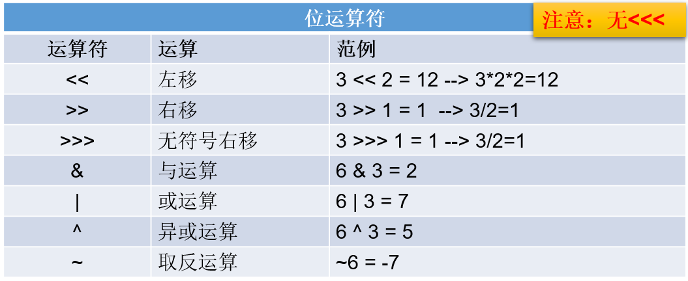
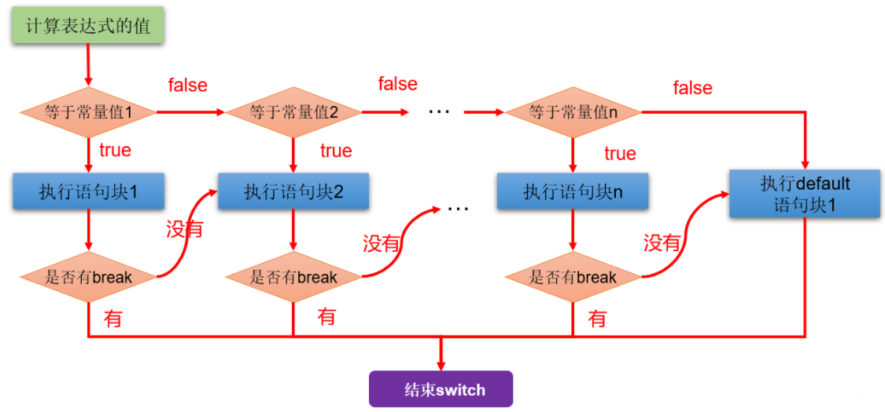
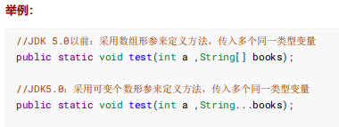
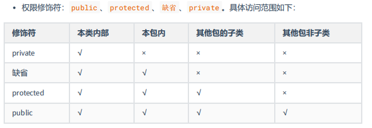
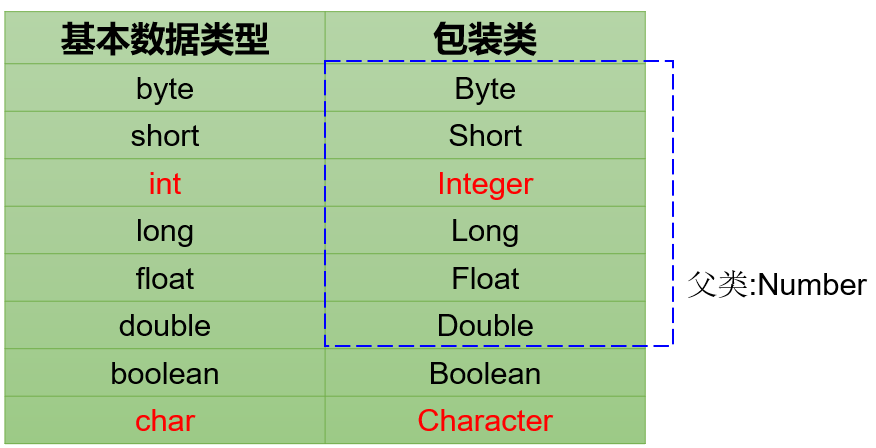
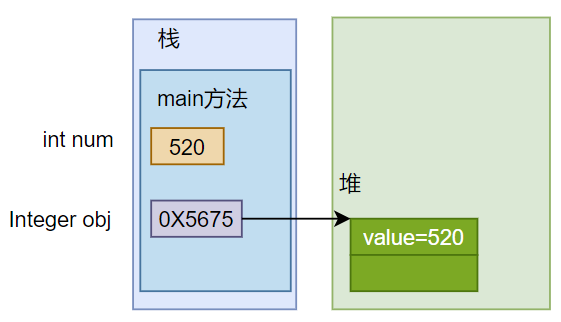
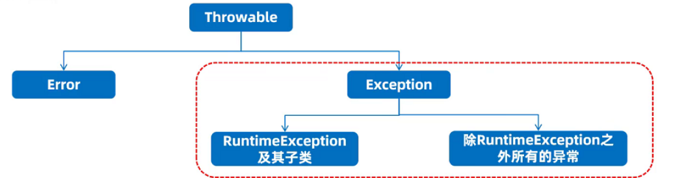

# Java基本语法

## 数据类型

- **基本数据类型**：`整型`、`浮点型`、`字符型`、`布尔型`。 

- **引用数据类型**：`数组`、 `类`、`接口`、`枚举`、`注解`、`记录`。 


### 自动类型提升

**规则：将取值范围小（或容量小）的类型自动提升为取值范围大（或容量大）的类型 。**

基本数据类型的转换规则如图所示：


（1）当把存储范围小的值（常量值、变量的值、表达式计算的结果值）赋值给了存储范围大的变量时

```java
int i = 'A';// char自动升级为int，其实就是把字符的编码值赋值给i变量了
double d = 10;// int自动升级为double
long num = 1234567; // 右边的整数常量值如果在int范围呢，编译和运行都可以通过，这里涉及到数据类型转换

//byte bigB = 130;// 错误，右边的整数常量值超过byte范围
long bigNum = 12345678912L;// 右边的整数常量值如果超过int范围，必须加L，显式表示long类型。否则编译不通过
```

（2）当存储范围小的数据类型与存储范围大的数据类型变量一起混合运算时，会按照其中最大的类型运算。

```java
int i = 1;
byte b = 1;
double d = 1.0;

double sum = i + b + d;// 混合运算，升级为double
```

（3）当byte,short,char数据类型的变量进行算术运算时，按照int类型处理。

```java
byte b1 = 1;
byte b2 = 2;
byte b3 = b1 + b2;// 编译报错，b1 + b2自动升级为int

char c1 = '0';
char c2 = 'A';
int i = c1 + c2;// 至少需要使用int类型来接收
System.out.println(c1 + c2);// 113 
```

### 强制类型转换

将`3.14` 赋值到`int` 类型变量会发生什么？产生编译失败，肯定无法赋值。

```java
int i = 3.14; // 编译报错
```

想要赋值成功，只有通过`强制类型转换`，将`double` 类型强制转换成`int` 类型才能赋值。

**规则：将取值范围大（或容量大）的类型强制转换成取值范围小（或容量小）的类型。**

> 自动类型提升是Java自动执行的，而强制类型转换是自动类型提升的逆运算，需要我们自己手动执行。

**转换格式：**

```java
数据类型1 变量名 = (数据类型1)被强转数据值;  //()中的数据类型必须<=变量值的数据类型
```

（1）当把存储范围大的值（常量值、变量的值、表达式计算的结果值）强制转换为存储范围小的变量时，可能会`损失精度`或`溢出`。

```java
int i = (int)3.14;//损失精度

double d = 1.2;
int num = (int)d;//损失精度

int i = 200;
byte b = (byte)i;//溢出
```

（2）当某个值想要提升数据类型时，也可以使用强制类型转换。这种情况的强制类型转换是`没有风险`的，通常省略。

```java
int i = 1;
int j = 2;
double bigger = (double)(i/j);
```

（3）声明long类型变量时，可以出现省略后缀的情况。float则不同。

```java
long l1 = 123L;
long l2 = 123;//如何理解呢？ 此时可以看做是int类型的123自动类型提升为long类型

//long l3 = 123123123123; //报错，因为123123123123超出了int的范围。
long l4 = 123123123123L;


//float f1 = 12.3; //报错，因为12.3看做是double，不能自动转换为float类型
float f2 = 12.3F;
float f3 = (float)12.3;
```

### 基本数据类型与String的运算

- String不是基本数据类型，属于引用数据类型
- 使用一对`""`来表示一个字符串，内部可以包含0个、1个或多个字符。
- 声明方式与基本数据类型类似。例如：String str = “你好”;

- 任意八种基本数据类型的数据与String类型只能进行连接“+”运算，且结果一定也是String类型

```java
System.out.println("" + 1 + 2);//12

int num = 10;
boolean b1 = true;
String s1 = "abc";

String s2 = s1 + num + b1;
System.out.println(s2);//abc10true

//String s3 = num + b1 + s1;//编译不通过，因为int类型不能与boolean运算
String s4 = num + (b1 + s1);//编译通过
```

## 运算符

运算符是一种特殊的符号，用以表示数据的运算、赋值和比较等。

运算符的分类：

- 按照`功能`分为：算术运算符、赋值运算符、比较(或关系)运算符、逻辑运算符、位运算符、条件运算符、Lambda运算符

|           分类            |                        运算符                        |
| :-----------------------: | :--------------------------------------------------: |
|     算术运算符（7个）     |                +、-、*、/、%、++、--                 |
|    赋值运算符（12个）     | =、+=、-=、*=、/=、%=、>>=、<<=、>>>=、&=、\|=、^=等 |
| 比较(或关系)运算符（6个） |                 >、>=、<、<=、==、!=                 |
|     逻辑运算符（6个）     |                &、\|、^、!、&&、\|\|                 |
|      位运算符（7个）      |               &、\|、^、~、<<、>>、>>>               |
|     条件运算符（1个）     |               (条件表达式)?结果1:结果2               |
|    Lambda运算符（1个）    |                          ->                          |

* 按照`操作数个数`分为：一元运算符（单目运算符）、二元运算符（双目运算符）、三元运算符 （三目运算符）

|           分类            |                  运算符                  |
| :-----------------------: | :--------------------------------------: |
| 一元运算符（单目运算符）  |    正号（+）、负号（-）、++、--、!、~    |
| 二元运算符（双目运算符）  | 除了一元和三元运算符剩下的都是二元运算符 |
| 三元运算符 （三目运算符） |         (条件表达式)?结果1:结果2         |

### 自加自减运算

- 单独使用
  - 变量在单独运算的时候，变量`前++`和变量`后++`，是没有区别的。
  - 变量`前++`   ：例如 `++a` 。
  - 变量`后++`   ：例如 `a++` 。

- 复合使用

  * 和`其他变量放在一起使用`或者和`输出语句放在一起使用`，`前++`和`后++`就产生了不同。

  - 变量`前++` ：变量先自增1，然后再运算。

  - 变量`后++` ：变量先运算，然后再自增1。

```java
public class ArithmeticTest {
	public static void main(String[] args) {
		// 其他变量放在一起使用
		int x = 3;
		//int y = ++x; // y的值是4，x的值是4，
		int y = x++; // y的值是3，x的值是4
		
		System.out.println(x);
		System.out.println(y);
		System.out.println("==========");
        
		// 和输出语句一起
		int z = 5;
		//System.out.println(++z);// 输出结果是6，z的值也是6
		System.out.println(z++);// 输出结果是5，z的值是6
		System.out.println(z);
        
	} 
}
```

变量和++（或--）谁在前面就先执行谁。

### 赋值运算符

- 当“=”两侧数据类型不一致时，可以使用自动类型转换或使用强制类型转换原则进行处理。
- 支持`连续赋值`，如：a = b = 1；

- 扩展赋值运算符： +=、 -=、*=、 /=、%=

  | 赋值运算符 |                           符号解释                           |
  | :--------: | :----------------------------------------------------------: |
  |    `+=`    | 将符号`左边的值`和`右边的值`进行`相加`操作，最后将结果`赋值给左边的变量` |
  |    `-=`    | 将符号`左边的值`和`右边的值`进行`相减`操作，最后将结果`赋值给左边的变量` |
  |    `*=`    | 将符号`左边的值`和`右边的值`进行`相乘`操作，最后将结果`赋值给左边的变量` |
  |    `/=`    | 将符号`左边的值`和`右边的值`进行`相除`操作，最后将结果`赋值给左边的变量` |
  |    `%=`    | 将符号`左边的值`和`右边的值`进行`取余`操作，最后将结果`赋值给左边的变量` |

```java
public class SetValueTest {
	public static void main(String[] args) {
        //举例说明 += , -=  *=  /=  %= 也是一样的
        short m1 = 10;
        m1 += 5;
        //相当于：
        //m1 = (short)(m1 + 5);
        System.out.println(m1);//15
	}
}
```

+=操作包含了一个强制类型转换，可以保证类型不变。

### 比较(关系)运算符


- 比较运算符的结果都是boolean型，也就是要么是true，要么是false。
- \>   <   >=  <= ：只适用于基本数据类型（除boolean类型之外）
- ==   != ：适用于基本数据类型和引用数据类型

```java
public class CompareTest {
	public static void main(String[] args) {
        // 区分好==和=的区别
        boolean b1 = false;
        if(b1 == true) {
            System.out.println("结果为真");
        } else {
            System.out.println("结果为假"); // 打印这个
        }

        if(b1 = true) {
            System.out.println("结果为真"); // 打印这个
        } else {
            System.out.println("结果为假");
        }

        if(b1 = false) {
            System.out.println("结果为真");
        } else {
            System.out.println("结果为假"); // 打印这个
        }
	}
}
```

== 比较左右两边的值是否相同，= 的作用是赋值，然后的是右边的值。

### 逻辑运算符


- 逻辑运算符，操作的都是boolean类型的变量或常量，而且运算得结果也是boolean类型的值。

- 运算符说明：
  - & 和 &&：表示"且"关系，当符号左右两边布尔值都是true时，结果才能为true。否则，为false。
  - | 和 || ：表示"或"关系，当符号两边布尔值有一边为true时，结果为true。当两边都为false时，结果为false
  - ! ：表示"非"关系，当变量布尔值为true时，结果为false。当变量布尔值为false时，结果为true。
  - ^ ：当符号左右两边布尔值不同时，结果为true。当两边布尔值相同时，结果为false。
    - 理解：异或，相异为真。

- 逻辑运算符用于连接布尔型表达式，在Java中不可以写成 3 < x < 6，应该写成x > 3 & x < 6 。


- **区分“&”和“&&”：**

  - 相同点：如果符号左边是true，则二者都执行符号右边的操作

  - 不同点：& （逻辑与）： 如果符号左边是false,则继续执行符号右边的操作

  ​                     && （短路与）：如果符号左边是false,则不再继续执行符号右边的操作

  - &&：短路与，左边为false就不执行右边，有短路的意味，优点是效率更高

  - 建议：开发中，推荐使用 && 

- **区分“|”和“||”：**


    - 相同点：如果符号左边是false，则二者都执行符号右边的操作


    - 不同点：|（逻辑或） ： 如果符号左边是true，则继续执行符号右边的操作
    
      ​               || （短路或）：如果符号左边是true，则不再继续执行符号右边的操作


    - 建议：开发中，推荐使用 ||


 代码举例：

```java
public class LoginTest {
	public static void main(String[] args) {
		int a = 3;
		int b = 4;
		int c = 5;

        //&和&&的区别
        System.out.println((a > b) & (a++ > c)); 
        System.out.println("a = " + a);
        System.out.println((a > b) && (a++ > c)); 
        System.out.println("a = " + a);
        System.out.println((a == b) && (a++ > c)); 
        System.out.println("a = " + a);
        
        //|和||的区别
        System.out.println((a > b) | (a++ > c)); 
        System.out.println("a = " + a);
        System.out.println((a > b) || (a++ > c)); 
        System.out.println("a = " + a);
        System.out.println((a == b) || (a++ > c)); 
        System.out.println("a = " + a);
        
		// ^ 异或；相同为false，不同为true
		System.out.println((a > b) ^ (a > c));
		System.out.println((a > b) ^ (a < c)); 
		System.out.println((a < b) ^ (a > c)); 
		System.out.println((a < b) ^ (a < c)); 
		System.out.println("===============");
		// ! 非；非false则true，非true则false
		System.out.println(!false);
		System.out.println(!true);
	}
}
```

### 位运算符




位运算符的运算过程都是基于二进制的补码运算。

### 条件运算符

- 条件运算符格式：

```java
(条件表达式)? 表达式1:表达式2
```

- 说明：条件表达式是boolean类型的结果，根据boolean的值选择表达式1或表达式2

  

- 如果运算后的结果赋给新的变量，要求表达式1和表达式2为同种或兼容的类型。

```java
public class ConditionExer1 {
    public static void main(String[] args) {
        //获取两个数的较大值
        int m1 = 10;
        int m2 = 20;

        int max = (m1 > m2)? m1 : m2;
        System.out.println("m1和m2中的较大值为" + max);
    }
}
```

与if-else的转换关系

- 凡是可以使用条件运算符的地方，都可以改写为if-else结构。


- 开发中，如果既可以使用条件运算符，又可以使用if-else，推荐使用条件运算符。因为执行效率稍高。

```java
//if-else实现获取两个数的较大值

int m1 = 10;
int m2 = 20;

int max;//声明变量max，用于记录m1和m2的较大值

if(m1 > m2){
    max = m1;
}else{
    max = m2;
}

System.out.println(max);
```

### 运算符优先级

运算符有不同的优先级，所谓优先级就是在表达式运算中的运算符顺序。

上一行中的运算符总是优先于下一行的。

| 优先级 |    运算符说明    |             Java运算符             |
| ------ | :--------------: | :--------------------------------: |
| 1      |       括号       |          `()`、`[]`、`{}`          |
| 2      |      正负号      |              `+`、`-`              |
| 3      |    单元运算符    |       `++`、`--`、`~`、`！`        |
| 4      | 乘法、除法、求余 |           `*`、`/`、`%`            |
| 5      |    加法、减法    |              `+`、`-`              |
| 6      |    移位运算符    |         `<<`、`>>`、`>>>`          |
| 7      |    关系运算符    | `<`、`<=`、`>=`、`>`、`instanceof` |
| 8      |    等价运算符    |             `==`、`!=`             |
| 9      |      按位与      |                `&`                 |
| 10     |     按位异或     |                `^`                 |
| 11     |      按位或      |                `|`                 |
| 12     |      条件与      |                `&&`                |
| 13     |      条件或      |                `||`                |
| 14     |    三元运算符    |               `? :`                |
| 15     |    赋值运算符    | `=`、`+=`、`-=`、`*=`、`/=`、`%=`  |
| 16     |   位赋值运算符   |  `&=`、`|=`、`<<=`、`>>=`、`>>>=`  |

> 建议：
>
> 1. 不要过多的依赖运算的优先级来控制表达式的执行顺序，这样可读性太差，尽量`使用()来控制`表达式的执行顺序。
> 2. 不要把一个表达式写得过于复杂，如果一个表达式过于复杂，则把它`分成几步`来完成。

## 流程控制语句

- 流程控制语句是用来控制程序中各`语句执行顺序`的语句。
- 程序设计中规定的`三种`流程结构，即：
  - **顺序结构**
    - 程序从上到下逐行地执行，中间没有任何判断和跳转。
  - **分支结构**
    - 根据条件，选择性地执行某段代码。
    - 有`if…else`和`switch-case`两种分支语句。
  - **循环结构**
    - 根据循环条件，重复性的执行某段代码。
    - 有`for`、`while`、`do-while`三种循环语句。
    - JDK5.0 提供了`foreach`循环，遍历集合、数组元素更方便

### 顺序结构

顺序结构就是程序`从上到下逐行`地执行。表达式语句都是顺序执行的。


````java
public class StatementTest{
	public static void main(String[] args){
		int x = 1;
		int y = 2;
		System.out.println("x = " + x);		
        System.out.println("y = " + y);	
    }
}
````

#### if-else条件判断结构

**格式：**

```java
if (条件表达式1) {
  	语句块1;
} else if (条件表达式2) {
  	语句块2;
}
...
}else if (条件表达式n) {
 	语句块n;
} else {
  	语句块n+1;
}
```

条件表达式必须是布尔表达式（关系表达式或逻辑表达式）或 布尔变量。

**执行流程图：**


**案例：**

```
成绩为100分时，奖励一辆跑车；
成绩为(80，99]时，奖励一辆山地自行车；
当成绩为[60,80]时，奖励环球影城一日游；
其它时，胖揍一顿。

默认成绩是在[0,100]范围内.
```

```java
public class Test {
    public static void main(String[] args) {
        int score = 67;
        if (score == 100) {
            System.out.println("奖励跑车");
        } else if (score > 80) {
            System.out.println("奖励自行车");
        } else if (score > 60) {
            System.out.println("一日游");
        } else {
            System.out.println("胖揍一顿");
        }
    }
}
```

####  switch-case选择结构

**格式：**

```java
switch(表达式){
    case 常量值1:
        语句块1;
        //break;
    case 常量值2:
        语句块2;
        //break; 
    // ...
   [default:
        语句块n+1;
        break;
   ]
}
```

**执行流程图：**



**使用注意点：**

- switch(表达式)中表达式的值必须是下述几种类型之一：byte，short，char，int，枚举 (jdk 5.0)，String (jdk 7.0)；
- case子句中的值必须是常量，不能是变量名或不确定的表达式值或范围；
- 同一个switch语句，所有case子句中的常量值互不相同；
- break语句用来在执行完一个case分支后使程序跳出switch语句块；
- 如果执行完case之后，没有遇到break，则会继续执行当前case之后的其它case中的执行语句。--->case穿透
- default子句是可选的。同时，位置也是灵活的。当没有匹配的case时，执行default语句。

**案例：**

```java
public class Test {
    public static void main(String[] args) {
        String season = "summer";
        switch (season) {
            case "spring":
                System.out.println("春意盎然");
                break;
            case "summer":
                System.out.println("夏至未至");
                break;
            case "autumn":
                System.out.println("秋高气爽");
                break;
            case "winner":
                System.out.println("大冬天");
                break;
            default:
                System.out.println("未知季节");
        }
    }
}
```

**利用case穿透：**

在switch语句中，如果case匹配上来，但是后面不写break，就会出现穿透现象，即不会判断下一个case的值，直接执行case的后面的语句，直到遇到break或者整个switch语句结束，执行终止。

**案例：**根据月份获取季节

```java
public class Test {
    public static void main(String[] args) {
        Scanner input = new Scanner(System.in);
        System.out.println("请输入月份：");
        int month = input.nextInt();
        switch (month) {
            case 12:
            case 1:
            case 2:
                System.out.println("冬天");
                break;
            case 3:
            case 4:
            case 5:
                System.out.println("春天");
                break;
            case 6:
            case 7:
            case 8:
                System.out.println("夏天");
                break;
            case 9:
            case 10:
            case 11:
                System.out.println("秋天");
                break;
            default:
                System.out.println("月份有误");
                break;
        }
        input.close();
    }
}
```

#### if-else与switch-case使用场景

关键在于判断的条件：

- 表示范围用 if
- 表示是否等于某个常量值用 switch

如果既可以用 if 也可以 switch，建议用 switch 因为效率稍微较高。

### 循环结构

循环结构就是在满足某些条件的情况下，反复执行一段代码。

####  for循环

**语法格式：**


```java
for (①初始化部分; ②循环条件部分; ④迭代部分)｛
         	③循环体部分;
｝
```

**执行过程：**①-②-③-④-②-③-④-②-③-④-.....-②

**执行流程图：**


**说明：**

- for(;;)中的两个；不能多也不能少
- ①初始化部分可以声明多个变量，但必须是同一个类型，用逗号分隔
- ②循环条件部分为boolean类型表达式，当值为false时，退出循环
- ④可以有多个变量更新，用逗号分隔

**案例：**输出5行hello

```java
public class Test {
    public static void main(String[] args) {
        for (int i = 0; i < 5; i++) {
            System.out.println("hello");
        }
    }
}
```

#### while循环

**语法格式：**

```java
①初始化部分
while(②循环条件部分)｛
    ③循环体部分;
    ④迭代部分;
}
```

**执行过程：**①-②-③-④-②-③-④-②-③-④-...-②

**执行流程图：**


**说明：**

- while(循环条件)中循环条件必须是boolean类型。
- 注意不要忘记声明④迭代部分。否则，循环将不能结束，变成死循环。
- for循环和while循环可以相互转换。二者没有性能上的差别。实际开发中，根据具体结构的情况，选择哪个格式更合适、美观。
- for循环与while循环的区别：初始化条件部分的作用域不同。

**案例：**输出5行hello

```java
public class Test {
    public static void main(String[] args) {
        int i = 1;
        while (i <= 5) {
            System.out.println("hello");
            i++;
        }
    }
}
```

#### do-while循环

**语法格式：**

```java
①初始化部分;
do{
	③循环体部分
	④迭代部分
}while(②循环条件部分); 
```

**执行过程：**①-③-④-②-③-④-②-③-④-...-②

**执行流程图：**


**说明：**

- 结尾while(循环条件)中循环条件必须是boolean类型
- do{}while();最后有一个分号
- do-while结构的循环体语句是至少会执行一次，这是和for和while是不一样的地方
- 循环的三个结构for、while、do-while三者是可以相互转换的。

**案例：**体会至少循环一次

```java
public class Test {
    public static void main(String[] args) {
        int i = 5;
        do {
            System.out.println("hello");
            i--;
        } while (i > 5);
    }
}
```

#### 对比三种循环语句

- **三种循环语句都具有四个要素：**
  - 循环变量的初始化条件
  - 循环条件
  - 循环体语句块
  - 循环变量的修改的迭代表达式

* **从循环次数角度分析**
  * do-while循环至少执行一次循环体语句。
  * for和while循环先判断循环条件语句是否成立，然后决定是否执行循环体。
* **如何选择**
  * 遍历有明显的循环次数（或范围）的需求，选择for循环
  * 遍历没有明显的循环次数（或范围）的需求，选择while循环
  * 如果循环体语句块至少执行一次，可以考虑使用do-while循环
  * 本质上：三种循环之间完全可以互相转换，都能实现循环的功能

- **无限循环**
  - 最简单"无限"循环格式：`while(true)` , `for(;;)` 
  - 开发中，有时并不确定需要循环多少次，需要根据循环体内部某些条件，来控制循环的结束（使用break）。

- 嵌套循环
  - 嵌套循环是指一个循环结构A的循环体是另一个循环结构B
  - 实际开发中，一般见到的嵌套循环是两层，最多不会超过三层，如果超过三层需要重新梳理解决方案，否则可读性很差。

#### break和continue

|          | 适用范围              | 作用                                         |
| -------- | --------------------- | -------------------------------------------- |
| break    | 循环结构、switch-case | 一旦执行，就结束当前循环结构                 |
| continue | 循环结构              | 一旦执行，就结束本轮循环，继续执行下一轮循环 |

```java
public class Test {
    public static void main(String[] args) {
        for (int i = 0; i < 10; i++) {
            if (i % 4 == 0) {
                break;
            }
            System.out.print(i + " ");
        }
    }
}
```

第一轮时直接结束循环，什么都没打印。

```java
public class Test {
    public static void main(String[] args) {
        for (int i = 0; i < 10; i++) {
            if (i % 4 == 0) {
                continue;
            }
            System.out.print(i + " ");
        }
    }
}
```

打印：1 2 3 5 6 7 9 

## 数组

数组(Array)，是多个相同类型数据按一定顺序排列的集合，并使用一个名字命名，并通过编号的方式对这些数据进行统一管理。


**数组的特点：**

- 数组本身是`引用数据类型`，而数组中的元素可以是`任何数据类型`，包括基本数据类型和引用数据类型。
- 创建数组对象会在内存中开辟一整块`连续的空间`。占据的空间的大小，取决于数组的长度和数组中元素的类型。
- 数组中的元素在内存中是依次紧密排列的，有序的。
- 数组，一旦初始化完成，其长度就是确定的。数组的`长度一旦确定，就不能修改`。
- 我们可以直接通过下标(或索引)的方式调用指定位置的元素，速度很快。
- 数组名中引用的是这块连续空间的首地址。
- 每个数组都有一个属性length指明它的长度，例如：arr.length 指明数组arr的长度(即元素个数)
- 下标从[0]开始，下标范围是[0, 数组的长度-1]，即[0, 数组名.length-1]

**数组的分类：**

1、按照元素类型分：

- 基本数据类型元素的数组：每个元素位置存储基本数据类型的值
- 引用数据类型元素的数组：每个元素位置存储对象

2、按照维度分：

- 一维数组：存储一组数据
- 二维数组：存储多组数据，相当于二维表，一行代表一组数据

### 数组初始化

**静态初始化：**

- 在数组变量的初始化时，同时对数组赋值，称为静态初始化。

- 静态初始化，本质是用静态数据（编译时已知）为数组初始化。此时数组的长度由静态数据的个数决定。

- 静态初始化格式：

```java
int[] arr1 = new int[]{1,2,3,4,5};//正确
int[] arr2 = {1,2,3,4,5};//正确

int[] arr3;
arr3 = new int[]{1,2,3,4,5};//正确

int[] arr = new int[5]{1,2,3,4,5};//错误的，后面有{}指定元素列表，就不需要在[]中指定元素个数了。
int[] arr4;
arr4 = {1,2,3,4,5};//错误
```

**动态初始化：**

- 数组变量的初始化时指明数组的长度，并且不对数组赋值，称为动态初始化。
- 动态初始化中，只确定了元素的个数（即数组的长度），而元素值此时只是默认值，还并未真正赋自己期望的值。数据需要后续单独一个一个赋值。

- 动态初始化格式：

```java
int[] arr1 = new int[5];//正确

int[] arr2;
arr2 = new int[5];//正确
```

### 常用操作

访问和修改：

````java
int[] arr = {10, 20, 30, 40, 50};
int element = arr[2]; // 访问数组第三个元素（索引为 2）
arr[3] = 100; // 修改数组中的第四个元素
````

遍历：

````java
int[] arr = {1, 2, 3, 4, 5};
for (int i = 0; i < arr.length; i++) {
    System.out.println(arr[i]);
}

// 在用不上下表的循环中，用增强for更简洁
for (int num : arr) {
    System.out.println(num);
}
````

排序：

````java
int[] arr = {3, 1, 4, 1, 5, 9, 2, 6};
Arrays.sort(arr); // 对数组进行升序排序
````

查找某个元素的索引：

````java
int[] arr = {1, 2, 3, 4, 5};
int index = Arrays.binarySearch(arr, 3); // 在已排序的数组中查找元素 3 的索引
````

拷贝：

````java
int[] source = {1, 2, 3, 4, 5};
int[] target1 = Arrays.copyOf(source, source.length);
````

数组转字符串：

````java
int[] arr = {1, 2, 3, 4, 5};
String arrString = Arrays.toString(arr); // 将数组转换成字符串
System.out.println(arrString); // 输出数组内容
````

### 练习

```java
// 首位交换数据 1,2,3,4,5
int[] arr = {1, 2, 3, 4, 5};
for (int i = 0, j = arr.length - 1; i < j; i++, j--) {
    int temp = arr[i];
    arr[i] = arr[j];
    arr[j] = temp;
}
System.out.println(Arrays.toString(arr));
```

```java
// 打乱数据 1 - 5
int[] arr = {1, 2, 3, 4, 5};
Random r = new Random();
// 打乱原理：遍历一遍，随机交换元素，循环中用随机数生成下标，然后交换
for (int i = 0; i < arr.length; i++) {
    int temp = arr[i];
    int index = r.nextInt(arr.length);
    arr[i] = arr[index];
    arr[index] = temp;
}
// 打印打乱后的数组
System.out.println(Arrays.toString(arr));
```

```java
// 打印101 - 200 之间的素数
// 已知信息：素数就是质数，只有1和他本身两个因数的数是质数，因数是能整除他本身的数
// 分析：质数是只能被1和他本身整除，即 2 到他本身-1 的数都不能整除
for (int i = 101; i <= 200; i++) {
    // 写在循环里面，就不用恢复现场了
    boolean flag = true;
    // 循环内 再循环2到本身-1，判断是否整除，如果都不能整除则就是质数，然后打印
    for (int j = 2; j < i; j++) {
        // 只要有一个数能整除就不是素数，因此结束循环
        if (i % j == 0){
            flag = false;
            break;
        }
    }
    if (flag) {
        System.out.println(i + "是素数");
    }
}
```

# 面向对象

## 重载

重载就是在同一个类中，方法名相同，但是参数列表不同的方法，对访问权限和返回值没有要求，可以相同也可以不相同。

这样可以使得实现相同逻辑功能的方法共用一个方法名，比如相加方法，可以整数相加，也可以小数相加等，这样的好处是调用方法时，只用记住一个方法名就行了，在代码编写方面，可以使得代码更易于理解，清晰，更好维护。

我的理解是，重载是在编程语言层面上的在编写方法时的一种机制，可以让有相同功能的方法公用一个方法名，只需保持参数列表不同就可以同时存在同名的方法，这样的好处是，省去了一些方法在命名方面的麻烦，在方法调用方面也更方便，只需控制参数列表，即可调用不同的方法。

## 可变参数

有的时候方法传入的参数是不确定的，传统的做法使用数组来做形参，为了进一步理解可变参数，提出了可变参数的机制。

可变参数是为了解决方法的参数不确定的问题，在方法上定义可变参数，在调用方法时，可以传递任意数量的参数，但是要同类型，因为可变参数的底层是数组，相当于在形参上定义了一个数组，因此用的时候把它当成数组用即可。




用法就是在写形参的时候，在类型后面跟省略号，然后写一个空格，然后再变量名，在方法内部，把它当成数组一样用就行了。

## 方法的参数传递机制

java中只有一种参数传递机制：值传递，也就是将内存中保存的值传递过去，基本数据类型传的是具体的值，引用数据类型传递的是地址值，因为基本数据类型在栈中保存的就是具体的值，引用数据类型在栈中保存的是对象的地址。

## 封装

封装的意思是将类中的属性和方法进行隐藏，只暴露给信得过的类。

通过封装可以保证数据的安全性和一致性。

Java是通过访问权限修饰符对类的成员进行权限控制从而实现封装的。

访问权限修饰符：



- public：跨包（包外权限）
- protected：本包，及跨包的子类（子类权限）
- 缺省：本包（包权限）
- private：本类（类权限）


构造方法用于初始化成员变量

this与super

this表示当前对象，可以**调用成员和方法（包括构造方法）**

super表示父类对象，可以调用**非私有**的父类的成员和方法，以及**直接父类**的构造方法

## 继承

为了复用代码，减少冗余因此提出了继承。

虽然叫继承，但是其真正的含义我认为正如其英文extends所言，即扩展。

子类通过继承，可以获得父类所有的示例（**非静态**）变量和示例（**非静态**）方法，但是子类不能直接访问父类的私有变量和私有方法，可以通过继承父类的set/get间接访问私有变量。

即，在子类中**可以直接**访问父类**非静态且非私有**的变量和方法（包括构造方法）：

- 变量：public、protected、缺省、static、final修饰的变量
- 方法：public、protected、缺省、static、final、super()

## 重写

子类重写父类后，若不满意父类的方法可以对父类进行重写。

- 重写父类的方法必须保证**方法名和参数列表相同**
- **访问修饰符：**子类方法的访问权限要**大于等于**父类的方法，例如：public >= protected，权限比父类的大是为了多态的时候能访问到。
- **返回值：**子类方法的返回值要**小于等于**父类方法的返回值，例如：student <= people，返回值小于父类是为了遵守自动类型转换。
- **异常：**子类方法的抛出的异常要**小于等于**父类方法抛出的异常，例如：RuntimeException <= Exception，为了多动态时产生异常能捕获。

## 多态

多态，我的理解是对同一种行为，不同的对象会有不一样的表现。

当不确定是哪一种类型，但是可以确定是某一类类型时，可以用多态。

在Java中的体现是，父类的引用指向子类的对象，例如：People student = new Student();

程序不必为每一个派生类编写功能调用，只需要对抽象基类进行处理即可，大大提高程序的可复用性，可扩展性，可维护性。

案例：

形参体现多态：

```java
public class Person{
    private Pet pet;
    public void adopt(Pet pet) {//形参是父类类型，实参是子类对象
        this.pet = pet;
    }
    public void feed(){
        pet.eat();//pet实际引用的对象类型不同，执行的eat方法也不同
    }
}
```

```java
public class TestPerson {
    public static void main(String[] args) {
        Person person = new Person();

        Dog dog = new Dog();
        dog.setNickname("小白");
        person.adopt(dog);//实参是dog子类对象，形参是父类Pet类型
        person.feed();

        Cat cat = new Cat();
        cat.setNickname("雪球");
        person.adopt(cat);//实参是cat子类对象，形参是父类Pet类型
        person.feed();
    }
}
```

方法返回值体现多态：

```java
public class PetShop {
    //返回值类型是父类类型，实际返回的是子类对象
    public Pet sale(String type){
        switch (type){
            case "Dog":
                return new Dog();
            case "Cat":
                return new Cat();
        }
        return null;
    }
}
```

```java
public class TestPetShop {
    public static void main(String[] args) {
        PetShop shop = new PetShop();

        Pet dog = shop.sale("Dog");
        dog.setNickname("小白");
        dog.eat();

        Pet cat = shop.sale("Cat");
        cat.setNickname("雪球");
        cat.eat();
    }
}
```

- 编译看左边：编译的时候编译器会检查父类（左边）中是否存在此方法
- 运行看右边：运行时调用的是哪个方法由子类（右边）决定

多态使用的前提：继承、重写了方法。

**好处**：变量引用的子类对象不同，执行的方法就不同，实现动态绑定。代码编写更**灵活**、功能更强大，可维护性和扩展性更好了。

**弊端**：一个引用类型变量如果声明为父类的类型，但实际引用的是子类对象，那么该变量就**不能再访问子类中添加的属性和方法**。

开发中：

使用父类**做方法的形参**，是多态使用最多的场合。即使增加了新的子类，方法也无需改变，提高了扩展性，符合开闭原则。

**类型转换：**

由于在多态中，不能使用子类的方法，因此需要类型转换才能调用子类的方法。

可以用基本数据类型的转换来理解：

自动类型转换（向上转型）：小范围转大范围，子类转父类

强制类型转换（向下转型）：大范围转小范围，父类转子类

上指的是父类。自动类型转换一定是对的，强制类型转换不一定对，可以用关键字 instanceof 判断，如果是ture则表示一定是安全的。

## Object类

是所有类的父类，包含一些方法，比如 toString、equals、clone、hashCode、getClass、、finalize、notify、notifyAll、wait 外加两个重载的wait方法。

## native

在源码中会看到被native修饰的本地方法。由于一些功能实现起来比较复杂或低效，因此Java官方决定用c/c++实现，这些方法没有方法体，但是用起来和普通的方法一样。

## static

static意味静态的，被static修饰的方法和变量属于类变量，随着类的加载而加载。

当有一些变量或方法等想让类的所有对象的都公同拥有时，可以用static修饰。

static可以修饰变量、方法、代码块、内部类，被static修饰的成员是属于类，随着类加载而加载，所有的对象都共用这些成员，解决了属性和方法共享的问题。

一般用类名.方法名调用，不推荐用对象名.方法名。

静态的内部只能访问静态的。

## 单例模式

设计模式是在大量的实践中总结出的经验，对一些问题总结出了优秀的解决方案，单例模式就是其中一种解决方案。

单例模式可以保证类只有一个实例。

单例模式应用于需要复用实例的场景下，比如比较消耗资源的读取配置文件对象，我们希望能一直复用这种对象，因为创建这种对象比较消耗资源。

单例模式保证只有一个实例的原理是，将构造方法私有化，让外界无法创建元素，并且只用本类的静态方法获取到本类所创建的唯一实例。

单例模式分为饿汉式和懒汉式，饿汉式就是提前创建好实例，需要的时候直接返回， 懒汉式是当第一次获取实例的时候才创建实例，然后返回给对方，以后一直复用这个对象。

**饿汉式：**

```java
public class Singleton {
   private static final Singleton single = new Singleton();

   private Singleton() {}

   public static Singleton getInstance() {
      return single;
   }
}
```

饿汉式就是先创建好示例，要用的时候直接返回。

**懒汉式：**

```java
public class Singleton {
    private static Singleton single;
    
    private Singleton() {}

    public static Singleton getInstance() {
        if (single == null) {
            single = new Singleton();
        }
        return single;
    }
}
```

懒汉式，就是当第一次使用的时候才会创建对象，好处是可以节约一定内存。但是以上的实现方式在单线成是对的，多线程是错的。

## 代码块

代码块是类的成员之一，用一对花括号包裹代码，里面的代码先于构造方法执行。

有些时候对变量初始化操作比较复杂，比如读取文件等，此时可以用代码块来初始化成员变量。

非静态代码块先于构造器执行，如果多个重载的构造器中，有重复的代码，且先于其他操作，可以将这些代码抽取出来放入代码块里，减少代码冗余。

被static修饰就是静态代码块，拥有静态的特点，属于类。

## final

final表示最终，不可修改的。

修饰类表示不能被继承。

修改方法表示不能被重写。

修改变量表示一旦赋值就不能修改，即常量，常量一般全字母大写。

## 抽象类与抽象方法

被abstract修饰的类叫做抽象类，可以定义抽象方法，抽象方法就是用abstract修饰的方法，没有方法体，直接跟分号。

随着继承的层次越来越高，越高级的父类越抽象，越通用，方法给出具体的实现没有意义，因此会想在类中定义抽象方法，当想要定义抽象方法时可以用抽象类。

被abstract修饰的类就是准备让子类继承的，abstract方法就是准备让子类重写的，因此：

- 不能用abstract修饰变量、代码块、构造器；

- 不能用abstract修饰私有方法、静态方法、final的方法、final的类。

```java
public abstract class Animal {
    public abstract void eat();
}
```

## 模板方法模式

模板方法模式，又叫模板模式，是行为型的模式，方法的调用顺序确定，但是个别方法是抽象的，由子类来决定具体的实现。

将通用的步骤放在抽象父类里，然后用子类个性化实现，其实就是抽象化思想。

```java
public class TemplateMethodTest {
	public static void main(String[] args) {
		BankTemplateMethod btm = new DrawMoney();
		btm.process();

		BankTemplateMethod btm2 = new ManageMoney();
		btm2.process();
	}
}
abstract class BankTemplateMethod {
	// 具体方法
	public void takeNumber() {
		System.out.println("取号排队");
	}

	public abstract void transact(); // 办理具体的业务 //钩子方法

	public void evaluate() {
		System.out.println("反馈评分");
	}

	// 模板方法，把基本操作组合到一起，子类一般不能重写
	public final void process() {
		this.takeNumber();

		this.transact();// 像个钩子，具体执行时，挂哪个子类，就执行哪个子类的实现代码

		this.evaluate();
	}
}

class DrawMoney extends BankTemplateMethod {
	public void transact() {
		System.out.println("我要取款！！！");
	}
}

class ManageMoney extends BankTemplateMethod {
	public void transact() {
		System.out.println("我要理财！我这里有2000万美元!!");
	}
}

```

抽象类就是一种模板，模板方法模式就是一个流程有多个方法，有些方法不确定，由子类去实现，然后用多态的形式调用即可。

模板方法模式其实就是抽象类的应用，将公共的提取进父类，子类重写特定方法。

## 接口

接口是一种规范，是一组标准，你遵守了这些规则，你就能获得对应的能力。

JDK8.0之前：由公共静态常量和公共抽象方法组成。

JDK8.0及以后：

- 公共静态方法：有一些静态方法是为了接口服务的，因此干脆将这些方法定义在接口中，这样更**方便维护**。
- 公共默认方法：随着时间的推移，需要添加新功能，但是如果在接口中添加新的抽象方法，就会导致以前的实现类要重写新的抽象方法，为了**兼容**旧版本的接口，因此允许添加默认方法，实现类可以重写，也可以不重写。用关键字default表示，但是在实现类中重写时要去掉，因为类中没有默认方法的概念。

JDK9.0及以后：

- 私有方法：因为有了静态方法和默认方法这种有具体实现的方法，因此就会有共同的代码，可以抽取出来复用，但是又希望只有接口内部使用，因此有了私有方法。

例子：


为了保持简洁上述代码中灰色的部分要去掉，此处只是演示。

接口中要么公共要么私有，大多数是公共，因为接口就是给别人实现的。

default方法只在接口中定义，类中没有默认方法的概念。


一个类可以实现多个接口。

接口支持多继承，即一个接口可以继承多个接口。

接口不能创建对象。

接口中的静态方法只能用类名调用。

默认方法冲突：

- 接口与类中的默认方法冲突：类优先，但是可以用 **接口名.super.方法名** 调用接口的默认方法，也可以重写。

常量名冲突：

- 当实现的接口和父类中，常量名重复时，用super.x调用父类的，用接口名.x调用接口的。


类是创建对象的模板，接口是类可以拥有的能力。

## 内部类

内部类就是在类中定义的类，比如在类A中定义了类B，则类B就是内部类。

类A依赖于类B，并且类B只被类A使用，此时我们就会将类B作为内部类，定义在类A中，遵守了高内聚，低耦合的原则。

**内部类的分类：**


- 成员内部类：在类中定义的类，作为类的成员之一。
  - 静态成员内部类：内部类**不使用**外部类的非静态成员，则用static修饰。
  - 非静态成员内部类：内部类**要使用**外部类的非静态成员。

实例化静态内部类

```
外部类名.静态内部类名 变量 = 外部类名.静态内部类名();
变量.非静态方法();
```

实例化非静态内部类

```
外部类名 变量1 = new 外部类();
外部类名.非静态内部类名 变量2 = 变量1.new 非静态内部类名();
变量2.非静态方法();
```

非静态内部类要用**外部类的对象**创建。

静态内部类用**外部类名.内部类名**创建。


- 局部内部类：在方法中定义的类，类似于方法中的局部变量。

  - 非匿名局部内部类：在方法中定义一个完整的类

  

  在方法中创建对象，然后直接用。

  - 匿名（局部）内部类：没有名字的局部内部类。

    匿名内部类是在方法中，继承某个父类的子类，或实现某个接口的类，并且只使用一次，因此就不必取名字了，省去不必要的麻烦，因此称为匿名。

    

## 枚举类

枚举是一种特殊的类，它的只有固定的几个对象，并且用户不能创建对象。

当某一事物只有固定几种情况时可以用枚举，比如月份、星期、性别等。

JDK5.0 之前需要自定义枚举，JDK5.0之后Java提供了enum关键字快速创建枚举。

枚举类其实继承了Enum类，Enum类重写了toString等常用方法。

自定义：

```java
public class Season{
    //季节的名称
    private final String SEASONNAME;

    //季节的描述
    private final String SEASONDESC;

    private Season(String seasonName,String seasonDesc){
        this.SEASONNAME = seasonName;
        this.SEASONDESC = seasonDesc;
    }
    public static final Season SPRING = new Season("春天", "春暖花开");
    public static final Season SUMMER = new Season("夏天", "夏日炎炎");
    public static final Season AUTUMN = new Season("秋天", "秋高气爽");
    public static final Season WINTER = new Season("冬天", "白雪皑皑");
    
}
```

和定义一般类不同的是私有，构造方法，在类里创建公共静态常量对象，有点类似于单例模式。

用enum关键字：

```java
public enum SeasonEnum {
    SPRING("春天","春风又绿江南岸"),
    SUMMER("夏天","映日荷花别样红"),
    AUTUMN("秋天","秋水共长天一色"),
    WINTER("冬天","窗含西岭千秋雪");

    private final String seasonName;
    private final String seasonDesc;
    
    private SeasonEnum(String seasonName, String seasonDesc) {
        this.seasonName = seasonName;
        this.seasonDesc = seasonDesc;
    }
}
```

* 枚举类的常量对象列表必须在枚举类的首行，因为是常量，所以建议大写。
* 列出的实例系统会自动添加 public static final 修饰。
* 如果常量对象列表后面没有其他代码，那么“；”可以省略，否则不可以省略“；”。
* 编译器给枚举类默认提供的是private的无参构造，如果枚举类需要的是无参构造，就不需要声明，写常量对象列表时也不用加参数
* 如果枚举类需要的是有参构造，需要手动定义，有参构造的private可以省略，调用有参构造的方法就是在常量对象名后面加(实参列表)就可以。
* 枚举类默认继承的是java.lang.Enum类，因此不能再继承其他的类型。
* JDK5.0 之后switch，提供支持枚举类型，case后面可以写枚举常量名，无需添加枚举类作为限定。

常用方法：

- String toString(): 默认返回的是常量名（对象名），可以继续手动重写
- static 枚举类型[] values():返回枚举类型的对象数组。该方法可以很方便地遍历所有的枚举值，是一个静态方法
- static 枚举类型 valueOf(String name)：可以把一个字符串转为对应的枚举类对象。要求字符串必须是枚举类对象的“名字”。如不是，会有运行时异常：IllegalArgumentException。
- String name():得到当前枚举常量的名称。建议优先使用toString()。
- int ordinal():返回当前枚举常量的次序号，默认从0开始。

枚举实现接口：

```java
interface Info{
	void show();
}

//使用enum关键字定义枚举类
enum Season1 implements Info{
	//1. 创建枚举类中的对象,声明在enum枚举类的首位
	SPRING("春天","春暖花开"){
		public void show(){
			System.out.println("春天在哪里？");
		}
	},
	SUMMER("夏天","夏日炎炎"){
		public void show(){
			System.out.println("宁静的夏天");
		}
	},
	AUTUMN("秋天","秋高气爽"){
		public void show(){
			System.out.println("秋天是用来分手的季节");
		}
	},
	WINTER("冬天","白雪皑皑"){
		public void show(){
			System.out.println("2002年的第一场雪");
		}
	};
	
	//2. 声明每个对象拥有的属性:private final修饰
	private final String SEASON_NAME;
	private final String SEASON_DESC;
	
	//3. 私有化类的构造器
	private Season1(String seasonName,String seasonDesc){
		this.SEASON_NAME = seasonName;
		this.SEASON_DESC = seasonDesc;
	}
	
	public String getSEASON_NAME() {
		return SEASON_NAME;
	}

	public String getSEASON_DESC() {
		return SEASON_DESC;
	}
}
```

## 注解

注解（Annotation）是写在类、方法、变量等上面的形如`@注解名`的代码，可以理解为给程序看的注释。  

注解从JDK5.0中引入，可以在源文件中插入一些元信息，起到说明，配置的功能。

JDK内置三个基本注解：

`@Override`: 限定重写父类方法，该注解只能用于方法

`@Deprecated`: 用于表示所修饰的元素(类，方法等)已过时。通常是因为所修饰的结构危险或存在更好的选择

`@SuppressWarnings`: 抑制编译器警告

**元注解：**

用于对其他注解起说明作用的注解。

（1）**@Target：**用于描述注解的**使用范围**

* 可以通过枚举类型ElementType的10个常量对象来指定
* TYPE，METHOD，CONSTRUCTOR，PACKAGE.....

（2）**@Retention：**用于描述注解的**生命周期**

* 可以通过枚举类型RetentionPolicy的3个常量对象来指定
* SOURCE（源代码）、CLASS（字节码）、RUNTIME（运行时）
* `唯有RUNTIME阶段才能被反射读取到`。

（3）**@Documented**：表明这个注解应该被 javadoc工具记录。

（4）**@Inherited：**允许子类继承父类中的注解

**自定义注解：**

* 自定义注解可以通过四个元注解@Retention,@Target，@Inherited,@Documented，分别说明它的声明周期，使用位置，是否被继承，是否被生成到API文档中。
* Annotation 的成员在 Annotation 定义中以无参数有返回值的抽象方法的形式来声明，我们又称为配置参数。返回值类型只能是八种基本数据类型、String类型、Class类型、enum类型、Annotation类型、以上所有类型的数组
* 可以使用 default 关键字为抽象方法指定默认返回值
* 如果定义的注解含有抽象方法，那么使用时必须指定返回值，除非它有默认值。格式是“方法名 = 返回值”，如果只有一个抽象方法需要赋值，且方法名为value，可以省略“value=”，所以如果注解只有一个抽象方法成员，建议使用方法名value。

```java
@Target({ElementType.TYPE, ElementType.METHOD})
@Retention(RetentionPolicy.RUNTIME)
public @interface MyAnnotation {
    String value() default "这是自定义注解";
    String desc();
}
```

```java
@MyAnnotation(desc = "使用自定义注解")
public void eat() {
   System.out.println("吃饭中。。。");
}
```

```java
//获取方法上自定义注解中的内容
Method m1 = Animal01.class.getDeclaredMethod("eat");
MyAnnotation annotation = m1.getAnnotation(MyAnnotation.class);
System.out.println(annotation.value());
System.out.println(annotation.desc());
```

## JUnit单元测试

单元测试是一种白盒测试，对每个方法进行测试，尽量每个分支都测试到。

JUnit 是一个测试框架，可以用于单元测试。

JUnit4版本，要求@Test标记的方法必须满足如下要求：

- 所在的类必须是public的，非抽象的，包含唯一的无参构造器。
- @Test标记的方法本身必须是public，非抽象的，非静态的，void无返回值，()无参数的。

## 包装类

包装类是指封装了基本数据类型的类。

基本数据类不能应用于针对引用数据类型的API，如：泛型，因此有了包装类。

八种基本数据类型都有对应的包装类：





**装箱**：基本数据类型转包装类

```java
Integer obj1 = new Integer(4);//使用构造函数函数
Integer obj2 = Integer.valueOf(4);//使用包装类中的valueOf方法
```

**拆箱**：包装类转基本数据类型

```java
Integer obj = new Integer(4);
int num1 = obj.intValue();
```

**自动装箱与拆箱：**

由于经常需要装箱与拆箱，因此JDK5.0时就已支持自动装箱与拆箱。

```java
Integer i = 4;//自动装箱。相当于Integer i = Integer.valueOf(4);
i = i + 5;//等号右边：将i对象转成基本数值(自动拆箱) i.intValue() + 5;
//加法运算完成后，再次装箱，把基本数值转成对象。
```

> 注意：只能与自己对应的类型之间才能实现自动装箱与拆箱。

```java
Integer i = 1;
Double d = 1;//错误的，1是int类型
```

**包装类的缓存对象：**

| 包装类    | 缓存对象    |
| --------- | ----------- |
| Byte      | -128~127    |
| Short     | -128~127    |
| Integer   | -128~127    |
| Long      | -128~127    |
| Float     | 没有        |
| Double    | 没有        |
| Character | 0~127       |
| Boolean   | true和false |

# 异常

程序中的异常指的不是语法错误或逻辑错误，而是指程序的执行过程中出现非正常的情况，如果不处理会导致程序非正常终止，不会执行出现异常之后的代码了。

Java将不同的异常定义为了类，一旦出现了异常就会创建对应异常类的对象，并抛出（throw）异常，如果代码中没有捕获（catch）异常，这个异常就会将程序终止。

如何对待异常？

第一种是摆烂，哦发生异常了，哦程序终止了，那就终止了呗。当然，这在实际开发种是不可取的。

第二种是写代码的时候尽可能考虑各种情况，尽量避免异常，对于避免不了的异常进行**异常处理**，这样才能让程序继续执行下去。

在Java，异常类的体系如下：



**Error：**系统级别的异常，代码无法控制。

**Exception：**表示程序可以处理的异常。

- **RuntimeException及其子类：**运行时异常（即runtime异常、unchecked异常、非受检异常），编译器不会警告，一般由开发者编写代码不当引起的，如空指针，数组越界。
- **除RuntimeException之外的所有异常：**编译时异常（即checked异常、受检异常），编译器会警告，提醒开发者可能会出现异常，如果不进行异常处理，则编译不通过，如日期解析异常。

## 异常处理

在写代码时，为了不出现异常要编写对异常的容错代码，如运算x/y，要检查y是否为0，数值是否为空，是否是字符等，但是这就有一个问题，就是代码多长，过于臃肿，因此提出了异常处理机制，思路就是将这部分代码可能出现的异常一起处理，使代码更简洁。

异常处理有两种方式：

- 捕获异常：try-catch-finally
- 声明异常：throws + 异常对象

### 捕获异常

````java
try{
	......	//可能产生异常的代码
}
catch( 异常类型1 e ){
	......	//当产生异常类型1型异常时的处置措施
}
catch( 异常类型2 e ){
	...... 	//当产生异常类型2型异常时的处置措施
}  
finally{
	...... //无论是否发生异常，都无条件执行的语句
} 
````

在try块中，在发生异常以后的代码不会执行，会跳到catch进行捕获，但是有一些代码我们希望无论发不发生异常都要执行，例如，数据库连接、输入流输出流、Socket连接、Lock锁的关闭等，因此这些代码通常会写在finally中。

不论在try代码块中是否发生了异常事件，catch语句是否执行，catch语句是否有异常，catch语句中是否有return，finally块中的语句都会被执行。

举例：

```java
public class TestFinally {
    public static void main(String[] args) {
        Scanner input = new Scanner(System.in);
        try {
            System.out.print("请输入第一个整数：");
            int a = input.nextInt();
            System.out.print("请输入第二个整数：");
            int b = input.nextInt();
            int result = a/b;
            System.out.println(a + "/" + b +"=" + result);
        } catch (InputMismatchException e) {
            System.out.println("数字格式不正确，请输入两个整数");
        }catch (ArithmeticException e){
            System.out.println("第二个整数不能为0");
        } finally {
            System.out.println("程序结束，释放资源");
            input.close();
        }
    }
}
```

但是不要在finally中用return，举一个例子：

```java
public class TestException3 {
    public static int x = 3;
    int testEx() throws Exception {
        try {
            x = 4;
            return x;
        } catch (Exception e) {

        } finally {
            x = 5;
            return x;
        }
    }
    public static void main(String[] args) {
        TestException3 testException3 = new TestException3();
        try {
            int a = testException3.testEx();
            System.out.println(a);
            System.out.println(x);
        } catch (Exception e) {
        }
    }
}
```

输出结果为5, 5。

如果finally中的return被注释掉, 那么输出结果是4, 5。

如果finally中没有return，最终return的值是try中的值，因为try保存了值，然后再执行finally，然后回到try执行return，返回之前保存的值。

如果finally中有return，最终return的值是finally中修改的值，因为执行的是finally中的return，不是try中的return，而一般来说我们希望执行try中的return，所有不建议在finally中有return。

### 声明异常

在发生编译时异常时，在此方法中不适合处理或处理不了时，可以声明异常，本方法不处理，让方法的调用者处理。

```java
修饰符 返回值类型 方法名(参数) throws 异常类名1,异常类名2…{   }	
```

```java
public void readFile(String file)  throws FileNotFoundException,IOException {
	...
	// 读文件的操作可能产生FileNotFoundException或IOException类型的异常
	FileInputStream fis = new FileInputStream(file);
    //...
}
```

### 如何选择异常处理机制

对于运行时异常可以不处理，但是按照规范还是应该处理，可以在最外层捕获。

对于编译时异常：

- 如果程序代码中，涉及到资源的调用（流、数据库连接、网络连接等），则必须考虑使用try-catch-finally来处理，保证不出现内存泄漏。
- 如果父类被重写的方法没有throws异常类型，则子类重写的方法中如果出现异常，只能考虑使用try-catch-finally进行处理，不能throws。
- 开发中，方法a中依次调用了方法b,c,d等方法，方法b,c,d之间是递进关系。此时，如果方法b,c,d中有异常，我们通常选择使用throws，而方法a中通常选择使用try-catch-finally。

总而言之，大多数情况下是对编译时异常进行捕获处理。

## 手动抛异常throw

JVM检测到异常时会自动抛异常，而我们也可以自己手动抛异常，效果是一样的。

```java
    public static int max(int... nums){
        if(nums == null || nums.length==0){
            throw new IllegalArgumentException("没有传入任何整数，无法获取最大值");
        }
        int max = nums[0];
        for (int i = 1; i < nums.length; i++) {
            if(nums[i] > max){
                max = nums[i];
            }
        }
        return max;
    }
```

## 自定义异常

自定义异常就是我们自己定义的异常，因为Java中的异常一般是技术层面的异常，而不是业务层面的异常，像密码错误这种异常，核心类库无法满足，因此需要我们自定义异常，一般需要我们自定义业务异常。

（1）要继承一个异常类型

​			自定义一个编译时异常类型：自定义类继承`java.lang.Exception`。

​			自定义一个运行时异常类型：自定义类继承`java.lang.RuntimeException`。

（2）建议大家提供至少两个构造器，一个是无参构造，一个是(String message)构造器。

（3）自定义异常需要提供`serialVersionUID`

举例：

```java
public class BusinessException extends RuntimeException {
    private static final long serialVersionUID = 23423423435L;
    public BusinessException() {
    }

    public BusinessException(String message) {
        super(message);
    }
}
```

# 多线程

线程包含了标识符、栈空间、程序计数器、寄存器集合等计算机资源，是操作系统进行调度的最小单位，可以执行任务，线程本身也属于一种资源。

进程是运行的程序，例如，QQ、微信等，其中包含了线程。

单线程就是只有一条线程执行程序，多线程就是有多条线程执行程序。

如今操作系统要执行多个任务，为了提高响应速度，因此一般都是多线程程序。

如今的CPU有4核、8核，每个核心可以执行一个线程，用超线程技术可以执行两个线程，假设一个核心执行一个线程来解释一下并发和并行。

并发：一个核心交替执行多个线程，由于切换的速度极快，人感知不到，因此在宏观来看是同时执行了多个任务，实际是假的同时执行。

并行：多个核心同时执行多个线程，这才是真正的同时执行多个任务。

但是，一般任务数还是多于CPU能执行的线程数，因此在操作系统中，并发和并行是同时存在的，多个核心同时执行多个线程，每个核心执行到一半又会去执行其他的线程，总之，每个核心都要在多个线程之间切换。

## 创建线程

### 继承Thread

```java
public class MyThread extends Thread{
    @Override
    public void run() {
        System.out.println(getName() + "：开启了一个线程，执行了这个代码");
    }
}
```

```java
public class Test {
    public static void main(String[] args) {
        MyThread thread = new MyThread();
        thread.start();
        System.out.println("main线程");
    }
}
```

继承Thread，重写run方法，创建对象，调用start方法开启线程，开启线程之后原来线程的代码还会继续执行。

### 实现Runnable接口

```java
public class MyThread extends Thread{
    @Override
    public void run() {
        System.out.println(getName() + "：开启了一个线程，执行了这个代码");
    }
}
```

```java
public class Test {
    public static void main(String[] args) {
        MyRunnable myRunnable = new MyRunnable();
        Thread thread = new Thread(myRunnable);
        thread.start();
    }
}
```

和上一种方法差不多，区别是在启动线程的时候传入Thread类的构造方法里，然后用Thread对象调用start启动。

实现Runnable接口可以避免单继承的限制，因此推荐用这种方式。

## 线程生命周期


- `NEW（新建）`：线程刚被创建，但是并未启动。还没调用start方法。

- `RUNNABLE（可运行）`：这里没有区分就绪和运行状态。因为对于Java对象来说，只能标记为可运行，至于什么时候运行，不是JVM来控制的了，是OS来进行调度的，而且时间非常短暂，因此对于Java对象的状态来说，无法区分。

- `Teminated（被终止）`：表明此线程已经结束生命周期，终止运行。

- 重点说明，根据Thread.State的定义，**阻塞状态分为三种**：`BLOCKED`、`WAITING`、`TIMED_WAITING`。
  - `BLOCKED（锁阻塞）`：在API中的介绍为：一个正在阻塞、等待一个监视器锁（锁对象）的线程处于这一状态。只有获得锁对象的线程才能有执行机会。
    - 比如，线程A与线程B代码中使用同一锁，如果线程A获取到锁，线程A进入到Runnable状态，那么线程B就进入到Blocked锁阻塞状态。
  - `TIMED_WAITING（计时等待）`：在API中的介绍为：一个正在限时等待另一个线程执行一个（唤醒）动作的线程处于这一状态。
    - 当前线程执行过程中遇到Thread类的`sleep`或`join`，Object类的`wait`，LockSupport类的`park`方法，并且在调用这些方法时，`设置了时间`，那么当前线程会进入TIMED_WAITING，直到时间到，或被中断。
  - `WAITING（无限等待）`：在API中介绍为：一个正在无限期等待另一个线程执行一个特别的（唤醒）动作的线程处于这一状态。
    - 当前线程执行过程中遇到遇到Object类的`wait`，Thread类的`join`，LockSupport类的`park`方法，并且在调用这些方法时，`没有指定时间`，那么当前线程会进入WAITING状态，直到被唤醒。
      - 通过Object类的wait进入WAITING状态的要有Object的notify/notifyAll唤醒；
      - 通过Condition的await进入WAITING状态的要有Condition的signal方法唤醒；
      - 通过LockSupport类的park方法进入WAITING状态的要有LockSupport类的unpark方法唤醒
      - 通过Thread类的join进入WAITING状态，只有调用join方法的线程对象结束才能让当前线程恢复；

说明：当从WAITING或TIMED_WAITING恢复到Runnable状态时，如果发现当前线程没有得到监视器锁，那么会立刻转入BLOCKED状态。

## 线程安全问题及解决
