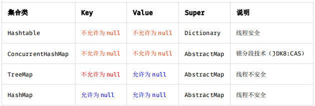

# 编码规约

## 命名风格

Java本身的规则：

- 只能由字母、数字、下划线、美元符号组成
- 不能以数字开头
- 不能以关键字或保留字开头

以下规则都是在此基础之上的规则：

- 所有的命名不能以下划线或美元符号开头或结尾。

- 不能使用中文、拼音、拼音英文混合。

- 见名知意。

- 类名：
  - 大驼峰风格，每个单词的首次都大写，但DO / BO / DTO / VO / AO / PO / UID 等例外。
  - 抽象类：以 Abstract 或 Base 开头。
  - 异常类：以 Exception 结尾。
  - 测试类：以要测试的类开始，以Test结尾。
  - POJO 类：布尔类型的变量不能以 is 开头。
- 方法名、参数名、成员变量、局部变量：
  - 小驼峰风格，只有第一个单词小写，其他的都大写。
- 常量：
  - 所有字母大写，单词之间用下划线分隔。
- 数组：
  - 中括号要紧挨类型名，例如：int[] arr;
- 包名：全部小写，单数。但是工具类有复数的含义，类名可以复数。

- 使用尽量完整的单词 组合来表达其意。

正例：在 JDK 中，表达原子更新的类名为：`AtomicReferenceFieldUpdater`。

反例：变量 int a 的随意命名方式。

- 使用了设计模式，在命名时要体现。

正例：

```java
public class OrderFactory; 

public class LoginProxy; 

public class ResourceObserver;
```

- 接口：

  - 属性和方法不要加任何修饰符（public也不要加），保持代码简洁。

  - 配上有效的Javadoc注释。

  - 尽量不要定义变量，一定要定义也是和接口有关的常量。

  - 如果是形容能力的接口名称，取对应的形容词为接口名（通常是–able 的形式）。 

    正例：AbstractTranslator 实现 Translatable 接口。

- 实现类：

  - 实现类用 Impl 的后缀与接口区别。

  正例：CacheServiceImpl 实现 CacheService 接口。

- 枚举（参考）：

  - 枚举类名带上Enum后缀。
  - 成员全部大写，用下划线分隔单词。

- 各层命名规约（参考）： 

  - A) Service/DAO 层方法命名规约 
    - 1） 获取单个对象的方法用 get 做前缀。
    -  2） 获取多个对象的方法用 list 做前缀，复数形式结尾如：listObjects。 
    - 3） 获取统计值的方法用 count 做前缀。 
    - 4） 插入的方法用 save/insert 做前缀。 
    - 5） 删除的方法用 remove/delete 做前缀。 
    - 6） 修改的方法用 update 做前缀。 
  - B) 领域模型命名规约 
    - 1） 数据对象：xxxDO，xxx 即为数据表名。 
    - 2） 数据传输对象：xxxDTO，xxx 为业务领域相关的名称。 
    - 3） 展示对象：xxxVO，xxx 一般为网页名称。 
    - 4） POJO 是 DO/DTO/BO/VO 的统称，禁止命名成 xxxPOJO。

## 常量的定义

- 不允许任何魔法值（即未经预先定义的常量）直接出现在代码中。 

  反例：String key = "Id#taobao_" + tradeId; cache.put(key, value);

- 给long或Long赋值时，数值后面用L，不用小写，因为容易跟1混淆。、

- 根据常量的功能对常量进行分类，写在不同的类中。

- 常量复用的不同层次：

  1） 类内共享常量：直接在类内部 private static final 定义。

  2） 包内共享常量：即在当前包下单独的 constant 目录下。

  3） 子工程内部共享常量：即在当前子工程的 constant 目录下。

  4） 应用内共享常量：放置在一方库中，通常是子模块中的 constant 目录下。 

  反例：易懂变量也要统一定义成应用内共享常量，两位攻城师在两个类中分别定义了表示 “是”的变量：

   类 A 中：public static final String YES = "yes";

   类 B 中：public static final String YES = "y";

   A.YES.equals(B.YES)，预期是 true，但实际返回为 false，导致线上问题。

  5） 跨应用共享常量：放置在二方库中，通常是 client.jar 中的 constant 目录下。 

- 如果变量值仅在一个固定范围内变化用 enum 类型来定义。

  说明：如果存在名称之外的延伸属性应使用 enum 类型，下面正例中的数字就是延伸信息，表 示一年中的第几个季节。 

  正例： 

  ```java
  public enum SeasonEnum {
   SPRING(1), SUMMER(2), AUTUMN(3), WINTER(4);
   private int seq;
   SeasonEnum(int seq){
     this.seq = seq;
   }
  }
  ```

## 代码格式

- 大括号：次行风格。
- 小括号：括号内，左括号与字符不能有空格，右括号和字符也不能有空格。
- if/for/while/switch/do 等关键字与括号（大，小）之间都必须加空格。
- 任何二目、三目运算符的左右两边都需要加一个空格。 说明：运算符包括赋值运算符=、逻辑运算符&&、加减乘除符号等。
- 缩进：用4格空格。
- 注释：双斜线和注释内容之间要有一个空格。
- 换行：
  - 第二行缩进4个空格，从第三行开始不缩进。
  - 带上运算符一起缩进。
  - 在逗号后面换行。
  - 括号前不要换行。
- 方法参数：逗号后面必须加空格。

- 方法：不要操作80行（包括注释，空行等）
- 添加空行（推荐）：在不同的逻辑、语义、业务中添加一个空行可以提升可读性。

## OOP规约

- 不要用对象调用静态资源，会添加编译器解析成本。

- 所有的覆写的方法，都必须加上@Override注解。

- 可变参数：相同参数类型、业务含义才可以用可变参数，避免使用Object。但是尽量不要用可变参数。

- 正在调用的接口不允许修改方法名，避免对调用方产生影响。

- 过时接口必须要用@Deprecated注解，并清晰说明新接口是什么。

- 不能使用过时的方法或类。接口方既然明确是过时的接口，那就一定有新接口。

- 使用常量或确定有值的对象调用equals

  正例："test".equals(object); 

  反例：object.equals("test");

  说明：推荐使用 java.util.Objects#equals（JDK7 引入的工具类）

- 相同类型的包装类在比较时，要使用equals进行比较。因为在-128到127之间的对象会复用，但是之外的对象不会复用，因此在比较时统一使用equals。
- 基本数据类型和包装类的使用标准：
  - 所有POJO类的属性必须用包装类。
  - RPC方法的返回值和参数必须使用包装类。
  - 所有的局部变量使用基本数据类型。

- 定义 DO/DTO/VO 等 POJO 类时，不要设定任何属性默认值。

- 序列化类新增属性时，请不要修改 serialVersionUID 字段，避免反序列失败；如

  果完全不兼容升级，避免反序列化混乱，那么请修改 serialVersionUID 值。

- 构造方法不能有业务逻辑，如果有初始化逻辑，要放入init方法中。

- POJO 类必须写 toString 方法。使用 IDE 中的工具：source> generate toString

时，如果继承了另一个 POJO 类，注意在前面加一下 super.toString。

- 禁止在 POJO 类中，同时存在对应属性 xxx 的 isXxx()和 getXxx()方法。

说明：框架在调用属性 xxx 的提取方法时，并不能确定哪个方法一定是被优先调用到。

- 使用索引访问用 String 的 split 方法得到的数组时，需做最后一个分隔符后有无

内容的检查，否则会有抛 IndexOutOfBoundsException 的风险。

- 类内方法定义的顺序依次是：公有方法或保护方法 > 私有方法 > getter/setter

  方法，当一个类有多个构造方法，或者多个同名方法，这些方法应该按顺序放置在一起，

  便于阅读。

- setter 方法中，参数名称与类成员变量名称一致，this.成员名 = 参数名。在

  getter/setter 方法中，不要增加业务逻辑，增加排查问题的难度。

- 循环体内，使用 StringBuilder 的 append 方法进行字符串连接方式扩展。

- final 可以声明类、成员变量、方法、以及本地变量，下列情况使用 final 关键字：

  1） 不允许被继承的类，如：String 类。

  2） 不允许修改引用的域对象。

  3） 不允许被重写的方法，如：POJO 类的 setter 方法。

  4） 不允许运行过程中重新赋值的局部变量。

  5） 避免上下文重复使用一个变量，使用 final 描述可以强制重新定义一个变量，方便更好

  地进行重构。

- 慎用 Object 的 clone 方法来拷贝对象。

  对象的 clone 方法默认是浅拷贝，若想实现深拷贝需要重写 clone 方法实现域对象的

  深度遍历式拷贝。

- 类成员与方法访问控制从严：

  1） 如果不允许外部直接通过 new 来创建对象，那么构造方法必须是 private。

  2） 工具类不允许有 public 或 default 构造方法。

  3） 类非 static 成员变量并且与子类共享，必须是 protected。

  4） 类非 static 成员变量并且仅在本类使用，必须是 private。

  5） 类 static 成员变量如果仅在本类使用，必须是 private。

  6） 若是 static 成员变量，考虑是否为 final。

  7） 类成员方法只供类内部调用，必须是 private。

  8） 类成员方法只对继承类公开，那么限制为 protected。

## 集合处理

- hashCode 和 equals ：

  - 只要重写了 equals ，就必须重写hashCode
  - Set存储的是不重复的对象，且是依据hashCode和equals进行判断，所以用Set存储的对象必须重写这两个方法。
  - 自定义对象作为Map的键，必须重写hashCode和equals。

  注：String重写了hashCode和equals，可以直接用。

- SubList不能强转为ArrayList。

- 在 subList 场景中，高度注意对原集合元素的增加或删除，均会导致子列表的遍历、

  增加、删除产生 ConcurrentModificationException 异常。

- 集合转数组用toArray(T[] array)，要传入类型一样的数组，生成的数组的大小是list.size()

  正例：

  ```java
  List<String> list = new ArrayList<String>(2); 
  list.add("guan"); 
  list.add("bao"); 
  String[] array = new String[list.size()]; 
  array = list.toArray(array);
  ```

- 数组转集合：

使用工具类 Arrays.asList()把数组转换成集合时，不能使用其修改集合相关的方

法，它的 add/remove/clear 方法会抛出 UnsupportedOperationException 异常。

说明：asList 的返回对象是一个 Arrays 内部类，并没有实现集合的修改方法。Arrays.asList

体现的是适配器模式，只是转换接口，后台的数据仍是数组。

 String[] str = new String[] { "you", "wu" };

 List list = Arrays.asList(str);

第一种情况：list.add("yangguanbao"); 运行时异常。

第二种情况：str[0] = "gujin"; 那么 list.get(0)也会随之修改。

- 不要在 foreach 循环里进行元素的 remove/add 操作。remove 元素请使用 Iterator

  方式，如果并发操作，需要对 Iterator 对象加锁。

  正例：

  ```
  List<String> list = new ArrayList<>(); 
  list.add("1"); 
  list.add("2"); 
  Iterator<String> iterator = list.iterator(); 
  while (iterator.hasNext()) { 
  	String item = iterator.next(); 
  	if (删除元素的条件) { 
  		iterator.remove(); 
  	} 
  }
  ```

  反例：

  ```
  for (String item : list) { 
  	if ("1".equals(item)) { 
  		list.remove(item); 
  	} 
  }
  ```

- 在 JDK7 版本及以上，Comparator 实现类要满足如下三个条件，不然 Arrays.sort，

  Collections.sort 会报 IllegalArgumentException 异常。

  说明：三个条件如下

  1） x，y 的比较结果和 y，x 的比较结果相反。

  2） x>y，y>z，则 x>z。

  3） x=y，则 x，z 比较结果和 y，z 比较结果相同。

  反例：下例中没有处理相等的情况，实际使用中可能会出现异常：

  ```
  new Comparator<Student>() { 
  	@Override 
  	public int compare(Student o1, Student o2) { 
  		return o1.getId() > o2.getId() ? 1 : -1; 
  	} 
  };
  ```

- 集合泛型定义时，在 JDK7 及以上，使用 diamond 语法或全省略。

​	说明：菱形泛型，即 diamond，直接使用<>来指代前边已经指定的类型。

​	正例：

​	// <> diamond 方式

​	HashMap<String, String> userCache = new HashMap<>(16);

​	// 全省略方式

​	ArrayList<User> users = new ArrayList(10); 

- 集合初始化时，指定集合初始值大小。

  说明：HashMap 使用 HashMap(int initialCapacity) 初始化。

  正例：initialCapacity = (需要存储的元素个数 / 负载因子) + 1。注意负载因子（即 loader 

  factor）默认为 0.75，如果暂时无法确定初始值大小，请设置为 16（即默认值）。

  反例：HashMap 需要放置 1024 个元素，由于没有设置容量初始大小，随着元素不断增加，容

  量 7 次被迫扩大，resize 需要重建 hash 表，严重影响性能。

- 使用 entrySet 遍历 Map 类集合 KV，而不是 keySet 方式进行遍历。

  说明：keySet 其实是遍历了 2 次，一次是转为 Iterator 对象，另一次是从 hashMap 中取出

  key 所对应的 value。而 entrySet 只是遍历了一次就把 key 和 value 都放到了 entry 中，效

  率更高。如果是 JDK8，使用 Map.foreach 方法。

- 高度注意 Map 类集合 K/V 能不能存储 null 值的情况，如下表格：



- 合理利用好集合的有序性(sort)和稳定性(order)，避免集合的无序性(unsort)和

不稳定性(unorder)带来的负面影响。

说明：有序性是指遍历的结果是按某种比较规则依次排列的。稳定性指集合每次遍历的元素次

序是一定的。如：ArrayList 是 order/unsort；HashMap 是 unorder/unsort；TreeSet 是

order/sort。

- 利用 Set 元素唯一的特性，可以快速对一个集合进行去重操作，避免使用 List 的

  contains 方法进行遍历、对比、去重操作。

## 注释规约

- 类、属性、类方法必须用文档注释。因为可以通过IDE的悬浮窗看到提示，提高阅读效率。

- 类：

  - 所有类必须有创建者和日期。

- 方法：

  - 所有的抽象方法的文档注释必须包含返回值、参数、异常、功能。
  - 在方法内部使用单行注释，且写在被注释的上方。
  - 枚举类型字段必须要有注释，并且说明用户。

- 修改代码时注释也要改，尤其是参数、返回值、异常、核心逻辑等的修改。

- 注释掉的代码要有说明，而不是简单地注释掉。如果无用，则删除。

- 注释要准确反应设计思维或代码逻辑或业务含义。

- 【参考】特殊注释标记，请注明标记人与标记时间。注意及时处理这些标记，通过标记扫描，

  经常清理此类标记。线上故障有时候就是来源于这些标记处的代码。

  1） 待办事宜（TODO）:（ 标记人，标记时间，[预计处理时间]）

  表示需要实现，但目前还未实现的功能。这实际上是一个 Javadoc 的标签，目前的 Javadoc

  还没有实现，但已经被广泛使用。只能应用于类，接口和方法（因为它是一个 Javadoc 标签）。

  2） 错误，不能工作（FIXME）:（标记人，标记时间，[预计处理时间]）

  在注释中用 FIXME 标记某代码是错误的，而且不能工作，需要及时纠正的情况。

# 单元测试

- 单元测试要遵守AIR原则：

  - **Automatic(自动化)**：单元测试要全自动执行，非交互式，因为单元测试要定期执行，自动化才有意义。单元测试不能用System.out一定要用assert。

  - **Independent(独立性)**：单元测试之间不能相互依赖，也不能依赖先后顺序。

  - **Repeatable(可重复)。**：单元测试要保证能重复执行，不受外界影响，否则可能会影响持续集成。为了不受外界的影响可以用依赖注入。

- 单元测试的颗粒度一般在方法级别，最多是类级别。

- 核心业务、核心应用、核心模块的增量代码确保单元测试通过。

  新增代码及时补充单元测试，如果新增代码影响了原有单元测试，请及时修正。

- 单元测试代码必须写在如下工程目录：src/test/java，不允许写在业务代码目录下。

  说明：源码构建时会跳过此目录，而单元测试框架默认是扫描此目录。

- 语句覆盖率达到 70%；核心模块的语句覆盖率和分支覆盖率都要达到 100%。

  在工程规约的应用分层中提到的 DAO 层，Manager 层，可重用度高的 Service，都应该进行单元测试。

- 编写单元测试代码遵守 BCDE 原则，以保证被测试模块的交付质量。

   B：Border，边界值测试，包括循环边界、特殊取值、特殊时间点、数据顺序等。

   C：Correct，正确的输入，并得到预期的结果。

   D：Design，与设计文档相结合，来编写单元测试。

   E：Error，强制错误信息输入（如：非法数据、异常流程、非业务允许输入等），并得到预期的结果。

- 对于数据库相关的查询，更新，删除等操作，不能假设数据库里的数据是存在的，

  或者直接操作数据库把数据插入进去，请使用程序插入或者导入数据的方式来准备数据。

- 和数据库相关的单元测试，可以设定自动回滚机制，不给数据库造成脏数据。或者

  对单元测试产生的数据有明确的前后缀标识。

  正例：在 RDC 内部单元测试中，使用 RDC_UNIT_TEST_的前缀标识数据。

- 单元测试作为一种质量保障手段，不建议项目发布后补充单元测试用例，建议在项

  目提测前完成单元测试。

- 为了更方便地进行单元测试，业务代码应避免以下情况：

   构造方法中做的事情过多。

   存在过多的全局变量和静态方法。

   存在过多的外部依赖。

   存在过多的条件语句。

  说明：多层条件语句建议使用卫语句、策略模式、状态模式等方式重构。


